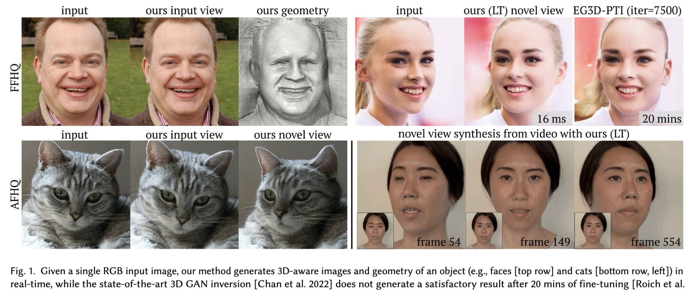
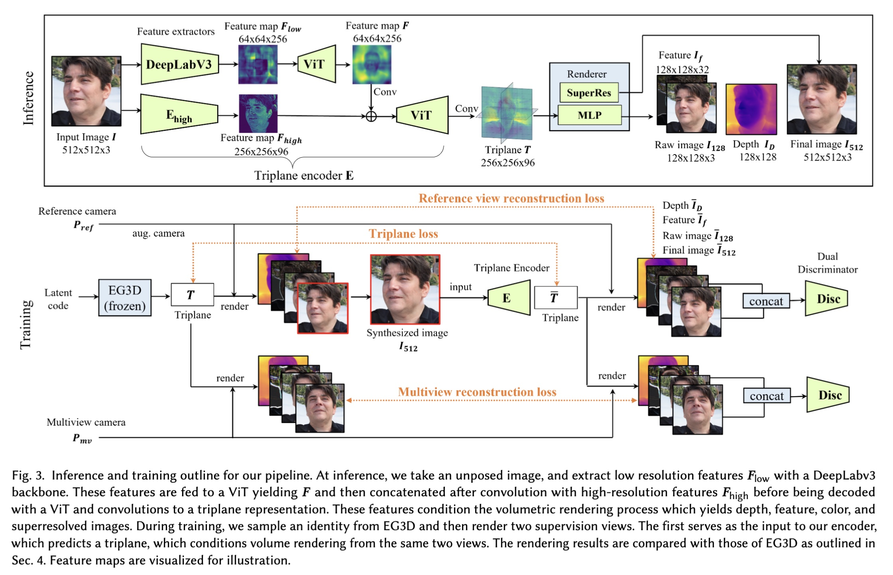
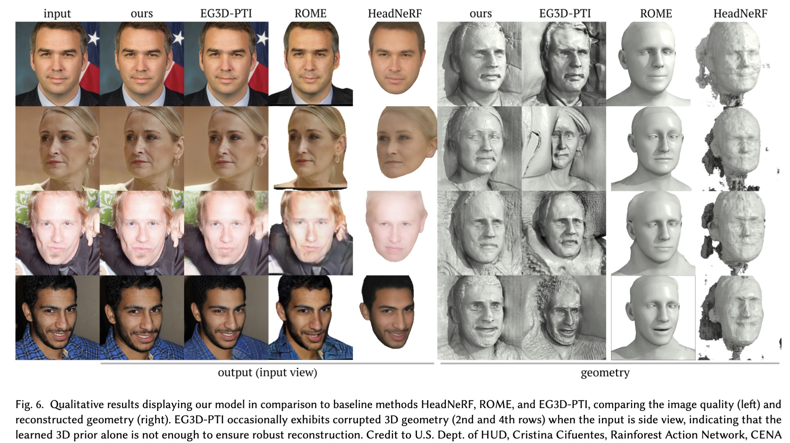

# Real-Time Radiance Fields for Single-Image Portrait View Synthesis

## Introduction
- **Project**: https://research.nvidia.com/labs/nxp/lp3d/
- **Code**: https://github.com/Dong142857/Live3DPortrait(unofficial)

This paper proposed a EG3D[^1] version of StyleGAN encoder, which can generated 3D-consistent novel views from a single image.
. To train this encoder, they only used the data generated from ED3G and the experiments show the great generalization ability to the real images.

**Authors**:
- Alex Trevithick - UC San Diego
- Matthew Chan, Michael Stengel - NVIDIA, USA

**Keywords**: Image-based rendering, View Synthesis, Inverse Rendering, Neural Radiance Field

**Publication**: SIGGRAPH 2023

## Method

- Use EG3D to generate image with different views and their corresponding triplane features for **multiveiw reconstruction loss** and **triplane loss**
- Use the pretrained EG3D dual discriminator for GAN training
- Use visual transformer(ViT)[^3] in Triplane encoder to create a canonicalized 3D representation of the subject and use the high resolution feature map($F_high$) to capture detailed information

## Highlight
- realtime(24fps in RTX3090)
- only need the pre-trained EG3D. Otherwise, the real data(image-3D pair) used to train such network is quite difficult to got. Note that the training data of EG3D is the images and its corresponding camera parameters, which can be got from single-image 3D reconstruction network.
- camera augmentation is crucial for the training. (use different camera parameters to generate images from EG3D)
- experiments show the PTI-like[^2] approach is not comparable even after a long time optimization.
- the comparison with other methods shows that this approach can generate more reasonable 3D structure

## Limitation
- Since the model is based on EG3D, it can not generate the good results for large head poses(yaw > 60 degrees)

## Comments

[^1]: Efficient Geometry-aware 3D Generative Adversarial Network. [Note](https://github.com/pomelyu/paper-reading-notes/issues/7)
[^2]: Pivotal Tuning for Latent-based editing of Real Images
[^3]
