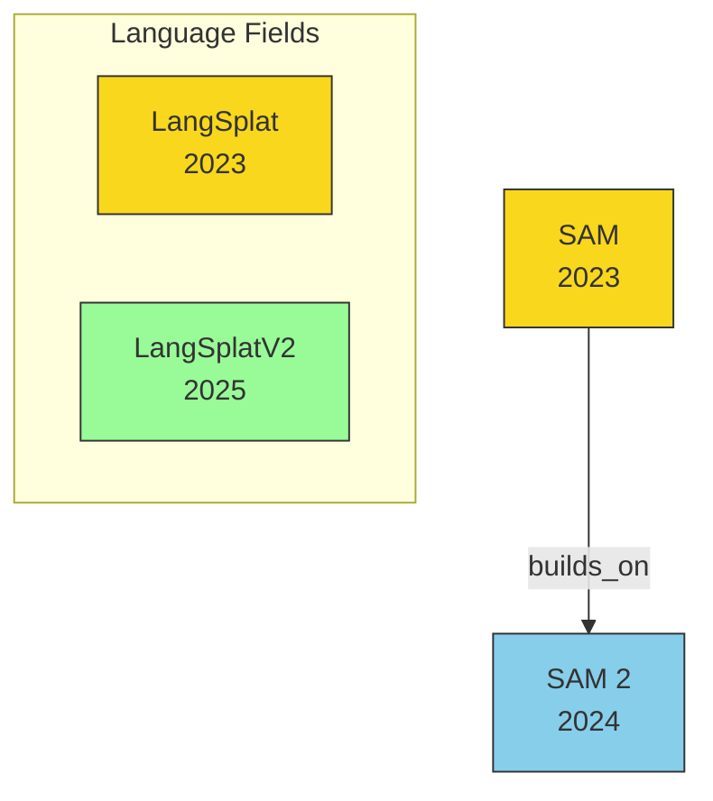

# Update Knowledge Graph Skill

You are incrementally updating the paper knowledge graph. The key principle
is: **only read and process what has changed**, then patch the existing graph.

---

## Step 1 — Determine update scope

Check if the user passed `--full`. If so, skip to **Full Rebuild** below.

Otherwise, detect which paper notes changed by running:

```bash
git diff --name-only HEAD~1 -- '20*/*/README.md'
```

If this returns nothing (e.g., no recent commits), also check for unstaged
or untracked paper notes:

```bash
git diff --name-only -- '20*/*/README.md'
git ls-files --others --exclude-standard -- '20*/*/README.md'
```

Combine the results into a **changed file list**. If the list is empty,
tell the user "Knowledge graph is already up to date — no paper notes have
changed." and stop.

If this is the **first time running** (i.e., `aim_read_graph` returns an
empty graph with no entities), automatically switch to Full Rebuild mode.

---

## Step 2 — Read only changed papers

For each file in the changed list, read the README.md and extract:

- **Title**: the `# ` heading on line 1
- **Authors**: from `- **Authors:**` line
- **Year**: from the folder path (e.g., `2024/...` → 2024)
- **Published**: from `- **Published:**` line
- **Keywords**: from `- **Keywords:**` line (comma-separated list)
- **Folder path**: relative path like `2024/Street_Gaussians-.../`

---

## Step 3 — Extract relationships from changed papers

If the changed paper has a `### Comparison Papers` section, parse the three
sub-tables:

- `#### Predecessors` → relation type: `builds_on`
- `#### Contemporaries / Competitors` → relation type: `competes_with`
- `#### Successors / Extensions` → relation type: `succeeded_by`

Extract each row's paper name, authors, year, and the "Relation" column
description.

---

## Step 4 — Patch the knowledge graph via MCP

Use the `aim_` prefixed tools from the `knowledge-graph` MCP server.

### 4a. Read current graph state

Call `aim_read_graph` to get existing entities and relations.

### 4b. Upsert the changed paper entity

For each changed paper, check if an entity with that name already exists:

- **If it exists**: call `aim_add_observations` to update/add any changed
  observations. If observations need correction, call
  `aim_delete_observations` first for the stale ones, then add new ones.
- **If it doesn't exist**: call `aim_create_entities`:
  ```json
  {
    "name": "<paper title>",
    "entityType": "paper",
    "observations": [
      "Year: <year>",
      "Authors: <authors>",
      "Published: <venue>",
      "Keywords: <keyword1>, <keyword2>, ...",
      "Path: <folder path>",
      "Has note: true"
    ]
  }
  ```

### 4c. Upsert referenced papers (lightweight entities)

For papers in the comparison tables that do NOT already exist in the graph
AND do not have their own note in the repo:

```json
{
  "name": "<paper title>",
  "entityType": "paper",
  "observations": [
    "Year: <year>",
    "Has note: false",
    "Referenced by: <referencing paper title>"
  ]
}
```

Skip creating these if they already exist in the graph.

### 4d. Upsert relations

For each relationship from the comparison tables, check if the relation
already exists in the graph. Only call `aim_create_relations` for **new**
relations that don't already exist.

```json
{
  "from": "<paper A title>",
  "to": "<paper B title>",
  "relationType": "builds_on | competes_with | succeeded_by"
}
```

### 4e. Update topic clusters

Check if the changed paper's keywords match existing topic entities. If so,
add `belongs_to` relations. If a new topic emerges (2+ papers share a theme
not yet captured), create a topic entity:

```json
{
  "name": "<topic name>",
  "entityType": "topic",
  "observations": ["Papers: <paper1>, <paper2>, ..."]
}
```

Major topics to recognize:
- "3D Gaussian Splatting"
- "Segmentation / Foundation Models"
- "Autonomous Driving"
- "Language Fields / Open-Vocabulary"
- "Dynamic Scenes"

---

## Step 5 — Regenerate KNOWLEDGE_GRAPH.md

After patching the graph, call `aim_read_graph` to get the **full** current
state, then regenerate `KNOWLEDGE_GRAPH.md` at the repo root.

### 5a. Mermaid diagram

Generate a `graph TD` diagram from the full graph:
- Paper nodes use short names (not full titles), labeled with year
- Edges labeled with relation type
- Group papers into subgraphs by topic cluster
- Color-code by year using `classDef`



### 5b. Paper index table

| Paper | Year | Keywords | Related Papers |
|---|---|---|---|

### 5c. Topic clusters

For each topic, list member papers and their key relationships.

---

## Step 6 — Report

Output a brief summary:
- Which papers were processed (list the changed ones)
- How many entities created vs. updated
- How many new relations added
- Any new topic clusters

---

## Full Rebuild mode (`--full`)

When triggered by `--full` flag or first-time run:

1. Use Glob to find ALL `20*/*/README.md` files
2. Call `aim_read_graph` — if entities exist, delete them all with
   `aim_delete_entities` to start fresh
3. Read every paper README and extract metadata + relationships
4. Create all entities, relations, and topic clusters from scratch
5. Generate `KNOWLEDGE_GRAPH.md`
6. Report total counts

---

## Notes

- **Incremental by default**: only reads changed files, only creates
  missing entities/relations. This keeps the skill fast.
- **Idempotent**: running multiple times without changes does nothing.
- **`--full` for recovery**: if the graph gets out of sync, use
  `/update-graph --full` to rebuild from scratch.
- If `aim_` tools are not available, the MCP server hasn't loaded yet.
  Still generate `KNOWLEDGE_GRAPH.md` from file reads and tell the user
  to restart Claude Code, then run `/update-graph` again.
- Batch MCP calls where possible (up to 10 entities per call).
