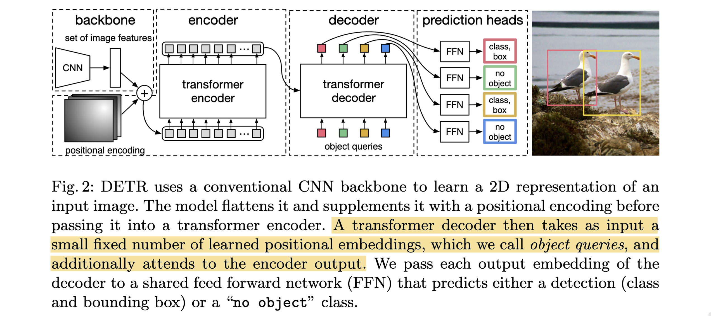

# End-to-End Object Detection with Transformers

- **Authors:** Nicolas Carion, Francisco Massa, Gabriel Synnaeve, Nicolas Usunier, Alexander Kirillov, Sergey Zagoruyko
- **Affiliations:** Facebook AI
- **Published:** ECCV 2020 (arXiv:2005.12872), 28 May 2020
- **Keywords:** object detection, set prediction, transformers, bipartite matching, Hungarian loss, panoptic segmentation
- **GitHub:** https://github.com/facebookresearch/detr

---

## Pass 1 — Bird's-Eye View

| C | Assessment |
|---|-----------|
| **Category** | Method / architecture paper. Introduces a new end-to-end object detection framework (DETR) that reframes detection as a direct set-prediction problem. |
| **Context** | Builds on the transformer encoder-decoder (Vaswani et al. 2017), CNN backbones (ResNet, He et al. 2016), and the bipartite-matching / set-loss lineage from earlier direct-set-prediction attempts (Stewart et al., recurrent detectors). Positioned explicitly against the highly-tuned Faster R-CNN baseline and its anchor/NMS[^1] machinery. |
| **Correctness** | Sound. Claims are backed by controlled COCO experiments with fair (re-tuned) baselines and extensive ablations. The main acknowledged limitation — poor small-object AP[^2] and very long training — is honestly reported rather than hidden. |
| **Contributions** | (1) A detection pipeline with **no anchors, no NMS, no hand-crafted components**; (2) a **set-based global loss** enforcing unique predictions via bipartite (Hungarian) matching; (3) a transformer encoder-decoder with learned **object queries** that reason globally and predict all boxes in parallel; (4) a simple extension to **panoptic segmentation** that outperforms strong baselines. |
| **Clarity** | Very clear and well organized. The method is presented conceptually first, then formalized; figures (pipeline, decoder attention, slot specialization) are illustrative and memorable. |



**30-second summary.** DETR ("DEtection TRansformer") drops the entire hand-designed detection pipeline — anchors, proposals, and NMS post-processing — by casting object detection as direct set prediction. A CNN extracts image features, a transformer encoder-decoder processes them with a fixed set of $N$ learned "object queries," and each query is decoded (in parallel) into either a box+class or "no object." Training uses a bipartite matching (Hungarian algorithm) between the $N$ predictions and the padded ground-truth set, followed by a Hungarian loss combining classification NLL and a box loss ($\ell_1$ + generalized IoU). On COCO, DETR matches a heavily-tuned Faster R-CNN (44.9 AP for DETR-DC5-R101), excelling on large objects but lagging on small ones, and extends trivially to panoptic segmentation. It is conceptually simple (~50 lines of core inference code) but requires very long training (300–500 epochs).

[^1]: **NMS** — Non-Maximum Suppression. See the [glossary](../../common/terms/).
[^2]: **AP** — Average Precision. See the [glossary](../../common/terms/).

---

## Pass 2 — Careful Read

### Core Idea in One Sentence
Treat object detection as a direct set-prediction problem: predict a fixed-size set of boxes in parallel with a transformer, and train it with a bipartite-matching loss that forces each ground-truth object to be claimed by exactly one prediction — eliminating anchors, proposals, and NMS.

### Method / Approach
- **Set prediction with a fixed slot count:** DETR always outputs $N$ predictions (e.g. $N=100$), far more than typical objects per image. Excess slots learn to predict a special $\varnothing$ ("no object") class, playing the role of "background."
- **Bipartite matching (Hungarian):** At training time an optimal one-to-one assignment $`\hat{\sigma}`$ between predictions and (padded) ground truth is found via the Hungarian algorithm, using a matching cost that combines class probability and box similarity. This uniqueness is what removes the need for NMS.
- **Transformer encoder-decoder with object queries:** A ResNet backbone produces a feature map, reduced to dimension $d$ and flattened into a sequence with fixed sine positional encodings; the encoder applies global self-attention. The decoder takes $N$ learned positional embeddings (**object queries**) and decodes them in parallel (non-autoregressive), attending to encoder features to reason about all objects and global context jointly.
- **Set loss = Hungarian loss:** Given the matching, the loss is a class NLL plus a box loss that is a weighted sum of $\ell_1$ and generalized IoU (scale-invariant). Auxiliary losses are added after every decoder layer to stabilize training.

### Key Results

COCO 2017 val, comparison with Faster R-CNN (higher is better; `+` = re-tuned baseline with GIoU + crop aug + 9× schedule):

| Model | GFLOPS/FPS | #params | AP | $AP_S$ | $AP_M$ | $AP_L$ |
|-------|-----------|---------|----|--------|--------|--------|
| Faster RCNN-R101-FPN+ | 246 / 20 | 60M | 44.0 | 27.2 | 48.1 | 56.0 |
| Faster RCNN-R50-FPN+ | 180 / 26 | 42M | 42.0 | 26.6 | 45.4 | 53.4 |
| **DETR** (R50) | 86 / 28 | 41M | 42.0 | 20.5 | 45.8 | 61.1 |
| **DETR-DC5** (R50) | 187 / 12 | 41M | 43.3 | 22.5 | 47.3 | 61.1 |
| **DETR-R101** | 152 / 20 | 60M | 43.5 | 21.9 | 48.0 | 61.8 |
| **DETR-DC5-R101** | 253 / 10 | 60M | **44.9** | 23.7 | 49.5 | **62.3** |

- **Large vs. small objects:** With matched params/FLOPs, DETR beats Faster R-CNN by **+7.8 $AP_L$** but trails by **−5.5 $AP_S$** — the signature strength/weakness of the global-attention design.
- **Encoder depth matters:** 0 → 6 encoder layers lifts AP from 36.7 to 40.6 (largest gains on big objects), confirming global self-attention disentangles instances.
- **Loss ablation:** GIoU carries most of the box performance; $\ell_1$ alone is poor (35.8 AP), the combination gives 40.6.
- **Positional encodings:** removing spatial position encodings drops AP sharply (40.6 → 32.8).
- **Panoptic:** DETR-R101 reaches **45.1 PQ**, outperforming UPSNet and PanopticFPN baselines, especially on "stuff" classes (via encoder global reasoning).

### Strengths
- **Conceptual simplicity:** No anchors, no NMS, no proposal sampling, no custom layers — reproducible in any framework with a stock CNN + transformer.
- **Truly end-to-end:** The set loss is differentiable through a fixed, permutation-invariant assignment; the model learns duplicate suppression rather than having it engineered.
- **Global reasoning:** Self- and cross-attention let every prediction use whole-image context and pairwise object relations, yielding excellent large-object and "stuff" performance.
- **Extensibility:** A small mask head on top of the frozen detector gives competitive panoptic segmentation in a unified things+stuff manner.

### Weaknesses / Open Questions
1. **Small-object performance:** DETR lags Faster R-CNN by ~5.5 AP$_S$; single-scale features and no FPN-style multi-scale pyramid hurt small objects.
2. **Very long training:** 300 epochs (baseline) to 500 epochs (to beat Faster R-CNN) — 3+ days on 16 V100s — far slower to converge than standard detectors, due to the sparse Hungarian matching signal.
3. **Fixed slot count $N$:** Performance and generalization depend on $N$ being large enough; behavior with images exceeding the trained object-count distribution needs the synthetic-image sanity check to reassure.
4. **Attention cost:** Encoder self-attention is quadratic in feature-map size, making high-resolution (small-object-friendly) variants (DC5) expensive (~2× FLOPs, halved FPS).
5. **Matching instability early in training:** The one-to-one assignment can be noisy at initialization; auxiliary decoder losses are needed and later work shows the matching itself is a convergence bottleneck.

### References to Follow Up
1. **Attention Is All You Need** — Vaswani et al., NeurIPS 2017: the transformer encoder-decoder DETR adapts for parallel set decoding.
2. **Deep Residual Learning for Image Recognition** — He et al., CVPR 2016: the ResNet backbone providing DETR's image features.
3. **Faster R-CNN: Towards Real-Time Object Detection with Region Proposal Networks** — Ren et al., NeurIPS 2015: the anchor-based baseline DETR is measured against and aims to simplify.
4. **Generalized Intersection over Union** — Rezatofighi et al., CVPR 2019: the scale-invariant box loss essential to DETR's localization.
5. **Feature Pyramid Networks for Object Detection** — Lin et al., CVPR 2017: multi-scale features whose absence explains DETR's small-object gap (and motivates deformable successors).

---

## Pass 3 — Virtual Re-implementation

### Detailed Technical Summary

**Backbone.** An input image $`x_{img} \in R^{3 \times H_0 \times W_0}`$ is passed through a conventional CNN (ImageNet-pretrained ResNet with frozen BatchNorm) to produce a lower-resolution activation map $f \in R^{C \times H \times W}$ , with typical $C = 2048$ and $H, W = H_0/32, W_0/32$ . A $1\times1$ convolution reduces channels from $C$ to a smaller transformer dimension $d$ , giving $z_0 \in R^{d \times H \times W}$ , which is flattened spatially into a sequence of length $HW$ .

**Transformer encoder.** Each of the (6) encoder layers is a standard block: multi-head self-attention + FFN[^3]. Because attention is permutation-invariant, **fixed sine positional encodings** are added to the queries and keys at every attention layer to inject spatial location. The encoder output is a set of $HW$ context-enriched feature tokens.

**Transformer decoder.** The decoder takes $N$ learned input embeddings called **object queries** — these are learned positional encodings, added to the input of each decoder attention layer. Unlike the autoregressive original transformer, DETR decodes all $N$ objects **in parallel** at each decoder layer via self-attention (among queries, to model pairwise object relations and avoid duplicates) and encoder-decoder cross-attention (queries attend to image features). The $N$ output embeddings are decoded independently into boxes and classes.

**Prediction FFNs.** Each decoder output embedding is fed to a shared 3-layer perceptron (ReLU, hidden dim $d$ ) predicting the **normalized center coordinates, height, and width** of the box, plus a linear+softmax layer predicting the class (including $\varnothing$ ). Prediction heads are shared across decoder layers, with a shared layer-norm.

**Set prediction loss — step 1, matching.** Let $y$ be the ground-truth set padded with $\varnothing$ to size $N$ , and $`\hat{y} = \{\hat{y}_i\}_{i=1}^{N}`$ the predictions. The optimal assignment is:

```math
\hat{\sigma} = \arg\min_{\sigma \in S_N} \sum_{i}^{N} L_{match}(y_i, \hat{y}_{\sigma(i)})
```

solved with the Hungarian algorithm. Each ground truth is $y_i = (c_i, b_i)$ with class $c_i$ (possibly $\varnothing$ ) and box $b_i \in [0,1]^4$ (center, height, width, relative to image size). The pairwise matching cost uses **class probability directly** (not log-prob) and the box distance:

```math
L_{match}(y_i, \hat{y}_{\sigma(i)}) = -1_{\{c_i \neq \varnothing\}} \, \hat{p}_{\sigma(i)}(c_i) + 1_{\{c_i \neq \varnothing\}} \, L_{box}(b_i, \hat{b}_{\sigma(i)})
```

This one-to-one matching replaces the anchor/proposal heuristics of conventional detectors; the key difference is it enforces a unique prediction per object, so no NMS is needed.

**Set prediction loss — step 2, Hungarian loss.** Given $`\hat{\sigma}`$ , the training loss is:

```math
L_{Hungarian}(y, \hat{y}) = \sum_{i=1}^{N} \Big[ -\log \hat{p}_{\hat{\sigma}(i)}(c_i) + 1_{\{c_i \neq \varnothing\}} \, L_{box}(b_i, \hat{b}_{\hat{\sigma}(i)}) \Big]
```

The log-probability term for $c_i = \varnothing$ is **down-weighted by a factor 10** to counter class imbalance (analogous to Faster R-CNN's positive/negative subsampling).

**Box loss.** Boxes are predicted **directly** (not as offsets to anchors). Because $\ell_1$ has different scales for large vs. small boxes, DETR combines it with the scale-invariant **generalized IoU** loss:

```math
L_{box}(b_i, \hat{b}_{\sigma(i)}) = \lambda_{iou} L_{iou}(b_i, \hat{b}_{\sigma(i)}) + \lambda_{L1} \| b_i - \hat{b}_{\sigma(i)} \|_1
```

normalized by the number of objects in the batch.

**Auxiliary decoding losses.** Prediction FFNs + Hungarian loss are applied after **every** decoder layer (not just the last), which helps the model output the correct number of objects per class and improves convergence.

**Panoptic extension.** After training the box detector, a **mask head** is added: for each of the $N$ predicted objects it computes multi-head attention maps of the object embedding over encoder output, then upsamples via an FPN-like CNN to a mask at stride 4, supervised with DICE/F-1 + Focal loss. At inference, per-pixel argmax over the $N$ masks yields non-overlapping panoptic segmentation with no heuristic merging.

[^3]: **FFN** — Feed-Forward Network. See the [glossary](../../common/terms/).

### Hidden Assumptions
1. **The true number of objects never exceeds $N$.** With $N=100$ and COCO images having ≤63 instances, this holds — but the framework silently fails if an image has more objects than slots.
2. **A CNN feature map at stride 32 (or 16 for DC5) carries enough spatial detail.** The single-scale design implicitly assumes small objects are rare enough to tolerate the AP$_S$ penalty.
3. **Global self-attention converges to instance-separating behavior given enough training.** The 300–500 epoch schedule is an unstated prerequisite for the matching signal to shape queries into stable "slots."
4. **Object queries can learn a useful spatial/size prior.** The analysis shows each slot specializes to regions/box sizes — the method relies on this emergent specialization rather than designing it.
5. **Frozen BatchNorm + ImageNet pretraining** is assumed necessary; training the backbone BN or from scratch is not explored and implicitly assumed harmful/unstable.

### Reproducibility Notes
- **Code & weights:** Officially released at `facebookresearch/detr` with pretrained models — strong reproducibility.
- **Data:** COCO 2017 (118k train / 5k val), plus COCO panoptic annotations (53 stuff + 80 things categories).
- **Compute:** Baseline 300 epochs on **16 V100 GPUs, ~3 days**, batch size 64 (4 images/GPU); the 500-epoch schedule (to beat Faster R-CNN) adds ~1.5 AP.
- **Optimizer/hyperparameters:** AdamW, transformer LR $10^{-4}$ , backbone LR $10^{-5}$ , weight decay $10^{-4}$ , Xavier init, dropout 0.1; $d=256$ , 8 attention heads, 6 encoder + 6 decoder layers, $N=100$ queries. Scale augmentation (shortest side 480–800, longest ≤1333) plus random crop (+~1 AP).
- **Inference trick:** Overriding empty-slot predictions with the second-highest scoring class improves AP by ~2 points.
- **Underspecified:** Full panoptic-head architecture is deferred to supplementary; exact $\lambda_{iou}, \lambda_{L1}$ values and some schedule details live in the appendix (not in the pages reviewed here).

### Ideas for Future Work
1. **Multi-scale features:** Add an FPN-like pyramid or deformable attention to close the small-object gap (directly realized by Deformable DETR).
2. **Faster convergence:** Improve the matching stability (query denoising, contrastive matching, better query design) to cut the 500-epoch schedule.
3. **Efficient attention:** Replace dense encoder self-attention with sparse/deformable variants to make high-resolution DETR affordable.
4. **Better object queries:** Give queries explicit spatial/anchor priors instead of purely learned embeddings, to speed learning and improve localization.
5. **Unified perception:** Extend the set-prediction + query paradigm beyond detection/panoptic to instance segmentation, tracking, and 3D — leveraging the general "query = object" abstraction.

---

## Pass 4 — Modern Perspective Review (as of July 2026)

### What Has Changed Since Publication
- **DETR became a paradigm, not just a model.** The "learned queries + set prediction + bipartite matching" recipe is now a standard building block across detection, segmentation, tracking, and pose (Mask2Former, MOTR, etc.).
- **The convergence problem was solved.** Deformable DETR (multi-scale deformable attention), Conditional DETR, DAB-DETR (dynamic anchor boxes), and DN-DETR / DINO (query denoising) cut training from 500 epochs to ~12–50 and largely erased the small-object gap.
- **DETR-style models became SOTA.** DINO and Co-DETR topped COCO leaderboards, and the descendants routinely exceed 60 AP — well beyond the original 44.9.
- **NMS-free detection went mainstream.** The idea of one-to-one matching to remove NMS propagated even into CNN-based real-time detectors (e.g. YOLOv10's dual-label-assignment NMS-free training).
- **Backbones shifted** from ResNet to ViT/Swin and self-supervised (DINOv2/v3) features, further boosting DETR-family accuracy.

### Has the Community Accepted the Claims?
Overwhelmingly yes — DETR is a foundational, highly-cited work. The central thesis, that detection can be a fully end-to-end set-prediction problem with no anchors or NMS, is now uncontroversial and has been validated and greatly extended. The community accepted the elegance immediately but quickly identified and fixed the two practical weaknesses the paper itself flagged: slow convergence and weak small-object AP. Later work (Deformable DETR, DAB/DN-DETR, DINO) refined rather than refuted the approach, and the NMS-free training idea has even been ported back into real-time CNN detectors. DETR's panoptic idea seeded the unified mask-query segmentation line (MaskFormer/Mask2Former).

---

#### Predecessors
| Paper | Authors | Year | Relation |
|-------|---------|------|----------|
| Attention Is All You Need | Vaswani et al. | 2017 | Transformer encoder-decoder repurposed for parallel set decoding |
| Deep Residual Learning (ResNet) | He et al. | 2016 | CNN backbone producing DETR's feature map |
| Faster R-CNN | Ren et al. | 2015 | Anchor/proposal baseline DETR simplifies and is benchmarked against |
| Generalized IoU | Rezatofighi et al. | 2019 | Scale-invariant box loss used in the Hungarian loss |
| End-to-end People Detection in Crowded Scenes | Stewart et al. | 2016 | Earlier set-based detection with matching loss (recurrent) |

#### Contemporaries / Competitors
| Paper | Authors | Year | Relation |
|-------|---------|------|----------|
| Faster R-CNN (Detectron2, re-tuned) | Ren et al. / Wu et al. | 2015/2019 | Primary competing two-stage anchor detector in Table 1 |
| FCOS | Tian et al. | 2019 | Anchor-free but NMS-dependent one-stage detector, same era |
| CenterNet (Objects as Points) | Zhou et al. | 2019 | Keypoint-based anchor-free detector solving detection differently |
| UPSNet / Panoptic FPN | Xiong et al. / Kirillov et al. | 2019 | Panoptic baselines DETR outperforms in Table 5 |

#### Successors / Extensions
| Paper | Authors | Year | Relation |
|-------|---------|------|----------|
| Deformable DETR | Zhu et al. | 2021 | Multi-scale deformable attention; 10× faster convergence, fixes small objects |
| Conditional DETR | Meng et al. | 2021 | Conditional cross-attention for faster training |
| DAB-DETR | Liu et al. | 2022 | Dynamic anchor boxes as queries |
| DN-DETR / DINO | Li et al. / Zhang et al. | 2022 | Query denoising; DETR-family reaches COCO SOTA |
| MaskFormer / Mask2Former | Cheng et al. | 2021/2022 | Extends DETR's mask-query idea to unified segmentation |
| [YOLOv10: Real-Time End-to-End Object Detection](../../2024/YOLOv10-_Real-Time_End-to-End_Object_Detection/) | Wang et al. | 2024 | Adopts DETR's NMS-free one-to-one matching idea in a real-time CNN detector |

---

### Bottom Line
DETR is a **foundational classic** and absolutely still worth reading. It is one of the papers that reshaped how the vision community thinks about detection: not as dense anchor classification cleaned up by NMS, but as direct set prediction with learned object queries and bipartite matching. Even though every quantitative result here has been superseded — modern DETR descendants train an order of magnitude faster and score 15+ AP higher — the conceptual framework, the loss formulation, and the "query = object" abstraction introduced in this paper are exactly what those successors build on. Read it for the ideas and the clean formulation, then read Deformable DETR and DINO to see how its two acknowledged weaknesses (slow convergence, small objects) were resolved.
