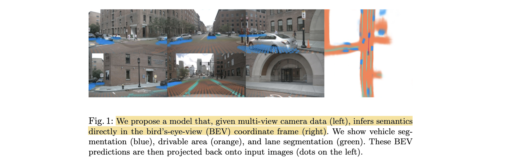
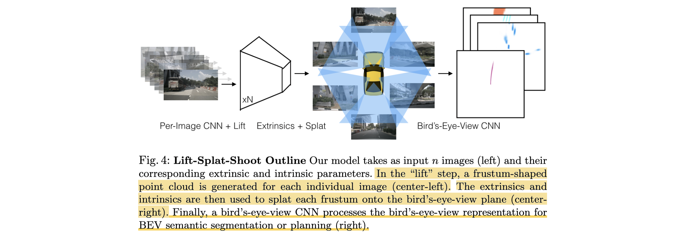
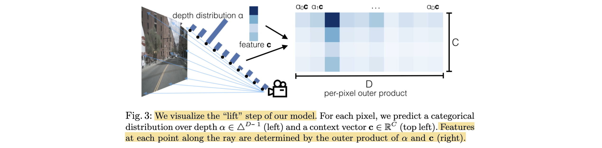

# Lift, Splat, Shoot: Encoding Images from Arbitrary Camera Rigs by Implicitly Unprojecting to 3D

- **Authors:** Jonah Philion, Sanja Fidler
- **Affiliations:** NVIDIA, University of Toronto, Vector Institute
- **Published:** ECCV 2020 (arXiv:2008.05711)
- **Keywords:** bird's-eye-view, autonomous driving, multi-view perception, monocular depth, sensor fusion, BEV segmentation, motion planning
- **Webpage:** https://nv-tlabs.github.io/lift-splat-shoot/
- **GitHub:** https://github.com/nv-tlabs/lift-splat-shoot

---

## Pass 1 — Bird's-Eye View

| C | Assessment |
|---|-----------|
| **Category** | A new end-to-end architecture (systems + representation-learning) for camera-only autonomous-driving perception. It produces a BEV[^1] semantic representation and demonstrates it on segmentation and motion planning. |
| **Context** | Builds on monocular 3D detection (pseudo-LiDAR, Mono3D, Orthographic Feature Transform), point-cloud encoders (PointPillars), multi-plane-image view synthesis, and end-to-end motion planning (Neural Motion Planner). Positioned against concurrent BEV-inference work (MonoLayout, Pyramid Occupancy Networks, FISHING Net). |
| **Correctness** | Sound. The core "lift" operation (per-pixel categorical depth ⊗ context) is a clean generalization that provably contains pseudo-LiDAR (one-hot depth) and OFT (uniform depth) as special cases. Claims are well-supported on nuScenes and Lyft. The main caveat is that "outperforms all baselines" excludes true apples-to-apples comparison with concurrent work (different BEV grids and val splits). |
| **Contributions** | (1) The **lift-splat** operation: implicitly unproject each image into a frustum of features via a learned per-pixel depth distribution, then splat into a shared BEV grid; (2) a design respecting three symmetries (translation equivariance, permutation invariance, ego-frame isometry equivariance) that fuses an arbitrary number of cameras end-to-end; (3) robustness to calibration noise / camera dropout and zero-shot camera-rig transfer; (4) the **shoot** planning module — trajectory templates scored against a predicted BEV cost map. |
| **Clarity** | Very clear. The lift/splat/shoot naming is memorable, figures 3–4 make the pipeline intuitive, and the special-case framing (pseudo-LiDAR vs. OFT) elegantly motivates the design. |

**30-second summary.** Lift-Splat-Shoot (LSS) is a camera-only model that turns an arbitrary multi-camera rig into a single bird's-eye-view feature map. For every pixel it predicts a context vector $c$ and a *categorical distribution over discrete depths* $\alpha$ ; the outer product $\alpha \otimes c$ "lifts" the pixel into a frustum of 3D features (soft, differentiable, no depth sensor). Using known camera intrinsics/extrinsics, all frustums are "splatted" (sum-pooled into BEV pillars à la PointPillars) onto a common 200×200 grid, which a BEV CNN decodes for vehicle/map segmentation. Because fusion is learned end-to-end, the model is robust to extrinsic noise and dropped cameras and transfers zero-shot to a new rig. It beats OFT and concurrent BEV methods on nuScenes/Lyft segmentation and, via a "shoot" module (score K=1000 template trajectories against a predicted cost map), enables interpretable camera-only planning — though it still trails LiDAR oracles. LSS became the foundational template for the entire "BEV perception" wave (BEVDet, BEVDepth, BEVFusion).




---

## Pass 2 — Careful Read

### Core Idea in One Sentence
Predict a per-pixel *soft* depth distribution and multiply it by a per-pixel context vector to unproject every camera image into a shared 3D frustum of features, then sum-pool all frustums into a bird's-eye-view grid that a CNN decodes — making multi-camera fusion fully differentiable and end-to-end learnable without any depth sensor.



### Method / Approach
- **Lift (per-image, no learnable geometry):** For each pixel the image backbone emits a context vector $c \in R^{C}$ and a categorical depth distribution $\alpha \in \triangle^{|D|-1}$ over $|D|$ discrete depth planes. The feature deposited at depth $d$ is $`c_d = \alpha_d\, c`$ , producing a frustum-shaped point cloud of $D \cdot H \cdot W$ points. One-hot $\alpha$ recovers pseudo-LiDAR; uniform $\alpha$ recovers OFT.
- **Splat (Pillar Pooling):** Each frustum point is placed in the ego BEV frame using the camera's intrinsics/extrinsics, assigned to its nearest "pillar" (infinite-height voxel), and **sum-pooled** into a $C \times X \times Y$ tensor. A "cumulative-sum trick" with an analytic gradient makes this pooling memory-efficient and ~2× faster than naïve padding + autograd.
- **BEV CNN:** A PointPillars-style ResNet head decodes the splatted pseudo-image into BEV outputs (vehicle segmentation, drivable-area / lane-boundary maps, or a planning cost map).
- **Shoot (planning):** Precompute K=1000 template trajectories via K-Means on expert ego-trajectories. Score each template by summing the predicted cost map along its waypoints, form a Boltzmann distribution over templates, and train by cross-entropy toward the nearest-neighbor template of the ground-truth trajectory. At test time act on the argmax template.

### Key Results

BEV segmentation IoU[^2] (nuScenes / Lyft, higher is better):

| Method | nuScenes Car | nuScenes Vehicles | Lyft Car | Lyft Vehicles | Drivable Area | Lane Boundary |
|---|---|---|---|---|---|---|
| CNN (no 3D prior) | 22.78 | 24.25 | 30.71 | 31.91 | 68.96 | 16.51 |
| Frozen Encoder | 25.51 | 26.83 | 35.28 | 32.42 | 61.62 | 16.95 |
| OFT | 29.72 | 30.05 | 39.48 | 40.43 | 71.69 | 18.07 |
| PON* (concurrent) | 24.7 | – | – | – | 60.4 | – |
| FISHING Net* (concurrent) | – | 30.0 | – | 56.0 | – | – |
| **Lift-Splat (ours)** | **32.06** | **32.07** | **43.09** | **44.64** | **72.94** | **19.96** |

*Concurrent works use a different BEV grid / val split, so numbers are not strictly comparable.*

vs. LiDAR oracle (PointPillars with ground-truth depth) — LSS trails but approaches drivable-area performance:

| Method | Drivable | Lane | nuScenes Car | nuScenes Vehicle | Lyft Car | Lyft Vehicle |
|---|---|---|---|---|---|---|
| Oracle Depth (1 scan) | 74.91 | 25.12 | 40.26 | 44.48 | 74.96 | 76.16 |
| Oracle Depth (>1 scan) | 76.96 | 26.80 | 45.36 | 49.51 | 75.42 | 76.49 |
| Lift-Splat (camera only) | 70.81 | 19.58 | 32.06 | 32.07 | 43.09 | 44.64 |

- **Sensor dropout helps:** the best model *even with all 6 cameras present* was trained with one random camera dropped per sample — dropout forces the model to learn cross-camera correlations.
- **Zero-shot rig transfer:** trained on 4 nuScenes cameras, IoU *strictly increases* when the 2 held-out cameras are added at test time (26.53 → 27.94); trained on nuScenes and evaluated on the entirely different Lyft rig, LSS (21.35 car) widens its gap over baselines (OFT 16.25, CNN 7.00).
- **Planning:** top-5/10/20 template accuracy of 15.52 / 19.94 / 27.99 — behind LiDAR NMP (19.27 / 28.88 / 41.93 for 1 scan) but produces qualitatively sensible, bimodal, map-following trajectories from a single timestamp.

### Strengths
- **Unifying formulation:** the soft depth ⊗ context lift cleanly subsumes both pseudo-LiDAR and OFT as endpoints of one design axis, and lets the network *hedge* when depth is ambiguous.
- **Rig-agnostic and end-to-end:** conditions on calibration, handles arbitrary camera counts, and is differentiable all the way from pixels to BEV, enabling data-driven fusion instead of hand-crafted post-processing.
- **Robustness as a feature:** deliberately trains with extrinsic noise and camera dropout, yielding graceful degradation and genuine generalization (zero-shot to Lyft).
- **Efficient engineering:** the cumsum pooling trick with an analytic gradient makes training on full rigs tractable; 35 Hz inference with only 14.3M parameters.

### Weaknesses / Open Questions
1. **Single-frame depth ceiling:** depth is estimated implicitly from one timestamp, so LSS never matches LiDAR oracles — the authors explicitly flag temporal (video) input as necessary future work.
2. **No explicit depth supervision:** depth is learned purely from the segmentation signal, which later work (BEVDepth) showed is quite inaccurate and a major bottleneck.
3. **Non-comparable concurrent baselines:** the "beats prior work" claim relies on numbers computed under different grids and splits, softening the empirical comparison.
4. **Fixed, coarse depth discretization:** $|D| = 41$ planes at 1 m spacing (4–45 m) caps resolution and inflates the frustum point cloud; the memory/accuracy trade-off is not explored.
5. **Planning evaluation is proxy-only:** "planning" is template classification accuracy, not closed-loop driving or collision metrics, so real planning quality is untested.

### References to Follow Up
1. **Orthographic Feature Transform for Monocular 3D Object Detection** — Roddick, Kendall, Cipolla, arXiv 2018: the direct architectural predecessor; LSS is "OFT with a learned depth distribution instead of uniform pooling."
2. **Pseudo-LiDAR from Visual Depth Estimation** — Wang et al., CVPR 2019: the one-hot-depth endpoint that LSS generalizes; motivates operating in the BEV frame.
3. **PointPillars: Fast Encoders for Object Detection from Point Clouds** — Lang et al., CVPR 2019: source of the pillar sum-pooling BEV encoder reused in the splat step and used as the LiDAR oracle.
4. **End-to-End Interpretable Neural Motion Planner** — Zeng et al., CVPR 2019: the cost-volume trajectory-scoring paradigm that "shoot" adapts from LiDAR to camera-only.
5. **Predicting Semantic Map Representations from Images using Pyramid Occupancy Networks** — Roddick & Cipolla, CVPR 2020: concurrent BEV-inference competitor using a transformer image→BEV projection.

---

## Pass 3 — Virtual Re-implementation

### Detailed Technical Summary

**Problem setup.** Given $n$ images $`\{X_k \in R^{3 \times H \times W}\}`$ , each with extrinsics $`E_k \in R^{3\times4}`$ and intrinsics $`I_k \in R^{3\times3}`$ , the goal is a rasterized BEV representation $y \in R^{C \times X \times Y}$ in the ego frame. Together $E_k, I_k$ define the mapping from reference coordinates $(x,y,z)$ to camera pixel-plus-depth coordinates $(h,w,d)$ . No depth sensor is used at train or test time. The architecture is designed to preserve three symmetries: **translation equivariance** (shifting image pixels shifts the output), **permutation invariance** (output independent of camera ordering), and **ego-frame isometry equivariance** (rotating/translating the ego-frame definition rotates/translates the output).

**The Lift operation (latent depth distribution).** This is the conceptual heart of the paper. Each image is processed independently. For a pixel $p = (h,w)$ , define a fixed set of $|D|$ discrete depths $`D = \{d_0 + \Delta, \dots, d_0 + |D|\Delta\}`$ , giving $|D|$ candidate 3D points $`\{(h,w,d) \mid d \in D\}`$ along the pixel's viewing ray. The network predicts, per pixel, a single context vector $c \in R^C$ and a depth distribution $\alpha \in \triangle^{|D|-1}$ (a softmax over depth bins). The feature deposited at the $d$-th point is

```math
c_d = \alpha_d\, c .
```

There are **no learnable parameters in the geometric lift itself** — it merely reshapes the network's $(c, \alpha)$ predictions into a $D \cdot H \cdot W$ frustum point cloud. This is structurally a *multi-plane image*, except each plane holds abstract feature vectors rather than $(r,g,b,\alpha)$ . Two special cases bound the design space:
- If $\alpha$ is **one-hot** at $d^*$ , context is placed at a single depth → equivalent to **pseudo-LiDAR**.
- If $\alpha$ is **uniform**, every point along the ray gets the identical feature → equivalent to **Orthographic Feature Transform (OFT)**.

The soft distribution lets the network interpolate: concentrate context at a confident depth, or smear it along the ray when depth is ambiguous. Concretely, the EfficientNet-B0 backbone outputs a feature map with $C + |D|$ channels per pixel; the first $C$ channels form $c$ and the remaining $|D|$ are softmaxed into $\alpha$ , then the outer product forms the frustum features.

**The Splat operation (pillar pooling).** Using $E_k, I_k$ , every frustum point's $(h,w,d)$ is transformed into ego-frame $(x,y,z)$ and assigned to its nearest **pillar** — a voxel of infinite height in $z$ . Features falling in the same pillar are **sum-pooled**, producing a $C \times X \times Y$ BEV pseudo-image consumable by a standard CNN. Sum (not max) pooling is chosen deliberately to enable the efficiency trick below. This is exactly PointPillars' encoding, but the "points" are learned image features rather than LiDAR returns.

**Frustum Pooling cumulative-sum trick.** Padding every pillar to a fixed point count wastes memory given the enormous frustum cloud. Instead: (1) sort all points by pillar (bin) id; (2) compute a prefix/cumulative sum over the sorted features; (3) subtract cumsum values at bin boundaries to recover each pillar's sum. Rather than backpropagating through all three steps via autograd, the module's **analytic gradient** is derived directly, yielding a ~2× training speedup. Because it collapses any number of camera frustums into a fixed $C \times X \times Y$ tensor, this layer is what makes $n$ arbitrary and permutation-invariant.

**The Shoot operation (planning).** Frame planning as classification over $K$ template trajectories $`T = \{\tau_i\}_K`$ where each $\tau_i$ is a sequence of $(x_j, y_j, t_j)$ waypoints. Given observations $o$ , the BEV network predicts a cost map $c_o(x,y)$ , and the probability of a template is a Boltzmann distribution over path costs:

```math
p(\tau_i \mid o) = \frac{\exp\!\left(-\sum_{x_i,y_i \in \tau_i} c_o(x_i, y_i)\right)}{\sum_{\tau \in T} \exp\!\left(-\sum_{x_i,y_i \in \tau} c_o(x_i, y_i)\right)} .
```

Training: label each ground-truth trajectory with its nearest-neighbor (L2) template and minimize cross-entropy — this learns an interpretable spatial cost function *without* the hard-margin loss of the Neural Motion Planner. Templates come from K-Means ($K=1000$ ) over all expert ego-trajectories; trajectories are 5 s long spaced by 0.25 s. At test time, act on the argmax template.

**Architecture and hyperparameters.** Two backbones joined by the lift-splat layer (à la OFT): (1) per-image **EfficientNet-B0** (ImageNet-pretrained; found superior to ResNet-18/34/50 at the cost of more optimization steps); (2) a **BEV backbone** — 7×7 stride-2 conv + BN + ReLU, then the first 3 meta-layers of ResNet-18 to get multi-resolution features $x_1, x_2, x_3$ ; $x_3$ is upsampled ×4, concatenated with $x_1$ , passed through a ResNet block, and upsampled ×2 back to input BEV resolution. Total **14.3M** parameters. Input images resized/cropped to **128×352** (intrinsics/extrinsics adjusted accordingly). BEV grid spans **−50 m to +50 m** in $x$ and $y$ at **0.5 m** cells → **200×200**. Depth $D$ ranges **4.0–45.0 m** at **1.0 m** spacing (41 bins). Forward pass runs at **35 Hz** on a Titan V.

**Training.** Object segmentation uses binary cross-entropy (positive weight 1.0); lane segmentation uses positive weight 5.0, road 1.0. All models train **300k** steps with **Adam**, lr $10^{-3}$ , weight decay $10^{-7}$ , in PyTorch. Ground-truth BEV targets come from projecting nuScenes/Lyft 3D boxes and map layers (via 6-DOF localization) into the ego BEV plane. Both datasets use 6-camera rigs (forward, front-left, front-right, back-left, back-right, back) with small FoV overlap and shifting calibration across scenes.

### Hidden Assumptions
1. **Accurate calibration is available at inference.** The splat step *requires* per-camera intrinsics/extrinsics to place frustums; robustness experiments assume noise is bounded and roughly the training noise model.
2. **Static single-frame scene.** Depth and BEV are inferred from one timestamp; the formulation implicitly assumes no need for motion/temporal cues (which is precisely why it trails LiDAR).
3. **The relevant world is near the ground plane.** Infinite-height pillars discard $z$ , assuming the BEV projection loses no task-critical vertical structure.
4. **Discrete depth planes suffice.** 41 fixed bins are assumed dense enough; objects between planes or beyond 45 m are not representable.
5. **A single context vector per pixel is adequate.** Each pixel contributes one $c$ spread over depth — assuming a pixel need not carry distinct semantics at different depths.
6. **Template trajectories cover the expert distribution.** Planning quality is upper-bounded by how well 1000 K-Means templates tile real driving maneuvers.

### Reproducibility Notes
- **Code and data are public:** official PyTorch repo (nv-tlabs/lift-splat-shoot) and the public nuScenes dataset make the segmentation results directly reproducible; this is one of the most-reproduced BEV papers.
- **Datasets:** nuScenes (1k scenes, 20 s each) and Lyft Level 5. Lyft lacks a canonical split — authors held out 48 scenes (~6048 val samples) to match nuScenes (~6019). Reproducing Lyft numbers requires matching this split.
- **Compute:** not fully specified (GPU count / wall-clock for 300k steps omitted); inference benchmarked on a single Titan V.
- **Well-specified hyperparameters:** image size, BEV grid, depth range/spacing, optimizer, LR, steps, and loss weights are all given — enough to re-implement the core model.
- **Underspecified:** exact EfficientNet feature-map resolution / channel split for $(c,\alpha)$ , cost-map training details for planning, and the precise concurrent-baseline reimplementations.

### Ideas for Future Work
1. **Temporal / video lifting:** aggregate frustums across timestamps to resolve monocular depth ambiguity — the authors' own stated path to beating LiDAR (realized later by BEVFormer's temporal attention and BEVDet4D).
2. **Explicit depth supervision:** supervise $\alpha$ with sparse LiDAR/depth to sharpen the implicit depth (later done by BEVDepth, closing much of the oracle gap).
3. **3D detection head, not just segmentation:** attach a detection/occupancy head to the BEV features (later the basis of BEVDet and the nuScenes camera-detection leaderboard).
4. **Multi-modal fusion:** splat camera features into the same BEV grid as LiDAR features for camera+LiDAR fusion (realized by BEVFusion).
5. **Learned / adaptive depth discretization:** replace the fixed 41-bin grid with adaptive or continuous depth to cut the frustum cloud and improve far-range accuracy.
6. **Closed-loop planning evaluation:** move beyond template top-k accuracy to closed-loop or collision-based metrics.

---

## Pass 4 — Modern Perspective Review (as of July 2026)

### What Has Changed Since Publication
- **LSS became a de-facto standard "view transform."** The lift-splat operation (often called the "LSS / forward-projection view transformer") is now a stock module reused across the BEV-perception literature and production AV stacks.
- **Explicit depth supervision is now standard.** BEVDepth showed LSS's implicit depth is poor and that supervising it with LiDAR dramatically improves detection — depth quality became a first-class concern.
- **Temporal fusion is the norm.** Single-frame BEV gave way to multi-frame temporal BEV (BEVDet4D, BEVFormer's temporal self-attention, SOLOFusion), directly addressing the paper's stated single-timestamp limitation.
- **Transformer / backward-projection alternatives emerged.** BEVFormer and PETR use cross-attention or 3D positional embeddings to build BEV without explicit depth binning — a competing "pull" paradigm to LSS's "push."
- **Evaluation moved to 3D detection & occupancy.** The field's benchmark shifted from BEV segmentation IoU to nuScenes 3D-detection NDS/mAP and, more recently, 3D **occupancy prediction** and end-to-end driving (UniAD, nuPlan closed-loop).
- **Multi-modal fusion in BEV space** (BEVFusion) became the leading recipe, using LSS-style camera lifting alongside LiDAR pillars in a shared grid.

### Has the Community Accepted the Claims?
Emphatically yes — LSS is now regarded as a foundational paper of the modern BEV-perception era. Its central claim, that a differentiable per-pixel depth-distribution lift enables end-to-end multi-camera fusion into BEV, was validated and became the backbone of a large family of follow-ups (BEVDet, BEVDepth, BEVFusion, and the segmentation-focused CVT/Simple-BEV lineage). Follow-on work refined rather than refuted it: BEVDepth confirmed the implicit-depth weakness LSS itself acknowledged and fixed it with explicit supervision; temporal methods addressed the single-frame ceiling exactly as the authors predicted. The main "challenge" came from transformer-based backward-projection methods (BEVFormer, PETR) offering an alternative to explicit depth binning, but LSS-style forward projection remains widely used, especially where LiDAR depth supervision or camera+LiDAR fusion is available. The paper's robustness and zero-shot-transfer findings have held up as genuine advantages of learned fusion.

---

### Comparison Papers

#### Predecessors
| Paper | Authors | Year | Relation |
|---|---|---|---|
| Orthographic Feature Transform (OFT) | Roddick, Kendall, Cipolla | 2018 | Direct architectural predecessor & baseline; LSS = OFT with a *learned* depth distribution replacing uniform pooling |
| Pseudo-LiDAR from Visual Depth Estimation | Wang et al. | 2019 | The one-hot-depth special case LSS generalizes; motivates the BEV frame |
| PointPillars | Lang et al. | 2019 | Source of the pillar sum-pooling BEV encoder (splat); also the LiDAR oracle baseline |
| Neural Motion Planner (NMP) | Zeng et al. | 2019 | Cost-volume trajectory-scoring paradigm adapted by the "shoot" module |
| Mono3D | Chen, Fidler, Urtasun et al. | 2016 | Early ground-plane 3D proposal detector scored by image projection |

#### Contemporaries / Competitors
| Paper | Authors | Year | Relation |
|---|---|---|---|
| Pyramid Occupancy Networks (PON) | Roddick, Cipolla | 2020 | Concurrent image→BEV segmentation via a pyramid/transformer transform; benchmarked in the paper |
| FISHING Net | Hendy et al. | 2020 | Concurrent multi-view BEV segmentation + future prediction; benchmarked in the paper |
| MonoLayout | Mani et al. | 2020 | Concurrent single-image BEV layout with adversarial in-painting; inspires the CNN baseline |

#### Successors / Extensions
| Paper | Authors | Year | Relation |
|---|---|---|---|
| BEVDet | Huang et al. | 2021 | Adds a 3D-detection head on top of the LSS lift-splat view transform |
| BEVDet4D | Huang et al. | 2022 | Adds temporal fusion to BEVDet, addressing LSS's single-frame limitation |
| BEVDepth | Li et al. | 2022 | Adds explicit LiDAR depth supervision to fix LSS's inaccurate implicit depth |
| BEVFusion | Liu et al. / Liang et al. | 2022 | Fuses LSS-lifted camera features with LiDAR in a shared BEV grid |
| [BEVFormer](../../2022/BEVFormer-_Learning_Bird's-Eye-View_Representation_from_Multi-Camera_Images_via_Spatiotemporal_Transformers/) | Li et al. | 2022 | Transformer/backward-projection alternative to LSS's forward projection, with temporal attention |
| PETR | Liu et al. | 2022 | 3D-position-embedding alternative avoiding explicit depth binning |
| Simple-BEV / CVT | Harley et al. / Zhou, Krähenbühl | 2022 | Segmentation-focused successors probing what actually matters in the lift step |

---

### Bottom Line
Yes — this is a foundational classic and still very much worth reading. Lift-Splat-Shoot is the paper that crystallized the modern "lift image features into a shared BEV grid" recipe, and its soft-depth ⊗ context formulation remains the clearest way to understand why camera-to-BEV works and how it relates to pseudo-LiDAR and OFT. Almost every camera-based BEV detector, segmentation model, and multi-modal fusion system of the 2021–2025 era either uses the LSS view transform directly or defines itself in opposition to it. For anyone entering BEV perception or autonomous-driving vision, LSS is essential background; its specific numbers are superseded and its implicit single-frame depth is a solved weakness, but the ideas and framing are load-bearing for the entire subfield.

[^1]: **BEV** — Bird's-Eye-View. See the [glossary](../../common/terms/).
[^2]: **IoU** — Intersection over Union. See the [glossary](../../common/terms/).
