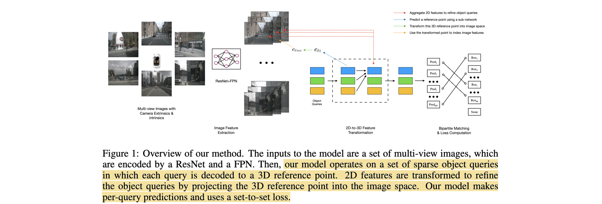

# DETR3D: 3D Object Detection from Multi-view Images via 3D-to-2D Queries

- **Authors:** Yue Wang, Vitor Guizilini, Tianyuan Zhang, Yilun Wang, Hang Zhao, Justin Solomon
- **Affiliations:** MIT, Toyota Research Institute, CMU, Li Auto, Tsinghua University
- **Published:** CoRL 2021 (arXiv:2110.06922)
- **Keywords:** multi-view 3D object detection, autonomous driving, object queries, backward projection, set-to-set loss, NMS-free, nuScenes
- **Webpage:** https://tsinghua-mars-lab.github.io/detr3d/
- **GitHub:** https://github.com/WangYueFt/detr3d

---

## Pass 1 — Bird's-Eye View

| C | Assessment |
|---|-----------|
| **Category** | A new architecture for camera-only multi-view 3D object detection in autonomous driving — a DETR[^1]-style query-based, end-to-end detector operating directly in 3D. |
| **Context** | Builds on DETR (set prediction), Deformable DETR (iterative refinement), Object DGCNN (3D set prediction), FPN[^2]/ResNet backbones, and camera geometry. Positioned against bottom-up 2D-then-lift detectors (CenterNet, FCOS3D) and pseudo-LiDAR / depth-based pipelines (PackNet + CenterPoint). |
| **Correctness** | Sound. The central move — decode a 3D reference point from each query, back-project it into all cameras, and sample features (no dense depth, no NMS[^3]) — is geometrically well-founded and validated on nuScenes. Fair comparisons (same FCOS3D/DD3D backbones). Honest about its weakness: higher translation error (mATE) than FCOS3D, i.e., depth is still hard. |
| **Contributions** | (1) The first framing of **multi-camera 3D detection as 3D set-to-set prediction**, fusing all views in every layer of computation (not by post-hoc merging of per-camera detections); (2) a **2D-to-3D backward-projection module** linking 2D features and 3D boxes without a depth network, avoiding compounding depth errors; (3) an **NMS-free** pipeline on par with NMS-based prior art, and markedly better in camera-overlap regions. |
| **Clarity** | Clear and concise. Fig. 1 conveys the query→reference-point→project→sample loop well; the method equations are precise. Minor: the reference-point refinement (why it converges) is left somewhat implicit; the 22 MB PDF's figures dominate its size. |

**30-second summary.** DETR3D is a DETR-style camera-only 3D detector that skips both dense depth estimation and NMS. It keeps a small set of learned **3D object queries**; each query decodes a **3D reference point**, which is projected (via known camera projection matrices) into whichever of the 6 cameras see it, and the corresponding multi-scale image features are **bilinearly sampled and aggregated back into the query**. Stacking $L=6$ such refinement layers iteratively sharpens the boxes, and a DETR set-to-set (Hungarian-matched focal + $L_1$ ) loss trains everything end-to-end. Because it works "top-down" (3D → 2D lookup) instead of "bottom-up" (per-image detect → lift → merge), it fuses all cameras in every layer and is far stronger in **camera-overlap regions** (0.384 vs FCOS3D 0.329 NDS[^4]) and vastly better than **pseudo-LiDAR** (0.374 vs 0.160 NDS). On nuScenes it reaches 0.425 NDS (val) / 0.479 (test), competitive with or beating FCOS3D/DD3D — but with higher translation error, since depth remains the core difficulty. DETR3D became the sparse-query anchor of BEV perception, the direct predecessor to PETR and the foil to [BEVFormer](../../2022/BEVFormer-_Learning_Bird's-Eye-View_Representation_from_Multi-Camera_Images_via_Spatiotemporal_Transformers/)'s dense-grid attention.

---

## Pass 2 — Careful Read

### Core Idea in One Sentence
Represent objects as a sparse set of learned 3D queries, each decoding a 3D reference point that is back-projected into all camera views to gather image features (bilinear sampling, no dense depth), iteratively refined over several layers, and trained end-to-end with a DETR set-to-set loss — turning multi-camera 3D detection into NMS-free 3D set prediction.



### Method / Approach
- **Image features (shared):** all 6 images encoded by a ResNet (with deformable convolutions in stages 3–4) + FPN into 4 feature levels (1/8, 1/16, 1/32, 1/64), $C=256$ .
- **3D object queries & reference points:** each of $M$ learned queries $q_{\ell i}$ decodes a 3D reference point $`c_{\ell i} = \Phi^{ref}(q_{\ell i})`$ — a hypothesis for a box center.
- **Backward projection & sampling (the crux):** the reference point is projected into each camera $m$ via the projection matrix $T_m$ , features are bilinearly sampled from the hit views/levels, masked by a validity flag (inside image plane), and averaged back into the query. No depth network, no per-image dense boxes.
- **Iterative refinement + heads:** the aggregated feature updates the query ( $`q_{\ell+1} = q_\ell + f_\ell`$ ); $L=6$ layers with multi-head self-attention among queries progressively refine boxes. Two MLPs per layer predict box $`\hat{b}`$ (9-D) and class. A DETR Hungarian set-to-set loss (focal + $L_1$ ) supervises every layer; inference uses only the last, **without NMS**.

### Key Results

nuScenes **val** (higher NDS/mAP better; lower error better):

| Method | NDS | mAP | mATE | mAVE | NMS |
|---|---|---|---|---|---|
| CenterNet | 0.328 | 0.306 | 0.716 | 1.426 | ✓ |
| FCOS3D | 0.415 | 0.343 | 0.725 | 1.292 | ✓ |
| **DETR3D** (base) | 0.374 | 0.303 | 0.860 | 0.967 | – |
| **DETR3D** (FCOS3D backbone) | 0.425 | 0.346 | 0.773 | 0.842 | – |
| **DETR3D** (+CBGS) | 0.434 | 0.349 | 0.716 | 0.842 | – |

nuScenes **test** (leaderboard):

| Method | NDS | mAP | NMS |
|---|---|---|---|
| PGD | 0.448 | 0.386 | ✓ |
| DD3D | 0.477 | 0.418 | ✓ |
| **DETR3D** (DD3D backbone) | **0.479** | 0.412 | – |

- **Overlap regions (9.7% of boxes, centers visible to ≥2 cameras):** DETR3D 0.384 NDS vs FCOS3D 0.329 — the integrated multi-camera fusion pays off exactly where per-camera detectors struggle with cut-off objects.
- **vs pseudo-LiDAR** (PackNet depth → point cloud → CenterPoint): DETR3D 0.374 vs 0.160 NDS — dramatic, supporting the "avoid explicit depth / compounding error" thesis.
- **Iterative refinement helps:** NDS climbs 0.380 (layer 0) → 0.425 (layer 5).
- **Queries saturate at 900** (NDS 0.331 @ 30 → 0.425 @ 900); **backbone matters** (ResNet50 0.373 < ResNet101 0.425).

### Strengths
- **Depth-free, geometry-driven:** back-projection uses only known camera matrices, sidestepping the compounding errors of depth/pseudo-LiDAR pipelines.
- **Truly multi-camera:** all views fused in every layer, so overlap regions and cut-off objects are handled natively — no per-camera NMS merging.
- **NMS-free & end-to-end:** a clean DETR set-prediction formulation removes hand-designed post-processing, improving efficiency and elegance.
- **Sparse & efficient:** only ~900 queries rather than a dense BEV grid; no intermediate depth maps or point clouds.

### Weaknesses / Open Questions
1. **Translation error stays high:** mATE 0.773–0.860 vs FCOS3D 0.725 — without explicit depth supervision, localizing along the camera ray is the persistent weak point (the authors concede this).
2. **Single-point receptive field:** each query samples image features at *one* projected point per view, a very limited receptive field — the authors flag "sampling multiple points" as future work (precisely what [BEVFormer](../../2022/BEVFormer-_Learning_Bird's-Eye-View_Representation_from_Multi-Camera_Images_via_Spatiotemporal_Transformers/)'s deformable local sampling later did).
3. **No temporal information:** single-frame only, so velocity error (mAVE 0.842) is high vs later temporal methods (BEVFormer 0.394).
4. **Sparse queries ≠ dense scene:** the sparse-query design targets detection; it does not directly yield a dense BEV feature for segmentation/planning (unlike LSS/BEVFormer).
5. **Backbone-dependent SOTA:** its best test number leans on a DD3D backbone pre-trained on extra depth data.

### References to Follow Up
1. **End-to-End Object Detection with Transformers (DETR)** — [Carion et al., ECCV 2020](../../2020/End-to-End_Object_Detection_with_Transformers/): the set-prediction / object-query / Hungarian-loss foundation DETR3D lifts to 3D.
2. **Deformable DETR** — Zhu et al., ICLR 2021: source of the iterative-refinement decoder DETR3D adapts; motivates the later move to deformable local sampling.
3. **FCOS3D: Fully Convolutional One-Stage Monocular 3D Detection** — Wang et al., ICCVW 2021: the main bottom-up baseline and a shared backbone provider.
4. **Lift, Splat, Shoot** — [Philion & Fidler, ECCV 2020](../../2020/Lift,_Splat,_Shoot-_Encoding_Images_from_Arbitrary_Camera_Rigs_by_Implicitly_Unprojecting_to_3D/): the contemporaneous depth-based "push" BEV paradigm DETR3D's "pull" queries contrast with.
5. **Demystifying Pseudo-LiDAR for Monocular 3D Detection** — Simonelli et al., 2020: explains the compounding-depth-error failure mode DETR3D's pseudo-LiDAR comparison invokes.

---

## Pass 3 — Virtual Re-implementation

### Detailed Technical Summary

**Problem setup.** Given $K$ surround-view images $`I = \{im_1, \dots, im_K\}`$ with known camera projection matrices $`T = \{T_1, \dots, T_K\} \subset R^{3\times4}`$ (intrinsics × relative extrinsics), predict a set of 3D boxes $`B = \{b_1, \dots, b_M\}`$ (each 9-D: position, size, heading, velocity in BEV[^5]) and classes $C$ . No point clouds are used.

**Feature learning.** A shared ResNet + FPN encodes all images into four multi-scale feature sets $`F_1, F_2, F_3, F_4`$ , each $`F_k = \{f_{k1}, \dots, f_{k6}\}`$ (one map per camera). Multi-scale features let queries pick up objects of different sizes.

**Detection head — top-down set prediction.** DETR3D is *iterative*: $L$ layers, each starting from object queries $`Q_\ell = \{q_{\ell 1}, \dots, q_{\ell M}\} \subset R^C`$ and producing $`Q_{\ell+1}`$ . Per layer, per query:

1. **Decode a 3D reference point** from the query:
   ```math
   c_{\ell i} = \Phi^{ref}(q_{\ell i}), \qquad c_{\ell i} \in R^3,
   ```
   a hypothesis for the $i$-th box center.
2. **Project into every camera** using homogeneous coordinates:
   ```math
   c^*_{\ell i} = c_{\ell i} \oplus 1, \qquad c_{\ell m i} = T_m \, c^*_{\ell i},
   ```
   where $\oplus$ is concatenation and $`c_{\ell m i}`$ is the projection onto camera $m$ (then normalized to $[-1,1]$ for sampling).
3. **Bilinearly sample** features across levels:
   ```math
   f_{\ell k m i} = f^{bilinear}(F_{km}, c_{\ell m i}).
   ```
4. **Aggregate valid samples** — a binary flag $`\sigma_{\ell k m i}`$ marks whether the point falls inside camera $m$'s image plane (a reference point is not visible in all cameras):
   ```math
   f_{\ell i} = \frac{1}{\sum_k \sum_m \sigma_{\ell k m i} + \epsilon} \sum_k \sum_m f_{\ell k m i}\, \sigma_{\ell k m i}, \qquad q_{(\ell+1) i} = f_{\ell i} + q_{\ell i}.
   ```

Multi-head **self-attention among queries** models object interactions (as in DETR). Each layer's heads predict a box and class:
```math
\hat{b}_{\ell i} = \Phi^{reg}_\ell(q_{\ell i}), \qquad \hat{c}_{\ell i} = \Phi^{cls}_\ell(q_{\ell i}),
```
supervised at every layer during training; inference uses only the last layer's outputs. The reference point $`c_{\ell i}`$ acts like an evolving anchor — refined implicitly as the query updates, letting boxes migrate toward ground truth in deeper layers.

**Set-to-set loss.** As in DETR, a bipartite (Hungarian) matching $`\sigma^*`$ pairs the $M^*$ predictions to $M$ ground-truth boxes (padded with ∅/no-object), minimizing
```math
\sigma^* = \arg\min_\sigma \sum_{j=1}^M -1_{\{c_j \neq \varnothing\}}\, \hat{p}_{\sigma(j)}(c_j) + 1_{\{c_j = \varnothing\}}\, L_{box}(b_j, \hat{b}_{\sigma(j)}),
```
then the supervised loss is a **focal loss** on class + $L_1$ on box parameters over the matched pairs:
```math
L_{sup} = \sum_{j=1}^N -\log \hat{p}_{\sigma^*(j)}(c_j) + 1_{\{c_j \neq \varnothing\}}\, L_{box}(b_j, \hat{b}_{\sigma^*(j)}).
```
The one-to-one matching is what removes the need for NMS.

**Implementation.** ResNet101 with deformable convolutions (stages 3–4) + FPN (4 levels); a 6-layer DETR3D head, hidden dim 256, LayerNorm, two 2-layer MLP heads per layer; 900 object queries. AdamW, weight decay $10^{-4}$ , lr $10^{-4}$ decayed to $10^{-5}$ / $10^{-6}$ at epochs 8/11, 12 epochs total, 8× RTX 3090, batch 1/GPU, ~18 h. Evaluated with the nuScenes toolkit; no NMS.

### Hidden Assumptions
1. **Accurate camera calibration.** Back-projection depends entirely on correct $T_m$ ; calibration error directly corrupts feature sampling (unlike LSS/BEVFormer, no robustness study is reported).
2. **The reference point is close enough to sample useful features.** Early-layer reference points must land near the true object in image space for the single-point sample to be informative; a badly initialized query may never recover.
3. **One sample point carries enough context.** Aggregation uses a single projected location per view — assumed sufficient despite the limited receptive field.
4. **Objects lie within the ray-depth the query can infer.** With no depth supervision, along-ray localization relies purely on learned priors and cross-view consistency.
5. **Fixed query budget covers scene object count.** 900 queries assumed to exceed the number of objects per scene.

### Reproducibility Notes
- **Public code** (`WangYueFt/detr3d`) plus an official MMDetection3D port; widely reproduced.
- **Dataset:** nuScenes (1000 scenes, 6 cameras, annotations every 0.5 s; 28k/6k/6k train/val/test; 10 detection classes).
- **Backbones need external pretraining:** best val uses an FCOS3D-initialized backbone; best test uses a DD3D backbone pre-trained on extra depth data — reproducing leaderboard numbers requires those.
- **Well-specified hyperparameters:** 6 layers, 900 queries, 4 FPN levels, optimizer/schedule, epochs, hardware, and ~18 h runtime all given.
- **Metrics:** standard nuScenes NDS + mAP + the five TP errors (mATE/mASE/mAOE/mAVE/mAAE).

### Ideas for Future Work
1. **Multi-point / region sampling per query:** replace single-point projection with local deformable sampling to widen the receptive field (realized by BEVFormer's spatial cross-attention).
2. **Explicit depth / positional priors:** inject depth supervision or 3D positional embeddings to cut the translation error (realized by PETR, BEVDepth-style ideas).
3. **Temporal queries:** propagate queries/reference points across frames for velocity and occlusion (realized by StreamPETR, PETRv2).
4. **Multi-modal input-agnostic head:** the sampling head is modality-agnostic — add LiDAR/RADAR features as extra sample sources.
5. **Beyond detection:** extend queries to tracking, mapping, and other 3D tasks / domains (indoor navigation, manipulation).

---

## Pass 4 — Modern Perspective Review (as of July 2026)

### What Has Changed Since Publication
- **Sparse-query 3D detection became a major branch.** DETR3D seeded the PETR / PETRv2 / StreamPETR line, which replaced explicit back-projection with 3D positional embeddings and added temporal modeling.
- **The dense-BEV counter-branch matured.** [BEVFormer](../../2022/BEVFormer-_Learning_Bird's-Eye-View_Representation_from_Multi-Camera_Images_via_Spatiotemporal_Transformers/) generalized DETR3D's single-point lookup to deformable local sampling over a dense BEV grid and added temporal fusion, directly addressing DETR3D's two biggest limitations.
- **Temporal fusion became standard.** DETR3D's high velocity error was a clear gap; every strong successor now fuses multiple frames.
- **Depth supervision was rehabilitated.** BEVDepth showed explicit (LiDAR-supervised) depth still helps — nuancing DETR3D's "avoid depth entirely" stance.
- **NMS-free query detection is now the default** for camera 3D detection, exactly as DETR3D argued.
- **Evaluation moved on** to occupancy prediction and end-to-end driving, where query-based perception heads (descendants of DETR3D) remain in use.

### Has the Community Accepted the Claims?
Broadly yes. DETR3D's core thesis — cast multi-camera 3D detection as NMS-free 3D set prediction with geometry-driven backward projection, avoiding explicit depth — was validated and became one of the two dominant paradigms (sparse-query "pull" vs. dense-BEV). Its concrete claims held up: fusing all cameras per layer really does help in overlap regions, and depth-free back-projection beats pseudo-LiDAR. The community also confirmed its acknowledged weaknesses and fixed them: the single-point receptive field was widened by BEVFormer's deformable sampling; the missing temporal modeling was added by StreamPETR/BEVFormer; the residual translation/depth error was attacked by PETR's positional embeddings and BEVDepth's depth supervision. So DETR3D is treated as a seminal starting point that later work refined rather than refuted. Its absolute numbers are long surpassed, but its formulation is foundational and it remains a standard baseline and citation.

---

### Comparison Papers

#### Predecessors
| Paper | Authors | Year | Relation |
|---|---|---|---|
| DETR | Carion et al. | 2020 | Set-prediction / object-query / Hungarian-loss foundation lifted to 3D ([has note](../../2020/End-to-End_Object_Detection_with_Transformers/)) |
| Deformable DETR | Zhu et al. | 2021 | Iterative-refinement decoder adapted by DETR3D's layered head |
| Object DGCNN | Anonymous | 2021 | NMS-free 3D set prediction (from point clouds) that DETR3D parallels |
| FCOS3D | Wang et al. | 2021 | Bottom-up monocular baseline and shared backbone |
| Pseudo-LiDAR | Wang et al. | 2019 | Depth-based pipeline DETR3D compares against and outperforms |

#### Contemporaries / Competitors
| Paper | Authors | Year | Relation |
|---|---|---|---|
| Lift, Splat, Shoot | Philion, Fidler | 2020 | Depth-based "push" BEV paradigm; the "pull" counterpart to DETR3D's queries ([has note](../../2020/Lift,_Splat,_Shoot-_Encoding_Images_from_Arbitrary_Camera_Rigs_by_Implicitly_Unprojecting_to_3D/)) |
| DD3D | Park et al. | 2021 | Strong monocular detector; provides DETR3D's best test backbone and a key baseline |
| PGD | Wang et al. | 2021 | Probabilistic-geometric monocular depth detector; leaderboard competitor |
| CenterNet | Zhou et al. | 2019 | Anchor-free 2D-to-3D baseline |

#### Successors / Extensions
| Paper | Authors | Year | Relation |
|---|---|---|---|
| PETR | Liu et al. | 2022 | Replaces explicit back-projection with 3D positional embeddings; direct sparse-query successor |
| BEVFormer | Li et al. | 2022 | Generalizes single-point lookup to deformable dense-BEV sampling + temporal fusion ([has note](../../2022/BEVFormer-_Learning_Bird's-Eye-View_Representation_from_Multi-Camera_Images_via_Spatiotemporal_Transformers/)) |
| PETRv2 / StreamPETR | Liu / Wang et al. | 2022–23 | Add temporal modeling to the query-based line |
| BEVDepth | Li et al. | 2022 | Argues explicit depth supervision still helps, nuancing DETR3D's depth-free stance |
| Sparse4D | Lin et al. | 2022–23 | Multi-point sparse sampling + temporal, extending DETR3D's query design |

---

### Bottom Line
Yes — DETR3D is a foundational, still-worth-reading paper. It reframed multi-camera 3D detection as NMS-free 3D set prediction and introduced the geometry-driven, depth-free backward-projection that anchors the entire sparse-query branch of BEV perception (PETR, StreamPETR, Sparse4D) and directly motivated [BEVFormer](../../2022/BEVFormer-_Learning_Bird's-Eye-View_Representation_from_Multi-Camera_Images_via_Spatiotemporal_Transformers/)'s dense-attention refinement. Read it right after [DETR](../../2020/End-to-End_Object_Detection_with_Transformers/) and alongside [Lift, Splat, Shoot](../../2020/Lift,_Splat,_Shoot-_Encoding_Images_from_Arbitrary_Camera_Rigs_by_Implicitly_Unprojecting_to_3D/) to see the two axes that organize camera-based 3D perception: query vs. grid, and pull vs. push. Its specific accuracy is long superseded and the single-point/temporal-free limitations it flagged have been solved by successors, but the conceptual contribution — 3D-to-2D queries — is load-bearing for the modern autonomous-driving detection stack.

[^1]: **DETR** — DEtection TRansformer. See the [glossary](../../common/terms/).
[^2]: **FPN** — Feature Pyramid Network. See the [glossary](../../common/terms/).
[^3]: **NMS** — Non-Maximum Suppression. See the [glossary](../../common/terms/).
[^4]: **NDS** — nuScenes Detection Score. See the [glossary](../../common/terms/).
[^5]: **BEV** — Bird's-Eye-View. See the [glossary](../../common/terms/).
