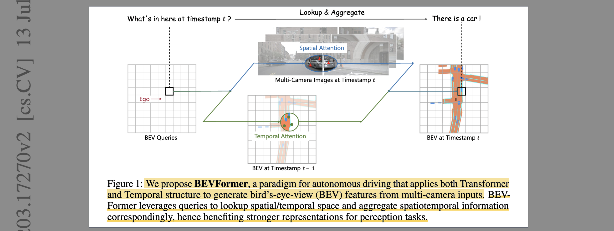
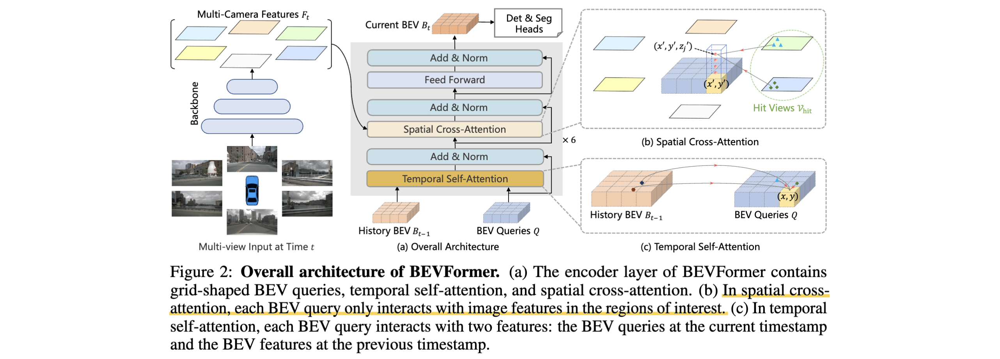

# BEVFormer: Learning Bird's-Eye-View Representation from Multi-Camera Images via Spatiotemporal Transformers

- **Authors:** Zhiqi Li, Wenhai Wang, Hongyang Li, Enze Xie, Chonghao Sima, Tong Lu, Yu Qiao, Jifeng Dai
- **Affiliations:** Nanjing University, Shanghai AI Laboratory, The University of Hong Kong
- **Published:** ECCV 2022 (arXiv:2203.17270)
- **Keywords:** bird's-eye-view, autonomous driving, 3D object detection, map segmentation, deformable attention, spatiotemporal transformer, multi-camera
- **GitHub:** https://github.com/fundamentalvision/BEVFormer

---

## Pass 1 — Bird's-Eye View

| C | Assessment |
|---|-----------|
| **Category** | A new architecture / framework for camera-only 3D perception in autonomous driving. It is a transformer-based BEV[^1] *encoder* producing a unified feature map that feeds detection and segmentation heads. |
| **Context** | Builds on Deformable DETR[^2] (deformable attention), DETR3D (3D-to-2D query projection), Lift-Splat-Shoot / OFT (BEV generation), PointPillars (pillar lifting), and FIERY (temporal BEV). Positioned against depth-based "push" BEV methods (LSS, CaDDN) and monocular detectors (FCOS3D, PGD, DD3D). |
| **Correctness** | Sound and strongly validated. The core claim — an attention-based "pull" BEV encoder that avoids explicit depth estimation and adds recurrent temporal fusion — is backed by SOTA nuScenes/Waymo numbers, careful ablations (attention type, frame count, ego-motion alignment), and robustness studies. Comparisons are made fair by swapping only the BEV encoder while fixing backbone + heads. |
| **Contributions** | (1) **BEVFormer**, a spatiotemporal transformer BEV encoder driven by grid-shaped learnable **BEV queries**; (2) **spatial cross-attention** — deformable attention where each BEV query samples only its projected regions of interest across the cameras that see it; (3) **temporal self-attention** — RNN-style recurrent fusion of the previous timestamp's BEV feature, cheap yet greatly improving velocity and occluded-object recall; (4) a unified BEV feature that simultaneously serves 3D detection and map segmentation. |
| **Clarity** | Clear and well-organized. Fig. 2 cleanly separates the three modules; equations for spatial cross-attention and temporal self-attention are precise. Minor: MinerU garbled some tables, and the "pull vs. push" framing versus LSS is left mostly implicit. |



**30-second summary.** BEVFormer generates a bird's-eye-view feature map from 6 surround-view cameras using a 6-layer transformer encoder over a fixed grid of learnable **BEV queries** (200×200, 0.512 m cells). Instead of LSS-style forward depth "splatting," it *pulls* features: each BEV query is lifted into a pillar of 3D reference points (4 anchor heights from −5 m to 3 m), projected into whichever camera views see it, and gathers image features via **deformable spatial cross-attention** — so no explicit depth prediction is needed. A **temporal self-attention** recurrently fuses the previous frame's BEV feature (aligned by ego-motion), RNN-style, adding almost no cost while enabling velocity estimation and recovery of occluded objects. The unified BEV feature feeds a Deformable-DETR detection head and a mask-decoder segmentation head. BEVFormer hits **56.9% NDS**[^3] on nuScenes test (+9.0 over DETR3D, on par with some LiDAR baselines), slashes velocity error (mAVE[^4] 0.378 m/s), and beats LSS on lane segmentation. It became, alongside LSS, one of the two canonical BEV-perception paradigms (attention/pull vs. depth/push).

---

## Pass 2 — Careful Read



### Core Idea in One Sentence
Use a fixed grid of learnable BEV queries that *pull* features from multi-camera images via deformable cross-attention (projecting each query's 3D pillar into the views that see it, so no explicit depth is estimated) and recurrently fuse the previous frame's BEV via temporal self-attention, yielding a unified BEV feature map for 3D detection and map segmentation.

### Method / Approach
- **BEV queries (the canvas):** grid-shaped learnable parameters $Q \in R^{H \times W \times C}$ (default 200×200×256) with learnable positional embeddings; each query owns a real-world grid cell of size $s$ meters, centered on the ego car.
- **Spatial cross-attention (space → BEV):** each query $Q_p$ is lifted to a pillar of $N_{ref}=4$ 3D reference points at predefined heights (−5 m to 3 m), projected into the cameras via known projection matrices; the query then runs **deformable attention** only over the *hit* views, sampling 4 points around each reference point. This makes cost scale with regions-of-interest, not all cameras globally.
- **Temporal self-attention (time → BEV):** the previous BEV $B_{t-1}$ is aligned to the current frame by ego-motion, then each query attends to the concatenation $\{Q, B'_{t-1}\}$ via deformable attention (offsets predicted from both). Recurrent, RNN-like — carries long temporal context at negligible cost, unlike stacking multiple past BEVs.
- **Unified heads:** a Deformable-DETR detection head (900 queries, keep top 300, $L_1$ box regression, velocity, **no NMS**[^5]) and a Panoptic-SegFormer mask-decoder segmentation head share one BEV feature.

### Key Results

3D detection on nuScenes (higher NDS/mAP better; lower mAVE better):

| Method | Modality | Backbone | Split | NDS | mAP | mAVE |
|---|---|---|---|---|---|---|
| FCOS3D | C | R101 | val | 0.415 | 0.343 | 1.292 |
| DETR3D | C | R101 | val | 0.425 | 0.346 | 0.842 |
| BEVFormer-S (no temporal) | C | R101 | val | 0.448 | 0.375 | 0.802 |
| **BEVFormer** | C | R101 | val | **0.517** | **0.416** | **0.394** |
| DETR3D | C | V2-99* | test | 0.479 | 0.412 | 0.845 |
| **BEVFormer** | C | V2-99* | test | **0.569** | **0.481** | **0.378** |
| SSN (LiDAR ref.) | L | – | test | 0.569 | 0.463 | – |

*V2-99 pretrained on depth estimation (DD3D). BEVFormer matches the LiDAR SSN baseline at 56.9% NDS.*

Multi-task detection + map segmentation IoU[^6] on nuScenes val (fair BEV-encoder swap, shared heads):

| BEV encoder | Det NDS | Car | Vehicles | Road | Lane |
|---|---|---|---|---|---|
| VPN* | 0.334 | 31.0 | 31.8 | 76.9 | 19.4 |
| Lift-Splat* | 0.410 | 43.0 | 42.8 | 73.9 | 18.3 |
| BEVFormer-S | 0.453 | 44.3 | 44.4 | 77.6 | 19.8 |
| **BEVFormer** | **0.520** | **46.8** | **46.7** | 77.5 | **23.9** |

- **Temporal is the big lever:** BEVFormer − BEVFormer-S is worth ~7 NDS points, driven mostly by velocity (mAVE 0.802 → 0.394) and higher recall on the lowest-visibility (0–40%) objects (+6% over BEVFormer-S / DETR3D).
- **Deformable > global > point attention** in the spatial module: local deformable 0.448 NDS vs. point-only 0.423 vs. global 0.404, at ~20 GB memory (global needs ~36 GB).
- **Depth-free wins:** BEVFormer beats depth-based LSS by +5.6 IoU on the hardest task (lane segmentation), supporting the "don't rely on explicit depth" thesis.

### Strengths
- **No explicit depth / no compounding depth error:** attention learns the 2D→BEV lookup adaptively, sidestepping LSS/pseudo-LiDAR's sensitivity to depth accuracy.
- **Cheap, effective temporal fusion:** RNN-style single-previous-BEV recurrence gives long temporal context without the cost/interference of stacking many frames — the first strong temporal multi-camera detector.
- **Truly unified & multi-task:** one BEV feature drives both detection and segmentation; multi-task training even improves detection.
- **Efficient by design:** deformable attention restricts each query to its hit views and local sample points, keeping surround-view attention tractable and scalable.
- **Rigorous, fair evaluation:** BEV-encoder-only swaps, backbone/head held fixed, plus latency, robustness, and frame-count ablations.

### Weaknesses / Open Questions
1. **Backbone is the bottleneck:** the R101-DCN backbone is ~391 ms vs. ~130 ms for the full BEV encoder — real-time deployment hinges on the image backbone, not the elegant BEV module.
2. **Still trails LiDAR:** the authors concede a persistent accuracy/efficiency gap; 3D localization from 2D remains fundamentally hard.
3. **Negative transfer in multi-task:** joint training *hurts* road/lane segmentation even as it helps detection — the shared BEV is not a free lunch across tasks.
4. **Calibration dependence:** spatial cross-attention needs accurate intrinsics/extrinsics for projection; performance degrades under extrinsic noise (mitigated but not eliminated by noise-augmented training or global attention).
5. **Fixed height anchors & grid:** the 4 anchor heights and 200×200 grid are hand-set; no adaptivity to scene or range.

### References to Follow Up
1. **Lift, Splat, Shoot** — [Philion & Fidler, ECCV 2020](../../2020/Lift,_Splat,_Shoot-_Encoding_Images_from_Arbitrary_Camera_Rigs_by_Implicitly_Unprojecting_to_3D/): the depth-based "push" BEV paradigm BEVFormer contrasts itself against and beats on segmentation.
2. **Deformable DETR** — Zhu et al., ICLR 2021: source of the deformable attention that both BEV modules are built on; essential to understand SCA/TSA.
3. **DETR3D: 3D Object Detection from Multi-view Images via 3D-to-2D Queries** — Wang et al., CoRL 2022: the main competitor and query-based predecessor (sparse 3D queries vs. BEVFormer's dense grid).
4. **FIERY: Future Instance Prediction in BEV** — Hu et al., ICCV 2021: prior temporal-BEV work that stacks frames; motivates BEVFormer's cheaper recurrent alternative.
5. **CaDDN: Categorical Depth Distribution Network** — Reading et al., CVPR 2021: representative depth-distribution BEV method embodying the sensitivity BEVFormer avoids.

---

## Pass 3 — Virtual Re-implementation

### Detailed Technical Summary

**Problem & overall pipeline.** Given $N_{view}$ camera images at timestamp $t$ , a shared backbone (ResNet101-DCN or VoVNet-99) plus FPN[^7] produce multi-scale features $`F_t = \{F_t^i\}_{i=1}^{N_{view}}`$ (scales 1/16, 1/32, 1/64; $C=256$ ). A stack of **6 encoder layers** transforms a fixed set of BEV queries into a BEV feature $B_t \in R^{H \times W \times C}$ , consumed at timestamp $t$ by two heads. Each encoder layer = temporal self-attention → spatial cross-attention → FFN[^8], refining the queries.

**BEV queries.** Learnable $Q \in R^{H \times W \times C}$ ( $200 \times 200$ on nuScenes), each query $Q_p$ at grid position $p=(x,y)$ responsible for a cell of real size $s=0.512$ m, ego car at grid center; perception range $[-51.2, 51.2]$ m in X and Y. Learnable positional embeddings are added.

**Spatial cross-attention (SCA).** Built on **deformable attention**, whose primitive is

```math
\mathrm{DeformAttn}(q, p, x) = \sum_{i=1}^{N_{head}} W_i \sum_{j=1}^{N_{key}} A_{ij} \cdot W_i' \, x(p + \Delta p_{ij}),
```

where $A_{ij}$ are learned attention weights ( $`\sum_j A_{ij}=1`$ ) and $`\Delta p_{ij}`$ are learned sampling offsets around reference point $p$ , with $x(\cdot)$ bilinearly interpolated. SCA lifts each $Q_p$ to a pillar of $N_{ref}=4$ reference points at anchor heights sampled uniformly in $[-5, 3]$ m. The real-world position for query $p=(x,y)$ is

```math
x' = (x - \tfrac{W}{2}) \times s, \qquad y' = (y - \tfrac{H}{2}) \times s,
```

and each 3D point $`(x', y', z_j')`$ is projected to view $i$ by the known projection matrix $T_i \in R^{3\times4}$ :

```math
z_{ij} \, [x_{ij}\; y_{ij}\; 1]^T = T_i \, [x'\; y'\; z_j'\; 1]^T .
```

Only the **hit views** $`V_{hit}`$ (views a point actually lands in) participate; the aggregate is

```math
\mathrm{SCA}(Q_p, F_t) = \frac{1}{|V_{hit}|} \sum_{i \in V_{hit}} \sum_{j=1}^{N_{ref}} \mathrm{DeformAttn}(Q_p, P(p,i,j), F_t^i),
```

with $P(p,i,j)$ the projected 2D reference point and 4 learned sample points per head around it. This is the crux: geometry (camera projection) supplies *where to look*, attention supplies *how much/what to read* — depth is never explicitly predicted, only implicitly resolved by which height anchors align with real content across views.

**Temporal self-attention (TSA).** The previous BEV $B_{t-1}$ is first **ego-motion-aligned** to the current grid, giving $B'_{t-1}$ (so a grid cell means the same world location). Then

```math
\mathrm{TSA}(Q_p, \{Q, B'_{t-1}\}) = \sum_{V \in \{Q, B'_{t-1}\}} \mathrm{DeformAttn}(Q_p, p, V),
```

where — unlike vanilla deformable attention — the offsets $\Delta p$ are predicted from the **concatenation** of $Q$ and $B'_{t-1}$ , letting the module cope with the unknown motion of dynamic objects between frames (alignment fixes ego-motion, but movable objects still shift). For the first frame of a sequence, TSA degenerates to self-attention with $\{Q, Q\}$ . This recurrent design carries temporal information forward RNN-style rather than stacking many past BEVs.

**Heads.** *Detection:* a Deformable-DETR decoder on single-scale $B_t$ , predicting 10 params per box $(l,w,h,x_o,y_o,z_o,\cos\theta,\sin\theta,v_x,v_y)$ with $L_1$ loss/cost only; 900 object queries, 300 kept at inference, no NMS. *Segmentation:* a Panoptic-SegFormer mask decoder with one class-fixed query per semantic category (car, vehicle, road, lane), masks from multi-head attention maps.

**Training.** For each target frame $t$ , sample 4 frames from the past 2 s ( $t{-}3,\dots,t$ ); the first three generate $\{B_{t-3}, B_{t-2}, B_{t-1}\}$ **without gradients** (recurrent rollout), only $t$ is supervised. 24 epochs, AdamW, lr $2\times10^{-4}$ (backbone ×0.1), weight decay $10^{-2}$ , cosine annealing, batch 1 (=6 images) per GPU. Random sampling of 4-from-5 consecutive frames is an ego-motion augmentation.

**Efficiency & ablations.** Latency (V100, R101-DCN, 900×1600 input): backbone ~391 ms dominates; full BEVFormer module ~130 ms. Reducing to single-scale + 100×100 + 1 layer cuts the module to 7 ms at a 3.9-point NDS cost. Attention ablation: deformable *local* (0.448) > *point-only* (0.423) > *global* (0.404, needs ~36 GB). Temporal frame count saturates at 4 (0.448 → 0.517 NDS from 1 → 4 frames). Ego-motion alignment (+0.7 NDS), 4-from-5 random sampling (+0.4), and predicting TSA offsets from both $Q$ and $B'_{t-1}$ (+0.4) each help.

### Hidden Assumptions
1. **Accurate calibration at every frame.** Projection $T_i$ must be reliable; the robustness appendix shows graceful but real degradation under extrinsic noise.
2. **Reliable ego-motion for temporal alignment.** TSA presumes $B_{t-1}$ can be warped to the current frame; large odometry error would misalign the recurrent state.
3. **Height anchors span relevant structure.** The 4 anchors (−5 m to 3 m) are assumed to cover object extents; objects outside this band are under-sampled.
4. **Objects move little frame-to-frame.** Deformable offsets have a limited receptive field, implicitly bounding cross-frame object displacement TSA can associate.
5. **A single previous BEV suffices.** Recurrence assumes $B_{t-1}$ has already compressed all useful past — no explicit long-term memory beyond one step.
6. **Foreground lives near the ground plane.** Collapsing to a 2D BEV grid assumes vertical structure is not task-critical.

### Reproducibility Notes
- **Public, widely-reproduced code** (`fundamentalvision/BEVFormer`) with configs for nuScenes and Waymo; one of the most-forked BEV repos.
- **Datasets:** nuScenes (1000 scenes, 6 cameras, 360° FoV, key frames at 2 Hz) and Waymo (subset, every 5th frame, vehicle only, ~252° FoV).
- **Backbones need external pretraining:** R101-DCN from an FCOS3D checkpoint, V2-99 from DD3D (depth-pretrained with extra data) — reproducing test-set numbers requires those checkpoints.
- **Well-specified hyperparameters:** grid size/range/resolution, 6 layers, $N_{ref}=4$ heights, 4 sample points, optimizer/schedule, 4-frame temporal window — all given.
- **Compute:** trained at batch 1 per GPU for 24 epochs; exact GPU count/time not stated. Latency benchmarked on V100.
- **Underspecified:** exact ego-motion alignment implementation and the precise VPN/LSS baseline reimplementations (though described in the appendix).

### Ideas for Future Work
1. **Efficient backbones / distillation:** since the backbone dominates latency, real-time BEVFormer needs lighter or shared image encoders (later: BEVFormer v2, fast-BEV variants).
2. **Explicit + implicit depth hybrid:** combine BEVFormer's attention lookup with LSS/BEVDepth-style supervised depth to get the best of push and pull.
3. **Longer / structured temporal memory:** replace single-step recurrence with multi-frame or learned memory (later realized by SOLOFusion, StreamPETR).
4. **Occupancy & end-to-end driving heads:** extend the unified BEV to 3D occupancy prediction and planning (later: BEVFormer as UniAD's perception backbone).
5. **Calibration-robust / self-calibrating attention:** the global-attention robustness result hints at learning projection-free or noise-tolerant lookups.
6. **LiDAR-camera fusion in the query space:** fuse point features as additional keys for the BEV queries.

---

## Pass 4 — Modern Perspective Review (as of July 2026)

### What Has Changed Since Publication
- **Two paradigms crystallized.** BEVFormer defined the **attention / backward-projection ("pull")** camp opposite the LSS/BEVDepth **depth / forward-projection ("push")** camp; nearly every later camera-BEV method self-identifies with one.
- **Temporal fusion became mandatory.** BEVFormer's recurrent temporal module was widely adopted and then extended — SOLOFusion (long-term fusion), StreamPETR (object-centric temporal propagation), and BEVFormer v2 pushed longer horizons.
- **Sparse query methods resurged.** PETR / PETRv2 / StreamPETR showed 3D positional embeddings can rival dense BEV grids at lower cost, challenging the dense-grid assumption.
- **BEV became the backbone for end-to-end driving.** BEVFormer is the perception encoder inside UniAD (CVPR 2023 best paper) and VAD, feeding joint detection–tracking–mapping–planning stacks.
- **The task frontier moved to occupancy and world models.** 3D semantic occupancy prediction (Occ3D, SurroundOcc) and driving world models became the new benchmarks, often reusing BEVFormer-style spatial cross-attention.
- **Efficiency work matured.** Fast-BEV, BEVPoolv2, and better backbones addressed the backbone-bound latency BEVFormer flagged.

### Has the Community Accepted the Claims?
Yes — BEVFormer is now a canonical reference and a standard baseline for camera-based 3D perception. Its two central claims held up: (1) attention-based BEV construction without explicit depth is competitive with and often superior to depth-based methods, and (2) cheap recurrent temporal fusion substantially improves velocity and occluded-object recall. Follow-on work validated rather than overturned these — temporal fusion is now universal, and BEVFormer's spatial cross-attention is reused across occupancy and end-to-end-driving systems (most visibly as UniAD's backbone). The main refinements: the "no explicit depth" stance was nuanced by BEVDepth, which showed *supervised* depth still helps the push family and can match pull methods; and sparse-query methods (PETR family) offered a lighter alternative to the dense grid. The acknowledged LiDAR gap has narrowed (with scale, temporal depth, and fusion) but not closed. Overall: a landmark that shaped the field's vocabulary and architecture choices.

---

### Comparison Papers

#### Predecessors
| Paper | Authors | Year | Relation |
|---|---|---|---|
| Lift, Splat, Shoot | Philion, Fidler | 2020 | Depth-based "push" BEV predecessor and baseline; BEVFormer is the attention-based "pull" counterpart ([has note](../../2020/Lift,_Splat,_Shoot-_Encoding_Images_from_Arbitrary_Camera_Rigs_by_Implicitly_Unprojecting_to_3D/)) |
| Deformable DETR | Zhu et al. | 2021 | Source of the deformable attention primitive underlying both SCA and TSA |
| [DETR3D](../../2021/DETR3D-_3D_Object_Detection_from_Multi-view_Images_via_3D-to-2D_Queries/) | Wang et al. | 2021 | Query-based 3D detector (sparse 3D queries); primary competitor and design inspiration |
| DETR | Carion et al. | 2020 | Set-prediction / object-query paradigm behind the detection head ([has note](../../2020/End-to-End_Object_Detection_with_Transformers/)) |
| PointPillars | Lang et al. | 2019 | Pillar abstraction reused to lift BEV queries into 3D reference pillars |
| FIERY | Hu et al. | 2021 | Prior temporal-BEV method (frame stacking) motivating the cheaper recurrent design |

#### Contemporaries / Competitors
| Paper | Authors | Year | Relation |
|---|---|---|---|
| PETR | Liu et al. | 2022 | Concurrent 3D-position-embedding detector; sparse alternative avoiding an explicit BEV grid |
| BEVDet | Huang et al. | 2021–22 | Concurrent LSS-based (push) detector with a 3D head |
| M²BEV | Xie et al. | 2022 | Concurrent unified multi-task BEV detection + segmentation |
| CaDDN | Reading et al. | 2021 | Categorical-depth (push) monocular detector; representative of the depth-sensitivity BEVFormer avoids |

#### Successors / Extensions
| Paper | Authors | Year | Relation |
|---|---|---|---|
| BEVDepth | Li et al. | 2022 | Push-side response adding explicit depth supervision to close the gap with pull methods |
| BEVFusion | Liu et al. / Liang et al. | 2022 | Fuses camera BEV (LSS/BEVFormer-style) with LiDAR in a shared grid |
| SOLOFusion | Park et al. | 2023 | Extends temporal fusion to long-term for large gains |
| StreamPETR | Wang et al. | 2023 | Object-centric temporal propagation; sparse-query successor line |
| BEVFormer v2 | Yang et al. | 2023 | Direct successor with perspective supervision and modern backbones |
| [UniAD](../../2023/Planning-oriented_Autonomous_Driving/) | Hu et al. | 2023 | Uses BEVFormer as the perception backbone for end-to-end planning (CVPR 2023 best paper) |
| Occ3D / SurroundOcc | Tian / Wei et al. | 2023 | 3D occupancy successors reusing BEVFormer-style spatial cross-attention |

---

### Bottom Line
Yes — BEVFormer is a foundational, still-worth-reading classic of camera-based 3D perception. It defined the attention-based "pull" BEV paradigm, introduced the cheap recurrent temporal fusion that is now universal, and delivered the first camera-only detector to seriously approach LiDAR on nuScenes. Its architecture (BEV queries + deformable spatial cross-attention + temporal self-attention) remains a live component inside occupancy models and end-to-end driving stacks like UniAD, and it is the standard point of comparison for any new BEV method. Specific numbers have been surpassed and the backbone-latency and LiDAR-gap limitations it flagged have been partially addressed by successors, but the conceptual framing and the two core mechanisms are load-bearing for the modern autonomous-driving perception stack. Read it alongside [Lift, Splat, Shoot](../../2020/Lift,_Splat,_Shoot-_Encoding_Images_from_Arbitrary_Camera_Rigs_by_Implicitly_Unprojecting_to_3D/) to understand the push-vs-pull axis that organizes the whole subfield.

[^1]: **BEV** — Bird's-Eye-View. See the [glossary](../../common/terms/).
[^2]: **DETR** — DEtection TRansformer. See the [glossary](../../common/terms/).
[^3]: **NDS** — nuScenes Detection Score. See the [glossary](../../common/terms/).
[^4]: **mAVE** — mean Average Velocity Error, one of the nuScenes true-positive metrics (m/s); lower is better. Part of the [NDS](../../common/terms/) composite.
[^5]: **NMS** — Non-Maximum Suppression. See the [glossary](../../common/terms/).
[^6]: **IoU** — Intersection over Union. See the [glossary](../../common/terms/).
[^7]: **FPN** — Feature Pyramid Network. See the [glossary](../../common/terms/).
[^8]: **FFN** — Feed-Forward Network. See the [glossary](../../common/terms/).
