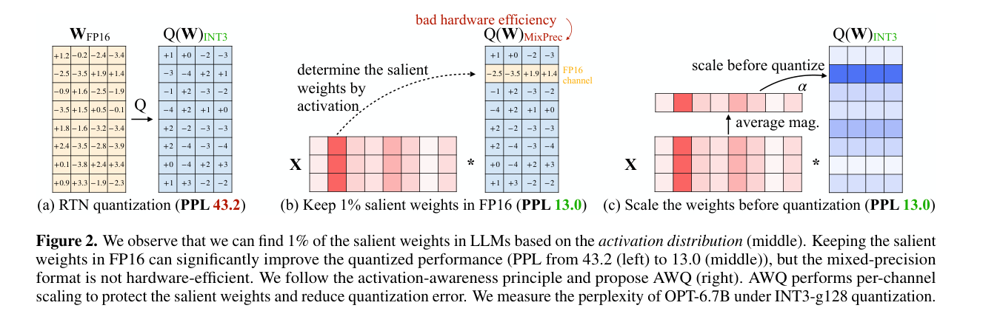
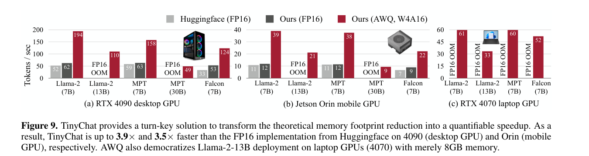
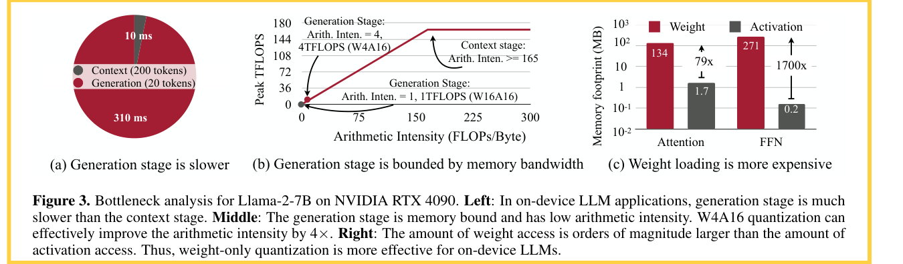

# AWQ: Activation-aware Weight Quantization for LLM Compression and Acceleration

- **Authors:** Ji Lin*, Jiaming Tang*, Haotian Tang†, Shang Yang†, Wei-Ming Chen, Wei-Chen Wang, Guangxuan Xiao, Xingyu Dang, Chuang Gan, Song Han
- **Affiliations:** MIT, Shanghai Jiao Tong University, NVIDIA, Tsinghua University, MIT-IBM Watson AI Lab, UMass Amherst
- **Published:** MLSys 2024 **Best Paper Award** (arXiv:2306.00978, June 2023; camera-ready retitled "… for **On-Device** LLM Compression and Acceleration")
- **Keywords:** LLM quantization, weight-only quantization, W4A16, activation-aware scaling, on-device inference, edge deployment, TinyChat
- **Webpage:** https://hanlab.mit.edu/projects/awq
- **GitHub:** https://github.com/mit-han-lab/llm-awq

---

## Pass 1 — Bird's-Eye View

| C | Assessment |
|---|-----------|
| **Category** | Methods + systems paper: a PTQ[^1] algorithm for INT3/INT4 weight-only LLM quantization (AWQ) plus an edge inference framework (TinyChat) that converts the memory savings into measured speedup. |
| **Context** | Builds on the LLM PTQ line — RTN[^2] baselines, GPTQ's second-order layer-wise reconstruction, LLM.int8's outlier analysis — and on the same lab's SmoothQuant (activation-aware equivalent transformations for W8A8). Framed by Dettmers & Zettlemoyer's k-bit scaling laws, which identify 4-bit weight-only as a sweet spot. |
| **Correctness** | Sound and refreshingly simple. The salient-channel analysis is backed by controlled experiments (Table 1: activation-based selection works, weight-magnitude/random selection do not), and the error derivation for scaling is elementary but honest about its approximation ( $\Delta' \approx \Delta$ holds only for moderate $s$ , verified empirically). Evaluation is PPL[^3] -centric, standard for 2023. |
| **Contributions** | (1) The observation that ~0.1–1% of weight channels are salient and identifiable from *activation* magnitudes, not weight magnitudes; (2) per-channel scaling as a hardware-friendly, mixed-precision-free way to protect salient channels, with a one-hyperparameter grid search and no backprop; (3) demonstrated generalization to instruction-tuned and — for the first time — multi-modal (VLM) models; (4) TinyChat: fused dequantize-GEMM kernels and SIMD-aware weight packing delivering 3.2–3.3× average speedup over HuggingFace FP16 on desktop/mobile GPUs. |
| **Clarity** | Excellent. The three-panel Figure 2 (RTN → mixed-precision → scaling) tells the whole algorithmic story; the roofline analysis in Figure 3 justifies weight-only quantization from first principles. A model of a well-motivated systems-ML paper. |

**30-second summary.** AWQ targets W4A16 (4-bit weights, FP16 activations) quantization for on-device LLM inference, where generation is memory-bound and weight loading dominates memory traffic. The key observations: (1) keeping just 1% of weight channels in FP16 nearly closes the gap to the unquantized model, but only if those channels are chosen by *activation* magnitude — weight magnitude or random selection barely helps; (2) mixed precision is hardware-unfriendly, but the same protection can be achieved by *scaling up* salient channels before quantization (and inversely scaling the activations), which provably shrinks their relative quantization error by ~ $1/s$ while leaving group maxima mostly unchanged. AWQ grid-searches a single exponent $\alpha$ over per-channel activation statistics — no backpropagation, no reconstruction — so it needs 10× less calibration data than GPTQ and doesn't overfit the calibration distribution, generalizing to instruction-tuned models (Vicuna) and, for the first time, VLMs (OpenFlamingo, VILA). TinyChat converts the 4× memory saving into 3.2–3.3× average measured speedup over HuggingFace FP16 via on-the-fly fused dequantization, SIMD-aware weight packing, and kernel fusion — enabling Llama-2-70B on a Jetson Orin and 7B models on a Raspberry Pi. AWQ became one of the most widely deployed LLM quantization methods (HuggingFace Transformers, vLLM, TensorRT-LLM, LMDeploy).



---

## Pass 2 — Careful Read

### Core Idea in One Sentence

Find the ~1% of weight channels that matter most by looking at activation magnitudes, then protect them — without any mixed precision — by scaling them up before rounding (and folding the inverse scale into the previous operator), searching a single exponent over per-channel activation statistics to balance salient and non-salient error.

### Method / Approach

- **Salient channels via activations:** In INT3-g128 quantization of OPT models, keeping 0.1–1% of channels in FP16 recovers most of the RTN loss — but only when channels are ranked by average activation magnitude (weight-magnitude or random selection is no better than noise). Intuition: channels multiplying consistently large input features process the most important information.
- **Scaling instead of mixed precision:** For a weight group with quantizer $Q(w) = \Delta \cdot \mathrm{Round}(w/\Delta)$ , multiplying a salient weight by $s > 1$ and dividing its input by $s$ leaves the layer output mathematically unchanged but shrinks that weight's quantization error by $\approx 1/s$ , since the group's max (and hence $\Delta$ ) almost never changes for moderate $s$ . Everything stays uniformly INT3/INT4 — no hardware-hostile FP16 islands.
- **One-hyperparameter search:** The per-input-channel scale vector is $s = s_X^{\alpha}$ , where $s_X$ is the average per-channel activation magnitude and $\alpha \in [0,1]$ is grid-searched (20 points) to minimize the layer output MSE after quantization; weight clipping is applied on top. No regression, no backprop — only forward passes over a small calibration set from The Pile.
- **TinyChat system:** on-the-fly dequantization fused into matrix kernels (never materializing FP16 weights in DRAM), platform-specific SIMD-aware weight packing (e.g., 32 4-bit weights per 128-bit ARM NEON register unpacked with 3 instructions), and aggressive kernel fusion (fused layernorm, fused QKV + on-the-fly positional embeddings, KV cache[^4] updates inside the attention kernel).

### Key Results

WikiText-2 perplexity (↓), group size 128:

| Model | Precision | RTN | GPTQ | GPTQ-R | **AWQ** | FP16 |
|-------|-----------|-----|------|--------|---------|------|
| Llama-2-7B | INT3-g128 | 6.66 | 6.43 | 6.42 | **6.24** | 5.47 |
| Llama-2-13B | INT3-g128 | 5.52 | 5.48 | 5.41 | **5.32** | 4.88 |
| Llama-2-70B | INT3-g128 | 3.98 | 3.88 | 3.86 | **3.74** | 3.32 |
| Llama-2-7B | INT4-g128 | 5.73 | 5.69 | 5.63 | **5.60** | 5.47 |
| LLaMA-65B | INT3-g128 | 4.24 | 4.17 | 4.21 | **3.95** | 3.53 |

- **Beyond perplexity:** GPT-4-judged Vicuna quality (AWQ > GPTQ > RTN at INT3-g128); OpenFlamingo-9B COCO captioning INT4-g128 degradation cut from 4.57 (RTN) to **1.17** CIDEr at 32-shot; VILA-7B/13B quantized **losslessly** across 11 VLM benchmarks; CodeLlama MBPP and Llama-2 GSM8K roughly match FP16 at INT4-g128.
- **Data efficiency and robustness:** AWQ reaches better PPL with a 10× smaller calibration set than GPTQ (16 vs 192 sequences), and swapping calibration/eval distributions (PubMed ↔ Enron) costs AWQ only +0.5–0.6 PPL vs +2.3–4.9 for GPTQ.
- **Orthogonal to GPTQ:** at extreme INT2-g64, AWQ + GPTQ combined beats either alone (OPT-6.7B: 15.71 vs 16.65 GPTQ-only; RTN fails completely at 7622).
- **Ablations:** best protection at $s = 2$ (Table 2: PPL 23.54 → 11.92); pushing $s = 4$ starts hurting non-salient channels (21.2% of groups get a larger $\Delta$ ); AWQ ≈ 1%-FP16 mixed precision in accuracy while staying hardware-uniform.



- **System speed:** TinyChat averages 3.2–3.3× (up to 3.9×) over HuggingFace FP16 on RTX 4090 and 3.5× on Jetson Orin; ≥2.6× over AutoGPTQ and up to 1.7× over llama.cpp on Orin; Llama-2-13B runs at 30 tok/s on an 8GB RTX 4070 laptop where FP16 cannot even load; 7B models reach 0.7 tok/s on a Raspberry Pi 4B.

### Strengths

- **Right observation, minimal machinery:** one scaling transform and one grid-searched exponent capture most of what heavyweight reconstruction methods achieve at 3–4 bits — with no backprop, no second-order statistics, and far less calibration data.
- **Hardware-uniform by design:** rejecting mixed precision up front (unlike SpQR/SqueezeLLM outlier formats) is what made AWQ so easy to kernel-ize and so widely adopted.
- **Generalization actually demonstrated:** the calibration-robustness experiment (PubMed/Enron swap) directly tests the overfitting concern with GPTQ-style reconstruction, and the instruction-tuned + VLM results were firsts for the field.
- **Algorithm-system co-design:** the roofline analysis (arithmetic intensity ≈1 in generation; weight access 79–1700× activation access) precisely justifies W4A16, and TinyChat proves the theoretical 4× translates to real 3×+ speedups on hardware from a 4090 down to a Raspberry Pi.
- **Massive real-world impact:** adopted by HuggingFace Transformers, [vLLM](../../2023/Efficient_Memory_Management_for_Large_Language_Model_Serving_with_PagedAttention/), NVIDIA TensorRT-LLM, LMDeploy, FastChat, Intel Neural Compressor, and cloud platforms — rare for an academic quantization paper.

### Weaknesses / Open Questions

1. **Not an extreme-compression method:** AWQ's sweet spot is INT4/INT3 with grouping; alone it cannot reach the 2-bit regime (INT2 needs the GPTQ combination), where multi-codebook methods like [AQLM](../../2024/Extreme_Compression_of_Large_Language_Models_via_Additive_Quantization/) and QuIP# later dominated.
2. **Approximate error argument:** the $\Delta' \approx \Delta$ assumption silently degrades as $s$ grows (already 21.2% of groups violated at $s{=}4$ ), and the paper offers no principled way to know when scaling stops being safe beyond the empirical $\alpha$ search.
3. **PPL-heavy evaluation:** most accuracy claims rest on WikiText-2 perplexity with modest zero-shot/task coverage; later work showed low-bit degradation concentrates in reasoning-heavy tasks that PPL misses.
4. **Fixed design choices:** group size 128 everywhere, per-channel scaling folded into the *previous* operator (which requires such an operator to exist — awkward for some layer patterns), and a search space limited to a single exponent $\alpha$ .
5. **Batch-1, single-GPU focus:** TinyChat targets edge/interactive inference; the W4A16 advantage shrinks in compute-bound large-batch serving, where W8A8/W4A4 (SmoothQuant, later QServe/QuaRot) is the better trade-off.

### References to Follow Up

1. **GPTQ: Accurate Post-Training Quantization for Generative Pre-trained Transformers** — Frantar et al., ICLR 2023: the reconstruction-based main baseline; AWQ's data-efficiency and robustness claims are defined against it, and the two compose at INT2.
2. **SmoothQuant: Accurate and Efficient Post-Training Quantization for LLMs** — Xiao et al., ICML 2023: the same lab's W8A8 sibling — both migrate quantization difficulty via equivalent scaling transformations, in opposite directions (activations→weights vs salient-weights→activations).
3. **LLM.int8(): 8-bit Matrix Multiplication for Transformers at Scale** — Dettmers et al., NeurIPS 2022: established the outlier-feature phenomenon that underlies AWQ's salient-channel observation.
4. **The case for 4-bit precision: k-bit inference scaling laws** — Dettmers & Zettlemoyer, ICML 2023: the scaling-law argument for why W4 weight-only is the right target regime for AWQ.
5. **[Extreme Compression of Large Language Models via Additive Quantization (AQLM)](../../2024/Extreme_Compression_of_Large_Language_Models_via_Additive_Quantization/)** — Egiazarian et al., ICML 2024: representative of the next generation (learned multi-codebook) that pushed below 3 bits where AWQ's scalar scaling runs out of steam.

---

## Pass 3 — Virtual Re-implementation

### Detailed Technical Summary

**Why weight-only quantization (roofline analysis).** On-device LLM inference is dominated by the autoregressive generation stage (310 ms for 20 tokens vs 10 ms for a 200-token prompt on Llama-2-7B / RTX 4090). Generation performs matrix-vector products with arithmetic intensity ≈1 FLOP/byte, while the 4090's ridge point is ~165 FLOPs/byte (165 TFLOPS peak ÷ 1 TB/s) — so generation is deeply memory-bound, and FP16 weight loading is the traffic: weight access exceeds activation access by 79× (attention) to 1700× (FFN) at batch 1. Quantizing weights to INT4 while computing in FP16 (W4A16) raises arithmetic intensity ~4×, directly lifting the achievable throughput ceiling; quantizing activations too (W8A8) does not help this regime further since activations are a negligible fraction of traffic.



**Quantizer.** Standard symmetric group-wise RTN: for a group (block) of $G{=}128$ consecutive weights $w$ ,

```math
Q(w) = \Delta \cdot \mathrm{Round}\!\left(\frac{w}{\Delta}\right), \qquad \Delta = \frac{\max(|w|)}{2^{N-1}},
```

with $N \in \{3, 4\}$ bits. All of AWQ is a *preprocessing* of $W$ before this quantizer — the storage format stays plain uniform INT3/INT4 + per-group FP16 scale.

**Salient-channel phenomenon.** Keeping a fraction of weight *channels* (rows of the input dimension) in FP16 while quantizing the rest to INT3-g128 (OPT-1.3B/6.7B/13B): selecting 0.1–1% of channels by average activation magnitude recovers most of the quantization loss (e.g., OPT-6.7B 23.54 → 11.39 at 1%), while selecting by weight $L_2$ -norm or randomly gives essentially no improvement (Table 1). Salience lives in the *input statistics*, not the weights.

**Error analysis for scaling.** Consider one salient weight $w$ in a group, scaled by $s > 1$ with the inverse folded into the input:

```math
Q(w \cdot s) \cdot \frac{x}{s} = \Delta' \cdot \mathrm{RoundErr}\!\left(\frac{ws}{\Delta'}\right) \cdot x \cdot \frac{1}{s} + wx,
```

so the quantization error of $w$ changes by the factor $\frac{\Delta'}{\Delta} \cdot \frac{1}{s}$ relative to no scaling. Three empirical facts complete the argument: (1) $\mathrm{RoundErr}(\cdot)$ is uniformly distributed on $[0, 0.5]$ with mean 0.25 regardless of scaling; (2) scaling one element rarely changes the group maximum, so $\Delta' \approx \Delta$ ; (3) $s$ and $x$ stay in FP16, adding no error of their own. Hence the salient weight's error shrinks by $\approx 1/s$ . Measured on OPT-6.7B with the top-1% channels scaled (Table 2): PPL improves 23.54 → 11.92 at $s{=}2$ , but at $s{=}4$ , 21.2% of groups have $\Delta' > \Delta$ (average ratio 1.213), amplifying *non-salient* error and reversing the gains — protection is a trade-off, motivating a search.

**Scale search.** AWQ optimizes, per layer,

```math
s^{*} = \arg\min_{s}\; L(s), \qquad L(s) = \big\| Q(W \cdot \mathrm{diag}(s))\,(\mathrm{diag}(s)^{-1} \cdot X) - W X \big\| ,
```

with the search space collapsed to one scalar: $s = s_X^{\alpha}$ , where $s_X$ is the per-input-channel average activation magnitude over the calibration set and $\alpha \in [0, 1]$ is grid-searched with 20 points ( $\alpha{=}0$ : no scaling; $\alpha{=}1$ : full activation-proportional scaling). Weight clipping (shrinking $\Delta$ to minimize MSE) is applied as well. Because the quantizer is non-differentiable, avoiding backprop entirely — rather than using straight-through estimators — is a deliberate robustness choice. The inverse scale $\mathrm{diag}(s)^{-1}$ is fused into the *previous* operator (layernorm or linear), so inference-time cost is zero.

**Calibration.** A small slice of The Pile (deliberately generic to avoid domain overfit). AWQ only measures average per-channel magnitudes, so 16 sequences × 2048 tokens suffice (GPTQ needs ~192 to converge, Figure 8a), and cross-distribution calibration (PubMed↔Enron) costs only +0.5–0.6 PPL vs GPTQ's +2.3–4.9 (Figure 8b) — the central evidence that regression-free calibration preserves generality. This is also why AWQ transfers unchanged to instruction-tuned LMs and VLMs (only the language tower is quantized; the method never sees task-specific data).

**TinyChat.** Four systems techniques turn the 4× memory saving into ~3× wall-clock speedup at batch 1:

1. *On-the-fly fused dequantization* — dequantized FP16 weights never round-trip through DRAM; dequantization lives inside both matrix-matrix and matrix-vector kernels.
2. *SIMD-aware weight packing* — ARM NEON (128-bit): 32 4-bit weights packed in the interleaved order $w_0, w_{16}, w_1, w_{17}, \dots, w_{15}, w_{31}$ so one AND + one shift + one FMA-scale unpack all 32 (vs 3 scalar ops *per weight* naively), ~1.2× kernel speedup; on GPUs, every 8 weights are packed as $w_{\{0,2,4,6,1,3,5,7\}}$ for efficient INT4→FP16 conversion.
3. *Kernel fusion* — layernorm fused into one kernel; QKV projections fused; rotary position embeddings computed in-kernel; KV cache pre-allocated with in-kernel updates. Each FP16 kernel launch costs ~0.01 ms on a 4090, comparable to the kernel's own runtime, so fusion yields direct savings — especially for architectures with fragmented forward passes (Falcon, StarCoder).
4. *C++-lowered CPU graph* — on CPUs (Raspberry Pi), the whole computation graph is lowered to C++ to minimize interpreter overhead.

**Results synthesis.** Accuracy: AWQ beats RTN and GPTQ(-R) on every LLaMA/Llama-2 size at INT3/INT4-g128, matches or beats on Mistral-7B/Mixtral (works with grouped-query attention and MoE[^5] ), improves GPT-4-judged Vicuna win-rates, and is lossless on VILA VLM benchmarks. Speed: 3.2–3.3× average over HF FP16 across Llama-2/MPT/Falcon on 4090 and Orin; Llama-2-70B deployable on a single 64 GB Jetson Orin; 4-bit Llama-2-13B interactive (30 tok/s) on an 8 GB laptop GPU. Versus other systems: ≥2.6× over AutoGPTQ, up to 1.7× over llama.cpp on Orin, broader model coverage than exllama.

### Datasets

#### Train Data

| Name | Usage |
|---|---|
| The Pile | calibration activations for AWQ search. |

#### Evaluation/Validation Data

| Name | Usage |
|---|---|
| WikiText-2 | perplexity evaluation |
| Vicuna benchmark | GPT-4-judged instruction-following evaluation |
| COCO | OpenFlamingo captioning evaluation |
| MBPP | code-generation evaluation |
| GSM8K | mathematical reasoning evaluation. |

### Hidden Assumptions

1. **Activation statistics are stable across inputs:** ranking channels by *average* calibration magnitude assumes per-channel salience is input-independent — true for the outlier-channel structure of 2022-era LLMs, but a property of the architecture/training recipe, not a law.
2. **A "previous operator" exists to absorb the inverse scale:** folding $\mathrm{diag}(s)^{-1}$ requires a preceding layernorm or linear with per-channel parameters; residual branches and some attention patterns constrain which layers can be scaled independently.
3. **Groups of 128 along the input dimension:** all analysis and kernels assume this granularity; salience is treated as a per-input-channel property, aligned with how grouping is laid out.
4. **Batch-1, memory-bound serving:** the roofline argument (and hence the whole W4A16 choice) presumes low arithmetic intensity; at high batch or long-prefill workloads the compute-bound regime favors quantized activations instead.
5. **FP16 scales and activations are error-free:** the analysis attributes all error to weight rounding; FP16 accumulation error in long dot products is assumed negligible.
6. **Perplexity is a faithful proxy:** the method development loop (choice of $s$ , clipping, $\alpha$ ) optimizes layer MSE and validates on PPL, assuming downstream task quality follows.

### Reproducibility Notes

- **Code:** fully open source at https://github.com/mit-han-lab/llm-awq (AWQ search + TinyChat kernels); pre-computed AWQ model zoo for LLaMA-1/2/3, OPT, CodeLlama, StarCoder, Vicuna, VILA, LLaVA. Community reimplementation (AutoAWQ) and framework integrations make replication trivial today.
- **Data:** calibration from The Pile (small slice; 16×2048 tokens suffices); evaluation on WikiText-2 PPL, Vicuna GPT-4 protocol, COCO captioning (OpenFlamingo), 11 VLM benchmarks (VILA), MBPP, GSM8K.
- **Compute:** quantization itself is cheap (forward passes + grid search — minutes to hours, no GPU cluster); speed benchmarks used RTX 4090, RTX 4070 laptop, Jetson Orin 64GB, Raspberry Pi 4B, A100.
- **Hyperparameters:** group size 128, $\alpha$ grid of 20 points on $[0,1]$ , $s = s_X^\alpha$ , weight clipping enabled; INT3/INT4 symmetric.
- **Underspecified:** exact calibration-set token counts per experiment, the weight-clipping search details, and per-model $\alpha$ values are in code rather than the paper; GPT-4-judge evaluation (160 trials, order-swapped) is inherently noisy to reproduce.

### Ideas for Future Work

1. **Beyond scalar scaling:** per-channel scaling is a rank-1 diagonal transform; rotations (as later explored by QuaRot/SpinQuant) or learned invertible transforms could protect salience structures a diagonal cannot.
2. **Activation quantization for serving:** combine AWQ-style weight treatment with activation/KV quantization to serve the compute-bound regime (realized by the same lab's QServe W4A8KV4).
3. **Salience-aware grouping:** co-design group boundaries with the activation statistics instead of fixed 128-channel blocks.
4. **Extreme low-bit integration:** the INT2 AWQ+GPTQ result hints that scaling-based preconditioning composes with reconstruction; a principled joint formulation could push below 3 bits without codebooks.
5. **Task-aware calibration theory:** formalize when average-magnitude statistics are sufficient — and when task-conditional salience (e.g., for reasoning) breaks the input-independence assumption.

---

## Pass 4 — Modern Perspective Review (as of July 2026)

### What Has Changed Since Publication

- **AWQ became the de-facto 4-bit default:** it and GPTQ formats are the standard weight-only options in HuggingFace Transformers, [vLLM](../../2023/Efficient_Memory_Management_for_Large_Language_Model_Serving_with_PagedAttention/), TensorRT-LLM, LMDeploy, and SGLang; "AWQ checkpoint" is a routine release artifact for open models. The community AutoAWQ library carried most of this adoption before being folded into the mainstream stacks.
- **The extreme (<3-bit) frontier moved to codebooks and trellises:** [AQLM](../../2024/Extreme_Compression_of_Large_Language_Models_via_Additive_Quantization/), QuIP#, and QTIP showed that scalar transforms like AWQ's cannot compete at 2 bits, where learned multi-codebook/lattice representations are Pareto-optimal.
- **Rotation-based transforms generalized the idea:** QuaRot and SpinQuant replace diagonal scaling with (learned) orthogonal rotations that spread outliers across channels, enabling W4A4/W4A8 — validating AWQ's "precondition, then round" philosophy while widening the transform class.
- **Serving shifted the regime:** large-batch, high-throughput inference made weight-activation quantization (SmoothQuant lineage, QServe's W4A8KV4) and FP8 serving increasingly relevant; AWQ's W4A16 remains the choice specifically for memory-bound, low-batch, and on-device settings — exactly the regime the paper targeted.
- **Hardware caught up with low-bit floats:** Blackwell-class FP4/NVFP4/MXFP4 support and vendor-released QAT/native low-precision checkpoints compete with INT4 PTQ on the deployment side.
- **Models got harder to quantize:** Llama-3-class models degrade more at low bits than Llama-2 (the models AWQ was validated on), and evaluation standards moved from WikiText-2 PPL toward reasoning-heavy benchmarks where low-bit damage concentrates — softening some of the paper's "negligible loss" conclusions on modern models.
- **On-device LLMs went mainstream:** phone-class NPU deployment (Apple, Qualcomm, Google all shipping on-device LLMs) made the paper's edge-first framing prescient; TinyChat evolved (TinyChat 2.0) with prefill-optimized kernels.

### Has the Community Accepted the Claims?

Emphatically — AWQ is among the most cited and most *used* LLM quantization papers, and the MLSys 2024 Best Paper award reflected adoption that had already happened. Its two core claims held up well: activation-derived salience became a standard diagnostic across the field, and hardware-uniform preconditioning (rather than mixed-precision outlier formats) proved to be the deployable path — SpQR/SqueezeLLM-style hybrid formats saw far less production use. The refinements came at the edges: reconstruction methods (GPTQ lineage) remained competitive and compose with AWQ; rotations subsumed diagonal scaling for harder weight-activation settings; and the extreme-compression regime demonstrated the limits of scalar transforms. The data-efficiency/robustness argument (don't overfit the calibration set) was influential and is now a routine consideration in PTQ evaluation. If anything, the paper's accuracy conclusions aged less well than its systems conclusions — modern reasoning-centric evals show 4-bit is not as "free" as WikiText-2 PPL suggested — but the method itself remains the baseline everyone ships.

---

### Comparison Papers

#### Predecessors

| Paper | Authors | Year | Relation |
|-------|---------|------|----------|
| GPTQ: Accurate Post-Training Quantization for Generative Pre-trained Transformers | Frantar et al. | 2022 | Reconstruction-based PTQ state of the art; AWQ's main baseline (incl. GPTQ-R reorder variant) and composition partner at INT2 |
| LLM.int8(): 8-bit Matrix Multiplication for Transformers at Scale | Dettmers et al. | 2022 | Established the outlier-feature phenomenon underlying activation-based salience |
| SmoothQuant: Accurate and Efficient Post-Training Quantization for LLMs | Xiao et al. | 2022 | Same-lab W8A8 sibling: equivalent scaling transformations migrating quantization difficulty between activations and weights |
| The case for 4-bit precision: k-bit inference scaling laws | Dettmers & Zettlemoyer | 2022 | Scaling-law justification for the W4 weight-only target regime |
| ZeroQuant / nuQmm / RTN baselines | Yao et al. / Park et al. | 2022 | Early LLM PTQ with round-to-nearest projections that AWQ improves upon |

#### Contemporaries / Competitors

| Paper | Authors | Year | Relation |
|-------|---------|------|----------|
| SpQR: A Sparse-Quantized Representation for Near-Lossless LLM Weight Compression | Dettmers et al. | 2023 | Protects outliers via a sparse FP16 side-format — the mixed-precision road AWQ deliberately avoids |
| SqueezeLLM: Dense-and-Sparse Quantization | Kim et al. | 2023 | Fisher-weighted non-uniform (K-means) quantization with outlier separation; same salience intuition, different mechanism |
| MLC-LLM | MLC Team | 2023 | Concurrent TVM-based edge deployment system; competitor to TinyChat on multiple platforms |
| llama.cpp / exllama | community | 2023 | Group-wise INT4 community inference engines TinyChat benchmarks against (up to 1.7× faster on Orin) |
| FlexGen: High-Throughput Generative Inference with a Single GPU | Sheng et al. | 2023 | Same memory-wall problem attacked via offloading rather than quantization |

#### Successors / Extensions

| Paper | Authors | Year | Relation |
|-------|---------|------|----------|
| [Extreme Compression of Large Language Models via Additive Quantization (AQLM)](../../2024/Extreme_Compression_of_Large_Language_Models_via_Additive_Quantization/) | Egiazarian et al. | 2024 | Multi-codebook additive quantization; outperforms AWQ below 4 bits and lists it as a mainstream 4-bit competitor (from knowledge graph) |
| QuIP#: Even Better LLM Quantization with Hadamard Incoherence and Lattice Codebooks | Tseng et al. | 2024 | Incoherence rotations + E8 lattice codebooks; defines the 2-bit regime AWQ cannot reach with scalar scaling |
| QServe: W4A8KV4 Quantization for Efficient LLM Serving | Lin et al. | 2024 | Same lab; extends AWQ's ideas to weight-activation-KV quantization for cloud serving batches |
| QuaRot: Outlier-Free 4-Bit Inference in Rotated LLMs | Ashkboos et al. | 2024 | Replaces diagonal scaling with Hadamard rotations, eliminating outliers for full W4A4 quantization |
| SpinQuant: LLM Quantization with Learned Rotations | Liu et al. | 2024 | Learns the rotation matrices, further generalizing the "precondition then quantize" transform class |

---

### Bottom Line

A foundational classic of the practical kind. AWQ did not invent the deepest algorithm in LLM quantization — its math is two observations and a grid search — but it identified the *right* invariances (salience is in the activations; protection can be a uniform-precision scaling; calibration should be measured, not regressed) and paired them with a system that made 4-bit LLMs genuinely deployable from datacenter GPUs to a Raspberry Pi. Three years on it is still the default 4-bit weight-only method in every major serving stack, which is the strongest form of validation a systems-ML paper can get. Read it alongside GPTQ (the reconstruction alternative), SmoothQuant (the same idea pointed at W8A8), and [AQLM](../../2024/Extreme_Compression_of_Large_Language_Models_via_Additive_Quantization/)/QuIP# (what it takes to go below 3 bits); read QuaRot/SpinQuant to see its scaling transform generalized into rotations.

[^1]: **PTQ** — Post-Training Quantization. See the [glossary](../../common/terms/).
[^2]: **RTN** — Round-To-Nearest. See the [glossary](../../common/terms/).
[^3]: **PPL** — Perplexity. See the [glossary](../../common/terms/).
[^4]: **KV cache** — Key-Value cache. See the [glossary](../../common/terms/).
[^5]: **MoE** — Mixture of Experts. See the [glossary](../../common/terms/).
