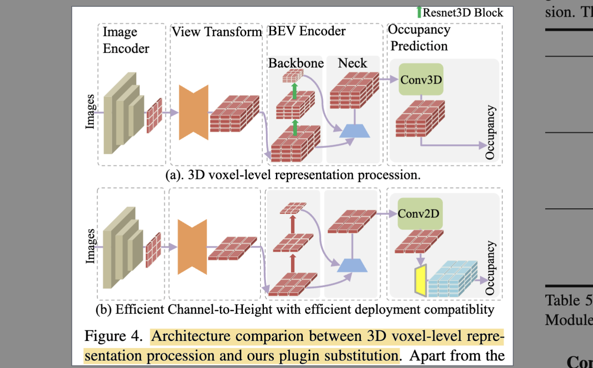
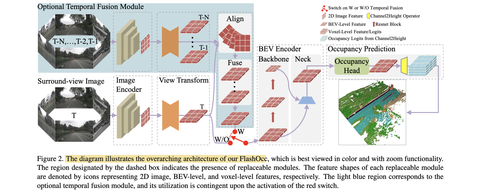
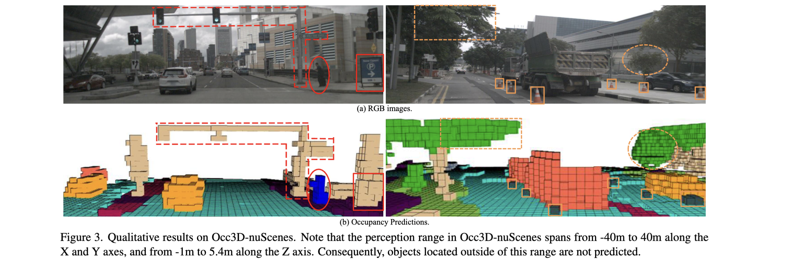

# FlashOcc: Fast and Memory-Efficient Occupancy Prediction via Channel-to-Height Plugin

- **Authors:** Zichen Yu, Changyong Shu, Jiajun Deng, Kangjie Lu, Zongdai Liu, Jiangyong Yu, Dawei Yang, Hui Li, Yan Chen
- **Affiliations:** Dalian University of Technology, Houmo AI, University of Adelaide
- **Published:** arXiv:2311.12058 (Nov 2023, tech report)
- **Keywords:** 3D occupancy prediction, bird's-eye-view, channel-to-height, plug-and-play, deployment efficiency, 2D convolution, Occ3D-nuScenes
- **GitHub:** https://github.com/Yzichen/FlashOCC

---

## Pass 1 — Bird's-Eye View

| C | Assessment |
|---|-----------|
| **Category** | An efficiency/engineering method — a plug-and-play module that makes existing camera-based 3D occupancy-prediction models fast and memory-efficient, rather than a new architecture. |
| **Context** | Builds on BEV[^1] perception ([LSS](../../2020/Lift,_Splat,_Shoot-_Encoding_Images_from_Arbitrary_Camera_Rigs_by_Implicitly_Unprojecting_to_3D/) view transform, BEVDet/BEVDepth), voxel-based occupancy methods (BEVDetOcc, UniOcc, FBOcc, TPVFormer, OccFormer, RenderOcc, PanoOcc), the Occ3D-nuScenes benchmark, and sub-pixel convolution (channel-to-space). Positioned against the trend of ever-larger 3D-voxel + 3D-conv/transformer occupancy models that are hard to deploy. |
| **Correctness** | Sound and well-validated. The claim — that a BEV feature already implicitly encodes height, so a simple *channel-to-height reshape* can replace 3D-voxel processing with almost no accuracy loss — is backed by consistent gains/parity across three baselines (BEVDetOcc, UniOcc, FBOcc) and large, clearly-measured speed/memory savings on Occ3D-nuScenes. Fair comparisons (same training recipes). Limited to one benchmark and the mIoU[^2] metric. |
| **Contributions** | (1) **FlashOcc**, a plug-and-play paradigm that drops 3D convolutions/voxel features and keeps everything in BEV with 2D convolutions; (2) the **Channel-to-Height** transformation that reshapes a flattened BEV feature into voxel occupancy logits at near-zero cost; (3) extensive validation showing SOTA-level accuracy with ~2× speed, ~69% less inference memory, and shorter training across diverse occupancy baselines. |
| **Clarity** | Clear core idea and strong efficiency tables/figures (the accuracy-vs-speed/memory trade-off plot is compelling). The writing is a bit rough (typos, arXiv tech-report polish) and detail-dense in the module tables, but the method is easy to grasp. |



**30-second summary.** FlashOcc is a plug-and-play trick that makes camera-based 3D **occupancy prediction** cheap enough to deploy. Standard occupancy models build a full 3D voxel feature and process it with expensive **3D convolutions** — heavy in memory and slow on-chip. FlashOcc observes that a **BEV feature already encodes height information implicitly** (each BEV pixel summarizes the whole vertical pillar), so it keeps features in 2D BEV, processes them with **2D convolutions**, and then applies a **Channel-to-Height** reshape (inspired by sub-pixel convolution's channel-to-space) that turns a $B\times C\times W\times H$ BEV tensor into $B\times C^*\times Z\times W\times H$ occupancy logits — with $C=C^*\times Z$ — at essentially no cost. Dropped into BEVDetOcc / UniOcc / FBOcc on Occ3D-nuScenes, it matches or beats the voxel versions (e.g. +1.3 mIoU on BEVDetOcc, surpassing transformer-based PanoOcc by 1.1) while running ~2× faster (BEV-encoder+head 7.5→3.1 ms), using ~69% less inference memory (398→124 MiB), and training faster. It is a widely-used efficiency baseline for the 2023–24 occupancy wave.

---

## Pass 2 — Careful Read



### Core Idea in One Sentence
Because a BEV feature already implicitly captures height, replace the expensive 3D-voxel + 3D-convolution stack of occupancy models with 2D convolutions on BEV features plus a cost-free "Channel-to-Height" reshape that unfolds channels into the vertical (Z) dimension to produce voxel occupancy logits.

### Method / Approach
- **Keep features in BEV, use 2D conv:** the whole pipeline (image encoder → view transform → BEV encoder → occupancy head) operates on 2D BEV features; no 3D (deformable) convolution or voxel-level transformer is used.
- **Channel-to-Height transformation:** at the occupancy head output, reshape the BEV tensor $B\times C\times W\times H$ into occupancy logits $B\times C^*\times Z\times W\times H$ with $C=C^*\times Z$ ( $C^*$ = #classes, $Z$ = #height bins). A pure reshape — no learned height representation, no extra compute.
- **Plug-and-play substitution:** take an existing voxel occupancy model, (1) set the LSS voxel grid's Z to 1, (2) swap its 3D convs for 2D convs, (3) append Channel-to-Height. Everything else (backbone, view transform, temporal module, losses, training recipe) is inherited unchanged.
- **Five modular components:** 2D image encoder (ResNet/Swin + FPN[^3]-LSS neck), view transformer (LSS/LS), BEV encoder, occupancy head + Channel-to-Height, and an optional temporal-fusion module.

### Key Results

Occ3D-nuScenes (mIoU ↑) and efficiency:

| Method | mIoU | Note |
|---|---|---|
| PanoOcc (transformer voxel SOTA) | 42.1 | prior best |
| BEVDetOcc (voxel) | 42.0 | baseline |
| **FO(BEVDetOcc)** | **43.3** | +1.3 over base; +1.1 over PanoOcc |
| UniOcc (voxel) | 45.2* | rendering-supervised |
| **FO(UniOcc)** | **45.5** | +0.3 |

Efficiency ablation (Table 3, ResNet-50, 200×200×1, TensorRT FP16 on RTX3090):

| Representation | mIoU | FPS |
|---|---|---|
| 3D voxel-level | 31.6 | 92.1 |
| Ours M0 | 31.0 | 210.6 |
| Ours M1 | 32.4 | 152.7 |

- **Huge deployment savings (Table 6):** the BEV-encoder + occupancy head drops from 7.5 ms → 3.1 ms (−58.7% latency) and 398 → 124 MiB (−68.8% inference memory), plus shorter training — and it removes the voxel-level feature entirely.
- **Generalizes across baselines:** FO(BEVDetOcc) +1.7, FO(UniOcc) −0.2, FO(FBOcc) +0.1 mIoU — consistent improvement or parity.
- **Temporal fusion still helps:** e.g. BEVDetOcc +5.4 mIoU from temporal under FlashOcc vs +4.5 for the voxel baseline.
- **Preserves height qualitatively:** overhead traffic signals, overhanging trees, small traffic cones, and pedestrian-carried objects are correctly voxelized despite the BEV-only features.



### Strengths
- **Deployment-first and effective:** turns heavy occupancy models into real-time, low-memory ones (2× speed, ~69% less memory) with no accuracy loss — directly on-chip-friendly.
- **Dead-simple, general plugin:** a reshape + conv swap that drops into many existing models; not tied to one architecture.
- **Validated breadth:** three different baselines, temporal and non-temporal, with clean latency/memory/training accounting.
- **Debunks a common assumption:** shows accurate occupancy does *not* require explicit 3D-voxel processing — BEV implicitly carries enough height information.

### Weaknesses / Open Questions
1. **Incremental, not conceptual:** the contribution is an efficiency plugin (channel-to-height ≈ sub-pixel conv applied to occupancy), not a new capability; novelty is modest.
2. **Height fidelity ceiling:** encoding Z into channels of a BEV feature can lose fine vertical detail — visible as the small −0.2 mIoU on UniOcc, whose rendering supervision wants a fine-grained volume.
3. **Z resolution costs channels:** since $C=C^*\times Z$ , increasing height resolution linearly inflates BEV channels — the memory/accuracy trade-off at higher $Z$ is unexplored.
4. **Single benchmark / metric:** only Occ3D-nuScenes mIoU; no ray-based occupancy metrics, no downstream planning evaluation, no other datasets.
5. **arXiv tech report:** not peer-reviewed at a venue; writing is rough and some ablation details are terse.

### References to Follow Up
1. **Lift, Splat, Shoot** — [Philion & Fidler, ECCV 2020](../../2020/Lift,_Splat,_Shoot-_Encoding_Images_from_Arbitrary_Camera_Rigs_by_Implicitly_Unprojecting_to_3D/): the LSS view transform used to build the BEV feature FlashOcc reshapes.
2. **Real-Time Single Image and Video Super-Resolution (sub-pixel conv)** — Shi et al., CVPR 2016: the channel-to-space idea FlashOcc adapts into channel-to-height.
3. **Occ3D: A Large-Scale 3D Occupancy Prediction Benchmark** — Tian et al., 2023: the benchmark and the CTF-Occ voxel baseline.
4. **BEVDet / BEVDetOcc** — Huang et al., 2021–23: the primary BEV-detection-turned-occupancy baseline FlashOcc plugs into.
5. **FB-OCC: Forward-Backward View Transformation** — Li et al., 2023: a stronger occupancy baseline (M7/M8) demonstrating FlashOcc's generality.

---

## Pass 3 — Virtual Re-implementation

### Detailed Technical Summary

**Problem.** Camera-only 3D occupancy prediction assigns a semantic class to every voxel of the scene, fixing 3D detection's long-tail and intricate-shape failures. But building a dense 3D voxel feature and processing it with 3D (deformable) convolutions or voxel transformers is expensive in memory and latency, blocking on-chip deployment. FlashOcc's thesis: you don't need explicit 3D-voxel processing.

**Pipeline (five modules).** Input is surround-view images, output dense occupancy. (1) **Image encoder** — a backbone (ResNet or Swin-Transformer) + an FPN-LSS neck fuse multi-scale semantics. (2) **View transformer** — LSS (pixel-wise dense depth + camera intrinsics/extrinsics project features into a predefined 3D grid, then vertical pooling → flat BEV) or Lidar-Structure (LS). (3) **BEV encoder** — a backbone+neck that refines the coarse BEV feature; feature diffusion after several blocks fixes center-feature-missing (LSS) or aliasing (LS). (4) **Occupancy head + Channel-to-Height**. (5) optional **temporal fusion**.

**Channel-to-Height (the crux).** The occupancy head (multi-layer conv, or a multi-scale fusion head for larger receptive field) outputs a BEV feature of shape $`B \times C \times W \times H`$ . The Channel-to-Height module reshapes it into occupancy logits
```math
B \times C \times W \times H \;\longrightarrow\; B \times C^* \times Z \times W \times H, \qquad C = C^* \times Z,
```
where $B$ = batch, $C^*$ = #classes, $Z$ = #height bins, and $W,H$ = BEV spatial size. This is a pure `reshape` along the channel dimension — no parameters, no learned height representation, negligible compute. The insight it exploits: after LSS's vertical pooling, each BEV pixel already summarizes all objects in its vertical pillar, so the height structure is *implicitly present* in the channels and can simply be unfolded into an explicit $Z$ axis. It is the occupancy analogue of sub-pixel convolution, where channels are rearranged into spatial resolution instead of learned via deconvolution.

**Plug-and-play conversion.** To convert a voxel model: set the LSS grid's z-dimension to 1 (so the view transform yields a genuine BEV, not a voxel volume), replace every 3D convolution in the BEV encoder / occupancy head with a 2D convolution (adjusting channel counts, see the paper's M0–M8 configs), and append Channel-to-Height at the output. Losses, supervision (including UniOcc's rendering supervision or FBOcc's forward-backward transform), temporal modules, and training schedules are all inherited unchanged.

**Temporal fusion.** Optional module with spatio-temporal alignment (ego-motion aligns historical BEV features to the current frame) + feature fusion (e.g. Stereo4D stereo-volume depth enhancement, or mono-align-concat: align and channel-concatenate the previous frame's BEV). Because everything stays in BEV, temporal fusion is also 2D and cheap.

**Training / benchmark.** Occ3D-nuScenes (700 train / 150 val scenes; range −40–40 m in X/Y, −1–5.4 m in Z; 0.4 m voxels; 17 classes; 2 Hz). AdamW, lr 1e-4, gradient clip, batch 64 on 8 GPUs; 24 epochs (BEVDetOcc/UniOcc) or 20 (FBOcc); no class-balanced grouping/sampling. Metric: mIoU over classes. FPS measured via TensorRT FP16 on RTX3090.

### Hidden Assumptions
1. **BEV pooling retains enough height information.** The whole method hinges on the vertical structure surviving LSS's height pooling into the BEV channels; scenes with rich, overlapping vertical structure could stress this.
2. **Channel budget covers the needed $Z\times C^*$ .** The BEV channel count $C$ must equal $C^*\times Z$ ; the model implicitly assumes this is affordable at the desired height resolution.
3. **2D convs suffice for 3D reasoning.** Replacing 3D with 2D convolutions assumes cross-height reasoning can be handled in the channel dimension rather than an explicit 3D receptive field.
4. **Baseline recipes transfer unchanged.** Plug-and-play assumes the original model's losses/hyperparameters remain near-optimal after the conv swap.
5. **mIoU reflects deployment quality.** Assumes voxel mIoU on Occ3D-nuScenes is the right proxy for real driving usefulness.

### Reproducibility Notes
- **Public code** (`Yzichen/FlashOCC`); all baselines (BEVDetOcc, UniOcc, FBOcc) and the Occ3D-nuScenes benchmark are public — highly reproducible.
- **Well-specified:** the Channel-to-Height reshape, the M0–M8 module configs (backbone/neck/view-transform/BEV-encoder/head/temporal), optimizer, epochs, and TensorRT FP16 measurement setup are all given.
- **Fair efficiency accounting:** latency/memory split into "others" vs "BEV enc.+occ." isolates the plugin's effect.
- **Underspecified:** exact channel counts per config require reading Table 2 carefully; some head variants (MSO multi-scale) point to FBOcc for detail.
- **Scope:** results limited to Occ3D-nuScenes / mIoU; other datasets and metrics not covered.

### Ideas for Future Work
1. **Adaptive / learned channel-to-height:** replace the fixed reshape with a lightweight learned unfold to recover the small height-fidelity gap (e.g. on rendering-supervised models).
2. **Higher-Z scaling study:** characterize the channel-vs-height trade-off and find efficient ways to raise vertical resolution.
3. **Sparse + BEV hybrids:** combine channel-to-height with sparse occupancy to further cut compute on empty space.
4. **Beyond mIoU / other datasets:** evaluate on ray-based metrics, other benchmarks, and downstream planning.
5. **On-chip deployment:** the authors' stated goal — integrate FlashOcc into a full AD perception stack for real vehicle deployment.
6. **Occupancy for world models / flow:** extend the efficient BEV-occupancy head to occupancy-flow and world-model prediction.

---

## Pass 4 — Modern Perspective Review (as of July 2026)

### What Has Changed Since Publication
- **Occupancy prediction became a core AD task.** Since 2023 it grew into a standard perception output (feeding planning and world models); FlashOcc arrived just as the field was scaling up and provided the efficiency counterweight.
- **Efficiency became a first-class axis.** FlashOcc's "keep it in BEV, avoid 3D conv" stance was echoed by a wave of fast/sparse occupancy methods (FastOcc, SparseOcc, and various deployment-oriented heads); channel-to-height became a common lightweight occupancy head.
- **Sparse and query-based occupancy matured** as an alternative efficiency route (SparseOcc, SparseBEV-style), competing with FlashOcc's dense-BEV approach.
- **Occupancy entered end-to-end and world models.** Occupancy heads (à la [UniAD](../../2023/Planning-oriented_Autonomous_Driving/)'s OccFormer) and occupancy world models (Occ3D → OccWorld → driving world models like [GaussianDWM](../../2025/GaussianDWM-_3D_Gaussian_Driving_World_Model_for_Unified_Scene_Understanding_and_Multi-Modal_Generation/)) became major directions, raising the bar beyond static mIoU.
- **Benchmarks broadened** beyond Occ3D-nuScenes mIoU (ray-based metrics, occupancy flow, larger datasets).

### Has the Community Accepted the Claims?
Yes, pragmatically. FlashOcc's central claim — that dense 3D-voxel processing is unnecessary because BEV features implicitly carry height, so a channel-to-height reshape on 2D-conv BEV features suffices — was widely accepted and adopted as a standard efficient occupancy head and a common deployment baseline. Its speed/memory numbers held up and matched the field's growing deployment focus. The nuance the community also confirmed is the method's ceiling: BEV-only features trade a little vertical fidelity, so where fine 3D detail matters (rendering supervision, very fine height), voxel or sparse-voxel methods retain a small edge — which is why sparse/query-based occupancy coexists rather than being replaced. As a research contribution it is viewed as a clever, useful engineering result rather than a conceptual breakthrough, but it is genuinely influential in practice.

---

### Comparison Papers

#### Predecessors
| Paper | Authors | Year | Relation |
|---|---|---|---|
| Lift, Splat, Shoot | Philion, Fidler | 2020 | LSS view transform that builds the BEV feature FlashOcc reshapes ([has note](../../2020/Lift,_Splat,_Shoot-_Encoding_Images_from_Arbitrary_Camera_Rigs_by_Implicitly_Unprojecting_to_3D/)) |
| Sub-pixel convolution (ESPCN) | Shi et al. | 2016 | Channel-to-space idea adapted into channel-to-height |
| BEVDet / BEVDetOcc | Huang et al. | 2021–23 | Primary BEV-detection→occupancy baseline FlashOcc plugs into |
| Occ3D (CTF-Occ) | Tian et al. | 2023 | Benchmark + coarse-to-fine voxel baseline |
| TPVFormer | Huang et al. | 2023 | Tri-perspective-view efficiency predecessor for occupancy |

#### Contemporaries / Competitors
| Paper | Authors | Year | Relation |
|---|---|---|---|
| UniOcc | Pan et al. | 2023 | Rendering-supervised occupancy baseline (FlashOcc plugin target) |
| FB-OCC | Li et al. | 2023 | Forward-backward-transform occupancy baseline (plugin target) |
| RenderOcc | Pan et al. | 2023 | 2D-rendering-supervised occupancy; compared baseline |
| PanoOcc | Wang et al. | 2023 | Transformer voxel SOTA FlashOcc surpasses by 1.1 mIoU |
| OccFormer / TPVFormer | Zhang / Huang et al. | 2023 | Concurrent transformer/TPV occupancy methods |

#### Successors / Extensions
| Paper | Authors | Year | Relation |
|---|---|---|---|
| FastOcc / SparseOcc | various | 2024 | Later efficient / sparse occupancy methods extending the efficiency push |
| OccWorld / occupancy world models | various | 2024–25 | Use occupancy as the state for driving world models |
| GaussianDWM | — | 2025 | Gaussian driving world model in the occupancy/world-model lineage ([has note](../../2025/GaussianDWM-_3D_Gaussian_Driving_World_Model_for_Unified_Scene_Understanding_and_Multi-Modal_Generation/)) |
| UniAD (OccFormer head) | Hu et al. | 2023 | Occupancy as a task inside end-to-end driving ([has note](../../2023/Planning-oriented_Autonomous_Driving/)) |

---

### Bottom Line
Worth reading if you care about deploying occupancy prediction, less so for conceptual novelty. FlashOcc's lasting value is a simple, general, and genuinely effective efficiency recipe: keep features in BEV, use 2D convolutions, and unfold channels into height with a free Channel-to-Height reshape — cutting occupancy latency ~2× and inference memory ~69% with no accuracy loss across multiple baselines. It empirically debunked the assumption that accurate occupancy needs explicit 3D-voxel processing, and channel-to-height became a standard lightweight occupancy head. Read it as the pragmatic, deployment-oriented counterpart to the accuracy-chasing occupancy literature; pair it with [LSS](../../2020/Lift,_Splat,_Shoot-_Encoding_Images_from_Arbitrary_Camera_Rigs_by_Implicitly_Unprojecting_to_3D/) (the BEV it reshapes) and the occupancy-in-planning line ([UniAD](../../2023/Planning-oriented_Autonomous_Driving/), world models) to see where the task went. It is superseded on raw accuracy by later sparse/voxel methods but remains a strong efficiency baseline.

[^1]: **BEV** — Bird's-Eye-View. See the [glossary](../../common/terms/).
[^2]: **mIoU** — mean Intersection over Union, averaged over classes; the standard occupancy/segmentation metric. See [IoU](../../common/terms/).
[^3]: **FPN** — Feature Pyramid Network. See the [glossary](../../common/terms/).
