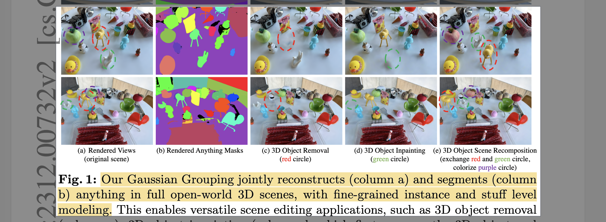
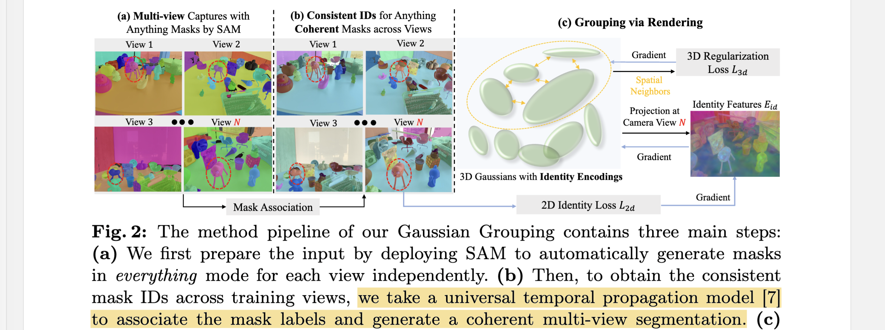

# Gaussian Grouping: Segment and Edit Anything in 3D Scenes

- **Authors:** Mingqiao Ye, Martin Danelljan, Fisher Yu, Lei Ke
- **Affiliations:** Computer Vision Lab, ETH Zurich
- **Published:** ECCV 2024, arXiv:2312.00732
- **Keywords:** 3D Gaussian Splatting, instance segmentation, open-world segmentation, scene editing, SAM, identity encoding
- **Webpage:** https://ymq2017.github.io/gaussian-grouping/
- **GitHub:** https://github.com/lkeab/gaussian-grouping

---

## Pass 1 — Bird's-Eye View

| C | Assessment |
|---|-----------|
| **Category** | Systems paper augmenting 3D Gaussian Splatting with instance-level semantic grouping; enables open-world 3D segmentation and scene editing |
| **Context** | Builds directly on 3D-GS (representation), SAM (2D mask proposals), and DEVA (cross-view mask association); competes with NeRF-based 3D understanding methods like SA3D, Panoptic Lifting, LERF |
| **Correctness** | Claims are well-supported; ablations justify each design choice (encoding dim, K for regularization, 3D loss); the 60× speedup claim for mask association is verified against the cost-based linear assignment baseline |
| **Contributions** | (1) Identity Encoding — a learnable 16-dim per-Gaussian embedding supervised by SAM 2D masks; (2) 3D spatial consistency regularization via KL divergence to nearest-neighbor Gaussians; (3) Local Gaussian Editing scheme for object removal, inpainting, colorization, style transfer, and scene recomposition; (4) LERF-Mask benchmark for fine-grained 3D segmentation evaluation |
| **Clarity** | Well-structured; pipeline is cleanly decomposed into three stages with matching figure and pseudocode |

**30-second summary:** Gaussian Grouping is the first 3D Gaussian-based method to jointly reconstruct and segment anything in the open-world 3D scene. Each Gaussian is augmented with a compact 16-dim Identity Encoding trained end-to-end: SAM generates per-image masks, DEVA zero-shot tracking associates them across views into globally consistent IDs, and differentiable rendering with a 2D cross-entropy loss plus a 3D KL-divergence regularization (encouraging nearby Gaussians to share identity) trains the encoding. The resulting grouped Gaussian representation supports versatile local scene editing — remove, inpaint, colorize, style-transfer, and recompose objects — with ~150 FPS rendering and 9-minute total segmentation time for a whole scene.



---

## Pass 2 — Careful Read

### Core Idea in One Sentence

Augment each 3D Gaussian with a learnable 16-dim Identity Encoding jointly trained via SAM-supervised 2D identity loss and a 3D spatial consistency regularization, enabling whole-scene instance segmentation and local editing in a single reconstruction run.

### Method / Approach



- **Cross-view mask association via DEVA:** SAM runs in "everything" mode per training view, producing independent per-image masks. Rather than solving a costly cross-view linear assignment at every training iteration, a pre-trained zero-shot tracker (DEVA) propagates and associates mask IDs across views before training begins — yielding $K$ globally consistent mask identities and achieving a 60× speedup over the cost-based assignment used in Panoptic Lifting.

- **Identity Encoding as a Gaussian attribute:** Each Gaussian gains a 16-dim learnable vector $e_i$ (analogous to spherical harmonic color coefficients but with SH degree fixed to 0, making it view-independent). During differentiable rendering, identity features are composited pixel-wise using the same alpha-blending formula as color: $`E_{id} = \sum_{i \in N} e_i \alpha'_i \prod_{j=1}^{i-1}(1 - \alpha'_j`)$.

- **2D Identity Loss + 3D Regularization Loss:** A shared linear layer $f$ maps rendered 16-dim features to $K$ classes (cross-entropy = $L_{2d}$). Additionally, a 3D Regularization Loss ($L_{3d}$) computes KL divergence between each Gaussian's predicted identity distribution and those of its $k$-nearest 3D neighbors in Euclidean space — directly supervising occluded Gaussians that rarely project onto training views. Total loss: $L_{render} = L_{rec} + \lambda_{2d} L_{2d} + \lambda_{3d} L_{3d}$ with $\lambda_{2d}=1.0$, $\lambda_{3d}=2.0$.

- **Local Gaussian Editing:** Editing exploits the grouped representation without full retraining: (1) **Removal** — delete target Gaussians; (2) **Inpainting** — remove target, detect image holes via Grounding-DINO, inpaint each view with LaMa, finetune 200K newly cloned Gaussians; (3) **Colorization** — finetune only SH color of target group; (4) **Style Transfer** — unfreeze position and size, finetune with InstructPix2Pix guidance; (5) **Recomposition** — exchange 3D center locations of two groups.

### Key Results

**Table 1: Reconstruction quality on Mip-NeRF 360 (7 public scenes)**

| Model | PSNR ↑ | SSIM ↑ | LPIPS ↓ | FPS ↑ |
|---|---|---|---|---|
| Gaussian Splatting [baseline] | 28.09 | 0.870 | 0.182 | ~207 |
| Gaussian Grouping | 28.43 | 0.863 | 0.189 | ~170 |

Negligible quality decrease while adding full scene segmentation capability.

**Table 3: Open-vocabulary 3D segmentation on LERF-Mask (mIoU / mBIoU)**

| Method | figurines | ramen | teatime |
|---|---|---|---|
| DEVA | 40.2 / 45.1 | 56.8 / 51.0 | 54.3 / 52.2 |
| LERF | 33.5 / 30.6 | 28.3 / 14.7 | 49.7 / 42.6 |
| SA3D | 24.9 / 23.8 | 7.4 / 7.0 | 42.5 / 39.2 |
| LangSplat | 52.8 / 50.5 | 50.4 / 44.7 | 69.5 / 65.6 |
| **Gaussian Grouping** | **69.7 / 67.9** | **77.0 / 68.7** | **71.7 / 66.1** |

**Table 4: Panoptic segmentation (Replica / ScanNet)**

| Method | Replica mIoU | Replica PQ | FPS | ScanNet mIoU | ScanNet PQ | FPS |
|---|---|---|---|---|---|---|
| Panoptic Lifting | 66.22 | 64.34 | ~10 | 67.01 | 60.74 | ~10 |
| **Gaussian Grouping** | **71.15** | **66.52** | ~140 | **68.79** | **61.43** | ~150 |

**Table 5: Scene editing quality (CLIP Text-Image Direction Similarity)**

| Task | SOTA baseline | Score | Ours |
|---|---|---|---|
| 3D Object Inpainting | SPIn-NeRF | 0.126 | **0.153** |
| 3D Object Style Transfer | Instruct-NeRF2NeRF | 0.171 | **0.178** |
| 3D Object Removal | DFFs | 0.166 | **0.183** |

**Ablation highlights:**
- Identity Encoding dim=16 is optimal; dim=32 does not improve and is 1.3× slower to train
- $K=5$ for 3D regularization loss achieves best removal accuracy (RAcc 77.8%); $K=0$ drops to 41.2%
- 2D loss alone causes "transparent bear" artifact (occluded Gaussians unsupervised); adding $L_{3d}$ fixes it
- DEVA-based mask association: 1 minute; cost-based linear assignment: >1 hour per 2K iterations

### Strengths

- **Training efficiency:** Whole-scene segmentation completes in 9 minutes (vs SA3D's 35 min per single object)
- **No architectural overhead for rendering:** Identity Encoding uses the exact same differentiable splatting pipeline as color — no additional MLP or rendering branch
- **3D spatial regularization:** The KL-divergence loss handles occluded Gaussians that standard 2D supervision misses
- **Multi-object concurrent editing:** Grouped representation allows simultaneous, non-interfering edits to multiple objects
- **New benchmark:** Introduces LERF-Mask, annotating 3 scenes from LERF-Localization with per-pixel masks and 23 text query prompts

### Weaknesses / Open Questions

1. **Static scenes only:** The method has no temporal or dynamic modeling — cannot segment or edit moving objects across time.
2. **No semantic language in Identity Encoding:** Identity Encoding is pure instance ID — text queries require Grounding DINO post-hoc; complex language prompts or unusual object descriptions can yield wrong masks.
3. **Dependent on DEVA association accuracy:** If DEVA's zero-shot tracking fails (e.g., sparse view inputs, large appearance changes), the identity labels are noisy — propagating downstream.
4. **SH degree 0 identity is view-independent:** While this is by design (identity shouldn't change with view), it means the identity encoding cannot represent any view-dependent grouping ambiguity.
5. **Continuous learned encoding has alpha-blending ambiguity:** ObjectGS (2025) later identifies that continuous identity vectors mix across object boundaries during alpha compositing — a fundamental limitation this paper doesn't address.

### References to Follow Up

1. **3D Gaussian Splatting for Real-Time Radiance Field Rendering** — Kerbl et al., SIGGRAPH 2023: The base representation this paper augments; essential for understanding the rendering pipeline.
2. **Tracking Anything with Decoupled Video Segmentation (DEVA)** — Cheng et al., ICCV 2023: Cross-view mask association backbone; the reason Gaussian Grouping is 60× faster than prior assignment methods.
3. **Panoptic Lifting** — Siddiqui et al., CVPR 2023: Closest NeRF-based competitor for 3D panoptic segmentation; uses cost-based linear assignment that Gaussian Grouping replaces with DEVA.
4. **SA3D: Segment Anything in 3D** — Cen et al., NeurIPS 2023: Alternative approach lifting SAM to 3D via NeRF; requires per-object training, so 35 min per object vs 9 min for all objects here.
5. **ObjectGS** — Zhu et al., ICCV 2025: Extends Gaussian Grouping with Scaffold-GS backbone and discrete one-hot encoding to fix alpha-blending ambiguity; achieves IoU 88.4 vs 83.4 on Replica.

---

## Pass 3 — Virtual Re-implementation

### Detailed Technical Summary

**Data Preprocessing — Cross-view Mask Association**

Given multi-view images $\{I_1, ..., I_V\}$:

1. Run SAM in "everything" mode on each view independently → per-image mask sets $\{m_1, ..., m_K\}$ per view.
2. Treat the multi-view collection as a video sequence. Apply DEVA zero-shot tracker to propagate mask labels across frames using bi-directional in-clip consensus, producing $K$ globally consistent identities $\{\hat{M}_1, ..., \hat{M}_K\}$ across all views.
3. This results in coherent multi-view segmentation as training supervision — no per-iteration assignment needed.

**Gaussian Representation Extension**

Each Gaussian $S_{\Theta_i}$ extends the standard 3D-GS parameters $\{p_i, s_i, q_i, \alpha_i, c_i\}$ with a new attribute: Identity Encoding $e_i \in \mathbb{R}^{16}$.

The Identity Encoding is modeled analogously to spherical harmonic color coefficients but with SH degree = 0 (zero-th order, view-independent DC component only). This is a deliberate design choice: instance identity is semantically invariant to viewing angle.

**Differentiable Identity Rendering**

The 2D identity image $E_{id}$ is computed by differentiable rendering using the same alpha-blending as color:

```math
E_{id} = \sum_{i \in N} e_i \alpha'_i \prod_{j=1}^{i-1}(1 - \alpha'_j)
```

where the influence weight $\alpha'_i$ is computed from the Gaussian's 2D covariance $\Sigma^{2D}$ projected from 3D:

```math
\Sigma^{2D} = J W \Sigma^{3D} W^T J^T
```

$J$ is the Jacobian of the affine approximation of 3D→2D projection, $W$ is the world-to-camera matrix. This projection follows the standard 3D-GS splatting.

The rendered $E_{id} \in \mathbb{R}^{16 \times H \times W}$ is a 16-channel 2D identity feature map.

**2D Identity Loss $L_{2d}$**

A shared linear classifier $f: \mathbb{R}^{16} \rightarrow \mathbb{R}^K$ maps rendered 16-dim features to $K$ class logits (where $K$ is the total number of unique instance masks in the 3D scene). Softmax + cross-entropy against the DEVA-associated 2D mask labels $\hat{M}$ gives:

```math
L_{2d} = L_{CE}(softmax(f(E_{id})), \hat{M})
```

**3D Regularization Loss $L_{3d}$**

To supervise Gaussians that are occluded in most training views, the 3D spatial consistency loss enforces that a Gaussian's predicted identity distribution matches those of its $k$ nearest 3D Euclidean neighbors:

```math
L_{3d} = \frac{1}{m} \sum_{j=1}^{m} D_{KL}(P \| Q) = \frac{1}{mk} \sum_{j=1}^{m} \sum_{i=1}^{k} F(e_j) \log \left( \frac{F(e_j)}{F(e'_i)} \right)
```

where $P$ is the softmax distribution of sampled Gaussian $e_j$ , $Q = \{e'_1, ..., e'_k\}$ is its $k$ nearest neighbors in 3D space, and $F = softmax \circ f$ (shared classification layer). Hyperparameters: $k=5$, $m=1000$ (downsampled point cloud for efficiency).

**Total Training Objective**

```math
L_{render} = L_{rec} + L_{id} = L_{rec} + \lambda_{2d} L_{2d} + \lambda_{3d} L_{3d}
```

with $\lambda_{2d} = 1.0$ and $\lambda_{3d} = 2.0$ . $L_{rec}$ is the standard 3D-GS reconstruction loss (L1 + D-SSIM). All components are optimized jointly end-to-end from scratch.

**Density Control**

Identical to the original 3D-GS adaptive density control (split and clone based on position gradient magnitude and opacity thresholds). The Identity Encoding is initialized to 0 and participates in the same gradient flow.

**Local Gaussian Editing**

After training, editing is performed without re-training the full scene:

- **Removal:** Delete all Gaussians $\{G_j\}$ classified as target instance label. Optionally remove Gaussians inside the convex hull of deleted points.
- **Inpainting (5-step pipeline):**
  1. Train Gaussian Grouping for 30K iterations
  2. Delete target Gaussians
  3. Detect hole regions (invisible pixels across all views) via Grounding-DINO
  4. Inpaint each rendered view with LaMa; clone 200K new Gaussians near deletion
  5. Finetune new Gaussians only using L1 loss (outside mask) + LPIPS loss (inside bounding box)
- **Style Transfer:** Unfreeze 3D positions and sizes of target group; use InstructPix2Pix to generate per-view style-transferred images; finetune with L1 (inside mask) + LPIPS (inside bounding box)
- **Colorization:** Finetune only SH color parameters of target group
- **Recomposition:** Exchange 3D center positions of two Gaussian groups directly (no parameter update)

**Implementation Details**

| Hyperparameter | Value |
|---|---|
| Identity Encoding dim | 16 |
| Classifier linear layer | 16 → 256 (intermediate), then → K |
| $\lambda_{2d}$ | 1.0 |
| $\lambda_{3d}$ | 2.0 |
| Adam lr (identity encoding) | 2.5e-3 |
| Adam lr (linear layer) | 5e-4 |
| 3D regularization $k$ | 5 |
| 3D regularization $m$ | 1000 |
| Training iterations | 30K |
| Hardware | 1× A100 GPU |

### Hidden Assumptions

1. **SAM masks are semantically coherent within a view:** The method assumes SAM's "everything" masks respect object boundaries well enough to serve as noisy but useful instance supervision.
2. **DEVA tracks instances reliably without explicit category information:** Cross-view mask association assumes appearance-based tracking (DEVA) can propagate correct IDs even when object poses and occlusions change substantially between views.
3. **3D spatial proximity implies same instance:** The 3D regularization loss assumes nearby Gaussians in Euclidean space belong to the same object — this fails at object boundaries.
4. **Static scene:** No temporal modeling; all Gaussians occupy fixed positions with no motion model.
5. **Instance IDs are stable across the full training:** Once DEVA assigns $K$ identities, $K$ is fixed — new objects appearing only in late frames require special handling (new ID via high-confidence detection).

### Reproducibility Notes

- **Code:** Open-sourced at [lkeab/gaussian-grouping](https://github.com/lkeab/gaussian-grouping) based on 3D-GS codebase.
- **Preprocessing:** Requires running SAM + DEVA before training; DEVA provides cross-frame consistent masks. The LERF-Mask dataset annotation (Roboflow + SAM interactive) is described but labels not publicly released in the main paper.
- **Compute:** 30K iterations on 1× A100 GPU; ~1 hour training + 20 minutes finetuning for inpainting (vs 5 hours for SPIn-NeRF).
- **Underspecified:** The exact DEVA configuration (propagation interval, confidence threshold) and the strategy for determining $K$ (total mask count) from DEVA outputs is not fully specified. The forward/backward CUDA rasterization for Identity Encoding is implemented as a custom kernel (same as 3D-GS RGB feature).
- **Datasets:** Mip-NeRF 360 (7 of 9 scenes, flowers and treehill excluded for non-public rights), LERF-Localization, Replica, ScanNet, LLFF, Tanks & Temples, Instruct-NeRF2NeRF.

### Ideas for Future Work

1. **Dynamic scene extension:** Add temporal modeling (e.g., 4D-GS deformation field) so Identity Encoding can track objects across time and support video scene editing.
2. **Language-aware identity:** Embed CLIP or language features directly into the Identity Encoding (as LangSplat does for language fields) so text queries don't require post-hoc Grounding DINO lookup.
3. **Discrete one-hot encoding:** Replace continuous 16-dim learned encoding with one-hot object ID vectors to eliminate alpha-blending ambiguity at boundaries (this direction was later pursued by ObjectGS).
4. **Unsupervised 3D grouping:** Remove dependency on SAM by learning identity encodings from photometric consistency and 3D spatial cues alone.
5. **Anchor-based representation:** Replace flat Gaussian list with anchor-based structure (Scaffold-GS) so object IDs can propagate through grow/prune, enabling semantically clean scene reconstruction at scale.

---

## Pass 4 — Modern Perspective Review (as of June 2026)

### What Has Changed Since Publication

- **Discrete over continuous encoding:** ObjectGS (ICCV 2025) identified that continuous identity vectors in Gaussian Grouping suffer from alpha-blending ambiguity at object boundaries — blended vectors don't represent any real instance. One-hot encoding eliminates this and outperforms Gaussian Grouping by ~5 IoU points on Replica.
- **SAM 2 supersedes SAM+DEVA:** SAM 2 (ECCV 2024) handles video directly with a streaming memory model, providing more robust cross-frame mask consistency than the SAM+DEVA pipeline. New methods now use SAM 2 for mask association.
- **Anchor-based 3D-GS has become dominant:** Scaffold-GS and its descendants (Octree-AnyGS, ObjectGS) show better rendering quality and scalability than flat 3D-GS. Gaussian Grouping's flat representation limits its scaling to large scenes.
- **Feature Splatting has diversified:** LangSplatV2, Feature 3DGS, and other works now attach richer multi-modal features (language, depth, normals) to Gaussians — the general paradigm of augmenting Gaussian attributes is now widely adopted.
- **3D scene editing has matured:** GaussianEditor, Instruct-GS2GS, and similar works have refined the editing pipeline; the CLIP Text-Image Direction Similarity metric used in this paper is now recognized as a weak proxy for editing quality.

### Has the Community Accepted the Claims?

Yes, broadly. Gaussian Grouping established the key paradigm — add a compact per-Gaussian semantic attribute, supervise via differentiable rendering with 2D mask labels, and use 3D spatial regularization for occluded Gaussians — and this framework has been widely adopted and extended. The LERF-Mask benchmark has seen adoption in subsequent work. The main criticism that emerged (from ObjectGS and related work) is that continuous identity encodings are fundamentally flawed in alpha-blended rendering because blended real-valued vectors don't correspond to any single instance. The 3D regularization loss partially mitigates this but doesn't eliminate the boundary ambiguity. The paper's inpainting and style transfer results were competitive in 2024 but have since been surpassed by methods that combine stronger generative priors (diffusion models) with Gaussian representations.

---

### Comparison Papers

#### Predecessors

| Paper | Authors | Year | Relation |
|---|---|---|---|
| 3D Gaussian Splatting for Real-Time Radiance Field Rendering | Kerbl et al. | 2023 | Base representation; Gaussian Grouping augments each Gaussian with Identity Encoding on top of the full 3D-GS pipeline |
| Segment Anything (SAM) | Kirillov et al. | 2023 | 2D mask proposal generator; SAM "everything" mode produces per-image instance masks used as training supervision |
| Tracking Anything with Decoupled Video Segmentation (DEVA) | Cheng et al. | 2023 | Cross-view mask association backbone; treats multi-view as video and propagates consistent IDs, achieving 60× speedup over linear assignment |
| Language Embedded Radiance Fields (LERF) | Kerr et al. | 2023 | Baseline for open-vocab 3D localization; Gaussian Grouping borrows its LERF-Localization dataset and extends it into LERF-Mask |
| LaMa (Large Mask Inpainting) | Suvorov et al. | 2022 | 2D inpainting backbone used in the 3D object inpainting pipeline to fill per-view holes after Gaussian deletion |
| Grounding DINO | Liu et al. | 2023 | Used as text-driven detector to identify which mask ID corresponds to a text query at inference time |

#### Contemporaries / Competitors

| Paper | Authors | Year | Relation |
|---|---|---|---|
| SA3D: Segment Anything in 3D | Cen et al. | 2023 | Also lifts SAM to NeRF-based 3D; requires 35 min per single object vs. 9 min for all objects here; LERF-Mask mIoU ~25 vs ~70 |
| Panoptic Lifting | Siddiqui et al. | 2023 | 3D panoptic segmentation via NeRF + cost-based mask linear assignment; Gaussian Grouping replaces this with DEVA and achieves better IoU at ~15× FPS |
| SPIn-NeRF | Mirzaei et al. | 2023 | 3D object inpainting via neural radiance fields; requires 5h training; Gaussian Grouping achieves better inpainting in 1h training + 20 min finetuning |
| Instruct-NeRF2NeRF | Haque et al. | 2023 | 3D scene editing via InstructPix2Pix applied to NeRF; Gaussian Grouping adopts InstructPix2Pix for style transfer and outperforms it in CLIP similarity |
| Distilled Feature Fields (DFFs) | Kobayashi et al. | 2022 | Feature field distillation for NeRF editing and object removal; limited by CLIP feature quality for large object removal; Gaussian Grouping outperforms on Tanks & Temples removal |
| LangSplat | Qin et al. | 2023 | Concurrent work attaching 3-level CLIP language features to each Gaussian; focuses on open-vocabulary language queries rather than instance segmentation; competes on LERF-Mask but at lower accuracy |

#### Successors / Extensions

| Paper | Authors | Year | Relation |
|---|---|---|---|
| ObjectGS | Zhu et al. | 2025 | Extends to Scaffold-GS backbone; replaces continuous 16-dim encoding with discrete one-hot IDs, fixing alpha-blending ambiguity; achieves IoU 88.4 vs 83.4 on Replica; strongest follow-up (from knowledge graph) |
| CosseGaussians | Dou et al. | 2024 | Compact Gaussian segmentation with dual feature fusion; targets efficient mobile-scale 3D instance segmentation |
| Feature 3DGS / Gaussian Feature Fields | Various | 2024 | General paradigm of augmenting 3D-GS with per-Gaussian semantic/feature attributes; directly inherits the architecture introduced here |
| SAGA / Segment Any 3D Gaussian | — | 2024 | Zero-shot 3D Gaussian segmentation using SAM prompts; refines the interaction modality while building on the same grouped Gaussian concept |

---

### Bottom Line

Gaussian Grouping is a foundational paper — it established the dominant paradigm for instance-level 3D Gaussian scene understanding and demonstrated that compact per-Gaussian semantic encodings can be jointly trained with appearance reconstruction at minimal quality cost. It is worth reading both for the specific techniques (3D regularization loss, DEVA-based mask association, local editing scheme) and for the architectural template it established. The main caveat to keep in mind when reading today is that the continuous identity encoding has a fundamental alpha-blending ambiguity that ObjectGS later identified and fixed — so for state-of-the-art performance, pair this paper with ObjectGS (2025). The scene editing demonstrations (inpainting, style transfer) are illustrative but have been surpassed; the segmentation benchmark (LERF-Mask) and the grouping-via-rendering paradigm remain relevant references.
