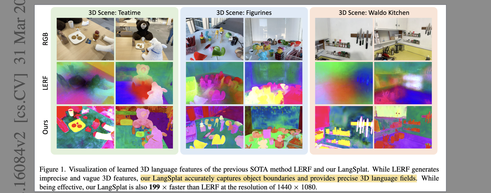
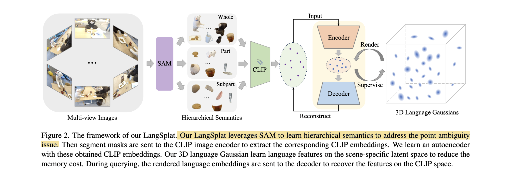

# LangSplat: 3D Language Gaussian Splatting

- **Authors:** Minghan Qin*, Wanhua Li*, Jiawei Zhou*, Haoqian Wang, Hanspeter Pfister (* equal contribution)
- **Affiliations:** Tsinghua University, Harvard University
- **Published:** CVPR 2024 (arXiv:2308.09971, 2023)
- **Keywords:** 3D Gaussian Splatting, language fields, CLIP, SAM, open-vocabulary querying, scene-specific autoencoder
- **Webpage**: https://langsplat.github.io/
- **Github**: https://github.com/minghanqin/LangSplat

---

## Pass 1 — Bird's-Eye View

| C | Assessment |
|---|-----------|
| **Category** | Method paper: extends 3D Gaussian Splatting to support open-vocabulary language queries in 3D by embedding CLIP features into Gaussians |
| **Context** | Builds directly on 3DGS (Kerbl et al., SIGGRAPH 2023) and LERF (Kerr et al., ICCV 2023); adopts SAM (Kirillov et al., ICCV 2023) for precise segmentation and CLIP (Radford et al., ICML 2021) for language-vision alignment |
| **Correctness** | Claims are well-supported by ablation and multi-dataset evaluation. The 199× speedup claim is on specific hardware and resolution (RTX 3090, 1440×1080) and holds because NeRF volume rendering is fundamentally slower than tile-based splatting. Evaluation is limited to indoor tabletop scenes; large-scale outdoor or unbounded scene performance is untested |
| **Contributions** | (1) First 3DGS-based 3D language field; (2) Scene-specific autoencoder compressing 512-dim CLIP to 3-dim latent, solving the memory explosion of explicit representation; (3) SAM-based hierarchical semantic supervision solving the point ambiguity problem without DINO regularization; (4) 199× faster than LERF at 1440×1080 resolution |
| **Clarity** | Well-written and tightly structured. Framework figure (Fig. 2) clearly conveys the pipeline. Ablation tables are exemplary — each component is isolated and measured. Supplementary material is thorough |

LangSplat replaces the NeRF backbone of prior 3D language fields (LERF) with 3D Gaussian Splatting. Each Gaussian is augmented with three language embeddings at subpart/part/whole semantic scales, distilled from CLIP features computed on SAM-generated masks. A scene-specific autoencoder compresses 512-dim CLIP embeddings to 3 dimensions, keeping memory manageable. At query time, language features are splatted to 2D, decoded back to CLIP space, and matched against text queries. The method achieves 84.3% localization accuracy and 93.4% mIoU on two benchmarks, outperforming LERF by large margins while being 199× faster.

---

## Pass 2 — Careful Read

### Core Idea in One Sentence

Replace NeRF-based language fields with 3D Gaussian Splatting, using SAM's hierarchical masks for precise pixel-aligned CLIP supervision and a scene-specific autoencoder to compress features to a 3-dim latent, achieving both higher accuracy and 199× faster querying than LERF.

### Method / Approach

- **SAM-based Hierarchical Semantic Supervision:** A $32 \times 32$ grid of point prompts is fed to SAM, producing three segmentation maps $M^s, M^p, M^w$ at subpart, part, and whole semantic levels. CLIP features are extracted per mask region — $L_t^l(v) = V(I_t \odot M^l(v))$ — yielding pixel-aligned embeddings free of the patch-blurring and scale-search issues that plague LERF. This eliminates the need for DINO regularization and multi-scale inference.

- **3D Language Gaussians:** Each 3D Gaussian is augmented with three language embeddings $\{f^s, f^p, f^w\} \in \mathbb{R}^d$. These are rendered to 2D using the same tile-based alpha compositing as color: $F^l(v) = \sum_{i \in \mathcal{N}} f_i^l \alpha_i \prod_{j=1}^{i-1}(1 - \alpha_j)$. Language and geometry share the same Gaussian primitives, so rendering remains real-time.

- **Scene-Specific Autoencoder:** Storing 512-dim CLIP features in millions of Gaussians would require 35× more memory than RGB, exceeding L1 cache. A lightweight MLP autoencoder $E: \mathbb{R}^D \to \mathbb{R}^d$ (with $d=3$) is trained per scene on the set of SAM-masked CLIP features, exploiting the fact that scene features are sparse in CLIP space. The decoder $\Psi$ recovers full CLIP embeddings at query time. This compression is scene-specific — not universal — making it feasible.

- **Two-Stage Training + Querying:** Stage 1: standard 3DGS RGB training (30k iterations, all parameters). Stage 2: fix geometry/color, train only language features (30k iterations, ~25 min on RTX 3090). Queries compute a relevancy score against canonical phrases and select the best of the three semantic scales automatically.

### Key Results

| Benchmark | Metric | LSeg | LERF | **LangSplat** |
|-----------|--------|------|------|--------------|
| LERF dataset | Localization accuracy ↑ | 21.1% | 73.6% | **84.3%** |
| LERF dataset | Seg. IoU ↑ | 16.6% | 37.4% | **51.4%** |
| 3D-OVS dataset | mIoU ↑ | 20.6% | 54.8% | **93.4%** |
| 3D-OVS dataset | Accuracy ↑ | 54.1% | 76.7% | **98.9%** |
| Speed (1440×1080) | s/query ↓ | — | ~55.7 | **0.28** (199× faster) |

Ablation highlights (ramen scene, bench scene):
- SAM alone (replacing multi-scale patches) gives +18.54% IoU — the single biggest gain.
- 3DGS alone (without autoencoder) causes OOM on explicit CLIP feature storage.
- Autoencoder + 3DGS recovers from OOM and adds further accuracy/speed gains.
- Latent dim $d=3$ is near-optimal: $d=2$ degrades significantly (91.93% vs 94.19%), $d=8$ adds negligible gain (+1%).

### Strengths

- **Clean ablation story:** Every component is independently validated; gains are additive and large.
- **SAM insight is non-obvious:** Using SAM not just for masks but to define the semantic hierarchy eliminates DINO regularization — a simpler and more effective solution to point ambiguity.
- **Extreme compression works:** 512→3 dimensions per Gaussian is a 170× compression, yet achieves 94.2% mIoU. The scene-specific prior makes this feasible where a universal compressor would fail.
- **Speed advantage is structural:** The 199× speedup over LERF comes from fundamental rendering architecture (splatting vs. ray marching), not engineering tricks, so it generalizes.
- **No category list required:** Unlike 3D-OVS, LangSplat queries with arbitrary text and still outperforms methods that use the full category list.

### Weaknesses / Open Questions

1. **Per-scene optimization:** Like 3DGS, the model requires per-scene training (~25 min). There is no feed-forward generalizable version — each new scene starts from scratch.
2. **Indoor tabletop bias:** Evaluation datasets (LERF, 3D-OVS) contain small-scale indoor scenes. Performance on large outdoor or unbounded scenes is unexplored.
3. **SAM 3-level granularity:** Only 3 semantic scales (subpart/part/whole) are considered. Highly specific queries (e.g., a button on a shirt) or very coarse scene-level queries may not fit these levels.
4. **Latent dimension $d=3$ chosen for visualizability:** The choice of $d=3$ is partly motivated by enabling direct RGB visualization, not purely by accuracy — a somewhat unprincipled decision.
5. **Static scenes only:** The Gaussian reconstruction is static; dynamic objects or changing scenes are not handled.

### References to Follow Up

1. **Language Embedded Radiance Fields (LERF)** — Kerr et al., ICCV 2023: The primary baseline LangSplat replaces; understanding LERF's multi-scale patch approach clarifies why SAM is better.
2. **3D Gaussian Splatting for Real-Time Radiance Field Rendering** — Kerbl et al., SIGGRAPH 2023: The rendering backbone; the tile-based rasterizer is directly reused.
3. **Segment Anything** — Kirillov et al., ICCV 2023: The foundation model providing hierarchical masks; LangSplat's key insight is using SAM's semantic hierarchy, not just its masks.
4. **Distilled Feature Fields (DFF)** — Kobayashi et al., NeurIPS 2022: Early work on distilling 2D features (DINO/LSeg) into NeRF; the conceptual predecessor to LangSplat's language field approach.
5. **Weakly Supervised 3D Open-Vocabulary Segmentation (3D-OVS)** — Liu et al., NeurIPS 2023: Key competitor and dataset provider; uses CLIP+DINO in NeRF with category list.

---

## Pass 3 — Virtual Re-implementation

### Detailed Technical Summary

**Scene Reconstruction.** LangSplat begins with a standard 3DGS RGB reconstruction. Given calibrated multi-view images $\{I_t\}$, 3D Gaussians are fit for 30,000 iterations using the original 3DGS loss (photometric + SSIM + regularization). Each Gaussian is characterized by mean $\mu \in \mathbb{R}^3$, covariance $\Sigma$ (parameterized by scale $s$ and rotation $r$), opacity $o$, and spherical harmonics color coefficients. After this stage, all Gaussian parameters except the language features are frozen.

**SAM Hierarchical Mask Generation.** For each training image $I_t$, a $32 \times 32$ regular grid of point prompts is fed to SAM (ViT-H). SAM returns three masks per point — whole, part, subpart — yielding three mask sets $M_0^w, M_0^p, M_0^s$. Redundant masks are removed using predicted IoU score, stability score, and overlap rate. The three filtered sets are independently aggregated into full-image segmentation maps $M^w, M^p, M^s$ that partition the scene into non-overlapping semantically meaningful regions at each level.

**Pixel-Aligned CLIP Feature Extraction.** For each pixel $v$ and each semantic level $l \in \{s, p, w\}$, the CLIP image encoder $V$ (OpenCLIP ViT-B/16) processes the image masked to the region containing $v$:

$$L_t^l(v) = V(I_t \odot M^l(v)), \quad l \in \{s, p, w\}$$

This gives a 512-dim CLIP embedding that is precisely aligned with the mask boundary, not a fuzzy patch crop. All pixels within the same mask share the same CLIP embedding (the mask's embedding), making the features pixel-aligned.

**Scene-Specific Autoencoder.** Directly storing $D=512$-dim CLIP features in millions of Gaussians is infeasible (L1 cache OOM). The collection of all mask CLIP features $\{L_t^l\}$ across the scene is sparse in the 512-dim CLIP space (hundreds of masks vs. 400M CLIP training images). A scene-specific MLP autoencoder exploits this sparsity:

- Encoder: $E: \mathbb{R}^{512} \to \mathbb{R}^d$, producing $H_t^l(v) = E(L_t^l(v))$
- Decoder: $\Psi: \mathbb{R}^d \to \mathbb{R}^{512}$, recovering full CLIP embeddings

Training objective:

$$\mathcal{L}_{ae} = \sum_{l \in \{s,p,w\}} \sum_{t=1}^{T} d_{ae}\!\left(\Psi\!\left(E\!\left(L_t^l(v)\right)\right), L_t^l(v)\right)$$

where $d_{ae}$ combines $\mathcal{L}_1$ and cosine distance loss. In practice $d=3$, chosen because 3-dim features can be directly visualized as RGB. Ablations show $d=3$ vs $d=8$ differ by only 1% mIoU while $d=1$ fails completely (6.46% mIoU).

**3D Language Gaussian Training.** Each Gaussian is augmented with $\{f^s, f^p, f^w\} \in \mathbb{R}^3$. Language features are rendered using the identical alpha-compositing formula as color:

$$F^l(v) = \sum_{i \in \mathcal{N}} f_i^l \alpha_i \prod_{j=1}^{i-1}(1 - \alpha_j), \quad l \in \{s, p, w\}$$

The rendered 3-dim features are supervised against the encoded CLIP features $H_t^l(v)$:

$$\mathcal{L}_{lang} = \sum_{l \in \{s,p,w\}} \sum_{t=1}^{T} d_{lang}\!\left(F_t^l(v), H_t^l(v)\right)$$

Only language features $\{f^s, f^p, f^w\}$ are optimized (30k iterations); all other Gaussian parameters remain frozen from Stage 1. Total scene training: ~25 min, ~4 GB VRAM on RTX 3090.

**Open-Vocabulary Querying.** At inference: (1) render $F^l(v)$ for all three levels, (2) decode each to CLIP space: $\Psi(F^l) \in \mathbb{R}^{512 \times H \times W}$, (3) compute relevancy score for text query $\phi_{qry}$:

$$\text{relevancy}(v) = \min_i \frac{\exp(\phi_{img}(v) \cdot \phi_{qry})}{\exp(\phi_{img}(v) \cdot \phi_{qry}) + \exp(\phi_{img}(v) \cdot \phi_{canon}^i)}$$

where $\phi_{canon}^i \in \{\text{"object"}, \text{"things"}, \text{"stuff"}, \text{"texture"}\}$ are canonical phrases. The semantic level with the highest smoothed relevancy is chosen. For localization: pick max-relevancy point. For segmentation: threshold relevancy map.

### Hidden Assumptions

1. SAM's three-level hierarchy (subpart/part/whole) is sufficient to capture all semantically distinct granularities a user might query — fails for highly specific sub-object parts or scene-level queries.
2. CLIP features of scene masks are sparse in the 512-dim space, enabling extreme compression to $d=3$ — may not hold for highly diverse scenes with many distinct object categories.
3. The RGB 3DGS reconstruction is accurate before language training begins — language quality inherits reconstruction errors (floaters, blurry regions map to bad language fields).
4. All relevant scene elements are visible across training views — occluded objects at training time receive no language supervision.
5. SAM's zero-shot segmentation quality is high for the scene type — performance degrades on domain-shifted scenes (medical, microscopy, very cluttered scenes).
6. The same $32 \times 32$ grid prompt density works for all scene sizes — may under-sample small objects in large scenes or over-sample in simple ones.

### Reproducibility Notes

- **Code:** Released at `https://github.com/minghanqin/LangSplat` (mentioned in paper).
- **Models:** OpenCLIP ViT-B/16 (language encoder), SAM ViT-H (segmentation). Both publicly available.
- **Data:** LERF dataset (released by Kerr et al.); 3D-OVS dataset (released by Liu et al.). Both public.
- **Hardware:** Single NVIDIA RTX 3090; ~25 min per scene for language stage + ~1 hr for 3DGS RGB stage.
- **Key hyperparameters:** $d=3$ latent dim; $32 \times 32$ SAM prompt grid; 30,000 iterations per stage; ~2.5M Gaussians per scene; relevancy smoothing filter size 20.
- **Underspecified:** Architecture of the autoencoder MLP (number of layers, hidden dims); exact distance function $d_{lang}$ used in the language loss; learning rate schedule for language stage; how duplicate/overlapping SAM masks are merged into the final segmentation maps.

### Ideas for Future Work

1. **Feed-forward language Gaussians:** Train a network to predict per-Gaussian language features from images in a single forward pass, eliminating 30k-iteration per-scene optimization.
2. **Universal autoencoder:** Rather than a per-scene autoencoder, train a scene-agnostic compressor using a diverse dataset of scenes — would enable zero-shot deployment.
3. **Dynamic scenes:** Combine with Dynamic 3D Gaussians (Luiten et al.) to build time-varying language fields for grounding queries in dynamic videos.
4. **Beyond CLIP:** Replace CLIP with stronger vision-language models (BLIP-2, SigLIP, or large VLMs) for richer semantic queries including spatial relations and attributes.
5. **Hierarchical query refinement:** Instead of selecting one of three fixed semantic levels, train a continuous selector that can interpolate between levels based on query specificity.
6. **Cross-scene generalization:** Transfer learned language features from a source scene to a similar target scene without full retraining, leveraging shared object vocabularies.

---

## Pass 4 — Modern Perspective Review (as of June 2026)

### What Has Changed Since Publication

- **Feed-forward 3DGS has arrived:** Methods like pixelSplat, MVSplat, and Splatt3R reconstruct Gaussians in seconds without per-scene optimization. LangSplat's ~55-minute-per-scene pipeline is increasingly impractical compared to this trajectory.
- **VLMs have superseded CLIP for grounding:** GPT-4V, LLaVA-1.6, InternVL, and Qwen-VL provide richer semantic understanding than CLIP, including spatial relations, attributes, and compositional queries. CLIP-only grounding is now a baseline, not the state of the art.
- **SAM 2 and video SAM:** SAM's successor handles video and tracks masks across time, enabling consistent language grounding in dynamic scenes — a limitation of the original LangSplat.
- **3D language fields have proliferated:** OpenGaussian, LangSplat-based extensions (GaussianDWM, Feature3DGS), and Gaussian grouping methods have built on LangSplat's foundation, extending it to editing, manipulation, and world modeling.
- **Evaluation benchmarks have grown:** ScanQA, SQA3D, and EmbodiedScan now provide richer 3D question-answering benchmarks. The LERF and 3D-OVS datasets used in LangSplat are seen as small-scale and narrow.

### Has the Community Accepted the Claims?

LangSplat has been widely accepted as a foundational contribution. The core claim — that 3DGS renders language features dramatically faster than NeRF while achieving better accuracy via SAM supervision — is validated and uncontested. The 199× speedup is real and stems from architectural necessity. The SAM-based hierarchical approach is clever and has been adopted by several follow-on works. However, the community has moved quickly: within a year, methods with better VLM backbones and, more significantly, methods that eliminate per-scene optimization have raised the bar substantially. LangSplat is now more of a historical anchor than the current frontier, but its technical contributions (the scene-specific autoencoder and SAM-hierarchy approach) remain cited and influential.

---

### Comparison Papers

#### Predecessors

| Paper | Authors | Year | Relation |
|-------|---------|------|----------|
| 3D Gaussian Splatting for Real-Time Radiance Field Rendering | Kerbl, Kopanas, Leimkuehler, Drettakis | 2023 | Direct base renderer; LangSplat reuses the tile rasterizer and Gaussian primitives verbatim |
| LERF: Language Embedded Radiance Fields | Kerr, Kim, Goldberg, Kanazawa, Tancik | ICCV 2023 | Primary baseline replaced; established the CLIP-in-NeRF paradigm and evaluation datasets |
| Segment Anything | Kirillov et al. | ICCV 2023 | Provides the hierarchical mask generation that solves point ambiguity |
| Distilled Feature Fields | Kobayashi, Matsumoto, Sitzmann | NeurIPS 2022 | Conceptual predecessor: distills 2D features (DINO/LSeg) into NeRF for open-vocab understanding |

#### Contemporaries / Competitors

| Paper | Authors | Year | Relation |
|-------|---------|------|----------|
| Weakly Supervised 3D Open-Vocabulary Segmentation (3D-OVS) | Liu et al. | NeurIPS 2023 | Key competitor; CLIP+DINO in NeRF with full category list; LangSplat surpasses without category list |
| CLIP-Fields | Shafiullah et al. | 2022 | Uses CLIP features in implicit fields for robot memory; different architecture, similar goal |
| Feature3DGS | Zhou et al. | 2024 | Concurrent extension of 3DGS with general feature distillation (not just language); broader but less precise |

#### Successors / Extensions

| Paper | Authors | Year | Relation |
|-------|---------|------|----------|
| GaussianDWM | Deng, Chen et al. | 2025 | Uses LangSplat's language-embedded Gaussians as the world tokenizer in a driving world model |
| Gaussian Grouping | Ye et al. | 2024 | Extends 3DGS with identity features for segmentation and editing; complements LangSplat's language features |
| OpenGaussian | Wu et al. | 2024 | Extends language Gaussians to instance-level open-vocabulary 3D understanding |
| LangSplat + SAM 2 (community extensions) | Various | 2024–2025 | Community work extending LangSplat to video/dynamic scenes using SAM 2 for temporal consistency |

---

### Bottom Line

LangSplat is a clean, well-executed paper that made two important contributions at the right moment: (1) it demonstrated that 3DGS is dramatically better than NeRF for language field rendering, and (2) it showed SAM's hierarchical masks are a superior supervision signal to multi-scale patch crops. Both insights were non-obvious at publication and have been validated by the community. The paper is worth reading as the foundational 3D language Gaussian paper — it is frequently cited and serves as the starting point for most subsequent work combining 3DGS with language models. Its weaknesses (per-scene optimization, CLIP-only language, small evaluation domains) are now well-understood limitations of the entire paradigm rather than specific failures of LangSplat itself.
