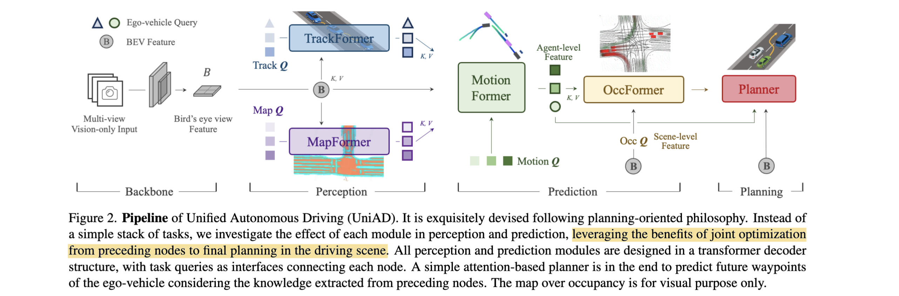

# Planning-oriented Autonomous Driving

- **Authors:** Yihan Hu, Jiazhi Yang, Li Chen, Keyu Li, Chonghao Sima, Xizhou Zhu, Siqi Chai, Senyao Du, Tianwei Lin, Wenhai Wang, Lewei Lu, Xiaosong Jia, Qiang Liu, Jifeng Dai, Yu Qiao, Hongyang Li
- **Affiliations:** OpenDriveLab & OpenGVLab (Shanghai AI Laboratory), Wuhan University, SenseTime Research
- **Published:** CVPR 2023 (Best Paper Award) — arXiv:2212.10156
- **Keywords:** end-to-end autonomous driving, planning-oriented, query-based, multi-task, tracking, mapping, motion forecasting, occupancy prediction, nuScenes
- **GitHub:** https://github.com/OpenDriveLab/UniAD

---

## Pass 1 — Bird's-Eye View

| C | Assessment |
|---|-----------|
| **Category** | A system-level architecture / framework paper. UniAD unifies the full autonomous-driving stack (perception + prediction + planning) into a single end-to-end, query-connected network. |
| **Context** | Builds directly on [BEVFormer](../../2022/BEVFormer-_Learning_Bird's-Eye-View_Representation_from_Multi-Camera_Images_via_Spatiotemporal_Transformers/) (BEV[^1] encoder), DETR[^2]/query-based tracking (MOTR/MUTR3D), Panoptic SegFormer (mapping), transformer motion forecasting (VectorNet/mmTransformer lineage), and occupancy forecasting (FIERY/BEVerse). Positioned against modular pipelines, naive multi-task learning (MTL[^3]), and "tabula-rasa" direct-planning end-to-end methods (ST-P3, LAV). |
| **Correctness** | Sound and unusually well-ablated. The central claim — that intermediate tasks should be *selected and ordered to serve planning*, connected by queries — is supported by a systematic module-by-module ablation (Table 2) plus per-task comparisons where UniAD is SOTA on all five tasks with one network. Caveat: the open-loop nuScenes L2/collision planning metric is now known to be weak/ego-status-dominated (a later-community critique, not raised in the paper). |
| **Contributions** | (1) A **planning-oriented philosophy**: don't stack tasks; choose and organize perception/prediction so every module contributes to planning; (2) **UniAD**, the first framework to jointly do detection, tracking, mapping, motion forecasting, occupancy prediction, and planning end-to-end; (3) a **unified query interface** connecting all nodes (queries soften compounding error and encode agent interactions), validated by extensive ablations and SOTA per-task results. |
| **Clarity** | Very clear for such a large system. Fig. 2 lays out the five modules; each is defined with precise attention equations. The taxonomy (Fig. 1 / Table 1) frames the contribution well. Dense — much detail is deferred to the supplementary. |

**30-second summary.** UniAD is the CVPR 2023 best-paper end-to-end driving stack that argues perception and prediction should be **designed backwards from planning**, not stacked as independent tasks. A [BEVFormer](../../2022/BEVFormer-_Learning_Bird's-Eye-View_Representation_from_Multi-Camera_Images_via_Spatiotemporal_Transformers/) encoder turns 6 surround cameras into a BEV feature; then five transformer-decoder modules are chained by **queries**: **TrackFormer** (joint detection + tracking, plus a special ego-vehicle query), **MapFormer** (panoptic road-element segmentation), **MotionFormer** (scene-centric multi-agent, multi-modal trajectory forecasting), **OccFormer** (instance-aware future occupancy), and a **Planner** that decodes the ego query into waypoints and dodges predicted occupancy via a collision optimizer. Trained in two stages (perception, then full end-to-end), it beats prior art on **all five tasks at once with a single network** — e.g., +6.5 AMOTA tracking, +7.4 IoU[^4] lane mapping, −38–65% motion error, and −51% planning L2 / −56% collision vs ST-P3, even beating some LiDAR planners. It became *the* reference architecture for modular end-to-end driving, though its open-loop nuScenes planning metric was later shown to be a weak benchmark.

---
### Self-Question

#### Q1: What is the ego-vehicle query, and does it store scene-specific values?

**A:** No — the ego-vehicle query is a *single* extra learnable embedding, and the same one is used in every scene at inference. It acts like a fixed question — *where am I, what's around me, where should I go?* — asked of every frame; the scene-specific answer is what the network computes as its output.

#### Q2: What are the inputs and outputs of each module?

**A:** **Module I/O summary.** Every module also reads the shared BEV feature $B$ (produced by the BEVFormer encoder from the 6 surround-view image sequence). Queries are the inter-module interface: an upstream module's output queries become a downstream module's input.

| Module | Inputs | Outputs |
|---|---|---|
| BEV Encoder (BEVFormer) | 6 surround-view images (temporal sequence) | BEV feature $B \in R^{H\times W\times C}$ |
| TrackFormer | $B$ ; detection queries + track queries + one ego-vehicle query | agent queries $Q_A$ ( $N_a$ agents, **incl. ego query**); 3D boxes + track IDs |
| MapFormer | $B$ ; map queries | map queries $Q_M$ ; panoptic road segmentation (lanes, dividers, crossings, drivable area) |
| MotionFormer | $Q_A$ (incl. ego), $Q_M$ , $B$ ; motion queries ( $`Q_{ctx}+Q_{pos}`$ ) | multi-modal agent trajectories $`\{\hat{x}_{i,k}\in R^{T\times2}\}`$ ; updated (motion-aware) ego query |
| OccFormer | $B$ (downscaled scene feature $F^0$ ); agent feature $G^t$ = $Q_A$ + max-pooled motion query $Q_X$ + position $P_A$ | instance-level future occupancy $`\hat{O}_A^t`$ ( $T_o$ steps, per-agent identity) |
| Planner | ego query (from MotionFormer) + navigation-command embedding → plan query; $B$ ; occupancy $`\hat{O}`$ | ego waypoints $`\hat{\tau}`$ → collision-optimized plan $`\tau^* \in R^{T_p\times2}`$ (3 s BEV trajectory) |

#### Q3: Are all queries learnable? If not, where do they come from and what do they represent?

**A:** No — only some are. Three provenances coexist: (1) **genuinely learnable embeddings** trained by gradient and shared across scenes — detection queries (DETR-style), the ego-vehicle query, map queries, and the three command embeddings; (2) **propagated / derived** states that are *not* freshly initialized parameters — track queries (carried-over states of previously tracked agents), motion queries (whose position part $`Q_{pos}`$ comes from k-means scene/agent anchors + start + goal, i.e. data-/geometry-derived), and the plan query (composed from ego query + command embedding); (3) **feature-as-query** — OccFormer uses the dense BEV feature $`F_{ds}^t`$ itself as the query. So the query interface is mostly *dynamically produced from upstream outputs, previous-frame states, and anchors*, with only a few learnable embedding sets. Conceptually a query is a "probe / question" filled in by attention, not a stored memory.

#### Q4: Why is a navigation command one of the Planner's *inputs* rather than an output?

**A:** The navigation command is a **high-level routing decision from the Route Planning Layer above**. That layer decides which route to take to the final destination, based on the navigation system / GPS, map, or human. The Motion Planning Layer (the Planner) instead decides how to safely execute this direction as a path of waypoints. So the Planner receives the high-level direction plus the environmental context, and outputs the detailed path.

---

## Pass 2 — Careful Read

### Core Idea in One Sentence
Design an end-to-end driving network "backwards from planning": chain five transformer-decoder modules (track, map, motion, occupancy, plan) through a shared query interface so that every perception and prediction task is explicitly selected and organized to feed better information into the final planner, avoiding both modular error-accumulation and multi-task negative transfer.



### Method / Approach
- **Shared BEV backbone:** multi-camera images → BEV feature $B$ via an off-the-shelf BEVFormer encoder (swappable).
- **TrackFormer (perception):** detection queries (newborn agents) + track queries (persisted agents) attend to $B$ for joint, NMS-free detection & multi-object tracking; a dedicated **ego-vehicle query** models the self-driving car itself.
- **MapFormer (perception):** sparse map queries (Panoptic SegFormer-style) segment lanes/dividers/crossings (things) and drivable area (stuff), passing road structure to motion.
- **MotionFormer (prediction):** scene-centric, all-agent, multi-modal trajectory forecast in one pass; each motion query does agent–agent, agent–map, and agent–goal (deformable) attention, with a query position built from scene- and agent-level k-means anchors + start + iteratively-refined goal point. A non-linear optimization adjusts *target* trajectories at training time to stay kinematically feasible under imperfect upstream detections.
- **OccFormer (prediction):** unrolls future occupancy block-by-block; a masked pixel–agent cross-attention injects agent identity into dense BEV features, and instance occupancy is read out by a matrix product of agent and scene features (no clustering post-process).
- **Planner:** ego query + navigation command embedding → attend to $B$ → decode waypoints; a Newton-method optimizer at inference pushes the trajectory away from OccFormer's predicted occupancy to avoid collisions.
- **Two-stage training:** 6 epochs perception-only, then 20 epochs full end-to-end (found more stable); tracking's bipartite matching is reused downstream for consistent agent identities.

### Key Results
All on nuScenes val, **one network** doing every task:

| Task | Metric | Best prior | UniAD |
|---|---|---|---|
| Tracking | AMOTA ↑ | MUTR3D 0.294 | **0.359** (+6.5) |
| Tracking | IDS ↓ | — | 906 (lowest among end-to-end) |
| Mapping | Lane IoU ↑ | BEVFormer 23.9 | **31.3** (+7.4) |
| Motion forecast | minADE (m) ↓ | ViP3D 2.05 / PnPNet 1.15 | **0.71** (−65% / −38%) |
| Motion forecast | minFDE (m) ↓ | PnPNet 1.95 | **1.02** |
| Occupancy | IoU-near ↑ | FIERY 59.4 / BEVerse 61.4 | **63.4** |
| Planning | avg L2 (m) ↓ | ST-P3 2.11 | **1.03** (−51%) |
| Planning | avg Col. (%) ↓ | ST-P3 0.71 | **0.31** (−56%) |

- **Every preceding task helps planning (Table 2):** motion + occupancy together give the best planning; adding track + map cuts motion error (−9.7% minADE, −12.9% minFDE); UniAD beats the naive MTL baseline by −15.2% minADE, +4.9 IoU-f, −0.15 m L2, −0.51 collision.
- **MotionFormer ablation:** rotated scene-level anchors are the biggest single win (−15.8% minADE); goal interaction, ego query, and non-linear optimization each add gains.
- **Beats LiDAR planners** on nuScenes open-loop L2/collision in most time slices, despite being camera-only.

### Strengths
- **Coherent design principle, not just a bigger model:** the "select tasks that serve planning" thesis is concrete and ablated, giving the field a design methodology.
- **Query interface unifies everything:** a single representation carries agents/maps/ego across modules, softening compounding error and enabling agent-interaction modeling — cleaner than passing bounding boxes.
- **SOTA on five tasks with one network:** rare breadth; demonstrates real positive transfer rather than negative transfer.
- **Safety-aware planning:** explicit occupancy-based collision avoidance and kinematic target smoothing, improving collision rate specifically.
- **Fully open-sourced** (code + two-stage checkpoints), making it a reproducible community baseline.

### Weaknesses / Open Questions
1. **Open-loop metric is weak:** nuScenes L2/collision was later shown (AD-MLP, BEV-Planner) to be largely predictable from ego state alone, so the headline planning numbers overstate real driving ability — no closed-loop evaluation here.
2. **Heavy and slow:** the authors concede large compute (temporal history + five modules); real-time/onboard deployment is unaddressed.
3. **Cascaded dependency:** although queries soften it, planning still depends on a long chain of upstream modules; long-tail perception failures (trucks/trailers) propagate.
4. **Perception not fully optimized:** by design UniAD trades peak per-task perception (still behind tracking-by-detection / perception-specialized mappers) for planning benefit.
5. **Two-stage training & many losses:** the system needs careful staged optimization and numerous task losses/hyperparameters, complicating reproduction and extension.

### References to Follow Up
1. **BEVFormer** — [Li et al., ECCV 2022](../../2022/BEVFormer-_Learning_Bird's-Eye-View_Representation_from_Multi-Camera_Images_via_Spatiotemporal_Transformers/): the BEV encoder UniAD builds on and reimplements baselines with.
2. **End-to-End Object Detection with Transformers (DETR)** — [Carion et al., ECCV 2020](../../2020/End-to-End_Object_Detection_with_Transformers/): the query + bipartite-matching foundation reused across TrackFormer/MapFormer.
3. **MOTR / MUTR3D** — Zeng / Zhang et al., 2022: the query-based joint detection-and-tracking design TrackFormer adapts to 3D.
4. **FIERY: Future Instance Prediction in BEV** — Hu et al., ICCV 2021: the occupancy-forecasting baseline OccFormer improves on with instance awareness.
5. **ST-P3** — Hu et al., ECCV 2022: the strongest prior camera-only end-to-end planner and UniAD's main planning baseline.

---

## Pass 3 — Virtual Re-implementation

### Detailed Technical Summary

**Overview.** A sequence of multi-camera images is encoded into a unified BEV feature $B$ by a BEVFormer encoder. Five transformer modules then communicate through queries $Q$ : TrackFormer and MapFormer (perception) produce agent queries $Q_A$ and map queries $Q_M$ ; MotionFormer and OccFormer (prediction) consume them; the Planner decodes the ego query. Everything is one differentiable network.

**TrackFormer (detection + tracking).** Following MOTR/MUTR3D, two query types attend to $B$ : **detection queries** spawn newborn agents each frame; **track queries** persist previously seen agents and aggregate temporal context by self-attending to their past states, until an agent disappears. $N$ decoder layers output $N_a$ valid agent states $Q_A$ . A distinguished **ego-vehicle query** is added to the set to explicitly represent the SDV for later planning. Detection/track matching uses DETR-style bipartite assignment; crucially, the tracking assignment is **reused downstream** so agent identities stay consistent from history into motion/occupancy.

**MapFormer (online mapping).** A Panoptic-SegFormer-based head with sparse map queries segments road elements — lanes, dividers, crossings as *things*; drivable area as *stuff*. $N$ stacked, all-layers-supervised; only the last layer's $Q_M$ flows to MotionFormer.

**MotionFormer (motion forecasting).** Predicts, scene-centrically and in one pass, top- $\kappa$ trajectories for all agents: $`\{\hat{x}_{i,k} \in R^{T\times2}\}`$ . Each of $N$ layers computes three interactions per motion query $Q$ . Agent–agent and agent–map:
```math
Q_{a/m} = \mathrm{MHCA}(\mathrm{MHSA}(Q),\, Q_A / Q_M),
```
and an agent–goal interaction via deformable attention around the previous layer's predicted endpoint $`\hat{x}_T^{l-1}`$ :
```math
Q_g = \mathrm{DeformAttn}(Q,\, \hat{x}_T^{l-1},\, B).
```
The three outputs are concatenated → MLP → query context $`Q_{ctx}`$ , passed to the next layer or decoded. Each layer's **motion query** = $`Q_{ctx}`$ plus a **query position** encoding four positional cues via sinusoidal PE + MLP:
```math
Q_{pos} = \mathrm{MLP}(\mathrm{PE}(I^s)) + \mathrm{MLP}(\mathrm{PE}(I^a)) + \mathrm{MLP}(\mathrm{PE}(\hat{x}_0)) + \mathrm{MLP}(\mathrm{PE}(\hat{x}_T^{l-1})),
```
where $I^s$ / $I^a$ are k-means **scene-level / agent-level anchors** (global prior movement / local intention), $`\hat{x}_0`$ the agent's start, and $`\hat{x}_T^{l-1}`$ the dynamic goal refined coarse-to-fine. **Non-linear optimization** adjusts the *ground-truth target* during training so it is kinematically feasible given imperfect upstream positions:
```math
\tilde{x}^* = \arg\min_x c(x, \tilde{x}), \quad c(x,\tilde{x}) = \lambda_{xy}\|x,\tilde{x}\|_2 + \lambda_{goal}\|x_T,\tilde{x}_T\|_2 + \sum_{\phi\in\Phi}\phi(x),
```
with $\Phi$ = {jerk, curvature, curvature rate, acceleration, lateral acceleration}. Training-only; inference unaffected.

**OccFormer (occupancy forecasting).** $T_o$ sequential blocks ( $`T_o < T`$ , occupancy is dense/expensive). Per-timestep agent feature fuses max-pooled motion queries $`Q_X`$ , track query $Q_A$ , and position $P_A$ :
```math
G^t = \mathrm{MLP}_t([Q_A, P_A, Q_X]),\quad t=1,\dots,T_o.
```
Dense scene feature (BEV downscaled to 1/4, then 1/8 inside the block) updates via **pixel–agent interaction** with a mask:
```math
D_{ds}^t = \mathrm{MHCA}(\mathrm{MHSA}(F_{ds}^t),\, G^t,\, \text{attn.mask}=O_m^t),
```
where the mask $`O_m^t`$ (≈ occupancy) comes from a mask feature $`M^t=\mathrm{MLP}(G^t)`$ times $`F_{ds}^t`$ , restricting each pixel to the agent occupying it. **Instance-level occupancy** is a matrix product (no clustering):
```math
\hat{O}_A^t = U^t \cdot F_{dec}^t,
```
with $`U^t`$ an MLP of the mask feature and $`F_{dec}^t`$ the upsampled scene feature.

**Planner.** Raw navigation command (left/right/straight) → learnable **command embedding**, combined with the MotionFormer ego query into a **plan query**, which attends to $B$ and decodes waypoints $`\hat{\tau}`$ . At inference, a Newton-method optimizer avoids collisions using OccFormer's binary occupancy $`\hat{O}`$ :
```math
\tau^* = \arg\min_\tau f(\tau,\hat{\tau},\hat{O}),\quad f = \lambda_{coord}\|\tau,\hat{\tau}\|_2 + \lambda_{obs}\sum_t D(\tau_t, \hat{O}^t),
```
where $D$ is a Gaussian collision penalty over occupied neighbors — pulling toward the predicted trajectory while pushing off occupied grids.

**Learning.** Stage 1: jointly train tracking + mapping for ~6 epochs. Stage 2: train all five modules end-to-end for 20 epochs. Bipartite matching in perception, reused for consistent agent identity through prediction.

### Datasets

#### Train Data

| Name | Usage |
|---|---|
| nuScenes | multi-task driving-stack training. |

#### Evaluation/Validation Data

| Name | Usage |
|---|---|
| nuScenes | detection, tracking, mapping, motion, occupancy, and planning evaluation. |

### Hidden Assumptions
1. **BEV quality is sufficient upstream.** All modules read from one BEV feature; whatever it drops (small/occluded/far objects) is unrecoverable downstream.
2. **Query identity is meaningful across modules.** Reusing tracking assignments assumes agent queries retain consistent semantics from track → motion → occupancy.
3. **Open-loop imitation ≈ good planning.** Supervision is expert-trajectory imitation on logged data; the paper assumes low L2/collision reflects safe driving (later contested).
4. **Kinematic smoothing targets are valid.** Non-linear optimization assumes the smoothed GT trajectory is a better learning target than the raw one.
5. **Command is available.** Planning without HD maps presumes a high-level navigation command (turn/keep) is provided.
6. **Occupancy horizon suffices for collision avoidance.** $`T_o`$ (short) occupancy is assumed to cover the planning-relevant future.

### Reproducibility Notes
- **Fully open source** (`OpenDriveLab/UniAD`) with two-stage pretrained checkpoints; widely reproduced and extended.
- **Dataset:** nuScenes (multi-task labels: detection, tracking, map, motion, occupancy, ego trajectory).
- **Backbone:** BEVFormer BEV encoder; baselines (LSS, VPN, BEVerse, FIERY, MUTR3D) reimplemented on the same encoder for fairness.
- **Training:** two-stage (6 + 20 epochs); many per-task losses and matching — details in the supplementary (not all hyperparameters in the main text).
- **Compute:** acknowledged to be heavy (temporal + five modules); exact GPU budget is in the supplementary.
- **Metrics:** standard per-task suites (AMOTA/AMOTP/IDS; IoU; minADE/minFDE/MR/EPA; IoU/VPQ near/far; L2/collision).

### Ideas for Future Work
1. **Closed-loop / simulator evaluation:** move beyond open-loop nuScenes to closed-loop (nuPlan, CARLA, or 3DGS simulators like the [RAD](../../2025/RAD-_Training_an_End-to-End_Driving_Policy_via_Large-Scale_3DGS-based_Reinforcement_Learning/) environment) to measure real driving.
2. **Lightweight deployment:** distill / prune the five-module stack for onboard real-time inference (the authors' stated limitation).
3. **Stronger BEV / temporal / multi-modal encoders:** swap in long-horizon temporal or LiDAR-camera fusion BEV backbones.
4. **More tasks in the loop:** the authors suggest depth estimation, behavior prediction; also traffic-light/sign reasoning.
5. **VLM / world-model planners:** replace the imitation planner with reinforcement learning or vision-language reasoning (later realized by VAD/VADv2, RAD, and driving world models).
6. **Robustness to upstream failure:** explicitly model perception uncertainty end-to-end to further exploit the "later tasks recover" property.

---

## Pass 4 — Modern Perspective Review (as of July 2026)

### What Has Changed Since Publication
- **Modular end-to-end became the dominant paradigm.** UniAD's query-connected, planning-oriented design set the template; VAD/VADv2 made it vectorized and faster, and the approach spread quickly.
- **The open-loop nuScenes planning metric was debunked.** AD-MLP and "Is Ego Status All You Need? / BEV-Planner" (2023–24) showed the L2/collision numbers are largely predictable from ego state alone — reframing UniAD's planning result as a benchmark artifact and pushing the field to closed-loop evaluation.
- **Closed-loop benchmarks rose.** nuPlan, Bench2Drive, and 3DGS-based photorealistic simulators (incl. the [RAD](../../2025/RAD-_Training_an_End-to-End_Driving_Policy_via_Large-Scale_3DGS-based_Reinforcement_Learning/) RL environment) became the credible way to measure driving policies.
- **RL and world models entered planning.** Pure imitation gave way to RL (RAD) and generative world-model planners, addressing imitation's causal-confusion and distribution-shift issues.
- **VLM/VLA-based driving emerged.** Vision-language and vision-language-action models began to be applied to driving reasoning and planning.
- **Occupancy prediction matured** into its own sub-field (Occ3D, dense occupancy world models), building on OccFormer-style ideas.

### Has the Community Accepted the Claims?
Partially, with an important asterisk. The **architectural** contribution — a unified, query-connected, planning-oriented end-to-end stack — was broadly accepted and became the reference design (CVPR 2023 best paper; direct lineage to VAD, and a standard baseline/backbone in later systems). The **planning-benchmark** contribution aged poorly: follow-up work convincingly argued the open-loop nuScenes L2/collision metric is dominated by ego status and does not measure planning skill, so UniAD's "beats LiDAR planners" headline is now read with skepticism and the community migrated to closed-loop evaluation. Its per-task perception/prediction results and the demonstration of positive multi-task transfer held up. So today UniAD is regarded as a landmark that defined *how to structure* end-to-end driving, while the field has moved past *how it evaluated* planning — toward closed-loop, RL, world models, and VLM-based approaches.

---

### Comparison Papers

#### Predecessors
| Paper | Authors | Year | Relation |
|---|---|---|---|
| BEVFormer | Li et al. | 2022 | BEV encoder UniAD builds on ([has note](../../2022/BEVFormer-_Learning_Bird's-Eye-View_Representation_from_Multi-Camera_Images_via_Spatiotemporal_Transformers/)) |
| DETR | Carion et al. | 2020 | Query + bipartite-matching foundation for the decoder modules ([has note](../../2020/End-to-End_Object_Detection_with_Transformers/)) |
| MOTR / MUTR3D | Zeng / Zhang et al. | 2022 | Query-based joint detection-tracking adapted by TrackFormer; MUTR3D is a tracking baseline |
| Panoptic SegFormer | Li et al. | 2021 | Basis of MapFormer's panoptic road-element segmentation |
| FIERY | Hu et al. | 2021 | Occupancy-forecasting predecessor OccFormer improves with instance awareness |

#### Contemporaries / Competitors
| Paper | Authors | Year | Relation |
|---|---|---|---|
| ST-P3 | Hu et al. | 2022 | Camera-only end-to-end planner; main planning baseline |
| BEVerse | Zhang et al. | 2022 | Multi-task BEV (MTL) framework; occupancy/mapping baseline |
| ViP3D | Gu et al. | 2023 | Query-based end-to-end perception-prediction; tracking/motion baseline |
| PnPNet | Liang et al. | 2020 | Joint perception-and-prediction; motion baseline |

#### Successors / Extensions
| Paper | Authors | Year | Relation |
|---|---|---|---|
| VAD / VADv2 | Jiang et al. | 2023–24 | Vectorized, faster planning-oriented successor to UniAD |
| AD-MLP / BEV-Planner | Zhai / Li et al. | 2023–24 | Critiques showing nuScenes open-loop planning is ego-status-dominated |
| RAD | — | 2025 | 3DGS-based RL driving policy; part of the closed-loop / RL response to UniAD's imitation planning ([has note](../../2025/RAD-_Training_an_End-to-End_Driving_Policy_via_Large-Scale_3DGS-based_Reinforcement_Learning/)) |
| GenAD / driving world models | various | 2023–25 | Generative/world-model planners extending end-to-end driving |
| Occ3D / occupancy world models | various | 2023–25 | Dense occupancy successors building on OccFormer-style prediction |

---

### Bottom Line
Yes — UniAD is a foundational, must-read paper for anyone in autonomous driving, but read it with a 2026 lens. Its lasting contribution is architectural: it crystallized the **planning-oriented, query-connected, modular end-to-end** design that now organizes the whole subfield, and it convincingly demonstrated positive multi-task transfer across five tasks in one network. Its planning *evaluation*, however, is superseded — the open-loop nuScenes L2/collision metric was later shown to be dominated by ego status, so treat those specific numbers skeptically and look to closed-loop/RL/world-model successors ([RAD](../../2025/RAD-_Training_an_End-to-End_Driving_Policy_via_Large-Scale_3DGS-based_Reinforcement_Learning/), VAD, driving world models) for where the field went. Read it right after [BEVFormer](../../2022/BEVFormer-_Learning_Bird's-Eye-View_Representation_from_Multi-Camera_Images_via_Spatiotemporal_Transformers/) (its backbone) and [DETR](../../2020/End-to-End_Object_Detection_with_Transformers/) (its query paradigm) to see how BEV perception scaled up into a full driving stack.

[^1]: **BEV** — Bird's-Eye-View. See the [glossary](../../common/terms/).
[^2]: **DETR** — DEtection TRansformer. See the [glossary](../../common/terms/).
[^3]: **MTL** — Multi-Task Learning. See the [glossary](../../common/terms/).
[^4]: **IoU** — Intersection over Union. See the [glossary](../../common/terms/).
