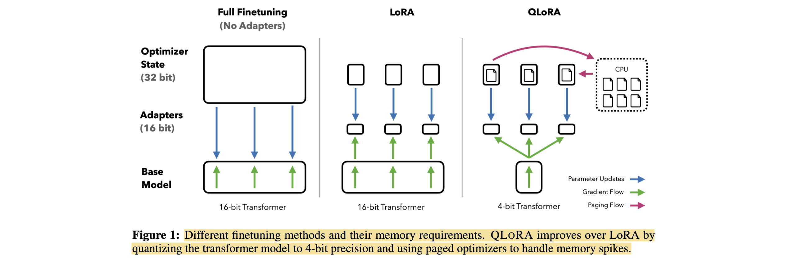

# QLoRA: Efficient Finetuning of Quantized LLMs

- **Authors:** Tim Dettmers, Artidoro Pagnoni, Ari Holtzman, Luke Zettlemoyer
- **Affiliations:** University of Washington
- **Published:** Advances in Neural Information Processing Systems 36 (NeurIPS 2023), Main Conference Track; arXiv:2305.14314
- **Keywords:** quantized fine-tuning, parameter-efficient fine-tuning, 4-bit quantization, Low-Rank Adaptation, instruction tuning
- **Webpage:** https://papers.nips.cc/paper/2023/hash/1feb87871436031bdc0f2beaa62a049b-Abstract-Conference.html
- **GitHub:** https://github.com/artidoro/qlora
- **HuggingFace:** https://huggingface.co/timdettmers/guanaco-65b

---

## Pass 1 — Bird's-Eye View

| C | Assessment |
|---|---|
| **Category** | Methods-and-systems paper on memory-efficient parameter-efficient fine-tuning of quantized LLMs, plus a large empirical study of instruction tuning and chatbot evaluation. |
| **Context** | Combines LoRA[^1] with block-wise low-bit quantization, building directly on *LLM.int8()*, *8-bit Optimizers via Block-wise Quantization*, *The Case for 4-bit Precision*, and GPTQ. It also evaluates against 16-bit full fine-tuning, 16-bit LoRA, Vicuna, OpenAssistant, ChatGPT, Bard, and GPT-4. |
| **Correctness** | The core memory argument and the 4-bit-versus-16-bit adapter comparisons are convincing across architectures and tasks. The strongest wording needs qualification: equality with **full** 16-bit fine-tuning is directly tested only up to 3B parameters; at 7B–65B, QLoRA is compared with 16-bit LoRA because full fine-tuning is too expensive. The Guanaco claims depend on small, noisy chatbot benchmarks and GPT-4 judging with measurable order and self-preference biases. |
| **Contributions** | Introduces NormalFloat 4-bit (NF4)[^2], double quantization of quantization constants, and paged optimizers; shows that adapters on all linear layers recover 16-bit LoRA quality; reduces 65B fine-tuning memory from more than 780 GB to less than 48 GB; and uses the resulting efficiency to train more than 1,000 models and the Guanaco chatbot family. |
| **Clarity** | Strongly motivated and unusually candid about benchmark uncertainty. The method section is concise, the appendices expose datasets and hyperparameters, and the distinction between storage precision and compute precision is clear. Some headline claims mix method quality, systems feasibility, and time-sensitive chatbot rankings, which readers should separate. |

**30-second summary.** QLoRA freezes a pretrained model stored in 4-bit NF4, dequantizes weights to bfloat16 only when computing, and backpropagates through those frozen weights into bfloat16 LoRA adapters attached to every linear transformer layer. Double quantization reduces scale metadata by about 0.373 bits per parameter, while paged optimizer states spill through NVIDIA Unified Memory to survive transient memory spikes. This makes LLaMA-65B fine-tuning possible on one 48 GB GPU and generally matches 16-bit LoRA quality; the paper's Guanaco experiments then show that a small, well-matched dataset can matter more than a much larger instruction collection. The enduring result is the accessible 4-bit fine-tuning recipe, not the now-dated claim that Guanaco nearly matched ChatGPT on a particular 2023 judge setup.

---

## Pass 2 — Careful Read

### Core Idea in One Sentence

Store a frozen pretrained LLM in a distribution-aware 4-bit format, compute through its dequantized weights, and train small full-coverage LoRA adapters so that large-model fine-tuning fits on a single GPU without giving up the quality of 16-bit adapter tuning.



### Method / Approach

- **Frozen 4-bit backbone, trainable LoRA:** Quantize pretrained weights block-wise to NF4, keep them frozen, and attach bfloat16 LoRA adapters to every linear layer; gradients pass through the dequantized base weights, but only adapter parameters receive updates.
- **NF4 and double quantization:** Design 16 quantization levels from equal-probability regions of a standard normal distribution, matching the empirical distribution of pretrained weights; then quantize the per-block quantization constants themselves, cutting their overhead from about 0.5 to 0.127 bits per parameter.
- **Paged optimizers:** Allocate optimizer states in NVIDIA Unified Memory so they can move temporarily to CPU RAM when gradient checkpointing or long sequences create GPU-memory spikes, then return for the optimizer step.
- **Large empirical program:** Compare 4-bit QLoRA with full fine-tuning and 16-bit LoRA across encoder, encoder-decoder, and decoder-only models, then train LLaMA 7B–65B on eight instruction datasets and evaluate both academic accuracy and chatbot preference.

#### Train Data

| Name | Usage |
|---|---|
| GLUE | RoBERTa-large task fine-tuning used to compare full fine-tuning, LoRA, and quantized adapters. |
| Super-NaturalInstructions | T5 instruction fine-tuning across 80M–11B models, with a separate validation split for tuning and early stopping. |
| Alpaca | LLaMA instruction fine-tuning and full-fine-tuning/LoRA ablations. |
| FLAN v2 | LLaMA instruction fine-tuning and the strongest MMLU-oriented data mixture. |
| OASST1 | Top-ranked paths from conversation trees, reduced to 9,209 examples; trains the Guanaco family. |
| HH-RLHF | Preferred helpfulness and harmlessness responses used with supervised cross-entropy, not reinforcement learning. |
| Self-Instruct | 82,612 distilled instruction examples in the eight-dataset study. |
| Unnatural Instructions | 240,670 machine-generated instruction examples and dataset-size ablations. |
| LongForm | 23,700 long-form instruction examples based on human corpora plus generated instructions. |
| Chip2 | 210,289 mixed instruction, code, reasoning, and dialogue examples from Open Instruction Generalist. |

#### Evaluation/Validation Data

| Name | Usage |
|---|---|
| GLUE | Aggregate natural-language understanding accuracy. |
| Super-NaturalInstructions | Held-out instruction generalization measured by ROUGE-L. |
| MMLU | Five-shot dev split for hyperparameter selection and test accuracy across 57 subjects. |
| Vicuna benchmark | Eighty prompts judged by humans and GPT-4 for chatbot response quality. |
| OpenAssistant validation benchmark | 953 multilingual user queries used for GPT-4 pairwise chatbot evaluation. |
| WinoGrande, HellaSwag, PIQA, and ARC | Zero-shot accuracy for comparing NF4, FP4, and integer quantization. |
| Pile Common Crawl | Perplexity comparison across low-bit data types. |
| CrowS-Pairs | Limited social-bias evaluation of Guanaco-65B. |

### Key Results

| Experiment | 16-bit / baseline | QLoRA result | Takeaway |
|---|---:|---:|---|
| 65B fine-tuning memory | More than 780 GB for regular 16-bit fine-tuning | Less than 48 GB | A 65B model becomes trainable on one professional GPU. |
| GLUE, RoBERTa-large accuracy | Full bfloat16: 88.6; bfloat16 LoRA: 88.8 | Int8 QLoRA: 88.8; FP4 QLoRA: 88.6 | Quantized adapters match the tuned 16-bit baselines. |
| Super-NaturalInstructions, T5-3B ROUGE-L | Full bfloat16: 54.3; bfloat16 LoRA: 55.4 | NF4 + double quantization: 55.3 | Four-bit adapter tuning recovers 16-bit quality at 3B. |
| Mean five-shot MMLU over LLaMA 7B–65B × Alpaca/FLAN v2 | Bfloat16 LoRA: 53.0 | NF4 + double quantization: 53.1; FP4: 52.2 | NF4 matches 16-bit LoRA; FP4 trails by about one point. |
| Pile Common Crawl mean perplexity across model families | Int4: 34.34; best FP4 variant: 29.48 | NF4 + double quantization: 27.41 | Distribution-aware NF4 is substantially more accurate bit-for-bit. |
| Vicuna score relative to ChatGPT | ChatGPT: 100% by definition; Vicuna-13B: 94.9% | Guanaco-65B: 99.3% ± 4.4% | Strong 2023 chatbot result, but confidence intervals overlap and the judge has order effects. |
| GPT-4-judged Vicuna Elo | ChatGPT: 966; Vicuna-13B: 974 | Guanaco-65B: 1022; Guanaco-33B: 992 | Guanaco ranked behind GPT-4 but above the other tested systems under this protocol. |

- **Adapter coverage dominates rank:** Applying LoRA only to query and value projections does not recover full-fine-tuning performance; targeting every linear transformer layer is critical, whereas rank has little effect once coverage is broad.
- **Double quantization is nearly free in quality:** It saves about 3 GB for a 65B model without a measurable performance loss.
- **Dataset suitability dominates size:** Across 50K–150K subsets and one to three epochs, dataset choice changes MMLU by up to 8 points, while more examples or epochs typically add only 0.0–0.5 points; 9K high-quality OASST1 conversations also beat much larger mixtures on chatbot evaluation.
- **Train on the response when possible:** Across four instruction datasets, masking the instruction and training only on the target improves mean MMLU from 37.5 to 38.6.

### Strengths

- **Transformative accessibility:** The method changes the hardware class needed for serious LLM adaptation, making 33B feasible on a 24 GB consumer GPU and 65B feasible on a 48 GB GPU.
- **Clean separation of concerns:** Storage is 4-bit, computation is bfloat16, the base is frozen, and adapters are trainable; this makes the memory and optimization story easy to reason about.
- **Broad evidence:** More than 1,000 runs cover three architecture types, models from 80M to 65B, multiple tasks, data types, ranks, adapter placements, datasets, and judges.
- **Strong baselines:** The authors retune learning rates and batch sizes rather than comparing against weak default full-fine-tuning settings.
- **Honest evaluation analysis:** The paper reports GPT-4 order effects, moderate human agreement, weak sample-level human–judge agreement, wide confidence intervals, data-suitability effects, and qualitative failure cases.
- **Practical release:** Code, CUDA kernels, bitsandbytes integration, datasets, evaluation outputs, and adapter checkpoints make the work unusually reproducible for its scale.

### Weaknesses / Open Questions

1. **Full fine-tuning equality is not established at large scale:** At 33B and 65B, the comparison is against 16-bit LoRA, not full-parameter 16-bit fine-tuning; the paper explicitly leaves that experiment undone.
2. **Four-bit storage is not four-bit arithmetic:** Matrix multiplication occurs after dequantization to bfloat16, so QLoRA primarily saves memory; it is not automatically a training-throughput or deployment-inference speedup.
3. **Paged optimizer evidence is thin:** Paging is essential for the largest single-GPU runs, yet the paper gives no controlled measurements of transfer frequency, host-memory demand, or slowdown under adversarial long-sequence workloads.
4. **Normality is approximate:** NF4 assumes block-wise pretrained weights are close to zero-centered normal; the appendix finds a nontrivial minority of hidden units that reject normality tests, and modern model families may have different distributions.
5. **Evaluation has short half-life:** Guanaco's “99.3% of ChatGPT” result depends on 80 Vicuna prompts, March 2023 commercial-model outputs, and GPT-4 judging with position and self-preference biases.
6. **Benchmark-specific data effects:** FLAN v2 is strong on MMLU and weak on chat, while OASST1 shows the reverse; no single result establishes broad alignment or general capability.
7. **Limited safety evaluation:** CrowS-Pairs is too narrow to support a general safety or bias conclusion, and the paper does not evaluate jailbreaks, truthfulness, privacy leakage, or harmful instruction following.

### References to Follow Up

1. **LoRA: Low-Rank Adaptation of Large Language Models** — Hu et al., ICLR 2022: supplies the frozen-base, trainable-low-rank update that QLoRA makes memory-efficient at large scale.
2. **The Case for 4-bit Precision: k-bit Inference Scaling Laws** — Dettmers & Zettlemoyer, ICML 2023: motivates the claim that parameter count can be traded for lower precision under a fixed memory budget.
3. **LLM.int8(): 8-bit Matrix Multiplication for Transformers at Scale** — Dettmers et al., NeurIPS 2022: establishes block-wise quantization practice and the outlier problem in large transformer models.
4. **GPTQ: Accurate Post-Training Quantization for Generative Pre-trained Transformers** — Frantar et al., ICLR 2023: representative reconstruction-based low-bit quantization and an important contrast to QLoRA's normally distributed codebook.
5. **OpenAssistant Conversations—Democratizing Large Language Model Alignment** — Köpf et al., NeurIPS 2023 Datasets and Benchmarks: introduces OASST1, whose small high-quality subset produces Guanaco.

---

## Pass 3 — Virtual Re-implementation

### Detailed Technical Summary

**Model state and trainable parameters.** Begin with a pretrained model in 16-bit precision and quantize each weight block of 64 values into NF4. The quantized base weights remain frozen for the entire run. Insert LoRA adapters into **all linear layers**, not only attention query/value projections. For a linear layer, the forward pass is conceptually:

```math
Y = X dequant(W_{NF4}) + s X L_1 L_2.
```

Here `W_NF4` is stored in 4-bit form, temporarily dequantized to bfloat16 for multiplication; `L_1` and `L_2` are bfloat16 trainable matrices of rank `r`; and only the adapters receive weight gradients. Gradients with respect to activations still pass through the dequantized frozen matrix, which is what lets lower layers and their adapters learn.

**NF4 construction.** Uniform integer or floating-point bins waste codes when weights cluster near zero. NF4 instead chooses 16 representative values from equal-probability regions of a standard normal distribution, normalizes them to the interval from -1 to 1, and preserves an exact zero. Each weight block is divided by its absolute maximum, mapped to the nearest NF4 value, and stored as a 4-bit index plus a scale. This is information-theoretically optimal only for the assumed zero-centered normal distribution; empirically, it outperforms the tested FP4 and Int4 formats.

**Double quantization.** A 32-bit scale for every 64 weights costs 0.5 extra bits per parameter, a meaningful overhead at 4-bit storage. QLoRA quantizes those first-level scales to 8-bit values in blocks of 256, retaining a second-level 32-bit scale. The resulting metadata cost is:

```math
8 / 64 + 32 / (64 \cdot 256) = 0.127,
```

measured in bits per parameter. This saves 0.373 bits per parameter, about 3 GB at 65B parameters. Before the second quantization, the positive scale values are mean-centered so a symmetric 8-bit code is effective.

**Compute path.** Storage and compute types are deliberately different. During each forward or backward matrix multiplication, the implementation double-dequantizes the second-level scale, then the first-level scale, then the NF4 weights into bfloat16. Activations and LoRA parameters are bfloat16, and the matrix multiplication is 16-bit. QLoRA therefore reduces persistent model-state memory while retaining a comparatively high-precision compute path.

**Paged optimizer states.** Gradient checkpointing lowers retained activation memory but can produce large transient spikes when a long sequence is recomputed. Paged Adam places optimizer state in NVIDIA Unified Memory. If GPU memory pressure rises, the CUDA runtime evicts pages to CPU RAM and restores them for the optimizer step. The method is a safety valve rather than a guarantee of free performance: on a 65B model with batch size 16, the authors report the same speed as the non-paged optimizer, but they do not systematically characterize worst-case paging.

**Adapter placement and optimization.** The paper's decisive implementation choice is `target_modules = all linear layers`. Applying LoRA only to query and value projections fails to match full fine-tuning; once coverage is broad, rank is comparatively insensitive. The chatbot recipe uses rank 64 and alpha 16, constant learning rate, Adam beta2 0.999, gradient norm clipping at 0.3, and examples grouped by length. Dropout is 0.1 through 13B and 0.05 at 33B/65B. Learning rate is 2e-4 for 7B/13B and 1e-4 for 33B/65B; most datasets run 10,000/10,000/5,000/2,500 steps respectively, with dataset-specific exceptions in Appendix B.

**Training objective.** All reported instruction models use ordinary supervised cross-entropy rather than reinforcement learning. When an instruction-response boundary is available, source tokens are masked and loss is applied only to response tokens. For OASST1 and HH-RLHF, the authors select the top-ranked reply at each conversation-tree level and train on the selected full conversation. This keeps the optimization comparison focused on quantization and data rather than reward modeling.

**Evaluation protocol.** The method comparison spans RoBERTa-large on GLUE, T5 up to 11B on Super-NaturalInstructions, and LLaMA 7B–65B on Alpaca/FLAN v2 with five-shot MMLU. Quantizer fidelity is measured with Pile Common Crawl perplexity and zero-shot WinoGrande, HellaSwag, PIQA, ARC-Easy, and ARC-Challenge. Chatbots are evaluated on 80 Vicuna prompts and 953 OpenAssistant validation queries through order-swapped GPT-4 comparisons, Amazon Mechanical Turk comparisons, and Elo tournaments repeated over 10,000 randomized orderings.

### Datasets

#### Train Data

| Dataset | Usage | Proposed by |
|---|---|---|
| GLUE | RoBERTa-large task fine-tuning for full-fine-tuning and quantized-adapter comparisons. | GLUE |
| Super-NaturalInstructions | T5 instruction fine-tuning; the authors create train/validation splits for tuning and early stopping. | Super-NaturalInstructions |
| Alpaca | 51,942 distilled instruction examples for LLaMA fine-tuning, adapter-placement ablations, and MMLU evaluation. | Stanford Alpaca |
| FLAN v2 | Instruction mixture used to fine-tune LLaMA models for MMLU; experiments use the FLAN Collection mixture where available. | The FLAN Collection |
| OASST1 | Top reply at each conversation-tree level; 9,209 selected full-conversation examples train Guanaco. | OpenAssistant Conversations |
| HH-RLHF | 160,800 preference examples reduced to preferred replies, combining helpfulness and harmlessness data for supervised fine-tuning. | Training a Helpful and Harmless Assistant with Reinforcement Learning from Human Feedback |
| Self-Instruct | 82,612 model-generated instruction examples in the eight-dataset scaling study. | Self-Instruct |
| Unnatural Instructions | 240,670 generated instruction examples; also subsampled for data-size and epoch ablations. | Unnatural Instructions |
| LongForm | 23,700 long-form examples based on C4, Wikipedia, Stack Exchange, WikiHow, and generated instructions. | LongForm |
| Chip2 | 210,289 mixed instruction, code, reasoning, safety, and dialogue examples from Open Instruction Generalist. | Open Instruction Generalist |

#### Evaluation/Validation Data

| Dataset | Usage | Proposed by |
|---|---|---|
| GLUE | Aggregate natural-language understanding accuracy for RoBERTa-large. | GLUE |
| Super-NaturalInstructions | Held-out instruction generalization measured by ROUGE-L. | Super-NaturalInstructions |
| MMLU | Five-shot dev split for validation/hyperparameter tuning and five-shot test accuracy across 57 subjects. | Measuring Massive Multitask Language Understanding |
| Vicuna benchmark | 80 prompts for GPT-4 scoring, human comparison, pairwise judgments, and Elo rankings. | Vicuna |
| OpenAssistant validation benchmark | 953 user queries with preceding dialogue context for GPT-4 pairwise chatbot evaluation. | OpenAssistant Conversations |
| WinoGrande | Zero-shot accuracy in low-bit quantizer comparisons. | WinoGrande |
| HellaSwag | Zero-shot commonsense completion accuracy in low-bit quantizer comparisons. | HellaSwag |
| PIQA | Zero-shot physical commonsense accuracy in low-bit quantizer comparisons. | PIQA |
| AI2 Reasoning Challenge | ARC-Easy and ARC-Challenge zero-shot accuracy in low-bit quantizer comparisons. | AI2 Reasoning Challenge |
| Pile Common Crawl | Language-model perplexity for NF4, FP4, and Int4 across OPT, BLOOM, LLaMA, and Pythia. | The Pile |
| CrowS-Pairs | Social-bias likelihood comparison for Guanaco-65B and pretrained baselines. | CrowS-Pairs |

### Hidden Assumptions

1. **Weights are locally normal enough:** NF4's optimality argument assumes each quantization block resembles a rescaled zero-centered normal distribution; exceptions and outlier structures are not specially protected.
2. **A low-rank task update can repair quantization damage:** The method assumes LoRA has enough capacity both to learn the downstream task and to compensate for errors introduced by freezing the quantized base.
3. **All-linear coverage remains cheap:** Adapter parameters are small compared with the 4-bit base at LLaMA scale, but activation gradients and adapter state grow with architecture width, sequence length, and the number of targeted modules.
4. **Bfloat16 compute is sufficient:** Dequantization and gradient propagation happen in bfloat16, assuming its dynamic range and accumulation behavior preserve the optimization signal.
5. **Unified Memory is available and fast enough:** Paged optimizers depend on NVIDIA's memory system, adequate host RAM, and a workload whose page transfers do not dominate training time.
6. **Benchmark-adjacent fine-tuning is legitimate:** Large differences across instruction datasets indicate that measured quality partly reflects overlap in task style and distribution, not only general instruction-following ability.
7. **LLM judges reflect human preferences:** The chatbot claims assume GPT-4 pairwise choices are a useful proxy despite order effects, self-preference, weak example-level agreement, and commercial-model version drift.
8. **Model architecture does not change the recipe:** Results span RoBERTa, T5, and first-generation LLaMA, but grouped-query attention, mixture-of-experts layers, multimodal towers, and newer normalization/activation choices were not evaluated.

### Reproducibility Notes

- **Code and integration:** Official implementation at https://github.com/artidoro/qlora, built on bitsandbytes and integrated with Hugging Face Transformers and PEFT. CUDA kernels and evaluation generations are public.
- **Weights:** Guanaco adapter checkpoints are released under `timdettmers` on Hugging Face. Reproduction still requires access to the compatible LLaMA base weights and their license terms.
- **Data:** The eight instruction datasets and exact preprocessing rules are documented. OASST1 uses top-ranked conversation paths; HH-RLHF keeps preferred responses; source-token masking is recommended for datasets with clean instruction/response boundaries.
- **Compute:** 65B fits on one 48 GB GPU and trains in about 24 hours; 33B fits on a 24 GB consumer GPU and trains in under 12 hours for the reported Guanaco recipe. A 7B QLoRA model occupies roughly 5 GB before runtime overheads.
- **Core settings:** NF4 weights, block size 64, double-quantized scales with 8-bit block size 256, bfloat16 compute, paged optimizer, gradient checkpointing, LoRA on all linear layers, rank 64, alpha 16, and constant learning rate.
- **Hyperparameters:** Table 9 reports per-size batch size, learning rate, steps, source length, and target length. The appendix also reports dropout, beta2, clipping, validation protocol, and adapter-placement/rank searches.
- **Underspecified or costly:** The paper does not provide a controlled full-fine-tuning comparison at 33B/65B, comprehensive paged-optimizer timing, broad safety evaluation, or robust modern chat benchmarks. Reproducing historical GPT-4/ChatGPT/Bard comparisons exactly is impossible because hosted models have changed.

### Ideas for Future Work

1. **Quantization-aware adapter initialization:** Initialize adapters to reconstruct the full-precision model rather than starting as a no-op on an already quantized base, reducing the burden of repairing quantization error during downstream tuning.
2. **Mergeable low-bit adaptation:** Co-design quantization groups and low-rank updates so trained adapters can be merged into a deployable low-bit model without an additional lossy post-training quantization step.
3. **Lower-bit and mixed-format fine-tuning:** Characterize the boundary at 3, 2, and mixed bits, with reasoning-heavy tasks rather than perplexity alone determining acceptable loss.
4. **Portable paging and distributed QLoRA:** Extend the memory recipe beyond one NVIDIA GPU to fully sharded multi-GPU training, non-CUDA accelerators, and predictable CPU-offload schedules.
5. **Activation and optimizer compression:** Combine frozen weight quantization with lower-precision activations, gradients, and optimizer states while preserving QLoRA's stability.
6. **Modern alignment evaluation:** Replace small static prompt sets and opaque single-model judging with contamination-aware task suites, multi-judge panels, human calibration, safety tests, and confidence intervals that reflect prompt and decoding variance.

---

## Pass 4 — Modern Perspective Review (as of August 2026)

### What Has Changed Since Publication

- **QLoRA became infrastructure, not a niche recipe:** Hugging Face Transformers, PEFT, TRL, and bitsandbytes expose first-class 4-bit loading and QLoRA-style training. NF4, nested/double quantization, bfloat16 compute, and `all-linear` adapter targeting are routine configuration options.
- **The core recipe survived model turnover:** Practitioners still use a frozen 4-bit base plus LoRA to adapt modern open models on modest hardware. This is stronger validation than Guanaco's short-lived leaderboard position.
- **Initialization became quantization-aware:** LoftQ jointly chooses a quantized backbone approximation and low-rank initialization, directly addressing QLoRA's mismatch between the original full-precision model and zero-initialized adapters on the quantized model. PEFT now supports LoftQ initialization and on-the-fly replacement.
- **Mergeability became a first-class deployment goal:** QA-LoRA modifies quantization/adaptation degrees of freedom so adapters can be folded into an integer model, whereas ordinary QLoRA keeps separate high-precision adapter weights unless a potentially lossy re-quantization step is applied.
- **The low-bit frontier moved below four bits:** LoftQ, QuAILoRA, PEQA, and later quantization-aware low-rank methods target 2–3-bit accuracy, adaptive rank/bitwidth, and better initialization. QLoRA remains the dependable 4-bit baseline rather than the final word on extreme compression.
- **Scaling moved beyond one GPU:** Fully sharded QLoRA recipes distribute quantized parameters and adapters across devices, making larger models and longer contexts feasible while retaining the basic frozen-low-bit-base idea.
- **Hardware and formats diversified:** FP8 and hardware-native FP4 formats, vendor quantization toolchains, and quantization-aware pretrained checkpoints now compete with software-only NF4. NF4 remains useful for accessible training, but it is not universally the fastest deployment representation.
- **Evaluation standards advanced:** Static Vicuna prompts and one GPT-4 judge are no longer sufficient evidence of near-frontier chat quality. Chatbot Arena, MT-Bench, stronger reasoning suites, contamination audits, and judge-bias studies make the paper's evaluation caveats look prescient.

### Has the Community Accepted the Claims?

Yes for the method's central practical claim, with an important narrowing of scope. The community broadly accepted that a frozen 4-bit backbone can be fine-tuned effectively through LoRA adapters, and QLoRA became a standard path for memory-constrained supervised fine-tuning. NF4 and double quantization remain directly implemented and documented in mainstream libraries, while the recommendation to target all linear layers persists in current PEFT guidance. Follow-up work did not reject QLoRA so much as repair its rough edges: LoftQ and QuAILoRA reduce initialization error, QA-LoRA improves low-bit deployment and merging, and sharded recipes scale the same idea. The unqualified phrase “no performance degradation” did not generalize to every architecture, dataset, and sub-4-bit regime, and the Guanaco-versus-ChatGPT claim is historically interesting rather than a durable quality result. The lasting contribution is the systems-compatible fine-tuning primitive.

---

### Comparison Papers

#### Predecessors

| Paper | Authors | Year | Relation |
|---|---|---:|---|
| LoRA: Low-Rank Adaptation of Large Language Models | Hu et al. | 2021 | Supplies the frozen-backbone low-rank update; QLoRA retains LoRA but quantizes the frozen model and expands adapters to all linear layers. |
| 8-bit Optimizers via Block-wise Quantization | Dettmers et al. | 2022 | Provides block-wise optimizer quantization and bitsandbytes systems foundations; QLoRA's paged optimizers continue the memory-first line. |
| LLM.int8(): 8-bit Matrix Multiplication for Transformers at Scale | Dettmers et al. | 2022 | Establishes scalable transformer quantization and outlier-aware low-precision computation. |
| The Case for 4-bit Precision: k-bit Inference Scaling Laws | Dettmers & Zettlemoyer | 2022 | Argues that four bits is a favorable memory/quality point and supplies the quantizer evaluation protocol. |
| GPTQ: Accurate Post-Training Quantization for Generative Pre-trained Transformers | Frantar et al. | 2022 | Reconstruction-based low-bit baseline; unlike QLoRA, originally targets inference rather than adapter fine-tuning. |
| Stable and Low-Precision Training for Large-Scale Vision-Language Models (SwitchBack) | Wortsman et al. | 2023 | Rare prior demonstration of backpropagation through quantized weights beyond one billion parameters. |

#### Contemporaries / Competitors

| Paper | Authors | Year | Relation |
|---|---|---:|---|
| [AWQ: Activation-aware Weight Quantization for LLM Compression and Acceleration](../../2023/AWQ-_Activation-aware_Weight_Quantization_for_LLM_Compression_and_Acceleration/) | Lin et al. | 2023 | Contemporary 4-bit weight-only method focused on fast inference rather than memory-efficient fine-tuning. |
| Memory-Efficient Fine-Tuning of Compressed Large Language Models via Sub-4-bit Integer Quantization (PEQA) | Kim et al. | 2023 | NeurIPS contemporary combining quantized LLMs with parameter-efficient adaptation while keeping the deployment quantization structure intact. |
| Fine-Tuning Language Models with Just Forward Passes (MeZO) | Malladi et al. | 2023 | Competing path to inference-level training memory using zeroth-order optimization rather than backpropagation through a frozen quantized base. |
| Vicuna: An Open-Source Chatbot Impressing GPT-4 with 90% ChatGPT Quality | Chiang et al. | 2023 | Full-fine-tuned LLaMA-13B chatbot and primary research baseline on the Vicuna prompts. |
| OpenAssistant Conversations—Democratizing Large Language Model Alignment | Köpf et al. | 2023 | Supplies OASST1 and an RLHF-trained 33B chatbot baseline; QLoRA's supervised Guanaco uses the same source data. |

#### Successors / Extensions

| Paper | Authors | Year | Relation |
|---|---|---:|---|
| LoftQ: LoRA-Fine-Tuning-Aware Quantization for Large Language Models | Li et al. | 2024 | Alternates quantization and low-rank approximation to initialize both components closer to the original full-precision weights, improving especially below four bits. |
| QA-LoRA: Quantization-Aware Low-Rank Adaptation of Large Language Models | Xu et al. | 2023 | Makes group-wise low-rank updates mergeable into the quantized model, addressing QLoRA's separate high-precision adapter deployment. |
| QuAILoRA: Quantization-Aware Initialization for LoRA | Lawton et al. | 2024 | Reduces the quantization error seen by zero-initialized QLoRA adapters without increasing fine-tuning memory. |
| Efficient Fine-Tuning of Quantized Models via Adaptive Rank and Bitwidth | Zhou et al. | 2025 | Jointly adapts rank and precision, pushing beyond QLoRA's fixed four-bit, fixed-rank recipe. |
| [Medusa: Simple LLM Inference Acceleration Framework with Multiple Decoding Heads](../../2024/Medusa-_Simple_LLM_Inference_Acceleration_Framework_with_Multiple_Decoding_Heads/) | Cai et al. | 2024 | Downstream adoption: Medusa-1 can train lightweight decoding heads over a frozen quantized backbone using a QLoRA-style setup. |

---

### Bottom Line

QLoRA is a foundational practical paper and still worth reading closely. Its durable insight is not that one 2023 chatbot scored 99.3% of another hosted model; it is that low-bit **storage**, high-enough-precision **compute**, and parameter-efficient **updates** can be separated cleanly. That design made large-model adaptation accessible and became a standard software interface. Read the method sections to understand NF4, scale overhead, adapter coverage, and the difference between storage and arithmetic precision; read the evaluation sections as an early warning about LLM judges and dataset suitability. For current practice, pair it with LoftQ or newer PEFT initialization guidance and treat “matches full fine-tuning” as an empirical question for the exact model, task, and bitwidth—not as a universal theorem.

[^1]: **LoRA** — Low-Rank Adaptation. See the [glossary](../../common/terms/).
[^2]: **NF4** — NormalFloat 4-bit, the paper's 16-value quantization format whose bins have equal expected mass under a standard normal weight distribution.
