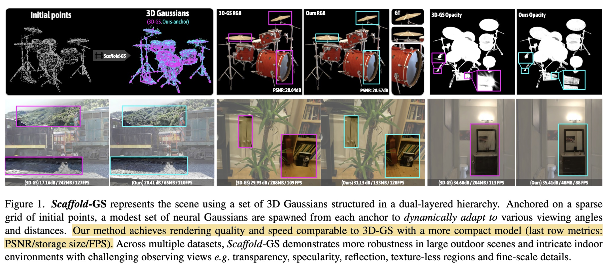
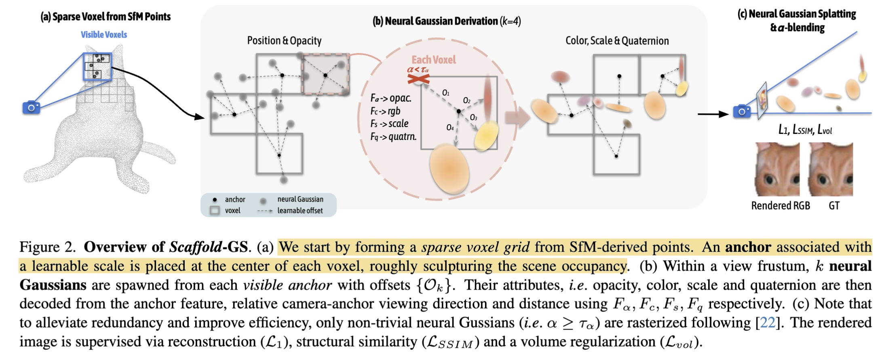
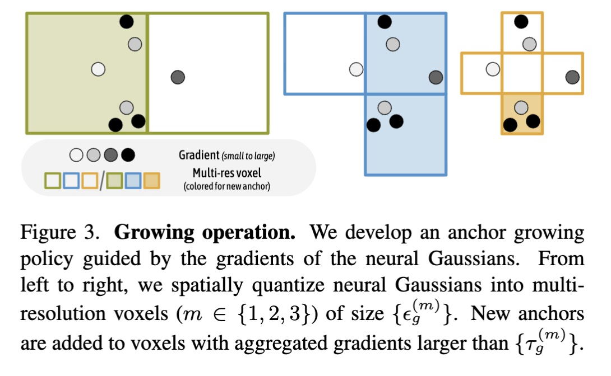
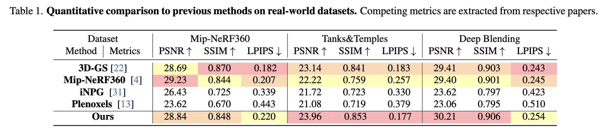

# Scaffold-GS: Structured 3D Gaussians for View-Adaptive Rendering

## Introduction
- **Project**: https://city-super.github.io/scaffold-gs/
- **Code**: https://github.com/city-super/Scaffold-GS

Scaffold-GS studies novel view synthesis with 3D Gaussian Splatting (3DGS[^1]), but tries to reduce Gaussian redundancy and improve robustness to large view changes.
Instead of optimizing a huge set of static Gaussians that overfit training views, it organizes Gaussians around sparse anchor points and decodes Gaussian attributes on-the-fly conditioned on view direction and distance.
The paper targets difficult scenes such as texture-less regions, specular/reflection effects, and multi-scale observations, while keeping real-time rendering speed.

**Authors**:
- **Tao Lu** (First Author) - Nanjing University
- Mulin Yu, Linning Xu, Yunzhi Zheng, Zhihao Li, Runsen Feng, Chuning Li, Darong Liu, Bo Dai, Dahua Lin - Shanghai Artificial Intelligence Laboratory, The Chinese University of Hong Kong, Cornell University

**Keywords**: 3D Gaussian Splatting, view-adaptive rendering, anchor-based representation, novel view synthesis, model compactness

**Publication**: CVPR 2024 (Highlight)

## Method

- **Training data**:
  - Uses calibrated multi-view images and SfM (Structure-from-Motion — a photogrammetry pipeline that recovers camera poses and sparse 3D points from images) points as initialization anchors.
  - Evaluated on 27 real-world scenes from Mip-NeRF360[^2], Tanks&Temples[^3], and Deep Blending[^4]; also tests synthetic Blender[^5] plus multi-scale BungeeNeRF[^6] / VR-NeRF[^7].
- **Method overview**:
  - Build a sparse voxel grid from SfM points.
  - Place one anchor at each occupied voxel center; each anchor carries a learnable feature vector, a scale value, and k learnable offset vectors.
  - For each visible anchor, spawn k neural Gaussians and decode their opacity / color / scale / rotation with small MLPs conditioned on the anchor feature and the camera-to-anchor relative direction and distance.
  - Apply opacity-based filtering and frustum filtering to discard trivial Gaussians before rasterization.

- **Key model components**:
  - Reused: tile-based Gaussian rasterization and alpha-blending pipeline from 3DGS[^1].
  - New/modified: anchor feature bank with view-dependent attribute decoding, anchor growing policy (gradient-based), anchor pruning policy (opacity-accumulation-based).
  - Hyperparameters: k = 10 neural Gaussians per anchor; 2-layer MLPs with hidden size 32.
- **Loss functions**:
  - $\mathcal{L} = \mathcal{L}_1 + \lambda_\text{SSIM}\,\mathcal{L}_\text{SSIM} + \lambda_\text{vol}\,\mathcal{L}_\text{vol}$
  - $\mathcal{L}_1$: L1 photometric reconstruction loss.
  - $\mathcal{L}_\text{SSIM}$: SSIM loss ($\lambda_\text{SSIM} = 0.2$).
  - $\mathcal{L}_\text{vol}$: volume regularization that penalizes large or overlapping Gaussian scales ($\lambda_\text{vol} = 0.001$).

## Highlight

- **Rendering quality vs. 3DGS[^1]** (Table 1, PSNR / SSIM / LPIPS):
- **Speed and storage vs. 3DGS[^1]** (Table 2):
  - Mip-NeRF360[^2]: 102 FPS / 156 MB vs. 97 FPS / 693 MB — **4.4× smaller**.
  - Tanks&Temples[^3]: 110 FPS / 87 MB vs. 123 FPS / 411 MB — **4.7× smaller**.
  - Deep Blending[^4]: 139 FPS / 66 MB vs. 109 FPS / 676 MB — **10.2× smaller and faster**.
- **Multi-scale / large-scene benchmark vs. 3DGS[^1]** (Table 3):
  - BungeeNeRF[^6]: 27.01 PSNR / 203 MB vs. 24.89 / 1606 MB — **7.9× smaller**.
  - VR-NeRF[^7]: 29.24 PSNR / 69 MB vs. 28.94 / 263 MB — **3.8× smaller**.
  - Synthetic Blender[^5]: 33.68 PSNR / 14 MB vs. 33.32 / 53 MB — **3.8× smaller**.
- **Ablation highlights**:
  - Opacity/frustum filtering has little PSNR impact but yields large FPS gains (e.g., DB-Playroom: 150 FPS with filtering vs. 84 FPS without).
  - Anchor growing is critical for reconstruction fidelity; pruning controls storage growth.
- **Hardware**: FPS measured at ~1K resolution on the authors' machine (GPU model not explicitly stated in the main paper).

## Limitation
- Strongly depends on SfM (Structure-from-Motion) initialization quality; scenes with very sparse or failed SfM point clouds are problematic.
- Anchor growing/pruning mitigates sparse initialization but cannot fully recover from extremely sparse observations.
- On Mip-NeRF360[^2], quality metrics are not uniformly better than 3DGS[^1] — SSIM and LPIPS can be worse despite higher PSNR.
- Advantages are most pronounced in challenging, multi-scale, or large scenes; benefits are smaller in easier, well-observed scenes.
- Filtering may occasionally discard relevant neural Gaussians, as noted in the ablation discussion.

## Comments

[^1]: Kerbl et al., "3D Gaussian Splatting for Real-Time Radiance Field Rendering," SIGGRAPH 2023.
[^2]: Barron et al., "Mip-NeRF 360: Unbounded Anti-Aliased Neural Radiance Fields," CVPR 2022.
[^3]: Knapitsch et al., "Tanks and Temples: Benchmarking Large-Scale Scene Reconstruction," SIGGRAPH 2017.
[^4]: Hedman et al., "Deep Blending for Free-Viewpoint Image-Based Rendering," SIGGRAPH Asia 2018.
[^5]: Mildenhall et al., "NeRF: Representing Scenes as Neural Radiance Fields for View Synthesis," ECCV 2020.
[^6]: Xiangli et al., "BungeeNeRF: Progressive Neural Radiance Field for Extreme Multi-scale Scene Rendering," ECCV 2022.
[^7]: Xu et al., "VR-NeRF: High-Fidelity Virtualized Walkable Spaces," SIGGRAPH Asia 2023.
