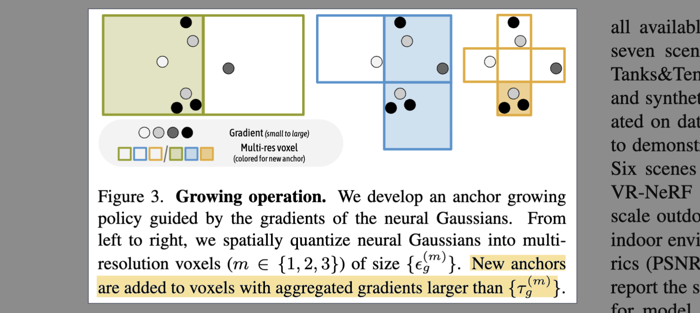

# Scaffold-GS: Structured 3D Gaussians for View-Adaptive Rendering

- **Authors:** Tao Lu*, Mulin Yu*, Linning Xu, Yuanbo Xiangli, Limin Wang, Dahua Lin, Bo Dai
- **Affiliations:** Shanghai Artificial Intelligence Laboratory, The Chinese University of Hong Kong, Nanjing University, Cornell University
- **Published:** CVPR 2024 (Highlight), arXiv:2312.00109 (30 Nov 2023)
- **Keywords:** 3D Gaussian Splatting, anchor-based representation, view-adaptive rendering, neural Gaussians, novel view synthesis
- **Webpage:** https://city-super.github.io/scaffold-gs/
- **GitHub:** https://github.com/city-super/Scaffold-GS

---

## Pass 1 — Bird's-Eye View

| C | Assessment |
|---|-----------|
| **Category** | Scene representation / novel view synthesis; proposes a hierarchical anchor-based 3D Gaussian representation to replace the free-floating Gaussians of 3D-GS |
| **Context** | Directly extends 3D Gaussian Splatting (3D-GS); addresses its redundancy and poor view-adaptability; draws on SfM-based initialization, neural field attribute decoding, and anchor growing/pruning strategies from NeRF-adjacent works |
| **Correctness** | Core assumptions are sound: SfM point clouds are a reliable scene skeleton; view-dependent MLP decoding is an established paradigm. Validated across 27 scenes on 5 datasets. |
| **Contributions** | (1) Anchor-based scene representation: sparse voxel anchors each spawning k neural Gaussians; (2) On-the-fly view-dependent attribute prediction via lightweight MLPs; (3) Opacity- and frustum-based filtering for inference speed; (4) Gradient-guided growing and opacity-based pruning for anchor refinement; (5) Volume regularization loss |
| **Clarity** | Well-structured; method section is systematic and directly corresponds to the framework figure |

**30-second summary.** Scaffold-GS observes that vanilla 3D-GS lets Gaussians drift and overfit individual training views, producing redundant primitives that degrade with view changes and in texture-less or specular regions. The fix is a hierarchical dual-layer structure: a sparse set of *anchor points* (one per occupied voxel, initialized from SfM) each spawns k *neural Gaussians* whose attributes (opacity, color, scale, rotation) are decoded on-the-fly from a learned anchor feature conditioned on the viewing direction and distance. Only frustum-visible anchors with high-opacity Gaussians are activated per frame, giving comparable FPS to 3D-GS but with 4–10× less storage. Anchor growing (gradient-guided) and pruning (opacity-based) refine the scaffold over training. On challenging scenes with reflections, texture-less areas, and multi-scale content, Scaffold-GS consistently outperforms 3D-GS in quality while using a much more compact model.


---

## Pass 2 — Careful Read

### Core Idea in One Sentence

Scaffold-GS replaces free-floating 3D Gaussians with a sparse voxel scaffold of anchor points that spawn view-adaptive neural Gaussians on-the-fly, achieving comparable rendering speed with dramatically fewer primitives and better quality on challenging views.

### Method / Approach


- **Anchor-point initialization:** SfM points are voxelized at size $\epsilon$ ; each occupied voxel center becomes an anchor $v$ carrying a 32-dim context feature $f_v$ , a scale factor $l_v \in R^3$ , and $k$ learnable 3D offsets $O_v \in R^{k \times 3}$ . A multi-resolution feature bank $\{f_v, f_{v \downarrow 1}, f_{v \downarrow 2}\}$ is maintained per anchor; view-dependent weighted combination via a tiny MLP $F_w$ produces an integrated feature $\hat{f}_v$ used for all attribute decoding.
- **On-the-fly neural Gaussian derivation:** For each anchor visible in the view frustum, $k$ neural Gaussians are spawned at positions $x_v + \{O_i\} \cdot l_v$ . Four separate small MLPs decode opacity $F_\alpha$ , color $F_c$ , scale $F_s$ , and quaternion $F_q$ from $(\hat{f}_v, \delta_{vc}, \bar{d}_{vc})$ — the anchor feature, relative distance, and relative direction to the camera. Only non-trivial Gaussians (opacity $\geq \tau_\alpha$) are rasterized, keeping runtime cost near that of 3D-GS.
- **Anchor refinement (growing + pruning):** Growing adds new anchors in high-gradient regions (poor initialization coverage) using a multi-resolution voxel quantization of neural Gaussians, with a random elimination step to curb runaway expansion. Pruning removes anchors whose accumulated neural Gaussian opacity falls below 0.5 over $N=100$ training iterations. Together they yield a compact but complete scaffold.
- **Loss design:** $L = L_1 + \lambda_{SSIM} L_{SSIM} + \lambda_{vol} L_{vol}$ where $L_{vol} = \sum \text{Prod}(s_i)$ penalizes large or overlapping Gaussian scales ( $\lambda_{SSIM}=0.2, \lambda_{vol}=0.001$ ).



### Key Results

| Dataset | Metric | Scaffold-GS | 3D-GS | Best prior (non-GS) |
|---|---|---|---|---|
| Mip-NeRF360 | PSNR / SSIM / LPIPS | 28.84 / 0.848 / 0.220 | 28.69 / 0.870 / 0.182 | 29.23 / 0.844 / 0.207 (Mip-NeRF360) |
| Tanks & Temples | PSNR / SSIM / LPIPS | **23.96 / 0.853 / 0.177** | 23.14 / 0.841 / 0.183 | — |
| Deep Blending | PSNR / SSIM / LPIPS | **30.21 / 0.906 / 0.254** | 29.41 / 0.903 / 0.243 | — |
| BungeeNeRF | PSNR / Storage | **27.01 / 203 MB** | 24.89 / 1606 MB (7.9× larger) | — |
| VR-NeRF | PSNR / Storage | 29.24 / 69 MB | 28.94 / 263 MB (3.8× larger) | — |
| Synthetic Blender | PSNR / Storage | 33.68 / 14 MB | 33.32 / 53 MB (3.8× larger) | — |

**Storage / Speed vs. 3D-GS (Table 2):**
- Mip-NeRF360: 102 FPS / 156 MB vs. 97 / 693 MB → **4.4× smaller**
- Tanks & Temples: 110 FPS / 87 MB vs. 123 / 411 MB → **4.7× smaller**
- Deep Blending: 139 FPS / 66 MB vs. 109 / 676 MB → **10.2× smaller and faster**

**Ablation findings:**
- Filtering strategies (frustum + opacity) have minimal quality impact but boost FPS dramatically: 84→150 FPS on DB-Playroom with full filters.
- Growing is critical for fidelity: removing it drops PSNR from 30.62→28.45 on DB-Playroom. Pruning controls storage without sacrificing quality.
- Final activated Gaussian count converges to a similar value regardless of initial $k$ (k=5,10,20 all converge), demonstrating the self-regulating nature of the scaffold.

### Strengths

- **Structural compactness:** Anchor-based organization prevents Gaussian redundancy inherent in 3D-GS; 4–10× storage reduction at comparable or better quality.
- **View adaptability:** Per-view MLP attribute decoding lets the same anchor represent different appearances at different viewpoints — critical for specular surfaces and multi-scale scenes.
- **Semantic anchor features:** K-means clustering of anchor features reveals semantically meaningful groupings (furniture, walls, floors), suggesting the scaffold learns an interpretable scene representation.
- **Self-regulating density:** Growing adds coverage where it's needed; pruning removes trivial anchors; the final count is robust to the initial $k$ hyperparameter.
- **Inference efficiency:** Frustum and opacity filtering remove the majority of Gaussians before rasterization, keeping rendering speed on par with 3D-GS while using far fewer primitives.

### Weaknesses / Open Questions

1. **SfM dependency:** Quality relies heavily on the SfM initialization; scenes with sparse or failed SfM point clouds (e.g., texture-less indoor environments) remain challenging even with anchor growing.
2. **Quality trade-offs on Mip-NeRF360:** SSIM and LPIPS are slightly worse than 3D-GS on this benchmark despite higher PSNR — the compact model may sacrifice some fine local detail.
3. **Opacity filtering risk:** As noted in the ablation, opacity-based filtering can occasionally mask valid neural Gaussians, introducing potential false-negative suppression in thin or semi-transparent structures.
4. **MLP overhead:** At inference, $k$ MLP forward passes per visible anchor add computational overhead absent in vanilla 3D-GS; this is offset by fewer active Gaussians but may not scale gracefully to very large scenes with dense anchors.
5. **No explicit appearance modeling:** View-dependent colors are decoded from the anchor feature but there is no disentangled appearance/illumination module, limiting generalization to novel lighting conditions.

### References to Follow Up

1. **3D Gaussian Splatting for Real-Time Radiance Field Rendering** — Kerbl et al., SIGGRAPH 2023: Direct baseline and foundation; must-read to understand what Scaffold-GS improves upon.
2. **Mip-NeRF 360: Unbounded Anti-Aliased Neural Radiance Fields** — Barron et al., CVPR 2022: Primary benchmark dataset and main NeRF-family comparison.
3. **Instant Neural Graphics Primitives** — Müller et al., ACM ToG 2022: Grid-based approach compared against; demonstrates the tradeoffs of hash-encoding vs. anchor-based representations.
4. **BungeeNeRF: Progressive Neural Radiance Field for Extreme Multi-scale Scene Rendering** — Xiangli et al., ECCV 2022: Multi-scale dataset where Scaffold-GS gains are largest; highlights the view-adaptive advantage.
5. **Octree-AnyGS / follow-ups from city-super group:** The authors extended Scaffold-GS into a general anchor-based framework supporting 2D-GS and 3D-GS; worth tracking for architectural evolution.

---

## Pass 3 — Virtual Re-implementation

### Detailed Technical Summary

**Scene Representation**

The scene is represented by a set of anchor points $\{v\}$ , one per occupied voxel derived from the SfM point cloud $P \in R^{M \times 3}$ at voxel size $\epsilon$ :

```math
V = \left\{ \left\lfloor \frac{P}{\epsilon} \right\rfloor \right\} \cdot \epsilon, \quad V \in R^{N \times 3}
```

Each anchor $v$ stores:
- Context feature $f_v \in R^{32}$ (learnable)
- Scale factor $l_v \in R^3$ (learnable)
- $k$ offset vectors $O_v \in R^{k \times 3}$ (learnable)

A multi-resolution feature bank $\{f_v, f_{v \downarrow 1}, f_{v \downarrow 2}\}$ is built by downsampling $f_v$ by $2^n$ factors. At render time, given camera position $x_c$ and anchor $x_v$ :

```math
\delta_{vc} = \|x_v - x_c\|_2, \quad \bar{d}_{vc} = \frac{x_v - x_c}{\|x_v - x_c\|_2}
```

A weighting MLP $F_w$ produces view-adaptive feature aggregation:

```math
\{w, w_1, w_2\} = \text{Softmax}(F_w(\delta_{vc}, \bar{d}_{vc}))
```

```math
\hat{f}_v = w \cdot f_v + w_1 \cdot f_{v \downarrow 1} + w_2 \cdot f_{v \downarrow 2}
```

**Neural Gaussian Derivation**

For each frustum-visible anchor $v$ , $k$ neural Gaussians are spawned at:

```math
\{\mu_0, \ldots, \mu_{k-1}\} = x_v + \{O_0, \ldots, O_{k-1}\} \cdot l_v
```

Their attributes are decoded in one pass by four separate 2-layer MLPs (hidden size 32, ReLU):

```math
\{\alpha_0, \ldots, \alpha_{k-1}\} = F_\alpha(\hat{f}_v, \delta_{vc}, \bar{d}_{vc})
```

Colors $\{c_i\}$ , scales $\{s_i\}$ , quaternions $\{q_i\}$ are decoded similarly by $F_c, F_s, F_q$ . Only Gaussians with $\alpha \geq \tau_\alpha$ pass to rasterization (opacity filter). The standard tile-based 3D-GS rasterizer then renders:

```math
C(x') = \sum_{i \in N} c_i \sigma_i \prod_{j=1}^{i-1}(1 - \sigma_j), \quad \sigma_i = \alpha_i G'_i(x')
```

**Anchor Growing**

After every $N=100$ training iterations, neural Gaussians are spatially quantized into multi-resolution voxels at $m \in \{1,2,3\}$ levels:

```math
\epsilon_g^{(m)} = \epsilon_g / 4^{m-1}, \quad \tau_g^{(m)} = \tau_g \times 2^{m-1}
```

Voxels whose aggregated neural Gaussian gradient $\nabla_g > \tau_g^{(m)}$ are deemed *significant* ; if no anchor exists at the voxel center, one is deployed. A random elimination step removes a fraction of new candidates to prevent runaway growth. Default: $\tau_g = 64\epsilon$ for clean scenes, $\tau_g = 16\epsilon$ for texture-less or intricate scenes.

**Anchor Pruning**

An anchor is pruned if the accumulated opacity of all its neural Gaussians falls below 0.5 over $N$ training iterations — it is considered trivial (empty space or misdetection).

**Loss**

```math
L = L_1 + \lambda_{SSIM} L_{SSIM} + \lambda_{vol} L_{vol}
```

```math
L_{vol} = \sum_{i=1}^{N_{ng}} \text{Prod}(s_i)
```

where $\text{Prod}(\cdot)$ is the product of the scale vector values, encouraging compact, non-overlapping Gaussians. $\lambda_{SSIM}=0.2, \lambda_{vol}=0.001$.

### Hidden Assumptions

1. SfM produces a sufficient point cloud to initialize anchors across the scene; sparse or textureless areas require the growing mechanism to recover, which depends on gradient signal during training.
2. The view frustum is a reliable proxy for visibility — anchors outside the frustum are completely skipped even if their Gaussians extend into the frustum boundary.
3. $k=10$ neural Gaussians per anchor is sufficient for local scene detail; the self-regulating convergence (Fig. 9) supports this, but it is not proven for highly detailed scenes.
4. Opacity threshold $\tau_\alpha$ is fixed; an adaptive threshold might be needed for scenes with many semi-transparent objects.
5. The tiny 2-layer MLPs (hidden size 32) are expressive enough for per-anchor view-dependent attribute prediction; this breaks down for large, geometrically complex anchors.

### Reproducibility Notes

- **Code:** Publicly available at https://github.com/city-super/Scaffold-GS with full training scripts per dataset.
- **Data:** All datasets publicly available (Mip-NeRF360, Tanks&Temples, Deep Blending, Synthetic Blender, BungeeNeRF, VR-NeRF). SfM initialization via COLMAP.
- **Hyperparameters:** $k=10$, hidden size 32, 2-layer MLP, 30k iterations, $\lambda_{SSIM}=0.2$, $\lambda_{vol}=0.001$, $N=100$ for growing/pruning, $\tau_\alpha$ tuned per scene type.
- **Missing details:** Exact $\tau_\alpha$ values per dataset and full per-scene results are in supplementary material (not in main paper). The anchor growing threshold $\tau_g$ differs between scene types but precise per-scene values are not listed in the main text.
- **Hardware:** FPS reported at ~1K resolution on authors' machine; GPU model not explicitly stated in the main paper.

### Ideas for Future Work

1. **Dynamic scenes:** The anchor-point scaffold is static; extending growing/pruning to track moving anchors over time could enable efficient dynamic scene representation (cf. 4D-GS approaches).
2. **Appearance disentanglement:** Adding an explicit illumination or appearance code per anchor would allow relighting and day/night generalization beyond the current view-dependent color decoding.
3. **SfM-free initialization:** Replacing COLMAP initialization with a learned depth estimator or monocular reconstruction would remove the SfM bottleneck for texture-less scenes.
4. **Compressed anchor features:** The 32-dim anchor feature per voxel could be further compressed with learned codebooks (VQ-VAE style) for even more compact storage.
5. **Multi-scene anchor reuse:** Anchors that cluster into semantically similar feature groups (as shown in Fig. 6) suggest potential for transferring priors across scenes — analogous to NeRF scene generalization.

---

## Pass 4 — Modern Perspective Review (as of June 2026)

### What Has Changed Since Publication

- **Proliferation of GS variants:** The field has exploded with hundreds of 3D-GS extensions since 2023. Scaffold-GS's anchor paradigm became highly influential — the "city-super" group released Octree-AnyGS as a generalization supporting 2D-GS, 3D-GS, and neural Gaussians within the same anchor framework.
- **2D-GS (2024):** Replaced volumetric 3D Gaussians with flat 2D surfels for better surface geometry; Scaffold-GS's anchor-based organization was adopted by subsequent surface-reconstruction works.
- **Large-scale and street-level scenes:** Works like Street Gaussians (2024) and GaussianDWM (2025) handle dynamic urban scenes — these cite Scaffold-GS as a key compact representation reference.
- **Storage compression:** GaussianObject, Compact3D, and others pushed storage reduction further; Scaffold-GS's 4–10× gains are now the starting point rather than the ceiling.
- **Evaluation standards:** Perceptual quality (LPIPS) and storage-quality trade-off plots are now standard; Scaffold-GS helped establish this reporting norm.

### Has the Community Accepted the Claims?

Yes, broadly. The anchor-based neural Gaussian paradigm is now a widely cited design pattern. Scaffold-GS's claims about view-adaptability and compactness were validated by follow-on works that adopted and extended the architecture. The original CVPR 2024 Highlight designation reflects strong community endorsement at publication time. One nuance: quality improvements on Mip-NeRF360 are modest (and SSIM/LPIPS are mixed vs. 3D-GS), suggesting the method's advantages are most pronounced on challenging multi-scale and view-dependent scenes rather than well-conditioned benchmark scenes.

---

### Comparison Papers

#### Predecessors

| Paper | Authors | Year | Relation |
|---|---|---|---|
| 3D Gaussian Splatting for Real-Time Radiance Field Rendering | Kerbl et al. | 2023 | Direct baseline; Scaffold-GS restructures 3D-GS with anchors to fix its redundancy and view-instability |
| Mip-NeRF 360: Unbounded Anti-Aliased Neural Radiance Fields | Barron et al. | 2022 | Primary NeRF baseline and benchmark dataset source |
| Instant Neural Graphics Primitives with a Multiresolution Hash Encoding | Müller et al. | 2022 | Grid-based alternative; Scaffold-GS is compared to iNGP on Mip-NeRF360 |
| Plenoxels: Radiance Fields without Neural Networks | Fridovich-Keil et al. | 2022 | Sparse voxel grid baseline; motivates Scaffold-GS's voxel-anchor initialization |
| BungeeNeRF: Progressive Neural Radiance Field for Extreme Multi-scale Scene Rendering | Xiangli et al. | 2022 | Multi-scale dataset where Scaffold-GS demonstrates largest gains; same author group |

#### Contemporaries / Competitors

| Paper | Authors | Year | Relation |
|---|---|---|---|
| Mip-Splatting: Alias-free 3D Gaussian Splatting | Yu et al. | 2023 | Concurrent GS improvement; addresses aliasing rather than structure/compactness |
| GaussianShader: 3D Gaussian Splatting with Shading Functions for Reflective Surfaces | Jiang et al. | 2023 | Concurrent; targets specular/reflective scenes via explicit shading, vs. Scaffold-GS's implicit MLP approach |
| Compact 3D Gaussian Representation for Radiance Field | Lee et al. | 2023 | Concurrent; also targets compactness but via vector quantization rather than structural anchors |

#### Successors / Extensions

| Paper | Authors | Year | Relation |
|---|---|---|---|
| Octree-AnyGS: Adaptive Anchor-Based Gaussian Primitives | city-super group | 2024 | Direct successor from same authors; generalizes Scaffold-GS's anchor framework to 2D-GS, 3D-GS, and neural Gaussians |
| 2D Gaussian Splatting for Geometrically Accurate Radiance Fields | Huang et al. | 2024 | Adopts flat 2D surfels; Scaffold-GS's anchor idea influenced its structured initialization approach |
| Street Gaussians: Modeling Dynamic Urban Scenes with Gaussian Splatting | Yan et al. | 2024 | Applies structured Gaussian representation to dynamic autonomous driving scenes; cites Scaffold-GS as compact scene prior |
| LangSplat: 3D Language Gaussian Splatting | Qin et al. | 2023 | Adds CLIP language features to 3D Gaussians; Scaffold-GS's compact anchor features are a natural fit for language field extensions |

---

### Bottom Line

Scaffold-GS is a foundational paper in the post-3D-GS era and a must-read for anyone working on Gaussian-based scene representations. Its core insight — that a sparse structural scaffold of anchor points should govern the distribution of Gaussian primitives rather than letting them drift freely — is simple, principled, and empirically validated. The 4–10× storage reduction at maintained quality and speed is a compelling practical result, particularly for large-scale and challenging scenes. As of 2026, the anchor-based paradigm it established has become a standard design pattern, making this paper a direct conceptual predecessor to a large branch of the 3DGS literature.
