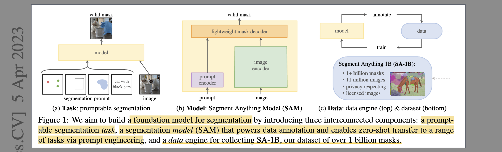
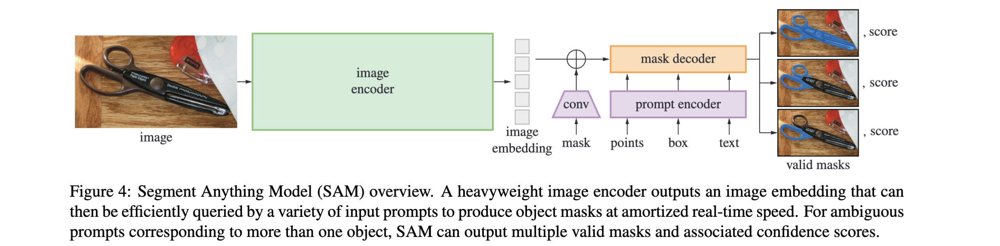

# Segment Anything

- **Authors:** Alexander Kirillov, Eric Mintun, Nikhila Ravi, Hanzi Mao, Chloe Rolland, Laura Gustafson, Tete Xiao, Spencer Whitehead, Alexander C. Berg, Wan-Yen Lo, Piotr Dollár, Ross Girshick
- **Affiliations:** Meta AI Research, FAIR
- **Published:** ICCV 2023 (arXiv:2304.02643, April 2023)
- **Keywords:** foundation model, promptable segmentation, interactive segmentation, SA-1B, zero-shot transfer, vision transformer
- **Webpage:** https://aidemos.meta.com/segment-anything/
- **GitHub:** https://github.com/facebookresearch/segment-anything
- **HuggingFace:** https://huggingface.co/facebook/sam-vit-huge

---

## Pass 1 — Bird's-Eye View

| C | Assessment |
|---|-----------|
| **Category** | Foundation model paper for image segmentation; introduces a new task (promptable segmentation), model (SAM), and large-scale dataset (SA-1B with 1.1B masks) |
| **Context** | Draws on the NLP foundation model paradigm (GPT, BERT); uses MAE-pretrained ViT as image encoder; CLIP for text prompts; builds on interactive segmentation work (RITM, FocalClick, SimpleClick); SA-1B dwarfs all prior segmentation datasets (400× more masks than COCO) |
| **Correctness** | Claims are well-supported by evaluations across 23 diverse zero-shot datasets and human studies. The dataset quality claim is validated by annotator ratings showing automatic masks approach manually annotated quality. Some caveats: geographic bias (Africa/low-income countries underrepresented), instance segmentation still trails fully supervised methods on COCO |
| **Contributions** | (1) Promptable segmentation task formulation enabling zero-shot transfer via prompting; (2) SAM — an efficient image encoder + prompt encoder + mask decoder model; (3) SA-1B — 1.1B high-quality masks on 11M licensed, privacy-respecting images; (4) 3-stage data engine (manual → semi-automatic → fully automatic) that produced SA-1B using SAM itself |
| **Clarity** | Exceptionally clear. Three-component framing (task/model/data) runs throughout. The data engine description is particularly well structured. Responsible AI section with geographic and demographic analysis is thorough |

SAM introduces a foundation model approach to image segmentation by defining a *promptable segmentation* task — given any prompt (point, box, mask, or [text](#note-text-prompting-vs-pointsboxes)), the model must return a valid segmentation mask. SAM is trained on SA-1B, a 1.1B-mask dataset generated via a self-improving data engine where SAM itself assists annotators, enabling scale beyond any prior segmentation effort. At inference, a heavy ViT-H image encoder runs once per image, and a lightweight prompt encoder + mask decoder (~50ms on CPU) handles interactive prompting. SAM generalizes zero-shot to 23 diverse segmentation datasets, often matching or exceeding fully supervised methods, and is designed to compose as a component inside larger vision systems.

---

## Pass 2 — Careful Read

### Core Idea in One Sentence

Pre-train a prompt-conditioned segmentation model on 1.1B diverse masks so it can generalize zero-shot to new images and segmentation tasks via natural prompts — points, boxes, masks, or text.

### Method / Approach

- **Promptable segmentation task:** Given any prompt specifying what to segment (sparse: points, boxes, text; or dense: mask), produce a valid mask even when the prompt is ambiguous. SAM outputs 3 candidate masks with confidence scores to handle inherent ambiguity (e.g., a point on a shirt could segment the shirt(part), the person(whole), or just the collar(subpart)). Only the minimum-loss mask is backpropagated during training.

- **Three-component architecture:** A heavyweight MAE-pretrained ViT-H *image encoder* (runs once per image, outputs 64×64 embedding); a lightweight *prompt encoder* (sparse prompts → positional encodings + learned type tokens; text → CLIP encoder; dense masks → convolutions summed with image embedding); and a fast *mask decoder* (2-layer two-way Transformer with bidirectional cross-attention, dynamic output tokens, upsampling head → 3 masks + IoU scores, ~50ms on CPU).

- **Three-stage data engine:** Stage 1 — *assisted-manual*: annotators use SAM-powered browser tool, model retrained 6× as data accumulates, collecting 4.3M masks (~6× faster than brush tools). Stage 2 — *semi-automatic*: SAM auto-generates confident masks for prominent objects; annotators fill remaining gaps, adding 5.9M masks. Stage 3 — *fully automatic*: 32×32 grid of point prompts → up to 768 mask candidates per image → NMS + quality filtering (IoU > 0.88, stability > 0.95, area > 100px²), producing 1.1B masks across 11M images.

- **Training with simulated prompts:** To make SAM interactive, training simulates 11 rounds of prompting per mask — randomly sampling points, boxes, and masks as prompts. This teaches SAM to refine predictions given iterative user feedback, which is key for the interactive use-case.

### Key Results

| Task | Benchmark | SAM | Best Supervised | Notes |
|------|-----------|-----|----------------|-------|
| Point segmentation | 23 datasets (avg mIoU) | Outperforms RITM on 16/23 | RITM | Oracle ambiguity: SAM wins on all 23 |
| Edge detection | BSDS500 (ODS) | 0.768 | HED: 0.788 | Zero-shot; SAM not trained for edges |
| Object proposals | COCO AR@1000 | 59.3 | ViTDet: 60.4 | Zero-shot; competitive |
| Object proposals | LVIS AR@1000 | 61.7 | ViTDet: 65.0 | Notably better on medium/large objects |
| Instance seg. | COCO AP | ~46.5 | ViTDet: 51.0 | SAM used as mask proposal → ViTDet boxes |
| Human quality rating | 23 datasets | Higher than ViTDet | — | Mean rating 7–9 ("identifiable, small errors") |

Ablation highlights:
- ViT-H image encoder substantially outperforms ViT-B and ViT-L (+9.2% on 23-dataset avg).
- Training with SA-1B (all stages) outperforms using only stage-1 data by a significant margin; stage 3 automatic data is near-as-good as all data combined.
- Predicting 3 masks instead of 1 resolves ambiguity and improves results; additional masks beyond 3 show diminishing returns.

### Strengths

- **Unprecedented dataset scale:** 1.1B masks on 11M images — 400× more masks than COCO, 100× more than Open Images — enables generalization unavailable to any prior model.
- **Composability by design:** SAM intentionally decouples the heavy image encoder (runs once) from the fast prompt encoder+decoder (~50ms), making it practical as a real-time component inside larger systems once image embedding is cached.
- **Self-improving data flywheel:** The 3-stage data engine uses SAM to generate its own training data, improving iteratively — a genuinely scalable strategy that avoids the bottleneck of manual annotation.
- **Ambiguity awareness:** Explicit 3-mask output with IoU confidence handles the fundamental ambiguity of segmentation from sparse prompts better than prior single-output methods.
- **Responsible AI:** Geographic and demographic analysis of SA-1B, Fitzpatrick skin tone fairness evaluation, model cards, and an Apache 2.0 license for both code and a large subset of the dataset.

### Weaknesses / Open Questions

1. **No real-time image encoding:** ViT-H on 1024×1024 is heavy; SAM is not usable end-to-end in real-time without pre-computing image embeddings or a lighter backbone.
2. **Text prompting is shallow:** CLIP text encoder is used but not deeply explored; arbitrary compositional text queries (spatial relations, attributes) are not demonstrated.
3. **Instance segmentation gap:** Even combined with ViTDet boxes, SAM's masks trail fully supervised methods on COCO — partly because SAM outputs only one mask per box (no NMS over masks).
4. **Geographic bias:** SA-1B underrepresents Africa, Latin America, and low-income countries; downstream performance on images from those regions may be lower.
5. **Domain gap in specialized imagery:** Medical, satellite, and microscopy images differ substantially from natural photos; zero-shot SAM performance on these domains degrades and fine-tuning is needed.

### References to Follow Up

1. **Masked Autoencoders Are Scalable Vision Learners** — He et al., CVPR 2022: The MAE pre-training method used for SAM's image encoder; understanding it explains why ViT-H is so powerful here.
2. **An Image is Worth 16×16 Words (ViT)** — Dosovitskiy et al., ICLR 2021: The backbone architecture; SAM's performance scales with ViT size in the expected way.
3. **Reviving Iterative Training with Mask Guidance (RITM)** — Sofiiuk et al.: The primary interactive segmentation baseline; SAM outperforms it on most datasets.
4. **LERF / LangSplat** — Kerr et al., ICCV 2023 / Qin et al., CVPR 2024: Both use SAM's hierarchical mask outputs as semantic supervision for 3D language fields — a key composability demonstration.
5. **Segment Anything in High Quality (HQ-SAM)** — Ke et al., NeurIPS 2023: Successor improving fine-grained mask quality for complex structures like hair and thin objects.

---

## Pass 3 — Virtual Re-implementation

### Detailed Technical Summary

**Image Encoder.** SAM uses a ViT-H/16 pre-trained with MAE. The input image is resized to $1024 \times 1024$ (with padding to preserve aspect ratio), then processed through the ViT with windowed attention (14×14 windows) and four global attention blocks. The output is a $64 \times 64 \times 256$ image embedding — effectively a 16× spatially downsampled dense feature map. This encoder runs once per image and its output is cached, amortizing the $~O(n^2)$ attention cost over all subsequent prompts.

**Prompt Encoder.** Two families of prompts are handled:

*Sparse prompts:* Points are encoded as the sum of a positional encoding (standard Fourier feature encoding of 2D coordinates) and a learned type embedding (foreground vs. background). Boxes are encoded as two corner points with a learned "box" type token. Text prompts are encoded using the frozen CLIP text encoder, producing a single vector. Each element becomes a token in the prompt token sequence.

*Dense prompts (masks):* An input mask $m \in \{0,1\}^{H \times W}$ is downsampled 4× via two $2\times2$ stride-2 convolutions with GELU activation, then element-wise added to the image embedding. This lets prior mask predictions refine subsequent predictions without extra attention tokens.

**Mask Decoder.** The decoder takes the image embedding and prompt tokens, and runs 2 layers of a two-way Transformer. In each layer:
1. Self-attention among prompt tokens
2. Cross-attention: prompt tokens → image embedding (prompts query image)
3. MLP on each prompt token
4. Cross-attention: image embedding → prompt tokens (image queries prompts)

After 2 layers, the image embedding is upsampled 4× via transposed convolutions to $256 \times 256$. Four output tokens (one IoU + three mask tokens) each produce a mask via an inner product with the upsampled embedding, followed by two Conv layers. This yields three binary masks (logits) and one IoU score. At inference, the highest-confidence mask is returned (or all three for downstream disambiguation).

**Loss Function.** For each training step, one mask from the predicted three is selected (the one with minimum loss) and supervised with:

$$\mathcal{L} = \lambda_{\text{focal}} \mathcal{L}_{\text{focal}} + \lambda_{\text{dice}} \mathcal{L}_{\text{dice}}$$

with $\lambda_{\text{focal}} = 20$, $\lambda_{\text{dice}} = 1$. IoU prediction is supervised with MSE against the ground-truth IoU of the predicted mask. The interactive simulation samples 11 prompt sequences per mask — mixing single points, multi-click refinements, boxes, and cascaded mask prompts — ensuring the model learns to refine predictions given iterative feedback.

**Data Engine — Fully Automatic Stage Details.** For each of the 11M images, a $32 \times 32 = 1024$ grid of point prompts is processed. SAM predicts up to 3 masks per point, yielding up to 3072 candidate masks. Filtering:
1. Predicted IoU $> 0.88$ and stability score $> 0.95$ (stability = IoU between masks thresholded at $0.5$ and $0.5 \pm \delta$)
2. Area $> 100$ px² (remove specks)
3. NMS with IoU threshold 0.7 to remove duplicates
4. Final per-image average: ~100 masks

The resulting 1.1B masks are the SA-1B dataset. Human raters scored 94% of masks as having predicted IoU $> 75\%$ — comparable to professional annotators.

### Hidden Assumptions

1. A single valid segmentation mask is the right output granularity — the approach doesn't naturally handle panoptic segmentation (stuff regions) or overlapping instance masks without additional post-processing.
2. Three semantic levels (subpart/part/whole) cover the full range of meaningful ambiguities from a single-point prompt; highly specific or scene-level queries don't fit this hierarchy.
3. The $32 \times 32$ grid prompt density is appropriate for all image sizes; small objects in large images may be missed, and simple scenes are over-sampled.
4. CLIP text features are rich enough for text-prompted segmentation without task-specific fine-tuning on segmentation data.
5. SA-1B automatic masks are high enough quality to supervise model training — validated empirically but a circular assumption (the model that generates training data is itself trained on earlier versions of that data).
6. Windowed attention with only 4 global blocks in ViT-H is sufficient; full global attention might further improve representation quality.

### Reproducibility Notes

- **Code & weights:** Apache 2.0 at `https://github.com/facebookresearch/segment-anything`. Three checkpoints released: ViT-H (default), ViT-L, ViT-B.
- **Dataset:** SA-1B available at `https://segment-anything.com`; 11M images (licensed, privacy-respecting); metadata and masks in JSON + RLE format.
- **Hardware:** Training details not fully disclosed; ViT-H requires multi-GPU setup. Inference: image encoding ~150ms on GPU; prompt encoder + decoder ~50ms on CPU.
- **Underspecified:** Exact optimizer and learning rate schedule for data engine retraining rounds; number of training iterations per stage; exact NMS threshold per stage; how annotators were instructed to balance "stuff" vs. "things".
- **Ablation coverage:** Most architectural choices are ablated (encoder size, number of output masks, training data stages). Rare gap: no ablation on the two-way attention design vs. standard cross-attention decoder.

### Ideas for Future Work

1. **Lightweight real-time encoder:** Distill ViT-H into a MobileNet/EfficientNet-scale encoder that fits on-device, enabling true real-time end-to-end SAM.
2. **Video SAM:** Extend the data engine and model to video, using temporal consistency as an additional signal. (SAM 2 partially addresses this.)
3. **Panoptic unification:** Combine SAM's mask quality with semantic category prediction to produce full panoptic segmentation without a separate detector.
4. **Medical/satellite domain adaptation:** Fine-tune SAM on domain-specific data (MedSAM style) and measure how much data is needed for competitive specialized performance.
5. **Compositional text prompts:** Replace frozen CLIP with a fine-tuned visual grounding model to support spatial relations, attributes, and multi-object text prompts.
6. **Mask-to-3D:** Use SAM's dense masks as pseudo-supervision for 3D segmentation in NeRF/Gaussian scenes without needing 3D annotations — building on LangSplat's approach.

---

## Pass 4 — Modern Perspective Review (as of June 2026)

### What Has Changed Since Publication

- **SAM 2 (2024):** Meta released SAM 2 with a streaming memory architecture for video segmentation. It handles object tracking through occlusions and is the de facto standard for video-level segmentation, superseding SAM for temporal tasks.
- **Lightweight SAM variants proliferated:** MobileSAM (Zhang et al., 2023), EfficientSAM (Xiong et al., 2024), and FastSAM (Zhao et al., 2023) provide real-time inference that original SAM cannot — addressing the speed bottleneck.
- **Grounded-SAM emerged:** Combining SAM with Grounding DINO enables open-vocabulary instance segmentation driven by free-form text, filling the gap in SAM's text-prompted capabilities.
- **Domain-specific fine-tunes:** MedSAM, SAM-Med2D, and SAM-based satellite segmentation models confirmed that SAM's zero-shot performance is insufficient for specialized domains, requiring fine-tuning on domain data.
- **SAM as ecosystem component:** SAM is now embedded in systems across 3D (LangSplat, Gaussian Grouping, Segment3D), robotics (manipulation policy conditioning), and AR/VR. It has become as standard a building block as a detection backbone.
- **HQ-SAM and refinements:** HQ-SAM (NeurIPS 2023) adds a high-quality output token and token-to-image cross-attention to fix fine-grained boundary quality, especially for hair, thin objects, and complex shapes.

### Has the Community Accepted the Claims?

SAM has been universally accepted as a landmark foundation model for segmentation. The promptable segmentation framing is now standard vocabulary in the field. SA-1B remains the largest public segmentation dataset and continues to be used for pre-training. The zero-shot generalization claim is well-validated — SAM genuinely transfers across a remarkable range of domains without fine-tuning, even if performance gaps versus supervised methods remain in specialized domains. The data engine approach (using the model to annotate its own training data) has been adopted in several follow-on works. The one contested aspect is text prompting: the paper's demonstrations are weak by current standards, and the community has moved to stronger grounding models (CLIP → Grounding DINO → Florence-2) for text-driven segmentation.

---

### Comparison Papers

#### Predecessors

| Paper | Authors | Year | Relation |
|-------|---------|------|----------|
| Masked Autoencoders Are Scalable Vision Learners | He, Chen, Xie, Li, Dollár, Girshick | CVPR 2022 | Provides the MAE pre-training for SAM's ViT-H image encoder |
| An Image is Worth 16×16 Words (ViT) | Dosovitskiy et al. | ICLR 2021 | The backbone architecture SAM scales |
| Learning to Prompt for Vision-Language Models (CLIP) | Radford et al. | ICML 2021 | Text encoder used for SAM's text prompting |
| RITM: Reviving Iterative Training with Mask Guidance | Sofiiuk et al. | BMVC 2022 | Primary interactive segmentation baseline SAM benchmarks against |

#### Contemporaries / Competitors

| Paper | Authors | Year | Relation |
|-------|---------|------|----------|
| SegGPT: Segmenting Everything in Context | Wang et al. | ICCV 2023 | Few-shot segmentation via in-context learning on images; complementary prompt paradigm |
| SEEM: Segment Everything Everywhere All at Once | Zou et al. | NeurIPS 2023 | Unified model combining interactive, referring, and automatic segmentation; competes directly |
| Panoptic Lifting | Siddiqui et al. | CVPR 2023 | 3D panoptic segmentation from 2D labels; different approach to scale |

#### Successors / Extensions

| Paper | Authors | Year | Relation |
|-------|---------|------|----------|
| SAM 2: Segment Anything in Images and Videos | Ravi et al. | 2024 | Direct successor; streaming memory for video; replaces SAM for temporal tasks |
| HQ-SAM: Segment Anything in High Quality | Ke et al. | NeurIPS 2023 | Adds high-quality output token to fix fine-grained boundary failures in original SAM |
| Grounded-SAM | Ren et al. | 2024 | Combines Grounding DINO + SAM for open-vocabulary text-driven instance segmentation |
| LangSplat: 3D Language Gaussian Splatting | Qin et al. | CVPR 2024 | Uses SAM's 3-level hierarchy for semantic supervision in 3D Gaussian language fields |
| MobileSAM | Zhang et al. | 2023 | Knowledge distillation into tiny encoder; enables real-time end-to-end SAM |

---

### Note: Text Prompting vs. Points/Boxes

Text was **not** jointly trained with points and boxes — it required a separate, modified procedure and is framed as a proof-of-concept in §7.5.

| | Points & Boxes | Text |
|---|---|---|
| **Training** | Core training; 11-round simulated interactive prompting | Modified procedure, separate experiment |
| **Encoding** | Learned positional encodings + type tokens | Frozen CLIP text encoder |
| **Key trick** | End-to-end with mask decoder | CLIP image embeddings (already text-aligned) serve as the first prompt; standard point/mask refinement follows |
| **Status** | First-class prompt types | Prototype / proof-of-concept |

The insight: rather than fine-tuning a text encoder on segmentation data, they exploit CLIP's pre-existing image-text alignment — SAM is trained to accept CLIP *image* embeddings as prompts, so at inference a text query retrieves a matching CLIP image embedding which then drives segmentation.

---

### Bottom Line

SAM is a foundational paper that every computer vision practitioner should read. It did two things simultaneously: (1) introduced a genuinely new task formulation (promptable segmentation) that reframes segmentation as an interface problem, and (2) released the largest segmentation dataset ever built alongside a model that actually generalizes. Three years on, SAM is as standard a component as ImageNet-pretrained ResNets once were — it appears as a step in pipelines across 3D reconstruction, robotics, medical imaging, and video understanding. For images specifically, original SAM (ViT-H) remains a strong baseline. For video, SAM 2 has superseded it. For fine-grained mask quality, HQ-SAM is preferred. But understanding SAM is the prerequisite for understanding all of these successors — it is a genuine foundational contribution, not a superseded historical artifact.
