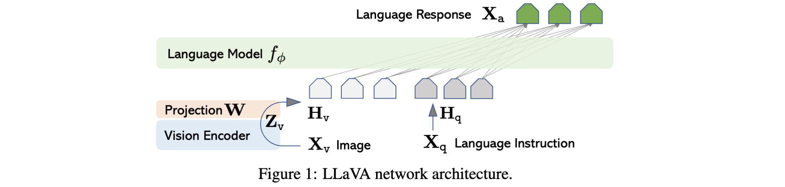
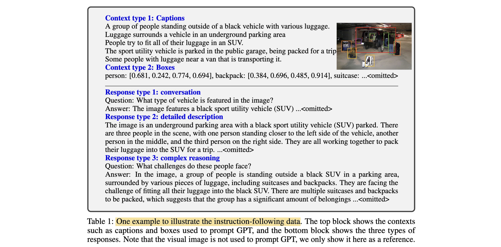

# Visual Instruction Tuning

- **Authors:** Haotian Liu, Chunyuan Li, Qingyang Wu, Yong Jae Lee
- **Affiliations:** University of Wisconsin–Madison, Microsoft Research, Columbia University
- **Published:** NeurIPS 2023, arXiv:2304.08485, December 2023
- **Keywords:** visual instruction tuning, multimodal LLM, CLIP, LLaMA, Vicuna, GPT-4 data generation, instruction following, ScienceQA
- **Webpage:** https://llava-vl.github.io
- **GitHub:** https://github.com/haotian-liu/LLaVA

---

## Pass 1 — Bird's-Eye View

| C | Assessment |
|---|-----------|
| **Category** | Method paper — introduces a multimodal instruction-tuning pipeline (data generation + model architecture + training recipe) to build a general-purpose visual assistant |
| **Context** | Builds on instruction tuning for LLMs (InstructGPT, Vicuna), CLIP visual encoders, and recent multimodal LLMs (Flamingo, BLIP-2); fills the gap that prior multimodal models lacked diverse instruction-following data and were not explicitly tuned to follow open-ended instructions |
| **Correctness** | Assumptions are well-founded: GPT-4 text-only can serve as a noisy but scalable teacher for vision-language data since COCO captions + bounding boxes encode sufficient visual semantics as text; evaluation via GPT-4-as-judge is creative but acknowledged as limited (no independent human study) |
| **Contributions** | (1) First visual instruction-tuning dataset generated automatically via GPT-4 (158K samples); (2) LLaVA model: CLIP visual encoder + trainable linear projection + Vicuna LLM, fine-tuned end-to-end; (3) LLaVA-Bench: two new multimodal instruction-following benchmarks; (4) SoTA 92.53% on ScienceQA via LLaVA+GPT-4 ensembling; (5) full open-source release |
| **Clarity** | Well written and concise; motivation is clear; evaluation methodology honestly acknowledges limitations of GPT-4 as judge |

The paper presents LLaVA (**L**arge **L**anguage **a**nd **V**ision **A**ssistant), the first model to apply the instruction-tuning paradigm from NLP to the multimodal vision-language domain. **The core insight is that a text-only GPT-4 can generate diverse, high-quality vision-language instruction data by consuming image captions and bounding boxes as symbolic proxies for the visual content, eliminating the need for human annotators.** The resulting model — CLIP ViT-L/14 connected to Vicuna-13B via a simple linear projection — achieves 85.1% of GPT-4's performance on a new multimodal chatbot benchmark and sets a new SoTA on ScienceQA at 92.53%.

---

## Pass 2 — Careful Read

### Core Idea in One Sentence

Use text-only GPT-4 to automatically generate 158K diverse visual instruction-following samples from COCO image captions and bounding boxes, then connect a frozen CLIP encoder to Vicuna-13B via a lightweight linear projection trained in two stages.

### Method / Approach



- **GPT-4-assisted data generation:** Given COCO captions and bounding boxes (both encoded as text so text-only GPT-4 can process them), generate three response types per image — *Conversation* (58K Q&A pairs), *Detailed Description* (23K), and *Complex Reasoning* (77K) — using hand-written few-shot seed examples as in-context prompts.
- **Architecture:** Visual features $Z_v = g(X_v)$ are extracted from CLIP ViT-L/14 (penultimate layer), projected into LLM embedding space via a trainable matrix $W$ to produce visual tokens $H_v = W \cdot Z_v$ , then prepended to language tokens and fed to Vicuna-13B.
- **Two-stage training:** Stage 1 trains only $W$ on CC-595K filtered image-caption pairs (feature alignment, 1 epoch, ~4h on 8×A100). Stage 2 fine-tunes both $W$ and Vicuna on LLaVA-Instruct-158K end-to-end (3 epochs, ~10h on 8×A100), with CLIP encoder frozen throughout.
- **GPT-4-as-judge evaluation:** LLaVA-Bench consists of two suites — COCO (30 images, 90 structured questions) and In-the-Wild (24 images, 60 diverse questions) — scored by GPT-4 on a 1-10 helpfulness/accuracy/detail scale relative to a text-only GPT-4 upper bound.



### Key Results

**LLaVA-Bench (COCO) — relative score vs text-only GPT-4 upper bound (Table 4):**

| Training data | Conversation | Detail | Reasoning | All |
|---|---|---|---|---|
| Full (all 3 types) | 83.1 | 75.3 | 96.5 | **85.1** |
| Detail + Complex only | 81.5 | 73.3 | 90.8 | 81.9 |
| Conv + 5% Detail + 10% Complex | 81.0 | 68.4 | 91.5 | 80.5 |
| No instruction tuning | 22.0 | 24.0 | 18.5 | 21.5 |

**LLaVA-Bench (In-the-Wild) — relative scores (Table 5):**

| Model | Conversation | Detail | Reasoning | All |
|---|---|---|---|---|
| OpenFlamingo | 19.3 ± 0.5 | 19.0 ± 0.5 | 19.1 ± 0.7 | 19.1 ± 0.4 |
| BLIP-2 | 54.6 ± 1.4 | 29.1 ± 1.2 | 32.9 ± 0.7 | 38.1 ± 1.0 |
| LLaVA | 57.3 ± 1.9 | 52.5 ± 6.3 | 81.7 ± 1.8 | 67.3 ± 2.0 |
| LLaVA† (GPT-4 eval ×3) | 58.8 ± 0.6 | 49.2 ± 0.8 | 81.4 ± 0.3 | **66.7 ± 0.3** |

**ScienceQA accuracy (Table 7):**

| Method | Average |
|---|---|
| MM-CoT Large | 91.68 |
| GPT-4 (text-only) | 82.69 |
| LLaVA | 90.92 |
| LLaVA + GPT-4 (judge) | **92.53** (new SoTA) |

**Ablation highlights (ScienceQA, Table 8):**
- Penultimate CLIP layer > last layer: 90.92% vs 89.96% (−0.96%)
- Without pre-training Stage 1: 85.81% (−5.11%) — alignment stage critical
- Reasoning-first CoT: faster early convergence but no final gain vs answer-first
- 7B vs 13B: 89.84% vs 90.92% — scale matters

### Strengths

- **Scalable data pipeline:** Completely automatic — no human annotation required beyond the few-shot seed examples; can in principle scale to any image dataset with captions/annotations.
- **Minimal architecture change:** A single linear layer bridges CLIP and the LLM; no cross-attention modules or Q-Formers needed, making the approach lightweight and easy to implement.
- **Strong emergent capabilities:** LLaVA generalises to out-of-domain images (memes, artworks, sketches), recognises unseen celebrities via LLM knowledge, and generates code from sketches — none of which were in the training distribution.
- **Open-source completeness:** Data, code, model checkpoints, and benchmark all released, catalysing a research ecosystem.
- **Novel evaluation:** LLaVA-Bench introduces GPT-4 as a reference-based judge for open-ended multimodal assessment — a methodology widely adopted in follow-on work.

### Weaknesses / Open Questions

1. **GPT-4 judge is not ground truth:** Relative scores against GPT-4's own text-only predictions introduce circularity; the judge may favour verbose or GPT-4-style outputs over accurate but concise responses.
2. **Linear projection is under-powered:** Using a single matrix $W$ to map 1024-dim CLIP features to 5120-dim LLM space loses spatial detail; the paper itself notes that Flamingo's gated cross-attention and BLIP-2's Q-Former may be more expressive.
3. **Resolution bottleneck:** CLIP ViT-L/14 processes images at 224×224 px; fine-grained tasks (reading text, recognising brands, counting small objects) routinely fail — acknowledged explicitly in Sec. 5.1 limitations.
4. **Small evaluation sets:** LLaVA-Bench COCO uses only 30 images / 90 questions; In-the-Wild uses 24 images / 60 questions. Results are noisy (large ± std) and not independently reproducible without GPT-4 access.
5. **Hallucination risk not quantified:** The model generates plausible-sounding but incorrect descriptions (the strawberry yogurt example); no hallucination metric is reported.

### References to Follow Up

1. **Improved Baselines with Visual Instruction Tuning (LLaVA-1.5)** — Liu et al., arXiv 2023: Direct successor that replaces the linear projection with an MLP and uses CLIP-336px, dramatically improving performance with the same recipe.
2. **BLIP-2: Bootstrapping Language-Image Pre-training with Frozen Image Encoders and Large Language Models** — Li et al., arXiv 2023: Alternative architecture using Q-Former for visual-language alignment; main contemporary baseline.
3. **Flamingo: A Visual Language Model for Few-Shot Learning** — Alayrac et al., NeurIPS 2022: Pioneer multimodal LLM with gated cross-attention; inspired the GPT-4 "moment" for multimodal models.
4. **Training Language Models to Follow Instructions with Human Feedback (InstructGPT)** — Ouyang et al., NeurIPS 2022: Foundation of the instruction-tuning paradigm that LLaVA extends to vision.
5. **Learn to Explain: Multimodal Reasoning via Thought Chains for Science Question Answering (ScienceQA)** — Lu et al., NeurIPS 2022: Benchmark used for quantitative evaluation; MM-CoT is the prior SoTA LLaVA surpasses.

---

## Pass 3 — Virtual Re-implementation

### Detailed Technical Summary

**Visual feature extraction.** Given an input image $X_v$ , LLaVA uses the pre-trained CLIP visual encoder $g(\cdot)$ (ViT-L/14, patch size 14, input resolution 224×224) to extract visual features. Crucially the authors use grid features from the layer *before* the last Transformer layer (the penultimate layer), not the final layer representation that CLIP optimises for contrastive alignment. Ablations confirm this choice yields +0.96% on ScienceQA, likely because the last layer encodes global/semantic properties while the penultimate layer retains more spatial and local features useful for fine-grained visual understanding.

**Projection layer.** A single trainable linear projection matrix $W \in \mathbb{R}^{d_{LLM} \times d_{CLIP}}$ maps visual features $Z_v \in \mathbb{R}^{N_p \times d_{CLIP}}$ (where $N_p$ is the number of image patches, $d_{CLIP} = 1024$ for ViT-L/14) into the LLM word embedding space:

```math
H_v = W \cdot Z_v, \quad Z_v = g(X_v)
```

The resulting visual token sequence $H_v \in \mathbb{R}^{N_p \times d_{LLM}}$ has the same per-token dimensionality as the LLM word embedding space ($d_{LLM} = 5120$ for Vicuna-13B).

**Instruction sequence construction.** For each image, multi-turn conversation data $\{(X_q^1, X_a^1), \ldots, (X_q^T, X_a^T)\}$ is organised into a unified instruction-following sequence. At turn $t$ , the instruction token sequence is:

```math
X_{instruct}^t = \begin{cases} \text{randomly sample } [X_q^1, X_v] \text{ or } [X_v, X_q^1] & t = 1 \\ X_q^t & t > 1 \end{cases}
```

The random ordering of image and first question at $t=1$ helps the model handle both image-first and question-first prompting styles. Vicuna's original system message format is preserved, with `<STOP>` = `###` as the turn separator.

**Training objective.** The model is trained with a standard auto-regressive language modelling loss, but crucially applied *only* to the assistant's answer tokens (green tokens in Table 2), not to the instruction tokens. For a sequence of length $L$ :

```math
p(X_a | X_v, X_{instruct}) = \prod_{i=1}^{L} p_\theta (x_i | X_v, X_{instruct,<i}, X_{a,<i})
```

where $\theta$ denotes all trainable parameters. The image $X_v$ is explicitly included in the conditioning of every prediction to ground responses in visual content.

**Stage 1 — Feature alignment pre-training.** The goal is to train $W$ to produce visual tokens whose distribution matches the LLM's word embedding space. Only the projection matrix is trainable; both CLIP and Vicuna are frozen. Data: CC-595K, a filtered subset of CC3M where image captions mentioning noun phrases with frequency < 3 in the full dataset are removed, retaining 595K diverse concept–caption pairs. Each sample is treated as a single-turn conversation where the instruction randomly asks the model to briefly describe the image and the answer is the original caption. Hyperparameters: 1 epoch, lr = 2×10⁻³ , batch size = 128, Adam optimiser, cosine schedule with 3% warmup.

**Stage 2 — End-to-end fine-tuning.** Both the projection $W$ and the Vicuna LLM are updated; CLIP stays frozen. Two scenarios are trained separately:

*Multimodal Chatbot:* Fine-tuned on LLaVA-Instruct-158K (58K conversation + 23K detailed description + 77K complex reasoning). The three response types are sampled uniformly. Hyperparameters: 3 epochs, lr = 2×10⁻⁵ , batch size = 32.

*ScienceQA:* Fine-tuned on the ScienceQA training split. The model is prompted to first produce a lecture (chain-of-thought reasoning) then the answer. The question, options, and optional image/context are encoded as $X_{instruct}$ and the lecture+answer as $X_a$ . Hyperparameters: 12 epochs, lr = 2×10⁻⁵.

Across both stages: Adam with no weight decay, BF16/TF32 mixed precision, FSDP (Full Shard Data Parallel) with gradient checkpointing. Hardware: 8× A100 80GB. Pretraining: ~4h; fine-tuning: ~10h; ScienceQA fine-tune: ~4h.

**GPT-4-assisted data generation pipeline.** COCO 2014 train images are represented symbolically as (1) five captions and (2) bounding box annotations with object categories and (x, y, w, h) coordinates. Both are concatenated as a text prompt for text-only GPT-4. Human-written few-shot examples of each response type (Conversation, Detailed Description, Complex Reasoning) serve as in-context demonstrations. The prompt instructs GPT-4 to generate questions and detailed answers that would require visual understanding but can be answered from the symbolic representation. GPT-4 (not ChatGPT) is used consistently because it produces higher quality reasoning, especially for spatial relationships.

**Model ensembling on ScienceQA.** Two schemes that leverage text-only GPT-4 as a judge to resolve disagreements between LLaVA and GPT-4:
- *Complement:* Use LLaVA's prediction unless GPT-4 reports insufficient context → 90.97% (essentially same as LLaVA alone)
- *Judge:* When LLaVA and GPT-4 disagree, ask GPT-4 to reason over both outputs and give a final answer → 92.53% SoTA. The text-only GPT-4 is surprisingly able to identify visually grounded errors in LLaVA's reasoning even without seeing the image.

### Datasets

#### Train Data

| Dataset | Usage | Proposed by |
|---|---|---|
| CC-595K | Filtered image-text pretraining subset constructed from CC3M | LLaVA |
| LLaVA-Instruct-158K | GPT-4-generated multimodal instruction fine-tuning data | LLaVA |
| ScienceQA | Multimodal reasoning evaluation/fine-tuning benchmark | — |

#### Evaluation/Validation Data

| Dataset | Usage | Proposed by |
|---|---|---|
| LLaVA-Bench (COCO) | 90 questions generated from 30 COCO-Val-2014 images | LLaVA |
| LLaVA-Bench (In-the-Wild) | 60 questions over 24 diverse web images | LLaVA |
| ScienceQA | Multimodal science reasoning evaluation | ScienceQA |

### Hidden Assumptions

1. **Text is a sufficient proxy for vision:** The entire data generation pipeline assumes that COCO captions + bounding boxes fully capture the visual content relevant to instruction-following. Objects not annotated and visual attributes like colour, texture, and spatial relationships beyond bounding boxes are systematically underrepresented.
2. **CLIP features transfer to instruction following:** Using CLIP features (trained for contrastive image-text alignment) as the visual backbone assumes that the features relevant for matching short captions are also sufficient for generating long, detailed, conversational responses.
3. **GPT-4's evaluation is unbiased:** The LLaVA-Bench evaluation assumes GPT-4 can fairly score a multimodal model's response given only textual description of the image, without seeing the image itself. If the candidate's response contains hallucinations that happen to be consistent with the textual description, GPT-4 would not penalise them.
4. **Vicuna's instruction-following transfers to vision:** The model assumes Vicuna's instruction-following capability for text automatically extends to multi-modal instructions once visual tokens are aligned to the word embedding space — there is no separate RLHF or preference training for the visual branch.
5. **CC3M noun-phrase filtering captures concept diversity:** The Stage 1 data selection heuristic (drop captions with rare noun phrases) assumes concept frequency is a good proxy for diversity; long-tail visual concepts are discarded without exploring whether they matter for downstream tasks.

### Reproducibility Notes

- **Data:** LLaVA-Instruct-158K released on GitHub. CC-595K subset reproducible via provided filtering scripts. LLaVA-Bench (COCO and In-the-Wild) images and annotations released.
- **Code:** Full training code released at https://github.com/haotian-liu/LLaVA.
- **Compute:** 8× A100 (80GB) for ~14h total. Required for full 13B training; Stage 1 feasible on fewer GPUs with gradient accumulation.
- **Model checkpoints:** 25GB after compression; released publicly (was initially reviewer-only due to GitHub LFS limits).
- **GPT-4 dependency:** Data generation requires GPT-4 API access with text-only capability. The few-shot seed examples for all three response types are in the appendix. Reproducing the full 158K dataset requires ~$300–500 in API costs at 2023 pricing.
- **Underspecified:** The exact noun-phrase frequency threshold for CC-595K filtering (threshold = 3 mentioned in appendix E), but the Spacy model version and entity-recognition configuration are not specified. Stage 2 batch size and LR are given but warmup period length for Stage 2 is not explicitly stated (follow Vicuna = 3%).
- **Evaluation:** LLaVA-Bench GPT-4 scoring requires the judge prompt template (provided in appendix); reproducibility is subject to GPT-4 API version differences over time.

### Ideas for Future Work

1. **Replace linear projection with MLP or cross-attention:** The linear $W$ is the obvious bottleneck; even a two-layer MLP significantly improves performance (demonstrated in LLaVA-1.5). Soft prompts or Q-Former variants could provide richer visual grounding.
2. **Higher-resolution visual encoders:** CLIP at 224×224 is the main resolution bottleneck. Dynamic resolution tiling (dividing high-res images into CLIP-sized crops) could unlock OCR, fine-grained recognition, and document understanding.
3. **Grounded instruction tuning:** Augmenting the data with spatial references (e.g., "the object at [0.3, 0.4, 0.6, 0.8]") would enable grounding and referring expression tasks that the current model cannot handle.
4. **Preference alignment (RLHF) for vision:** LLaVA is fine-tuned with supervised imitation; adding a vision-aware reward model to reduce hallucinations and improve factual grounding would make it safer for deployment.
5. **Multi-image and video extension:** The architecture only processes one image per conversation; extending to temporal sequences or multi-view inputs is a natural next step for embodied and video understanding tasks.

---

## Pass 4 — Modern Perspective Review (as of July 2026)

### What Has Changed Since Publication

- **MLP projection is now standard:** LLaVA-1.5 (Nov 2023) immediately replaced $W$ with a two-layer MLP and adopted CLIP-336px, achieving dramatically higher performance with the same recipe; linear projections are now considered a first-draft ablation point rather than a design choice.
- **Resolution scaling is solved:** Dynamic high-resolution tiling (LLaVA-NeXT, 2024) and native-resolution encoders (InternVL, Qwen-VL) have largely eliminated the 224×224 bottleneck; modern VLMs[^1] routinely process 1024px+ images.
- **Scale of instruction data grew:** 158K samples was state-of-the-art in April 2023; by 2026, instruction datasets for VLMs routinely contain millions of samples across diverse domains (ShareGPT4V, LLaVA-665K, InternLM-XC2).
- **GPT-4V as direct baseline:** GPT-4 with vision input (GPT-4V, Sep 2023) rendered text-proxy data generation less necessary; GPT-4V can produce high-quality VQA annotations directly from images.
- **Evaluation standardised:** LLaVA-Bench's GPT-4-as-judge approach has been superseded by structured benchmarks (MMBench, MMMU, MMStar, LiveBench-Vision) with deterministic scoring; open-ended GPT-4 scoring is considered a supplementary rather than primary metric.
- **VLM dominance confirmed:** The VLM Survey (Lin 2025) documents that instruction-tuned VLMs (led by the LLaVA family) rose from a niche to 40% of top-venue papers by 2025, exactly the trajectory LLaVA catalysed.

### Has the Community Accepted the Claims?

The community has fully accepted and amplified the core claims. The three contributions — GPT-4-generated data, the two-stage training recipe, and end-to-end CLIP+LLM fine-tuning — have each become foundational building blocks. LLaVA was the fastest-growing model family in three years of CVPR/ICLR/NeurIPS papers according to the VLM Survey (Lin 2025). The GitHub repository crossed 20K stars within months and spawned a direct succession of LLaVA-1.5, LLaVA-NeXT, LLaVA-Med, LLaVA-3D, and LLaVA-OneVision. The quantitative claims are harder to compare directly because LLaVA-Bench (especially In-the-Wild) is not maintained as a living benchmark, but ScienceQA performance has been surpassed by many subsequent models. The paper's one controversial legacy is the GPT-4-as-judge paradigm: while it was creative and influential, the community later identified systematic biases (verbosity preference, position bias) and moved toward structured benchmarks.

---

### Comparison Papers

#### Predecessors

| Paper | Authors | Year | Relation |
|-------|---------|------|----------|
| CLIP: Learning Transferable Visual Models From Natural Language Supervision | Radford et al. (OpenAI) | 2021 | Visual encoder ViT-L/14 used directly as the frozen backbone |
| LLaMA: Open and Efficient Foundation Language Models | Touvron et al. (Meta) | 2023 | Base language model underlying Vicuna |
| Vicuna: An Open-Source Chatbot Impressing GPT-4 | Chiang et al. | 2023 | Instruction-tuned LLaMA variant used as the LLM decoder |
| Training Language Models to Follow Instructions with Human Feedback | Ouyang et al. (OpenAI) | 2022 | Instruction tuning paradigm (InstructGPT) that LLaVA extends to vision |
| Flamingo: A Visual Language Model for Few-Shot Learning | Alayrac et al. (DeepMind) | 2022 | Pioneer multimodal LLM; gated cross-attention design that LLaVA deliberately simplifies |
| BLIP-2: Bootstrapping Language-Image Pre-Training | Li et al. (Salesforce) | 2023 | Q-Former-based multimodal LLM; direct comparison model in the paper |

#### Contemporaries / Competitors

| Paper | Authors | Year | Relation |
|-------|---------|------|----------|
| MiniGPT-4: Enhancing Vision-Language Understanding with Advanced Large Language Models | Zhu et al. | 2023 | Near-identical idea (CLIP + linear layer + Vicuna + instruction tuning) published within weeks of LLaVA |
| InstructBLIP: Towards General Visual Instruction Tuning | Dai et al. (Salesforce) | 2023 | Instruction tuning applied to BLIP-2 Q-Former; more powerful visual encoder but different training strategy |
| OpenFlamingo | Awadalla et al. | 2023 | Open-source Flamingo baseline; outperformed directly in LLaVA-Bench In-the-Wild |
| mPLUG-Owl: Modularization Empowers Large Language Models with Multimodality | Ye et al. | 2023 | Concurrent multimodal instruction-tuning model with visual abstractor module |

#### Successors / Extensions

| Paper | Authors | Year | Relation |
|-------|---------|------|----------|
| Improved Baselines with Visual Instruction Tuning (LLaVA-1.5) | Liu et al. | 2023 | Direct successor: MLP projection + CLIP-336px + richer data → large accuracy gains on structured benchmarks |
| LLaVA-NeXT: Improved Reasoning, OCR, and World Knowledge | Liu et al. | 2024 | Higher resolution via dynamic tiling; stronger instruction data; extends to video |
| LLaVA-OneVision | Li et al. | 2024 | Multi-image and video extension; unifies single-image, multi-image, video tasks in one model |
| [Vision Language Models: A Survey of 26K Papers (CVPR, ICLR, NeurIPS 2023–2025)](<../../2025/Vision_Language_Models-_A_Survey_of_26K_Papers_(CVPR,_ICLR,_NeurIPS_2023-2025)/>) | Lin | 2025 | Bibliometric study identifying LLaVA as the fastest-growing model family in top-venue CV/ML papers (from knowledge graph) |

---

### Bottom Line

LLaVA is a foundational paper and remains essential reading. Its contribution is not architectural sophistication — the linear projection is deliberately minimal — but conceptual: it demonstrated that (a) text-only GPT-4 is a scalable teacher for vision-language instruction data, (b) a frozen CLIP encoder can serve as an adequate visual front-end for an instruction-following LLM with only a lightweight alignment stage, and (c) end-to-end fine-tuning of the LLM on top is the critical ingredient that prior multimodal models missed. Every subsequent open-source VLM inherits at least one of these ideas. The specific numbers are superseded within months by LLaVA-1.5, and the linear projection is a known weakness. But Sections 3 and 4 (data generation pipeline and two-stage training recipe) are still the clearest and most concise explanation of the modern VLM training paradigm, and Pass 1 alone takes under 10 minutes. Read the full paper once; return to Sec. 3–4 whenever you need the canonical formulation of visual instruction tuning.

---

[^1]: **VLM** — Vision-Language Model. See the [glossary](../../common/terms/).
