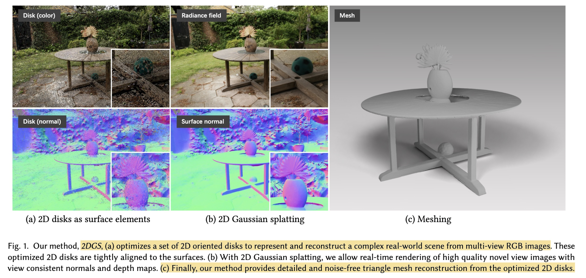
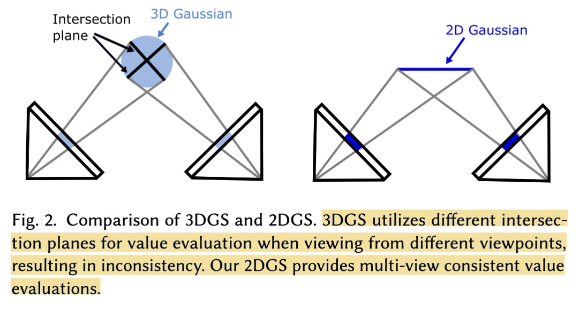
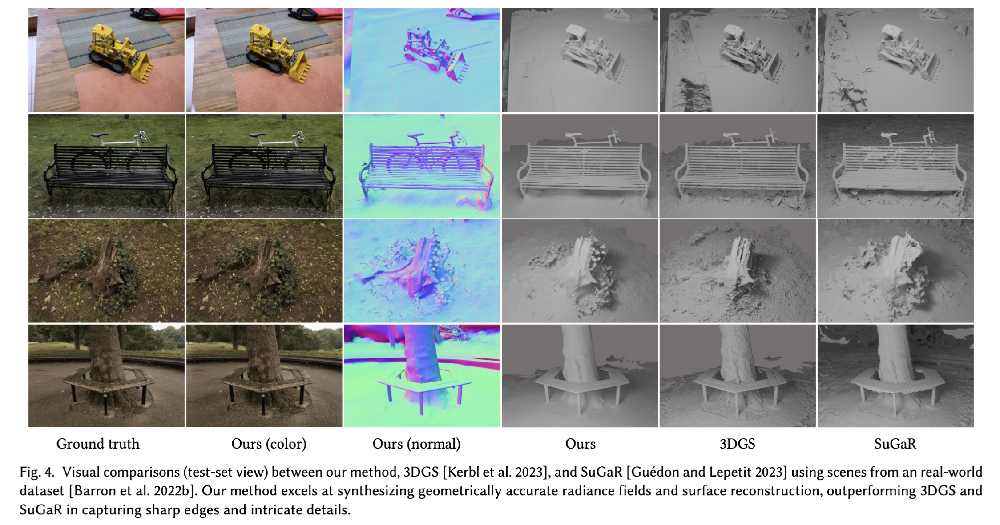

# 2D Gaussian Splatting for Geometrically Accurate Radiance Fields

## Introduction

- **Project**: https://surfsplatting.github.io
- **Code**: https://github.com/hbb1/2d-gaussian-splatting

This paper tackles a fundamental limitation of 3D Gaussian Splatting (3DGS): its failure to accurately represent surfaces due to the multi-view inconsistent nature of 3D Gaussians. The volumetric 3D Gaussian representation conflicts with the thin nature of actual surfaces, leading to noisy geometry reconstruction and view inconsistency.

The authors present 2D Gaussian Splatting (2DGS), which collapses the 3D volume into a set of 2D oriented planar Gaussian disks. Unlike 3D Gaussians that model complete angular radiance in a blob, 2D Gaussians provide view-consistent geometry while modeling surfaces intrinsically. Each 2D Gaussian disk is characterized by a center point, two tangential vectors, and scaling factors, with the surface normal inherently defined by the disk orientation.

The key innovation is a perspective-accurate 2D splatting process utilizing ray-splat intersection and rasterization, combined with depth distortion and normal consistency regularization terms. This enables noise-free and detailed geometry reconstruction while maintaining competitive appearance quality, fast training speed, and real-time rendering at 100+ FPS.

**Authors**:
- **Binbin Huang** (First Author) - ShanghaiTech University
- **Zehao Yu** - University of Tübingen & Tübingen AI Center
- **Anpei Chen** - University of Tübingen & Tübingen AI Center
- **Andreas Geiger** - University of Tübingen & Tübingen AI Center
- **Shenghua Gao** - ShanghaiTech University

**Keywords**: Novel View Synthesis, Radiance Fields, Surface Splatting, Surface Reconstruction, 3D Gaussian Splatting, Geometric Accuracy, Real-time Rendering

**Publication**: SIGGRAPH 2024

## Method

### Overview

The method represents 3D scenes using 2D Gaussian primitives embedded in 3D space, combined with a differentiable renderer that performs perspective-correct splatting:

1. **2D Gaussian Modeling**: Each primitive is a planar elliptical disk defined by a center point $p$, two orthogonal tangential vectors $t_u$ and $t_v$, and scaling factors $(s_u, s_v)$. The surface normal is inherently defined as $t_w = t_u × t_v$.

2. **Ray-Splat Intersection**: Instead of affine approximation used in 3DGS, the method computes explicit ray-splat intersection by finding the intersection of three non-parallel planes. This eliminates perspective distortion and numerical instability.

3. **Rasterization**: The 2D Gaussians are sorted by depth, organized into tiles, and integrated using volumetric alpha blending from front to back with perspective-correct weights.

4. **Regularized Optimization**: The model is optimized with photometric losses combined with two novel regularization terms for improved geometry.

### Training Data

The method uses standard Structure-from-Motion (SfM) derived from COLMAP[^1]:
- Multi-view RGB images with camera poses and intrinsics
- Sparse 3D point cloud for initialization
- No ground truth depth or geometry required

### Architecture Details

**2D Gaussian Parameterization**:
- Center position $p_k$ in world space
- Two tangential vectors $t_u$, $t_v$ (represented as rotation matrix R)
- Two scaling factors $(s_u, s_v)$ controlling variance along tangent directions
- Learnable opacity $\alpha$ and view-dependent appearance (spherical harmonics)
- Normal vector implicitly defined by disk orientation

**Perspective-Accurate Splatting**:
The key innovation is computing ray-splat intersection explicitly rather than using affine approximation. For each pixel ray, the method:
- Transforms two orthogonal planes (x-plane and y-plane) into local 2D Gaussian coordinates
- Solves for the intersection point (u, v) in tangent space using closed-form equations
- Evaluates Gaussian value and depth at intersection
- Handles degenerate cases with object-space low-pass filter

**Adaptive Densification**:
Following 3DGS[^2] adaptive control strategy:
- Growing: Add new Gaussians where gradients exceed threshold (0.0002)
- Pruning: Remove Gaussians with opacity below 0.05 every 3000 steps
- Gradients projected onto screen space for adaptive refinement

### Loss Functions

The training objective combines multiple terms:

1. **RGB Reconstruction Loss ($L_c$)**:
   - L1 loss for pixel-wise accuracy
   - D-SSIM term for structural similarity
   - Primary supervision signal

2. **Depth Distortion Loss ($L_d$)**:\
   $$L_d = \Sigma_{i,j} ω_i ω_j |z_i - z_j|$$
   - Concentrates 2D primitives along rays to the similar depth by minimizing distances between intersections
   - Encourages tight weight distribution similar to surface rendering
   - α = 1000 for bounded scenes, α = 100 for unbounded scenes

3. **Normal Consistency Loss ($L_n$)**:\
   $$L_n = \Sigma_i ω_i (1 - n_i^T N)$$
   - Aligns splat normals with depth map gradients
   - Ensures local surface alignment
   - N computed from finite differences of rendered depth
   - $\beta$ = 0.05 for all scenes

5. **Combined Objective**:\
   $$L = L_c + \alpha L_d + \beta L_n$$

### Mesh Extraction

- Render depth maps from training views using median depth (accumulated opacity = 0.5)
- Fuse depth maps using Truncated Signed Distance Fusion (TSDF) with Open3D[^3]
- Voxel size: 0.004, truncation threshold: 0.02
- Median depth proven more robust than expected depth for handling outliers

## Highlight

### Performance Metrics

**Rendering Speed**:
- Real-time rendering at **100+ FPS** on RTX 3090 GPU
- Maintains rendering speed comparable to 3DGS while providing accurate geometry

**Training Efficiency**:
- **5.5 minutes** for 15k iterations on DTU dataset (800×600 resolution)
- **10.9 minutes** for 30k iterations
- **100× faster** than SDF-based methods (NeuS, VolSDF, Neuralangelo require >12-24 hours)
- **>3× faster** than concurrent work SuGaR[^4] (~1 hour)

**Geometry Quality - DTU Dataset**:
- Average Chamfer Distance: **0.80** (30k iterations)
- Outperforms 3DGS[^2] (1.96), SuGaR[^4] (1.33), NeRF[^5] (1.49), VolSDF[^6] (0.86), NeuS[^7] (0.84)
- **State-of-the-art** geometry reconstruction among all explicit representations
- Competitive with implicit SDF methods while being orders of magnitude faster

**Geometry Quality - Tanks & Temples Dataset**:
- Mean F1 Score: **0.32**
- Best explicit method, significantly better than 3DGS[^2] (0.09) and SuGaR[^4] (0.19)
- Competitive with SDF methods: NeuS[^7] (0.38), Neuralangelo[^8] (0.50)
- Training time: **15.5 minutes** vs >24 hours for implicit methods

**Storage Efficiency**:
- Model size: **52 MB** on DTU dataset
- More compact than 3DGS (113 MB) and significantly smaller than SuGaR (1247 MB)

### Comparison Benchmarks

**Appearance Quality - Mip-NeRF 360 Dataset**:
- Outdoor scenes: PSNR 24.34, SSIM 0.717, LPIPS 0.246
- Indoor scenes: PSNR 30.40, SSIM 0.916, LPIPS 0.195
- Competitive with 3DGS and other state-of-the-art methods
- Maintains high-quality novel view synthesis while providing accurate geometry

**Key Visual Improvements**:
- Noise-free surface reconstruction with sharp edges and fine details
- View-consistent depth and normal maps
- Clean mesh extraction without floaters or artifacts
- Better handling of texture-less regions and thin structures

## Limitation

The authors discuss several limitations of their approach:

1. **Semi-transparent Surfaces**: The method assumes surfaces with full opacity and extracts meshes from multi-view depth maps. This poses challenges for accurately handling semi-transparent surfaces like glass, due to their complex light transmission properties.

2. **Densification Strategy**: The current densification strategy favors texture-rich over geometry-rich areas, occasionally leading to less accurate representations of fine geometric structures. A more effective densification strategy considering geometric features could mitigate this issue.

3. **Geometry-Appearance Trade-off**: The regularization terms involve a trade-off between image quality and geometry accuracy, potentially leading to over-smoothing in certain regions. Balancing these terms requires careful tuning.

4. **High-light Regions**: The method tends to create holes in areas with high light intensity due to the difficulty in modeling specular highlights with surface-based representation.

## Comments

[^1]: Schönberger & Frahm, "Structure-from-Motion Revisited", CVPR 2016.
[^2]: Kerbl et al., "3D Gaussian Splatting for Real-Time Radiance Field Rendering", SIGGRAPH 2023.
[^3]: Zhou et al., "Open3D: A Modern Library for 3D Data Processing", arXiv 2018.
[^4]: Guédon & Lepetit, "SuGaR: Surface-Aligned Gaussian Splatting for Efficient 3D Mesh Reconstruction and Editable Scenes", CVPR 2024.
[^5]: Mildenhall et al., "NeRF: Representing Scenes as Neural Radiance Fields for View Synthesis", ECCV 2020.
[^6]: Yariv et al., "Volume Rendering of Neural Implicit Surfaces", NeurIPS 2021.
[^7]: Wang et al., "NeuS: Learning Neural Implicit Surfaces by Volume Rendering for Multi-view Reconstruction", NeurIPS 2021.
[^8]: Li et al., "Neuralangelo: High-Fidelity Neural Surface Reconstruction", CVPR 2023.
