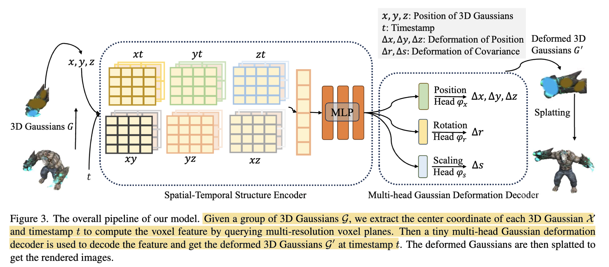
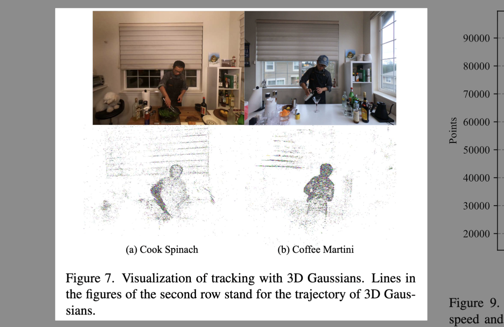

# 4D Gaussian Splatting for Real-Time Dynamic Scene Rendering

- **Authors:** Guanjun Wu, Wenming Yang, Luping Liu, Yuan Liu, Wenping Wang  
- **Affiliations:** University of Science and Technology of China, Texas A&M University  
- **Published:** arXiv:2310.08528 | CVPR 2024  
- **Keywords:** 3D Gaussian Splatting, Dynamic Scenes, Novel View Synthesis, Real-Time Rendering

---

## Pass 1 — Bird's-Eye View

### Five Cs

| C | Assessment |
|---|-----------|
| **Category** | System design / novel representation paper. Proposes a new method for novel view synthesis on dynamic scenes. |
| **Context** | Builds directly on 3D Gaussian Splatting (Kerbl et al. 2023). Borrows the HexPlane decomposition idea (Cao & Johnson, CVPR 2023) for efficient spatiotemporal feature encoding. Situates itself against NeRF-based dynamic methods (D-NeRF, HyperNeRF, TiNeuVox, K-Planes, HexPlane-NeRF, V4D). |
| **Correctness** | Assumptions are generally sound. The canonical-to-world mapping strategy is well-established in dynamic NeRF literature. The claim of "real-time" rendering is validated with concrete FPS numbers on a single RTX 3090. No obvious red flags, though the monocular setting caveat is honestly disclosed. The longest video is about 200 frames; longer videos cause a trade-off between time-encoding resolution and model size |
| **Contributions** | (1) A 4D-GS framework that deforms canonical Gaussians via a learned field rather than per-frame duplication. (2) A spatial-temporal structure encoder (HexPlane-inspired) to connect nearby Gaussians. (3) A multi-head Gaussian deformation decoder predicting ΔX, Δr, Δs per Gaussian. (4) State-of-the-art rendering quality at real-time speed (82 FPS @ 800×800) with extremely compact storage (18 MB). |
| **Clarity** | Well-written. The pipeline diagram (Fig. 3) and the comparison illustration (Fig. 2) are particularly clear. Minor notation overloading (G used for both a Gaussian function and the set of Gaussians). |

### 30-Second Summary

4D-GS extends 3D Gaussian Splatting to dynamic scenes by maintaining a single canonical set of 3D Gaussians and learning a tiny neural deformation field — a HexPlane spatial-temporal encoder plus a multi-head MLP decoder — that warps each Gaussian's position, rotation, and scale at any given timestep. At inference, the deformed Gaussians are directly splatted via the standard differentiable rasterizer. The result is real-time rendering (82 FPS at 800×800) with image quality that matches or beats prior NeRF-based dynamic methods that run at <3 FPS, while training in 8 minutes and storing in only 18 MB.

---

## Pass 2 — Careful Read

### Core Idea in One Sentence

Learn a compact spatiotemporal deformation field that bends a fixed set of canonical 3D Gaussians into the correct configuration at each frame, then splat them in real time.

### Method / Approach

- **Canonical Gaussian set**: A single collection of 3D Gaussians `G` (initialized from SfM points or random point clouds, then pre-trained with 3D-GS for 3000 warm-up iterations) represents the static scene substrate.
- **Spatial-Temporal Structure Encoder H**: Six 2D multi-resolution HexPlane grids `R_i(i,j)` covering all axis pairs {xy, xz, yz, xt, yt, zt}, plus a tiny MLP `φ_d`. For each Gaussian's center `X = (x,y,z)` at timestamp `t`, the feature `f_d = H(G,t)` is computed by bilinear interpolation on all 6 planes and concatenating the results.
- **Multi-head Gaussian Deformation Decoder D**: Three separate small MLPs (`φ_x`, `φ_r`, `φ_s`) predict position offset `ΔX`, rotation offset `Δr`, and scale offset `Δs` from `f_d`. The deformed Gaussian `G' = (X+ΔX, r+Δr, s+Δs, σ, c)` is then splatted using the standard differentiable 3D-GS rasterizer.
- **Loss**: L1 reconstruction loss + grid-based total variation regularization `L_tv` on the HexPlane features.

### Key Results

| Dataset | PSNR | SSIM | LPIPS | FPS | Storage | Train Time |
|---------|------|------|-------|-----|---------|-----------|
| Synthetic (D-NeRF, 800×800) | 34.05 | 0.98 | 0.02 | 82 | 18 MB | 8 min |
| HyperNeRF vrig (960×540) | 25.2 | 0.845 | — | 34 | 61 MB | 30 min |
| Neu3D (1352×1014) | 31.15 | 0.984 | 0.049 | 30 | 90 MB | 40 min |

Key takeaway: 4D-GS is fastest by a large margin (10–80× faster than nearest NeRF competitors) while often matching or exceeding their quality. On the synthetic dataset it beats all prior work on all metrics simultaneously.

### Strengths

- **Extreme speed-quality Pareto dominance**: No prior method comes close on the FPS axis while remaining competitive on PSNR/SSIM.
- **Minimal memory overhead**: The deformation field F adds only O(F) cost; the Gaussian set G is never duplicated per frame.
- **Honest ablations**: The ablation study (Table 4) cleanly isolates every component — HexPlane encoder, `φ_d` MLP, `φ_x`, `φ_r`, `φ_s` heads — showing each contributes.
- **Additional capabilities**: The explicit Gaussian representation naturally enables 3D tracking (Fig. 7) and scene composition/editing (Fig. 8, 10).
- **Canonical-to-world mapping**: Enables backward flow and differentiable tracking unlike canonical-space NeRF methods.

### Weaknesses / Open Questions

1. **Monocular large-motion failure**: With only one camera, the pose and time dimensions are both sparse; 4D-GS tends to overfit training views and fails novel-view synthesis (Fig. 14, 16).
2. **Large-scale/abrupt motion**: Broom sweeps and object entries/exits cause optimization instability (Fig. 16a,b).
3. **Joint static/dynamic separation**: Without supervision, splitting static Gaussians from dynamic ones is unreliable under monocular input.
4. **Urban-scale scalability**: Querying the HexPlane deformation field for very large numbers of Gaussians becomes expensive; no compact algorithm exists yet.
5. **Per-scene optimization**: Like all NeRF-style methods here, training is per-scene; no generalizable model.
6. **Video length**: The longest video is about 200 frames; longer videos cause a trade-off between time-encoding resolution and model size.

### References to Follow Up

1. **3D Gaussian Splatting** — Kerbl et al., SIGGRAPH 2023: The foundational method this paper extends; must-read.
2. **HexPlane** — Cao & Johnson, CVPR 2023: The spatiotemporal decomposition design the encoder is based on.
3. **K-Planes** — Fridovich-Keil et al., CVPR 2023: Very closely related decomposed-plane dynamic NeRF; major competitor.
4. **TiNeuVox** — Fang et al., SIGGRAPH Asia 2022: Fast dynamic NeRF with time-aware voxels; key speed baseline.
5. **D-NeRF** — Pumarola et al., CVPR 2021: Provides the canonical deformation paradigm and the synthetic benchmark used throughout.

---

## Pass 3 — Virtual Re-implementation

### Detailed Technical Summary

**Representation.** The scene at any time `t` is described by deformed Gaussians `G' = {G'_i}`. Each `G'_i` has: position `X' ∈ ℝ³`, color (SH coefficients) `C ∈ ℝ^k`, opacity `α ∈ ℝ`, rotation quaternion `r' ∈ ℝ⁴`, scale `s' ∈ ℝ³`. The canonical set `G = {G_i}` is shared across all timestamps.

**Rendering pipeline (inference):**
1. For timestamp `t`, query `H(G, t)` → feature `f_d` per Gaussian.
2. Decode: `ΔX = φ_x(f_d)`, `Δr = φ_r(f_d)`, `Δs = φ_s(f_d)`.
3. Compute `G' = (X+ΔX, r+Δr, s+Δs, σ, C)`.
4. Project `G'` into camera space: covariance `Σ' = JWΣWᵀJᵀ`.
5. Sort by depth, alpha-composite: `C̃ = Σ c_i α_i Π_{j<i}(1−α_j)`.

**Spatial-Temporal Structure Encoder (H).** HexPlane-inspired: 6 axis-pair planes at multiple resolutions (base resolution 64×64, upsampled by factor 2, hidden dim `h`). For a query `(X, t)`:
- For each plane `R_l(i,j)`, bilinear interpolate at the projected 2D coordinate.
- Concatenate all 6 plane features → `f_h ∈ ℝ^{6×h×N_l}`.
- Pass through shallow MLP `φ_d` → `f_d ∈ ℝ^hidden`.

The K-Planes trick is used: 4D voxels are decomposed into `C(4,2) = 6` 2D planes, drastically reducing memory from O(N⁴) to O(6N²).

**Multi-head Deformation Decoder (D).** Three independent tiny MLPs. The separation of heads is important: `φ_x` models large translation, `φ_r` models rotation (human joint bending), `φ_s` models scaling (stretching). Ablation (Table 4) shows removing `φ_r` hurts most, confirming rotation modeling is critical for articulated bodies.

**Optimization:**
- Initialize: 3D-GS applied to the first frame for 3000 iterations. This gives `G`.
- Train: Optimize `G` and `F` jointly — 20,000 iterations (D-NeRF), 8000 (HyperNeRF), 14,000 (Neu3D). PyTorch, single RTX 3090.
- Batch size = 1. No opacity reset (unlike standard 3D-GS). Pruning at 8000 iterations.
- Loss: `L = |Ĩ − I| + λ L_tv`, where `λ = 0` initially, then turned on.
- Learning rate for field: `1.6×10⁻³` decaying to `1.6×10⁻⁵`. Decoder MLP: `1.6×10⁻⁴`.

**Rendering speed analysis (Fig. 9).** Speed scales roughly inversely with Gaussian count. Below ~30,000 Gaussians, up to 90 FPS. The deformation field query is the bottleneck for large Gaussian counts.

### Hidden Assumptions

1. **Smooth motions**: The HexPlane encoder interpolates spatiotemporally, implicitly assuming motion is smooth and locally consistent. Large discontinuous motions (object entries/exits) violate this.
2. **Shared canonical**: All dynamic content must be representable as deformations of a single canonical configuration. Topology changes (object appearing/disappearing) are handled poorly.
3. **Multi-view or near-dense coverage**: Works well when camera coverage is dense (Neu3D: 15–20 cameras). Monocular settings expose ambiguity between depth and temporal deformation.
4. **Static background implicitly separated**: Without explicit supervision, static Gaussians should predict `ΔX ≈ 0`, but this is not enforced.
5. **Differentiable rasterization correctness**: Assumes Gaussians are roughly sorted correctly by depth — large deformations can break depth ordering.

### Reproducibility Notes

- **Code**: Available at `https://guanjunwu.github.io/4dgs/`
- **Framework**: PyTorch, single RTX 3090 GPU
- **Datasets**: D-NeRF (synthetic, public), HyperNeRF vrig (public), Neu3D/DyNeRF (public)
- **Key hyperparameters**: HexPlane resolution 64×64 (upsampled ×2), hidden dim h=64, N=4 K-Planes modules, decoder MLP tiny (width in released code), total variation weight `λ`
- **Non-obvious detail**: Opacity reset from 3D-GS is disabled; the paper finds no benefit for dynamic scenes
- **Missing detail**: Exact MLP depth/width for `φ_x`, `φ_r`, `φ_s` — check the released code to reproduce exactly

### Ideas for Future Work

1. **Generalizable 4D-GS**: Train across scenes so at inference you feed a video clip and get a 4D-GS representation without per-scene optimization.
2. **Monocular robustness**: Incorporate optical flow, depth priors, or geometric regularization to resolve the monocular depth-time ambiguity.
3. **Topology-aware dynamics**: Handle Gaussian birth/death for objects entering/leaving the frame — perhaps with a dynamic Gaussian spawning mechanism.
4. **Streaming / online**: Combine with online 3D-GS updates for live video feeds.
5. **Compression of the deformation field**: Quantizing the HexPlane grids could enable mobile deployment.

---

## Pass 4 — Modern Perspective Review (as of June 2026)

### What Has Changed Since Publication

- **3D-GS has exploded**: Hundreds of follow-on papers extend 3D-GS to dynamics, generalization, large scenes, and 3D generation. The 4D-GS deformation-field paradigm became one of two dominant approaches (the other: per-frame Gaussian optimization or 4D spacetime Gaussians).
- **Near-concurrent competition**: Spacetime Gaussians (Li et al. 2023) and Deformable3DGS (Yang et al. 2023) appeared simultaneously with similar ideas, immediately creating a crowded field.
- **Evaluation standards**: The community has converged on D-NeRF synthetic + Neu3D + HyperNeRF as standard benchmarks — 4D-GS helped establish this norm.
- **Monocular dynamic reconstruction**: Subsequent work (Gaussian Flow, SC-GS, MonST3R) has addressed the monocular limitation 4D-GS honestly flagged.

### Has the Community Accepted the Claims?

Yes. The real-time rendering claim has been validated and widely cited. The HexPlane + deformation decoder architecture has been adopted or extended by numerous follow-on works. The paper has become a canonical baseline every subsequent dynamic 3D-GS paper must compare against.

---

### Comparison Papers

#### Predecessors (papers 4D-GS builds on directly)

| Paper | Authors | Year | Relation |
|-------|---------|------|----------|
| **3D Gaussian Splatting for Real-Time Radiance Field Rendering** | Kerbl et al. | SIGGRAPH 2023 | The base explicit representation and differentiable rasterizer 4D-GS extends |
| **HexPlane: A Fast Representation for Dynamic Scenes** | Cao & Johnson | CVPR 2023 | The spatiotemporal feature decomposition that inspires the encoder |
| **K-Planes: Explicit Radiance Fields in Space, Time, and Appearance** | Fridovich-Keil et al. | CVPR 2023 | Multi-resolution plane decomposition strategy adopted for the voxel encoder |
| **D-NeRF: Neural Radiance Fields for Dynamic Scenes** | Pumarola et al. | CVPR 2021 | Established the canonical deformation paradigm and the primary synthetic benchmark |

#### Contemporaries / Competitors

| Paper | Authors | Year | Relation |
|-------|---------|------|----------|
| **Deformable 3D Gaussians for High-Fidelity Monocular Dynamic Scene Reconstruction** | Yang et al. | 2023 | Concurrent work; same deformation-field idea with slightly different architecture; direct competitor |
| **Spacetime Gaussian Feature Splatting for Real-Time Dynamic View Synthesis** | Li et al. | 2023 | Concurrent; places time directly in Gaussian attributes rather than a deformation field |
| **TiNeuVox: Fast Dynamic Radiance Fields with Time-Aware Neural Voxels** | Fang et al. | SIGGRAPH Asia 2022 | Prior fast dynamic NeRF; the main speed baseline 4D-GS beats |
| **Dynamic3DGS: Tracking Everything Everywhere** | Luiten et al. | 3DV 2024 | Per-frame Gaussian optimization approach; better for tracking but much higher memory |

#### Successors / Extensions

| Paper | Authors | Year | Relation |
|-------|---------|------|----------|
| **SC-GS: Sparse-Controlled Gaussian Splatting for Editable Dynamic Scenes** | Huang et al. | CVPR 2024 | Adds sparse control points to improve large-motion handling — directly addresses 4D-GS's main limitation |
| **Gaussian Flow: 4D Reconstruction with Particle-Based Optical Flow** | — | 2024 | Uses optical flow regularization to fix monocular limitations of 4D-GS |
| **Street Gaussians** | Yan et al. | ECCV 2024 | Applies compositional Gaussians to autonomous driving; uses a simpler 4D SH trick instead of a deformation network, and achieves far faster rendering on urban scenes |
| **4DRotorGS / 4D-GS variants** | various | 2024 | Further refine rotation deformation modeling or extend to large-scale scenes |

---

### Bottom Line

4D-GS is a **foundational paper** worth reading. It was the first work to convincingly demonstrate real-time dynamic novel view synthesis with quality competitive with (and often surpassing) slow NeRF-based methods, achieving a 30–80× speedup. The HexPlane + deformation decoder design is clean, well-motivated, and the paper is honest about its limitations. It has become the canonical baseline that every subsequent dynamic 3D-GS paper must compare against.

The core ideas — canonical Gaussians + neural deformation field + HexPlane encoder — remain highly relevant and are directly used or extended in most current work on dynamic 3D scenes. It is not superseded; it is the foundation.
