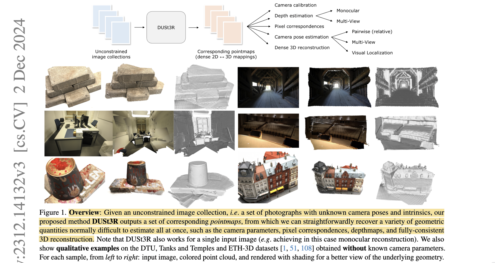
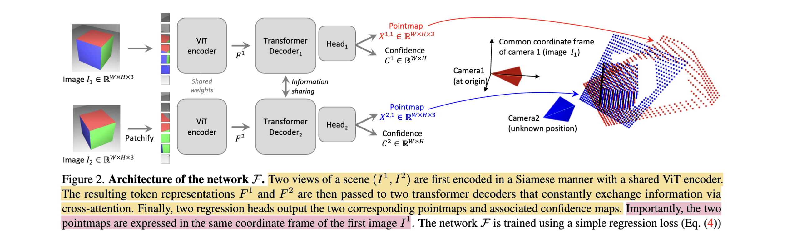

# DUSt3R: Geometric 3D Vision Made Easy

- **Authors:** Shuzhe Wang, Vincent Leroy, Yohann Cabon, Boris Chidlovskii, Jerome Revaud
- **Affiliations:** Aalto University (Wang); Naver Labs Europe (Leroy, Cabon, Chidlovskii, Revaud)
- **Published:** CVPR 2024; arXiv 2312.14132, December 2023
- **Keywords:** 3D reconstruction, pointmap, multi-view stereo, camera pose estimation, dense prediction, ViT, CroCo
- **Webpage:** https://dust3r.europe.naverlabs.com/
- **GitHub:** https://github.com/naver/dust3r
- **HuggingFace:** https://huggingface.co/naver/DUSt3R_ViTLarge_BaseDecoder_512_dpt

---

## Pass 1 — Bird's-Eye View

### Five Cs

| C | Assessment |
|---|-----------|
| **Category** | Dense 3D reconstruction / geometry estimation; supervised feed-forward regression |
| **Context** | Builds on CroCo cross-view completion pretraining; uses ViT encoder + DPT[^1] head; motivated by the fragility and complexity of traditional SfM pipelines (COLMAP) that require calibrated cameras, separate matching, and sequential bundle adjustment |
| **Correctness** | Assumptions appear valid: pointmaps are a natural, camera-agnostic 3D representation; the global alignment step is principled (Weiszfeld/gradient-descent in 3D). The claim that 3D regression is easier than 2D matching is empirically supported but theoretically informal |
| **Contributions** | (1) Pointmap representation as a unified 3D output target; (2) DUSt3R pairwise network that jointly estimates two pointmaps and confidence maps for any uncalibrated image pair; (3) global alignment procedure extending pairwise estimates to consistent N-view reconstructions; (4) SOTA results on multi-view pose, monocular depth, MVS[^2], and visual localization |
| **Clarity** | Clearly written; the pointmap concept is introduced early and consistently used throughout; good ablations; appendix covers training details and extended experiments |

### 30-Second Summary



DUSt3R replaces the classical SfM pipeline (feature detection → matching → relative pose → bundle adjustment) with a single end-to-end network that takes any pair of uncalibrated images and directly regresses two dense pointmaps — per-pixel 3D coordinate fields expressed in the first camera's frame. A Siamese ViT-Large encoder processes both images independently; two cross-attention decoders fuse their tokens; DPT heads produce the pointmaps and per-pixel confidence scores. For N images, all pairwise outputs are fused by a differentiable global alignment step that minimizes 3D projection error. The model handles arbitrary baselines, unknown intrinsics, and diverse scene types, outperforming COLMAP and learned competitors on CO3Dv2, KITTI, and ETH3D without ever being given camera parameters.

---

## Pass 2 — Careful Read

### Core Idea in One Sentence

Given any pair of uncalibrated images, DUSt3R directly regresses two dense per-pixel pointmaps (3D coordinates in the first camera's frame) via a transformer network, then extends to N views by global alignment of overlapping pairwise estimates.

### Method / Approach



- **Pointmap as scene representation**: A pointmap $X \in R^{W \times H \times 3}$ assigns a 3D world coordinate to every pixel. DUSt3R predicts $X^{1,1}$ (image-1 pixels in frame 1) and $X^{2,1}$ (image-2 pixels, also in frame 1) together with confidence maps $C^{1,1}$ and $C^{2,1}$ . This representation implicitly encodes depth, camera intrinsics, and relative pose without ever parameterizing them explicitly.
- **Architecture (Siamese encoder + cross-decoder)**: A shared ViT-Large encoder independently tokenizes each image into patch embeddings. Two ViT-Base decoders each process one view's tokens while cross-attending to the other view's encoder output, enabling joint geometric reasoning. A DPT head then densely upsamples each decoder output into full-resolution pointmap and confidence predictions.
- **Confidence-aware loss**: Training uses scale-normalized Euclidean distance on pointmaps weighted by a learned confidence $C_i$ , with an entropy term to prevent collapse: $L_{conf} = \sum_i C_i \cdot \ell_{regr}(i) - \alpha \log C_i$ where $\ell_{regr}$ is the 3D distance normalized by the mean ground-truth depth.
- **Global alignment for N views**: With N images, DUSt3R runs inference on all pairwise (or spanning-tree-selected) combinations. Global 3D coordinates and per-pair rigid transforms are then jointly optimized by minimizing confidence-weighted 3D projection error via gradient descent, yielding a consistent world-space point cloud.

### Key Results

| Benchmark | Metric | DUSt3R 512 | Best baseline |
|---|---|---|---|
| CO3Dv2 (10 frames) | mAA@30 | **76.7** | 66.5 (PoseDiffusion) |
| RealEstate10K (10 frames) | mAA@30 | **67.7** | 49.4 (PixSfM) |
| KITTI | Abs-Rel ↓ | **0.058** | 0.060 (MonoDepth2) |
| ETH3D (stereo) | bad-1px ↓ | **0.18** | 0.19 (CasMVSNet) |
| 7-Scenes (visual loc.) | Median trans (cm) | 3–6 | 1–2 (SACReg, w/ model) |

Ablation highlights:
- Removing confidence weighting drops CO3Dv2 mAA@30 by ~4 points.
- Linear head vs DPT head: DPT improves all dense tasks; linear head sufficient for pose.
- Cross-attention is critical — without it, network degenerates to monocular depth.
- Training on 8 mixed datasets is essential; any single dataset is insufficient.

### Strengths

- **Camera-agnostic**: No intrinsics or extrinsics needed at inference; all 3D geometry is implicit in the pointmap.
- **Single forward pass**: Relative pose, depth, intrinsics, and dense point cloud all fall out of one unified output.
- **Handles wide baselines**: Opposed viewpoints (~180°) that break feature matchers work well.
- **Scalable to N views**: Global alignment extends the pairwise model gracefully; no retraining needed.
- **Strong generalization**: Trained on 8 heterogeneous datasets covering indoor/outdoor/synthetic/object-centric; zero-shot to RealEstate10K.

### Weaknesses / Open Questions

1. **Quadratic pair complexity**: Global alignment requires $O(N^2)$ pairwise inference, or at minimum $O(N)$ pairs from a spanning tree — expensive for large collections.
2. **Scale ambiguity persists**: Each pairwise estimate is scale-free; global alignment recovers only up-to-scale reconstruction unless metric depth is available.
3. **No explicit camera model**: Intrinsics are recoverable but not directly supervised; accuracy degrades for highly non-central or fisheye cameras.
4. **Static scene assumption**: Dynamic objects create inconsistent pointmaps across pairs; no explicit handling of moving content.
5. **Memory bound**: Full DPT head at 512px requires substantial GPU memory for long sequences.

### References to Follow Up

1. **CroCo: Self-Supervised Pre-Training for 3D Vision Tasks by Masking Cross-View Context** — Weinzaepfel et al., NeurIPS 2022: the cross-view completion pretraining that DUSt3R's encoder and decoder are initialized from; understanding CroCo is essential to understanding DUSt3R's design.
2. **Vision Transformers for Dense Prediction (DPT)** — Ranftl et al., ICCV 2021: the DPT head architecture used for dense upsampling from ViT tokens to full-resolution predictions.
3. **LoFTR: Detector-Free Local Feature Matching with Transformers** — Sun et al., CVPR 2021: contemporary dense matcher using cross-attention transformers, the matching-based paradigm that DUSt3R seeks to bypass.
4. **MASt3R: Grounding Image Matching in 3D** — Leroy et al., 2024: the direct successor that adds matching-aware features to DUSt3R, substantially improving visual localization accuracy.
5. **Structure-from-Motion Revisited** — Schönberger & Frahm, CVPR 2016: the COLMAP pipeline that DUSt3R most directly competes against; important for understanding what the paper replaces.

---

## Pass 3 — Virtual Re-implementation

### Detailed Technical Summary

**Pointmap representation.** The central innovation is representing scene geometry as a *pointmap* $X \in R^{W \times H \times 3}$ , a dense 2D field where each pixel $(i,j)$ stores a 3D point. For a pair of images $(I^1, I^2)$ , DUSt3R outputs four maps: $X^{1,1}$ (image 1 in frame 1), $X^{2,1}$ (image 2 in frame 1), and confidence maps $C^{1,1}, C^{2,1} \in R^{W \times H}$ . The superscripts denote (view, reference frame). Because both pointmaps share the same reference frame, the relative pose $(R, t)$ between the two cameras is implicitly encoded in the difference between $X^{1,1}$ and $X^{2,1}$ without ever being predicted as a 6-DoF vector.

Concretely, ground-truth pointmaps are derived from depth maps and ground-truth poses:

```math
\bar{X}^{1,1} = K_1^{-1} ([U; V; 1] \cdot D_1)
```

```math
\bar{X}^{2,1} = P_1 P_2^{-1} h\bigl(K_2^{-1}([U; V; 1] \cdot D_2)\bigr)
```

where $U, V$ are pixel coordinate grids, $h(\cdot)$ lifts to homogeneous coordinates, and $P_1, P_2$ are world-to-camera poses. Depth at pixel $(i,j)$ of image 1 is simply $X^{1,1}_{i,j,2}$ (the z-component in frame 1).

**Architecture.** The encoder is a ViT-Large (24 layers, patch size 16) with shared weights applied independently to each image — a Siamese design. Each image is tokenized into $L = (W/16) \times (H/16)$ patch tokens with positional embeddings.

The decoder consists of two ViT-Base blocks (12 layers each) with *asymmetric cross-attention*: each decoder processes tokens from its own view while attending to encoder tokens from the *other* view. This bi-directional cross-view attention is the geometric reasoning core — it allows the network to find correspondences and triangulate implicitly.

A shared DPT (Dense Prediction Transformer) head upsamples each decoder's token sequence to full resolution using skip connections from multiple decoder layers, similar to U-Net fusion. The head outputs a 3-channel (XYZ) pointmap and a 1-channel confidence map per view.

All weights are initialized from CroCo v2 pretrained weights. This is critical: CroCo's cross-view completion task already teaches the decoder to reason geometrically about 3D relationships.

**Loss function.** The regression target is scale-normalized to remove the trivial scale degree of freedom. For ground-truth pointmap $\bar{X}^v$ with mean depth $\bar{z}^v = \frac{1}{|V|}\sum_i \|\bar{X}^v_i\|$ , the regression loss is:

```math
\ell_{regr}(v, i) = \left\| \frac{X^{v,1}_i}{\bar{z}} - \frac{\bar{X}^{v,1}_i}{\bar{z}} \right\|
```

The full confidence-weighted loss combines regression and an entropy regularizer:

```math
L_{conf}^v = \frac{1}{|V|} \sum_{i \in V} C_i^v \cdot \ell_{regr}(v, i) - \alpha \log C_i^v
```

with $\alpha = 0.2$ balancing the entropy term. The total loss sums over both views: $L = L_{conf}^1 + L_{conf}^2$ . High-confidence pixels must regress accurately (first term), while the log term prevents the network from trivially setting all confidence to 0. The result is that $C_i^v \approx 1/\ell_{regr}$ in optimal conditions — a learned inverse error.

**Downstream: pose and intrinsics recovery.** Given predicted pointmaps $(X^{1,1}, X^{2,1})$ , the relative rotation and translation are recovered via:

1. **Procrustes alignment**: align pixel-ray directions in image 1's coordinate system to those in the predicted $X^{2,1}$ — yields $R$ and $t$ up to scale.
2. **PnP + RANSAC**: use 2D pixel coordinates and corresponding 3D points from $X^{2,1}$ to solve for the second camera's extrinsics via EPnP.
3. **Focal length**: assuming a centered pinhole model, the focal length $f$ satisfies $X_{i,j}^{1,1} = f^{-1}[u - c_x; v - c_y; 1] \cdot d_{i,j}$ — can be recovered in closed form via a 1D scan or linear regression over visible pixels.

**Global alignment for N views.** For a set of N images, DUSt3R generates estimates for all $N(N-1)/2$ pairs (or a spanning-tree subset for efficiency). Each pair $e = (v_1, v_2)$ produces pointmaps $X^{v_1, e}$ and $X^{v_2, e}$ (in the local frame of $v_1$ for pair $e$).

Global 3D points $\chi_i^v$ are introduced for every pixel, and per-pair rigid transforms $P_e \in SE(3)$ and scales $\sigma_e > 0$ are optimized jointly:

```math
\min_{P_e, \chi, \sigma_e} \sum_{e,v,i} C_i^{v,e} \left\| \chi_i^v - \sigma_e P_e X_i^{v,e} \right\|
```

This is minimized with AdamW gradient descent, treating $P_e$ in the Lie algebra of $SO(3) \times R^3$ . The scale $\sigma_e$ corrects for the per-pair scale ambiguity. After convergence, camera poses are extracted from the $P_e$ values and the fused point cloud from the $\chi_i^v$ variables.

**Training curriculum.** Three stages:

| Stage | Resolution | Head | Epochs | Pairs/epoch |
|---|---|---|---|---|
| 1 | 224×224 | Linear | 50 | 700k |
| 2 | 512px (multi-aspect) | Linear | 100 | 70k |
| 3 | 512px (multi-aspect) | DPT | 90 | 70k |

Training data: 8.5M pairs from 8 datasets (Habitat 1M, ARKitScenes 2M, MegaDepth 1.8M, Blended MVS 1.1M, Waymo 1.1M, CO3Dv2 941k, Static Scenes 3D 337k, ScanNet++ 224k). AdamW, lr=1e-4, cosine decay, batch 128→64→64, initialized from CroCo v2.

### Datasets

#### Train Data

| Name | Usage |
|---|---|
| Habitat | supervised geometry training |
| MegaDepth | supervised geometry training |
| ARKitScenes | supervised geometry training |
| Static Scenes 3D | supervised geometry training |
| BlendedMVS | supervised geometry training |
| ScanNet++ | supervised geometry training |
| Co3D-v2 | supervised geometry training |
| Waymo Open Dataset | supervised geometry training. |

#### Evaluation/Validation Data

| Name | Usage |
|---|---|
| 7Scenes | visual localization |
| Cambridge Landmarks | visual localization |
| Co3D-v2 | multi-view pose estimation |
| RealEstate10K | multi-view pose estimation |
| DDAD | monocular depth |
| KITTI | monocular depth |
| NYUv2 | monocular depth |
| BONN | monocular depth |
| TUM RGB-D | monocular depth |
| DTU | multi-view reconstruction |
| Tanks and Temples | multi-view reconstruction |
| ETH3D | multi-view reconstruction. |

### Hidden Assumptions

1. **Centered principal point**: Focal recovery and the coordinate mapping assume the principal point is at the image center. The paper acknowledges this but shows it has little practical effect.
2. **Static scene**: Both views must depict the same rigid scene; dynamic content is not handled and introduces cross-view inconsistencies.
3. **Enough overlap**: The cross-attention mechanism implicitly requires at least some visual overlap between the pair; pure opposite-view pairs with no shared content may fail.
4. **Scale-consistent training data**: The confidence-weighted scale normalization works only if depth ground truth has consistent units across datasets. The per-pair scale factor $\sigma_e$ in global alignment compensates partially, but dataset scale inconsistencies could affect the loss.
5. **Spanning tree is sufficient**: For global alignment, using only a spanning tree of pairs (rather than all pairs) assumes overlapping pairs provide enough connectivity. This breaks if the overlap graph is sparse.

### Reproducibility Notes

- **Code**: Open-sourced at https://github.com/naver/dust3r (MIT license); inference and demo code available.
- **Weights**: ViT-Large + DPT 512px model on HuggingFace (`naver/DUSt3R_ViTLarge_BaseDecoder_512_dpt`).
- **Data**: 5 of 8 training datasets are publicly available (Habitat, MegaDepth, BlendedMVS, ScanNet++, CO3Dv2). ARKitScenes and Static Scenes 3D require separate downloads. Waymo requires a license agreement.
- **Compute**: Not explicitly stated in the paper; estimated from curriculum (50+100+90 epochs) and batch sizes — likely several hundred GPU-hours on A100s.
- **Missing details**: The exact pair-sampling strategy (how pairs are selected within each dataset, whether symmetrically augmented pairs are counted double) is partially described but not fully specified.

### Ideas for Future Work

1. **Efficient N-view scaling**: Replace $O(N^2)$ pairwise inference with a token-based N-view architecture (this is what VGGT does with alternating attention).
2. **Dynamic scene handling**: Add a dynamic/static segmentation mask or a per-pixel rigidity confidence to handle moving objects in the cross-attention and global alignment.
3. **Metric scale from monocular cues**: Incorporate absolute-scale training data (e.g., with known gravity direction or IMU) to recover metric reconstruction without scale ambiguity.
4. **Uncertainty-aware localization**: Use the confidence maps more directly in the visual localization pipeline — weight PnP hypotheses by pointmap confidence rather than treating all pixels equally.
5. **Streaming / online global alignment**: Instead of batch alignment, develop an incremental online variant that processes frames sequentially, enabling video streams without quadratic memory.

---

## Pass 4 — Modern Perspective Review (as of July 2026)

### What Has Changed Since Publication

- **N-view feed-forward reconstruction** has become standard: VGGT (CVPR 2025 Best Paper) processes N images in a single pass with alternating attention, avoiding the quadratic pair complexity entirely; Fast3R extends this to 1000+ images via tensor parallelism.
- **Tracking integration**: CUT3R adds persistent recurrent state; VGGT integrates point tracking (CoTracker2) into the same network as depth/pose, producing a richer multi-task output.
- **Matching-aware features**: MASt3R (2024) extended DUSt3R with local feature heads, substantially improving visual localization — showing that pointmaps alone are insufficient for highly precise correspondence tasks.
- **Community scaling**: DUSt3R's 8.5M training pairs have been dwarfed by successors using tens of millions of pairs across more diverse scenes.
- **Evaluation benchmarks**: IMC PhotoTourism and Map-free Relocalization have emerged as additional standards for comparing 3D reconstruction pipelines.

### Has the Community Accepted the Claims?

DUSt3R's core claim — that 3D reconstruction can be recast as pointmap regression without explicit camera parameterization — has been broadly validated and adopted. MASt3R, VGGT, Fast3R, and CUT3R all use pointmap regression as their foundational output representation, differing mainly in how they extend the two-view model to N views. The confidence-aware loss has similarly propagated to all successors. The global alignment procedure, while principled, has been mostly supplanted by direct N-view feed-forward architectures that do not require the quadratic inference step. DUSt3R thus occupies the role of the paradigm-defining paper in this line: the specific model is superseded, but the ideas are foundational.

---

### Comparison Papers

#### Predecessors

| Paper | Authors | Year | Relation |
|---|---|---|---|
| CroCo: Self-Supervised Pre-Training for 3D Vision Tasks by Masking Cross-View Context | Weinzaepfel et al. | 2022 | Encoder/decoder initialization; cross-view completion pretraining paradigm |
| An Image is Worth 16x16 Words: Transformers for Image Recognition at Scale (ViT) | Dosovitskiy et al. | 2021 | ViT-Large encoder backbone |
| Vision Transformers for Dense Prediction (DPT) | Ranftl et al. | 2021 | DPT dense prediction head for upsampling tokens to full resolution |
| Structure-from-Motion Revisited (COLMAP) | Schönberger & Frahm | 2016 | Classical SfM pipeline baseline; primary competitor in multi-view tasks |
| SuperGlue: Learning Feature Matching with Graph Neural Networks | Sarlin et al. | 2020 | Feature-matching baseline; DUSt3R seeks to replace this step |
| MegaDepth: Learning Single-View Depth Prediction from Internet Photos | Li & Snavely | 2018 | Training dataset; demonstrates internet-photo-based depth learning |

#### Contemporaries / Competitors

| Paper | Authors | Year | Relation |
|---|---|---|---|
| PoseDiffusion: Solving Structure-from-Motion via Diffusion | Wang et al. | 2023 | Diffusion-based N-view camera pose estimation; compared directly in CO3Dv2 and RealEstate10K |
| PixSfM: Pixel-Perfect Structure-from-Motion with Featuremetric Refinement | Lindenberger et al. | 2021 | Feature-metric SfM pipeline; compared in visual localization benchmarks |
| RelPose: Predicting Probabilistic Multi-Object 3D Relationships from a Single Image | Zhang et al. | 2022 | Pairwise relative pose regression; weaker baseline on CO3Dv2 |

#### Successors / Extensions

| Paper | Authors | Year | Relation |
|---|---|---|---|
| MASt3R: Grounding Image Matching in 3D | Leroy et al. | 2024 | Extends DUSt3R with matching-aware local feature heads; substantially better localization (from knowledge graph) |
| [VGGT: Visual Geometry Grounded Transformer](../../2025/VGGT-_Visual_Geometry_Grounded_Transformer/) | Wang et al. | 2025 | N-view feed-forward successor; alternating attention; CVPR 2025 Best Paper (from knowledge graph) |
| Fast3R: Towards 3D Reconstruction of 1000+ Images in One Forward Pass | Yang et al. | 2025 | N-view scaling via tensor parallelism; concurrent with VGGT (from knowledge graph) |
| CUT3R: Continuous 3D Perception with Persistent State | Chen et al. | 2025 | Recurrent state variant for video streams; removes the per-pair inference requirement (from knowledge graph) |

---

### Bottom Line

DUSt3R is essential reading for anyone working in 3D reconstruction, camera pose estimation, or multi-view geometry. It defines the pointmap regression paradigm that now underpins an entire generation of feed-forward reconstruction systems. The specific network architecture and global alignment procedure have been surpassed by VGGT and MASt3R, but the conceptual contribution — unifying depth, camera, and correspondence estimation into a single regression target — remains the defining idea of this research line. Read it as the foundational paper before reading any of its successors.

---

[^1]: **DPT** — Dense Prediction Transformer. See the [glossary](../../common/terms/).
[^2]: **MVS** — Multi-View Stereo. See the [glossary](../../common/terms/).
