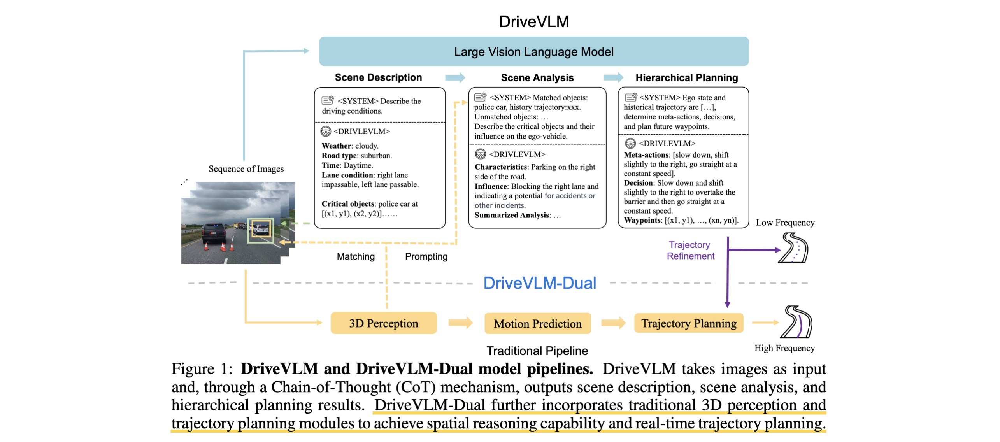
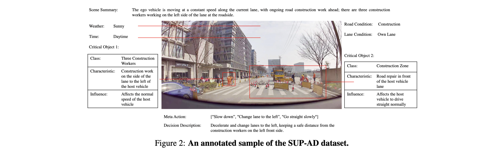
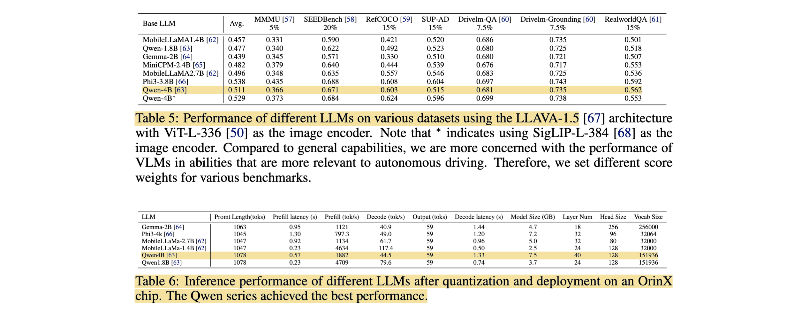
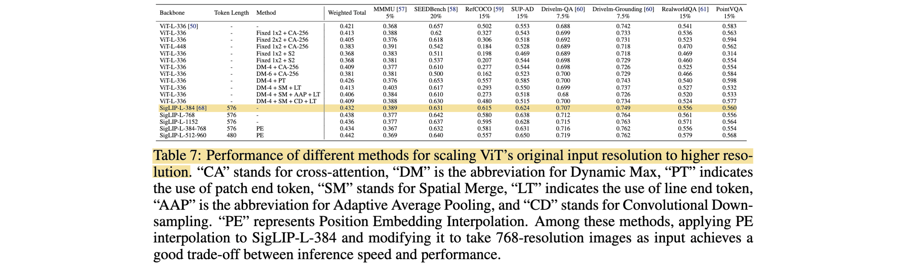
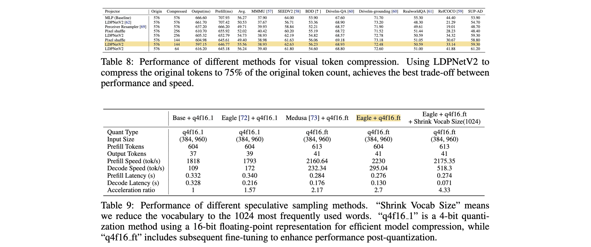

# DriveVLM: The Convergence of Autonomous Driving and Large Vision-Language Models

- **Authors:** Xiaoyu Tian, Junru Gu, Bailin Li, Yicheng Liu, Yang Wang, Zhiyong Zhao, Kun Zhan, Peng Jia, Xianpeng Lang, Hang Zhao
- **Affiliations:** IIIS, Tsinghua University; Li Auto
- **Published:** CoRL 2024 (arXiv:2402.12289)
- **Keywords:** autonomous driving, vision-language model, chain-of-thought, hierarchical planning, dual system, slow-fast, long-tail scenarios, nuScenes
- **Webpage:** https://tsinghua-mars-lab.github.io/DriveVLM/
- **GitHub:** https://github.com/Tsinghua-MARS-Lab/DriveVLM

---



## Pass 1 — Bird's-Eye View

| C | Assessment |
|---|-----------|
| **Category** | A system/architecture paper applying a large Vision-Language Model (VLM) to autonomous driving, plus a hybrid "dual" deployment system. Also contributes a task, dataset, and metrics. |
| **Context** | Builds on VLMs (GPT-4V, LLaVA, Qwen-VL), learning-based planning (UniAD, VAD, ST-P3), and driving-caption datasets (Talk2Car, DriveLM-style QA). Positioned against traditional perception→prediction→planning pipelines that handle geometry well but fail on long-tail semantics and decision-level reasoning. |
| **Correctness** | Sound and pragmatic. The core claim — a VLM's chain-of-thought[^1] reasoning helps understand complex/long-tail scenes and produce interpretable plans, while a paired traditional pipeline supplies spatial grounding and real-time speed — is supported on nuScenes and the in-house SUP-AD dataset, plus a real production-vehicle deployment. Caveat: the nuScenes open-loop L2/collision metric it reports SOTA on is now known to be weak/ego-status-dominated (same critique as [UniAD](../../2023/Planning-oriented_Autonomous_Driving/)). |
| **Contributions** | (1) **DriveVLM**: a VLM driving system with a driving-specific CoT of three modules — scene description, scene analysis, hierarchical planning; (2) **DriveVLM-Dual**: a slow-fast hybrid that fuses the VLM with a conventional 3D-perception/planning pipeline for spatial reasoning + real-time inference; (3) the **Scene-Understanding-for-Planning (SUP)** task, the **SUP-AD** dataset with a mining/annotation pipeline, and new metrics; (4) a real **onboard deployment** on a production vehicle (dual OrinX) with an engineering recipe for making VLMs fast enough. |
| **Clarity** | Clear and well-structured. Fig. 1 conveys the dual pipeline; the CoT modules and the 3D-fusion matching are precisely defined. The deployment section is unusually concrete (quantization, token compression, speculative decoding). Dense — much detail in appendices. |

**30-second summary.** DriveVLM puts a large Vision-Language Model at the center of driving to handle exactly what classical stacks fail at: rare, ambiguous, "long-tail" urban scenes and human-behavior reasoning. It runs a driving-specific **chain-of-thought** in three stages — **Scene Description** (weather/time/road/lane + language-tokenized *critical objects*, including things 3D detectors miss like road debris), **Scene Analysis** (each critical object's static attributes / motion / special behavior and its *influence* on the ego), and **Hierarchical Planning** (meta-actions → decision description → trajectory waypoints, all emitted as language tokens). Because a raw VLM is slow and weak at precise geometry, the deployable variant **DriveVLM-Dual** is a **slow-fast** system: the VLM (low frequency) supplies semantics and a coarse trajectory, while a traditional 3D-detector + planner (high frequency, e.g. VAD) injects 3D boxes as language prompts and refines the VLM's trajectory in real time — "slow thinking + fast thinking." On the in-house SUP-AD it beats GPT-4V/CogVLM/Lynx, on nuScenes open-loop planning DriveVLM-Dual+VAD tops the leaderboard (L2 0.31 m, collision 0.10%), and it was actually deployed on a production car at ~410 ms latency via quantization, visual-token compression, and speculative decoding. It is one of the papers that opened the VLM/VLA[^2] era of autonomous driving.

---

## Pass 2 — Careful Read

### Core Idea in One Sentence
Use a large Vision-Language Model to run a driving-specific chain-of-thought (describe scene → analyze critical objects → hierarchically plan, all in language tokens) for long-tail scene understanding, and pair it with a fast traditional 3D-perception/planning pipeline in a slow-fast "dual" system so the VLM's semantics and coarse plan get spatial grounding and real-time refinement.

### Method / Approach
- **VLM backbone + CoT:** a ViT encoder produces image tokens, an attention-based adapter aligns them to a Qwen-VL LLM, which reasons through three chained modules whose outputs feed the next — mirroring perception→prediction→planning but as *object perception → intention-level analysis → task-level planning* in language.
- **Scene Description:** output environment description $`E=\{E_{weather}, E_{time}, E_{road}, E_{lane}\}`$ and identify *critical objects* $`O_c`$ (category + 2D box, each mapped to a language `token_id`) — can flag long-tail objects that elude 3D detectors.
- **Scene Analysis:** characterize each critical object by static attributes $`C_s`$ , motion states $`C_m`$ , particular behaviors $`C_b`$ , and predict its influence $I$ on the ego; produce a scene-level summary $S$ .
- **Hierarchical Planning:** three stages — *meta-actions* (17 discrete categories, e.g. accelerate/turn/wait), *decision description* (Action, Subject, Duration), and *trajectory waypoints* $`W=\{(x_i,y_i)\}`$ decoded auto-regressively as language tokens.
- **DriveVLM-Dual (slow-fast):** (a) **3D-perception fusion** — back-project a 3D detector's boxes to 2D, IoU[^3]-match them to critical objects; matched objects get their 3D center/orientation/trajectory added as language prompts, unmatched rely on image tokens; (b) **high-frequency refinement** — the VLM's low-frequency trajectory $`W_{slow}`$ seeds a conventional planner that outputs a real-time $`W_{fast}=\mathrm{Planner}([W_{slow}, f])`$ ; the two branches run asynchronously.
- **Task/data:** the SUP task with SUP-AD dataset built by long-tail CLIP-based mining + challenging-scenario mining + keyframe selection (0.5–1 s before a maneuver) + 3-annotator verified labels.

### Key Results

SUP-AD test (higher is better; LLM-judged scores):

| Method | Scene Description | Meta-actions |
|---|---|---|
| Fine-tune w/ Lynx | 0.46 | 0.15 |
| Fine-tune w/ CogVLM | 0.49 | 0.22 |
| GPT-4V (in-context) | 0.38 | 0.19 |
| **DriveVLM (Qwen-VL)** | **0.71** | **0.37** |

nuScenes **open-loop** planning (lower is better):

| Method | L2 avg (m) | Collision avg (%) |
|---|---|---|
| ST-P3 | 2.11 | 0.71 |
| UniAD | 1.03 | 0.31 |
| VAD-Base | 0.60 | 0.14 |
| DriveVLM (alone) | 0.40 | 0.27 |
| **DriveVLM-Dual (+VAD)** | **0.31** | **0.10** |

- **Both dual components help (Table 3):** base CoT planning L2 0.49 → +critical-object analysis 0.44 → +3D perception prompt 0.40.
- **Dual generalizes across pipelines (Table 4):** DriveVLM-Dual improves UniAD (1.03→0.39) and a plain MLP planner (0.44→0.31), and matches VAD.
- **Deployment:** ~410 ms average on OrinX via <4B "wide-shallow" Qwen LLM, SigLIP-L visual encoder, LDPNetv2 visual-token compression (−75% tokens), video memory-bank, and Eagle speculative decoding (2.7× decode speedup).

### Strengths
- **Attacks the real failure mode:** long-tail, ambiguous, human-behavior scenes where classical stacks break — using a VLM's semantic/commonsense reasoning.
- **Interpretable, hierarchical output:** the CoT yields human-readable scene analysis and decisions, not just a black-box trajectory.
- **Pragmatic dual design:** cleanly separates "what the VLM is good at" (semantics, long-tail) from "what it's bad at" (precise geometry, latency), grounding and accelerating via a traditional pipeline.
- **Actually deployed:** a rare end-to-end story from model to production vehicle, with a concrete latency-reduction toolkit.
- **New task + data + metrics:** SUP/SUP-AD gives the community a scene-understanding-for-planning benchmark beyond box mAP.

### Weaknesses / Open Questions
1. **Open-loop nuScenes metric is weak:** the headline planning SOTA uses the L2/collision metric later shown to be ego-status-dominated (AD-MLP/BEV-Planner) — no closed-loop evaluation, so the planning gains are partly a benchmark artifact.
2. **The VLM alone is not enough:** DriveVLM < DriveVLM-Dual, and the dual result *leans on VAD*; the VLM contributes semantics, but spatial grounding still comes from the traditional pipeline.
3. **Latency remains a real constraint:** even after heavy quantization/compression/speculative decoding it is ~410 ms and needs two OrinX chips + async scheduling — far from cheap.
4. **Hallucination risk:** VLM outputs can hallucinate (GPT-4V's in-context extra text hurt its score); for safety-critical planning this is a serious open concern.
5. **SUP-AD is proprietary:** the dataset (Li Auto data) is not public, limiting reproducibility of the scene-understanding results.

### References to Follow Up
1. **UniAD: Planning-oriented Autonomous Driving** — [Hu et al., CVPR 2023](../../2023/Planning-oriented_Autonomous_Driving/): the query-based end-to-end planner used as a dual-pipeline baseline and point of comparison.
2. **VAD: Vectorized Scene Representation for Efficient Autonomous Driving** — Jiang et al., ICCV 2023: the fast vectorized planner DriveVLM-Dual pairs with for its best nuScenes result.
3. **Visual Instruction Tuning (LLaVA)** — [Liu et al., NeurIPS 2023](../../2023/Visual_Instruction_Tuning/): the instruction-tuned VLM paradigm and a co-tuning/architecture reference.
4. **Qwen-VL** — Bai et al., 2023: the base VLM backbone for DriveVLM.
5. **DriveLM / driving QA datasets** — 2023–24: concurrent language-for-driving datasets motivating the SUP task.

---

## Pass 3 — Virtual Re-implementation

### Detailed Technical Summary

**Architecture.** A sequence of surround images (frames at $`T, T{-}1, T{-}2, T{-}3`$ ) is encoded by a vision transformer; an attention-based adapter turns image tokens into LLM-compatible tokens; a Qwen-VL LLM (9.6 B total = 1.9 B visual encoder + 0.08 B adapter + 7.7 B LLM; images 448×448) runs a driving chain-of-thought producing three linguistic outputs. The three CoT modules mirror the classical stack but operate at higher abstraction: object perception, intention-level prediction, task-level planning.

**Scene Description.** Two parts. *Environment description* $`E=\{E_{weather}, E_{time}, E_{road}, E_{lane}\}`$ (each a crucial condition affecting driving difficulty). *Critical object identification*: instead of detecting all objects in a fixed range like a perception module, DriveVLM emulates human attention and emits only *critical objects* $`O_c`$ that most influence the current scenario; each has a category $c$ and approximate box $`b(x1,y1,x2,y2)`$ , both mapped to a language `token_id` so they flow seamlessly into later modules. Because it uses a pretrained vision encoder, it can name long-tail critical objects (road debris, unusual animals) that typical 3D detectors miss.

**Scene Analysis.** Characterizes each critical object along three aspects — static attributes $`C_s`$ (e.g. a billboard's visual cue, a truck's oversized cargo), motion states $`C_m`$ (position/direction/action over time), particular behaviors $`C_b`$ (special gestures/actions that affect the ego) — noting that usually only one or two apply per object. It then predicts each object's potential influence $I$ on the ego and assembles a scene-level summary $S$ fed to planning. This replaces the classical prediction module's pure trajectory forecasting with a richer, decision-oriented analysis.

**Hierarchical Planning.** The summary $S$ is combined with route, ego pose, and velocity into a planning prompt, and DriveVLM generates plans in three progressively concrete stages:
- **Meta-actions** $`A=\{a_i\}`$ : short-term decisions from 17 categories (acceleration, deceleration, turning, lane change, minor adjustment, waiting, …); a sequence describes the maneuver over a horizon.
- **Decision description** $D$ : a finer strategy with three elements — Action (e.g. turn/wait/accelerate), Subject (the interacting object: a pedestrian, a signal, a lane), Duration (how long / when).
- **Trajectory waypoints** $`W=\{w_1,\dots,w_n\}, w_i=(x_i,y_i)`$ at intervals $\Delta t$ , mapped to language tokens and generated auto-regressively.


**DriveVLM-Dual — 3D perception fusion.** A 3D detector yields $`O_{3D}=\{c^i_{3D}, b^i_{3D}\}`$ ; each 3D box is back-projected to a 2D box $`b^i_{2D}`$ and matched against the VLM's critical-object boxes $`O_{critical}=\{c^j_c, b^j_c\}`$ by category equality and an asymmetric IoU threshold:
```math
O_c^{matched}=\{c^j_c, b^j_c\}, \quad \text{if } c^j_c=c^i_{2D} \text{ and } \mathrm{aIoU}(b^j_c, b^i_{2D})>\tau, \quad \mathrm{aIoU}(b^j_c,b^i_{2D})=\frac{S_{b^j_c \cap b^i_{2D}}}{S_{b^i_{2D}}} .
```
For matched objects $`O_c^{matched}`$ , the 3D center, orientation, and historical trajectory become language prompts to aid analysis; unmatched objects $`O_c^{unmatched}`$ rely only on image-derived language tokens. This gives the VLM accurate locations/motions where the detector agrees, while preserving the VLM's long-tail coverage where it does not.

**DriveVLM-Dual — high-frequency refinement.** The VLM emits a trajectory $`W_{slow}`$ at low frequency; a conventional planner consumes it at high frequency:
```math
W_{fast}=\mathrm{Planner}([W_{slow}, f]),
```
where $`W_{slow}`$ is the initial solution for an optimization-based planner, or an input query (with features $f$ ) for a learned planner. The two branches run asynchronously — the traditional branch can *selectively* take the VLM trajectory as extra input — so real-time control is never blocked on the slow VLM. This is the "slow (deliberative) + fast (reactive)" split analogous to human cognition.

**Task, dataset, metrics.** The *Scene Understanding for Planning* (SUP) task takes multi-view video $`V`$ (optionally 3D perception $`P`$ ) and outputs $E, S, A, D, W$ . SUP-AD is built by: long-tail object mining (CLIP-based search over a driving-log database + manual filtering), challenging-scenario mining (by variance of recorded maneuvers), keyframe selection (0.5–1 s before the maneuver for reaction time), and human scene annotation (waypoints auto-labeled from IMU; each sample verified by 3 annotators); split 7.5:1:1.5. Metrics: an LLM-judged *scene description/analysis* score (compare to structured GT), and a dynamic-programming *meta-action* score (against a manually annotated action sequence, with LLM-generated equivalent alternatives for robustness and lower weight on "conservative" actions).



**Deployment engineering (OrinX).** Two OrinX chips: a high-frequency end-to-end system on OrinX-1, DriveVLM on OrinX-2, async. Recipe for real-time VLM: base LLM <4 B params (Qwen "wide-shallow" beats "narrow-deep" on Orin), SigLIP-L-384 visual encoder with PE interpolation to 768-res, LDPNetv2 visual-token compression (−75% tokens), a short-term visual memory-bank + SE-weighted temporal fusion for video, and speculative decoding (Eagle → 2.7× decode speedup). Average inference ~410 ms.

**LLM, ViT, token compression, sampling strategy benchmark**





### Hidden Assumptions
1. **The VLM's critical-object selection is complete.** Planning safety assumes the VLM does not drop a truly critical object; a missed object is never analyzed downstream.
2. **Language tokenization of boxes/waypoints is precise enough.** Encoding coordinates as language tokens assumes acceptable spatial resolution for planning.
3. **The traditional pipeline supplies the geometry.** DriveVLM-Dual assumes a competent 3D detector/planner exists to ground and refine — the VLM is not trusted for precise localization.
4. **Asynchronous slow-fast is safe.** Using a stale $`W_{slow}`$ between VLM updates assumes the fast planner adequately covers the gap.
5. **Open-loop imitation reflects driving quality.** Waypoint supervision on logged trajectories assumes low L2/collision means good planning (contested).
6. **Keyframe captures the decision.** Annotating 0.5–1 s before a maneuver assumes that single frame contains the decisive context.

### Reproducibility Notes
- **Code + project page public** (`Tsinghua-MARS-Lab/DriveVLM`); base VLM (Qwen-VL) and comparison VLMs are public.
- **SUP-AD is not public** (proprietary Li Auto driving data) — the scene-understanding numbers are hard to reproduce independently.
- **nuScenes planning is reproducible** given a VAD/UniAD pipeline, but inherits the open-loop metric's known weakness.
- **Well-specified:** CoT module I/O, 3D-fusion matching (aIoU + threshold), base-model sizes, input frames, and the deployment optimizations are all described.
- **Underspecified in main text:** exact prompts, co-tuning mixture ratios, and full hyperparameters live in the appendices; the production planner details are proprietary.

### Ideas for Future Work
1. **Closed-loop / world-model evaluation:** validate the VLM planner in closed loop (nuPlan, CARLA, 3DGS sims like the [RAD](../../2025/RAD-_Training_an_End-to-End_Driving_Policy_via_Large-Scale_3DGS-based_Reinforcement_Learning/) environment) rather than open-loop L2.
2. **End-to-end VLA instead of dual:** fold spatial grounding into the VLM so a single vision-language-action model plans directly, removing the traditional branch.
3. **Hallucination-robust / uncertainty-aware planning:** detect and gate unreliable VLM outputs before they reach control.
4. **Cheaper on-device VLMs:** push latency well below 410 ms (distillation, better token compression) for single-chip deployment.
5. **Richer temporal/video reasoning:** longer memory and true video understanding for motion-heavy scenes.
6. **Open long-tail benchmarks:** public SUP-style datasets to standardize scene-understanding-for-planning evaluation.

---

## Pass 4 — Modern Perspective Review (as of July 2026)

### What Has Changed Since Publication
- **VLM/VLA driving became a major research thrust.** DriveVLM was among the works that kicked off applying large VLMs and then vision-language-action models to driving; the space grew rapidly (DriveLM, LMDrive, RoboTransformer-style VLAs, and driving world models).
- **The slow-fast "dual" pattern spread.** Pairing a slow deliberative VLM with a fast reactive planner became a common deployment recipe, and later work pushed toward end-to-end VLAs that remove the split.
- **Open-loop nuScenes planning was discredited.** AD-MLP and BEV-Planner showed the L2/collision metric is ego-status-dominated, so DriveVLM-Dual's nuScenes SOTA is now read with the same skepticism as UniAD's; the field moved to closed-loop and RL.
- **On-device VLM inference matured.** Quantization, token compression, and speculative decoding (which DriveVLM used) became standard; latency dropped and small capable VLMs proliferated.
- **World models and RL entered planning** (driving world models, [RAD](../../2025/RAD-_Training_an_End-to-End_Driving_Policy_via_Large-Scale_3DGS-based_Reinforcement_Learning/)-style 3DGS RL), offering alternatives to imitation-based VLM planning.

### Has the Community Accepted the Claims?
Largely yes, with the now-standard evaluation caveat. The central thesis — that VLMs add real value on long-tail scene understanding and interpretable, language-grounded decision-making that classical stacks lack — was broadly accepted and DriveVLM is a frequently cited early exemplar of VLM-based driving. Its **dual slow-fast** design and its **deployment engineering** (a rare production-vehicle demonstration) were influential and practical. What did *not* hold up is the open-loop nuScenes planning result: like UniAD, its L2/collision numbers were later shown to be dominated by ego status, so the community discounts that specific benchmark and has migrated to closed-loop/RL/world-model evaluation. There is also ongoing debate about whether the VLM should remain a semantic co-pilot (as here) or become the end-to-end policy itself (the VLA direction). Net: accepted as a landmark of the VLM-driving convergence, while its evaluation methodology aged like the rest of the 2023–24 open-loop cohort.

---

### Comparison Papers

#### Predecessors
| Paper | Authors | Year | Relation |
|---|---|---|---|
| UniAD (Planning-oriented AD) | Hu et al. | 2023 | Query-based end-to-end planner; dual-pipeline baseline & comparison ([has note](../../2023/Planning-oriented_Autonomous_Driving/)) |
| VAD | Jiang et al. | 2023 | Vectorized fast planner paired with DriveVLM for its best nuScenes result |
| Visual Instruction Tuning (LLaVA) | Liu et al. | 2023 | Instruction-tuned VLM paradigm; co-tuning / architecture reference ([has note](../../2023/Visual_Instruction_Tuning/)) |
| Qwen-VL | Bai et al. | 2023 | Base VLM backbone of DriveVLM |
| GPT-4V | OpenAI | 2023 | Proprietary VLM baseline (in-context) on SUP-AD |

#### Contemporaries / Competitors
| Paper | Authors | Year | Relation |
|---|---|---|---|
| DriveLM | Sima et al. | 2024 | Concurrent graph-of-QA VLM-for-driving benchmark/method |
| LMDrive | Shao et al. | 2024 | Concurrent closed-loop language-conditioned driving |
| GPT-Driver / LLM-planner works | various | 2023–24 | Concurrent LLM-as-planner approaches |
| CogVLM / Lynx (fine-tuned) | — | 2023–24 | VLM baselines fine-tuned on SUP-AD |

#### Successors / Extensions
| Paper | Authors | Year | Relation |
|---|---|---|---|
| AD-MLP / BEV-Planner | Zhai / Li et al. | 2023–24 | Show nuScenes open-loop planning is ego-status-dominated; reframe DriveVLM-Dual's metric |
| Driving VLA / world models | various | 2024–25 | End-to-end vision-language-action & world-model planners extending the VLM-driving line |
| RAD | — | 2025 | 3DGS-based RL driving policy; closed-loop alternative to imitation-based VLM planning ([has note](../../2025/RAD-_Training_an_End-to-End_Driving_Policy_via_Large-Scale_3DGS-based_Reinforcement_Learning/)) |
| GaussianDWM | — | 2025 | Gaussian driving world model that references DriveVLM in the VLM-for-driving lineage ([has note](../../2025/GaussianDWM-_3D_Gaussian_Driving_World_Model_for_Unified_Scene_Understanding_and_Multi-Modal_Generation/)) |

---

### Bottom Line
Yes — DriveVLM is worth reading as a landmark of the "VLMs meet autonomous driving" convergence. Its durable contributions are conceptual and practical: a driving-specific chain-of-thought that produces interpretable, long-tail-aware scene understanding and language-grounded plans; the **slow-fast dual** design that cleanly divides semantic reasoning (VLM) from spatial grounding and real-time control (traditional pipeline); and a rare, concrete **production-vehicle deployment** recipe. Read it with a 2026 lens on evaluation: its nuScenes open-loop planning SOTA is discounted for the same ego-status reason as [UniAD](../../2023/Planning-oriented_Autonomous_Driving/), and the field has since pushed toward closed-loop, end-to-end VLAs, and world-model/RL planners ([RAD](../../2025/RAD-_Training_an_End-to-End_Driving_Policy_via_Large-Scale_3DGS-based_Reinforcement_Learning/)). Pair it with UniAD (the query-based end-to-end predecessor it builds on and compares to) to trace how driving moved from pure geometry/query stacks toward language-and-reasoning-centric planning.

[^1]: **CoT** — Chain-of-Thought. See the [glossary](../../common/terms/).
[^2]: **VLA** — Vision-Language-Action model. See the [glossary](../../common/terms/).
[^3]: **IoU** — Intersection over Union. See the [glossary](../../common/terms/).
