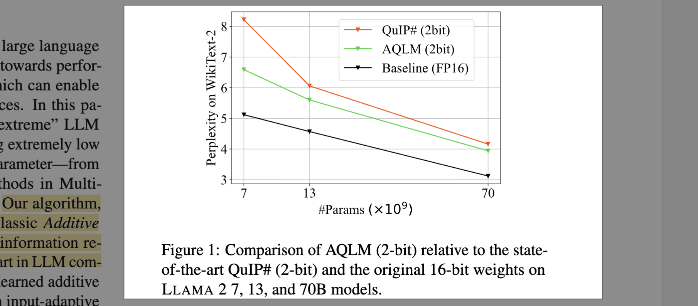
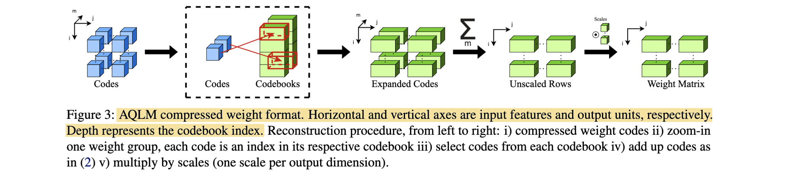

# Extreme Compression of Large Language Models via Additive Quantization

- **Authors:** Vage Egiazarian*, Andrei Panferov*, Denis Kuznedelev, Elias Frantar, Artem Babenko, Dan Alistarh
- **Affiliations:** HSE University, Yandex Research, Skoltech, IST Austria, NeuralMagic
- **Published:** ICML 2024 (arXiv:2401.06118), January 2024
- **Keywords:** LLM compression, post-training quantization, additive quantization, multi-codebook quantization, 2-bit quantization
- **GitHub:** https://github.com/Vahe1994/AQLM
- **HuggingFace:** https://huggingface.co/ISTA-DASLab

---

## Pass 1 — Bird's-Eye View

| C | Assessment |
|---|-----------|
| **Category** | Methods paper on "extreme" (2–3 bits per weight) PTQ[^1] of LLM weights. Introduces the AQLM algorithm plus GPU/CPU inference kernels. |
| **Context** | Marries two previously separate lines: (1) LLM weight PTQ — GPTQ, SpQR, SqueezeLLM, [AWQ](../../2023/AWQ-_Activation-aware_Weight_Quantization_for_LLM_Compression_and_Acceleration/), QuIP/QuIP# — and (2) Multi-Codebook Quantization (MCQ) from approximate nearest-neighbor retrieval — Product Quantization (Jegou et al., 2010), Additive Quantization (Babenko & Lempitsky, 2014), LSQ (Martinez et al., 2018). Uses the Pareto-optimality framing of Dettmers & Zettlemoyer (2022). |
| **Correctness** | Sound. Standard evaluation protocol (WikiText-2/C4 PPL[^2] , five zero-shot tasks via LM Eval Harness), fair bit-accounting that includes codebook overhead (Appendix H). One caveat: AQLM calibrates on 8M tokens, more than baselines typically use, though the authors show baselines like GPTQ saturate around 256 sequences while AQLM keeps improving. |
| **Contributions** | (1) AQLM: additive quantization made *instance-aware* — codes and codebooks optimized to preserve layer outputs on calibration activations, not the weights themselves; (2) joint block-wise fine-tuning of codebooks across each transformer block; (3) first scheme that is Pareto-optimal below 3 bits per parameter; (4) practical GPU/CPU kernels that match or beat FP16 speed. |
| **Clarity** | Well written. The derivation from the AQ objective to the precomputable $XX^T$ form is clean, Algorithm 1 summarizes the whole pipeline, and the appendix is unusually thorough (configs, timings, ablations, extra models). |

**30-second summary.** AQLM compresses LLM weight matrices by representing each group of 8 consecutive weights as a *sum* of codewords chosen from several learned codebooks (classic Additive Quantization from retrieval), but retargets the optimization: instead of minimizing weight reconstruction error, it minimizes the error of the layer's *output* on calibration inputs, solving for discrete codes with beam search and for continuous codebooks with Adam. After quantizing the layers of a transformer block, it jointly fine-tunes the codebooks, scales, and non-quantized parameters to match the block's original output. On Llama 2 (7B/13B/70B) and Mixtral, AQLM beats GPTQ, SpQR, QuIP, and QuIP# across 2–4 bits, with the largest wins at 2 bits (e.g., Llama 2 13B: Wiki2 PPL 5.60 vs 6.06 for QuIP# at ~2 bits), and is the first method to be Pareto-optimal at ~2.5 bits per parameter. Custom kernels give ~1.2–3× GPU and ~2.3–4× CPU speedups over FP16/FP32 matrix-vector products.



---

## Pass 2 — Careful Read

### Core Idea in One Sentence

Represent each group of 8 LLM weights as a sum of $M$ codewords from learned $2^B$ -entry codebooks, and optimize the discrete codes (beam search) and continuous codebooks (Adam) to preserve each layer's — and then each transformer block's — output on calibration data.

### Method / Approach



- **Additive weight representation:** Each row of a weight matrix $W \in R^{d_{out} \times d_{in}}$ is split into groups of $g{=}8$ consecutive weights; each group is approximated as $\sum_{m=1}^{M} C_m b_m$ , where $C_m \in R^{g \times 2^B}$ are learned codebooks and $b_m$ is a one-hot code selecting one codeword per codebook. A per-output-unit FP16 scale $s_i$ multiplies each row. Storage is $B \cdot M$ bits per group plus amortized codebook cost (e.g., 1 codebook of $2^{16}$ codewords ≈ 2 bits/weight).
- **Instance-aware objective:** Unlike classic AQ (which preserves the vectors themselves), AQLM minimizes $||WX - \widehat{W}X||_2^2$ over calibration activations $X$ . All inner products reduce to forms involving the precomputed $d_{in} \times d_{in}$ matrix $XX^T$ , so the calibration set never needs to be held in memory during optimization.
- **Three-phase alternating optimization:** (1) *Beam search for codes* — the objective is a discrete Markov Random Field; codes are updated by trying $2^B \cdot k$ single-code replacements per step over a beam of $k$ candidate configurations, in parallel across output units. (2) *Codebook update* — with codes frozen, codebooks and scales are updated by ~100 full-batch Adam steps. (3) *Block fine-tuning* — after all linear layers in a transformer block are quantized, codebooks, scales, and non-quantized parameters (RMSNorm, biases) are trained to match the block's original output, with the discrete codes frozen.
- **Optional end-to-end fine-tuning (AQLM★):** Following QuIP#, the whole quantized model is distilled against the FP16 teacher with a KL-divergence loss on token distributions, training only codebooks/scales/norms (PEFT-like memory footprint). This helps most at 2 bits.

### Key Results

Wiki2 = WikiText-2 perplexity (↓); Avg acc = mean of 5 zero-shot tasks (↑). Selected from Tables 1–3:

| Model | Method | Avg bits | Wiki2 ↓ | C4 ↓ | Avg acc ↑ |
|-------|--------|----------|---------|------|-----------|
| Llama 2 7B | FP16 | 16 | 5.12 | 6.63 | 62.35 |
| Llama 2 7B | **AQLM** | 2.02 | **6.59** | **8.54** | **57.28** |
| Llama 2 7B | QuIP# | 2.02 | 8.22 | 11.01 | 52.23 |
| Llama 2 13B | **AQLM** | 1.97 | **5.60** | **7.49** | **61.32** |
| Llama 2 13B | QuIP# | 2.01 | 6.06 | 8.07 | 57.55 |
| Llama 2 70B | **AQLM** | 2.07 | **3.94** | **5.72** | **68.75** |
| Llama 2 70B | QuIP# | 2.01 | 4.16 | 6.01 | 67.67 |
| Llama 2 7B | **AQLM** | 3.04 | **5.46** | **7.08** | **60.88** |
| Llama 2 7B | GPTQ | 3.00 | 8.06 | 10.61 | 53.08 |
| Llama 2 7B | SpQR | 2.98 | 6.20 | 8.20 | 59.07 |
| Mixtral 8x7B | **AQLM** | 1.98 | **4.61** | **5.75** | **67.68** |
| Mixtral 8x7B | QuIP# | 2.01 | 4.75 | 5.89 | 66.34 |

- **Pareto optimality:** the best bitwidth for AQLM is ~2.5 bits/parameter — 2.76-bit AQLM on Llama 2 13B beats the *uncompressed* 7B model, making AQLM the first method Pareto-optimal below 3 bits.
- **Ablations:** residual K-means initialization is critical for fast convergence (random init needs far more iterations at higher final MSE); fine-tuning the *codebook parameters* is by far the most impactful part of block fine-tuning (Wiki2 6.92 vs 8.18 without fine-tuning; RMSNorm-only tuning barely helps); PPL improves monotonically with calibration size from 128 to 4096 sequences.
- **Speed:** matrix-vector kernels reach up to ×3.05 (70B, 2-bit, RTX 3090) over FP16 on GPU and up to ×4.07 over FP32 on CPU (2×8-bit codebooks); end-to-end generation ~14 tok/s for Llama 2 70B on a single 24GB RTX 3090.

### Strengths

- **First Pareto-optimal sub-3-bit scheme:** the headline claim is backed by a clean size-vs-accuracy analysis, not just per-bitwidth tables.
- **Homogeneous format:** no outlier/sparse side-structures (unlike SpQR/SqueezeLLM), which simplifies kernels and deployment.
- **Learned, layer-specific codebooks:** direct optimization over the calibration set replaces QuIP#'s fixed lattice + rotation, and the ablation (>99% of quantized-layer parameters live in the codebooks) explains why fine-tuning them matters so much.
- **Practicality:** real GPU/CPU kernels with speedups, HF-integrated models, public code — rare for extreme-compression papers at the time.
- **Thorough evaluation:** three model families (Llama 2, Mistral, Mixtral), 2–4.1 bits, zero-shot suites, plus harder MMLU/GSM8k evals in the appendix that honestly show larger relative drops.

### Weaknesses / Open Questions

1. **Quantization cost:** calibrating a 70B model takes 10–14 days on one A100 (3–4 days on 8 GPUs) — orders of magnitude slower than GPTQ; beam search dominates and scales with codebook size.
2. **Calibration-budget asymmetry:** AQLM uses 8M calibration tokens where baselines traditionally use a few hundred sequences; the authors argue diminishing returns for baselines, but the comparison is not strictly budget-matched.
3. **2-bit quality on hard tasks:** MMLU and GSM8k degrade relatively more than PPL and simple zero-shot tasks (e.g., 7B GSM8k 14.6 → 5.3 at 2 bits), so "usable 2-bit LLM" depends heavily on the task.
4. **Weight-only:** activations and KV cache stay FP16, so compute-bound (batch) inference sees no benefit; speedups are for memory-bound single-batch generation.
5. **Not uniformly best:** on Mistral 7B at 2 bits, QuIP# slightly outperforms AQLM without fine-tuning; the discrete codes are frozen after calibration, which later work (PV-Tuning) shows is a real limitation.

### References to Follow Up

1. **Additive Quantization for Extreme Vector Compression** — Babenko & Lempitsky, CVPR 2014: the retrieval-era AQ algorithm that AQLM generalizes; the beam-search code solver comes from here.
2. **GPTQ: Accurate Post-Training Quantization for Generative Pre-trained Transformers** — Frantar et al., ICLR 2023: the data-aware layer-wise PTQ baseline that established the $\arg\min ||WX - \widehat{W}X||^2$ formulation AQLM adopts.
3. **QuIP#: Even Better LLM Quantization with Hadamard Incoherence and Lattice Codebooks** — Tseng et al., ICML 2024: the strongest contemporary 2-bit competitor (fixed E8P lattice + rotations); also the source of the end-to-end KL fine-tuning recipe.
4. **The case for 4-bit precision: k-bit inference scaling laws** — Dettmers & Zettlemoyer, ICML 2023: defines the Pareto-optimality framing; previously placed the frontier at 4 bits.
5. **PV-Tuning: Beyond Straight-Through Estimation for Extreme LLM Compression** — Malinovskii et al., NeurIPS 2024: the direct successor from the same group that fine-tunes discrete codes too, cited in the conclusion as the promising next step.

---

## Pass 3 — Virtual Re-implementation

### Detailed Technical Summary

**Representation.** For a linear layer with weights $W \in R^{d_{out} \times d_{in}}$ , split each row into $d_{in}/g$ groups of $g{=}8$ consecutive weights. Each group is encoded by $M$ one-hot vectors $`b_{i,j,m} \in \{0,1\}^{2^B}`$ (output unit $i$ , group $j$ , codebook $m$ ) against learned codebooks $C_m \in R^{g \times 2^B}$ shared by the whole layer:

```math
\widehat{W}_i = \Big( \sum_{m=1}^{M} C_m b_{i,1,m} \Big) \oplus \dots \oplus \Big( \sum_{m=1}^{M} C_m b_{i, d_{in}/g, m} \Big),
```

where $\oplus$ is concatenation, followed by a learned per-output-unit scale $s_i$ (initialized to $||W_i||_2$ ). Storage per group is $M \cdot B$ bits for codes plus $g \cdot 2^B \cdot 16$ bits for codebooks amortized over the layer; average bits per parameter (Appendix H):

```math
\bar{b} = \frac{16\, g\, M\, 2^B + d_{out} (d_{in}/g)\, B\, M + 16\, d_{out}}{d_{in} d_{out}}.
```

For `gate_proj` of Llama 2 70B ( $d_{in}{=}8192$ , $d_{out}{=}28672$ ), two 8-bit codebooks with $g{=}8$ give 2.002 bits/parameter — codes dominate, codebooks and scales are negligible for large layers.

**Objective.** Given calibration inputs $X \in R^{d_{in} \times n}$ , solve

```math
\arg\min_{C, b} \Big|\Big| WX - \Big( \mathrm{Concat}_{i,j} \sum_{m=1}^{M} C_m b_{i,j,m} \Big) X \Big|\Big|_2^2 .
```

Expanding the squared norm, every term reduces to Frobenius inner products of the form $\langle C_i b_i X, C_j b_j X \rangle_F = \langle C_i b_i X X^T, C_j b_j \rangle_F$ , so the $d_{in} \times d_{in}$ matrix $XX^T$ is precomputed once and the raw calibration activations are never needed again. The objective is additive over output units, so all $d_{out}$ rows are solved in parallel.

**Phase 1 — beam search for codes.** With codebooks fixed, minimizing over the one-hot $b$ is MAP inference in a fully-connected discrete Markov Random Field: unary potentials $\langle W, C_m b_m \rangle_{XX^T}$ , pairwise potentials $\langle C_i b_i, C_j b_j \rangle_{XX^T}$ . AQLM adapts the beam search of Babenko & Lempitsky (2014): keep a beam of $k$ best code configurations; at each step, try replacing one code with all $2^B \cdot k$ alternatives and keep the $k$ best by MSE. Because the loss is additive, swapping one code only changes a few terms, which are updated incrementally after premultiplying by $XX^T$ .

**Phase 2 — codebook update.** With codes frozen, minimizing over $C_m$ is a least-squares problem, but unlike classic AQ it is not separable per dimension because of $XX^T$ . The implementation simply runs ~100 non-stochastic full-batch Adam steps (lr $10^{-4}$ , $\beta_1{=}0.9$ , $\beta_2{=}0.95$ ) on

```math
||WX - \widehat{W}X||_2^2 = \big\langle (W - \widehat{W}) X X^T, (W - \widehat{W}) \big\rangle_F ,
```

updating codebooks and per-unit scales; this takes a small fraction of total time. Phases 1–2 alternate until the loss improves by less than a tolerance $\tau \in [10^{-3}, 10^{-2}]$ .

**Initialization.** Residual K-means: run K-means on the weight groups, subtract the nearest centroid, and repeat $M$ times on the residuals — each codebook starts by explaining the error left by the previous ones. This is the difference between converging in hundreds vs thousands of iterations (Figure 4).

**Phase 3 — block-wise fine-tuning.** Quantizing each layer independently ignores cross-layer error interaction, which matters most at 2 bits. After quantizing the 4–8 linear layers of a transformer block, AQLM fine-tunes the block's continuous parameters — codebooks $C_m$ , scales $s$ , RMSNorm gains, biases — to minimize $`||\mathrm{block}(X_{block}) - Y_{block}||^2`$ against the original block's recorded outputs, with codes $b$ frozen (PyTorch autograd through the representation). This is a middle ground between per-layer PTQ and full QAT[^3] (infeasible at LLM scale), takes 10–30% of total calibration time, and fits on one GPU since only a small fraction of parameters is trainable.

**End-to-end fine-tuning (AQLM★, Appendix A).** Adopting the QuIP# recipe, the fully quantized model is distilled against the FP16 teacher with $L = \frac{1}{N}\sum_i D_{KL}(p_s(x_i), p_t(x_i))$ , training the same continuous parameters (Adam, lr $10^{-5}$ , 1 epoch over 4–16M tokens). Biggest gains at 2 bits (7B: Wiki2 6.59 → 6.14), diminishing at ≥3 bits.

**Configurations and cost.** 2-bit: 1 codebook of $2^{15}$ or $2^{16}$ , $g{=}8$ ; 3-bit: 2 codebooks of $2^{12}$ ; 4-bit: 2 codebooks of $2^{15}$ / $2^{16}$ . Calibration: 8M tokens of RedPajama at sequence length 4096 (8192 for Mistral/Mixtral). Quantization time: 7B ≈ 1 day on one A100 (14h on 2); 70B ≈ 10–14 days on one GPU, 3–4 days on 8. Reducing beam size trades 2–4× speedup for accuracy.

**Inference kernels.** For GPU, a $1{\times}16$ codebook (one 16-bit code per group of 8) gives ×1.2–1.3 layer speedup over FP16; multiple small $8$ -bit codebooks (e.g., 2×8) fit GPU cache better and reach ×1.57–3.05 at slightly lower accuracy. On CPU, replacing one 16-bit codebook with several 8-bit ones enables lookup-table matrix multiplication, giving up to ×4 over FP32. Learned code usage is near-uniform (entropy 15.91 of 16 bits), so the codebook capacity is actually exploited.

### Datasets

#### Train Data

| Dataset | Usage | Proposed by |
|---|---|---|
| RedPajama-v1 | calibration token slice for codebook optimization. | — |

#### Evaluation/Validation Data

| Dataset | Usage | Proposed by |
|---|---|---|
| WikiText-2 | language-model perplexity | — |
| C4 | language-model perplexity | — |
| Penn Treebank | language-model perplexity | — |
| ZeroShotTasks | LM Eval Harness downstream evaluation. | — |

### Hidden Assumptions

1. **Calibration data is representative:** all objectives reduce to $XX^T$ computed on RedPajama samples; distribution shift between calibration and deployment domains silently changes what "output-preserving" means.
2. **Layer/block MSE is a good proxy for task quality:** the whole pipeline optimizes L2 output error (and later KL), assuming it tracks downstream accuracy — mostly true, but the MMLU/GSM8k appendix shows the mapping is not tight at 2 bits.
3. **Groups of consecutive weights are a natural unit:** $g{=}8$ along the input dimension assumes local correlation structure in weight rows that codebooks can exploit; no channel permutation or rotation is considered.
4. **Large layers amortize codebooks:** the bit-accounting favors big matrices; for small layers (or small models) the fixed $16 \cdot g \cdot 2^B$ codebook cost per layer would be significant.
5. **Memory-bound inference regime:** claimed speedups assume single-batch autoregressive generation where weight loading dominates; at large batch the FP16 dequantization overhead would flip the comparison.
6. **Codes can stay frozen after calibration:** both block and end-to-end fine-tuning only touch continuous parameters — assuming beam-search codes remain near-optimal as codebooks drift (PV-Tuning later showed relaxing this helps).

### Reproducibility Notes

- **Code:** public at https://github.com/Vahe1994/AQLM (camera-ready branch pinned in Appendix B); prequantized models on HuggingFace under ISTA-DASLab.
- **Data:** calibration = RedPajama-v1 slice, 8M tokens, sequence length 4096 (Llama 2) / 8192 (Mistral, Mixtral); evaluation via LM Eval Harness, GPTQ protocol.
- **Compute:** 1–8× A100/H100 for quantization; RTX 3090 (GPU) and Intel i9-13900K (CPU) for speed benchmarks. Budget: ~1 GPU-day (7B) to ~25–30 GPU-days (70B) per configuration.
- **Hyperparameters:** codebook configs per bitwidth given in Appendix C; Adam settings, early-stopping tolerance $\tau$ , and fine-tuning recipe (lr $10^{-5}$ , batch 8–16 sequences, 1 epoch) all documented.
- **Underspecified:** beam size $k$ used per experiment is not stated in the main text; QuIP was hand-adapted to Llama 2 by the authors (official code didn't support it), so that baseline is not exactly the original; baselines use different calibration budgets (QuIP 4M tokens due to OOM, QuIP# official checkpoints with 6k samples).

### Ideas for Future Work

1. **Optimize the discrete codes during fine-tuning:** the codes are frozen after beam search; jointly updating them end-to-end (realized by PV-Tuning) should recover accuracy lost to early discretization.
2. **Dedicated least-squares codebook solver:** the Adam-based Phase 2 is a placeholder; a conjugate-gradient solver exploiting the quadratic structure could cut calibration time substantially.
3. **Beyond weights:** apply MCQ to KV-cache compression for long contexts and to vision models — explicitly suggested in the conclusion and still an active area.
4. **Faster code assignment:** beam search is the runtime bottleneck; learned encoders or randomized ICM variants could bring 70B quantization from days to hours.
5. **Batch-friendly kernels:** fused dequantize-GEMM or activation quantization on top of AQLM would extend benefits from single-stream generation to serving workloads.

---

## Pass 4 — Modern Perspective Review (as of July 2026)

### What Has Changed Since Publication

- **The codes-fine-tuning gap was closed:** PV-Tuning (same group, NeurIPS 2024) replaced straight-through estimation and frozen codes with a principled discrete-continuous optimizer, improving AQLM's own 2-bit results; the AQLM repo now ships AQLM+PV checkpoints (including Llama 3.1).
- **Trellis and vector-quantization successors:** QTIP (Tseng et al., NeurIPS 2024) moved from lattice/additive codebooks to trellis-coded quantization for higher-dimensional codes at constant lookup cost; VPTQ (Microsoft, EMNLP 2024) and GPTVQ (Qualcomm, 2024) offered cheaper vector-quantization pipelines — MCQ-style weight compression became a recognized family rather than a curiosity.
- **Newer models quantize worse:** multiple studies found Llama 3+ degrades much more under 2–3-bit PTQ than Llama 2 (likely due to more thorough training), softening the practical value of "2-bit Llama" results demonstrated on Llama 2.
- **Hardware moved toward low-bit floating point:** Blackwell-class GPUs natively support FP4/MXFP4/NVFP4, and vendors increasingly release QAT or natively low-precision checkpoints (e.g., MXFP4 GPT-OSS releases), which competes with codebook methods on the deployment side where hardware-native formats are much faster to decode.
- **Rotation-based weight-activation quantization matured:** QuaRot, SpinQuant, and successors target W4A4-style inference for serving throughput — a different regime than AQLM's weight-only, memory-bound single-stream focus.
- **Ecosystem integration:** AQLM gained inference support in HuggingFace Transformers and [vLLM](../../2023/Efficient_Memory_Management_for_Large_Language_Model_Serving_with_PagedAttention/), and PEFT-style fine-tuning on top of AQLM checkpoints, making it one of the few extreme-compression formats actually deployable off the shelf.

### Has the Community Accepted the Claims?

Largely yes. AQLM's central claims — that learned multi-codebook (additive) quantization beats scalar and lattice schemes at 2–3 bits, and that Pareto optimality extends below 3 bits — were validated and then built upon rather than overturned. QuIP#/QTIP authors, VPTQ, and PV-Tuning all treat AQLM as the canonical learned-codebook baseline, and its block-wise calibration fine-tuning became standard practice across extreme PTQ papers. The main refinements from follow-up work: freezing discrete codes during fine-tuning was suboptimal (PV-Tuning), incoherence processing plus structured codes can reach similar quality with much cheaper quantization (QTIP), and the "2-bit is usable" conclusion transfers poorly to Llama-3-class models. The high calibration cost (days of GPU time for 70B) was the most-cited practical criticism and drove much of the successor work.

---

### Comparison Papers

#### Predecessors

| Paper | Authors | Year | Relation |
|-------|---------|------|----------|
| Additive Quantization for Extreme Vector Compression | Babenko & Lempitsky | 2014 | Source of the AQ representation and beam-search code solver that AQLM adapts from retrieval to weight compression |
| Product Quantization for Nearest Neighbor Search | Jegou et al. | 2010 | Original MCQ method; AQ generalizes PQ by summing codewords instead of concatenating |
| LSQ: Revisiting Additive Quantization | Martinez et al. | 2018 | State-of-the-art MCQ solver in retrieval; notation and codebook-learning ideas carried over |
| GPTQ | Frantar et al. | 2022 | Established data-aware layer-wise PTQ objective $||WX-\widehat{W}X||^2$ ; baseline at 3–4 bits |
| The case for 4-bit precision (k-bit scaling laws) | Dettmers & Zettlemoyer | 2022 | Defined the Pareto-optimality criterion; placed the pre-AQLM frontier at 4 bits |

#### Contemporaries / Competitors

| Paper | Authors | Year | Relation |
|-------|---------|------|----------|
| QuIP: 2-Bit Quantization with Guarantees | Chee et al. | 2023 | First credible 2-bit PTQ via incoherence processing; baseline AQLM outperforms at 2–4 bits |
| QuIP#: Hadamard Incoherence and Lattice Codebooks | Tseng et al. | 2024 | Strongest concurrent 2-bit method (fixed E8P lattice + rotations vs AQLM's learned additive codebooks); main baseline |
| SpQR | Dettmers et al. | 2023 | Sparse-outlier + quantized format; baseline at 3–4 bits, contrasts with AQLM's homogeneous format |
| SqueezeLLM | Kim et al. | 2023 | Non-uniform (K-means) scalar quantization with outlier separation; contrast for hybrid formats |
| [AWQ: Activation-aware Weight Quantization](../../2023/AWQ-_Activation-aware_Weight_Quantization_for_LLM_Compression_and_Acceleration/) | Lin et al. | 2023 | Activation-aware per-channel scaling; mainstream 4-bit competitor outside the extreme regime |

#### Successors / Extensions

| Paper | Authors | Year | Relation |
|-------|---------|------|----------|
| PV-Tuning: Beyond Straight-Through Estimation | Malinovskii et al. | 2024 | Same group; fine-tunes discrete codes too, improving AQLM 2-bit results; shipped as AQLM+PV checkpoints |
| QTIP: Quantization with Trellises and Incoherence Processing | Tseng et al. | 2024 | Trellis-coded quantization; surpasses AQLM/QuIP# quality at much lower quantization cost |
| VPTQ: Extreme Low-bit Vector Post-Training Quantization | Liu et al. | 2024 | Cheaper vector-quantization pipeline for 2-bit LLMs, directly motivated by AQLM's calibration cost |
| GPTVQ: The Blessing of Dimensionality for LLM Quantization | van Baalen et al. | 2024 | Fast GPTQ-style vector quantization; another take on MCQ-for-LLMs with lower quantization time |
| CALDERA: Low-Rank + Low-Precision Decomposition | Saha et al. | 2024 | Combines low-rank correction with extreme quantization, using AQLM as a key comparison |

---

### Bottom Line

Still worth reading, and likely to stay that way. AQLM is the paper that imported multi-codebook quantization from the retrieval literature into LLM compression and proved the sub-3-bit regime could be Pareto-optimal — every extreme-quantization paper since positions itself against it. The three-phase recipe (beam search over an MRF, calibration-aware codebook learning, block-wise fine-tuning) is explained clearly enough to reimplement, and the block fine-tuning idea in particular became standard machinery across the field. At the 2026 frontier it is superseded — QTIP and PV-Tuning beat it on quality, VPTQ-style methods on quantization cost, and hardware-native FP4 formats on deployment convenience — so read it as the foundational reference for learned-codebook LLM compression rather than as the current state of the art.

[^1]: **PTQ** — Post-Training Quantization. See the [glossary](../../common/terms/).
[^2]: **PPL** — Perplexity. See the [glossary](../../common/terms/).
[^3]: **QAT** — Quantization-Aware Training. See the [glossary](../../common/terms/).
