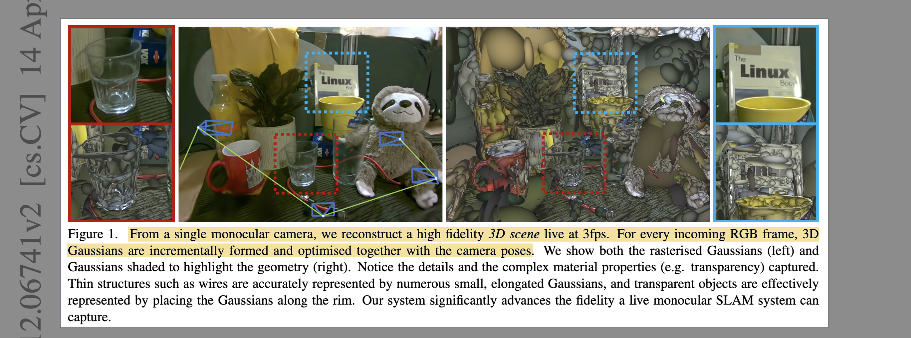
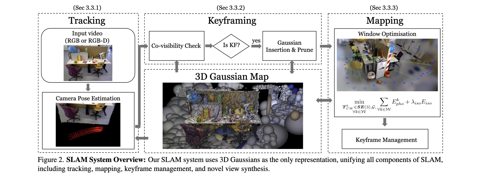

# Gaussian Splatting SLAM

- **Authors:** Hidenobu Matsuki, Riku Murai, Paul H. J. Kelly, Andrew J. Davison
- **Affiliations:** Dyson Robotics Laboratory, Imperial College London; Software Performance Optimisation Group, Imperial College London
- **Published:** CVPR 2024 (Highlight & Best Demo Award), arXiv:2312.06741
- **Keywords:** 3D Gaussian Splatting, SLAM, monocular, dense reconstruction, camera tracking, differentiable rendering, Lie group
- **Webpage:** https://rmurai.co.uk/projects/GaussianSplattingSLAM/
- **GitHub:** https://github.com/muskie82/MonoGS

---

## Pass 1 — Bird's-Eye View

| C | Assessment |
|---|-----------|
| **Category** | Systems paper introducing the first monocular SLAM system that uses 3D Gaussian Splatting as its sole scene representation, unifying tracking, mapping, and rendering |
| **Context** | Builds on 3DGS (Kerbl et al., SIGGRAPH 2023), map-centric dense SLAM (iMAP, NICE-SLAM, Point-SLAM), and direct visual odometry (DSO); extends 3DGS to online settings by deriving Lie-group camera Jacobians |
| **Correctness** | Technically sound; analytic Jacobians are derived step by step and validated empirically; ablations cover all major design choices; results averaged over 3 runs on standard benchmarks |
| **Contributions** | (1) First near-real-time SLAM with 3DGS as the only representation supporting monocular input; (2) analytic SE(3) Jacobians for direct Gaussian-based pose estimation; (3) isotropic Gaussian regularization for incremental reconstruction; (4) Gaussian covisibility-based keyframe management with visibility-aware pruning |
| **Clarity** | Well-written with clear system diagrams, strong ablations, and an unusually detailed supplementary covering Jacobians, hyperparameters, and extended results |

**30-second summary:** MonoGS presents the first online visual SLAM system built entirely on 3D Gaussian Splatting, running live from a single monocular camera at ~3 FPS. Rather than using a separate tracking module, camera poses are estimated by direct photometric optimization against the rendered Gaussian map — made feasible by novel analytic Jacobians on the SE(3) Lie group. An isotropic regularization term prevents Gaussians from degenerately elongating along viewing rays (a key failure mode in incremental monocular reconstruction), and a covisibility-based keyframe manager with visibility pruning keeps the map geometrically clean. The result is a compact, memory-efficient system (2.6–4 MB) that achieves state-of-the-art ATE on TUM RGB-D and Replica while rendering at 769 FPS — hundreds of times faster than competing neural-implicit SLAM methods.



---

## Pass 2 — Careful Read

### Core Idea in One Sentence

MonoGS enables online monocular SLAM by deriving analytic camera-pose Jacobians for the 3DGS rasterization pipeline, letting camera poses and a 3D Gaussian map be jointly optimized from raw RGB frames in real time.

### Method / Approach



- **Unified 3DGS representation:** The entire SLAM state is a set of anisotropic Gaussians $G$ . There are no separate depth maps, mesh surfaces, or neural networks. Each Gaussian $G^i$ carries position $\mu_W^i$ , covariance $\Sigma_W^i$ , color $c^i$ , and opacity $\alpha^i$ . Alpha-blended volume rendering produces per-pixel color and depth from any novel viewpoint in under 2 ms.

- **Direct camera tracking via SE(3) Jacobians:** At each incoming frame, only the camera pose $T_{CW} \in SE(3)$ is optimized by minimizing photometric (and optionally geometric) residuals against the frozen Gaussian map. The authors derive the analytic minimal Jacobians $\partial \mu_I / \partial T_{CW}$ and $\partial \Sigma_I / \partial T_{CW}$ on the Lie group, plugging them into the existing CUDA rasterization pipeline. This avoids automatic differentiation overhead and enables ~100 gradient-descent iterations per frame.

- **Mapping with isotropic regularization:** A keyframe window $W = W_k \cup W_r$ (current keyframes + 2 random past keyframes) jointly optimizes Gaussian geometry and the keyframe poses. The isotropic loss $`E_{iso} = \sum_i ||s_i - \tilde{s}_i \cdot 1||_1`$ penalizes Gaussians that stretch anisotropically along under-constrained viewing directions — crucial for monocular settings where depth is ambiguous. $\lambda_{iso} = 10$ for both mono and RGB-D.

- **Covisibility-based keyframe management with pruning:** Keyframes are selected based on Gaussian covisibility (IOU of visible Gaussian sets between frames), and managed with overlap-coefficient pruning to remove redundant keyframes. New Gaussians are inserted at each keyframe and pruned if they remain geometrically unstable (unobserved across 3+ other frames in the current window, or opacity < 0.7).

### Key Results

**Camera tracking — TUM RGB-D (ATE RMSE, cm):**

| Method | Input | fr1/desk | fr2/xyz | fr3/office | Avg |
|---|---|---|---|---|---|
| DSO | Mono | 22.4 | 1.10 | 9.50 | 11.0 |
| DROID-VO | Mono | 5.20 | 10.7 | 7.30 | 7.73 |
| **MonoGS (Ours)** | **Mono** | **3.78** | **4.60** | **3.50** | **3.96** |
| Point-SLAM | RGB-D | 4.34 | 1.31 | 3.48 | 3.04 |
| ESLAM | RGB-D | 2.47 | 1.11 | 1.70 | 2.00 |
| **MonoGS (Ours)** | **RGB-D** | **1.50** | **1.44** | **1.49** | **1.47** |

**Rendering — Replica RGB-D (avg across 8 sequences):**

| Method | PSNR ↑ | SSIM ↑ | LPIPS ↓ | Render FPS ↑ |
|---|---|---|---|---|
| NICE-SLAM | 24.42 | 0.809 | 0.233 | 0.54 |
| Vox-Fusion | 24.41 | 0.801 | 0.236 | 2.17 |
| Point-SLAM | 35.17 | 0.975 | 0.124 | 1.33 |
| **MonoGS (Ours)** | **38.94** | **0.968** | **0.070** | **769** |

- **Ablation — Isotropic loss (mono TUM) :** w/o $E_{iso}$: 4.83 cm → with: 3.96 cm avg ATE. Effect largest in fr3/office (5.73 → 3.50).
- **Ablation — Keyframe selection (mono TUM) :** w/o KF selection: 8.73 cm → with: 3.96 cm. Most critical design choice.
- **Ablation — Gaussian pruning (mono TUM) :** w/o pruning: 46.6 cm avg → with: 3.96 cm. Without pruning, incorrect monocular Gaussian initializations dominate.
- **Convergence basin:** 3DGS achieves 79–82% localization success rate vs. 14% for hash-grid SDF and 33% for MLP SDF — the smooth anisotropic gradient field creates a far larger basin of attraction.
- **Memory:** 2.6 MB mono / 3.97 MB RGB-D vs. NICE-SLAM 40.3 MB and Point-SLAM 38.0 MB.

### Strengths

- **Unified representation:** The same Gaussians serve tracking, mapping, and high-quality rendering simultaneously — no layered handoff between components.
- **Extremely fast rendering:** 769 FPS (pure forward render) vs. 0.54–1.33 FPS for neural methods. This is integral to running 100 pose-optimization iterations per frame.
- **Large convergence basin:** The smooth Gaussian gradient field enables robust camera recovery from large pose perturbations — a property unique to 3DGS vs. neural implicit representations.
- **Transparent object handling:** By avoiding explicit surface extraction, the system naturally reconstructs transparent and thin objects that break depth-based or SDF methods.
- **Tiny memory footprint:** 2.6 MB (mono) compared to 38–40 MB for neural SLAM, because Gaussians are aggressively pruned to only well-supported primitives.
- **Analytic Jacobians:** Deriving closed-form SE(3) Jacobians for EWA splatting is a novel technical contribution with applications beyond SLAM.

### Weaknesses / Open Questions

1. **No loop closure:** The system accumulates drift and is only evaluated on small room-scale scenes. The authors acknowledge this as a key limitation — integration with graph-based loop closure is left as future work.
2. **Low system throughput:** ~3 FPS end-to-end on a desktop RTX 4090 / i9-12900K. Hard real-time (30 FPS) is not achieved. Exploring second-order optimizers (Gauss-Newton, Levenberg-Marquardt) is suggested but not done.
3. **Static scene assumption:** All Gaussians are treated as static. Dynamic objects create inconsistent observations that hurt both tracking and reconstruction.
4. **Scale ambiguity in monocular mode:** A global scale is estimated during the optimization, but it is not explicitly constrained, and evaluation requires a post-hoc scale alignment step.
5. **Known intrinsics required:** Camera calibration is assumed to be provided — not estimated online.
6. **Spherical harmonics omitted from main evaluation:** SH is disabled in the main results for simplicity. Supplementary shows adding SH improves rendering (PSNR +2.5 dB on TUM) but slightly hurts ATE, because SH can "explain away" view-directional effects caused by camera motion.

### References to Follow Up

1. **"3D Gaussian Splatting for Real-Time Radiance Field Rendering"** — Kerbl et al., SIGGRAPH 2023: The foundational representation MonoGS builds upon; essential for understanding the rendering pipeline and Gaussian parameterization.
2. **"iMAP: Implicit Mapping and Positioning in Real-Time"** — Sucar et al., ICCV 2021: The seminal work establishing map-centric NeRF-based SLAM; MonoGS inherits its evaluation protocol and directly outperforms it.
3. **"Point-SLAM: Dense Neural Point Cloud-based SLAM"** — Sandstrom et al., ICCV 2023: The strongest NeRF-based SLAM baseline; competitive on Replica rendering despite using depth-guided sampling.
4. **"Direct Sparse Odometry"** — Engel et al., PAMI 2017: The primary classical monocular VO baseline; MonoGS outperforms DSO on TUM without any loop closure.
5. **"A Micro Lie Theory for State Estimation in Robotics"** — Sola et al., arXiv 2018: The reference for the Lie group / Lie algebra formalism used throughout the Jacobian derivation.

---

## Pass 3 — Virtual Re-implementation

### Detailed Technical Summary

**3D Gaussian Splatting Representation.** The scene $G$ is a collection of anisotropic Gaussians. Each Gaussian $G^i$ is defined by: world-frame mean $\mu_W^i \in R^3$ , covariance $\Sigma_W^i = R S S^T R^T$ (where $R \in SO(3)$ is rotation, $S = diag(s)$ with scale $s \in R^3_+$ ), opacity $\alpha^i \in [0,1]$ , and view-independent color $c^i$ (spherical harmonics omitted in main experiments). Pixel color is alpha-blended:

```math
C_p = \sum_{i \in N} c_i \alpha_i \prod_{j=1}^{i-1} (1 - \alpha_j)
```

where contributions decay via the 2D Gaussian $N( \mu_I , \Sigma_I )$ obtained by projecting the 3D Gaussian through the camera:

```math
\mu_I = \pi(T_{CW} \cdot \mu_W), \quad \Sigma_I = J W \Sigma_W W^T J^T
```

Here $\pi$ is the projection map, $T_{CW} \in SE(3)$ is the camera pose, $J$ is the projective Jacobian, and $W$ is the rotational part of $T_{CW}$ . Depth is rendered the same way, replacing $c_i$ with the along-ray distance $z_i$ to $\mu_W^i$ .

**Camera Pose Optimization (Tracking).** Given the current Gaussian map, the camera pose for each incoming frame is optimized by minimizing:

```math
E_{pho} = \| I(G, T_{CW}) - \bar{I} \|_1
```

where $\bar{I}$ is the observed RGB image. Affine brightness parameters are jointly optimized to handle exposure variation. With depth available, a geometric residual is added:

```math
E_{geo} = \| D(G, T_{CW}) - \bar{D} \|_1
```

and the combined loss is $\lambda_{pho} E_{pho} + (1 - \lambda_{pho}) E_{geo}$ with $\lambda_{pho} = 0.9$ .

The critical novelty is the analytic SE(3) Jacobian. Using the left-perturbation model on the Lie group, the pose derivative of the projected mean $\mu_I$ is computed via chain rule:

```math
\frac{\partial \mu_I}{\partial T_{CW}} = \frac{\partial \mu_I}{\partial \mu_C} \frac{D \mu_C}{D T_{CW}}
```

The minimal 6-DOF Jacobian is derived as:

```math
\frac{D \mu_C}{D T_{CW}} = [I \; | \; -\mu_C^\times], \quad \frac{D W}{D T_{CW}} = [0 \; | \; -W_{:,2}^\times]
```

where $^\times$ denotes the skew-symmetric (hat) operator. Similarly, $\partial \Sigma_I / \partial T_{CW}$ is expanded via chain rule through $J$ and $W$ . These Jacobians are implemented in CUDA alongside the existing 3DGS rasterization derivatives. The optimizer runs Adam with lr = 0.003 (rotation) and 0.001 (translation), up to 100 iterations per frame with early stopping at $\| \Delta T \| < 10^{-4}$ .

**Keyframe Selection and Management.** A sliding window $W_k$ of keyframes is maintained. Covisibility between frames $i$ and $j$ is measured via two metrics over the visible Gaussian sets $G_i^v$ and $G_j^v$ :

```math
IOU_{cov}(i,j) = \frac{|G_i^v \cap G_j^v|}{|G_i^v \cup G_j^v|}, \quad OC_{cov}(i,j) = \frac{|G_i^v \cap G_j^v|}{\min(|G_i^v|, |G_j^v|)}
```

A frame $i$ is added to $W_k$ if $IOU_{cov}(i,j) < kf_{cov}$ (TUM: 0.90, Replica: 0.95) or if relative translation exceeds $`kf_m \hat{D}_i`$ (TUM: $kf_m = 0.08$ , Replica: $kf_m = 0.04$ ). A keyframe is removed from $W_k$ if $OC_{cov} < 0.3$ with the latest keyframe. Window size: 8 (TUM) / 10 (Replica). A Gaussian is considered visible from a view if it participates in rasterization and the accumulated $\alpha$ along that ray has not exceeded 0.5 — this handles occlusion by design without extra heuristics.

**Gaussian Insertion and Pruning.** At every new keyframe, Gaussians are inserted for newly visible regions. In monocular mode, depth is sampled from $N(D_p, 0.2\sigma_D)$ for pixels with rendered depth, and from $N(\hat{D}, 0.5\sigma_D)$ for unobserved pixels (where $\hat{D}$ is the median depth). Two pruning criteria are applied:
1. *Visibility pruning:* Gaussians inserted in the last 3 keyframes that are unobserved by at least 3 other frames in $W_k$ are pruned as geometrically unstable.
2. *Opacity pruning:* Gaussians with $\alpha < 0.7$ are pruned.

This aggressive pruning is what keeps the map compact and the tracking stable in monocular mode — without it, ATE degrades from 3.96 cm to 46.6 cm.

**Mapping Optimization.** The mapping thread jointly optimizes Gaussian parameters and keyframe poses over the combined window $W = W_k \cup W_r$ (current window + 2 random past keyframes for preventing forgetting). The objective is:

```math
\min_{T_{CW}^k \in SE(3), G, \forall k \in W} \sum_{k \in W} E_{pho}^k + \lambda_{iso} E_{iso}
```

with $\lambda_{iso} = 10$ . The isotropic regularization:

```math
E_{iso} = \sum_{i=1}^{|G|} \| s_i - \tilde{s}_i \cdot 1 \|_1
```

penalizes the scale vector $s_i$ of each Gaussian by its deviation from its own mean $`\tilde{s}_i`$ , encouraging sphericality. Without this term, Gaussians elongate along the viewing direction (poorly constrained in rasterization), creating needle-like artifacts that also confuse tracking. In RGB-D mode, geometric residuals are added for both tracking and mapping.

**Lie Group Jacobian Derivation (summary).** The left-perturbation Jacobian $D \mu_C / D T_{CW}$ is computed by applying $\text{Exp}(\tau)$ to the current pose and taking the Lie derivative, yielding $[I \; | \; -\mu_C^\times]$ — a $3 \times 6$ matrix combining translational and rotational sensitivities. For the rotation-only covariance Jacobian, $D W / D T_{CW} = [0 \; | \; -W_{:,2}^\times]$ is derived by noting that $\partial W / \partial \theta_x = e_1^\times W$ (and similarly for $y, z$), stacking column-wise after vectorization.

**System Runtime.** Multi-process implementation (tracking and mapping in parallel): ~3.2 FPS monocular, ~2.5 FPS RGB-D on fr3/office (3491 frames, RTX 4090). Rendering FPS (forward pass only): 769 FPS at 1200×680 for Replica. Memory: 2.6 MB mono / 3.97 MB RGB-D (compared to ~300–700 MB for offline 3DGS on standard NVS benchmarks, because SH is omitted and pruning is aggressive).

### Hidden Assumptions

1. **Static scene:** All Gaussians are fixed world primitives; dynamic objects create photometric inconsistencies that degrade both tracking and map quality.
2. **Known, accurate camera intrinsics:** Calibration is provided externally. The monocular SLAM operates without any camera calibration refinement.
3. **Sufficient photometric texture for tracking:** The photometric residual-based tracking fails on textureless surfaces; depth residuals partially compensate in RGB-D mode.
4. **Small-scale, bounded scenes:** Without loop closure, trajectory drift is unbounded — the system is explicitly tested only on room-scale sequences.
5. **Gaussian elongation is always a sign of under-constraint:** The isotropic regularization treats all anisotropy as an artifact, which may hurt reconstruction of genuinely elongated structures (wires, edges) even though the paper shows qualitatively that wires are well-represented.
6. **Depth rasterization approximation:** Per-pixel depth is rendered as an alpha-blended sum of Gaussian center distances (not true surface depth), which introduces a bias in geometric residuals relative to the actual surface.
7. **Multi-process timing fairness:** The multi-process implementation may not complete the same number of mapping iterations per keyframe as single-process — the paper presents both configurations but compares against other methods using the multi-process version.

### Reproducibility Notes

- **Code:** Publicly available at https://github.com/muskie82/MonoGS with PyTorch + CUDA implementation.
- **Datasets:** TUM RGB-D [34] and Replica [33] — both publicly available. Self-captured sequences use Intel RealSense D455.
- **Compute:** RTX 4090 + Intel Core i9-12900K. Full SLAM at ~3 FPS; offline novel-view synthesis evaluation at ~769 FPS rendering.
- **Hyperparameters:** Comprehensively reported in supplementary: lr = 0.003/0.001 (rot/trans), $\lambda_{pho} = 0.9$ , $\lambda_{iso} = 10$ , $kf_{cov}$ and $kf_m$ differ by dataset (Replica vs. TUM). Gaussian position lr is 10× the default for monocular.
- **Missing:** Exact number of Gaussians per sequence not reported; GPU memory during training not fully detailed; multi-process CPU/GPU resource split not specified.
- **Averaging:** All quantitative results are averaged over 3 independent runs — good practice that other SLAM papers often skip.

### Ideas for Future Work

1. **Loop closure integration:** The explicit, locally modifiable nature of Gaussians (similar to surfel-based SLAM like ElasticFusion) makes warp-based loop closure more tractable than with fixed voxel grids — this is the most natural next step.
2. **Dynamic scene handling:** Adding a foreground/background segmentation step (e.g., from SAM or optical flow) to mask out dynamic objects before updating the Gaussian map.
3. **Second-order optimization for tracking:** Gauss-Newton or Levenberg-Marquardt using the derived Jacobians could increase per-iteration convergence speed, potentially enabling 30 FPS system operation.
4. **Monocular depth prior integration:** Using a pretrained monocular depth model (Depth Anything, DepthPro) for better Gaussian initialization in textureless or repetitive regions, without making it a hard dependency.
5. **Feed-forward Gaussian initialization:** Using pixelSplat / MVSplat-style multi-view Gaussian prediction to initialize the map for a new keyframe rather than relying on rendered depth estimates.
6. **Surface normal and mesh extraction:** Gaussian shape is not a surface; extracting geometry for downstream tasks (AR occlusion, collision detection) requires an additional step not addressed in this work.

---

## Pass 4 — Modern Perspective Review (as of June 2026)

### What Has Changed Since Publication

- **GS-SLAM became a field:** MonoGS catalyzed an explosion of follow-on work — SplaTAM, GaussianSLAM, Photo-SLAM, LoopSplat, and many others have since addressed its limitations (loop closure, dynamic scenes, large scale). GS-based SLAM is now the dominant research direction for dense visual SLAM.
- **Loop closure for GS-SLAM:** LoopSplat and others added graph-based loop closure to Gaussian maps; this directly addresses MonoGS's largest limitation.
- **Feed-forward Gaussians:** Methods like MASt3R-SLAM and SLAM3R have demonstrated feed-forward approaches that avoid per-scene optimization, dramatically improving initialization speed.
- **Foundation model depth priors:** Depth Anything v2 and DepthPro provide strong monocular depth priors that could be plugged into MonoGS's Gaussian initialization step to stabilize monocular tracking.
- **Dynamic scene GS-SLAM:** Works extending MonoGS to dynamic scenes have appeared, using optical flow or segmentation to handle moving objects.
- **Scale:** MonoGS's room-scale limitation is being addressed, but large outdoor GS-SLAM remains an open problem.

### Has the Community Accepted the Claims?

MonoGS has been strongly accepted — it received a CVPR 2024 Highlight and Best Demo Award, and the GitHub repository has become a standard baseline for the GS-SLAM community. The core claim — that a unified 3DGS representation enables competitive dense monocular SLAM without any depth predictor or learned tracking module — has been thoroughly validated and extended by follow-on work. The convergence basin analysis showing 79% localization success vs. ~14% for hash-grid methods has been particularly influential, establishing 3DGS as a superior representation for real-time camera localization. The isotropic regularization trick has been broadly adopted in subsequent GS-SLAM systems. The main criticism is the system's practical speed limitation (~3 FPS) and the lack of loop closure, both of which have been addressed by successor methods. The specific ATE numbers have been superseded by later GS-SLAM systems that combine MonoGS's insights with loop closure and better initialization, but MonoGS remains the foundational reference.

---

### Comparison Papers

#### Predecessors

| Paper | Authors | Year | Relation |
|-------|---------|------|----------|
| 3D Gaussian Splatting for Real-Time Radiance Field Rendering | Kerbl et al. | 2023 | Foundational representation; MonoGS extends offline 3DGS to online SLAM |
| iMAP: Implicit Mapping and Positioning in Real-Time | Sucar et al. | 2021 | First NeRF-based SLAM; established the map-centric neural SLAM paradigm |
| NICE-SLAM: Neural Implicit Scalable Encoding for SLAM | Zhu et al. | 2022 | Key neural implicit SLAM baseline; uses voxel-grid features |
| Point-SLAM: Dense Neural Point Cloud-based SLAM | Sandstrom et al. | 2023 | Strongest rendering baseline; point-based neural SLAM with depth-guided sampling |
| Direct Sparse Odometry (DSO) | Engel et al. | 2017 | Primary classical monocular VO baseline that MonoGS surpasses |
| ElasticFusion | Whelan et al. | 2015 | Surfel-based dense SLAM; closest structural analogue to Gaussian-based map |

#### Contemporaries / Competitors

| Paper | Authors | Year | Relation |
|-------|---------|------|----------|
| SplaTAM: Splat, Track & Map 3D Gaussians for Dense RGB-D SLAM | Keetha et al. | 2024 | Concurrent GS-SLAM at CVPR 2024; requires depth input, different tracking strategy |
| Co-SLAM: Joint Coordinate and Sparse Parametric Encodings for Neural Real-Time SLAM | Wang et al. | 2023 | CVPR 2023 neural SLAM baseline evaluated against |
| ESLAM: Efficient Dense SLAM System based on Hybrid Representations | Johari et al. | 2023 | CVPR 2023 neural SLAM baseline; competitive on Replica |
| DROID-SLAM | Teed & Deng | 2021 | Deep learning-based monocular VO baseline used for comparison |

#### Successors / Extensions

| Paper | Authors | Year | Relation |
|-------|---------|------|----------|
| Photo-SLAM: Real-time Simultaneous Localization and Photorealistic Mapping | Huang et al. | 2024 | Adds ORB-SLAM backbone for loop closure; significantly improves large-scale performance |
| LoopSplat: Loop Closure by Registering 3D Gaussian Splats | Zhu et al. | 2024 | Adds explicit loop closure to GS-SLAM using Gaussian registration |
| MASt3R-SLAM | Murai et al. | 2024 | From the same group; feed-forward approach for online reconstruction |
| GaussianDWM | — | 2025 | Extends Gaussian-based scene modeling to world-model-level generation for driving (from knowledge graph) |

---

### Bottom Line

MonoGS is a foundational paper that launched the GS-SLAM research direction and remains essential reading for anyone working on dense visual SLAM. Its core contributions — the SE(3) Lie-group Jacobians for 3DGS tracking, isotropic regularization, and covisibility-based keyframe management — are now standard building blocks adopted widely in subsequent work. The convergence basin analysis is one of the clearest demonstrations in the literature of why 3DGS is a superior representation for localization. The paper is not superseded: it is the canonical reference for monocular GS-SLAM, and understanding it is prerequisite for reading the large body of follow-on work. Its limitations (no loop closure, ~3 FPS, static scenes only) are well-known and have been addressed by successors, but MonoGS's unified-representation philosophy and analytic Jacobian derivation remain the intellectual core of the field.
