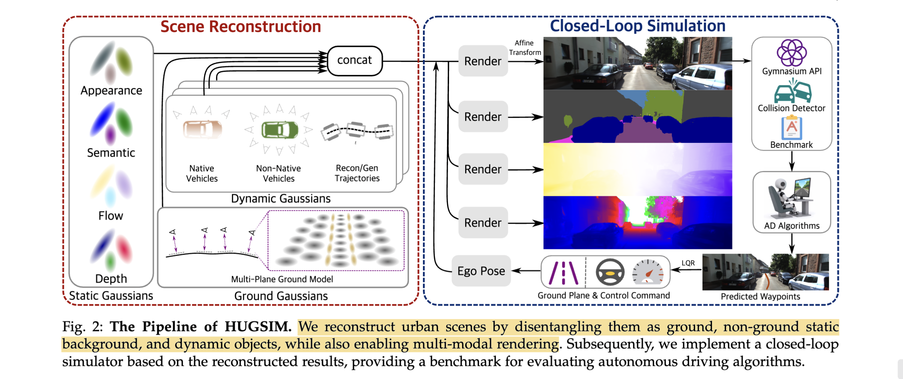

# HUGSIM: A Real-Time, Photo-Realistic and Closed-Loop Simulator for Autonomous Driving

- **Authors:** Hongyu Zhou, Longzhong Lin, Jiabao Wang, Yichong Lu, Dongfeng Bai, Bingbing Liu, Yue Wang, Andreas Geiger, Yiyi Liao
- **Affiliations:** Zhejiang University, Noah's Ark Lab (Huawei), University of Tübingen, Tübingen AI Center
- **Published:** arXiv:2412.01718, December 2024
- **Keywords:** Gaussian Splatting, autonomous driving, closed-loop simulation, novel view synthesis, urban scene reconstruction
- **Webpage:** https://xdimlab.github.io/HUGSIM/
- **GitHub:** https://github.com/hyzhou404/HUGSIM
- **HuggingFace:** https://huggingface.co/papers/2412.01718

---

## Pass 1 — Bird's-Eye View

| C | Assessment |
|---|-----------|
| **Category** | Systems paper combining 3D Gaussian Splatting-based urban scene reconstruction with a closed-loop autonomous driving simulator and benchmark |
| **Context** | Builds on 3D Gaussian Splatting (3DGS), urban scene reconstruction methods (NSG, MARS, StreetGaussian), open-loop AD benchmarks (nuScenes, KITTI), and prior closed-loop simulators (NAVSIM, CARLA, DriveArena) |
| **Correctness** | Assumptions appear sound; extensive ablations on multiple datasets (KITTI, KITTI-360, Waymo, nuScenes, PandaSet) with quantitative and qualitative evaluation; unicycle model for dynamic objects is reasonable |
| **Contributions** | (1) A vision-based closed-loop, photo-realistic, real-time simulator using 3DGS; (2) multi-plane ground model and holistic urban scene decomposition; (3) aggressive actor behavior generation without HD maps; (4) HUGSIM benchmark with 70+ scenes, 400+ scenarios, and the HD-Score metric |
| **Clarity** | Well-written with clear figures, comprehensive tables, and good paper organization; the pipeline figure (Fig. 2) is particularly helpful |

> **Closed-loop vs Open-loop**: Open-loop feeds pre-recorded sensor frames to the AD algorithm and scores predictions against human ground truth — the car never actually moves, so errors don't compound. Closed-loop renders a new frame from the *actual updated* ego pose after each control command, forming a real feedback loop where mistakes accumulate and collisions can occur. Closed-loop requires novel-view synthesis (hence 3DGS) because the ego drifts off the original recorded trajectory.

**30-second summary:** HUGSIM reconstructs urban driving scenes via 3D Gaussian Splatting — decomposing them into static backgrounds, ground planes, and dynamic vehicles — then wraps the reconstruction into a Gymnasium-based closed-loop simulator where AD algorithms receive rendered camera observations and issue control commands. The system introduces a multi-plane ground model for handling sloped roads, a unicycle kinematic model to regularize noisy 3D tracking of dynamic objects, and an aggressive actor behavior planner that works without HD maps. The accompanying HUGSIM benchmark spans 70+ scenes across 5 datasets with 400+ scenarios at varying difficulty, evaluated via the proposed HD-Score metric, revealing significant failure modes in state-of-the-art AD algorithms like UniAD, VAD, and LTF.

---

## Pass 2 — Careful Read

### Core Idea in One Sentence

HUGSIM lifts real-world driving data into a 3D Gaussian Splatting representation that enables real-time, photo-realistic, closed-loop simulation with interactive actors for evaluating autonomous driving algorithms.

### Method / Approach



- **Scene Decomposition:** Urban scenes are split into static Gaussians (background), ground Gaussians (multi-plane model for road surfaces), and dynamic Gaussians (per-vehicle). Each category is optimized with tailored losses and regularizations. Semantics, optical flow, and depth are jointly rendered via the 3DGS framework.

- **Multi-Plane Ground Model:** Instead of assuming a single flat ground plane, the road surface is modeled by multiple local planes with limited spatial extent ($\Delta z$ height constraint), each with a fixed height relative to the nearest camera. This handles sloped roads and avoids floating Gaussians while preserving geometric accuracy.

- **Dynamic Vehicle Modeling:** Noisy 3D bounding boxes from off-the-shelf detectors/trackers are refined using a unicycle kinematic model with learnable velocities ($v_t$ , $\omega_t$ ). Vehicles from 3DRealCar dataset can be inserted as non-native actors with alpha-masked rendering.

- **Closed-Loop Simulation & Aggressive Behaviors:** The scene is wrapped in a Gymnasium environment. Actor behaviors include replayed, normal (IDM car-following), and aggressive (optimization-based trajectory planning to attack the ego vehicle). An LQR controller converts planned waypoints to steering/acceleration commands. The HD-Score metric evaluates driving via no-collision, drivable area compliance, time-to-collision, and comfort sub-scores.

### Key Results

| Dataset | Method | PSNR ↑ | SSIM ↑ | LPIPS ↓ |
|---------|--------|--------|--------|---------|
| KITTI-360 | mip-NeRF | 22.07 | 0.830 | 0.221 |
| KITTI-360 | PNF | 23.09 | 0.867 | 0.174 |
| KITTI-360 | MARS | 23.09 | 0.867 | 0.174 |
| KITTI-360 | **HUGSIM (Ours)** | **23.38** | **0.870** | **0.121** |
| Waymo | NeuRAD | 27.28 | 0.868 | 0.113 |
| Waymo | **HUGSIM (Ours)** | **29.97** | **0.872** | **0.110** |
| nuScenes | NeuRAD | — | — | — |
| nuScenes | **HUGSIM (Ours)** | **25.36** | **0.776** | **0.171** |

- **Ablation — Unicycle model:** Adding the unicycle kinematic regularization with per-frame optimization significantly improves both rendering quality and 3D tracking accuracy on dynamic scenes (PSNR 23.83 → 28.78 on KITTI with 5% bbox noise).
- **Ablation — Ground model:** The $L_{ground}$ regularization eliminates floating Gaussians in extrapolated views, improving KID metrics at a slight cost to interpolated PSNR.
- **Benchmark results:** UniAD achieves the best overall HD-Score but still fails significantly in hard/extreme scenarios. All tested AD algorithms (UniAD, VAD, LTF) struggle with aggressive actors and out-of-distribution scenes.

### Strengths

- **Comprehensive multi-dataset benchmark:** 70+ scenes across KITTI-360, Waymo, nuScenes, PandaSet with 400+ scenarios — far more extensive than prior closed-loop simulators.
- **Real-time rendering:** Achieves ~90 FPS on an RTX 3090, enabling practical closed-loop evaluation with interactive actors.
- **HD-map-free aggressive behaviors:** The spline-based adversarial trajectory planner works without HD maps, making it applicable across all datasets.
- **Holistic scene rendering:** Jointly renders appearance, semantics, depth, and optical flow — semantics are used for collision detection, a practical design choice.
- **3D semantic softmax:** Normalizing semantic logits in 3D space rather than 2D eliminates floaters and improves semantic reconstruction quality.
- **Strong ablations:** Thorough ablation of every component (unicycle model, ground model, exposure modeling, semantic loss, inserted vehicles).

### Weaknesses / Open Questions

1. **Rigid body assumption only:** All dynamic objects are modeled as rigid bodies. Pedestrians, cyclists, and deformable objects are not handled, limiting the diversity of safety-critical scenarios.
2. **Dependence on off-the-shelf perception:** The quality of scene reconstruction relies heavily on pretrained 2D semantic models, 3D tracking, and recognition. Errors in these upstream components propagate into the simulator.
3. **Limited ego-actor interaction:** Normal driving behavior uses a simple IDM car-following model only on nuScenes (the only dataset with HD maps). Other datasets default to constant-speed straight-line driving, which is unrealistic.
   > **HD Map**: High-Definition map — centimeter-level precision maps encoding lane boundaries, stop lines, and road geometry in 3D. Used by AD algorithms for localization and path planning. Requires expensive dedicated scanning vehicles to produce; most public datasets lack them. HUGSIM's aggressive actor planner is specifically designed to work *without* HD maps (spline-based trajectory generation), enabling cross-dataset use.
4. **Single-frame rendering:** Each frame is rendered independently without temporal consistency guarantees, which could introduce flickering in video-based AD evaluation.
5. **No weather/lighting variation:** The simulator renders scenes as captured — there is no augmentation for rain, night, fog, or other adverse conditions that are critical for AD robustness testing.
6. **Camera-only evaluation:** The benchmark only supports RGB-input AD algorithms. LiDAR-based or multi-modal methods cannot be directly evaluated.

### References to Follow Up

1. **"3D Gaussian Splatting for Real-Time Radiance Field Rendering"** — Kerbl et al., SIGGRAPH 2023: The foundational 3DGS paper upon which HUGSIM's entire rendering pipeline is built.
2. **"MARS: An Instance-aware, Modular and Realistic Simulator for Autonomous Driving"** — Wu et al., CICAI 2024: The primary baseline for dynamic urban scene reconstruction comparison.
3. **"NAVSIM: Data-Driven Non-Reactive Autonomous Vehicle Simulation and Benchmarking"** — Dauner et al., NeurIPS 2024: A key competing benchmark that HUGSIM aims to surpass by providing closed-loop evaluation.
4. **"DriveArena: A Closed-loop Generative Simulation Platform for Autonomous Driving"** — Yang et al., 2024: A concurrent closed-loop simulator using a generative approach rather than reconstruction.
5. **"UniAD: Planning-Oriented Autonomous Driving"** — Hu et al., CVPR 2023: The primary AD algorithm evaluated on the HUGSIM benchmark; understanding its architecture is essential for interpreting benchmark results.

---

## Pass 3 — Virtual Re-implementation

### Detailed Technical Summary

**3D Gaussian Splatting Preliminaries.** Each 3D Gaussian is defined by its position $\mu \in R^3$ , rotation $R \in R^{3 \times 3}$ , scale $s \in R^{3}_{+}$ , opacity $\alpha \in [0,1]$ , and spherical harmonic coefficients $f \in R^{k}$ . The 3D covariance matrix is $\Sigma = RSS^TR^T$ where $S = diag(s)$ . A 3D Gaussian is projected to 2D via the viewing transformation $W$ and Jacobian of the projective transformation $J$ , giving 2D covariance $\Sigma' = JW\Sigma W^TJ^T$ . Color is accumulated via alpha-blended volume rendering:

```math
C = \sum_{i \in N} c_i \alpha'_i \prod_{j=1}^{i-1}(1 - \alpha'_j)
```

where $\alpha'_i$ combines the Gaussian opacity with the 2D projected evaluation. The same rendering equation extends to semantics, depth, and optical flow by replacing color $c_i$ with the respective per-Gaussian attribute.

**Scene Decomposition.** The scene is partitioned into three categories of Gaussians:

- *Static Gaussians* model all rigid background elements (buildings, vegetation, road infrastructure). Initialized from SfM point clouds and LiDAR (when available).
- *Ground Gaussians* are constrained to lie on a multi-plane ground model. Each local plane has a fixed height relative to the nearest camera and is limited to spatial extent $\Delta z$ . The optimization target constrains height variance:

```math
L_{ground} = \frac{1}{N-1} \sum_{z_i - z_0 < \Delta z} (\mu^{cam}_{y,i} - \bar{\mu}^{cam}_y)^2
```

This prevents Gaussians from floating in free space while accommodating sloped roads. Ground Gaussians are initialized from multiple small patches of three flat Gaussians each, with height variation learned during training.

- *Dynamic Gaussians* are created per vehicle. Each vehicle's Gaussians are reconstructed in a canonical frame and transformed to world coordinates per timestep using the refined pose from the unicycle model.

**Dynamic Object Modeling with Unicycle Regularization.** Each dynamic vehicle is parameterized by states $(x_t, z_t, \theta_t)$ with learnable forward velocity $v_t$ and angular velocity $\omega_t$ . The unicycle model constrains temporal pose consistency:

```math
L_{uni} = \sum_t \left\| x_{t+1} - x_t - \frac{v_t}{\omega_t}(\sin\theta_{t+1} - \sin\theta_t) \right\| + \sum_t \left\| z_{t+1} - z_t - \frac{v_t}{\omega_t}(\cos\theta_{t+1} - \cos\theta_t) \right\| + \sum_t \left\| \theta_{t+1} - \theta_t - \omega_t \right\|
```

Additional velocity/acceleration smoothness regularization:

```math
L_{reg} = \sum_t \|v_{t+1} + v_{t-1} - 2v_t\|_2 + \sum_t \|\theta_{t+1} + \theta_{t-1} - 2\theta_t\|_2
```

Noisy 3D bounding box predictions from monocular detectors guide initial poses, and the unicycle model refines them during optimization. A bounding box loss $L_t$ constrains predicted box positions $(x_t, z_t)$ to match the noisy detections.

> **TL;DR**: The regularization uses "cars must follow physics" as a prior to smooth out noisy tracker outputs. Ablation shows PSNR on dynamic objects jumps from 23.83 → 28.78 with 5% bbox noise.

**Multi-Modal Rendering.** Beyond RGB, HUGSIM renders:

- *Semantic maps* via 3D softmax: $\pi_{S}: S = \sum_{i \in N} softmax(s_i) \alpha'_i \prod_{j=1}^{i-1}(1-\alpha'_j)$ , where softmax is applied to per-Gaussian logits $s_i$ before alpha compositing (crucially in 3D, not 2D, to avoid floaters).
- *Optical flow* by projecting each Gaussian center $\mu$ to image space at times $t_1$ and $t_2$ , computing the motion vector $f_{t_1 \to t_2} = \mu'_2 - \mu'_1$ , and accumulating via volume rendering.
- *Depth maps* by accumulating per-Gaussian camera-space depth $d_i$ via volume rendering.

**Loss Functions.** Image-based losses combine L1 and SSIM:

```math
L_I = (1 - \lambda_{SSIM})\|\hat{I} - \bar{I}\|_1 + \lambda_{SSIM} SSIM(\hat{I}, \bar{I})
```

Cross-entropy semantic loss $L_{S} = -\sum_{k=0}^{S-1} \bar{S}_k \log(S_k)$ against pseudo-2D labels from a pretrained model. Alpha loss $L_A = \|A - \hat{A}_M\|_2$ for non-native inserted vehicles to ensure proper transparency. Physical regularizations include $L_{ground}$ , $L_{uni}$ , $L_{reg}$ , and $L_t$ .

**Holistic Gaussian Splatting with Exposure Modeling.** An affine exposure transformation per camera maps raw Gaussian colors to account for varying exposure: the camera's extrinsic parameters are mapped to an affine matrix $A \in R^{3 \times 3}$ and bias $b \in R^3$ via a small MLP, giving $C = A\hat{C} + b$ . This is particularly important for scenes with strong exposure variance across cameras.

**Closed-Loop Simulator Architecture.** The simulator is encapsulated as a Gymnasium environment. At each step: (1) the AD algorithm receives rendered RGB observations from the current ego pose; (2) it outputs planned waypoints or control commands; (3) an LQR controller converts waypoints to steering angle $\delta$ and acceleration $a$ ; (4) the ego vehicle state is updated via a kinematic bicycle model:

```math
\frac{dS}{dt} = \begin{pmatrix} v\cos\theta \\ v\sin\theta \\ v\tan\delta / L \end{pmatrix}
```

where $L$ is the vehicle length. Communication between the simulator and AD algorithm uses named pipes for low-latency data transfer.

**Aggressive Driving Behavior.** A spline-based trajectory planner generates feasible attack trajectories for adversarial actors. The attacker minimizes:

```math
C_{total}(s_{1:T}^{a(i)}) = C_{attack}(s_{1:T}^{a(i)}) + \lambda C_{collision}(s_{1:T}^{a(i)})
```

where $C_{attack}$ is the distance score for successful attacks and $C_{collision}$ penalizes collisions with other actors. Attack intensity is controlled by randomly selecting from top-k trajectories sorted by $C_{total}$ .

**HD-Score Evaluation Metric.** At each timestep:

```math
HD-Score_t = \left(\prod_{m \in \{NC, DAC\}} score_m\right) \times \frac{\sum_{w \in \{TTC, COM\}} weight_w \times score_w}{\sum_{w \in \{TTC, COM\}} weight_w}
```

where $NC$ = no collision, $DAC$ = drivable area compliance (driving policy items, multiplicative), and $TTC$ = time-to-collision, $COM$ = comfort (contributory items, weighted average). Final HD-Score is averaged across all timesteps and multiplied by a global route completion score $R_c$ .

**Collision Detection.** Two types: (1) foreground collisions detected via BEV bounding box overlap between ego and actors; (2) background collisions detected by counting ground-semantic Gaussians with low opacity inside the ego's 3D bounding box, triggering a collision if exceeding a threshold.

### Hidden Assumptions

1. **All dynamic objects are rigid bodies** with motion well-approximated by a planar unicycle/bicycle model — excludes pedestrians, articulated vehicles, and any vertical motion.
2. **Pretrained 2D semantic models generalize** to the rendered novel views without domain gap — the pseudo-ground-truth semantics from models like InternImage are assumed reliable.
3. **3D bounding box noise is bounded and approximately Gaussian** — the unicycle regularization assumes noise can be smoothed rather than being systematically biased.
4. **Camera intrinsics are known and accurate** — particularly problematic for nuScenes where the authors note intrinsics are "not well refined" and apply rigid bundle adjustment.
5. **Static background does not change** between training capture and simulation time — weather, lighting, and seasonal changes are ignored.
6. **The ego vehicle's physical dimensions are known** for collision detection via BEV bounding box and background Gaussian counting.
7. **AD algorithms that were trained on real data** will behave comparably when given rendered (synthetic) observations — the domain gap between real and rendered images is assumed negligible.

### Reproducibility Notes

- **Code:** Publicly available at https://github.com/hyzhou404/HUGSIM.
- **Datasets:** Uses publicly available datasets — KITTI, vKITTI, KITTI-360, Waymo, nuScenes, PandaSet. The 3DRealCar dataset for vehicle insertion is also publicly available.
- **Compute:** Experiments conducted on NVIDIA RTX 3090. Rendering achieves ~90 FPS. Reconstruction training time is not explicitly stated but implied to be manageable (5000 optimization steps shown in Fig. 24).
- **Pretrained models:** Relies on InternImage for 2D semantics, QD-3DT for 3D tracking, and pretrained recognition models for monocular 3D detection. These are external dependencies.
- **Hyperparameters:** Loss weights ($\lambda_{SSIM}$ , $\lambda$ for aggressive behavior cost) and ground model parameters ($\Delta z$ ) are not comprehensively listed in the main paper. Some details deferred to appendix.
- **AD algorithm implementations:** UniAD, VAD, and LTF are re-implemented to interface with the Gymnasium API. The specific adaptations (e.g., replacing LiDAR BEV histograms with positional encoding for LTF) may affect reproducibility of benchmark results.
- **Missing:** Exact training schedules per dataset, learning rates, and the number of Gaussians used per scene are not fully specified.

### Ideas for Future Work

1. **Deformable and articulated objects:** Extend beyond rigid-body dynamics to handle pedestrians, cyclists, and articulated vehicles using models like SMPL or skeleton-based Gaussian representations.
2. **Weather and lighting augmentation:** Add physically-based rendering modifications (rain, fog, night, glare) to test AD robustness under adverse conditions while maintaining the photo-realistic quality.
3. **Multi-modal sensor simulation:** Extend to LiDAR point cloud rendering from the Gaussian representation and radar simulation to support multi-modal AD algorithms.
4. **Learned actor behaviors:** Replace the rule-based IDM and optimization-based aggressive planners with learned behavior models (e.g., from real driving data) for more realistic and diverse actor interactions.
5. **Temporal consistency:** Add temporal smoothing or video-based refinement to ensure frame-to-frame consistency in rendered sequences, reducing potential flickering artifacts.
6. **Scalable scene composition:** Enable combining multiple reconstructed scenes or extending scenes beyond the captured trajectory for longer-range simulation.

---

## Pass 4 — Modern Perspective Review (as of June 2026)

### What Has Changed Since Publication

- **Feed-forward Gaussian methods** (e.g., pixelSplat, MVSplat, and successors) have matured, potentially enabling scene reconstruction from fewer views without per-scene optimization, which could dramatically reduce the setup cost for new simulation environments.
- **4D Gaussian Splatting** methods have advanced significantly, offering better temporal consistency and dynamic scene modeling that could address HUGSIM's frame-independent rendering limitation.
- **World models for driving** (e.g., GAIA-1, DriveDreamer, Vista) have emerged as an alternative paradigm for closed-loop simulation using generative video models rather than explicit 3D reconstruction. Trade-off: generative methods offer greater scene diversity and scalability (no per-scene reconstruction needed), but lower geometric fidelity and weaker physical grounding. HUGSIM does **not** provide direct quantitative comparison against these; the paper positions the two approaches as complementary rather than competing.
- **End-to-end AD architectures** have continued evolving beyond UniAD/VAD, with newer models likely requiring updated benchmark evaluations.
- **Gaussian Splatting ecosystem** has expanded with better tooling, faster training, and higher quality rendering, potentially improving reconstruction quality across all datasets.

### Has the Community Accepted the Claims?

HUGSIM has been well-received as a meaningful step toward bridging the gap between open-loop benchmarks and full closed-loop simulation for autonomous driving. The core insight — that 3D Gaussian Splatting provides the right balance of rendering quality and speed for real-time simulation — has been validated by concurrent and follow-up work (StreetGaussian, NeuRAD, DriveArena). The HUGSIM benchmark fills a genuine need, as the community has increasingly recognized that open-loop metrics poorly correlate with actual driving performance. However, the generative world model approach (using diffusion/video models) has also gained significant traction as a complementary paradigm, with some arguing it offers better scalability and scene diversity. The specific technical contributions (multi-plane ground model, unicycle regularization, 3D semantic softmax) are solid engineering solutions that have influenced subsequent reconstruction-based simulator work.

---

### Comparison Papers

#### Predecessors

| Paper | Authors | Year | Relation |
|-------|---------|------|----------|
| 3D Gaussian Splatting for Real-Time Radiance Field Rendering | Kerbl et al. | 2023 | Foundational rendering method that HUGSIM builds upon |
| MARS: An Instance-aware, Modular and Realistic Simulator | Wu et al. | 2024 | Key baseline for modular urban scene reconstruction with NeRF |
| Neural Scene Graphs for Dynamic Scenes | Ost et al. | 2021 | Pioneered compositional neural scene representations for driving |
| Street Gaussians: Modeling Dynamic Urban Scenes | Yan et al. | 2024 | Direct predecessor for Gaussian-based dynamic street scene modeling |
| UniAD: Planning-Oriented Autonomous Driving | Hu et al. | 2023 | Primary AD algorithm evaluated; defines the end-to-end AD paradigm |

#### Contemporaries / Competitors

| Paper | Authors | Year | Relation |
|-------|---------|------|----------|
| DriveArena: A Closed-loop Generative Simulation Platform | Yang et al. | 2024 | Concurrent closed-loop simulator using generative scene generation |
| NeuRAD: Neural Rendering for Autonomous Driving | Tonderski et al. | 2024 | Concurrent NeRF-based approach achieving state-of-the-art NVS for driving |
| NAVSIM: Data-Driven Non-Reactive Autonomous Vehicle Simulation | Dauner et al. | 2024 | Open-loop benchmark that HUGSIM positions against |
| StreetGaussian | — | 2024 | Concurrent work on Gaussian-based urban scene reconstruction |
| RoGS: Large Scale Road Surface Reconstruction | — | 2024 | Concurrent Gaussian-based ground reconstruction for driving scenes |

#### Successors / Extensions

| Paper | Authors | Year | Relation |
|-------|---------|------|----------|
| GAIA-1: A Generative World Model for Autonomous Driving | Hu et al. | 2024 | Generative world model approach as alternative simulation paradigm |
| GaussianDWM: 3D Gaussian Driving World Model | — | 2025 | Extends Gaussian-based driving world modeling with multi-modal generation |
| 4D LangSplat | — | 2025 | Extends dynamic Gaussian representations with language grounding |

---

### Bottom Line

HUGSIM represents a significant and practical contribution to the autonomous driving simulation landscape. Its core value proposition — combining 3D Gaussian Splatting's real-time rendering with a proper closed-loop evaluation framework — addresses a genuine gap between fast-but-unrealistic synthetic simulators (CARLA) and realistic-but-open-loop benchmarks (nuScenes). The paper is worth reading for anyone working on AD simulation, neural scene reconstruction for driving, or AD algorithm evaluation. While generative world models may eventually offer greater scalability, HUGSIM's reconstruction-based approach provides unmatched geometric fidelity and physical grounding. The benchmark itself (70+ scenes, 400+ scenarios, HD-Score metric) is a durable contribution. The paper is not yet superseded — it remains the most comprehensive reconstruction-based closed-loop simulator and a useful reference for the specific technical solutions (multi-plane ground, unicycle regularization, 3D softmax semantics, Gaussian-based collision detection).
