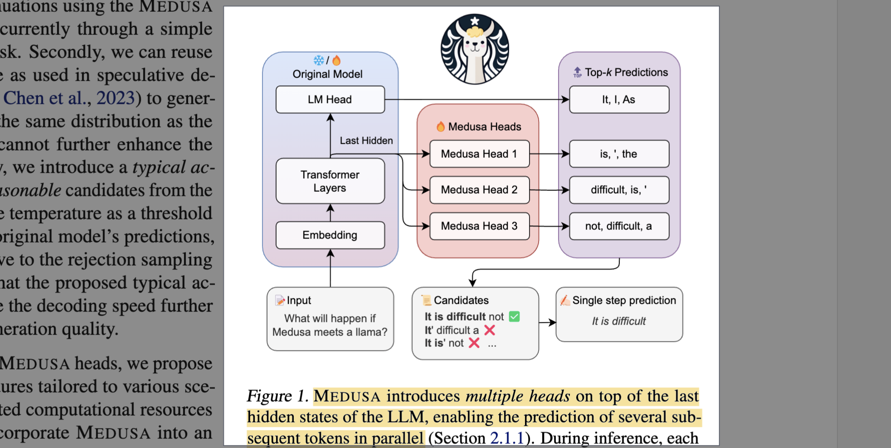
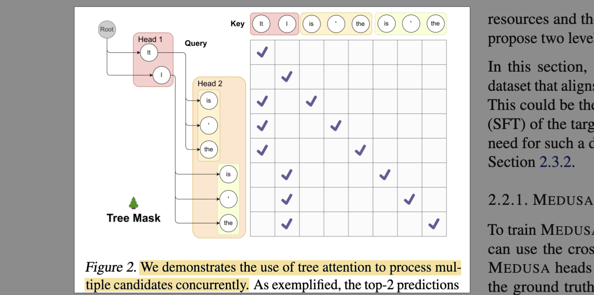

# Medusa: Simple LLM Inference Acceleration Framework with Multiple Decoding Heads

- **Authors:** Tianle Cai, Yuhong Li, Zhengyang Geng, Hongwu Peng, Jason D. Lee, Deming Chen, Tri Dao
- **Affiliations:** Princeton University, Together AI, University of Illinois Urbana-Champaign, Carnegie Mellon University, University of Connecticut
- **Published:** ICML 2024 (PMLR 235); arXiv:2401.10774, Jan 2024 (v3 Jun 2024)
- **Keywords:** LLM inference, speculative decoding, parallel decoding, decoding heads, tree attention, self-distillation
- **GitHub:** https://github.com/FasterDecoding/Medusa
- **HuggingFace:** https://huggingface.co/papers/2401.10774

---

## Pass 1 — Bird's-Eye View

| C | Assessment |
|---|-----------|
| **Category** | Systems/ML method paper for **LLM inference acceleration**. A lightweight, draft-model-free alternative to speculative decoding that bolts extra prediction heads onto a frozen (or jointly trained) backbone. |
| **Context** | Builds directly on speculative decoding[^spec] (Leviathan et al. 2022; Chen et al. 2023), blockwise parallel decoding (Stern et al. 2018, the origin of "multiple heads"), tree-based candidate verification (SpecInfer, Miao et al. 2023), truncation/typical sampling (Hewitt et al. 2022), and parameter-efficient training via QLoRA/LoRA[^lora] (Dettmers et al. 2023; Hu et al. 2021). Backbone models are Vicuna and Zephyr-7B; evaluated on MT-Bench. |
| **Correctness** | Sound and well-supported. The core claim — memory-bandwidth-bound decoding leaves arithmetic idle, so verifying several tokens per step is nearly free — is standard and verified empirically. Medusa-1 is provably distribution-preserving (rejection sampling); the *typical acceptance* extension deliberately trades exact-distribution guarantees for speed, which the paper states openly. No red flags. |
| **Contributions** | (1) **Medusa heads** — extra feed-forward heads predicting tokens $t{+}2, t{+}3, \dots$ in parallel; (2) **tree attention** to verify many candidate continuations in one forward pass; (3) two training recipes — **Medusa-1** (frozen backbone, lossless) and **Medusa-2** (joint training, faster); (4) two extensions — **self-distillation** (no training data needed) and **typical acceptance** (temperature-thresholded acceptance for extra speed). 2.2× (Medusa-1) to 2.3–2.8× (Medusa-2) speedup with no/negligible quality loss. |
| **Clarity** | Clear and practical. Figures 1–2 communicate the architecture and tree mask well; the training recipes and ablations (Table 3's technique ladder) are easy to follow. Some tree-construction details are deferred to appendices. |



**30-second summary.** Autoregressive LLM decoding is memory-bandwidth-bound: each step ships the entire weight matrix from HBM[^hbm] to compute just one token, wasting the accelerator's arithmetic. Speculative decoding hides this by drafting several tokens with a small model and verifying them in parallel, but sourcing/serving a well-aligned draft model is painful. Medusa removes the separate draft model: it attaches $K$ small **decoding heads** on top of the backbone's last hidden state, each predicting one additional future token. Their top-k predictions form a **tree of candidate continuations** that a single **tree-attention** forward pass verifies at once; the longest accepted prefix is committed. **Medusa-1** trains only the heads on a frozen backbone (lossless, trainable on one GPU in hours via a quantized base). **Medusa-2** co-trains heads and backbone for higher acceptance. **Self-distillation** generates training data from the model itself when the original SFT data is unavailable, and **typical acceptance** accepts "sufficiently probable" tokens (temperature-gated) instead of rejection sampling for extra speed. Net result: 2.2–2.8× wall-clock speedup at batch size 1 across Vicuna-7B/13B/33B and Zephyr-7B with essentially unchanged output quality.

---

## Pass 2 — Careful Read

### Core Idea in One Sentence
Instead of a separate draft model, add a few cheap feed-forward heads to an LLM that each predict a different future token, verify all their combined candidate continuations in one tree-masked forward pass, and commit the longest accepted prefix — cutting the number of sequential decoding steps by ~2–3× for free.

### Method / Approach
- **Medusa heads:** For backbone last-hidden-state $h_t$ at position $t$, add $K$ heads. Head $k$ predicts the token at position $t{+}k{+}1$ (the original LM head predicts $t{+}1$). Each head is a single residual FFN layer, initialized so it starts as a copy of the LM head — so training only has to *refine*, not learn from scratch. Recommended $K \le 5$; often 3–4 heads suffice.
- **Tree attention:** Each head emits its top-$s_k$ predictions; the Cartesian product of these forms candidate continuations arranged as a tree. A custom **attention mask** lets each candidate token attend only to its ancestors, and position indices are adjusted per branch, so *all* candidates are verified concurrently in **one** forward pass without inflating the batch dimension.
- **Two training recipes:** **Medusa-1** freezes the backbone and trains only the heads with a weighted cross-entropy ($\lambda_k = 0.8^k$ down-weights harder far-future heads) — lossless, cheap (≈5 h on one A100 for Vicuna-7B), and compatible with a quantized base. **Medusa-2** jointly trains heads + backbone using a combined loss (backbone LM loss + head loss), with differential learning rates and a heads-warmup schedule to avoid distorting the backbone — higher acceptance, higher speedup.
- **Two extensions:** **Self-distillation** — when the original training data is unavailable (or the model went through RLHF[^rlhf]), generate a dataset by prompting the model itself; the backbone is supervised with a KL-to-self distillation loss (via a toggleable LoRA adapter, so no second model in memory). **Typical acceptance** — replace rejection sampling with a threshold that accepts candidate tokens whose *original-model* probability exceeds an entropy-dependent bound, giving longer accepted sequences at higher temperatures (reverts to greedy at temperature 0).


Forward process:
1. **1st LLM forward**: Given the confirmed prefix $(x_0,\ldots,x_{k-1})$, the original LM head predicts (x_k=A), while the Medusa heads propose candidates for future tokens, e.g.$[x_{k+1}\in{B,C}, x_{k+2}\in{D,E,F}.]$
2. **Construct the candidate tree**: Combine the predictions into candidate paths, flatten the tree nodes (A,B,C,D,E,F), and apply the tree-attention mask so that each node can attend only to the confirmed prefix and its ancestors. The KV cache contains the confirmed prefix $(x_0,\ldots,x_{k-1})$;
3. **2nd LLM forward (verification)**: Run the flattened tree through the original LLM. This simultaneously produces next-token predictions conditioned on each valid tree prefix: $[(A)\rightarrow \hat{x}_{k+1}, (AB)\rightarrow \hat{x}_{k+2}, (AC)\rightarrow \hat{x}_{k+2},\ldots]$
4. **Select the longest accepted path**: Under greedy decoding, a candidate token is accepted only if it matches the original LLM's argmax prediction. For example,$[A\rightarrow B, AB\rightarrow D]$ means that the candidate path $(ABD)$ is accepted. If $(A\rightarrow B)$ succeeds but $(AB\rightarrow D)$ fails, only $(AB)$ is accepted.
5. **Higher-temperature decoding**: Instead of requiring an exact argmax match, Medusa uses typical acceptance. A speculative token can be accepted if its probability under the original LLM satisfies an adaptive acceptance criterion. This allows plausible non-argmax candidates—and therefore more diverse candidate paths—to be accepted at higher temperatures.

### Key Results

Medusa-2 across models (MT-Bench; quality is GPT-4 score out of 10; speedup vs vanilla HF autoregressive):

| Model | Acc. rate (avg tokens/step) | Overhead | Quality (Δ vs base) | Speedup vs SpecDecoding | Speedup (Medusa) |
|---|---|---|---|---|---|
| Vicuna-7B | 3.47 | 1.22 | 6.18 (+0.01) | 1.47× | **2.83×** |
| Zephyr-7B | 3.14 | 1.18 | 7.25 (−0.07) | — | **2.66×** |
| Vicuna-13B | 3.51 | 1.23 | 6.43 (−0.14) | 1.56× | **2.83×** |
| Vicuna-33B | 3.01 | 1.27 | 7.18 (+0.05) | 1.60× | **2.35×** |

Per-technique speedup ladder (Vicuna-7B, Table 3):

| Technique | Speedup |
|---|---|
| Medusa-1 heads, no tree attention | ~1.5× |
| + tree attention | ~1.9× |
| + optimized (sparse) tree configuration | ~2.2× |
| + Medusa-2 joint training | ~2.8× |

- **Medusa-1 is lossless:** 2.18× (7B) / 2.33× (13B) speedup with quality matching the base (6.23 vs 6.17). **Direct fine-tuning** the base together with heads (no two-stage recipe) *degrades* quality to 5.925 — motivating Medusa-2's careful joint recipe.
- **Task variation:** biggest gains on structured/predictable outputs — **Coding 3.29×**, **Extraction 3.62×** on Vicuna-7B (MT-Bench categories).
- **Tree size:** sparse (optimized) trees dominate dense random trees — a 64-node sparse tree beats a 256-node dense tree on acceleration *and* speed; beyond a point, larger trees increase acceptance but become compute-bound and slow overall throughput.
- **Typical acceptance:** higher threshold $\epsilon$ → higher quality but lower acceleration; at $\alpha=\sqrt{\epsilon}$ it matches random sampling quality while accelerating.

### Strengths
- **No draft model:** eliminates the hardest part of speculative decoding — training/serving a small model aligned to the target and its distribution — and drops cleanly into distributed serving (heads are just an extra layer, no separate model to schedule).
- **Cheap and accessible:** Medusa-1 trains in a few hours on a single consumer/A100 GPU, even against a *quantized* frozen backbone (QLoRA-style), "democratizing" the acceleration.
- **Distribution-preserving option:** with rejection sampling, Medusa-1 output is provably identical in distribution to the base model — a genuine free lunch.
- **Composable extensions:** self-distillation removes the data requirement; typical acceptance buys extra speed when exactness isn't needed; sparse-tree search squeezes more acceptance per node.
- **Real-world adoption path:** the paper notes integration into TGI and TensorRT-LLM, and generalization beyond batch-size-1.

### Weaknesses / Open Questions
1. **Batch-size-1 focus:** headline numbers assume the local/personal single-request setting. Under high-batch server load the accelerator is already compute-bound, so verifying extra candidate tokens competes for FLOPs and the speedup shrinks — only briefly addressed.
2. **Medusa-2 quality risk:** joint training can degrade the backbone (direct fine-tuning drops to 5.925), requiring careful warmup/differential-LR recipes and, for RLHF models, self-distillation with a distribution mismatch (Vicuna-33B shows lower acceleration, hypothesized to be a train/self-distill data mismatch).
3. **Typical acceptance breaks exactness:** the fast path no longer guarantees the base model's output distribution; the quality/speed tradeoff is threshold-tuned per task.
4. **Head count ceiling:** empirically ≤5 heads help; far-future heads are too uncertain to contribute — Medusa doesn't extend the horizon arbitrarily.
5. **Tree construction cost:** optimal sparse trees need a calibration dataset and a greedy search assuming per-head independence — an offline step whose transferability across prompt distributions is under-explored.

### References to Follow Up
1. **Blockwise Parallel Decoding for Deep Autoregressive Models** — Stern et al., NeurIPS 2018: the direct ancestor — predicting multiple future tokens with extra heads and verifying in parallel; Medusa modernizes it for LLMs.
2. **Fast Inference from Transformers via Speculative Decoding** — Leviathan et al., ICML 2023 (arXiv 2022): the draft-and-verify framework and rejection-sampling acceptance that Medusa reuses without a draft model.
3. **Accelerating Large Language Model Decoding with Speculative Sampling** — Chen et al., 2023: parallel speculative sampling and the serving complexity of separate draft models that Medusa avoids.
4. **SpecInfer: Accelerating LLM Serving with Tree-based Speculative Inference** — Miao et al., 2023: bottom-up tree-of-candidates verification; Medusa uses a top-down head-driven tree instead.
5. **Truncation Sampling as Language Model Desmoothing** — Hewitt et al., EMNLP 2022: the typical/truncation sampling basis for Medusa's typical-acceptance threshold.

---

## Pass 3 — Virtual Re-implementation

### Detailed Technical Summary

**The setup and why it works.** LLM decoding is autoregressive: token $t{+}1$ needs token $t$. At batch size 1 each step reloads the full weight matrix from HBM to produce a single token, so the step is **memory-bandwidth-bound** — arithmetic units sit idle. The insight (shared with speculative decoding) is that a forward pass over $m$ candidate tokens costs almost the same wall-clock time as over 1, because it is still bandwidth-bound. So if we can *cheaply propose* several future tokens and *verify them in one pass*, we convert many sequential steps into few parallel ones.

**Medusa heads.** Given the backbone's last hidden state $`h_t`$ at position $t$ (dimension $d$, vocabulary size $V$), Medusa adds $K$ heads. The $k$-th head predicts the distribution of the token at position $t{+}k{+}1$:

```math
p_t^{(k)} = softmax\!\left( W_2^{(k)} \cdot \left( SiLU(W_1^{(k)} \cdot h_t) + h_t \right) \right), \quad W_2^{(k)} \in \mathbb{R}^{d\times V},\ W_1^{(k)} \in \mathbb{R}^{d\times d}
```

Each head is one feed-forward layer with a **residual connection** and SiLU activation (matching Llama). Crucially, $`W_2^{(k)}`$ is **initialized identically to the original LM head** and $`W_1^{(k)}`$ is **initialized to zero**, so at step 0 each head reproduces the base model's next-token head — training only refines the offset. The original LM head's own prediction is $`p_t^{(0)}`$ (position $t{+}1$).

**Tree attention (parallel verification).** From the heads we have distributions for the next $K{+}1$ positions. Head $k$ contributes its $top-s_k$ candidate tokens. Taking the **Cartesian product** across heads builds a tree of continuations: with $s_1=2, s_2=3$ there are $2\times3=6$ leaf candidates (Fig. 2). The number of new tokens added to the tree is:

```math
\sum_{k=1}^{K} \prod_{i=1}^{k} s_i
```

A **tree attention mask** ensures each candidate token attends only to its **predecessors (ancestors)** along its branch — not to sibling branches — so many candidates coexist in one sequence without cross-contamination, and **positional indices are adjusted** so each branch gets correct relative positions. This lets a single forward pass score every candidate without expanding the batch dimension. The verified logits from that pass also serve as the head inputs for the *next* step, so verification and drafting share compute.

**Medusa-1 loss (frozen backbone).** With ground-truth token $`y_{t+k+1}`$ , the $k$-th head's loss is $`L_k = -\log p_t^{(k)}(y_{t+k+1})`$ . Because far-future heads are inherently more uncertain (larger loss), a decaying weight balances them:

```math
L_{Medusa\text{-}1} = \sum_{k=1}^{K} -\lambda_k \log p_t^{(k)}(y_{t+k+1}), \qquad \lambda_k = (0.8)^k
```

Only the heads are trained; the backbone is frozen and may be **quantized** (QLoRA-style) to fit one GPU.

**Medusa-2 loss (joint training).** To also improve the backbone-conditioned features while preserving next-token quality, add the backbone's own LM loss $`L_{LM} = -\log p_t^{(0)}(y_{t+1})`$ :

```math
L_{Medusa\text{-}2} = L_{LM} + \lambda_0\, L_{Medusa\text{-}1}
```

Stability tricks: (i) **differential learning rates** — larger LR for the fresh heads, smaller for the well-trained backbone; (ii) **heads warmup** — first train heads alone (as Medusa-1), then jointly, optionally ramping $`\lambda_0`$ gradually — to stop the heads' initially huge gradients from distorting the backbone.

**Self-distillation (no original data).** When the SFT/RLHF training set is unavailable, generate a dataset by prompting the model with public seed prompts (ShareGPT/UltraChat) and letting it (self-)reply. Training the backbone on its *own tokens* degrades it, so the backbone is instead supervised to match its own original distribution:

```math
L_{LM\text{-}distill} = KL\!\left( p^{(0)}_{original,t} \,\|\, p^{(0)}_t \right)
```

To avoid holding two models, the "original" model is just the current model **with a LoRA adapter turned off** — the adapter carries the trainable delta, so distillation adds ~no memory.

**Typical acceptance (faster than rejection sampling).** Rejection sampling gets less efficient as temperature rises. Since temperature is usually just a creativity knob, exactness is often unnecessary. Medusa instead accepts a candidate token $`x_{n+k}`$ if it is "typical" — its *original-model* probability clears a hard floor $\epsilon$ or an entropy-scaled floor:

```math
p_{original}(x_{n+k}\mid x_1,\dots,x_{n+k-1}) > \min\!\Big(\epsilon,\ \delta\exp\big(-H(p_{original}(\cdot\mid x_1,\dots,x_{n+k-1}))\big)\Big)
```

where $H(\cdot)$ is entropy, $\epsilon$ a hard threshold and $\delta$ an entropy-dependent one. The **first** token is always greedily accepted (guaranteeing ≥1 token/step); the **longest accepted prefix** across all candidates is committed. At temperature 0 this reduces to greedy decoding (maximal speedup); higher temperature → longer accepted sequences.

**Optimized (sparse) tree construction.** A regular Cartesian tree wastes budget on unlikely deep branches. Using a calibration set, measure $`a_k^{(i)}`$ = accuracy of the $i$-th top prediction of head $k$. Assuming independence, a candidate's expected acceptance is $\prod_j a_j^{(i_j)}$, and the expected accepted length of the whole tree is $\sum_{[i_1,\dots,i_k]\in I}\prod_{j=1}^{k} a_j^{(i_j)}$. Since each node contributes exactly its accuracy to this sum, **greedily add the node with the highest accuracy** connected to the current tree until the node budget is reached — yielding a sparse tree that maximizes expected accepted length per node.

### Hidden Assumptions
1. **Bandwidth-bound regime:** the whole free-lunch argument assumes decoding is memory-bandwidth-bound — true at batch size 1, false under heavy batching where the extra candidate tokens cost real FLOPs.
2. **Local last-hidden-state suffices:** all $K$ future tokens are predicted from a *single* position's hidden state $`h_t`$ , assuming enough future information is linearly recoverable there — which caps the useful horizon at ~5 heads.
3. **Head independence:** the sparse-tree expected-length derivation treats head top-$i$ accuracies as independent, which they are not (errors correlate along a branch).
4. **Calibration transfers:** the optimized tree is tuned on a calibration distribution and assumed to transfer to deployment prompts.
5. **Typicality ≈ quality:** typical acceptance assumes tokens the original model deems sufficiently probable are acceptable substitutes for exact sampling — a quality heuristic, not a guarantee.
6. **Self-distillation coverage:** self-generated data is assumed to cover the deployment distribution well enough that head training generalizes (Vicuna-33B suggests this can fail).

### Reproducibility Notes
- **Code:** official implementation at https://github.com/FasterDecoding/Medusa (heads, tree attention, both training recipes, self-distillation).
- **Data:** ShareGPT (Vicuna-7B/13B, 60k samples for Medusa-1) and UltraChat / self-generated (~100k) for self-distillation cases; Vicuna-33B uses a private set.
- **Compute:** Medusa-1 on Vicuna-7B ≈ 5 h on a single A100 PCIE (60k ShareGPT); Medusa-2 needs more (joint training, seq len 2048–4096, batch 128).
- **Hyperparameters given:** $\lambda_k=0.8^k$; heads init ($`W_2`$ = LM head, $`W_1`$ = 0); ≤5 heads; typical-acceptance $\alpha=\sqrt{\epsilon}$, $\epsilon$ swept 0.01–0.25; sparse trees of 64 nodes competitive.
- **Underspecified:** exact per-head $s_k$ and final tree topologies (deferred to appendices), differential-LR values, warmup schedule length, and calibration-set details for tree search.
- **Eval:** MT-Bench with GPT-4 as judge (0–10); metrics are acceleration rate (avg tokens/step), overhead, wall-clock speedup — all at batch size 1.

### Ideas for Future Work
1. **High-batch Medusa:** adaptive tree size / dynamic head count that scales candidates down as batch load rises to stay ahead of the compute-bound crossover.
2. **Deeper/feature-richer heads:** condition heads on more than one hidden state (or add cross-head attention) to push the useful horizon past ~5 tokens.
3. **Learned tree policy:** replace the independence-assuming greedy tree search with a learned, input-conditioned candidate-tree predictor (a la later EAGLE-style autoregressive heads).
4. **Calibration-free typicality:** online adaptation of $\epsilon,\delta$ per prompt/domain to remove manual threshold tuning.
5. **Better self-distillation alignment:** reduce the train/self-distill distribution mismatch (seen on Vicuna-33B), e.g., importance weighting toward deployment prompts.

---

## Pass 4 — Modern Perspective Review (as of July 2026)

### What Has Changed Since Publication
- **Speculative-family decoding became standard infrastructure.** Draft-model-free, self-drafting acceleration is now a default feature in serving stacks (vLLM, TensorRT-LLM, TGI, SGLang), not a research novelty.
- **EAGLE displaced plain Medusa as the accuracy frontier.** EAGLE / EAGLE-2 / EAGLE-3 add an autoregressive feature-level draft head (predicting the *next hidden feature*, then the token) and dynamic/expanded draft trees, pushing acceptance and speedups well beyond Medusa's fixed independent heads.
- **Tree/dynamic drafting matured.** Sequoia, dynamic-tree and Medusa's own sparse-tree idea evolved into hardware-aware, input-adaptive tree construction; "static Cartesian tree" is now clearly suboptimal.
- **Batch-aware speculation.** The community sharpened Medusa's own caveat: gains concentrate at low batch size; continuous-batching servers use speculation selectively, and research targets the compute-bound crossover.
- **Evaluation moved on.** MT-Bench + GPT-4-judge, central here, has been supplemented/replaced by Arena-style and Spec-Bench acceleration benchmarks; Vicuna/Zephyr backbones gave way to Llama-3, Qwen, Mistral families.

### Has the Community Accepted the Claims?
Yes — Medusa is a widely-cited, adopted milestone. Its central claims held up: extra decoding heads plus tree verification give a real ~2–3× low-batch speedup without a separate draft model, and it shipped in production serving frameworks. What follow-on work *refined* rather than refuted: the fixed, mutually-independent heads leave acceptance on the table, so EAGLE-style autoregressive/feature-conditioned drafters and smarter dynamic trees now dominate leaderboards, and typical acceptance (an exactness-breaking heuristic) is used more cautiously than lossless verification. Medusa is best understood as the paper that *popularized self-drafting* speculative decoding and made it trivially deployable — later methods stand on it.

---

#### Predecessors

| Paper | Authors | Year | Relation |
|---|---|---|---|
| Blockwise Parallel Decoding for Deep Autoregressive Models | Stern et al. | 2018 | Origin of extra multi-token heads + parallel verification; Medusa's direct ancestor |
| Fast Inference from Transformers via Speculative Decoding | Leviathan et al. | 2022/2023 | Draft-and-verify + rejection-sampling framework Medusa reuses (baseline) |
| Accelerating LLM Decoding with Speculative Sampling | Chen et al. | 2023 | Parallel speculative sampling; the draft-model serving pain Medusa removes (baseline) |
| SpecInfer: Tree-based Speculative Inference | Miao et al. | 2023 | Tree-of-candidates verification (bottom-up); Medusa uses a top-down head-driven tree |
| Truncation Sampling as Language Model Desmoothing | Hewitt et al. | 2022 | Basis for the typical-acceptance threshold |
| QLoRA: Efficient Finetuning of Quantized LLMs | Dettmers et al. | 2023 | Quantized single-GPU training enabling cheap head training |
| [Efficient Memory Management for LLM Serving with PagedAttention (vLLM)](../../2023/Efficient_Memory_Management_for_Large_Language_Model_Serving_with_PagedAttention/) | Kwon et al. | 2023 | Serving-system context (KV-cache mgmt) into which Medusa integrates |

#### Contemporaries / Competitors

| Paper | Authors | Year | Relation |
|---|---|---|---|
| Break the Sequential Dependency of LLM Inference Using Lookahead Decoding | Fu et al. | 2023/2024 | Draft-model-free acceleration via Jacobi-style n-gram lookahead (different mechanism) |
| Draft & Verify: Self-Speculative Decoding via Layer Skipping | Zhang et al. | 2023 | Self-drafting by skipping layers of the same model, no extra heads |
| Online Speculative Decoding | Liu et al. | 2023/2024 | Continuously adapts a draft model online — the draft-model path Medusa avoids |
| REST: Retrieval-Based Speculative Decoding | He et al. | 2023/2024 | Drafts continuations from a datastore instead of heads/draft model |

#### Successors / Extensions

| Paper | Authors | Year | Relation |
|---|---|---|---|
| EAGLE / EAGLE-2 / EAGLE-3 | Li et al. | 2024–2025 | Autoregressive feature-level draft head + dynamic draft tree; supersedes Medusa on acceptance/speed |
| Hydra: Sequentially-Dependent Draft Heads | Ankner et al. | 2024 | Makes Medusa's heads sequentially dependent (condition on prior draft) for higher acceptance |
| Sequoia: Scalable, Robust, Hardware-aware Speculative Decoding | Chen et al. | 2024 | Optimal tree construction generalizing Medusa's sparse-tree idea |
| Medusa in TGI / TensorRT-LLM / vLLM | — | 2024+ | Production integrations of Medusa heads into mainstream serving stacks |

**Baselines from the paper's experiments:** vanilla Hugging Face autoregressive decoding (the "w/o Medusa" reference) and standard speculative decoding (Leviathan et al. 2022 / Chen et al. 2023), against which Medusa reports 2.35–2.83× and ~1.5–1.6× relative speedups respectively (Table 1).

---

### Bottom Line
Medusa is a **foundational, still-worth-reading classic** of LLM inference acceleration — the paper that made *self-drafting* speculative decoding simple, cheap, and deployable by replacing the fussy separate draft model with a handful of trainable heads plus tree attention. If you want to understand *why* modern serving stacks speculate and where tree-verification and typical acceptance come from, read it. For state-of-the-art acceptance today, however, go on to EAGLE-3 and dynamic-tree methods: they inherit Medusa's framing but beat its fixed, independent heads. Read Medusa for the concepts and the elegant free-lunch argument; reach for its successors for production numbers.

[^spec]: **Speculative decoding** — inference acceleration where a cheap drafter proposes several future tokens verified in one parallel pass by the target model. See the [glossary](../../common/terms/).
[^lora]: **LoRA** — Low-Rank Adaptation; parameter-efficient fine-tuning learning a low-rank weight delta with the base frozen (QLoRA adds base quantization). See the [glossary](../../common/terms/).
[^hbm]: **HBM** — High-Bandwidth Memory; on-package accelerator DRAM whose bandwidth bottlenecks per-step LLM decoding. See the [glossary](../../common/terms/).
[^rlhf]: **RLHF** — Reinforcement Learning from Human Feedback; preference-based post-training that shifts the model's output distribution away from its SFT data. See the [glossary](../../common/terms/).
