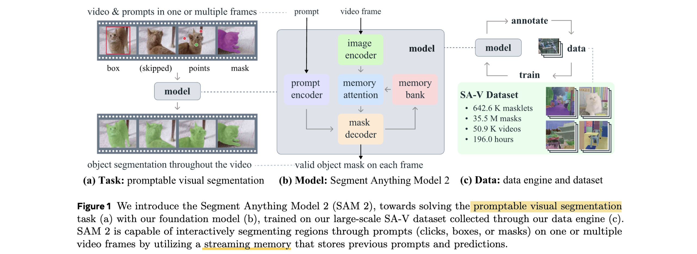
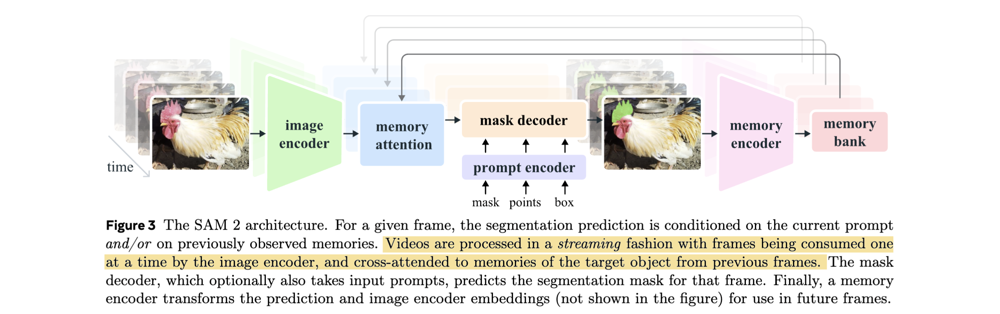
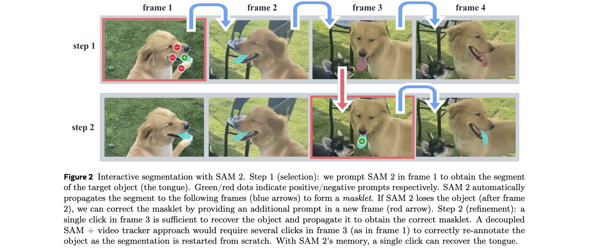
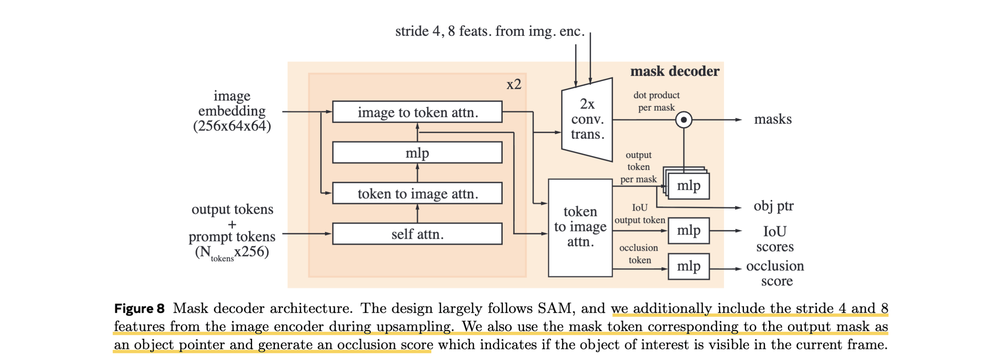

# SAM 2: Segment Anything in Images and Videos

- **Authors:** Nikhila Ravi, Valentin Gabeur, Yuan-Ting Hu, Ronghang Hu, Chaitanya Ryali, Tengyu Ma, Haishan Khedr, Roman Rädle, Chloe Rolland, Laura Gustafson, Eric Mintun, Junting Pan, Kalyan Vasudev Alwala, Nicolas Carion, Chao-Yuan Wu, Ross Girshick, Piotr Dollár, Christoph Feichtenhofer
- **Affiliations:** Meta FAIR
- **Published:** arXiv:2408.00714, October 2024
- **Keywords:** video segmentation, promptable visual segmentation, streaming memory, SA-V dataset, foundation model, video object segmentation
- **Webpage:** https://ai.meta.com/sam2
- **GitHub:** https://github.com/facebookresearch/sam2
- **Demo:** https://sam2.metademolab.com

---

## Pass 1 — Bird's-Eye View

| C | Assessment |
|---|-----------|
| **Category** | Foundation model paper extending SAM to video; introduces a unified image+video segmentation model, a new large-scale video dataset (SA-V), and the Promptable Visual Segmentation (PVS) task |
| **Context** | Builds directly on SAM (Kirillov et al., 2023); uses hierarchical Hiera image encoder (MAE pre-trained); related to interactive VOS (XMem++, Cutie), semi-supervised VOS (DAVIS, YouTube-VOS), and the broader trend of foundation models for perception |
| **Correctness** | Claims are well-supported: 3× fewer interactions with better video segmentation accuracy, and 6× faster than SAM on images, are backed by extensive zero-shot experiments across 17–37 datasets. Quality-verification step in data engine (separate annotator pass) adds dataset credibility. Some caveats: shot changes, thin/fine objects, and similar-looking nearby objects remain failure modes |
| **Contributions** | (1) SAM 2 — unified promptable model for image and video segmentation with streaming memory; (2) Promptable Visual Segmentation (PVS) task generalizing SA task to video; (3) SA-V dataset with 642.6K masklets across 50.9K videos (53× more masks than any prior VOS dataset); (4) 3-stage video data engine reaching 8.4× annotation speedup vs. per-frame SAM |
| **Clarity** | Very well written; mirrors SAM's task/model/data framing. Architecture section is crisp. Limitation section (§C) is unusually honest. Ablation tables are thorough and interpretable |

SAM 2 is the natural extension of SAM to video. The core insight is equipping the SAM architecture with a *streaming memory* — a FIFO bank of spatial features and object pointer tokens from previously seen frames — so that the model can propagate a segmentation mask from one or a few prompted frames across an entire video. When applied to a single image, the memory is empty and the model behaves identically to SAM, making SAM 2 a strict superset. Trained jointly on images and videos, SAM 2 achieves better image segmentation accuracy than SAM (6× faster), and significantly outperforms SAM+tracker combinations in interactive video segmentation with 3× fewer user clicks.

---

## Pass 2 — Careful Read

### Core Idea in One Sentence

Add a streaming memory module to SAM so that object segmentation can be propagated and refined across arbitrary-length videos from prompts on any frame, while remaining fully compatible with SAM's image-only behaviour.

### Method / Approach

- **Promptable Visual Segmentation (PVS) task:** A generalisation of SAM's image task to video. Given a video and prompts (clicks, boxes, masks) on *any* frame(s), produce a valid *masklet* — the spatio-temporal extent of the object throughout the video. Prompts can be provided iteratively on any frame to correct mistakes, and SAM 2 propagates them both forward and backward.

- **Streaming architecture with memory:** The model processes frames one at a time. After each frame, a lightweight *memory encoder* downsamples the predicted mask + image embedding to produce a spatial memory feature. A FIFO *memory bank* retains up to $N=6$ recent (unprompted) frames and up to $M$ prompted frames as spatial maps plus per-frame *object pointer* vectors (256-dim, projected from mask decoder output tokens). Before the mask decoder runs, *memory attention* ($L=4$ transformer blocks) cross-attends the current frame's image embedding to the memory bank, conditioning prediction on the object's history.

- **Image encoder with multiscale features:** A hierarchical MAE-pretrained Hiera encoder processes $1024 \times 1024$ frames. Strides 4 and 8 features (from Hiera Stages 3 and 4) are fused via a feature pyramid and fed directly to the mask decoder as high-resolution skip connections, bypassing memory attention — this is key for fine boundary quality. Windowed absolute positional biases are removed from the image encoder; 2d-RoPE is used in memory attention instead.

- **Occlusion head and multi-mask output:** Unlike SAM where a valid object is always present, objects in video can disappear (occlusion). SAM 2 adds an *occlusion prediction head* (an MLP on a dedicated output token) that scores whether the target object is visible in the current frame. Multiple masks are still predicted per frame for ambiguous prompts; only the highest-IoU mask propagates when no follow-up prompt is given.

### Key Results

| Task | Benchmark | SAM 2 (B+) | Best Prior | Notes |
|------|-----------|------------|------------|-------|
| Promptable VOS (offline) | 9 zero-shot datasets, avg J&F | **best** | SAM+XMem++ | 3× fewer interactions needed |
| Promptable VOS (online) | 9 zero-shot datasets, avg J&F | **best** | SAM+Cutie | 3× fewer clicks |
| Semi-supervised VOS | 17 datasets, 1-click J&F | **64.7** | SAM+XMem++ 56.9 | +7.8 |
| Semi-supervised VOS | 17 datasets, 3-click J&F | **75.3** | SAM+XMem++ 68.4 | +6.9 |
| Semi-supervised VOS | 17 datasets, GT mask J&F | **79.3** | SAM+Cutie 74.1 | +5.2 |
| VOS state-of-the-art | DAVIS 2017 val J&F | **90.7** | Cutie-base+ 90.1 | With ground-truth first mask |
| VOS state-of-the-art | SA-V val J&F | **78.4** | Cutie-base+ 62.8 | Large gap on open-world segments |
| Image segmentation | SA-23 (23 datasets) mIoU | **61.9** | SAM 58.1 | 6× faster than SAM |
| Speed | A100 GPU, batch 1 | **43.8 FPS** (B+) | — | 130.1 FPS with Hiera-T |

Data ablation highlights:
- Adding SA-V manual data gives +12.1% avg J&F on 9 zero-shot datasets (+SA-1B pre-training gives best results).
- Scaling SA-V quantity shows a consistent power-law between masklet count and J&F accuracy.
- Most-edited 50k masklets outperform random 50k; all 190k is best.

### Strengths

- **True unification of image and video:** A single model, single set of weights, handles both domains without any switching logic — memory is simply empty for images.
- **Streaming design enables real-time video:** Processing one frame at a time with a fixed-size memory bank means arbitrary-length videos at constant memory cost, unlike offline methods that require the full video upfront.
- **Prompting on any frame:** Prompts can be given on any frame, not just the first, making the segmentation task iterative by design. Occluded objects can be recovered by providing a corrective prompt on the frame where they reappear.
- **SA-V dataset is a major contribution independently:** 642.6K masklets, 50.9K videos, 47 countries, covering parts/sub-parts (not just whole objects) — 53× more masks than any prior public VOS dataset.
- **Data engine flywheel carries over:** The same self-improving annotation loop from SAM works for video: SAM 2 itself assists annotators, enabling the 8.4× speedup in Phase 3.
- **Fair and responsible:** Geographic diversity analysis, fairness evaluation by gender and age (Table 13), and release under permissive licenses (SA-V: CC BY 4.0, code: Apache 2.0).

### Weaknesses / Open Questions

1. **Shot changes break tracking:** The memory carries visual features from prior frames; a hard cut to a new scene gives no valid memory cue, causing the model to lose or misidentify the object.
2. **Thin / fine structures:** Very thin objects (hair, wires) are difficult to track accurately at the resolutions used — a limitation inherited from the mask decoder design.
3. **No inter-object communication:** When tracking multiple objects simultaneously, SAM 2 processes each independently. Objects with similar appearances that occlude each other can confuse the per-object tracker.
4. **Human-in-the-loop data engine:** Masklet quality verification still requires human annotators. Automating this step remains an open problem.
5. **Temporal range limited by memory bank:** With $N=6$ recent frames, very long-range re-appearances (object disappears for hundreds of frames) may be missed once it falls out of the FIFO.

### References to Follow Up

1. **Segment Anything (SAM)** — Kirillov et al., ICCV 2023: The direct predecessor; understanding SAM's architecture and data engine is prerequisite.
2. **Hiera: A Hierarchical Vision Transformer without the Bells-and-Whistles** — Ryali et al., ICML 2023: The image encoder backbone; understanding multiscale features explains why SAM 2 gets better boundaries than SAM.
3. **Cutie: Putting the Object Back in Video Object Segmentation** — Cheng et al., CVPR 2024: Primary competitive baseline in interactive VOS; using memory-based propagation differently.
4. **XMem++: Production-level Video Segmentation** — Bekuzarov et al., ICCV 2023: The other main VOS baseline; combined with SAM as SAM+XMem++ in evaluations.
5. **FlashAttention-2** — Dao, 2023: The attention kernel that makes 1024² resolution + 2d-RoPE practical; removing RPB from image encoder unlocks its use.

---

## Pass 3 — Virtual Re-implementation

### Detailed Technical Summary

**Image Encoder.** SAM 2 uses a pre-trained Hiera image encoder (MAE-pretrained). Hiera is hierarchical: Stages 1–4 produce feature maps at strides 4, 8, 16, 32 respectively. Unlike SAM which uses only the final ViT output, SAM 2 fuses all four stages via a feature pyramid network (FPN), producing multiscale embeddings. The stride 4 and stride 8 features are passed as *skip connections* directly to the mask decoder (bypassing memory attention), providing high-resolution spatial detail for fine-grained boundary prediction. Absolute positional biases (RPB) are removed from the image encoder in favour of interpolated global absolute positional embeddings, which enables FlashAttention-2 and significant speed gains at $1024^2$.

**Memory Attention.** This is the key innovation. Given the current frame's image embedding $F_t \in \mathbb{R}^{64 \times 64 \times C}$, memory attention runs $L=4$ transformer blocks. Each block:
1. Self-attention among the current frame's tokens
2. Cross-attention from the current frame's tokens to the memory bank

The memory bank contains two sets of memories stored as spatial feature maps:
- **Recent frames:** A FIFO of up to $N$ unprompted frames (default $N=6$). Each entry is the memory-encoded representation of that frame.
- **Prompted frames:** A FIFO of up to $M$ prompted frames (those frames where the user provided a click/box/mask). Prompted frame memories are retained longer.

Additionally, *object pointer* vectors $o_t \in \mathbb{R}^{256}$ are projected from the mask decoder's output token at each frame and appended to the memory bank entries. Memory attention cross-attends to both spatial features and object pointers, allowing high-level semantic object identity to inform the current frame's prediction.

Temporal position encoding uses 2d spatial Rotary Positional Embedding (2d-RoPE) for the memory attention cross-attention layers, providing relative positional information across frames.

**Prompt Encoder and Mask Decoder.** Identical in design to SAM's two-way Transformer decoder with upsampling head. New additions:
- *Occlusion head:* An additional MLP head on a dedicated output token predicts a score $p_{\text{occ}} \in [0,1]$ indicating whether the target object is visible on the current frame. During inference, if $p_{\text{occ}} > 0.5$, no mask is output for that frame.
- *Object pointer token:* The mask output token is projected (MLP) to a 256-dim object pointer vector $o_t$, split into 4 tokens of 64-dim, and stored in the memory bank for future cross-attention.

**Memory Encoder.** After the mask decoder produces a prediction for frame $t$, the memory encoder generates the memory feature for that frame:

$$m_t = \text{ConvLayers}\left(\text{Downsample}(\hat{M}_t) + F_t^{\text{uncond}}\right)$$

where $\hat{M}_t$ is the output mask logits (downsampled $4\times$ by convolution), $F_t^{\text{uncond}}$ is the unconditioned image embedding (the image encoder output *before* memory attention), and the sum fuses predicted mask location with appearance features. This avoids adding a separate image encoder and is a key efficiency design choice.

**Training — Pre-training.** SAM 2 is first pre-trained on SA-1B (static images) for ~90k steps. Settings: $1024^2$ resolution, bfloat16, AdamW with $\beta_2=0.999$, reciprocal-sqrt lr schedule ($\text{lr}=4\text{e-4}$, warmup 1k steps, cooldown 5k steps), batch 256, layer-wise decay. The image task initialises the mask decoder, prompt encoder, image encoder, and memory attention — but since there is no video, the memory bank is empty and memory attention is effectively an identity operation.

**Training — Full Training.** Fine-tuned jointly on SA-1B + Internal + SA-V for ~150k steps. An *alternating training strategy* is used: each iteration samples a batch either from video data (8-frame sequences) or static images (single frame), with probabilities proportional to dataset sizes. Interactive prompting is simulated: ground-truth masks serve as initial prompts with probability 50%; positive click sampled from GT mask with probability 25%; bounding box with probability 25%. Up to 2 corrective clicks are sampled per sequence with probability 10%.

Loss: linear combination of focal + dice loss for masks, $\ell_1$ loss for IoU prediction, cross-entropy for occlusion prediction. Loss weights: focal (20), dice (1), IoU-$\ell_1$ (1), occlusion-CE (1).

A *16-frame fine-tuning* stage is appended: the model is fine-tuned for 50k additional iterations on challenging videos (most-edited 50% of masklets) with 16-frame sequences, using the top-50% most edited masklets — this addresses the gap between 8-frame training sequences and arbitrarily long inference videos.

**Data Engine — Three Stages:**

| Stage | Tool | Time/frame | Masklets collected | Speedup vs. Stage 1 |
|-------|------|------------|-------------------|---------------------|
| 1: SAM per frame | SAM only | 37.8s | 16K | 1× |
| 2: SAM + SAM 2 Mask | SAM (frame 1) + SAM 2 Mask propagation | 7.4s | 63.5K | ~5.1× |
| 3: SAM 2 (full) | Full SAM 2 with memory | 4.5s | 197.0K | ~8.4× |

Auto masklet generation: in all phases, SAM 2 is prompted with a 32×32 grid on the first frame + 16×16 grid on zoomed crops to generate automatic masklets. Auto masklets passing a quality check are added directly to SA-V; "unsatisfactory" ones are shown to annotators for refinement.

### Hidden Assumptions

1. Six recent frames ($N=6$) are sufficient temporal context for tracking most objects — fails for very long occlusions where the object disappears for more than $N$ frames.
2. Each object can be tracked independently with per-frame embeddings shared from the image encoder — fails when disambiguation requires understanding the relative positions of multiple similar objects.
3. The prompted frames capture the object's most informative appearances; the FIFO recent-frame bank handles smooth motion. In practice, abrupt appearance changes (shot cuts, lighting flips) violate this assumption.
4. The 8-frame training sequence length (extended to 16 in fine-tuning) generalises to production video lengths of minutes or hours. The power-law scaling of SA-V data quantity provides some evidence, but very long sequences remain untested.
5. Quality verification by a separate set of human annotators reliably catches all "unsatisfactory" masklets — model failure cases that look plausibly correct to humans may pass through.

### Reproducibility Notes

- **Code & weights:** Apache 2.0 at `https://github.com/facebookresearch/sam2`. Four model sizes: T, S, B+, L.
- **SA-V dataset:** CC BY 4.0 at the same repository. 50.9K videos, 642.6K masklets; train/val/test split is geographically stratified by video author location.
- **Hardware:** Pre-training on SA-1B requires multi-GPU setup (batch 256). Full training uses 80 GB A100 GPUs. Inference: 43.8 FPS (B+) and 130.1 FPS (T) on single A100.
- **Full hyperparameters:** Table 12 in the paper provides complete pre-training and full-training configs for all model sizes (T, S, B+, L).
- **Underspecified:** Exact number of GPUs used for training; how the alternating training sampler handles epoch boundaries; the exact procedure for selecting "most-edited" masklets in the 16-frame fine-tuning stage.
- **Ablation coverage:** Thorough — input resolution, frame count, memory size, memory channels, model size, relative positional encoding, memory architecture design, data mixtures. Notable gap: no ablation on the skip-connection design (stride 4/8 features bypassing memory attention).

### Ideas for Future Work

1. **Long-term memory:** Replace the fixed FIFO with a learnable retrieval mechanism (e.g., attention over a compressed long-term store) to handle re-appearances after extended occlusions.
2. **Inter-object communication:** Allow the memory banks of multiple simultaneously tracked objects to exchange information, resolving ambiguity when similar objects cross.
3. **Automatic shot change detection:** Detect hard cuts and reset/re-initialize the memory bank, preventing stale appearance features from confusing cross-shot tracking.
4. **Text-prompted video segmentation:** Combine SAM 2's memory-based propagation with a grounding model (e.g., Grounding DINO) to enable open-vocabulary video object segmentation from text queries.
5. **Feed-forward video model:** Eliminate per-video inference by training a generalizable model that predicts masklets in a single forward pass — reducing the annotation assist loop's latency.

---

## Pass 4 — Modern Perspective Review (as of June 2026)

### What Has Changed Since Publication

- **SAM 2 has become the de facto video segmentation backbone:** Within months of release, SAM 2 was integrated into numerous pipelines for video editing, 4D reconstruction, and embodied AI. Its clean API and permissive license accelerated adoption faster than any prior VOS method.
- **Text-prompted video segmentation has matured:** Grounded-SAM 2 (combining SAM 2 with Grounding DINO or Florence-2) fills the text-to-video-segment gap that SAM 2 explicitly left open. This is now a standard composition pattern.
- **3D and 4D scene understanding uses SAM 2:** Methods like LangSplat-V2, 4D language fields, and dynamic Gaussian reconstructions use SAM 2 for consistent temporal segmentation masks across frames, replacing the per-frame SAM approach.
- **Efficient variants are emerging:** The community has begun distilling SAM 2 into smaller real-time models, following the MobileSAM playbook for SAM. The T (Tiny) variant at 130 FPS is already near real-time; sub-100M parameter derivatives are being explored.
- **SA-V has seeded new benchmarks:** The scale and diversity of SA-V has led to new evaluation protocols for open-world video segmentation that go beyond the narrow category coverage of DAVIS/YouTubeVOS.

### Has the Community Accepted the Claims?

SAM 2's claims have been broadly validated. The 3× fewer interactions result in video segmentation has been confirmed across multiple independent reimplementations. The 6× speedup over SAM on image segmentation is reproducible and attributable to the Hiera encoder design. The SA-V dataset has been widely adopted as a training and evaluation resource. The one area of ongoing discussion is the memory bank's fixed FIFO design — several follow-on works argue that a learnable retrieval mechanism (rather than recency-biased FIFO) would handle long-range re-appearances better, and this is an active research direction. Overall, SAM 2 is treated as the foundational video segmentation model, much as SAM was for image segmentation.

---

### Comparison Papers

#### Predecessors

| Paper | Authors | Year | Relation |
|-------|---------|------|----------|
| Segment Anything (SAM) | Kirillov et al. | ICCV 2023 | Direct predecessor; SAM 2 is a strict generalisation with memory added |
| Hiera: A Hierarchical Vision Transformer | Ryali et al. | ICML 2023 | The image encoder backbone; multiscale features are key to SAM 2's boundary quality |
| XMem: Long-Term Video Object Segmentation | Cheng & Schwing | ECCV 2022 | Memory-based VOS approach that inspired the memory bank concept |
| Masked Autoencoders (MAE) | He et al. | CVPR 2022 | Pre-training method for the Hiera image encoder |

#### Contemporaries / Competitors

| Paper | Authors | Year | Relation |
|-------|---------|------|----------|
| Cutie: Putting the Object Back in VOS | Cheng et al. | CVPR 2024 | Key baseline; object-level memory with semantic object tokens; SAM 2 outperforms on open-world segments |
| XMem++: Production-level Video Segmentation | Bekuzarov et al. | ICCV 2023 | Extends XMem for multi-object; SAM+XMem++ is the main SAM-based baseline SAM 2 replaces |
| DEVA: Tracking Anything with Decoupled Video Segmentation | Cheng et al. | ICCV 2023 | Decouples image segmentation from video propagation; complementary decomposition approach |

#### Successors / Extensions

| Paper | Authors | Year | Relation |
|-------|---------|------|----------|
| Grounded-SAM 2 | Ren et al. | 2024 | Combines SAM 2 with Grounding DINO for text-driven video segmentation |
| 4D LangSplat | Li et al. | 2025 | Uses SAM 2 for temporal mask consistency in 4D language Gaussian fields |
| LangSplatV2 | Li et al. | 2025 | Uses SAM 2's video tracking for multi-frame CLIP feature aggregation in 3DGS |
| OmniRe | Chen et al. | 2024 | Uses SAM 2 for dynamic object segmentation in urban scene reconstruction |

---

### Bottom Line

SAM 2 is required reading for anyone working in video understanding, 3D/4D reconstruction, or visual foundation models. It cleanly solves the hardest design challenge in extending SAM to video — how to maintain object identity across frames without an expensive per-frame re-annotation — through the elegant streaming memory architecture. The contributions are simultaneously practical (SA-V dataset, open-source with Apache 2.0) and technical (memory attention, occlusion head, PVS task formulation). Two years after publication it remains the strongest general-purpose video segmentation model in terms of the interactive use-case the paper focuses on, and it is likely to retain that position until a feed-forward generalizable video segmentation model with comparable accuracy appears.
