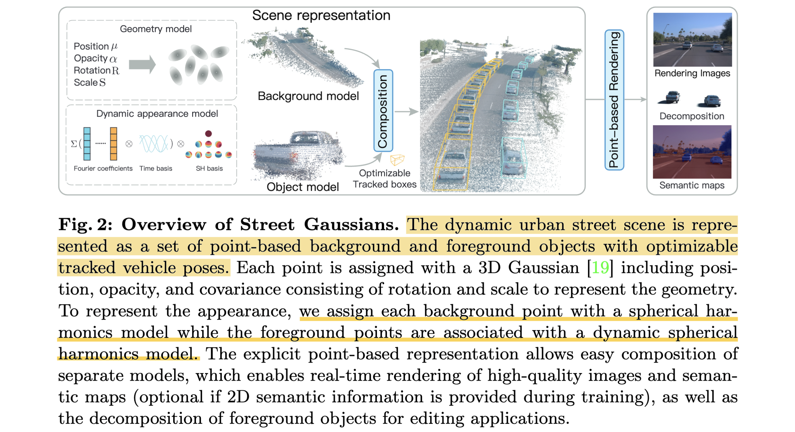

# Street Gaussians: Modeling Dynamic Urban Scenes with Gaussian Splatting

- **Authors:** Yunzhi Yan, Haotong Lin, Chenxu Zhou, Weijie Wang, Haiyang Sun, Kun Zhan, Xianpeng Lang, Xiaowei Zhou, Sida Peng  
- **Affiliations:** Zhejiang University, Li Auto  
- **Published:** arXiv:2401.01339v3, 18 Aug 2024  
- **Keywords:** 3D Gaussian Splatting, View Synthesis, Dynamic Urban Scenes, Autonomous Driving

---

## Pass 1 — Bird's-Eye View

### Five Cs

| C | Assessment |
|---|-----------|
| **Category** | System design paper — a novel explicit scene representation for dynamic urban street reconstruction and real-time novel view synthesis |
| **Context** | Builds directly on 3D Gaussian Splatting (Kerbl et al. 2023). Competes with NeRF-based dynamic scene methods: NSG (CVPR 2021), MARS (CICAI 2023), EmerNeRF (ICLR 2024). Uses standard autonomous driving data (LiDAR + camera + tracked 3D bounding boxes). |
| **Correctness** | Assumptions appear valid. The rigid-body motion assumption holds for vehicles. The 4D SH model is a reasonable approximation for time-varying vehicle appearance. LiDAR-based initialization is a well-grounded engineering choice. |
| **Contributions** | (1) Street Gaussians, a compositional 3D Gaussian scene representation for dynamic urban scenes. (2) 4D spherical harmonics model for time-varying appearance. (3) Tracked pose optimization — treats noisy tracker outputs as learnable parameters. (4) LiDAR initialization + sky cubemap for scene completeness. |
| **Clarity** | Well written. Figures are clear and the ablation table covers all design choices. |

### 30-Second Summary

Street Gaussians decomposes a dynamic urban street into a static 3D Gaussian background and a set of per-vehicle 3D Gaussian point clouds, each transformed to world coordinates via optimizable tracked poses. Foreground vehicle appearance is modeled with a 4D spherical harmonics model (Fourier-parametrized SH coefficients over time), and the scene is rendered by compositing all point clouds and α-blending onto the image plane. The result is 135 FPS rendering at 1066×1600 resolution after only 30 minutes of training, outperforming prior NeRF-based methods by over 12% in PSNR and 100× in rendering speed on Waymo and KITTI benchmarks.

---

## Pass 2 — Careful Read

### Core Idea in One Sentence

Represent a dynamic urban street as a compositional set of 3D Gaussian point clouds — one for the static background, one per vehicle — with time-varying appearance encoded via 4D spherical harmonics, enabling real-time rendering after fast optimization.

### Method / Approach



- **Compositional scene representation**: Background and each foreground vehicle are modeled as separate 3D Gaussian point clouds. Each Gaussian stores position, covariance (rotation + scale), opacity, spherical harmonics color coefficients, and semantic logits.
- **4D spherical harmonics for vehicle appearance**: Each SH coefficient `z_{m,l}` is replaced by `k=5` Fourier transform coefficients. At timestep `t`, the SH value is recovered via an Inverse Discrete Fourier Transform: `z_{m,l} = Σ f_i cos(iπt/N_t)`. This encodes time-varying lighting/appearance compactly without per-timestep SH storage. (See [object-model-detail](#object-model-detail))
- **Tracked pose optimization**: Off-the-shelf tracker poses are treated as noisy initializations. A learnable yaw offset `Δθ_t` and translation offset `ΔT_t` are added to each tracked pose and jointly optimized, so the model can self-correct noisy detections via backpropagation through the Gaussian renderer. (Author doesn't mention why they only optimize yaw angle)
- **Initialization + sky modeling**: Background initialized with LiDAR point cloud (voxel-downsampled at 0.15 m) + SfM points from Colmap. Object clouds initialized with aggregated LiDAR points inside tracked 3D bounding boxes. Sky modeled with a 1024-resolution cubemap (background Gaussians cannot represent distant sky well in Euclidean space).

### Key Results

| Dataset | Metric | Best Baseline | Street Gaussians |
|---------|--------|--------------|-----------------|
| Waymo | PSNR↑ | 30.87 (EmerNeRF) | **34.61** |
| Waymo | PSNR\*↑ (moving objects) | 26.54 (MARS) | **30.23** |
| Waymo | FPS↑ | 205 (3D GS, no dynamics) | 135 |
| Waymo | Training time | 18+ hours (MARS) | **30 min** |
| KITTI-75% | PSNR↑ | 24.23 (MARS) | **25.79** |
| VKITTI2-75% | PSNR↑ | 29.63 (MARS) | **30.10** |
| KITTI | Semantic mIoU↑ | 57.94 (VKN GT) | **58.81** |

Ablation shows each component contributes:
- Without LiDAR: PSNR* drops to 29.53 (LiDAR most impactful for dynamic objects) (Use SfM for background, random initialization for moving objects)
- Without 4D SH: PSNR* drops to 29.27
- Without pose optimization: PSNR* drops to 28.24 (worse than even GT poses at 29.84, suggesting the optimization corrects annotation noise too)

### Strengths

- **Speed**: Two orders of magnitude faster training and rendering than NeRF-based methods
- **Compositional representation**: Clean separation enables scene editing (vehicle rotation, translation, swapping) and high-fidelity object decomposition as a byproduct
- **Pose robustness**: Pose optimization achieves results comparable to or better than ground-truth pose annotations — a strong practical advantage
- **Semantic representation**: The 3D Gaussian semantic logits achieve better mIoU than 2D video prediction baselines (58.81 vs 53.81), since 3D fusion resolves ambiguities like shadows

### Weaknesses / Open Questions

- **Rigid-body only**: Cannot handle non-rigid dynamic objects (pedestrians, cyclists). Acknowledged in limitations.
- **Tracker dependency**: If the off-the-shelf detector misses a vehicle, it is permanently absent; pose optimization cannot compensate for undetected objects.
- **Per-scene optimization**: No generalization across scenes; each sequence requires a fresh 30-minute training run.
- **LiDAR required**: Initialization and depth loss both use LiDAR; camera-only performance degrades noticeably (though still beats NeRF baselines).
- **Yaw-only pose correction**: Only yaw offset is optimized for rotation; pitch and roll errors in tracker output remain uncorrected.
- **Sky edge artifacts**: Blending the cubemap with Gaussian color at sky/non-sky boundaries can still produce artifacts.

### References to Follow Up

1. **3D Gaussian Splatting** — Kerbl et al., TOG 2023 [ref 19]: The foundational explicit scene representation this work extends
2. **MARS** — Wu et al., CICAI 2023 [ref 64]: Primary NeRF-based competitor; instance-aware, modular
3. **NSG (Neural Scene Graphs)** — Ost et al., CVPR 2021 [ref 39]: Compositional NeRF for dynamic scenes, most architecturally similar prior work
4. **EmerNeRF** — Yang et al., ICLR 2024 [ref 69]: Concurrent emergent spatiotemporal decomposition; strong on Waymo
5. **4D Gaussian Splatting** — Yang et al., ICLR 2024 [ref 73]: Concurrent general 4D Gaussian approach; relevant for understanding the design space

---

## Pass 3 — Virtual Re-implementation

### Detailed Technical Summary

#### Scene Representation

A dynamic scene at timestep `t` is the union of:
- One **background model** `B`: a global 3D Gaussian point cloud in world coordinates
- `N` **object models** `{O_n}`: each a 3D Gaussian point cloud in its local (canonical) coordinate system

Each Gaussian point stores: position `μ ∈ ℝ³`, covariance `Σ = RS S^T R^T` (diagonal scale matrix `S`, unit quaternion rotation `R`), opacity `α ∈ ℝ`, SH color coefficients `z`, semantic logit `β`.

#### Background Model Detail

- Initialized: LiDAR point cloud (voxel downsampled at 0.15 m) + SfM points from Colmap (camera poses treated as known; moving object pixels masked out during feature extraction)
- Colors initialized by projecting LiDAR points to the nearest frame and reading pixel color
- SH degree: 1 (reduced from standard 3 to prevent overfitting in urban scenes with less view-dependent appearance)
- Semantic: M-dimensional logit vector `β_b ∈ ℝ^M`

#### Object Model Detail

- Position and rotation in local object frame: `μ_o`, `R_o`
- World-frame transform: `μ_w = R_t μ_o + T_t`, `R_w = R_t R_o`
- Tracked poses: `{R_t, T_t}_{t=1}^{N_t}` from off-the-shelf tracker (CasA detector + 3D MOT tracker for Waymo; official tracklets for KITTI)
- **4D SH**: each SH coefficient `z_{m,l}` is parameterized by `k=5` Fourier coefficients `f ∈ ℝ^k`. At time `t`: `z_{m,l} = Σ_{i=0}^{k-1} f_i cos(iπt/N_t)` (real-valued IDFT). This gives temporal continuity and compact storage (5× coefficient expansion only, not N_t× expansion).
- Semantic: scalar `β_o` representing vehicle class (converted to one-hot vector of background dimension for rendering consistency)
- Initialization: aggregated LiDAR points inside tracked 3D bounding box; if < 2K LiDAR points, randomly sample 8K points inside bounding box

#### Rendering Pipeline

1. At timestep `t`:
   - Compute SH color for each background point (standard view-dependent SH)
   - Compute SH color for each object point (evaluate IDFT at time `t`, then apply SH basis with view direction)
   - Transform each object's point cloud to world coordinates via `(R_t', T_t')` (optimizable poses)
2. Concatenate background + all object point clouds into one unified cloud
3. Project each 3D Gaussian to 2D: `μ' = KWμ`, `Σ' = JWΣ W^T J^T` where `J` is the Jacobian of the perspective projection (EWA splatting, Zwicker et al. 2001 [ref 80])
4. Sort Gaussians by depth; apply point-based α-blending: `C = Σ_{i∈N} c_i α_i Π_{j<i}(1-α_j)`
5. Sky: `C_final = C_g + (1 - O_g) · C_sky` where `C_sky` is the cubemap lookup by view direction, `O_g` is accumulated Gaussian opacity

#### Pose Optimization

Tracker poses are replaced by:
```
R_t' = R_t · ΔR_t    (ΔR_t = rotation from learnable yaw offset Δθ_t)
T_t' = T_t + ΔT_t    (ΔT_t = learnable 3D translation vector)
```
Learning rates: `ΔT_t: 5×10⁻³ → 5×10⁻⁵`, `ΔR_t: 1×10⁻³ → 1×10⁻⁴` (exponential decay). Gradients flow directly through the explicit representation without implicit function inversions.

#### Loss Function

```
L = L_color + λ₁ L_depth + λ₂ L_sky + λ₃ L_sem + λ₄ L_reg
```

| Term | Formula | λ | Purpose |
|------|---------|---|---------|
| L_color | (1-0.2)·L₁ + 0.2·L_{D-SSIM} | — | RGB reconstruction |
| L_depth | L₁ on 95% lowest-error pixels vs. LiDAR projection | 0.01 | Geometry from LiDAR |
| L_sky | Binary CE: rendered opacity vs. SAM sky mask (from Grounding DINO + SAM) | 0.05 | Sky region accuracy |
| L_sem | Per-pixel softmax CE: rendered β vs. Video K-Net 2D predictions | 0.1 | Semantic accuracy (backprop to β only, not geometry) |
| L_reg | Entropy on accumulated foreground opacity O_obj: `−Σ(O_obj·log O_obj + (1-O_obj)·log(1-O_obj))` | 0.1 | Clean foreground/background decomposition |

#### Training

- 30,000 iterations, Adam optimizer
- Adaptive density control from 3DGS [19]: scale of background model fixed at 20 m; object model scale determined by bounding box dimensions; Gaussians outside bounding box pruned
- Single RTX 4090, ~30 minutes

### Hidden Assumptions

1. **Rigid vehicle motion**: All foreground dynamics are modeled as rigid 6-DoF transforms (yaw + translation). Non-rigid deformation (suspension bounce, door opening) is not modeled.
2. **Tracker recall is complete**: Every moving vehicle must be detected by the tracker; undetected vehicles will appear as ghostly artifacts in the background.
3. **LiDAR–camera calibration and synchronization**: LiDAR depth loss and point cloud initialization assume perfect extrinsic calibration.
4. **Time-varying appearance is periodic-ish**: The Fourier-based 4D SH model assumes appearance varies smoothly over time, which holds for shadow motion and lighting changes but not for abrupt appearance changes (e.g., a car suddenly illuminated by oncoming headlights).
5. **Yaw is the dominant pose error**: Only yaw offset is optimized for rotation. Trackers may have pitch/roll errors (e.g., on sloped roads) that remain uncorrected.
6. **Sky is the only distant background**: The cubemap only handles sky. Faraway buildings or overpasses not covered by LiDAR are modeled by background Gaussians only.
7. **SH degree 1 is sufficient**: Urban scenes have weaker view-dependent appearance than object-centric scenes. Reducing SH degree prevents overfitting but may fail for highly reflective vehicles.

### Reproducibility Notes

- Code released: stated in paper
- **Datasets**: Waymo Open (public, 8 sequences of ~100 frames each), KITTI (public), VKITTI2 (public)
- **Hardware**: Single NVIDIA RTX 4090 (~24 GB VRAM), ~30 min per sequence
- **LiDAR required**: for initialization and depth loss (camera-only variant also tested but weaker)
- **Off-the-shelf components needed**:
  - CasA [62] 3D object detector (Waymo)
  - 3D multi-object tracker [63] (Waymo)
  - Grounding DINO [31] + SAM [21] for sky mask generation
  - Video K-Net [24] for semantic supervision (optional)
  - Colmap [46] for SfM background initialization
- All hyperparameters are specified in the paper and appendix

### Ideas for Future Work

- **Non-rigid objects**: Extend to pedestrians and cyclists using deformation fields or articulated body models
- **Feed-forward inference**: Eliminate per-scene optimization by training a generalizable model that predicts 3D Gaussians from images directly (mentioned as future work by authors)
- **Full 6-DoF pose optimization**: Current implementation only optimizes yaw; pitch and roll corrections would help on curved/sloped roads
- **Tracklet-free operation**: Handle scenes without object tracklets via 2D tracking or instance segmentation propagation
- **Surround-view cameras**: Extend to multi-camera rigs (360°) instead of forward-facing only
- **Appearance transfer and editing**: The explicit compositional representation is well-suited for generative augmentation (change vehicle color, insert new vehicles)
- **Long-sequence modeling**: Current sequences are ~100 frames; extending to multi-minute drives would require incremental map updates

---

## Pass 4 — Modern Perspective Review (as of June 2026)

### What Has Changed Since Publication

- **Gaussian splatting has matured rapidly**: Feed-forward Gaussian methods (pixelSplat, MVSplat, LEAP) that predict Gaussian parameters without per-scene optimization were emerging when this paper was published and have since become competitive.
- **Surround-view setups are now standard**: Most autonomous driving perception systems use 6-camera surround setups. Street Gaussians targets forward-facing cameras; extensions to 360° surround-view are an active area.
- **Non-rigid and articulated Gaussian models** have been proposed (e.g., for pedestrians, vehicle suspensions), addressing one of this paper's main limitations.
- **LiDAR-free urban Gaussians** are an increasingly active line of work, motivated by the cost and calibration burden of LiDAR sensors.
- **Evaluation standards have shifted**: Newer work evaluates on longer sequences, larger areas, and harder novelty (larger camera baseline shifts), making the Waymo 8-sequence benchmark feel modest.

### Has the Community Accepted the Claims?

Yes. Street Gaussians is widely cited as the first strong Gaussian-based baseline for compositional dynamic urban scenes. The core contributions — compositional Gaussian representation, 4D SH for vehicle appearance, and differentiable pose optimization — have been validated and extended by subsequent work. The claim of 100× speedup over NeRF-based methods is consistently reproduced and accepted.

---

### Comparison Papers

#### Predecessors (papers this work builds on directly)

| Paper | Authors | Year | Relation |
|-------|---------|------|----------|
| **3D Gaussian Splatting for Real-Time Radiance Field Rendering** | Kerbl et al. | TOG 2023 | The foundational Gaussian representation — Street Gaussians is a direct application and extension to dynamic scenes |
| **Neural Scene Graphs for Dynamic Scenes (NSG)** | Ost et al. | CVPR 2021 | Introduced the compositional NeRF idea (background + per-object NeRF), which Street Gaussians replaces with Gaussians |
| **MARS: An Instance-aware, Modular and Realistic Simulator** | Wu et al. | CICAI 2023 | The primary NeRF-based prior work for autonomous driving simulation; most-cited baseline |
| **NeRF: Representing Scenes as Neural Radiance Fields** | Mildenhall et al. | ECCV 2020 | The broader NeRF foundation that all prior methods build on |

#### Contemporaries / Competitors

| Paper | Authors | Year | Relation |
|-------|---------|------|----------|
| **EmerNeRF: Emergent Spatial-Temporal Scene Decomposition** | Yang et al. | ICLR 2024 | Concurrent NeRF-based decomposition method; strongest NeRF baseline on Waymo; does not require object tracklets |
| **DrivingGaussian: Composite Gaussian Splatting for Surrounding Dynamic AD Scenes** | Zhou et al. | arXiv 2023 | Concurrent Gaussian-based method for autonomous driving; also uses compositional representation but targets surrounding cameras |
| **Periodic Vibration Gaussian (PVG)** | Chen et al. | arXiv 2023 | Concurrent work modeling dynamic urban scenes with vibration-based Gaussians rather than compositional decomposition |
| **4D Gaussian Splatting for Real-Time Dynamic Scene Rendering** | Yang et al. | ICLR 2024 | Concurrent general-purpose 4D Gaussian method; less specialized for driving but architecturally competitive |

#### Successors / Extensions

| Paper | Authors | Year | Relation |
|-------|---------|------|----------|
| **OmniRe / OmniScene** | — | 2024–2025 | Extends the compositional Gaussian paradigm to full surround-view cameras and more object classes (pedestrians, cyclists) |
| **UniSim** | Yang et al. | CVPR 2023 | Neural closed-loop sensor simulator for driving; related goal but NeRF-based; Street Gaussians is a faster replacement candidate |
| **HUGSIM** | — | 2024 | Applies Gaussian-based reconstruction specifically to closed-loop autonomous driving simulation evaluation |
| **Dynamic 3D Gaussians: Tracking by Persistent Dynamic View Synthesis** | Luiten et al. | 3DV 2024 | Extends 3D Gaussians for persistent tracking of dynamic objects; complementary to Street Gaussians' tracking pipeline |

---

### Bottom Line

Street Gaussians is a **foundational paper** and essential reading for anyone working on Gaussian-based autonomous driving scene reconstruction. It cleanly establishes the compositional Gaussian paradigm, introduces practical solutions (4D SH, differentiable pose optimization, LiDAR initialization) that have been directly adopted by follow-on work, and demonstrates a qualitative leap over NeRF-based methods in speed. The ablations are thorough and the limitations are honestly stated.

By mid-2026, the paper is **not the current state of the art** — it has been extended and improved, especially for surround-view setups, non-rigid objects, and feed-forward inference. But it remains the best entry point for understanding how dynamic urban Gaussian reconstruction works and why it outperforms NeRF-based approaches. Read it before reading any of its successors.
