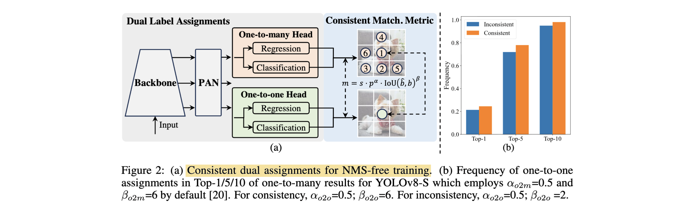

# YOLOv10: Real-Time End-to-End Object Detection

- **Authors:** Ao Wang, Hui Chen, Lihao Liu, Kai Chen, Zijia Lin, Jungong Han, Guiguang Ding
- **Affiliations:** Tsinghua University
- **Published:** NeurIPS 2024, arXiv:2405.14458 (May 2024)
- **Keywords:** real-time object detection, NMS-free, end-to-end detection, dual label assignment, efficient architecture, YOLO, COCO
- **GitHub:** https://github.com/THU-MIG/yolov10

---

## Pass 1 — Bird's-Eye View

| C | Assessment |
|---|-----------|
| **Category** | Empirical / systems-oriented architecture paper. A new iteration of the YOLO real-time detector family that removes NMS[^1] post-processing and re-engineers the backbone/neck/head for efficiency. |
| **Context** | Builds directly on YOLOv8 (its baseline) and the broader YOLO lineage (v1–v9, YOLOv6, Gold-YOLO, YOLO-MS, PP-YOLOE). Draws on DETR[^2]-style end-to-end detection (RT-DETR, Deformable-DETR, DINO) for the NMS-free idea, on TOOD/task-aligned assignment for the matching metric, and on efficient-CNN work (MobileNet depthwise separable conv, RepVGG reparameterization, large-kernel ConvNeXt/RepLKNet) for the architecture. |
| **Correctness** | Claims are well-supported: extensive COCO benchmarks across six scales, thorough ablations, and a short appendix proof for the consistent matching metric. Latency measured under a standard protocol (T4, TensorRT FP16). The main caveat the authors themselves flag: NMS-free training still trails NMS-based training by ~0.5–1.0 AP[^3] on small models. |
| **Contributions** | (1) **Consistent dual assignments** for NMS-free training — a one-to-one head trained alongside the usual one-to-many head, harmonized by a consistent matching metric, giving end-to-end inference at zero extra cost. (2) **Holistic efficiency-accuracy driven design** — lightweight classification head, spatial-channel decoupled downsampling, rank-guided block design (CIB), large-kernel conv, and partial self-attention (PSA). (3) The **YOLOv10** family (N/S/M/B/L/X) achieving state-of-the-art latency-accuracy trade-offs. |
| **Clarity** | Very clear and well-organized. Method splits cleanly into "post-processing" and "architecture"; every design choice has a dedicated ablation. Notation in the matching-metric derivation is a little dense but the appendix walks it through. |

**30-second summary:** YOLOv10 makes the YOLO detector genuinely end-to-end by eliminating NMS. Instead of the usual one-to-many label assignment (which produces duplicate boxes that NMS must clean up), it trains *two* heads — a one-to-many head for rich supervision and a one-to-one head for duplicate-free inference — and forces them to agree via a "consistent matching metric" ($`\alpha_{o2o}=\alpha_{o2m}`$ , $`\beta_{o2o}=\beta_{o2m}`$), so the one-to-one head learns to rank the same box first. At inference only the one-to-one head runs, so there is no NMS and no added cost. Orthogonally, the paper trims architectural redundancy (lightweight cls head, decoupled downsampling, rank-guided compact inverted blocks) and adds cheap capacity (7×7 large-kernel conv on small models, partial self-attention at the lowest-resolution stage). The result: YOLOv10-S is 1.8× faster than RT-DETR-R18 at similar AP with 2.8× fewer params/FLOPs, and every scale beats YOLOv8/v9 on the latency-accuracy frontier.

---

## Pass 2 — Careful Read

### Core Idea in One Sentence

Train YOLO with a dual one-to-many + one-to-one head whose assignments are made *consistent* so the one-to-one head can be used alone at inference for NMS-free, end-to-end detection, and pair this with a component-by-component efficiency/accuracy redesign of the network.

### Method / Approach



- **Consistent dual assignments (NMS-free training):** A second, structurally identical **one-to-one head** is attached alongside the standard **one-to-many head**. Both are jointly trained; the backbone/neck get the rich gradients of one-to-many supervision, while the one-to-one head learns duplicate-free prediction. At inference the one-to-many head is discarded — so there is zero added inference cost and no NMS.
- **Consistent matching metric:** Both heads score prediction–instance pairs with $m(\alpha,\beta) = s \cdot p^{\alpha} \cdot \mathrm{IoU}(\hat{b},b)^{\beta}$ . Setting $`\alpha_{o2o}=r\cdot\alpha_{o2m}`$ and $`\beta_{o2o}=r\cdot\beta_{o2m}`$ (default $r=1$) makes $`m_{o2o}=m_{o2m}^{r}`$ , so the *same* prediction is the top pick for both heads — minimizing the supervision gap between them (proved in the appendix).
- **Efficiency-driven design:** (a) **Lightweight classification head** — two 3×3 depthwise-separable convs + 1×1, since regression error matters more than classification error for AP. (b) **Spatial-channel decoupled downsampling** — pointwise conv changes channels first, then depthwise conv reduces resolution, cutting cost from $O(\frac{9}{2}HWC^2)$ to $O(2HWC^2 + \frac{9}{2}HWC)$ . (c) **Rank-guided block design** — measure the intrinsic (numerical) rank per stage, then greedily replace bottleneck blocks with a cheaper **Compact Inverted Block (CIB)** in the most-redundant stages, stopping once AP drops.
- **Accuracy-driven design:** (a) **Large-kernel convolution** — enlarge the second depthwise conv in CIB to 7×7 (with a reparameterized 3×3 branch for optimization), used only on small models (N/S) where receptive field is limited. (b) **Partial self-attention (PSA)** — split channels after a 1×1 conv, run only half through MHSA+FFN[^4] blocks, then concatenate; placed only after the lowest-resolution stage to keep the quadratic attention cost negligible.

### Key Results

Selected COCO `val` results (latency on T4, TensorRT FP16). "†" = same model trained with the original one-to-many + NMS.

| Model | #Param (M) | FLOPs (G) | AP (%) | Latency (ms) |
|-------|-----------|-----------|--------|--------------|
| YOLOv8-N | 3.2 | 8.7 | 37.3 | 6.16 |
| **YOLOv10-N** | 2.3 | 6.7 | 38.5 / 39.5† | **1.84** |
| YOLOv8-S | 11.2 | 28.6 | 44.9 | 7.07 |
| RT-DETR-R18 | 20.0 | 60.0 | 46.5 | 4.58 |
| **YOLOv10-S** | 7.2 | 21.6 | 46.3 / 46.8† | **2.49** |
| YOLOv9-C | 25.3 | 102.1 | 52.5 | 10.57 |
| **YOLOv10-B** | 19.1 | 92.0 | 52.5 / 52.7† | **5.74** |
| YOLOv8-X | 68.2 | 257.8 | 53.9 | 16.86 |
| RT-DETR-R101 | 76.0 | 259.0 | 54.3 | 13.71 |
| **YOLOv10-X** | 29.5 | 160.4 | 54.4 | **10.70** |

- **vs. baseline YOLOv8** (N/S/M/L/X): +1.2 / +1.4 / +0.5 / +0.3 / +0.5 AP with 28–57% fewer params, 23–38% fewer FLOPs, and 37–70% lower latency.
- **vs. RT-DETR:** YOLOv10-S / X are 1.8× / 1.3× faster than RT-DETR-R18 / R101 at similar AP.

**Ablation study (Table 2, COCO).** Cumulatively adding each contribution on top of the YOLOv8 baseline (# 1 / # 5), for the S and M scales:

| # | Model | NMS-free | Efficiency | Accuracy | #Param (M) | FLOPs (G) | AP (%) | Latency (ms) |
|---|-------|:--------:|:----------:|:--------:|-----------|-----------|--------|--------------|
| 1 | YOLOv10-S | | | | 11.2 | 28.6 | 44.9 | 7.07 |
| 2 | | ✓ | | | 11.2 | 28.6 | 44.3 | 2.44 |
| 3 | | ✓ | ✓ | | 6.2 | 20.8 | 44.5 | 2.31 |
| 4 | | ✓ | ✓ | ✓ | 7.2 | 21.6 | 46.3 | 2.49 |
| 5 | YOLOv10-M | | | | 25.9 | 78.9 | 50.6 | 9.50 |
| 6 | | ✓ | | | 25.9 | 78.9 | 50.3 | 5.22 |
| 7 | | ✓ | ✓ | | 14.1 | 58.1 | 50.4 | 4.57 |
| 8 | | ✓ | ✓ | ✓ | 15.4 | 59.1 | 51.1 | 4.74 |

- **Ablation reading:** NMS-free training drops YOLOv10-S end-to-end latency by 4.63 ms (7.07→2.44) at 44.3 AP (row 1→2); efficiency-driven design removes ~5 M params / ~8 GFLOPs while holding AP (row 2→3); accuracy-driven design adds +1.8 AP (S) / +0.7 AP (M) for only +0.18 ms / +0.17 ms (row 3→4, 7→8).
- **PSA vs. plain transformer block:** +0.3 AP *and* −0.05 ms; $N_{\mathrm{PSA}}=1$ chosen ($=2$ gives +0.2 AP but +0.1 ms).
- **Large-kernel conv:** helps N/S (+0.3–0.4 AP) but gives *no* gain on M (receptive field already large), so it is scale-gated.

### Strengths

- **Genuinely end-to-end at no cost:** The one-to-many head is thrown away at inference, so NMS-free deployment is free — unlike prior one-to-one CNN detectors that add overhead.
- **Principled matching metric:** The consistency condition is derived (1-Wasserstein supervision gap) rather than tuned, and it removes NMS hyperparameter sensitivity.
- **Systematic, ablation-backed redesign:** Nearly every architectural choice is isolated in a table; the rank-guided scheme gives a data-driven reason for where to save compute.
- **Strong, reproducible frontier:** Dominates YOLOv8/v9 and RT-DETR across all scales under a standard latency protocol, with public code integrated into Ultralytics.

### Weaknesses / Open Questions

1. **NMS-free gap on small models:** The one-to-one head still trails NMS-based training by 1.0 AP (N) and 0.5 AP (S); the authors report the "†" NMS numbers precisely because they are higher.
2. **No large-scale pretraining:** Objects365 pretraining is explicitly skipped for compute reasons, leaving the ceiling unknown and comparisons scale-limited.
3. **Incomplete latency reporting:** YOLOv9-S/M rows lack latency, making a couple of the head-to-head efficiency claims partly inferred.
4. **Rank-guided design is greedy and offline:** It requires retraining per candidate stage replacement, which is expensive and may miss non-greedy optima; the intrinsic-rank threshold ($\lambda_{max}/2$) is heuristic.
5. **Task scope is detection-only:** Unlike some YOLO releases, segmentation/pose/OBB variants are not studied in the paper (later added by the community).

### References to Follow Up

1. **End-to-End Object Detection with Transformers (DETR)** — Carion et al., ECCV 2020: origin of set-prediction + Hungarian one-to-one matching that motivates the NMS-free head.
2. **DETRs Beat YOLOs on Real-Time Object Detection (RT-DETR)** — Zhao et al., 2023: the main non-YOLO real-time competitor and the source of the latency benchmark protocol.
3. **TOOD: Task-Aligned One-Stage Object Detection** — Feng et al., ICCV 2021: the task-aligned assignment metric $m=s\cdot p^{\alpha}\cdot\mathrm{IoU}^{\beta}$ that YOLOv10 reuses and makes consistent.
4. **YOLOv9: Learning What You Want to Learn using PGI** — Wang et al., 2024: immediate predecessor and a key accuracy competitor at the medium/large scales.
5. **What Makes for End-to-End Object Detection? (OneNet)** — Sun et al., ICML 2021: shows one-to-one assignment enables NMS-free CNN detection, the conceptual seed for dual assignments.

---

## Pass 3 — Virtual Re-implementation

### Detailed Technical Summary

**The duplicate-prediction problem.** Standard YOLOs use *one-to-many* label assignment (via task-aligned assignment, TAL): each ground-truth instance is matched to several positive anchor predictions. This gives dense supervisory signal and good accuracy, but produces many near-duplicate boxes at inference, which must be filtered by NMS. NMS adds latency, is input-dependent, and introduces threshold hyperparameters — blocking clean end-to-end deployment.

**Dual label assignments.** YOLOv10 keeps the one-to-many head but adds a second **one-to-one head** of identical structure. During training both heads are optimized jointly on the shared backbone+neck. The one-to-many head supplies rich gradients; the one-to-one head learns to emit a single box per instance. For the one-to-one match, top-1 selection is used (shown to match Hungarian matching in accuracy at lower training cost). At inference the one-to-many head is dropped and only the one-to-one head runs, giving duplicate-free predictions with **no NMS and no extra inference cost**.

**Consistent matching metric.** Both branches rank prediction–instance pairs with

```math
m(\alpha, \beta) = s \cdot p^{\alpha} \cdot \mathrm{IoU}(\hat{b}, b)^{\beta}
```

where $p$ is the classification score, $s$ a spatial prior (anchor point inside the instance), $\hat{b},b$ the predicted/ground-truth boxes, and $\alpha,\beta$ balance semantics vs. localization. The regression targets of the two heads never conflict (matched preds share targets; unmatched are ignored), so the only supervision mismatch is in the **classification target**. With task-aligned normalization, an instance with best IoU $u^*$ gives target $`t_{o2m,j} = u^* \cdot m_{o2m,j}/m_{o2m}^{*}`$ for one-to-many positives $j\in\Omega$ , and $`t_{o2o,i}=u^*`$ for the single one-to-one pick $i$ . The **supervision gap** is the 1-Wasserstein distance between the two classification-target distributions:

```math
A = t_{o2o,i} - I(i \in \Omega)\, t_{o2m,i} + \sum_{k \in \Omega \setminus \{i\}} t_{o2m,k}
```

Substituting $`t_{o2o,i}=u^*`$ and ordering the one-to-many targets $`\hat{t}_1 \ge \hat{t}_2 \ge \dots`$ , the gap is minimized exactly when the one-to-one pick $i$ is also the **top-ranked** one-to-many positive ($`t_{o2m,i}=u^*`$). To guarantee this, set $`\alpha_{o2o}=r\cdot\alpha_{o2m}`$ and $`\beta_{o2o}=r\cdot\beta_{o2m}`$ , which makes $`m_{o2o}=m_{o2m}^{r}`$ — a monotonic function of the one-to-many metric, so both heads agree on the best positive. The default is $r=1$ (identical hyperparameters). Empirically this raises the fraction of one-to-one picks landing in the one-to-many top-1/5/10, confirming tighter alignment.

**How to read Figure 2(b) (and why "outside top-5" ≠ a missed object).** The figure is a *training-time head-alignment diagnostic*, not an inference detection-rate. It is computed on a trained dual-head model: for each ground-truth instance, score **every anchor** on the shared feature grid by $m_{o2m}$ and take the o2m Top-1/5/10 anchors; then check whether the single anchor the o2o head assigns to that instance falls inside those sets; the reported frequency is (# instances where the o2o anchor is in o2m Top-k) / (# instances). Two points defuse the natural worry that an o2o pick outside the o2m top-5 means the object was never localized:

- **Both heads share the same anchor pool** — they are separate heads over the *same* backbone/neck and the *same* feature grid, each emitting a box at every anchor. The two branches differ only in **label assignment** (o2m marks many anchors positive per instance, o2o marks exactly one), so Figure 2(b) compares *which anchor each strategy ranks best*, not two disjoint sets of boxes.
- **The ranking metric is a joint score, not pure IoU** — since $m = s\cdot p^{\alpha}\cdot\mathrm{IoU}^{\beta}$ mixes classification score and IoU, an anchor can be **well-localized (high IoU) yet fall outside the o2m top-5** merely because its class score is slightly lower. So "outside top-5" is typically an accurate-but-lower-confidence box, not a miss. Localization is also unaffected by the ranking because the two heads' **regression targets are shared and non-conflicting**; only the *classification* target alignment is at stake. At inference the o2m head is discarded entirely, so an anchor's o2m rank is irrelevant to the final box's IoU. The true aggregate cost of any residual misalignment is the small end result — the **0.5 AP** gap on YOLOv10-S (1.0 AP on N) vs. the o2m+NMS variant — not anything read directly off Figure 2(b).

**Efficiency-driven architecture.** Starting from YOLOv8 (stem, downsampling layers, stages of building blocks, head):

- **Lightweight classification head.** In YOLOv8-S the cls head costs 2.4–2.5× the regression head, yet an oracle analysis (replace predicted class with GT → $`AP_{w/o\ c}`$ ; replace predicted box with GT → $`AP_{w/o\ r}`$) shows $`AP_{w/o\ r} \gg AP_{w/o\ c}`$ , i.e. regression is the bottleneck. So the cls head is slimmed to two 3×3 depthwise-separable convs + a 1×1 conv.
- **Spatial-channel decoupled downsampling.** Replace the standard stride-2 3×3 conv (which does spatial↓ and channel↑ at once, costing $O(\frac{9}{2}HWC^2)$ , params $O(18C^2)$) with pointwise conv (channel C→2C) *then* depthwise conv (spatial↓), costing $O(2HWC^2 + \frac{9}{2}HWC)$ , params $O(2C^2+18C)$ , retaining more information (+0.7 AP over the DW-then-PW ordering).
- **Rank-guided block design.** Compute the numerical rank of the last conv in each stage's last block (reshape weight to $(C_o, K^2 C_i)$ , count singular values above threshold $\lambda_{max}/2$). Deep stages / large models have lower rank ⇒ more redundancy. Sort stages by ascending rank, and greedily swap the bottleneck for a **Compact Inverted Block (CIB)** — depthwise convs for spatial mixing, pointwise convs for channel mixing, embedded in an ELAN structure — accepting the swap only while AP does not drop (Algorithm 1).

**Accuracy-driven architecture.**

- **Large-kernel convolution.** Enlarge the second depthwise conv inside CIB from 3×3 to **7×7** (kernel-size sweep saturates at 7), only in deep stages (shallow large kernels hurt small-object features and add I/O latency). A parallel reparameterized 3×3 branch (fused away at inference) eases optimization (+0.1 AP). Applied only to N/S; larger models already have enough receptive field.
- **Partial self-attention (PSA).** After a 1×1 conv, split channels in half; feed only one half through $N_{\mathrm{PSA}}$ blocks of MHSA + FFN, then concatenate and fuse with a 1×1 conv. Query/key dims are set to half the value dim, and LayerNorm is replaced with BatchNorm for speed. PSA sits only after the lowest-resolution stage (Stage 4 / after SPPF), so the quadratic attention cost stays small. $N_{\mathrm{PSA}}=1$ by default.

**Training setup.** SGD, 500 epochs, momentum 0.937, weight decay $5\times10^{-4}$ , lr $10^{-2}\to10^{-4}$ linear decay, 3 warm-up epochs, Mosaic + MixUp + copy-paste augmentation (closed in the last 10 epochs), box/cls/DFL loss gains 7.5/0.5/1.5, trained from scratch on 8× RTX 3090. Six scales N/S/M/B/L/X; B is M with width factor 1.0.

### Datasets

#### Train Data

| Dataset | Usage | Proposed by |
|---|---|---|
| COCO 2017 | object-detection training from scratch. | — |

#### Evaluation/Validation Data

| Dataset | Usage | Proposed by |
|---|---|---|
| COCO 2017 | object-detection validation and test benchmark. | — |

### Hidden Assumptions

1. **YOLOv8 is a near-optimal starting point** — the whole redesign is differential against YOLOv8; conclusions about which components are "redundant" are relative to that baseline.
2. **Intrinsic rank ≈ useful redundancy** — the numerical rank of one conv layer is taken as a proxy for a whole stage's redundancy, and the $\lambda_{max}/2$ threshold is assumed meaningful across stages/scales.
3. **Two heads initialized identically stay comparable early in training** — the supervision-gap derivation begins from the assumption that both heads produce identical $p$ and IoU at initialization.
4. **Top-1 selection ≈ Hungarian matching** — claimed to give equal performance; assumes the consistency condition already makes the best positive unambiguous.
5. **Latency protocol reflects deployment** — T4 + TensorRT FP16 with efficientNMSPlugin and I/O omitted is taken as representative; other hardware/precisions may shift the frontier.
6. **Regression-dominant bottleneck generalizes** — the "shrink the cls head" decision rests on an oracle analysis done on one model/dataset.

### Reproducibility Notes

- **Code & weights:** Official implementation and pretrained weights at `THU-MIG/yolov10`, built on the Ultralytics package — strong reproducibility.
- **Data:** COCO 2017, train-from-scratch; no external pretraining. All hyperparameters given in appendix Table 14 (per-scale augmentation strengths included).
- **Compute:** 8× NVIDIA 3090, 500 epochs — non-trivial but standard for YOLO-scale training; single-run numbers (no variance/error bars reported).
- **Latency:** Reproducing exact latencies requires the same T4 + TensorRT FP16 setup and NMS plugin; numbers are hardware-sensitive.
- **Underspecified:** Rank-guided search cost (number of retrainings) is not fully quantified; the final per-stage CIB placement per scale is only partly given in the main text.

### Ideas for Future Work

1. **Close the NMS-free small-model gap** — better one-to-one supervision (e.g. denoising queries, auxiliary matching) to recover the 0.5–1.0 AP lost on N/S.
2. **Large-scale pretraining** — Objects365 (or self-supervised) pretraining, explicitly left undone, to test the accuracy ceiling.
3. **Differentiable / one-shot rank-guided search** — replace the greedy retrain-per-stage loop with a NAS-style or predictor-based search.
4. **Extend to dense tasks** — instance segmentation, pose, oriented boxes, and tracking with the same NMS-free head (partly realized by the community since release).
5. **Deployment-aware co-design** — optimize PSA/large-kernel placement directly against on-device (mobile/NPU) latency rather than T4 FLOPs/latency proxies.

---

## Pass 4 — Modern Perspective Review (as of July 2026)

### What Has Changed Since Publication

- **The YOLO line kept moving fast:** YOLOv11 (Ultralytics, late 2024) and subsequent releases followed within months, folding in YOLOv10-style efficiency ideas while broadening to segmentation/pose/OBB/classification tasks out of the box.
- **NMS-free became mainstream, not exotic:** dual/one-to-one assignment for end-to-end detection is now a common design point rather than a DETR-only property; several later real-time detectors ship NMS-free modes.
- **Transformer real-time detectors matured:** RT-DETR variants and successors continued to close the speed gap, keeping the CNN-vs-transformer real-time competition alive.
- **Deployment tooling standardized:** TensorRT/ONNX export, INT8/FP16 quantization, and edge-NPU deployment of YOLOv10 are now routine, and the Ultralytics integration made it a default option in practitioner pipelines.

### Has the Community Accepted the Claims?

Largely yes. YOLOv10's headline claim — NMS-free, end-to-end real-time detection at no inference cost via consistent dual assignments — has been broadly reproduced and adopted, and the model saw rapid practical uptake through the Ultralytics ecosystem and NeurIPS 2024 acceptance. The efficiency-frontier claims against YOLOv8/v9 and RT-DETR held up in independent benchmarks. The main acknowledged limitation — a residual accuracy gap on the smallest models under NMS-free inference, and the choice to report NMS ("†") numbers alongside — is the one point critics and follow-ups most often revisit. The consistent-matching-metric idea in particular has aged well as a clean, tuning-free way to align dual heads.

---

### Comparison Papers

#### Predecessors

| Paper | Authors | Year | Relation |
|-------|---------|------|----------|
| YOLOv8 | Jocher (Ultralytics) | 2023 | Direct baseline; YOLOv10 is a redesign of it |
| YOLOv9: Learning What You Want to Learn using PGI | Wang, Yeh, Liao | 2024 | Immediate predecessor and accuracy competitor (GELAN + PGI) |
| YOLOv6 v3.0: A Full-Scale Reloading | Li et al. | 2023 | Baseline for N/S/M/L comparison (BiC, anchor-aided training) |
| TOOD: Task-Aligned One-Stage Object Detection | Feng et al. | 2021 | Source of the task-aligned matching metric $s\cdot p^{\alpha}\cdot\mathrm{IoU}^{\beta}$ |
| End-to-End Object Detection with Transformers (DETR) | Carion et al. | 2020 | Origin of one-to-one set-prediction / NMS-free detection |
| What Makes for End-to-End Object Detection? (OneNet) | Sun et al. | 2021 | Shows one-to-one assignment enables NMS-free CNN detection |
| MobileNet / MobileNetV2 | Howard et al.; Sandler et al. | 2017/2018 | Depthwise-separable & inverted-residual blocks reused in CIB |
| RepVGG | Ding et al. | 2021 | Structural reparameterization for the large-kernel branch |

#### Contemporaries / Competitors

| Paper | Authors | Year | Relation |
|-------|---------|------|----------|
| RT-DETR (DETRs Beat YOLOs on Real-Time Object Detection) | Zhao et al. | 2023 | Main transformer-based real-time competitor; latency protocol source |
| Gold-YOLO: Efficient Object Detector via Gather-and-Distribute | Wang et al. | 2024 | Competing efficient YOLO (GD neck); baseline in comparisons |
| YOLO-MS: Rethinking Multi-Scale Representation Learning | Chen et al. | 2023 | Competing efficient real-time detector; baseline in comparisons |
| DINO: DETR with Improved Denoising Anchor Boxes | Zhang et al. | 2022 | Contemporary end-to-end DETR line YOLOv10 positions against |

#### Successors / Extensions

| Paper | Authors | Year | Relation |
|-------|---------|------|----------|
| YOLOv11 | Ultralytics | 2024 | Successor release; broadens tasks and folds in efficiency ideas |
| YOLOv10 C++ TensorRT | Boukamcha (community) | 2024 | Deployment extension for real-time edge inference |

---

### Bottom Line

YOLOv10 is worth reading and remains a reference point rather than a superseded footnote. Its lasting contribution is conceptual: a clean, provably-consistent way to get NMS-free, end-to-end detection out of a CNN detector at *zero* inference overhead, which reframed how the real-time detection community thinks about the training-vs-inference head mismatch. Even as YOLOv11+ and newer transformer detectors have moved the frontier, the consistent-dual-assignment idea and the systematic rank-guided efficiency analysis are the durable takeaways. Read it for the method (Section 3) and the ablations; treat the specific benchmark numbers as a 2024 snapshot.

[^1]: **NMS** — Non-Maximum Suppression. See the [glossary](../../common/terms/).
[^2]: **DETR** — DEtection TRansformer. See the [glossary](../../common/terms/).
[^3]: **AP** — Average Precision. See the [glossary](../../common/terms/).
[^4]: **FFN** — Feed-Forward Network. See the [glossary](../../common/terms/).
