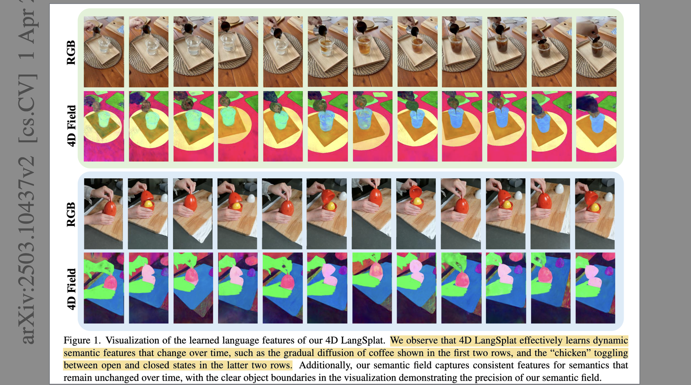
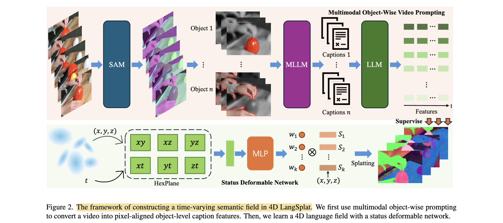

# 4D LangSplat: 4D Language Gaussian Splatting via Multimodal Large Language Models

- **Authors:** Wanhua Li, Renping Zhou, Jiawei Zhou, Yingwei Song, Johannes Herter, Minghan Qin, Gao Huang, Hanspeter Pfister
- **Affiliations:** Harvard University, Tsinghua University, Stony Brook University, Brown University, ETH Zürich
- **Published:** arXiv:2503.10437, April 2025
- **Keywords:** 4D Gaussian Splatting, language field, dynamic scene, MLLM, open-vocabulary querying, time-sensitive
- **Webpage:** https://4d-langsplat.github.io/

---

## Pass 1 — Bird's-Eye View



| C | Assessment |
|---|-----------|
| **Category** | Method paper — extends 3D language Gaussian Splatting to dynamic (4D) scenes; primary contribution is a pipeline for generating temporally-aware language supervision and a deformable network for modeling discrete object state transitions |
| **Context** | Builds on LangSplat (3D language fields via CLIP + SAM), 4D Gaussian Splatting (4D-GS with deformable fields and HexPlane), and Multimodal LLMs (MLLMs) for video understanding. Related to Gaussian Grouping and Feature-3DGS for open-vocabulary dynamic scene understanding |
| **Correctness** | Assumptions are reasonable: MLLMs can generate object-specific temporally coherent captions, and object states in real scenes are discrete enough to be captured by K prototypes. No red flags; claims are well-supported by ablations isolating each component |
| **Contributions** | (1) Multimodal Object-Wise Video Prompting (MOVP): uses MLLMs to produce pixel-aligned, object-level captions capturing temporal dynamics as supervision. (2) Status Deformable Network: models semantic features as a soft mixture over K=3 learnable state prototypes rather than unconstrained per-frame features. (3) Achieves state-of-the-art on both time-agnostic and time-sensitive open-vocabulary querying on HyperNeRF and Neu3D datasets |
| **Clarity** | Well-organized with a clear three-contribution structure; the two-field design (agnostic + sensitive) is explained intuitively |

LangSplat grounds 3D Gaussians with CLIP features, but CLIP is a static image-text model that cannot capture how objects change state or action over time. 4D LangSplat addresses this by using MLLMs to generate detailed object-wise captions for each video frame, encoding them as sentence embeddings that provide temporally consistent, state-aware supervision. A status deformable network then models each Gaussian's semantic feature as a linear combination of K learned state prototypes, enforcing smooth, physically plausible transitions. Combined with 4D Gaussian Splatting geometry, this enables both time-agnostic queries ("find the cookie") and time-sensitive queries ("find the cookie when it is cracked") in dynamic, real-world scenes.

---

## Pass 2 — Careful Read

### Core Idea in One Sentence

Use MLLMs to generate frame-by-frame object captions as temporally-aware supervision, then learn a 4D language field that decomposes each Gaussian's semantic feature into a mixture of K discrete state prototypes to support open-vocabulary queries that are sensitive to object state and action over time.

### Method / Approach



- **Multimodal Object-Wise Video Prompting (MOVP)**: For each object $i$ in frame $t$, a visual prompt $P_{i,t}$ is constructed by overlaying a red contour on the target mask, converting the background to grayscale, and blurring non-target pixels — focusing the MLLM on the target without losing context. A high-level video description $D_i$ is first generated from the full video, then frame-specific captions $C_{i,t}$ are generated conditioned on $D_i$ and the visual prompt. These captions are encoded by a fine-tuned sentence embedding LLM into feature vectors $e_{i,t}$, which serve as per-pixel 2D supervision: $F_{x,y,t} = e_{i,t}$ for all $(x,y)$ in object $i$'s mask.
- **Status Deformable Network**: Each Gaussian maintains K learnable state prototype embeddings $\{S_1, \ldots, S_K\}$. A lightweight MLP $\phi$ takes HexPlane-derived spatio-temporal features of each Gaussian at time $t$ and outputs mixture weights $\{w_1, \ldots, w_K\}$. The time-varying semantic feature is:
```math
f_{i,t} = \sum_{k=1}^{K} w_{i,k}(t) \cdot S_{i,k}
```
This constrains the feature space to a convex hull of K prototypes, enforcing structured rather than arbitrary temporal variation.
- **Dual Semantic Field**: A time-agnostic field captures stable object identity using CLIP features (static across frames); a time-sensitive field captures state dynamics using MLLM-generated sentence embeddings. At query time the two fields are combined: the agnostic field provides a spatial prior for object location, the sensitive field identifies the relevant time segments.
- **4-Stage Training Pipeline**: (1) Train static 3DGS to reconstruct RGB appearance; (2) embed static (time-agnostic) CLIP-based semantic features; (3) extend to dynamic RGB by introducing 4D-GS deformable networks; (4) jointly train the status deformable network for time-sensitive semantic rendering.

### Key Results

**Time-Sensitive Querying (HyperNeRF, Table 1)**

| Method | Acc (%) | vIoU (%) |
|---|---|---|
| LangSplat | 54.01 | 22.65 |
| Deformable CLIP | 61.80 | 44.72 |
| Non-Status Field | 87.58 | 68.57 |
| **4D LangSplat (Ours)** | **90.83** | **72.26** |

**Time-Agnostic Querying (Table 2)**

| Method | HyperNeRF mIoU (%) | HyperNeRF mAcc (%) | Neu3D mIoU (%) | Neu3D mAcc (%) |
|---|---|---|---|---|
| Feature-3DGS | 46.63 | 74.02 | 34.96 | 87.12 |
| Gaussian Grouping | 50.49 | 80.92 | 49.93 | 95.05 |
| LangSplat | 97.72 | 97.48 | 97.82 | 97.48 |
| **4D LangSplat (Ours)** | **82.48** | **98.01** | **85.11** | **98.32** |

- **Ablation on visual prompts (Table 3):** Each visual prompt element (contour, grayscale, blur) contributes additively; all three together give the highest caption similarity score (+3.32 $\Delta_sim$).
- **Ablation on text prompts (Table 4):** Using both video-level and frame-level context gives +3.32 $\Delta_sim$ vs. only image context (+0.14).
- **Ablation on K (Table 5):** K=3 state prototypes is optimal; K=2 underfits, K≥4 overfits by capturing noise.
- **Runtime (Table 7):** 4D LangSplat achieves 5.24 FPS (agnostic) and 4.05 FPS (sensitive), vs. 1.47 FPS for Gaussian Grouping.

### Strengths

- **Bypasses CLIP's temporal blindness**: LLM sentence embeddings encode action, state change, and temporal context that CLIP features fundamentally cannot express.
- **Structured state transitions**: The status deformable network's prototype design prevents feature drift and captures physically meaningful transitions (e.g., cookie intact → cracked → split), unlike unconstrained deformation fields.
- **Comprehensive ablations**: Tables 3–5 systematically validate each design choice (visual prompting strategy, text context, number of states).
- **Fast inference**: 4–5× faster than Gaussian Grouping at query time despite the more complex representation.

### Weaknesses / Open Questions

1. **MLLM quality ceiling**: The representational capacity of the language features is bounded by the MLLM's understanding. Poor or ambiguous captions directly degrade the semantic field; the appendix acknowledges this as a fundamental limitation.
2. **Manual annotation required for evaluation**: No public ground-truth segmentation labels for time-sensitive querying exist on HyperNeRF/Neu3D; the authors annotated these themselves, making reproducibility partially dependent on their unpublished labels.
3. **Fixed K across the scene**: All objects share the same number of state prototypes K=3. A scene with objects of very different complexity (some with two states, some with five) would benefit from per-object adaptive K.
4. **High compute for MLLM inference**: Generating object-wise captions for every frame using an MLLM is expensive at preprocessing/training time, even if inference is fast.
5. **Static scene assumption for geometry**: The geometry (Gaussians) is still per-scene optimized; no generalization to unseen scenes or camera setups.

### References to Follow Up

1. **LangSplat: 3D Language Gaussian Splatting** — Qin et al., CVPR 2024: Direct predecessor; 4D LangSplat extends its CLIP-in-Gaussian pipeline to dynamic scenes.
2. **4D Gaussian Splatting for Real-Time Dynamic Scene Rendering (4D-GS)** — Wu et al., CVPR 2024: The geometry backbone; introduces HexPlane + deformable fields for dynamic 3DGS.
3. **Real-time Photorealistic Dynamic Scene Representation and Rendering with 4D Gaussian Splatting** — Yang et al., ICLR 2024 (Neu3D reference [61]): Alternative 4D-GS formulation used as one of the evaluation datasets.
4. **Gaussian Grouping: Segment and Edit Anything in 3D Scenes** — Ye et al., ECCV 2024: Concurrent 3D open-vocabulary segmentation baseline; outperformed on dynamic scenes.
5. **Qwen-VL / LLaVA** — MLLMs used as the video captioning backbone; understanding their spatial-temporal reasoning capability is important for judging the quality of the supervision signal.

---

## Pass 3 — Virtual Re-implementation

### Detailed Technical Summary

**Problem Setup.** Given a monocular RGB video $V = \{V_1, \ldots, V_T\}$ of a dynamic scene, the goal is to learn a 4D language field: a function mapping position $(x,y,z)$ and time $t$ to a semantic feature $F_{x,y,z,t}$ that supports both time-agnostic queries ("which Gaussian region is this object?") and time-sensitive queries ("which frames contain this object in state X?"). The 3D geometry uses 4D Gaussian Splatting (4D-GS), which parameterizes each Gaussian by a HexPlane-derived deformation field: $(X', r', s') = (X + \DeltaX,\ r + \Delta r,\ s + \Delta s)$.

**Multimodal Object-Wise Video Prompting (MOVP).** Generating good temporal supervision requires understanding both the object's local appearance and its evolving state across the full video — something standard CLIP cropping cannot provide.

*Step 1 — Visual prompt construction.* For object $i$ in frame $t$ with SAM mask $M_{i,t}$:
```math
P_{i,t} = Contour(M_{i,t}) \cup Gray(M_{i,t}) \cup Blur(M_{i,t})
```
where Contour draws a red boundary around the target, Gray converts the background to grayscale to preserve environmental context without visual distraction, and Blur applies a Gaussian blur to non-target pixels. The radius for Contour is 2 pixels; Gaussian blur radius is 10.

*Step 2 — Video-level description.* An MLLM is prompted with the full set of visual prompts for object $i$ across all frames, plus a text prompt $T_video$, to generate a high-level motion description:
```math
D_i = MLLM(\{P_{i,1}, \ldots, P_{i,T}\},\ T_video,\ V)
```

*Step 3 — Frame-specific caption.* Given $D_i$ as context and the visual prompt $P_{i,t}$ for the specific frame:
```math
C_{i,t} = MLLM(D_i,\ P_{i,t},\ T_frame,\ V_t)
```
The frame-specific text prompt $T_frame$ instructs the MLLM to describe the object's current state and action. Table 6 in the appendix shows the exact prompt templates used.

*Step 4 — Sentence embedding.* A fine-tuned LLM sentence encoder maps each caption to a feature vector:
```math
e_{i,t} = SentenceEmbed(C_{i,t}) \in R^{4096}
```
These vectors are high-dimensional LLM embeddings (4096D) rather than CLIP embeddings (512D). For all pixels $(x,y)$ inside mask $M_{i,t}$ at time $t$: $F_{x,y,t} = e_{i,t}$.

**Autoencoder Compression.** Following LangSplat, two lightweight MLP autoencoders compress the high-dimensional features for efficient storage and splatting:
- CLIP features: $512D \to 3D$ (time-agnostic field)
- LLM sentence embeddings: $4096D \to 6D$ (time-sensitive field)

Both use cosine similarity loss plus an L2 regularization term.

**Status Deformable Network.** The key architectural novelty is modeling the time-varying semantic feature of each Gaussian not as an unconstrained function of time but as a soft mixture over $K$ discrete state prototypes.

Each Gaussian $i$ has:
- $K$ state prototype embeddings $\{S_{i,1}, \ldots, S_{i,K}\} \in R^{K \times d}$
- A lightweight MLP $\phi$ that takes HexPlane features of Gaussian $i$ at time $t$ and outputs weights:
```math
\{w_{i,1}(t), \ldots, w_{i,K}(t)\} = MLP_\phi(HexPlane(x_i, t))
```

The time-varying feature is:
```math
f_{i,t} = \sum_{k=1}^{K} w_{i,k}(t) \cdot S_{i,k}
```

This design forces the Gaussian to interpolate between a finite set of semantic states rather than drift freely. The prototypes $\{S_{i,k}\}$ are learned jointly with $\phi$ during the fourth training stage. $K=3$ is chosen by ablation (Table 5) — sufficient for most real-world object dynamics without overfitting.

**Rendering.** Time-sensitive semantic rendering follows the same alpha compositing formula as LangSplat (Eq. 2):
```math
F_t = \sum_{i \in N} f_{i,t} \cdot \alpha_{i,t} \prod_{j=1}^{i-1}(1-\alpha_{j,t})
```
where $\alpha_{i,t}$ comes from the 4D-GS deformable geometry at time $t$.

**Combined Querying.** For time-agnostic queries, only the static CLIP-based field is used, with relevancy scoring identical to LangSplat (cosine similarity against canonical phrases). For time-sensitive queries, the MLLM-based sentence embedding field is rendered, and the cosine similarity between the rendered embedding and the query sentence embedding identifies the relevant frames and spatial regions.

**Training Stages:**
1. Reconstruct RGB appearance with static 3DGS (3000 iterations)
2. Optimize static semantic features (time-agnostic CLIP field) with geometry frozen (1000 iterations)
3. Introduce 4D-GS deformable networks for dynamic RGB (10000 iterations)
4. Jointly optimize time-sensitive semantic field (status deformable network + state prototypes) (10000 iterations)

Learning rates: $1.6 \times 10^{-4}$ (deformable network), $2.5 \times 10^{-3}$ (state prototypes). MLLM used: largest SAM-level masks as input context.

### Hidden Assumptions

1. **Object states are discrete and finite**: The K-prototype design assumes each object's semantic trajectory can be approximated by K discrete poles and smooth interpolation between them. This fails for continuously varying attributes (e.g., gradual color change, progressive fluid diffusion) where no clear discrete states exist.
2. **MLLM captions are temporally consistent**: The frame-specific caption pipeline assumes the MLLM reliably tracks the same object across frames and generates consistent state descriptions. Inconsistent captioning would produce noisy supervision.
3. **SAM masks adequately isolate objects**: Inherited from LangSplat — mask quality at frame boundaries determines caption quality. Occluded or partially visible objects may receive poor captions.
4. **Sentence embeddings from an LLM encode spatial-temporal information**: The authors verify this partially (Tables 10–11 in appendix show competitive zero-shot video classification performance), but the embedding space is primarily linguistic and may not capture precise spatial correspondences.
5. **4D-GS geometry is accurate enough for semantic rendering**: The semantic field quality depends on the quality of the underlying 4D Gaussian reconstruction; blurry or inaccurate geometry corrupts the rendered semantic maps.
6. **K is scene-global**: A single K value covers all objects in the scene, implicitly assuming all objects have similar state complexity.

### Reproducibility Notes

- **Data**: HyperNeRF and Neu3D datasets are publicly available. However, time-sensitive ground truth annotations are manually created by the authors using Roboflow with the Segment Anything Model framework — these are **not publicly available** as of the paper's submission.
- **Code**: Project page at https://4d-langsplat.github.io/ — code release status unclear at arXiv preprint stage.
- **MLLM**: Uses the "largest" available MLLM at SAM-defined semantic levels; specific model version not named in the main paper (appendix suggests GPT-4V or similar).
- **Sentence Encoder**: Fine-tuned LLM for sentence embeddings (reference [57] in the paper); specific model identity and fine-tuning details require further investigation.
- **Missing**: Exact MLLM model name and version, number of objects tracked per scene, total training time and GPU requirements.
- **Missing**: The autoencoder architecture details (number of layers, hidden dimensions) are not specified in the main text.
- **Implementation**: 4-stage training with fixed iteration counts (3000/1000/10000/10000) provides clear reproducibility scaffolding.

### Ideas for Future Work

1. **Adaptive K per object**: Learn the number of state prototypes per Gaussian automatically (e.g., via a Dirichlet process or sparsity regularization) to handle heterogeneous scene complexity.
2. **Zero-shot generalization across scenes**: Train a shared status deformable network across multiple scenes so that per-scene optimization only requires learning sparse offsets from a pre-trained prior.
3. **Replace MLLM captioning with richer video models**: Use models specifically fine-tuned for temporal action understanding (e.g., VideoLLaMA, Gemini 1.5) to generate higher-quality frame captions, particularly for fast-moving or subtle state changes.
4. **Continuous semantic dynamics**: Model the semantic feature trajectory as a continuous function of time (e.g., via neural ODEs or Fourier time encoding) for scenes with gradual, non-discrete transitions.
5. **Closed-loop interaction**: Connect the query system to a robot controller or AR interface that triggers actions based on detected object state — the system already provides the spatial mask and temporal segment needed for downstream grounding.

---

## Pass 4 — Modern Perspective Review (as of June 2026)

### What Has Changed Since Publication

- **MLLMs have improved rapidly**: Since April 2025, GPT-4o, Gemini 2.0, and Qwen2.5-VL have significantly improved temporal understanding in video. Higher-quality captions from these models would directly improve 4D LangSplat's supervision quality without any architectural change.
- **Generalizable dynamic 3D representations**: The field is increasingly moving away from per-scene optimization. Methods like DUSt3R-based feed-forward 3DGS and video-to-3D diffusion models reduce the need for multi-stage per-scene training.
- **4D video generation models**: Sora, Wan, and similar video diffusion models have raised expectations for dynamic scene understanding; language-conditioned 4D fields are increasingly relevant for generation + understanding pipelines.
- **HyperNeRF/Neu3D remain limited datasets**: These benchmarks use monocular video of small-scale tabletop scenes. The generality of 4D LangSplat to outdoor, multi-object, or ego-centric dynamic scenes is untested.

### Has the Community Accepted the Claims?

The paper is an arXiv preprint and had not yet undergone peer review at publication (April 2025). The core technical claims — that MLLM captions provide better temporal supervision than static CLIP, and that prototype-based state modeling outperforms unconstrained deformation — are intuitively sound and supported by ablations. The absence of publicly released evaluation annotations for time-sensitive querying makes independent verification harder. The direction (MLLMs as supervision generators for 3D/4D fields) aligns with the broader community trend and is likely to be accepted; similar ideas have appeared in concurrent work on LLM-guided 3D scene editing.

---

### Comparison Papers

#### Predecessors

| Paper | Authors | Year | Relation |
|---|---|---|---|
| LangSplat: 3D Language Gaussian Splatting | Qin et al. | 2024 | Direct predecessor; provides the static language field pipeline that 4D LangSplat extends |
| 4D Gaussian Splatting for Real-Time Dynamic Scene Rendering | Wu et al. | 2024 | Geometry backbone; HexPlane + deformable fields are adopted directly |
| LERF: Language Embedded Radiance Fields | Kerr et al. | 2023 | NeRF-based language field; established multi-scale open-vocabulary querying paradigm |

#### Contemporaries / Competitors

| Paper | Authors | Year | Relation |
|---|---|---|---|
| Gaussian Grouping: Segment and Edit Anything in 3D Scenes | Ye et al. | 2024 | Competing open-vocabulary segmentation method for 3DGS; outperformed on dynamic tasks |
| Feature-3DGS | Zhou et al. | 2024 | Distills 2D foundation model features into 3DGS; baseline on dynamic benchmarks |
| DGD: Dynamic 3D Gaussians Distillation | Labe et al. | 2024 | Lifts features into 4D scene; concurrent direction |

#### Successors / Extensions

| Paper | Authors | Year | Relation |
|---|---|---|---|
| LangSplatV2 | Li et al. | 2025 | Sibling work (same group) focusing on efficiency of static 3D language Gaussians; complementary in scope |
| (Open) Future work on generalizable dynamic language fields | — | — | Per-scene optimization is the key remaining gap; generalization is the next frontier |

---

### Bottom Line

4D LangSplat is a well-motivated and technically solid extension of LangSplat to dynamic scenes. The two key ideas — MLLM-generated object-wise captions as temporally-aware supervision, and prototype-based state modeling for structured transitions — are both principled and practical. The ablations are comprehensive and the benchmarks, while limited in scale, show clear improvements over all baselines on both task types. The main caveats are the reliance on proprietary MLLMs for caption generation, the manually annotated (and unreleased) time-sensitive evaluation labels, and the persistent per-scene optimization requirement. For practitioners building video-grounded scene understanding or robotic manipulation systems that need object-state awareness in 3D, 4D LangSplat is currently the most complete published approach in the 3D Gaussian Splatting paradigm.
