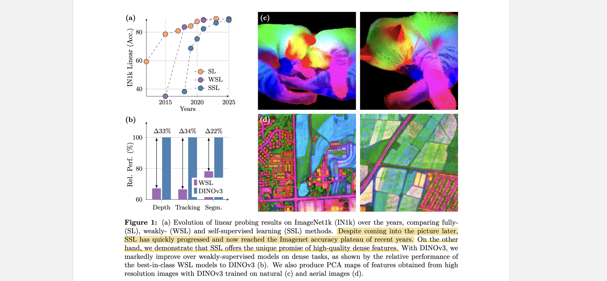
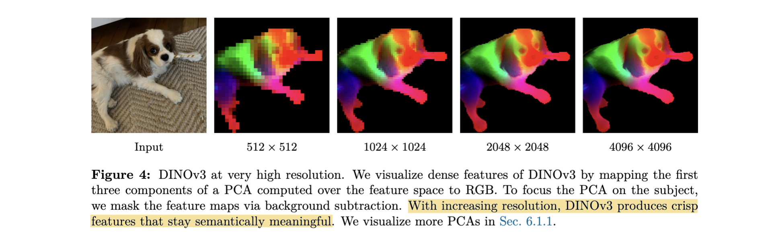
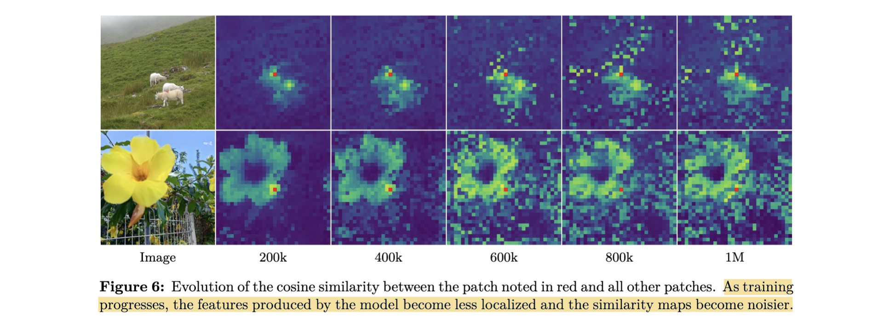

# DINOv3

- **Authors:** Oriane Siméoni, Huy V. Vo, Maximilian Seitzer, Federico Baldassarre, Maxime Oquab, Cijo Jose, Vasil Khalidov, Marc Szafraniec, Seungeun Yi, Michaël Ramamonjisoa, Francisco Massa, Daniel Haziza, Luca Wehrstedt, Jianyuan Wang, Timothée Darcet, Théo Moutakanni, Leonel Sentana, Claire Roberts, Andrea Vedaldi, Jamie Tolan, John Brandt, Camille Couprie, Julien Mairal, Hervé Jégou, Patrick Labatut, Piotr Bojanowski
- **Affiliations:** Meta AI Research, WRI, Inria
- **Published:** arXiv:2508.10104, August 13, 2025
- **Keywords:** self-supervised learning, vision foundation model, dense features, Gram anchoring, ViT, knowledge distillation
- **GitHub:** https://github.com/facebookresearch/dinov3
- **HuggingFace:** https://huggingface.co/papers/2508.10104

---

## Pass 1 — Bird's-Eye View

| C | Assessment |
|---|-----------|
| **Category** | Technical report introducing a next-generation SSL(Self-Supervised Learning) vision foundation model (DINOv3), along with a new dense-feature regularization technique (Gram anchoring) and a distilled model family |
| **Context** | Builds directly on DINOv2 (Oquab et al., 2024) and its constituent objectives — DINO (Caron et al., 2021) and iBOT (Zhou et al., 2021) — while scaling both data (~1.7B images) and model (7B parameters). Motivated by LLM scaling successes and the observation that SSL with large models/long schedules degrades dense feature quality |
| **Correctness** | Extensive ablations support each design decision. The dense feature degradation phenomenon is clearly documented and the Gram anchoring fix is empirically validated. The breadth of downstream benchmarks (20+) makes cherry-picking unlikely |
| **Contributions** | (i) LVD-1689M curated dataset, (ii) ViT-7B training at scale with RoPE and constant schedules, (iii) Gram anchoring to restore/preserve dense feature maps during long SSL training, (iv) efficient multi-student distillation producing a full family of ViT and ConvNeXt models, (v) text-aligned variant (dino.txt) |
| **Clarity** | Well-structured technical report; dense but navigable. Good use of figures for motivation (especially Figs. 5–6 showing dense feature degradation) and ablation tables. Minor: some implementation details pushed to appendix |

**30-second summary.** DINOv3 is Meta AI's third generation self-supervised vision encoder, scaling the DINOv2 recipe to a 7B-parameter ViT trained on 1.689 billion curated images. The central new finding is that long SSL training degrades patch-level feature maps even as global classification accuracy improves; the authors fix this with *Gram anchoring*, a regularization that enforces Gram matrix consistency between the current model and an earlier (better-dense) checkpoint used as a "Gram teacher". Post-training stages include high-resolution adaptation and multi-student distillation into ViT-S/B/L/H+ and ConvNeXt families. The resulting model family achieves SOTA across a wide range of vision benchmarks — semantic segmentation, monocular depth, object detection, 3D correspondences, video tracking — with a frozen backbone, significantly outperforming previous SSL and weakly-supervised methods on dense tasks.



---

## Pass 2 — Careful Read

### Core Idea in One Sentence

DINOv3 scales self-supervised ViT training to 7B parameters and 1.7B images, and introduces Gram anchoring — enforcing Gram-matrix similarity between student and an early model checkpoint — to prevent the otherwise-inevitable collapse of dense feature quality during extended training.

### Method / Approach

- **Data curation (LVD-1689M):** Three-part dataset combining (1) ~1.689B images from Instagram curated via hierarchical k-means clustering (Vo et al., 2024), (2) retrieval-augmented images sourced near task-relevant seed datasets (Oquab et al., 2024), and (3) ImageNet-1k/22k and Mapillary to sharpen task-specific performance. Mixed-batch sampling uses homogeneous ImageNet batches for 10% of training steps.
- **Scale and architecture:** ViT-7B teacher (40 blocks, patch 16, embed dim 4096, 32 attention heads × dim 128, SwiGLU FFN[^1] hidden dim 8192, RoPE-box-jittered positional embeddings, 4 register tokens). Training uses DINO + iBOT + Koleo objectives with constant learning rate and weight decay (no cosine schedule), AdamW, 256 global batch across 256 H100s for 1M iterations.
- **Gram anchoring:** After 1M iterations, a refinement phase adds $L_{Gram}$ — a Frobenius-norm penalty between the Gram matrices of student and a frozen "Gram teacher" (model at 200k iterations). Operating on the Gram matrix rather than raw features lets local feature directions move freely while preserving inter-patch similarity structure. A higher-resolution Gram variant ($L_{HRRef}$) additionally feeds the Gram teacher 2× images and down-samples, yielding sharper patch consistency.
- **Post-training family:** High-resolution adaptation (mixed-resolution crops 512–768 for 10k steps), multi-student distillation (teacher fixed at 7B, students ViT-S/S+/B/L/H+ and CNX-T/S/B/L trained concurrently using an efficient all-gather NCCL pipeline), and text alignment of ViT-L using the LiT / dino.txt recipe (Jose et al., 2025).



### Key Results

Results are organized at two evaluation tiers: **lightweight probing** (frozen encoder + linear head or non-parametric) measures raw feature quality; **full system** (frozen encoder + trained decoder) measures the practical ceiling when paired with a strong task-specific decoder. DINOv3 leads at both tiers, indicating that the gains come from feature quality itself rather than decoder compensation. The sole exception is ImageNet classification, where SigLIP 2 edges ahead (89.1 vs 88.4), reflecting the inherent advantage of language-supervised models on global semantic tasks.

> Baselines are only comparable within the same evaluation protocol. The two Segmentation rows and the two Depth rows use different decoders and different metrics — **cross-row comparisons are not meaningful**.

| Task | Benchmark | Protocol | DINOv3 7B | DINOv2 g/14 | AM-RADIO v2.5 | SigLIP 2 g/16 |
|------|-----------|---------|-----------|-------------|---------------|---------------|
| Segmentation (linear) | ADE20k mIoU ↑ | frozen encoder + linear head | **55.9** | 49.5 | 53.0 | 42.7 |
| Segmentation (Mask2Former) | ADE20k mIoU ↑ | frozen encoder + Mask2Former decoder, TTA | **63.0** | — | — | — |
| Depth (linear) | NYUv2 RMSE ↓ (m) | frozen encoder + linear head | **0.309** | 0.372 | 0.340 | 0.494 |
| Depth (Depth Anything V2) | NYUv2 ARel ↓ (%) | frozen encoder + DPT[^2] decoder | **4.3** | — | — | — |
| 3D geo. correspondence | NAVI recall ↑ | non-parametric, frozen encoder | **64.4** | 60.1 | 59.4 | 49.4 |
| Object detection (frozen) | COCO mAP ↑ | frozen encoder + Plain-DETR | **65.6** | — | — | — |
| Video tracking | DAVIS-L J&F ↑ | non-parametric, frozen encoder | **83.3** | 76.6 | 81.4 | 62.9 |
| Classification (linear) | IN1k val ↑ | frozen encoder + linear head | 88.4 | 87.3 | 88.0 | **89.1** |
| Instance retrieval | Met GAP ↑ | non-parametric, frozen encoder | **55.4** | 44.6 | 30.5 | 13.9 |

Ablation highlights:
- Gram anchoring at 200k teacher + 2× resolution boosts ADE20k by +5.4 mIoU and NYUv2 RMSE from 0.307 → 0.281 versus no-Gram baseline.
- Data mixture outperforms clustering-only or retrieval-only curation on every benchmark.
- 4 register tokens outperform no-register or attention-bias/value-gating outlier strategies.
- ViT-H+ (840M params) reaches near-7B teacher performance on most benchmarks.

### Strengths

- **Solves a known open problem:** Dense feature degradation during long SSL training was previously documented but unresolved; Gram anchoring is a principled fix.
- **No fine-tuning for SOTA:** A single frozen 7B backbone achieves top results across segmentation, detection, depth, tracking — implying genuine representation quality rather than task-specific tuning.
- **Scalable distillation:** Efficient multi-student pipeline means a single teacher run produces an entire family; smaller distilled models (ViT-L) are competitive with the 7B teacher.
- **Domain generality:** Same recipe applied to satellite imagery (SAT-493M) achieves SOTA on remote sensing tasks, demonstrating the SSL recipe transfers with minimal domain-specific modification.
- **Thorough empirics:** 20+ downstream benchmarks, careful per-layer ablations, carbon footprint reporting.

### Weaknesses / Open Questions

1. **Gram teacher selection is heuristic:** The 200k-iteration checkpoint is chosen without a principled criterion; the paper shows 100k and 1M teachers both perform worse but doesn't fully explain why the intermediate checkpoint is optimal.
2. **Resolution ceiling:** Training at 256px main resolution with 10k steps of mixed 512–768 adaptation; it's unclear whether longer high-resolution training would continue to improve.
3. **Text alignment lags behind VLMs[^3]:** dino.txt ViT-L trails SigLIP 2 and PE on zero-shot classification while being stronger on dense segmentation — the global–dense trade-off in text alignment is not fully resolved.
4. **No open training data:** LVD-1689M uses Instagram images through platform-moderated APIs; the satellite SAT-493M uses Maxar commercial data. Neither is publicly available, limiting reproduction.
5. **7B model compute requirements:** ViT-7B at inference (3550 GFLOPs at 256px) is impractical for many real-time applications; the distilled family addresses this, but the 7B model itself isn't broadly deployable.
6. **Feature dimension outliers persist:** A small set of feature channels have extremely high magnitudes throughout training. While the final layer norm suppresses them for the last layer, intermediate-layer features require additional batch normalization.

### References to Follow Up

1. **DINOv2: Learning Robust Visual Features without Supervision** — Oquab et al., TMLR 2024: The immediate predecessor whose architecture and objectives DINOv3 extends; essential to understand the baseline.
2. **Vision Transformers Need Registers** — Darcet et al., ICLR 2024: Introduces register tokens that DINOv3 adopts; key background for the high-norm patch outlier discussion.
3. **Automatic Data Curation for Self-Supervised Learning: A Clustering-Based Approach** — Vo et al., TMLR 2024: The hierarchical k-means curation that produces the LVD-1689M backbone dataset.
4. **Perception Encoder: The Best Visual Embeddings Are Not at the Output of the Network** — Bolya et al., 2025: Direct competitor that distills SAM v2 into a dense variant using Gram-like style losses; understanding the convergence helps situate DINOv3's Gram anchoring.
5. **[VGGT: Visual Geometry Grounded Transformer](../../2025/VGGT-_Visual_Geometry_Grounded_Transformer/)** — Wang et al., CVPR 2025: A key downstream application of DINOv3 features for 3D understanding; demonstrates how strong dense features translate to multi-view geometry tasks.

---

## Pass 3 — Virtual Re-implementation

### Detailed Technical Summary

**Data Pipeline (LVD-1689M)**
The training dataset has three components. Component 1 is a 1.689B-image clustering-based subset from a pool of ~17B Instagram images (already platform-moderated). Using DINOv2 embeddings and 5-level hierarchical k-means with cluster sizes {200M, 8M, 800k, 100k, 25k} from coarse to fine, the balanced sampling strategy of Vo et al. (2024) draws images to ensure coverage across all visual concepts on the web. Component 2 is a retrieval-based subset: for a set of seed datasets (ImageNet, iNaturalist, etc.), DINO embeddings are used to retrieve visually similar images from the 17B pool, curating concepts relevant to common downstream tasks. Component 3 is raw public datasets: ImageNet-1k, ImageNet-22k, and Mapillary. During training, component 3 forms 10% of batches as homogeneous mini-batches (motivated by Charton & Kempe, 2024).

**Model Architecture (ViT-7B)**
The main model is a ViT with 40 transformer blocks, embedding dimension 4096, 32 attention heads (head dim 128), SwiGLU FFN with hidden dim 8192, patch size 16, and 4 register tokens. Total parameters: ~6.7B. Positional embeddings use a custom Rotary Position Embedding (RoPE):

```math
\text{each patch is assigned coordinates in } [-1, 1]^2
```

with a RoPE-box-jittering augmentation that randomly rescales the coordinate box to $[-s, s]^2$ for $s \in [0.5, 2]$, making the model robust to varying resolutions and aspect ratios. Training uses square images at 256/112 pixels for global/local crops respectively (10 crops: 2 global + 8 local), AdamW with constant learning rate and weight decay, batch size 4096 across 256 H100-SXM5 GPUs, linear warmup for learning rate and teacher temperature.

**Training Objectives (Phase 1: Pre-training)**
Following DINOv2, three objectives are combined:

```math
L_{Pre} = L_{DINO} + L_{iBot} + 0.1 \cdot L_{DKoleo}
```

$L_{DINO}$ is a cross-entropy loss on the CLS token output, using Sinkhorn-Knopp centering (from SwAV) rather than the original DINO momentum centering. $L_{iBOT}$ is the image-BERT objective applied to randomly masked patch tokens. Both objectives use an EMA teacher updated with momentum. A dedicated layer normalization is applied to backbone outputs before computing local and global losses, empirically improving kNN classification and dense segmentation. $L_{DKoleo}$ is a distributed Koleo entropy regularizer (applied in sub-batches of 16 samples across GPUs) encouraging uniform spread of features in the embedding space. Phase 1 runs for 1M iterations.

**Gram Anchoring (Phase 2: Refinement)**


After Phase 1, dense feature maps degrade due to increasing cosine similarity between CLS and patch tokens (patches become globally aligned rather than locally distinctive). Let $X_S \in R^{P \times d}$ be the $L_2$-normalized patch features from the student, and $X_G \in R^{P \times d}$ from the Gram teacher (a frozen snapshot of the model at 200k iterations). The Gram loss is:

```math
L_{Gram} = \| X_S \cdot X_S^T - X_G \cdot X_G^T \|_F^2
```

This operates on the $P \times P$ Gram matrix of pairwise dot products, not on features directly — so patch features can rotate freely as long as the inter-patch similarity structure matches the teacher. Applied only on global crops, starting at 1M iterations, with the Gram teacher updated every 10k iterations during refinement.

The refinement objective is:

```math
L_{Ref} = w_D L_{DINO} + L_{iBOT} + w_{DK} L_{DKoleo} + w_{Gram} L_{Gram}
```

**High-Resolution Gram ($L_{HRRef}$):** The Gram teacher receives images at 2× normal resolution, and the resulting features are 2× downsampled (bicubic interpolation). This smoothed higher-resolution Gram matrix is used as the target, yielding +2 mIoU on ADE20k beyond $L_{Ref}$ alone.

**Post-Training: Resolution Adaptation**
After Gram refinement, a 10k-iteration high-resolution adaptation phase trains with mixed-resolution crops: global crops from {512, 768} and local crops from {112, 168, 224, 336}. RoPE with box jittering enables seamless resolution changes without architectural modification. Gram anchoring using the 7B model as Gram teacher is essential during this phase; without it, dense task performance degrades under high-resolution inputs.

**Post-Training: Multi-Student Distillation**
The 7B teacher is fixed. Student models (ViT-S, S+, B, L, H+, CNX-T, S, B, L) are trained using the same DINO + iBOT + Koleo objectives but without EMA — the 7B model is the teacher. For efficiency, all students share the same teacher inference: in each iteration, teacher inference runs once on all $N_T$ GPUs (all-gather to share results), and each student group $S_i$ trains on its GPU subset independently. This scales linearly: adding a student only adds its own training cost, since teacher inference cost is amortized. Students train for 1M iterations + 250k cosine cooldown, then undergo high-resolution adaptation (without Gram anchoring since distilled models show no patch consistency issues).

**Text Alignment (dino.txt)**
Following Jose et al. (2025), a text encoder is trained from scratch on image-caption data using a contrastive LiT objective while keeping the vision encoder frozen. The key modification: instead of matching only the CLS token to text, the alignment uses the concatenation of mean-pooled patch embeddings and the CLS token, enabling alignment of both global and local visual features.

**Outlier Handling**
Two outlier types exist in DINOv3:
- *High-norm patch outliers*: Resolved by 4 register tokens (Darcet et al., 2024) which absorb global information and prevent it from leaking into patch tokens.
- *Feature dimension outliers*: A small set of feature channels have high values consistent across patches and images. These are suppressed by the final layer norm at inference and do not degrade last-layer performance; intermediate layers require batch normalization.

### Hidden Assumptions

1. The Gram matrix of an early (200k-iteration) model checkpoint faithfully captures the *correct* inter-patch similarity structure, rather than one that is simply different from the later model.
2. Constant learning-rate training can run indefinitely, with downstream performance as a stopping criterion — implying no overfitting to any specific distribution occurs at scale.
3. The LVD-1689M Instagram data, despite commercial filtering, is sufficiently diverse and clean to serve as a general-purpose pretraining distribution.
4. Patch size 16 (vs. 14 in DINOv2) is comparable for sequence-length-matched evaluation — a key assumption that could bias comparisons against DINOv2 at the same effective sequence length.
5. Knowledge distillation from 7B to ViT-H+ (840M) faithfully transfers dense feature quality without needing Gram anchoring, i.e., the distillation objective itself preserves patch-level consistency.
6. Gram matrix operations on global crops are sufficient to regularize patch features — local crops are excluded from Gram loss computation.

### Reproducibility Notes

- **Data:** LVD-1689M is not released publicly; only the code is available. The Instagram source data and retrieval pipeline depend on Meta infrastructure.
- **Compute:** ViT-7B requires 61,440 H100-SXM5 GPU-hours (256 GPUs × ~240 hours). Distillation adds further compute. Not reproducible without large-scale compute.
- **Code:** Reference PyTorch implementation and model weights available at https://github.com/facebookresearch/dinov3. HuggingFace Transformers integration planned.
- **Hyperparameters:** Learning rate, weight decay, Gram loss weights ($w_D, w_{DK}, w_{Gram}$) specified in Appendix C of the paper. Gram teacher update interval is 10k iterations.
- **Missing:** Exact Sinkhorn-Knopp parameters, the schedule for Gram teacher updates during HR adaptation, and exact data mixing ratios for all components are not fully specified in the main text.

### Ideas for Future Work

1. **Adaptive Gram teacher selection:** Develop a metric (e.g., dense probing accuracy) to automatically determine the optimal snapshot for the Gram teacher rather than using a fixed iteration count.
2. **Gram anchoring during distillation:** Investigate whether applying Gram anchoring when distilling into smaller models could further improve dense feature quality beyond what teacher-distillation already provides.
3. **Domain-specific Gram teachers:** Use domain-specific early checkpoints as Gram teachers when training DINOv3 on specialized domains (medical, satellite), potentially yielding better local feature structure.
4. **Online Gram anchoring:** Instead of a post-hoc refinement phase, integrate the Gram loss from the beginning with a slowly updated Gram teacher — potentially avoiding the degradation entirely.
5. **High-resolution feature maps without ViT-Adapter:** The paper notes that 16px patch size limits spatial resolution. Future work exploiting DINOv3's native high-resolution inference (up to 4096px stable) alongside lightweight decoders could replace heavy ViT-Adapter + Mask2Former setups.

---

## Pass 4 — Modern Perspective Review (as of July 2026)

### What Has Changed Since Publication

- **Compute frontier**: At 7B parameters, DINOv3 is the largest SSL vision model at publication. The broader trend toward 10B+ VLMs and multimodal models (e.g., Fable-class models) raises the question of whether pure SSL at this scale remains the right paradigm or whether image-text joint training with strong open-vocabulary supervision will dominate.
- **Weakly-supervised models catching up on global tasks**: As shown in DINOv3's own evaluations, models like Perception Encoder and SigLIP 2 have closed the gap on ImageNet linear probing. The SSL advantage is now primarily on dense tasks.
- **Distillation as standard practice**: The multi-student distillation approach mirrors trends seen across VLMs and LLMs; smaller but higher-quality distilled backbones are increasingly standard.
- **Geospatial SSL**: DINOv3's satellite model (SAT-493M) joins a quickly growing ecosystem of domain-specific SSL models (Prithvi, BillionFM, SkyGPT); the generalist vs. specialist debate remains open.
- **Dense representation quality**: Gram anchoring addresses a specific failure mode. The broader question of how to train ever-larger SSL models without degrading dense features will remain relevant as scaling continues.

### Has the Community Accepted the Claims?

DINOv3 is very recent (August 2025) so citation data is limited. However, the core phenomena it reports — dense feature degradation during long training and scaling — were partially anticipated by Web-DINO (Fan et al., 2025), which scaled DINO to 7B without a fix and saw exactly this problem. The Gram anchoring solution is novel, well-motivated by prior style-transfer literature (Gatys et al., 2016; Johnson et al., 2016), and the empirical results are comprehensive enough to expect broad adoption. The model has already been integrated into VGGT (demonstrated in the paper itself), and the GitHub repository has attracted immediate community interest. The frozen-backbone COCO SOTA result (65.6 mAP, first competitive frozen-backbone detector) is a landmark result likely to drive adoption as a universal backbone.

---

### Comparison Papers

#### Predecessors

| Paper | Authors | Year | Relation |
|-------|---------|------|----------|
| DINOv2: Learning Robust Visual Features without Supervision | Oquab et al. | 2024 | Direct predecessor; DINOv3 inherits DINO + iBOT + Koleo objectives and the ViT-g teacher architecture |
| DINO: Emerging Properties in Self-Supervised Vision Transformers | Caron et al. | 2021 | Introduces the self-distillation with no labels objective (DINO loss) used in DINOv3 |
| iBOT: Image BERT Pre-Training with Online Tokenizer | Zhou et al. | 2021 | Patch-level masked prediction objective adopted in DINOv3 training |
| Automatic Data Curation for SSL: A Clustering-Based Approach | Vo et al. | 2024 | Hierarchical k-means curation that builds the LVD-1689M backbone dataset |
| Vision Transformers Need Registers | Darcet et al. | 2024 | Register tokens used to suppress high-norm patch outliers in DINOv3 |
| SwAV: Unsupervised Learning of Visual Features by Contrasting Cluster Assignments | Caron et al. | 2020 | Sinkhorn-Knopp centering adopted in place of original DINO momentum centering |
| Perceptual Losses for Real-Time Style Transfer | Johnson et al. | 2016 | Gram matrices for style consistency — the conceptual basis for Gram anchoring |

#### Contemporaries / Competitors

| Paper | Authors | Year | Relation |
|-------|---------|------|----------|
| Web-DINO: Scaling Language-Free Visual Representation Learning | Fan et al. | 2025 | Scales DINO to 7B without Gram anchoring; dense feature collapse motivates DINOv3 |
| Franca: Nested Matryoshka Clustering for Scalable Visual Representation | Venkataramanan et al. | 2025 | Competing open-data SSL approach; compared directly in DINOv3 evaluation tables |
| AM-RADIO v2.5: Improved Baselines for Agglomerative Vision Foundation Models | Heinrich et al. | 2025 | Agglomerative model (DINOv2 + CLIP + SAM distillation); key dense prediction competitor |
| Perception Encoder: The Best Visual Embeddings Are Not at the Output | Bolya et al. | 2025 | Weakly-supervised dense variant of SAM v2 using Gram-like objectives; closest concept match to Gram anchoring |
| SigLIP 2: Multilingual Vision-Language Encoders with Improved Dense Features | Tschannen et al. | 2025 | Weakly-supervised baseline with improved dense features; competitor on classification and segmentation |

#### Successors / Extensions

| Paper | Authors | Year | Relation |
|-------|---------|------|----------|
| [VGGT: Visual Geometry Grounded Transformer](../../2025/VGGT-_Visual_Geometry_Grounded_Transformer/) | Wang et al. | 2025 | Swaps DINOv2 backbone for DINOv3 ViT-L; DINOv3 improves 3D understanding results on all benchmarks |

---

### Bottom Line

DINOv3 is a foundational paper for the SSL vision encoder field and is very much worth reading — not just as a result report but as a methodological contribution. The Gram anchoring technique fills a genuine gap: long-schedule SSL training at scale was known to hurt dense features, and no clean fix existed. The paper provides a principled, low-overhead solution that generalizes to the high-resolution setting. The distilled model family (particularly ViT-L and ViT-H+) will likely become the go-to SSL backbone for a wide range of downstream tasks, displacing DINOv2. The geospatial experiments demonstrate that the recipe transfers domains with minimal modification. The main caveat is reproducibility: without access to LVD-1689M and significant H100 compute, the full 7B model cannot be retrained. But the code and distilled model weights are open, making DINOv3 immediately practical as a dense visual backbone for researchers at all scales.

---

[^1]: **FFN** — Feed-Forward Network. See `TERMS.md` at the repo root.
[^2]: **DPT** — Dense Prediction Transformer. See `TERMS.md` at the repo root.
[^3]: **VLM** — Vision-Language Model. See `TERMS.md` at the repo root.
