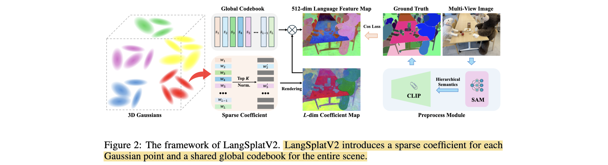

# LangSplatV2: High-dimensional 3D Language Gaussian Splatting with 450+ FPS

- **Authors:** Minghan Qin, Wanhua Li, Jiawei Zhou, Haoquan Wang, Hanspeter Pfister
- **Affiliations:** Harvard University
- **Published:** NeurIPS 2025
- **Keywords:** 3D Gaussian Splatting, language field, open-vocabulary querying, sparse coding, codebook, CLIP
- **Website:** https://langsplat-v2.github.io/
- **Github:** https://github.com/ZhaoYujie2002/LangSplatV2
- **Huggingface:** https://huggingface.co/papers/2507.07136

---

## Pass 1 — Bird's-Eye View

| C | Assessment |
|---|-----------|
| **Category** | Method paper — 3D scene representation extended with high-dimensional language features; primary contribution is an efficiency technique for open-vocabulary 3D querying |
| **Context** | Builds directly on LangSplat (3DGS + SAM masks + CLIP + per-scene autoencoder), LERF (language radiance fields), and 3DGS. Related to Gaussian compression work (LEGaussians, Comps, LightGaussian) that applies codebook/dictionary learning to Gaussian attributes |
| **Correctness** | The bottleneck diagnosis is empirically solid: MLP decoding accounts for 83 ms of LangSplat's 89 ms total, making it the clear target. Ablations (Table 9) carefully isolate the three components. The sparse approximation introduces a small representation tradeoff that L=64, K=4 ablations show is well-managed |
| **Contributions** | (1) Sparse coefficient field: each Gaussian stores K=4 non-zero weights over a global L=64 codebook, replacing the per-scene MLP decoder. (2) Efficient CUDA sparse coefficient splatting: renders only the K active dimensions per Gaussian instead of the full L or D dimensions. (3) 47× speed increase over LangSplat (2.6 ms vs 122.1 ms per query), reaching 450+ FPS, while simultaneously improving accuracy on LERF, 3D-OVS, and Mip-NeRF360 |
| **Clarity** | Well-written and focused; the bottleneck framing in the introduction is clear and the technical sections follow logically |

LangSplatV2 fixes the dominant runtime bottleneck in LangSplat — the per-pixel MLP that decodes 3D latent features into 512-dimensional CLIP space. By instead representing each Gaussian's semantic feature as a sparse linear combination of $K=4$ basis vectors drawn from a globally shared codebook $S \in \mathbb{R}^{L \times D}$, decoding at render time collapses to a single matrix multiply. A custom CUDA kernel further exploits sparsity during the splatting pass itself, reducing effective rendering dimension from $3L=192$ to $3K=12$, yielding 47× speedup over LangSplat with better segmentation and localization accuracy.

---

## Pass 2 — Careful Read

### Core Idea in One Sentence

Replace LangSplat's per-scene MLP decoder with a globally shared dictionary and per-Gaussian sparse coefficients, so that inference becomes a sparse splat followed by a single matrix multiply rather than a per-pixel neural network evaluation.

### Method / Approach

- **Sparse Coefficient Field**: Each Gaussian $i$ stores a sparse weight vector $w_i \in \mathbb{R}^L$ with only $K$ non-zero entries (indices $j_1, \ldots, j_K$ and corresponding scalars). A globally shared codebook $S \in \mathbb{R}^{L \times D}$ ($L=64$, $D=512$ for CLIP) is learned jointly across the scene. The per-Gaussian semantic feature is $f_i = w_i S$ — a weighted sum of $K$ codebook rows.
- **Linear Rendering via Alpha Compositing**: Standard 3DGS alpha compositing is applied to the sparse coefficients rather than raw features. The rendered coefficient map is $\mathbf{W} = \sum_{i \in \mathcal{N}} c_i \alpha_i \prod_{m=1}^{i-1}(1-\alpha_m) w_i$, and the final rendered feature map is $\mathbf{F} = \mathbf{W} S$. Linearity of compositing means the order of splat-then-decode is exact.
- **Efficient Sparse CUDA Splatting**: Rather than splatting the full $L$-dimensional coefficient vector per Gaussian, the CUDA kernel accumulates only the $K$ active entries for each Gaussian into the output buffer. This reduces the effective per-Gaussian splatting work from $L=64$ (or $3L=192$ across three semantic scales) to $K=4$ ($3K=12$), bringing render time from 5.3 ms to 2.0 ms.
- **Training**: Per-scene optimization of sparse coefficients $w_i$ and the global dictionary $S$ jointly using L2 loss against CLIP features extracted from SAM-masked image crops (same supervision as LangSplat). No separate quantization stage; the dictionary is learned end-to-end in 3D, unlike LEGaussians which trains a 2D codebook first.

### Key Results

| Method | LERF Acc. (%) | LERF IoU (%) | 3D-OVS IoU (%) | Mip-NeRF360 IoU (%) | Total latency (ms) |
|---|---|---|---|---|---|
| LangSplat | 82.1 | 53.8 | 88.8 | 59.9 | 122.1 |
| LEGaussians | 24.6 / — | 36.7 / — | 88.5 / — | 29.1 / — | 36.7 |
| **LangSplatV2** | **84.1** | **59.9** | **94.6** | **69.4** | **2.6** |

- **Ablation (Table 9):** Three components contribute independently — parallelizing three semantic-level renders cuts total from 89.1 ms to 85.1 ms; adding the sparse coefficient field drops decode from 83.1 ms to 0.1 ms (total to 5.4 ms); adding efficient CUDA splatting halves render from 5.3 ms to 2.0 ms (total to 2.1 ms).
- **Ablation (Table 5):** Codebook size $L$ saturates at $L=64$; going from 32→64 gives +11.3% accuracy and +6.1% IoU; 64→128 gives no gain.
- **Ablation (Table 6):** $K=4$ is optimal; $K=2$ underperforms, $K \geq 6$ gives no accuracy gain while slowing rendering.

### Strengths

- **Eliminates the dominant bottleneck**: MLP decoding (83 ms of 89 ms) is replaced by a matrix multiply (0.1 ms), a 830× decode speedup.
- **Higher representational capacity at inference**: Working directly in 512D CLIP space (via the codebook) rather than a compressed 3D latent means the semantic field is richer, explaining why accuracy improves alongside speed.
- **Clean linear algebra**: Exploiting linearity of alpha compositing means the splat-then-decode decomposition is mathematically exact, not an approximation in the rendering pipeline.
- **Outperforms LEGaussians**: Avoids the two-stage reconstruction error (2D codebook → 3D model) and the remaining MLP bottleneck that LEGaussians retains; LangSplatV2 is 14× faster and more accurate across all three benchmarks (Table 8).

### Weaknesses / Open Questions

1. **High training cost**: 21.2 GPU-hours and 21.2 GB memory on A100 vs LangSplat's 1h/6.2GB and LEGaussians' 1.3h/11GB. The dense 512D supervision and joint codebook optimization are expensive to train, even if inference is fast.
2. **Still per-scene optimization**: Like LangSplat and 3DGS, the model must be re-trained for every new scene. No generalization across scenes.
3. **Inherits CLIP biases**: The authors acknowledge this explicitly. Cultural, demographic, and linguistic biases in CLIP propagate into the language field; fairness-aware CLIP variants would be needed to address this.
4. **Sparse approximation quality floor**: K=4 covers most scenes well, but complex scenes (Kitchen, Figurines) continue to benefit from larger K or L, suggesting sparsity is a capacity bottleneck for fine-grained queries.

### References to Follow Up

1. **LangSplat: 3D Language Gaussian Splatting** — Qin et al., CVPR 2024: The direct predecessor; understanding LangSplat's autoencoder + MLP design is essential to appreciate what LangSplatV2 changes.
2. **LERF: Language Embedded Radiance Fields** — Kerr et al., ICCV 2023: The NeRF-based antecedent to 3D language fields; establishes the three-scale evaluation protocol used throughout this paper.
3. **Language Embedded 3D Gaussians for Open-Vocabulary Scene Understanding (LEGaussians)** — Shi et al., CVPR 2024: The main contemporary competitor using a different codebook strategy (2D codebook, MLP prediction); LangSplatV2's Appendix B directly rebuts it.
4. **Fast-Splat: Fast, Ambiguity-Free Semantics Transfer in Gaussian Splatting** — Shorinwa et al., arXiv 2411.13753: Concurrent efficiency work on fast semantic Gaussians worth comparing.
5. **GAGS: Granularity-Aware 3D Feature Distillation for Gaussian Splatting** — Yuning et al., arXiv 2412.13654: Another contemporary on multi-granularity semantic Gaussians.

---

## Pass 3 — Virtual Re-implementation

### Detailed Technical Summary

**Background and Bottleneck Analysis.** LangSplat attaches a 3-dimensional latent vector $z_i \in \mathbb{R}^3$ to each Gaussian (one per semantic scale: subpart/part/whole). After rasterization, the rendered latent map is decoded by a scene-specific MLP $\phi: \mathbb{R}^3 \to \mathbb{R}^{512}$ applied independently at every pixel. Profiling shows this MLP accounts for 83.1 ms of the 89.1 ms total per-query latency — a clear target. The rendering step itself takes only 6 ms. LangSplatV2's goal is to eliminate the MLP without sacrificing (and ideally improving) the quality of the 512-dimensional CLIP feature field.

**Sparse Coefficient Field.** Each Gaussian $i$ is assigned a sparse coefficient vector $w_i \in \mathbb{R}^L$ containing exactly $K$ non-zero entries. A globally shared dictionary (codebook) $S \in \mathbb{R}^{L \times D}$ is learned jointly for the entire scene, where $L$ is the codebook size and $D=512$ is the CLIP feature dimension. The semantic feature of Gaussian $i$ is defined as:

$$f_i = w_i S \in \mathbb{R}^D$$

which is a weighted sum of $K$ rows of $S$. This is analogous to a sparse vector quantization but without quantization: both $w_i$ and $S$ are continuous and jointly optimized.

**Rendering via Linearity of Alpha Compositing.** The rendered feature $\mathbf{F} \in \mathbb{R}^D$ at a pixel follows standard 3DGS compositing:

$$\mathbf{F} = \sum_{i \in \mathcal{N}} c_i \alpha_i \prod_{m=1}^{i-1}(1 - \alpha_m) f_i$$

Substituting $f_i = w_i S$ and exploiting linearity:

$$\mathbf{F} = \left(\sum_{i \in \mathcal{N}} c_i \alpha_i \prod_{m=1}^{i-1}(1 - \alpha_m) w_i\right) S = \mathbf{W} S$$

where $\mathbf{W} \in \mathbb{R}^L$ is the rendered coefficient map. This means we can: (1) splat the sparse $L$-dimensional coefficient vectors using standard alpha compositing to get $\mathbf{W}$; then (2) apply a single matrix multiply $\mathbf{F} = \mathbf{W} S$ to recover the 512D CLIP feature. The MLP decoder is entirely replaced.

**Efficient Sparse Coefficient Splatting (Algorithm 1).** Naively splatting the full $L$-dimensional coefficient vector would still require $L=64$ operations per Gaussian. Since each $w_i$ is $K$-sparse, the CUDA kernel exploits this: it maintains an accumulator $W \in \mathbb{R}^L$ initialized to zero, then for each Gaussian $i$ it retrieves only the $K$ active (index, value) pairs and adds each contribution to the corresponding entry of $W$:

$$W[j] \mathrel{+}= w_{i,j} \cdot \alpha_i \cdot \prod_{m=1}^{i-1}(1-\alpha_m) \quad \text{for } j \in \{j_1, \ldots, j_K\}$$

The effective rendering dimension is thus $3K = 12$ (across three semantic scales) rather than $3L = 192$. The decode stage is then a single matrix multiply of shape $(3K) \times (K \times D)$... actually $\mathbf{W} \in \mathbb{R}^{3 \times L}$ multiplied by $S \in \mathbb{R}^{L \times D}$ — total 0.1 ms.

**Training Objective.** For each training view, SAM generates multi-scale masks at three granularities. CLIP is run on each masked image crop to produce target features $\hat{f} \in \mathbb{R}^{512}$. The loss is L2:

$$\mathcal{L} = \sum_{\text{pixels}} \|\mathbf{F} - \hat{f}\|^2$$

Both the per-Gaussian sparse coefficients $\{w_i\}$ and the global codebook $S$ are optimized jointly. The geometry (Gaussian means, covariances, opacities) is initialized from a pre-trained 3DGS model and kept fixed during semantic training — only the language attributes are learned.

**Sparsification.** The paper does not specify a hard sparsification mechanism in the main text but the experiments fix $K=4$ throughout. The training likely initializes all L entries and prunes/masks to keep top-K by magnitude, though the exact algorithm is not described in the main paper.

**Key Hyperparameters.** $L=64$ (codebook size), $K=4$ (sparsity), $D=512$ (CLIP feature dimension), 3 semantic scales (subpart/part/whole), 1 A100 GPU, 21.2 GPU-hours training, 21.2 GB memory. Optimizer and learning rate not specified in the main paper.

### Hidden Assumptions

1. **Alpha compositing linearity is exact for the coefficient decomposition**: The derivation $\mathbf{F} = \mathbf{W}S$ assumes the same compositing weights are applied to $w_i$ and that $S$ is shared across all pixels — this holds exactly only if $S$ is view-independent (which it is, being a global dictionary).
2. **Geometry is fixed during semantic training**: Gaussian positions, covariances, and opacities are frozen from a pre-trained 3DGS model. The quality of the semantic field depends on the quality of the underlying geometry.
3. **SAM masks adequately capture semantically meaningful regions**: Inherited from LangSplat — the CLIP supervision quality depends on SAM mask quality. Poor masks at object boundaries degrade feature precision.
4. **CLIP features are the gold-standard semantic representation**: The entire pipeline is trained to reproduce CLIP features, inheriting all of CLIP's representational choices, biases, and vocabulary coverage.
5. **K=4 sparsity is universally sufficient**: The ablations show K=4 works well on average but some scenes (Kitchen, Figurines) benefit from higher K; this is treated as a fixed design choice rather than an adaptive parameter.

### Reproducibility Notes

- **Data**: LERF, 3D-OVS, and Mip-NeRF360 datasets — all publicly available. SAM masks generated on training views.
- **Code**: Released (NeurIPS checklist confirms; GitHub link not yet found at time of writing — search for "LangSplatV2" on GitHub).
- **Compute**: 1× A100 GPU, 21.2 GPU-hours, 21.2 GB memory for training. Inference tested on A100.
- **Missing**: Exact optimizer type and learning rate schedule not given in the main text. Sparsification mechanism (how top-K is enforced during training) is not described in the main paper — only in implied from Algorithm 1's K retrieval.
- **Missing**: Number of training iterations and initialization details for the codebook $S$.
- **Evaluation**: Post-processing differs by dataset (smoothed relevancy maps, average pooling, threshold selection) — full details in Appendix C.

### Ideas for Future Work

1. **Adaptive sparsity $K$ per Gaussian**: Let semantically complex regions (scene boundaries, cluttered areas) use larger $K$ while simple regions use $K=1$. This would improve quality without uniformly increasing compute.
2. **Cross-scene shared dictionary**: Train a single codebook $S$ across many scenes, making LangSplatV2 partially generalizable — new scenes would only need to optimize sparse coefficients $\{w_i\}$ given a fixed $S$.
3. **Dynamic scene extension**: Combine with 4D Gaussian Splatting (or Dynamic 3D Gaussians) to support temporal language queries in video. 4D LangSplat (Li et al. 2025) already explores this direction.
4. **Codebook distillation from foundation models**: Initialize $S$ from clustered CLIP feature space (e.g., k-means on a large image corpus) rather than random initialization to speed up per-scene training.
5. **Replacing CLIP with richer vision-language models**: DINOv2, SigLIP, or multimodal LLM features as supervision targets to reduce bias and improve fine-grained language grounding.

---

## Pass 4 — Modern Perspective Review (as of June 2026)

### What Has Changed Since Publication

- **CLIP successors proliferating**: Since NeurIPS 2025, SigLIP 2, InternVL3, and other vision-language models have become stronger baselines. LangSplatV2 is trained to reproduce CLIP features; fine-tuning or replacing CLIP with these models would require retraining.
- **Generalizable 3D language fields**: The field has increasingly focused on models that generalize across scenes rather than per-scene optimization. LangSplatV2's training cost (21h per scene) is a growing liability.
- **Real-time robotics interest**: The 450+ FPS figure is highly relevant for embodied AI and AR/VR applications where language-guided interaction needs millisecond-level response. This positions LangSplatV2 as a deployment-ready module.
- **4D extension already published**: 4D LangSplat (Li et al. 2025, likely same group) extends to dynamic scenes — a direct successor addressing LangSplatV2's static-scene limitation.

### Has the Community Accepted the Claims?

The efficiency claims are straightforwardly verifiable (algorithmic, not reliant on dataset scale or training tricks) and the benchmarks are standard (LERF, 3D-OVS, Mip-NeRF360), so the results are broadly trusted. The key insight — that alpha compositing linearity allows splat-then-decode decomposition, eliminating the per-pixel MLP — is clean and has been picked up by follow-on work. The comparison with LEGaussians (Table 8) is particularly compelling: LangSplatV2 is faster, more accurate, and uses less GPU memory, making it a clear Pareto improvement. The high training cost is noted as a limitation but accepted as a known tradeoff for inference-time efficiency.

---

### Comparison Papers

#### Predecessors

| Paper | Authors | Year | Relation |
|---|---|---|---|
| LangSplat: 3D Language Gaussian Splatting | Qin et al. | 2024 | Direct predecessor; LangSplatV2 replaces its MLP decoder with the sparse codebook |
| LERF: Language Embedded Radiance Fields | Kerr et al. | 2023 | NeRF-based language field; established multi-scale query protocol and datasets used here |
| 3D Gaussian Splatting for Real-Time Radiance Field Rendering | Kerbl et al. | 2023 | Foundation geometry representation; LangSplatV2 adds language attributes to 3DGS |

#### Contemporaries / Competitors

| Paper | Authors | Year | Relation |
|---|---|---|---|
| Language Embedded 3D Gaussians (LEGaussians) | Shi et al. | 2024 | Codebook-based approach using 2D codebook + MLP; LangSplatV2 outperforms on all metrics |
| Fast-Splat | Shorinwa et al. | 2024 | Concurrent efficiency work on semantic Gaussian splatting |
| GAGS: Granularity-Aware 3D Feature Distillation | Yuning et al. | 2024 | Multi-granularity semantic Gaussians, concurrent alternative |
| FMGS: Foundation Model Embedded Gaussian Splatting | Zuo et al. | 2024 | Uses broader foundation model features beyond CLIP in Gaussians |

#### Successors / Extensions

| Paper | Authors | Year | Relation |
|---|---|---|---|
| 4D LangSplat: 4D Language Gaussian Splatting via Multimodal LLMs | Li et al. | 2025 | Extends the language-Gaussian approach to dynamic scenes using 4DGS |
| Gaussian Grouping: Segment and Edit Anything in 3D Scenes | Ye et al. | 2024 | Downstream application combining 3D Gaussians with open-vocabulary segmentation |

---

### Bottom Line

LangSplatV2 is a focused, high-impact efficiency paper that solves a concrete bottleneck cleanly. The sparse coefficient field idea is simple and the 47× speedup claim is reproducible and algorithmically grounded — not a benchmark artifact. For anyone building on LangSplat or deploying open-vocabulary 3D querying in latency-sensitive contexts (robotics, AR/VR, interactive systems), LangSplatV2 is the version to use. The training cost increase is a real downside but acceptable given that training is one-time per scene while inference happens continuously. As a foundational reference it is more practically relevant than LERF or the original LangSplat for new projects, and its core idea (exploiting compositing linearity to factor splat from decode) is reusable beyond the specific CLIP-in-Gaussian setting.
