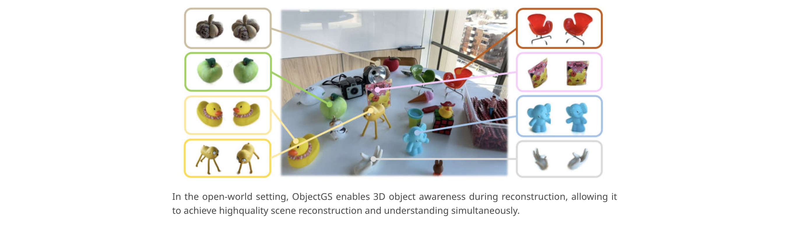
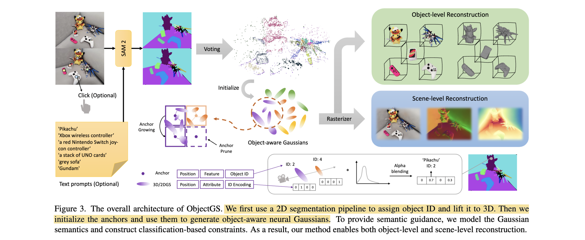

# ObjectGS: Object-aware Scene Reconstruction and Scene Understanding via Gaussian Splatting

- **Authors:** Ruijie Zhu, Mulin Yu, Linning Xu, Lihan Jiang, Yixuan Li, Tianzhu Zhang, Jiangmiao Pang, Bo Dai
- **Affiliations:** University of Science and Technology of China; Shanghai Artificial Intelligence Laboratory; The Chinese University of Hong Kong; The University of Hong Kong
- **Published:** ICCV 2025, arXiv:2507.15454
- **Keywords:** 3D Gaussian Splatting, object-aware reconstruction, scene understanding, panoptic segmentation, open-vocabulary segmentation, discrete semantics, anchor-based representation, Scaffold-GS
- **Webpage:** https://ruijiezhu94.github.io/ObjectGS_page/
- **GitHub:** https://github.com/RuijieZhu94/ObjectGS

---

## Pass 1 — Bird's-Eye View

| C | Assessment |
|---|-----------|
| **Category** | Systems paper extending Scaffold-GS with object-aware semantic modeling; jointly performs high-quality 3D scene reconstruction and open-world instance segmentation in a single training run |
| **Context** | Builds on Scaffold-GS (anchor-based neural Gaussians), 3DGS, 2DGS, SAM/Grounded-SAM (segmentation backbone), DEVA (cross-frame video segmentation); directly competes with LangSplat, Gaussian Grouping, SAGA |
| **Correctness** | Claims and ablations are consistent; the argument against learnable semantics (alpha-blending ambiguity) is well-supported; controlled ablation on three semantic modeling variants isolates the contribution clearly |
| **Contributions** | (1) Object-aware anchor/Gaussian representation where each anchor carries an object ID propagated through grow/prune; (2) discrete one-hot ID encoding as Gaussian semantics, eliminating alpha-blending ambiguity; (3) scene-level occlusion-aware semantic rendering via variable-length feature rasterizer; (4) demonstrated on OVS and panoptic segmentation with SOTA results and clean downstream applications |
| **Clarity** | Well-organized; the three alternatives for semantic modeling (learnable / object-independent / one-hot) are clearly motivated and contrasted; figures directly illustrate the key failure modes being addressed |



**30-second summary:** ObjectGS proposes that 3D reconstruction quality and semantic understanding are mutually reinforcing, so they should be optimized together rather than in two separate stages. It extends Scaffold-GS by assigning a fixed object ID to every anchor; all neural Gaussians generated from that anchor inherit the same ID as a one-hot encoding vector. During alpha-blended rendering, these discrete one-hot vectors accumulate into a per-pixel probability vector over object IDs, supervised with cross-entropy loss. This sidesteps the key failure mode of prior methods — continuous learned semantic features that blur and mix across object boundaries during alpha-compositing. The result is simultaneously better reconstruction quality (PSNR +0.74 dB on Replica) and substantially better segmentation (IoU 88.4 vs 83.4 on Replica) compared to the strongest baseline, Gaussian Grouping.

---

## Pass 2 — Careful Read

### Core Idea in One Sentence

ObjectGS binds each anchor to a fixed object ID so that all neural Gaussians it generates carry a one-hot semantic encoding, turning semantic segmentation into a byproduct of alpha-blended rendering and eliminating the category ambiguity that plagues continuous learned Gaussian semantics.

### Method / Approach



- **Object ID initialization via voting:** DEVA (or Grounded-SAM for text/click prompts) produces cross-frame consistent 2D instance masks. COLMAP point cloud points are projected into each training view and accumulate per-view ID votes; majority voting assigns a final object ID to each 3D point. Three voting strategies are compared (majority, probability-based, correspondence-based); majority voting wins.

- **Object-aware anchor generation (Scaffold-GS extension):** Each anchor carries an object ID in addition to its standard position, scaling, and local context features. During adaptive grow/prune, child anchors inherit the parent's object ID. This ensures each voxel cell contains at most one anchor from one object — semantic exclusivity in 3D space.

- **Discrete one-hot Gaussian semantics:** Each neural Gaussian generated from anchor $i$ is assigned fixed one-hot vector $E_i \in \{0,1\}^n$ (n = number of objects). During alpha-blended rendering, pixel $x$ accumulates $P(x) = \sum_k \alpha_k T_k E_{i_k}$ — a soft probability distribution over all object IDs. The predicted ID is $\arg\max_i P_i(x)$ , supervised by cross-entropy against the DEVA-derived pseudo ground truth. A variable-length CUDA rasterizer is implemented so $n$ can vary per scene without code changes.

- **Unified training objective:** $L = L_1 + \lambda_{SSIM} L_{SSIM} + \lambda_{vol} L_{vol} + \lambda_{semantic} L_{semantic}$ — standard Scaffold-GS appearance losses plus the new cross-entropy semantic term ($\lambda_{semantic} = 0.1$ on most datasets). The semantic loss improves both segmentation and reconstruction simultaneously.

### Key Results

**Open-vocabulary segmentation — LERF-Mask (mIoU / mBIoU) :**

| Method | figurines | ramen | teatime |
|---|---|---|---|
| LangSplat | 52.8 / 50.5 | 50.4 / 44.7 | 69.5 / 65.6 |
| Gaussian Grouping | 69.7 / 67.9 | 77.0 / 68.7 | 71.7 / 66.1 |
| Gaga | 90.7 / 89.0 | 64.1 / 61.6 | 69.3 / 66.0 |
| **ObjectGS (Ours)** | **88.2 / 85.2** | **88.0 / 79.9** | **88.9 / 88.6** |

**Open-vocabulary segmentation — 3DOVS (mean IoU) :**

| Method | bed | bench | room | lawn | sofa | Mean |
|---|---|---|---|---|---|---|
| LangSplat | 77.8 | 77.3 | 58.4 | 90.9 | 60.2 | 73.0 |
| Gaussian Grouping | 64.5 | 95.6 | 96.4 | 97.0 | 91.3 | 89.1 |
| SAGA | 97.4 | 95.4 | 96.8 | 96.6 | 93.5 | 96.0 |
| **ObjectGS (Ours)** | **98.0** | **96.4** | **95.1** | **97.2** | **95.4** | **96.4** |

**Panoptic segmentation — Replica + ScanNet++ :**

| Method | Dataset | PSNR ↑ | SSIM ↑ | LPIPS ↓ | IoU ↑ | Dice ↑ | Acc ↑ |
|---|---|---|---|---|---|---|---|
| Gaussian Grouping | Replica | 39.52 | 0.9785 | 0.0548 | 83.36 | 91.84 | 94.70 |
| **ObjectGS** | **Replica** | **40.26** | **0.9842** | **0.0280** | **88.39** | **92.39** | **95.65** |
| Gaussian Grouping | ScanNet++ | 28.35 | 0.9296 | 0.1641 | 89.82 | 92.91 | 98.44 |
| **ObjectGS** | **ScanNet++** | **30.24** | **0.9327** | **0.1488** | **95.38** | **97.48** | **99.07** |

- **Ablation — semantic modeling (figurines mIoU) :** Learnable semantics: 69.57 → Object-independent: 37.48 → One-hot (ours): 88.19. One-hot encoding is the clear winner; object-independent rendering is worst because it cannot handle occlusion.
- **Ablation — voting strategy (figurines mIoU) :** Majority: 88.19 >> Probability-based: 84.46 >> Correspondence-based: 59.67.
- **Ablation — $\lambda_{semantic}$  on Replica (IoU) :** 0.0 → 0.0 (no semantics), 0.01 → 86.15, 0.10 → 88.39 (best), 1.00 → 86.67 (hurts reconstruction). Crucially, the semantic loss also improves reconstruction quality slightly (PSNR 40.19 → 40.26 at $\lambda = 0.1$ ).

### Strengths

- **Mutual reinforcement:** Semantic constraints actively improve geometry (PSNR gains over baseline), unlike post-hoc segmentation methods that leave reconstruction quality unchanged.
- **Disambiguation-free alpha blending:** One-hot encoding eliminates semantic blurring at object boundaries — the core failure mode of all prior continuous-feature approaches.
- **Occlusion-aware by design:** Scene-level rendering with one-hot vectors correctly handles occluded objects without needing per-object independent renders (which would miss occluded geometry).
- **Clean applications:** Object mesh extraction (anchor ID → select Gaussians → 2DGS + TSDF), scene editing (delete/recolor anchors by ID) require no extra post-processing step.
- **Efficient variable-length rasterizer:** One-shot parallel render for all object IDs regardless of scene complexity.
- **Better 3D consistency than Gaussian Grouping:** Point cloud visualizations show far less noise and semantic leakage across object boundaries in 3D.

### Weaknesses / Open Questions

1. **Number of objects fixed at training time:** The one-hot encoding length $n$ must be set before training. Adding a new object requires re-training. This is fundamentally less flexible than open-ended learnable embeddings.
2. **Depends on DEVA/Grounded-SAM quality:** Severely erroneous 2D masks propagate into the 3D point cloud initialization. While the grow/prune mechanism partially corrects mislabeled anchors, there is no explicit noise-robustness mechanism.
3. **Static scene assumption:** No mechanism for dynamic objects; video sequences with moving objects are not addressed.
4. **Memory scales with object count:** One-hot encoding width $n$ extends Gaussian attributes from 3 to $n+3$ channels. For large $n$ (80–90 objects in ScanNet++) GPU memory usage grows accordingly (~35–45 GB), and FPS drops significantly (80–90 → 40–50 FPS).
5. **Long-tailed distribution:** Scenes dominated by a few foreground objects and many background fragments (class ID 0) may bias the majority voting and the loss toward background — the authors acknowledge this as a scalability concern.
6. **No per-object novel view synthesis metric:** The paper does not report per-object PSNR/SSIM for isolated object renders, making it hard to assess reconstruction quality at the object level independently of segmentation.

### References to Follow Up

1. **"Scaffold-GS: Structured 3D Gaussians for View-Adaptive Rendering"** — Lu et al., CVPR 2024: The direct foundation that ObjectGS extends; understanding the anchor/neural Gaussian architecture is prerequisite.
2. **"Gaussian Grouping: Segment and Edit Anything in 3D Scenes"** — Ye et al., ECCV 2024: The primary baseline; uses learnable per-Gaussian identity features supervised by DEVA masks; understanding why it fails at boundaries motivates ObjectGS.
3. **"Tracking Anything with Decoupled Video Segmentation (DEVA)"** — Cheng et al., ICCV 2023: The video segmentation backbone that provides cross-frame consistent object IDs; its failure modes become ObjectGS's failure modes.
4. **"Segment Any 3D Gaussians (SAGA)"** — Cen et al., AAAI 2025: The nearest competitor in accuracy; uses SAM features distilled per-Gaussian with contrastive losses rather than discrete IDs — important to understand the trade-off.
5. **"2D Gaussian Splatting for Geometrically Accurate Radiance Fields"** — Huang et al., SIGGRAPH 2024: The 2DGS variant used for mesh extraction; shows how ObjectGS can swap the underlying Gaussian primitive.

---

## Pass 3 — Virtual Re-implementation

### Detailed Technical Summary

**Background: Scaffold-GS.** ObjectGS is a direct extension of Scaffold-GS. In Scaffold-GS, the scene is represented by a set of anchors $\{a_i\}$ . Each anchor has: center position $x_i \in R^3$ , local context feature $f_i \in R^{32}$ , scaling factor $l_i \in R^3$ , and $k$ learnable offset vectors $\{o_{i,0}, \ldots, o_{i,k-1}\}$ . From each anchor, $k$ neural Gaussian primitives are generated:

```math
\mu_{i,j} = x_i + o_{i,j} \cdot l_i
```

Color and other attributes are decoded by an MLP from $f_i$ , viewing distance $\delta$ , and direction $d$ . The anchor set adapts during training: new anchors are grown in voxels where the gradient of neural Gaussians is high, and unpromising anchors are pruned by opacity thresholding.

**Step 1 — Object ID initialization.** Given multi-view images $\{I_i\}$ , DEVA is run to produce cross-frame consistent 2D object ID maps $\{L_i\}$ . For text/click prompts, Grounded-SAM is used to specify target objects. Each pixel is assigned an integer ID in $\{0, 1, \ldots, n\}$ where 0 is background/unclassified. The COLMAP point cloud $P_{3D}$ is then labeled using majority voting: each point $p \in P_{3D}$ is projected into all $N$ views, accumulating $N$ ID votes; the final ID is $\arg\max_c \text{count}(c)$ across votes. This is fast (projective, no learned components) and robust because the anchor grow/prune mechanism can self-correct a fraction of mislabeled initializations during training.

**Step 2 — Object-aware anchor construction.** Each anchor $a_i$ is augmented with $\text{objID}_i \in \{0,1,\ldots,n\}$ inherited from its seed 3D point. The grow/prune strategy is unchanged from Scaffold-GS except: (a) newly grown child anchors copy the parent's object ID, and (b) each voxel grid cell holds at most one anchor, ensuring a unique object ID per voxel. This one-anchor-per-voxel constraint guarantees **semantic exclusivity in 3D space** — no two objects can occupy the same voxel, which is critical for clean segmentation boundaries.

**Step 3 — One-hot Gaussian semantics.** Every neural Gaussian generated from anchor $a_i$ is assigned fixed one-hot vector:

```math
E_i = [0, \ldots, \underbrace{1}_{i\text{-th position}}, \ldots, 0] \in \{0,1\}^n
```

This is not a learnable parameter; it is determined entirely by the anchor's object ID. During alpha-blended rasterization, the per-pixel ID probability vector is:

```math
P(x) = \sum_k \alpha_k \cdot T_k \cdot E_{i_k}
```

where $\alpha_k$ is Gaussian opacity, $T_k = \prod_{j<k}(1 - \alpha_j)$ is accumulated transmittance, and $i_k$ is the object ID of the $k$ -th Gaussian along the ray. The predicted object ID is $\text{ID}(x) = \arg\max_i P_i(x)$ .

**Why one-hot beats continuous features.** With continuous features $f_k \in R^d$ , the pixel-level feature is $F(x) = \sum_k \alpha_k T_k f_k$ — a mixture of features from potentially multiple objects along the ray. At object boundaries, the front and background objects blend. Querying by nearest-neighbor to a target feature vector then requires regularization terms or contrastive losses to prevent this mixing. With one-hot encoding, $P_i(x)$ measures how much of the opacity mass along the ray belongs to object $i$ — it is interpretable as a probability and can be directly trained with cross-entropy without any extra regularization.

**Why not object-independent rendering (option b).** Rendering each object independently (by masking Gaussians to ID $i$ and rendering only those) would allow binary per-object supervision without alpha-blending ambiguity. However, 2D segmentation pipelines only see the visible (non-occluded) parts of each object. When an object is occluded in a training view, the 2D mask doesn't include that region. The independent-rendering approach would incorrectly try to render the occluded object as transparent, confusing reconstruction. Scene-level one-hot rendering naturally handles this: the front object's high opacity simply assigns its ID to the pixel, with no incorrect supervision on the occluded object.

**Training loss.** The cross-entropy semantic loss is:

```math
L_{semantic} = -\sum_x \sum_{i=1}^{n} \mathbb{1}[\text{ID}'(x) = i] \cdot \log P_i(x)
```

where $\text{ID}'(x)$ is the pseudo GT from DEVA. Total loss:

```math
L = L_1 + \lambda_{SSIM} L_{SSIM} + \lambda_{vol} L_{vol} + \lambda_{semantic} L_{semantic}
```

with $\lambda_{SSIM} = 0.2$ , $\lambda_{vol}$ dataset-dependent (0.00002–0.0002) , $\lambda_{semantic} = 0.1$ (or 0.01 on LERF-Mask).

**Variable-length CUDA rasterizer.** Standard 3DGS CUDA kernels have fixed-width Gaussian attribute buffers. ObjectGS extends the rendered color channels from 3 to $n+3$ (appending the $n$ -dimensional one-hot vector as an extra "color" channel). This requires a custom variable-length tile-based rasterizer that allocates the channel dimension dynamically per scene. The authors implement this on top of GSplat [48]. The overhead is minimal for small $n$ but grows linearly with $n$ for large scenes.

**Downstream: Mesh Extraction.** Switch to 2DGS primitives (replacing 3DGS). After training, select all anchors with $\text{objID}_i = t$ for target $t$ , render their 2D Gaussian disks, and apply TSDF Fusion (as in the original 2DGS paper) to obtain a clean mesh.

**Downstream: Scene Editing.** Delete object $t$ by removing all anchors with $\text{objID}_i = t$ . Recolor object $t$ by modifying the color MLP output for Gaussians with $\text{objID}_i = t$ . No additional classifier or mask estimation is required — the ID is directly accessible from the anchor.

**Compute and efficiency.** Training: 30,000 iterations on an A800 GPU. Time scales from ~72 min (7 objects) to ~113 min (80+ objects). FPS from ~80 (simple scenes) to ~40 (complex large scenes with many objects). Memory ~10–45 GB depending on scene complexity. Compared to Gaussian Grouping: faster and lighter for small scenes; comparable or slightly heavier for large scenes.

### Hidden Assumptions

1. **Static scene:** All objects are rigid and stationary during capture; dynamic objects are not modeled.
2. **DEVA produces consistent cross-frame IDs:** If DEVA loses track of an object (ID switching), the majority voting produces mislabeled 3D points that can degrade reconstruction.
3. **Known/bounded object count at training start:** $n$ must be fixed before training; adding objects requires full re-training.
4. **COLMAP reconstruction available:** Standard SfM pipeline required for both camera poses and the initial point cloud used for voting. Fails in textureless or low-overlap scenes.
5. **Objects are spatially distinct (voxel exclusivity):** Two objects occupying the same voxel would create a conflict; the one-anchor-per-voxel design implicitly assumes object boundaries are larger than voxel size.
6. **Pseudo GT masks are approximately correct:** The method can self-correct some mislabeled points but relies on DEVA masks being mostly right; systematic mask errors (e.g., entire object missed) would not be recovered.
7. **Semantic cues from 2D are complete for visible surfaces:** The method cannot infer the correct ID for surfaces never visible in training views.

### Reproducibility Notes

- **Code:** Available at https://github.com/RuijieZhu94/ObjectGS (PyTorch + CUDA, based on Scaffold-GS + GSplat).
- **Datasets:** LERF-Mask, 3DOVS (publicly available), Replica, ScanNet++ (publicly available).
- **Compute:** Single A800 GPU, 30,000 iterations. Training time 72–113 min depending on scene size.
- **Key hyperparameters:** $k = 10$ Gaussians/anchor (Scaffold-GS default); $\lambda_{SSIM} = 0.2$ ; $\lambda_{vol}$ varies by dataset (0.00002–0.0002 for 3DGS, halved for 2DGS); $\lambda_{semantic} = 0.1$ (except LERF-Mask: 0.01).
- **Missing:** Per-scene object count for each benchmark; exact COLMAP settings; breakdown of training time for initialization (DEVA + voting) vs. Gaussian optimization.
- **Panoptic evaluation:** 7 randomly sampled ScanNet++ scenes for panoptic experiments — random selection may affect reproducibility; seed not specified.

### Ideas for Future Work

1. **Dynamic extension:** Combine with deformable GS (e.g., MotionGS, same first author) to track and segment moving objects; the per-anchor ID could propagate across time frames.
2. **Online object insertion:** Develop an incremental strategy where a new object ID can be added post-training (e.g., inserting a new anchor cluster with a new ID), avoiding full re-training.
3. **Hierarchical IDs:** Replace flat one-hot with a hierarchical encoding (part → object → category) to enable multi-granularity queries without retraining.
4. **Open-set extension:** Combine with CLIP embeddings per anchor to enable zero-shot ID assignment for novel objects not seen during training.
5. **Scalability to outdoor/large scenes:** SLAM-style anchor management with a sliding window for large-scale outdoor scenes, mitigating the $O(n)$ memory cost for high object counts.
6. **Self-supervised ID assignment:** Replace DEVA with a self-supervised 3D consistency loss (e.g., multi-view photometric contrastive learning) to eliminate the hard dependency on 2D segmentation quality.

---

## Pass 4 — Modern Perspective Review (as of June 2026)

### What Has Changed Since Publication

- **GS semantic understanding is active:** Since CVPR 2024 (LangSplat, Gaussian Grouping), the field has rapidly produced many semantic GS methods. ObjectGS's ICCV 2025 submission represents the state of the art in discrete semantic modeling, but the space is moving fast.
- **Feed-forward GS gaining ground:** Methods like AnySplat (same group) enable 3D reconstruction without COLMAP, which would remove one dependency in ObjectGS's pipeline.
- **Grounded-SAM 2 and video SAM:** More powerful zero-shot video segmentation backbones (SAM 2, Grounded-SAM 2) could significantly improve the quality of DEVA-derived pseudo GT, directly benefiting ObjectGS-style methods.
- **Dynamic scenes still open:** Combining per-object GS identity with temporal deformation (MotionGS, 4DGS-family) for video understanding remains an open problem; ObjectGS's static-scene assumption is a real limitation.
- **Scalability research:** For large outdoor scenes with hundreds of objects, discrete ID encoding becomes expensive; learned hierarchical or sparse encodings are being explored.

### Has the Community Accepted the Claims?

ObjectGS is an ICCV 2025 paper, so formal community vetting is still in early stages. However, its core claim — that discrete one-hot semantics are strictly better than continuous learned semantics for GS-based segmentation — is theoretically sound and empirically validated with clean ablations. The key insight (alpha-blending ambiguity with continuous features, occlusion ambiguity with object-independent rendering) had not been explicitly articulated before, even though the issue was implicitly known. The Scaffold-GS team's involvement (Mulin Yu, Linning Xu, Bo Dai are co-authors of both) gives the implementation strong credibility. The results over Gaussian Grouping are consistent and large — +5 IoU on Replica, +6 IoU on ScanNet++ — and the reconstruction quality also improves, which is unusual for methods adding semantic capability. The practical applications (mesh extraction, scene editing) are well-motivated and cleanly demonstrated.

---

### Comparison Papers

#### Predecessors

| Paper | Authors | Year | Relation |
|-------|---------|------|----------|
| 3D Gaussian Splatting | Kerbl et al. | 2023 | Foundational representation; ObjectGS is built on top of 3DGS via Scaffold-GS |
| Scaffold-GS: Structured 3D Gaussians for View-Adaptive Rendering | Lu et al. | 2024 | Direct architectural foundation; ObjectGS adds object IDs to the anchor-based pipeline |
| 2D Gaussian Splatting | Huang et al. | 2024 | Used in the mesh extraction variant; replaces 3DGS primitives when surface accuracy is needed |
| Segment Anything (SAM) | Kirillov et al. | 2023 | Segmentation backbone; Grounded-SAM and DEVA both build on SAM for 2D mask generation |
| Gaussian Grouping | Ye et al. | 2024 | Primary predecessor and baseline; uses DEVA for cross-frame consistency but with learnable continuous features — ObjectGS directly addresses its limitations |
| LERF: Language Embedded Radiance Fields | Kerr et al. | 2023 | Represents the NeRF-based semantic field approach; ObjectGS's open-vocabulary evaluation follows LERF-Mask benchmarks |
| Tracking Anything with Decoupled Video Segmentation (DEVA) | Cheng et al. | 2023 | Core backbone for cross-frame consistent mask generation; ObjectGS builds its initialization pipeline around DEVA |

#### Contemporaries / Competitors

| Paper | Authors | Year | Relation |
|-------|---------|------|----------|
| Segment Any 3D Gaussians (SAGA) | Cen et al. | 2025 | Near-SOTA on 3DOVS; uses SAM features + contrastive loss per-Gaussian; ObjectGS outperforms on most benchmarks |
| Gaussian Grouping | Ye et al. | 2024 | Primary baseline across all experiments; ObjectGS consistently outperforms by large margins on both segmentation and reconstruction |
| LangSplat: 3D Language Gaussian Splatting | Qin et al. | 2024 | CLIP-based semantic fields; weaker on segmentation (mIoU ~50–70 on LERF-Mask vs 88+) but enables text-query over a continuous semantic space |
| Gaga: Group Any Gaussians | Lyu et al. | 2024 | 3D-aware memory bank for grouping; competitive on figurines but weaker on ramen/teatime; different architectural approach |
| Lifting by Gaussians (LBG) | Chacko et al. | 2025 | Simple, fast 3D instance segmentation; close to SAGA on 3DOVS (94.9 mean IoU); ObjectGS edges ahead (96.4) |
| OpenGaussian | Wu et al. | 2024 | Point-level open-vocabulary understanding; addresses a similar problem with a different architecture |

#### Successors / Extensions

| Paper | Authors | Year | Relation |
|-------|---------|------|----------|
| AnySplat | Jiang, Mao, Xu et al. | 2025 | Feed-forward reconstruction (same group); could replace COLMAP in ObjectGS's initialization pipeline, making it applicable to in-the-wild images without SfM |
| MotionGS | Zhu et al. (same first author) | 2024 | Deformable GS with explicit motion guidance; the natural next step is combining ObjectGS's per-object ID with MotionGS-style deformation for dynamic object segmentation |

---

### Bottom Line

ObjectGS is a well-executed paper with a clean central insight: that continuous alpha-blended semantics are fundamentally the wrong choice for discrete object segmentation, and one-hot ID encoding removes this ambiguity without any extra cost. The results are strong and consistent, the ablations are thorough, and the improvements over Gaussian Grouping are both quantitatively large and qualitatively clear. It is recommended reading for anyone working on 3DGS-based semantic understanding — not because it introduces a radically new architecture, but because it correctly identifies and fixes a subtle but important design flaw that had been silently limiting the whole field. The static-scene, fixed-object-count assumptions are real limitations, but they are clearly stated and the paper does not overclaim. Worth reading alongside Scaffold-GS (architecture) and Gaussian Grouping (the baseline being improved upon).
