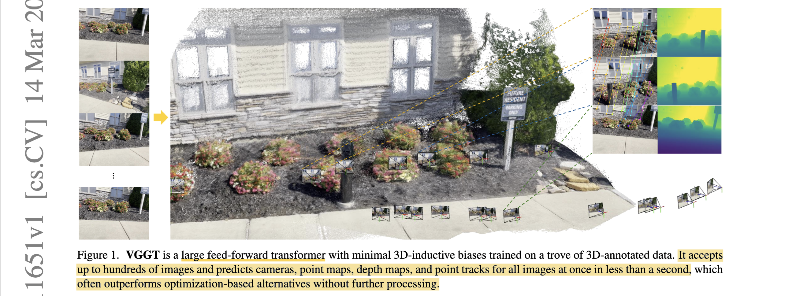
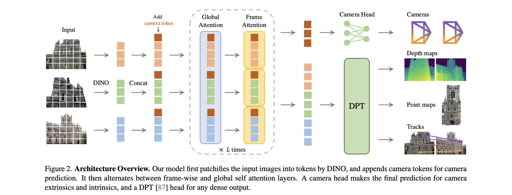
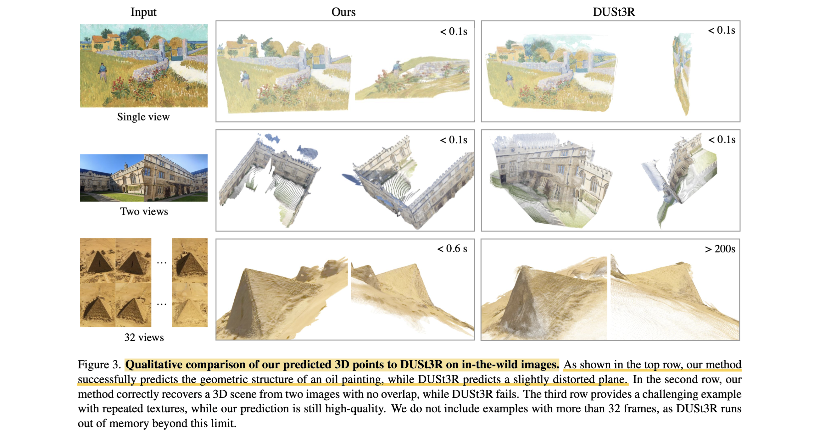

# VGGT: Visual Geometry Grounded Transformer

- **Authors:** Jianyuan Wang, Minghao Chen, Nikita Karaev, Andrea Vedaldi, Christian Rupprecht, David Novotny
- **Affiliations:** Visual Geometry Group, University of Oxford; Meta AI
- **Published:** CVPR 2025 (Best Paper Award, Oral), arXiv 2503.11651
- **Keywords:** 3D reconstruction, camera pose estimation, depth estimation, point tracking, feed-forward transformer, multi-view stereo
- **Webpage:** https://vgg-t.github.io/
- **GitHub:** https://github.com/facebookresearch/vggt
- **HuggingFace:** https://huggingface.co/spaces/facebook/vggt

---

## Pass 1 — Bird's-Eye View



| C | Assessment |
|---|-----------|
| **Category** | System paper introducing a large feed-forward transformer for multi-task 3D scene understanding from images |
| **Context** | Builds on the DUSt3R/MASt3R paradigm of learning pointmaps from image pairs, extends it to handle hundreds of views in one forward pass; draws on VGGSfM for camera parametrisation, DINOv2 for image tokenisation, DPT for dense prediction heads, and CoTracker2 for point tracking |
| **Correctness** | Assumptions appear sound; the paper evaluates on standard benchmarks (CO3Dv2, RealEstate10K, DTU, ETH3D, ScanNet, TAP-Vid, IMC) and shows SOTA across all; ablations are thorough; scale-normalisation choices are well motivated |
| **Contributions** | (1) First feed-forward network that jointly predicts camera parameters, depth maps, point maps, and 3D point tracks for up to hundreds of views in a single pass; (2) Alternating-Attention (AA) transformer design replacing cross-attention; (3) Multi-task training shown to boost all subtasks; (4) VGGT features serve as a strong backbone for downstream tasks (novel view synthesis, dynamic tracking) |
| **Clarity** | Very well written; architecture and losses are clearly described, ablations are clean, and limitations are honestly stated |

VGGT is a 1.2 B-parameter feed-forward transformer that takes 1–hundreds of images and, in under one second, jointly predicts per-image camera intrinsics/extrinsics, depth maps, point maps, and dense tracking features — outperforming optimisation-based baselines (DUSt3R, MASt3R, VGGSfM) across all standard 3D benchmarks while being orders-of-magnitude faster, and serving as a transferable backbone for downstream tasks.

---

## Pass 2 — Careful Read

### Core Idea in One Sentence

Replace the traditional SfM + MVS + tracking pipeline with a single large transformer that reads raw images and directly writes all key 3D scene attributes in one forward pass.

### Method / Approach



- **Alternating-Attention (AA) backbone:** A 24-layer transformer that alternates between *frame-wise* self-attention (within each image independently) and *global* self-attention (across all images together). This is cheaper than cross-attention and empirically outperforms both pure global self-attention and cross-attention.
- **Image tokenisation via DINOv2:** Each input image is patchified with a frozen DINOv2 ViT-L; learnable camera tokens and register tokens are appended per frame. Distinct learnable tokens for the first frame let the model ground all predictions in frame-1's coordinate system.
- **Prediction heads:** A lightweight camera head (4 extra self-attention layers + linear) reads camera tokens to output 9-D camera parameters (rotation quaternion, translation, field-of-view). DPT heads decode image tokens into depth maps $D_i$ , point maps $P_i$ , and dense tracking features $T_i$ ; aleatoric uncertainty maps $\Sigma^D_i$ and $\Sigma^P_i$ are predicted alongside.
- **Multi-task training with uncertainty-weighted losses:** Four losses are summed — camera (Huber), depth (uncertainty + gradient term), point map (same form as depth), and tracking (L1) — trained end-to-end on 16 publicly available 3D-annotated datasets for 160K iterations on 64 A100 GPUs over 9 days.

### Key Results

| Benchmark | Metric | DUSt3R | MASt3R | VGGSfM v2 | VGGT (FF) | VGGT + BA |
|---|---|---|---|---|---|---|
| CO3Dv2 camera | AUC@30 ↑ | 76.7 | 81.8 | 83.4 | **88.2** | **91.8** |
| RealEstate10K camera | AUC@30 ↑ | 67.7 | 76.4 | 78.9 | **85.3** | **93.5** |
| ETH3D point map | Overall (Chamfer) ↓ | 1.005 | 0.826 | — | **0.677** | — |
| DTU depth (no GT cam) | Overall ↓ | 1.741 | — | — | **0.382** | — |
| IMC camera | AUC@10 ↑ | 35.62 | 57.42 | 76.82 | 71.26 | **84.91** |
| ScanNet matching | AUC@20 ↑ | — | — | — | **73.4** | — |

**Inference time (10 frames, H100):** ~0.2 s vs. ~7–10 s for DUSt3R/MASt3R/VGGSfM.

Ablation highlights:
- Alternating-Attention beats global-only (ETH3D Overall 0.709 vs. 0.827) and cross-attention (1.061).
- All three auxiliary losses (camera, depth, tracking) each contribute; removing any one degrades point map accuracy by 2–18%.
- "Depth + Camera" inference (unproject depth with predicted camera) outperforms dedicated point-map head directly.

### Strengths

- **Generalist 3D backbone:** One model, one forward pass, all 3D tasks — including camera, dense geometry, and tracking.
- **Speed:** 0.04–8.75 s for 1–200 frames; DUSt3R/MASt3R cannot even run 32+ frames without OOM.
- **Transferability:** VGGT features improve CoTracker's dynamic tracking by large margins (e.g., $\delta_{avg}^{vis}$ +5.1 on TAP-Vid RGB-S) and match LVSM for NVS without requiring input cameras.
- **Strong generalisation:** Out-of-domain results (oil paintings, non-overlapping frames, textureless deserts) show robustness well beyond training distribution.
- **Compatible with post-optimisation:** Adding BA on VGGT output takes ~1.8 s and achieves new SOTA on IMC, because predicted point maps serve as BA initialization without needing triangulation.

### Weaknesses / Open Questions

1. **No fisheye / panoramic support:** Principal-point-at-centre assumption baked in; would require architectural change.
2. **Large rotation robustness:** Performance degrades with extreme input rotations, likely because global attention cannot handle large viewpoint gaps without pose priors.
3. **Dynamic scenes:** Model handles only minor non-rigid motion; dense deformable reconstruction is out of scope.
4. **Memory scales quadratically with tokens:** 200 frames already consume 40 GB GPU memory; LLM-style tensor parallelism is suggested but not implemented.
5. **Training cost:** 9 days on 64 A100s; fine-tuning for niche domains is feasible but not free.

### References to Follow Up

1. **[DUSt3R: Geometric 3D Vision Made Easy](../../2024/DUSt3R-_Geometric_3D_Vision_Made_Easy/)** — Wang et al., CVPR 2024: The two-view pointmap predecessor that VGGT generalises.
2. **MASt3R: Grounding Image Matching in 3D** — Leroy et al., ECCV 2024: Extends DUSt3R with matching-aware features; direct competitor.
3. **VGGSfM: Visual Geometry Grounded Deep Structure from Motion** — Wang et al., CVPR 2024: Differentiable SfM backbone that VGGT's camera parametrisation and BA integration are based on.
4. **CoTracker: It Is Better to Track Together** — Karaev et al., ECCV 2024: The point-tracking architecture whose backbone VGGT replaces for dynamic tracking.
5. **LVSM: A Large View Synthesis Model with Minimal 3D Inductive Bias** — Jin et al., arXiv 2024: The NVS model whose training protocol VGGT-NVS follows; useful for comparing feed-forward NVS design choices.



---

## Pass 3 — Virtual Re-implementation

### Detailed Technical Summary

**Problem Formulation.** Given $N$ RGB images $I_i \in R^{3 \times H \times W}$ of a static scene, the goal is to predict per-image tuples $(g_i, D_i, P_i, T_i)$ where:
- $g_i = [q_i, t_i, f_i] \in R^9$ is the camera (rotation quaternion, translation, field-of-view); the first camera is always the world reference frame so $g_1 = [0,0,0,1,\ 0,0,0,\ f_1]$.
- $D_i \in R^{H \times W}$ is the metric depth map in frame-1 coordinates.
- $P_i \in R^{3 \times H \times W}$ is the 3D pointmap; $P_i(y)$ is the 3D coordinate of pixel $y$ expressed in frame-1's coordinate system.
- $T_i \in R^{C \times H \times W}$ is a dense feature map used by a separately-trained tracking head.

**Image Tokenisation.** Each $I_i$ is patchified with DINOv2 ViT-L (patch size 14 px) into $K$ tokens $t_i^I \in R^{K \times 1024}$, where $K = (H/14)(W/14)$. Positional embeddings are added. DINOv2's intermediate block features (4th, 11th, 17th, 23rd blocks) are fed to DPT heads, following Depth Anything V2's multi-scale fusion pattern.

**Special Tokens.** Each frame receives one camera token $t_i^g$ and four register tokens $t_i^R$ (from [Darcet et al., 2023]). Crucially, the first frame uses distinct learnable tokens $\bar{t}^g, \bar{t}^R$ while all other frames share another set $\bar{\bar{t}}^g, \bar{\bar{t}}^R$. This asymmetry is the only mechanism by which the model knows which frame is the reference; the architecture is otherwise permutation-equivariant for frames $i \geq 2$.

**Alternating-Attention Transformer.** The concatenation of all tokens across all frames enters a 24-block transformer. Each block has:
1. Frame-wise self-attention: attends within tokens of the same image.
2. Global self-attention: attends across all tokens of all images.

Both layers use QKNorm and LayerScale (init 0.01) for training stability. Flash Attention v3 is used during inference. Cross-attention is explicitly rejected: experiments show self-attention-only architectures outperform cross-attention variants at matched parameter count, likely because cross-attention compresses inter-frame information unevenly.

**Camera Head.** The output camera tokens $\hat{t}_i^g$ pass through 4 additional global self-attention layers and a linear layer to produce $\hat{g}_i \in R^9$.

**Dense Heads (DPT).** Output image tokens $\hat{t}_i^I$ pass through a DPT decoder to produce $F_i \in R^{C'' \times H \times W}$. Then $3 \times 3$ convolutions produce depth $\hat{D}_i$, pointmap $\hat{P}_i$, and tracking features $\hat{T}_i$. Uncertainty maps $\hat{\Sigma}_i^D$ and $\hat{\Sigma}_i^P$ (positive scalars per pixel) are also output; they are used in losses and indicate model confidence post-training.

**Point Tracking Head.** CoTracker2's architecture is adopted. Given query points $(y_j)_{j=1}^M$ in the query frame, the module bilinearly samples $T_q$ at each query location, correlates with all $T_i$, and refines 2D positions with self-attention layers. Visibility (binary cross-entropy) is also predicted.

**Losses.** Total loss:

```math
L = L_{camera} + L_{depth} + L_{pmap} + 0.05 \cdot L_{track}
```

Camera loss (Huber):

```math
L_{camera} = \sum_{i=1}^N |\hat{g}_i - g_i|_\epsilon
```

Depth loss (uncertainty-weighted + gradient term):

```math
L_{depth} = \sum_{i=1}^N \| \hat{\Sigma}_i^D \odot (\hat{D}_i - D_i) \| + \| \hat{\Sigma}_i^D \odot (\nabla \hat{D}_i - \nabla D_i) \| - \alpha \log \hat{\Sigma}_i^D
```

Point map loss is identical in form, using $\hat{\Sigma}_i^P$ and $\hat{P}_i$.

Tracking loss:

```math
L_{track} = \sum_{j=1}^M \sum_{i=1}^N \| y_{j,i} - \hat{y}_{j,i} \|
```

**Ground-Truth Normalisation.** All 3D quantities are expressed in frame-1's coordinate system, then scaled by the mean Euclidean distance of all pointmap points from the origin. Crucially, this normalisation is applied only to ground-truth labels — the network learns to output normalised predictions natively, without an explicit normalisation layer on outputs.

**Training Data.** 16 datasets: Co3Dv2, BlendMVS, DL3DV, MegaDepth, Kubric, WildRGB, ScanNet, HyperSim, Mapillary, Habitat, Replica, MVS-Synth, PointOdyssey, Virtual KITTI, Aria Digital Twin/Synthetic, and an internal Objaverse-like synthetic set. Each dataset is sampled with approximately equal weight per iteration.

**Training Setup.** AdamW, cosine LR schedule, peak LR = 0.0002, 8K warmup, 160K total iterations; 2–24 frames per scene, total 48 frames per batch. Input resolution: up to 518 px long-edge, crop to multiple of 14. Random colour jitter, Gaussian blur, and grayscale augmentation are applied independently per frame.

### Hidden Assumptions

1. **Static scenes:** The scene surface $S_i$ is allowed to vary with time $i$ in the formal definitions, but training data and losses assume rigid scenes; dynamic content is handled poorly.
2. **Principal point at image centre:** Camera intrinsics omit the principal point offset; this works for most cameras but fails for non-centred crops.
3. **Frame-1 as reference is informative:** The model relies on a shared global reference but the choice of frame 1 is arbitrary at test time; extreme viewpoint gaps between frame 1 and other frames likely hurt performance.
4. **Scale defined by mean point distance:** The scale normalisation is globally unique but scene-dependent — a scene with 1 point will give a different scale than one with 10,000 points; this is never discussed as a potential failure mode.
5. **DINOv2 generalisability:** The tokeniser is frozen from image-classification pre-training; the assumption is that these features generalise to all input domains (medical images, thermal, etc.).

### Reproducibility Notes

- **Code & weights:** Fully released at https://github.com/facebookresearch/vggt (Apache 2 for code; a non-commercial model weight and a separate commercial weight `VGGT-1B-Commercial`).
- **Compute:** 9 days × 64 A100 GPUs; roughly 13,824 GPU-hours — significant but feasible for a research lab.
- **Data:** All 16 datasets are publicly available except the internal Objaverse-like synthetic set; its exclusion may cause minor reproducibility gaps.
- **Underspecified:** Dataset mixing weights are described only as "approximately equal" — exact weights are not given and likely matter for final performance.
- **DPT feature selection:** The paper says blocks 4, 11, 17, 23 are used for DPT (following Depth Anything V2), but the exact fusion strategy is in the appendix only.
- **Tracking training:** CoTracker2's full architecture is used but the joint fine-tuning schedule vs. the separate fine-tuning schedule for downstream CoTracker is not entirely clear.

### Ideas for Future Work

1. **Fisheye / panoramic generalisation:** Extend the camera parametrisation to support radial distortion and equirectangular projections; fine-tuning on appropriate datasets (e.g., OmniObject3D) would be a natural next step.
2. **Dynamic scene support:** Replace the static scene assumption with a per-frame surface model; MonST3R-style temporal reasoning within the AA backbone.
3. **Memory-efficient global attention:** Integrate sliding-window or hierarchical attention so hundreds of frames can be processed on a single consumer GPU.
4. **Self-supervised / unsupervised training:** Differentiable BA can serve as a supervision signal where GT 3D is unavailable; this was noted as promising in the discussion but excluded due to training cost.
5. **Downstream robotics / SLAM integration:** VGGT's per-frame uncertainty maps are natural inputs to a Kalman filter or factor graph; combining with an online state estimator could enable real-time SLAM.
6. **Scaling laws:** The paper trains a single 1.2 B model; a study of how performance scales with parameters and data would clarify where VGGT sits on the frontier.

---

## Pass 4 — Modern Perspective Review (as of July 2026)

### What Has Changed Since Publication

- **[VGGT-Omega](../../2026/VGGT-Omega/) released (May 2026):** The successor model from the same group substantially extends VGGT with improved dynamic scene handling and better memory efficiency, validating that the design space opened by VGGT is still actively expanding.
- **Concurrent feed-forward reconstruction wave:** At the time of CVPR 2025, Fast3R, CUT3R, FLARE, and MV-DUSt3R all tackled similar multi-view feed-forward reconstruction; post-publication, this space has continued to grow rapidly (SceneVGGT for 3D SLAM, 3D-Mix for VLA models, etc.).
- **Gaussian Splatting integration:** VGGT's COLMAP-format export has been adopted as an initialisation for 3DGS pipelines, making the paper practically important beyond its stated benchmarks.
- **Quantisation research:** A quantised VGGT variant has been published (arXiv 2509.21302), confirming demand for lighter deployment.
- **SpatialBench:** New benchmarks evaluating "spatial foundation models" have begun to include VGGT as a reference baseline, suggesting it has been adopted as a canonical anchor point.

### Has the Community Accepted the Claims?

The community has broadly validated VGGT's central claims. The CVPR 2025 Best Paper Award is itself a strong community endorsement. Follow-on work (SceneVGGT, 3D-Mix, quantisation papers) treats VGGT as a foundation to build on rather than a result to dispute. The one area of ongoing debate is how VGGT compares to optimisation-based methods on highly challenging phototourism data: on IMC, feed-forward VGGT (AUC@10 = 71.26) is still below VGGSfM v2 (76.82), though VGGT + BA surpasses it. This gap has motivated continued work on combining feed-forward initialisation with lightweight optimisation.

---

### Comparison Papers

#### Predecessors

| Paper | Authors | Year | Relation |
|---|---|---|---|
| [DUSt3R: Geometric 3D Vision Made Easy](../../2024/DUSt3R-_Geometric_3D_Vision_Made_Easy/) | Wang, Leroy, Cabon et al. | 2024 | Direct predecessor: introduced the pointmap regression paradigm for image pairs; VGGT extends to N views in one pass |
| MASt3R: Grounding Image Matching in 3D | Leroy, Cabon, Revaud | 2024 | Extends DUSt3R with matching-aware features; strongest direct baseline |
| VGGSfM: Visual Geometry Grounded Deep Structure from Motion | Wang, Karaev, Rupprecht, Novotny | 2024 | Same author group; camera parametrisation (quaternion + FoV) and BA integration are reused |
| DINOv2: Learning Robust Visual Features without Supervision | Oquab et al. | 2024 | Provides frozen image tokeniser; critical for training stability |
| CoTracker: It Is Better to Track Together | Karaev, Rocco et al. | 2024 | Tracking head architecture directly adopted; used as backbone replacement in downstream experiments |
| DPT: Vision Transformers for Dense Prediction | Ranftl, Bochkovskiy, Koltun | 2021 | Dense prediction head architecture |

#### Contemporaries / Competitors

| Paper | Authors | Year | Relation |
|---|---|---|---|
| Fast3R: Towards 3D Reconstruction of 1000+ Images in One Forward Pass | Yang, Sax et al. | 2025 | Concurrent work solving the same N-view feed-forward reconstruction problem; uses tensor parallelism for scale |
| CUT3R: Continuous 3D Perception with Persistent State | Wang, Zhang et al. | 2025 | Concurrent; adds recurrent state to maintain persistent scene memory across frames |
| FLARE: Feed-Forward Geometry, Appearance and Camera Estimation | Zhang, Wang et al. | 2025 | Concurrent; also targets sparse uncalibrated views with a feed-forward approach |
| MV-DUSt3R+: Single-Stage Scene Reconstruction from Sparse Views | Tang, Fan et al. | 2024 | Concurrent; extends DUSt3R to multi-view in one stage without global alignment |

#### Successors / Extensions

| Paper | Authors | Year | Relation |
|---|---|---|---|
| [VGGT-Omega](../../2026/VGGT-Omega/) | Wang et al. (Meta AI / Oxford) | 2026 | Direct successor from the same group; extends VGGT for dynamic scenes and improved memory efficiency |
| SceneVGGT: VGGT-based Online 3D Semantic SLAM | — | 2026 | Integrates VGGT into a real-time SLAM pipeline for indoor scene understanding |
| 3D-Mix for VLA: Integrating VGGT-based 3D Information into VLA Models | — | 2026 | Uses VGGT as a 3D perception module inside Vision-Language-Action models for robotics |
| Quantized Visual Geometry Grounded Transformer | — | 2025 | Quantises VGGT-1B for efficient deployment on edge devices |
| [DINOv3](../../2025/DINOv3/) | — | 2025 | References VGGT as a downstream application of strong visual features (from knowledge graph) |

---

### Bottom Line

VGGT is a landmark paper that genuinely shifts the 3D reconstruction paradigm: it demonstrates convincingly that a single large feed-forward transformer, trained carefully on diverse 3D-annotated data, can match or beat specialised optimisation-based pipelines across all standard 3D tasks simultaneously and in real time. The CVPR 2025 Best Paper Award and the wave of follow-on work treating it as a foundation confirm its impact. It is unambiguously worth reading — both for its concrete design decisions (alternating attention, multi-task training, uncertainty-weighted losses) and as a case study in "scale + data + simple architecture" displacing hand-crafted geometry pipelines. The main open question — how far this paradigm extends to dynamic, fisheye, and memory-constrained settings — is already being addressed by its successors.
