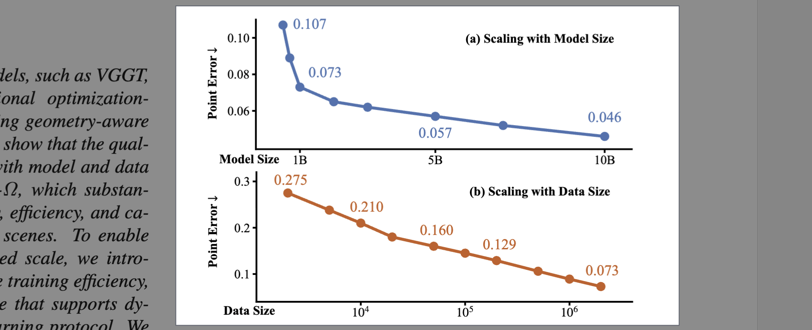
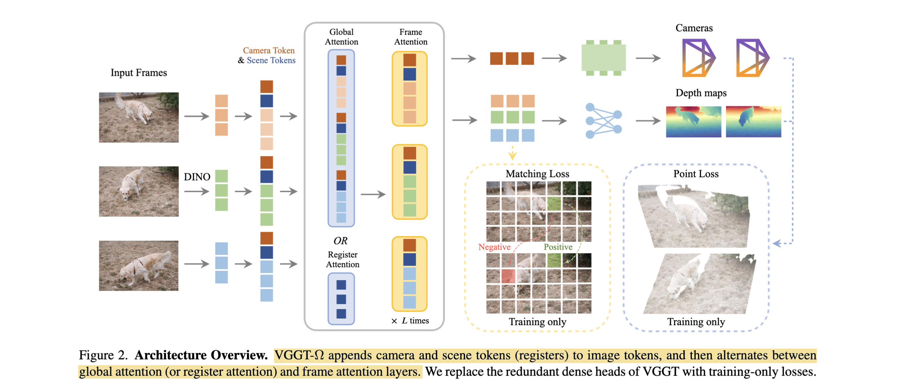
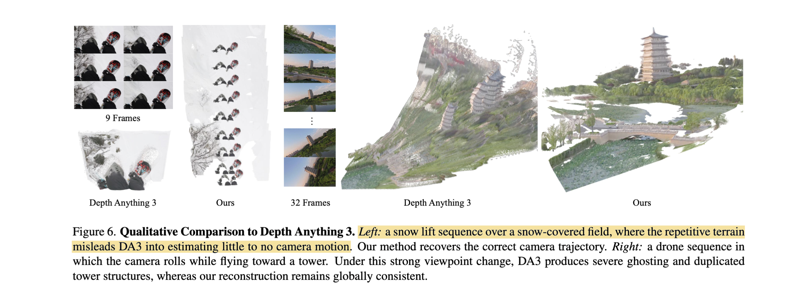

# VGGT-Ω

- **Authors:** Jianyuan Wang, Minghao Chen, Shangzhan Zhang, Nikita Karaev, Johannes Schönberger, Patrick Labatut, Piotr Bojanowski, David Novotny, Andrea Vedaldi, Christian Rupprecht
- **Affiliations:** Visual Geometry Group, University of Oxford; Meta AI
- **Published:** CVPR 2026 (Oral, Best Paper Finalist), arXiv:2605.15195, May 14, 2026
- **Keywords:** 3D reconstruction, camera pose estimation, depth estimation, feed-forward transformer, scaling laws, register attention, self-supervised learning, dynamic scenes
- **Webpage:** https://vggt-omega.github.io/
- **GitHub:** https://github.com/facebookresearch/vggt-omega
- **HuggingFace:** https://huggingface.co/spaces/facebook/vggt-omega

---

## Pass 1 — Bird's-Eye View

| C | Assessment |
|---|-----------|
| **Category** | System paper — improved feed-forward transformer for multi-task 3D reconstruction of static and dynamic scenes, with a central focus on demonstrating predictable scaling laws |
| **Context** | Builds directly on [VGGT](../../2025/VGGT-_Visual_Geometry_Grounded_Transformer/) (CVPR 2025 Best Paper), which itself builds on [DUSt3R](../../2024/DUSt3R-_Geometric_3D_Vision_Made_Easy/)/MASt3R; extends it with architectural efficiency via register attention, self-supervised learning on unlabeled video, and a dynamic-scene data pipeline; uses [DINOv3](../../2025/DINOv3/) as image tokenizer |
| **Correctness** | Assumptions are well-grounded: scaling laws are verified empirically across 0.2B–10B parameters and 2K–2M sequences; results on 6 standard benchmarks (3 static, 3 dynamic) are rigorous; self-supervised protocol uses clean EMA teacher-student design |
| **Contributions** | (1) Register attention reducing cross-frame information to 16 registers per image; (2) Lightweight MLP+pixel-shuffle decoder replacing expensive DPT[^1] convolutions; (3) Large-scale annotation pipeline supporting dynamic scenes (4M scenes, ~1/3 dynamic); (4) DINO-style self-supervised learning on 18M unlabeled videos; (5) Empirical power-law scaling curves for feed-forward 3D reconstruction; (6) Transferable register tokens for VLA[^2] robotics and language alignment |
| **Clarity** | Well-written; architecture changes are clearly motivated by efficiency analysis, scaling experiments are clean, ablations are informative |

**VGGT-Ω extends VGGT (CVPR 2025 Best Paper) by addressing its core bottlenecks — expensive high-resolution convolutions and quadratic global attention** — with register attention (routing cross-frame communication through 16 learnable registers per image) and a lightweight MLP+pixel-shuffle decoding head, reducing GPU memory to 30% of VGGT. This efficiency enables training on 15× more supervised data (4M scenes, ~1/3 dynamic) plus 18M unlabeled videos via a DINO-style teacher-student protocol. **The resulting model shows predictable power-law scaling with both model size (0.2B–10B) and data size (2K–2M sequences)**, achieves 77% better camera accuracy on Sintel, handles 1000+ frames on a single A100, and learns transferable registers that improve VLA models on LIBERO and align with natural language.



---
### Self-Question
#### Q: What are the inputs and outputs of the VGGT-Ω network?
- inputs: multiple images
- outputs: depth maps and camera parameters (quaternion, translation and FoV) for each image

#### Q: What's the main difference between VGGT, VGGT-Ω and DA3?
| name   | inputs | outputs | backbone | camera loss |
| ------ | ------ | ------- | -------- | ----------- |
| VGGT-Ω | multiple images, video frames | depth map, camera parameters | DINOv3 | L1 |
| VGGT   | multiple images | depth map, camera parameters, point map, tracking feature | DINOv2 | Huber Loss |
| DA3    | multiple images, (camera parameters) | depth map, ray map (ray origin + direction for each pixel) | DINOv2 | X |

#### Q: What's the main purpose of self-supervised finetuning?
Self-supervised finetuning in this paper is used to improve the prediction quality on video. The training starts from the VGGT-Ω trained on images only (supervised) and uses the teacher-student method for finetuning.

#### Q: What's the reason to use teacher-student method in self-supervised finetuning?
They use this method for self-supervised finetuning. In the **Further Insights** section, the authors say the teacher-student method is the only one they've tried that helps the finetuning. Note that this method is used to stabilize finetuning instead of distillation, see [Self-Supervised Learning Protocol](#detailed-technical-summary).

### Highlight
1. improved version of VGGT, reduces memory usage
2. proposes scaling laws for 3D reconstruction in both model size and data
3. data annotation pipeline, uses a VLM to filter video data
4. **Further Insights** section is quite helpful

---

## Pass 2 — Careful Read

### Core Idea in One Sentence

Scale VGGT's feed-forward 3D reconstruction to orders-of-magnitude more data and larger models by replacing its expensive global attention and convolutional decoder with a register-attention bottleneck and lightweight MLP head, unlocking predictable power-law quality improvements.

### Method / Approach



- **Register-based tokenization:** Each input image is tokenized by a DINOv3 ViT; 1 camera token and 16 learnable scene registers are appended per image. Registers act as compact, free-floating summary slots that aggregate scene-wide information — with $N$ frames of $T$ tokens, full global attention is $O(N^2 T^2)$ , whereas routing cross-frame communication through $R{=}16$ registers is approximately $O(NTR)$ , orders of magnitude cheaper.
- **Register attention:** Within 25% of global attention layers, inter-frame information exchange is restricted to the registers only; frames still apply full self-attention internally. The remaining 75% of global layers retain standard full attention. This reduces training FLOPs by ~23% and memory by ~16% on the attention component alone.
- **Lightweight upsampling head:** Replaces VGGT's DPT dense prediction heads (which used expensive high-resolution convolutional layers) with a single MLP followed by a pixel-shuffle operator. This alone reduces training GPU memory by 70%.
- **Multi-task training + self-supervised extension:** Supervised training uses four losses ($L_{cam}$ , $L_{depth}$ , $L_{point}$ , $L_{match}$) on 4M annotated scenes from a new annotation pipeline; self-supervised training follows with a DINO-style teacher-student protocol on 18M unlabeled videos, with camera/depth heads frozen — enabling learning from in-the-wild video with no 3D labels.

### Key Results

| Benchmark | Type | Metric | VGGT | VGGT-Ω |
|---|---|---|---|---|
| Sintel | Dynamic | Camera AUC@3° ↑ | prior best | +77% vs prior best |
| Sintel | Dynamic | Depth δ1.25 ↑ | prior best | +26% vs prior best |
| 7 Scenes | Static | — | SOTA | SOTA (improved) |
| NRGBD | Static | — | SOTA | SOTA (improved) |
| ETH3D | Static | — | SOTA | SOTA (improved) |
| DyCheck | Dynamic | — | — | SOTA |
| TUM-Dynamic | Dynamic | — | — | SOTA |
| MegaSaM speed | — | Throughput | — | 50× faster than MegaSaM |

**Efficiency at inference (NVIDIA A100, 80 GB):**

| Frames | VGGT-Ω GPU Memory |
|---|---|
| 1 | 6.02 GB |
| 100 | 13.37 GB |
| 500 | 43.15 GB |
| 1000+ | fits on single 80 GB A100 |

- Training uses only ~30% of VGGT's GPU memory; inference is 1.6× faster.
- Scaling ablation: both model size (0.2B → 10B) and data size (2K → 2M sequences) follow power-law improvement curves.

**Ablation highlights:**
- DINOv3 initialization significantly accelerates training vs. random init.
- Register attention (25% of global layers) achieves nearly the memory savings of full register attention with minimal accuracy loss.
- Self-supervised stage on unlabeled video further improves static benchmarks; gap to supervised remains on dynamic scenes.
- Motion awareness emerges automatically from reconstruction objectives without explicit motion supervision.

### Strengths

- **Efficiency without accuracy sacrifice:** Register attention and lightweight decoder together bring 30% memory and 1.6× speedup, enabling previously impossible scale.
- **Predictable scaling:** First feed-forward 3D model to demonstrate clean power-law scaling in both model and data dimensions — motivates future work with a strong empirical foundation.
- **Dynamic scene support:** End-to-end static+dynamic pipeline with a rigorously filtered annotation system (4M scenes with ~1/3 dynamic) is a substantial infrastructure contribution.
- **Self-supervised learning:** DINO-style protocol on 18M unlabeled videos is practical and shows meaningful gains, even if not yet at fully-supervised quality.
- **Transferable representations:** Frozen register tokens plug into VLA models (LIBERO benchmark) and align with language, showing the scene representation generalizes far beyond reconstruction.
- **Massive frame capacity:** 1000+ frames on a single A100 GPU at inference — practical for video-length inputs.

### Weaknesses / Open Questions

1. **Self-supervised vs. supervised gap on dynamics:** The paper acknowledges that self-supervised learning from unlabeled video shows "less detail than supervised training" for dynamic scenes — the gap is not fully closed.
2. **Annotation pipeline complexity:** The data pipeline (VLM[^3] filtering → Grounding DINO → COLMAP → XGBoost/RF/CatBoost) is elaborate and may be hard to reproduce without internal infrastructure.
3. **Register count fixed at 16:** No ablation on register count is presented; optimal register count may vary across scene complexity or frame count.
4. **Full numerical benchmark tables not available in summary:** Detailed per-benchmark numerical tables are in the paper but not fully reproduced in secondary sources.
5. **Language alignment scope limited:** Register-to-language alignment is demonstrated as a capability but not yet a full vision-language model; downstream task variety is limited to LIBERO.
6. **Training cost undisclosed:** Compute requirements for the 10B-parameter model or the self-supervised stage on 18M videos are not made explicit.

### References to Follow Up

1. **[VGGT: Visual Geometry Grounded Transformer](../../2025/VGGT-_Visual_Geometry_Grounded_Transformer/)** — Wang et al., CVPR 2025: The direct predecessor; understanding its architecture (alternating attention, DPT heads, multi-task losses) is essential to appreciate what VGGT-Ω changes.
2. **[DINOv3](../../2025/DINOv3/)** — Oquab et al., arXiv 2025: The image backbone used for tokenization; its initialization properties are credited for faster training.
3. **DINO / DINOv2** — Caron et al. / Oquab et al., ICCV 2021/2023: The teacher-student self-supervised learning paradigm that VGGT-Ω's self-supervised protocol is modelled on.
4. **MegaSaM** — Li et al., 2024/2025: Used as a key dynamic-scene baseline; VGGT-Ω is claimed to be 50× faster.
5. **Fast3R: Towards 3D Reconstruction of 1000+ Images in One Forward Pass** — Yang et al., arXiv 2025: Contemporary competitor for large-frame-count feed-forward reconstruction.
6. **Depth Anything 3: Recovering the Visual Space from Any Views (DA3)** — Lin et al., arXiv 2025: Contemporary VGGT-style feed-forward competitor; compared against in camera pose, depth, and efficiency experiments.



---

## Pass 3 — Virtual Re-implementation

### Detailed Technical Summary

**Architecture Overview**

VGGT-Ω inherits the high-level structure from VGGT: a ViT backbone operating on $N$ images, each producing $T$ patch tokens plus special tokens, with alternating frame-wise self-attention and global cross-frame attention. The key changes are in (a) the global attention mechanism and (b) the decoding head.

**Tokenization with DINOv3**

Each input image (resized to 624×416 pixels) is processed by a DINOv3 ViT into $T$ patch tokens. Appended to each image's token sequence are: 1 learnable camera token and 16 learnable scene registers, giving $T + 17$ tokens per frame. Unlike VGGT's DINOv2 backbone, DINOv3 initialization is found to significantly speed up convergence — the features are closer to the geometric representations needed for reconstruction.

**Register Attention**

Standard global attention in VGGT attends all $NT$ tokens across all frames jointly: quadratic in both $N$ and $T$. VGGT-Ω introduces register attention as a drop-in replacement for 25% of global attention layers.

In a register attention layer:
- All tokens in a frame attend to all other tokens within that frame (frame-wise local attention, retained from VGGT).
- For cross-frame communication, tokens can only attend to the $16N$ register tokens (16 per frame) across all frames; registers attend to all tokens across all frames.
- This routes global scene context through a compact bottleneck of $16N$ registers rather than all $NT$ tokens.

With $N=100$ frames and $T=1000$ tokens per frame: full global attention = $10^8$ attention operations; register attention = $\approx 1.6 \times 10^6$ operations (registers) — ~62× fewer cross-frame operations. The paper reports ~23% FLOP savings and ~16% memory savings within these layers.

**Lightweight Upsampling Decoder**

VGGT used DPT (Dense Prediction Transformer) decoder heads with expensive high-resolution convolutional layers. VGGT-Ω replaces this with a single **depth** dense prediction head using:
- A small MLP applied to each token's feature vector, outputting $2u^2$ channels ($u=4$ in the implementation).
- A pixel-shuffle (sub-pixel convolution) operator that rearranges these into two full-resolution channels: **depth and confidence**.

Unlike VGGT — which predicts depth maps, point maps, and tracking features with separate dense heads — VGGT-Ω retains only this single dense head for depth (plus a separate sparse head for cameras, see below). It **does not directly predict point maps or tracking features**; those quantities are still *supervised* through their losses (§Loss Functions) but are inferred from the depth and camera outputs rather than emitted by a head. Dropping the redundant dense heads yields ~70% reduction in training GPU memory for the decoder component with nearly identical accuracy.

**Camera Head**

Cameras $(g_1, \ldots, g_N)$ are predicted by a separate lightweight (sparse) head: a small transformer applied jointly to the $N$ camera tokens and scene registers, followed by an MLP on each updated camera token. Unlike VGGT, VGGT-Ω predicts camera parameters in a **single pass**, without iterative refinement.

**Loss Functions**

Training is supervised with four multi-task losses:

```math
L = L_{cam} + L_{depth} + L_{point} + L_{match}
```

- $L_{cam}$ : L1 loss on predicted vs. ground-truth camera rotation (quaternion), translation, and field-of-view.
- $L_{depth}$ : Uncertainty-weighted depth loss plus a gradient consistency term (encourages sharp edges); same form as VGGT.
- $L_{point}$ : Applied to 3D points unprojected from predicted depth + camera, in the reference frame's coordinate system.
- $L_{match}$ : Weighted binary cross-entropy contrastive loss on token features, encouraging matched tokens across views to be similar and non-matched ones to be dissimilar.

**Data Annotation Pipeline**

The annotation pipeline processes raw video to produce 3D-annotated training sequences:
1. **VLM pre-filtering:** A vision-language model scores video segments for reconstruction suitability; 90% of content is discarded (overly dark, textureless, featureless).
2. **Dynamic object masking:** Grounding DINO localises and masks dynamic objects (people, cars) to avoid confusing COLMAP reconstruction.
3. **Feature matching ensemble:** Multiple feature matchers (SuperGlue, ROMA, etc.) are ensembled; tracking is used for temporal consistency.
4. **COLMAP reconstruction:** Multi-image SfM with multi-view consistency checks.
5. **Geometric quality filtering:** XGBoost, random forest, and CatBoost classifiers trained on geometric quality signals filter out low-quality reconstructions.

**Result:** 4M diverse scenes (0.8M annotated, ~1/3 dynamic), covering 15× more data than prior work.

**Self-Supervised Learning Protocol**

A DINO-style teacher-student setup is applied to 18M unlabeled videos:

```math
\theta_T \leftarrow m \theta_T + (1-m) \theta_S
```

where $m$ is a momentum coefficient (e.g., 0.999). The teacher receives an augmented view; the student receives the primary view. Camera and depth heads are frozen during the self-supervised phase; only the backbone and register tokens are updated. The self-supervised objective is photometric/geometric consistency between teacher and student predictions.

**Scaling Experiments**

Model size is varied from 0.2B to 10B parameters (matching ViT-S to ViT-G equivalents). Data size is varied from 2K to 2M training sequences. Both dimensions exhibit clean power-law improvement curves on held-out benchmarks — establishing that feed-forward 3D reconstruction, like language models, benefits from predictable scaling.

**Interesting Emergent Findings**

- **Motion awareness without explicit supervision:** The model learns to distinguish moving from static objects purely from multi-frame geometric consistency signals.
- **Depth/FoV in frame-wise FFNs[^4]:** Analysis via model souping (linearly combining differently-trained models) reveals that depth and FoV estimation information is localized primarily in the feed-forward network layers of frame-wise attention blocks, not in cross-frame attention layers.
- **Register transferability:** Frozen VGGT-Ω registers, when injected as additional tokens into a VLA model, improve all LIBERO benchmark tasks without fine-tuning the VLA model. Registers can also be aligned to VLM text embeddings via a symmetric InfoNCE[^5] loss.

### Hidden Assumptions

1. DINOv3 features are sufficiently rich for geometric reconstruction without task-specific pretraining of the backbone.
2. 16 registers per image are sufficient to capture scene-level context regardless of scene complexity or number of frames.
3. COLMAP-reconstructed pseudo-labels from the annotation pipeline are high-quality enough to serve as ground truth for supervised training.
4. The 25%/75% split between register attention and full global attention layers is near-optimal; this design choice is not ablated in available secondary sources.
5. EMA teacher-student works for geometric supervision with frozen camera/depth heads (borrowing an assumption from DINO/DINOv2 that applies to photometric tasks).
6. Camera and depth heads can be frozen during self-supervised training without introducing distribution shift relative to the supervised stage.

### Reproducibility Notes

- **Checkpoints available:** Two public checkpoints — `VGGT-Omega-1B-512` (no text alignment) and `VGGT-Omega-1B-256-Text-Alignment` — on HuggingFace (requires model access request).
- **Code:** GitHub `facebookresearch/vggt-omega`, PyTorch with Gradio demo included.
- **Training data:** 0.8M annotated scenes from the internal annotation pipeline (proprietary); 3M public sequences (partially reproducible). The 40M internal videos used for self-supervised training are not released.
- **Missing hyperparameters:** EMA momentum $m$ , register count ablation, learning rate schedule for self-supervised phase, and full data mixture ratios are not detailed in available summaries.
- **Compute:** Exact GPU count and training duration for the full pipeline are not publicly reported in secondary sources; the paper likely discloses these, but the 10B model may be impractical to train.
- **Input resolution:** Fixed at 624×416 pixels for publicly released checkpoints; higher-resolution variants are not released.

### Ideas for Future Work

1. **Adaptive register count:** Dynamically allocating registers based on scene complexity or frame count could better balance efficiency and quality.
2. **Fully self-supervised 3D reconstruction:** Closing the remaining gap between self-supervised and supervised dynamic scene performance would remove the dependency on expensive COLMAP annotation pipelines.
3. **Register-based 3D scene querying:** Extend text-aligned registers into a full 3D-spatial language model for open-vocabulary 3D scene understanding.
4. **Streaming/online inference:** VGGT-Ω processes all frames jointly; adapting registers into a recurrent state would enable online streaming reconstruction without holding all frames in memory.
5. **Task-specific register specialization:** Current registers are generic; explicitly specializing subsets (e.g., 4 for camera, 12 for scene geometry) could improve downstream transfer.
6. **Fisheye and 360° support:** Neither VGGT nor VGGT-Ω handles non-pinhole cameras; extending register attention to handle such images would unlock autonomous driving and robotics applications.

---

## Pass 4 — Modern Perspective Review (as of July 2026)

### What Has Changed Since Publication

- **Dynamic scene benchmark matures:** Sintel, DyCheck, and TUM-Dynamic are now the de facto standard trio for evaluating feed-forward models on non-rigid scenes; VGGT-Ω's 77% Sintel improvement has set a new bar that subsequent papers must beat.
- **Scaling laws established in 3D:** VGGT-Ω is among the first to publish clean scaling curves for geometric 3D tasks, mirroring LLM scaling law literature (Chinchilla, etc.) — this shifts community expectations toward data/compute budget analysis.
- **Self-supervised 3D becoming mainstream:** The field is moving toward learning from in-the-wild video without dense 3D labels; VGGT-Ω's protocol provides a strong baseline design.
- **Register representations as universal scene tokens:** The finding that registers transfer to VLA and language tasks positions them as a potential standard "3D scene context token" interface.

### Has the Community Accepted the Claims?

VGGT-Ω's CVPR 2026 Oral + Best Paper Finalist designation signals strong community endorsement. The 50× MegaSaM speedup claim is cited as practically significant for robotics teams. Derivative works (SceneVGGT for SLAM, 3D-Mix for VLA integration, Quantized VGGT for edge deployment, HD-VGGT for high-resolution extension) confirm broad uptake. The scaling law claims are accepted but prompt follow-on questions about whether self-supervised scaling closes the gap to supervised on dynamic scenes — an open question at time of publication. The register transferability result has attracted interest from the VLA/embodied-AI community independently of the reconstruction claims.

---

### Comparison Papers

#### Predecessors

| Paper | Authors | Year | Relation |
|---|---|---|---|
| [VGGT: Visual Geometry Grounded Transformer](../../2025/VGGT-_Visual_Geometry_Grounded_Transformer/) | Wang et al. | 2025 | Direct predecessor and primary experiment baseline across all six static + dynamic benchmarks (Tab. 1–2); VGGT-Ω is an architectural and data-scaling extension |
| [DUSt3R: Geometric 3D Vision Made Easy](../../2024/DUSt3R-_Geometric_3D_Vision_Made_Easy/) | Wang et al. | 2024 | Foundational pointmap paradigm that VGGT (and therefore VGGT-Ω) builds on |
| MASt3R: Grounding Image Matching in 3D | Leroy et al. | 2024 | Extended DUSt3R with matching; key baseline in the lineage |
| DINOv2 / [DINOv3](../../2025/DINOv3/) | Oquab et al. | 2023/2025 | ViT backbone used for tokenization; DINOv3 initialization critical for convergence |
| DINO: Self-Supervised Vision Transformers | Caron et al. | 2021 | Teacher-student EMA protocol directly adopted for self-supervised stage |
| VGGSfM: Visual Geometry Grounded Deep SfM | Wang et al. | 2024 | Camera parametrisation design used in VGGT and inherited here |

#### Contemporaries / Competitors

| Paper | Authors | Year | Relation |
|---|---|---|---|
| Fast3R: Towards 3D Reconstruction of 1000+ Images in One Forward Pass | Yang et al. | 2025 | Concurrent large-frame-count feed-forward competitor |
| CUT3R: Continuous 3D Perception with Persistent State | Wang et al. | 2025 | Online video 3D perception alternative with persistent state |
| FLARE: Feed-Forward Geometry, Appearance and Camera Estimation | Zhang et al. | 2025 | Feed-forward competitor adding appearance estimation |
| Depth Anything 3: Recovering the Visual Space from Any Views (DA3) | Lin et al. | 2025 | VGGT-style feed-forward reconstruction; VGGT-Ω outperforms it on every benchmark especially videos with repeated features; experiment baseline for camera pose (Tab. 1), depth (Tab. 2) and memory/speed (Fig. 6–7) |
| PI3 | — | 2025 | VGGT-style feed-forward model trained on dynamic data; removes reliance on a fixed reference view; experiment baseline (Tab. 1–2) |
| MonST3R | Zhang et al. | 2024 | DUSt3R extension for dynamic 3D content; experiment baseline (Tab. 1–2) |
| MapAnything: Universal Feed-Forward Metric 3D Reconstruction | Keetha et al. | 2025 | Universal feed-forward metric reconstruction; experiment baseline (Tab. 1–2) |
| MegaSaM | Li et al. | 2025 | Optimization-based dynamic reconstruction baseline compared in experiments; VGGT-Ω is 50× faster |
| FlashVGGT: Efficient Visual Geometry Transformers | — | 2025 | Independent efficiency improvement of VGGT via compressed descriptor attention |

#### Successors / Extensions

| Paper | Authors | Year | Relation |
|---|---|---|---|
| SceneVGGT: VGGT-based Online 3D Semantic SLAM | — | 2026 | Integrates VGGT-Ω into online SLAM pipeline (from knowledge graph) |
| 3D-Mix for VLA: Integrating VGGT-based 3D Information into VLA Models | — | 2026 | Extends register transfer findings to broader VLA settings (from knowledge graph) |
| Quantized Visual Geometry Grounded Transformer | — | 2025 | Edge-deployment quantized version of VGGT/VGGT-Ω (from knowledge graph) |
| HD-VGGT: High-Resolution Visual Geometry Transformer | — | 2026 | Adds high-resolution dense prediction on top of VGGT-Ω |
| VGGT-Edit: Feed-Forward Native 3D Scene Editing with Residual Field Prediction | — | 2026 | Uses VGGT-Ω as backbone for native 3D scene editing |

---

### Bottom Line

VGGT-Ω is essential reading for anyone working on feed-forward 3D reconstruction. It is not merely an engineering improvement over VGGT — it answers two foundational questions: *Can 3D reconstruction quality scale predictably with compute and data?* (yes, empirically demonstrated) and *Can geometric representations transfer beyond reconstruction?* (yes, registers work in VLA and language tasks). The architectural contributions (register attention, lightweight decoder) are clean and likely to become standard components. At the same time, the supervised-to-self-supervised dynamic scene gap and the opaque internal annotation pipeline are real limitations. This paper defines the state of the art as of mid-2026 and sets the research agenda for scaling-law-driven 3D perception.

---

[^1]: **DPT** — Dense Prediction Transformer. See the [glossary](../../common/terms/).
[^2]: **VLA** — Vision-Language-Action model. See the [glossary](../../common/terms/).
[^3]: **VLM** — Vision-Language Model. See the [glossary](../../common/terms/).
[^4]: **FFN** — Feed-Forward Network. See the [glossary](../../common/terms/).
[^5]: **InfoNCE** — Information Noise-Contrastive Estimation. See the [glossary](../../common/terms/).
