# Paper Reading Knowledge Graph

## Relationship Diagram

```mermaid
graph TD
    classDef y2015 fill:#d0b0ff,stroke:#333
    classDef y2017 fill:#d0b0ff,stroke:#333
    classDef y2021 fill:#ffb3b3,stroke:#333
    classDef y2022 fill:#ffd9b3,stroke:#333
    classDef y2023 fill:#f9d71c,stroke:#333
    classDef y2024 fill:#87ceeb,stroke:#333
    classDef y2025 fill:#98fb98,stroke:#333
    classDef topic fill:#e0e0e0,stroke:#666,stroke-dasharray: 5 5

    %% Foundation papers
    ViT["ViT<br/>2021"]:::y2021
    CLIP["CLIP<br/>2021"]:::y2021
    DNeRF["D-NeRF<br/>2021"]:::y2021
    NSG["NSG<br/>2021"]:::y2021
    MAE["MAE<br/>2022"]:::y2022
    RITM["RITM<br/>2022"]:::y2022

    %% Core 3DGS family
    3DGS["3D Gaussian Splatting<br/>2023"]:::y2023
    ScaffoldGS["Scaffold-GS<br/>2023"]:::y2023
    HexPlane["HexPlane<br/>2023"]:::y2023
    KPlanes["K-Planes<br/>2023"]:::y2023
    2DGS["2DGS<br/>2024"]:::y2024
    4DGS["4D-GS<br/>2024"]:::y2024
    D3DGS["Dynamic 3DGS<br/>2023"]:::y2023

    %% SAM family
    SAM["SAM<br/>2023"]:::y2023
    SAM2["SAM 2<br/>2024"]:::y2024
    HQSAM["HQ-SAM<br/>2023"]:::y2023
    GSAM["Grounded-SAM<br/>2024"]:::y2024
    MobileSAM["MobileSAM<br/>2023"]:::y2023
    GSAM2["Grounded-SAM 2<br/>2024"]:::y2024
    DEVA["DEVA<br/>2023 ✓"]:::y2023

    %% DEVA predecessors / competitors
    XMem["XMem<br/>2022"]:::y2022
    STCN["STCN<br/>2021"]:::y2021
    M2F["Mask2Former<br/>2022"]:::y2022
    VKNet["Video-K-Net<br/>2022"]:::y2022
    OWTB["OWTB<br/>2022"]:::y2022
    SAMPT["SAM-PT<br/>2023"]:::y2023
    GDINO["Grounding DINO<br/>2023"]:::y2023
    UNINEXT["UNINEXT<br/>2023"]:::y2023
    SAMURAI["SAMURAI<br/>2024"]:::y2024

    %% Language / Segmentation fields
    LERF["LERF<br/>2023"]:::y2023
    LangSplat["LangSplat<br/>2023"]:::y2023
    LangSplatV2["LangSplatV2<br/>2025"]:::y2025
    4DLangSplat["4D LangSplat<br/>2025"]:::y2025
    GaussianGrouping["Gaussian Grouping<br/>2024"]:::y2024
    SAGA["SAGA<br/>2025"]:::y2025
    ObjectGS["ObjectGS<br/>2025"]:::y2025

    %% Driving
    StreetGS["Street Gaussians<br/>2024"]:::y2024
    GaussianDWM["GaussianDWM<br/>2025"]:::y2025
    MARS["MARS<br/>2023"]:::y2023
    EmerNeRF["EmerNeRF<br/>2024"]:::y2024
    HUGSIM["HUGSIM<br/>2024"]:::y2024

    %% Driving simulators / benchmarks
    UniAD["UniAD<br/>2023"]:::y2023
    NeuRAD["NeuRAD<br/>2024"]:::y2024
    DriveArena["DriveArena<br/>2024"]:::y2024
    NAVSIM["NAVSIM<br/>2024"]:::y2024
    RoGS["RoGS<br/>2024"]:::y2024
    GAIA1["GAIA-1<br/>2024"]:::y2024

    %% Dynamic competitors
    Deform3DGS["Deformable 3DGS<br/>2023"]:::y2023
    SCGS["SC-GS<br/>2024"]:::y2024
    MotionGS["MotionGS<br/>2024"]:::y2024

    %% SLAM family
    ElasticFusion["ElasticFusion<br/>2015"]:::y2015
    DSO["DSO<br/>2017"]:::y2017
    iMAP["iMAP<br/>2021"]:::y2021
    NICESLAM["NICE-SLAM<br/>2022"]:::y2022
    DROIDSLAMVO["DROID-SLAM<br/>2021"]:::y2021
    PointSLAM["Point-SLAM<br/>2023"]:::y2023
    CoSLAM["Co-SLAM<br/>2023"]:::y2023
    ESLAM["ESLAM<br/>2023"]:::y2023
    MonoGS["Gaussian Splatting SLAM<br/>(MonoGS) 2024"]:::y2024
    SplaTAM["SplaTAM<br/>2024"]:::y2024
    PhotoSLAM["Photo-SLAM<br/>2024"]:::y2024
    LoopSplat["LoopSplat<br/>2024"]:::y2024
    MASt3RSLAM["MASt3R-SLAM<br/>2024"]:::y2024

    %% === builds_on edges ===
    SAM -->|builds_on| MAE
    SAM -->|builds_on| ViT
    SAM -->|builds_on| CLIP
    SAM -->|builds_on| RITM
    SAM2 -->|builds_on| SAM
    SAM2 -->|builds_on| MAE

    4DGS -->|builds_on| 3DGS
    4DGS -->|builds_on| HexPlane
    4DGS -->|builds_on| KPlanes
    4DGS -->|builds_on| DNeRF
    D3DGS -->|builds_on| 3DGS

    LangSplat -->|builds_on| 3DGS
    LangSplat -->|builds_on| LERF
    LangSplat -->|builds_on| SAM
    LangSplat -->|builds_on| CLIP
    LangSplatV2 -->|builds_on| LangSplat
    4DLangSplat -->|builds_on| LangSplat
    4DLangSplat -->|builds_on| 4DGS

    StreetGS -->|builds_on| 3DGS
    StreetGS -->|builds_on| NSG
    StreetGS -->|builds_on| MARS
    GaussianDWM -->|builds_on| 3DGS
    GaussianDWM -->|builds_on| LangSplat
    GaussianDWM -->|builds_on| StreetGS

    HUGSIM -->|builds_on| 3DGS
    HUGSIM -->|builds_on| NSG
    HUGSIM -->|builds_on| MARS
    HUGSIM -->|builds_on| StreetGS
    HUGSIM -->|builds_on| UniAD

    MonoGS -->|builds_on| 3DGS
    MonoGS -->|builds_on| iMAP
    MonoGS -->|builds_on| NICESLAM
    MonoGS -->|builds_on| PointSLAM
    MonoGS -->|builds_on| DSO
    MonoGS -->|builds_on| ElasticFusion

    ObjectGS -->|builds_on| 3DGS
    ObjectGS -->|builds_on| ScaffoldGS
    ObjectGS -->|builds_on| 2DGS
    ObjectGS -->|builds_on| SAM
    ObjectGS -->|builds_on| GaussianGrouping
    ObjectGS -->|builds_on| LERF
    ObjectGS -->|builds_on| DEVA

    DEVA -->|builds_on| XMem
    DEVA -->|builds_on| SAM
    DEVA -->|builds_on| M2F
    DEVA -->|builds_on| VKNet
    DEVA -->|builds_on| STCN
    ScaffoldGS -->|builds_on| 3DGS

    %% === succeeded_by edges ===
    SAM -.->|succeeded_by| SAM2
    SAM -.->|succeeded_by| HQSAM
    SAM -.->|succeeded_by| GSAM
    SAM -.->|succeeded_by| MobileSAM
    SAM2 -.->|succeeded_by| GSAM2
    LangSplat -.->|succeeded_by| LangSplatV2
    LangSplat -.->|succeeded_by| 4DLangSplat
    LangSplat -.->|succeeded_by| GaussianDWM
    LangSplat -.->|succeeded_by| GaussianGrouping
    4DGS -.->|succeeded_by| SCGS
    4DGS -.->|succeeded_by| StreetGS
    D3DGS -.->|succeeded_by| GaussianGrouping
    HUGSIM -.->|succeeded_by| GAIA1
    HUGSIM -.->|succeeded_by| GaussianDWM
    HUGSIM -.->|succeeded_by| 4DLangSplat
    MonoGS -.->|succeeded_by| PhotoSLAM
    MonoGS -.->|succeeded_by| LoopSplat
    MonoGS -.->|succeeded_by| MASt3RSLAM
    ScaffoldGS -.->|succeeded_by| ObjectGS
    ObjectGS -.->|succeeded_by| MotionGS

    %% === competes_with edges ===
    4DGS -.-|competes_with| Deform3DGS
    4DGS -.-|competes_with| D3DGS
    StreetGS -.-|competes_with| EmerNeRF
    HUGSIM -.-|competes_with| DriveArena
    HUGSIM -.-|competes_with| NeuRAD
    HUGSIM -.-|competes_with| NAVSIM
    HUGSIM -.-|competes_with| RoGS
    MonoGS -.-|competes_with| SplaTAM
    MonoGS -.-|competes_with| CoSLAM
    MonoGS -.-|competes_with| ESLAM
    MonoGS -.-|competes_with| DROIDSLAMVO
    ObjectGS -.-|competes_with| SAGA
    ObjectGS -.-|competes_with| GaussianGrouping
    ObjectGS -.-|competes_with| LangSplat

    %% Subgraphs
    subgraph Segmentation / Foundation Models
        SAM
        SAM2
        HQSAM
        GSAM
        MobileSAM
        GSAM2
        DEVA
    end

    subgraph Language Fields / Object Understanding
        LERF
        LangSplat
        LangSplatV2
        4DLangSplat
        GaussianGrouping
        SAGA
        ObjectGS
    end

    subgraph Autonomous Driving
        StreetGS
        GaussianDWM
        MARS
        EmerNeRF
        NSG
        HUGSIM
        NeuRAD
        UniAD
    end

    subgraph Driving Simulation / Benchmarks
        HUGSIM
        DriveArena
        NAVSIM
        GAIA1
    end

    subgraph Dynamic Scenes
        4DGS
        D3DGS
        Deform3DGS
        SCGS
        MotionGS
    end

    subgraph SLAM / Reconstruction
        iMAP
        NICESLAM
        PointSLAM
        CoSLAM
        ESLAM
        MonoGS
        SplaTAM
        PhotoSLAM
        LoopSplat
        MASt3RSLAM
    end
```

## Paper Index

| Paper | Year | Keywords | Related Papers |
|---|---|---|---|
| [Scaffold-GS](2023/Scaffold-GS-_Structured_3D_Gaussians_for_View-Adaptive_Rendering/) | 2023 | 3DGS, view-adaptive rendering, anchor-based | 3DGS, ObjectGS |
| [Real-Time Radiance Fields for Single-Image Portrait View Synthesis](2023/Real-Time_Radiance_Fields_for_Single-Image_Portrait_View_Synthesis/) | 2023 | Image-based rendering, View Synthesis, NeRF | EG3D |
| [2D Gaussian Splatting](2024/2D_Gaussian_Splatting_for_geometrically_accurate_radiance_fields/) | 2024 | Surface Splatting, Surface Reconstruction, 3DGS | 3DGS, SuGaR, NeuS, ObjectGS |
| [4D Gaussian Splatting](2024/4D_Gaussian_Splatting_for_Real-Time_Dynamic_Scene_Rendering/) | 2024 | 3DGS, Dynamic Scenes, Real-Time Rendering | 3DGS, HexPlane, D-NeRF, SC-GS, Street Gaussians |
| [Segment Anything (SAM)](2023/Segment_Anything/) | 2023 | Foundation model, promptable segmentation, SA-1B | MAE, ViT, CLIP, SAM 2, HQ-SAM, LangSplat, ObjectGS |
| [SAM 2](2024/SAM_2-_Segment_Anything_in_Images_and_Videos/) | 2024 | Video segmentation, streaming memory, SA-V | SAM, Hiera, XMem, Cutie, 4D LangSplat |
| [LangSplat](2023/LangSplat-_3D_Language_Gaussian_Splatting/) | 2023 | 3DGS, language fields, CLIP, SAM | 3DGS, LERF, SAM, LangSplatV2, 4D LangSplat, GaussianDWM |
| [Street Gaussians](2024/Street_Gaussians-_Modeling_Dynamic_Urban_Scenes_with_Gaussian_Splatting/) | 2024 | 3DGS, Dynamic Urban Scenes, Autonomous Driving | 3DGS, NSG, MARS, EmerNeRF, GaussianDWM |
| [HUGSIM](2024/HUGSIM-_A_Real-Time,_Photo-Realistic_and_Closed-Loop_Simulator_for_Autonomous_Driving/) | 2024 | 3DGS, autonomous driving, closed-loop simulation | 3DGS, NSG, MARS, Street Gaussians, UniAD, DriveArena, NeuRAD |
| [Gaussian Splatting SLAM](2024/Gaussian_Splatting_SLAM/) | 2024 | 3DGS, SLAM, monocular, Lie group, SE(3) Jacobians | 3DGS, iMAP, NICE-SLAM, Point-SLAM, SplaTAM, Photo-SLAM |
| [ObjectGS](2025/ObjectGS-_Object-aware_scene_reconstruction_and_scene_understanding_via_Gaussian_Splatting/) | 2025 | 3DGS, object-aware, panoptic segmentation, open-vocabulary, discrete semantics | Scaffold-GS, 2DGS, SAM, DEVA, Gaussian Grouping, SAGA |
| [GaussianDWM](2025/GaussianDWM-_3D_Gaussian_Driving_World_Model_for_Unified_Scene_Understanding_and_Multi-Modal_Generation/) | 2025 | Driving World Model, Scene Understanding, 3DGS | 3DGS, LangSplat, Street Gaussians |
| [Dynamic 3D Gaussians](2023/Dynamic_3D_Gaussians-_Tracking_by_Persistent_Dynamic_View_Synthesis/) | 2023 | 3DGS, dynamic reconstruction, dense tracking | 3DGS, OmniMotion, Deformable 3DGS, Gaussian Grouping |
| [LangSplatV2](2025/LangSplatV2-_High-dimensional_3D_language_Gaussian_Splatting_with_450+_FPS/) | 2025 | 3DGS, language field, sparse coding, codebook | LangSplat, LERF, LEGaussians, 4D LangSplat |
| [4D LangSplat](2025/4D_LangSplat-_4D_Language_Gaussian_Splatting_via_Multimodal_Large_Language_Models/) | 2025 | 4DGS, language field, dynamic scene, MLLM | LangSplat, 4D-GS, LERF, Gaussian Grouping |

## Topic Clusters

### 3D Gaussian Splatting
Core representation and rendering papers extending the foundational 3DGS work.
- **3D Gaussian Splatting** (2023) - Foundational explicit radiance field representation
- **Scaffold-GS** (2023) - Anchor-based structured Gaussians for view-adaptive rendering
- **2D Gaussian Splatting** (2024) - Planar Gaussian disks for geometrically accurate surfaces
- **LangSplat** (2023) - Language-embedded Gaussians for open-vocabulary 3D querying
- **LangSplatV2** (2025) - Sparse codebook for 47x faster language Gaussian rendering
- **Street Gaussians** (2024) - Compositional Gaussians for dynamic urban scenes
- **GaussianDWM** (2025) - 3D Gaussian driving world model with LLM reasoning
- **Dynamic 3D Gaussians** (2023) - Persistent Gaussians for dense 6-DOF tracking
- **Gaussian Splatting SLAM** (2024) - First monocular SLAM system using 3DGS as the only representation
- **ObjectGS** (2025) - Object-aware anchor-based Gaussians with discrete one-hot semantic encoding

### Segmentation / Foundation Models
Promptable segmentation models and their ecosystem.
- **Segment Anything (SAM)** (2023) - Foundation model for promptable image segmentation
- **SAM 2** (2024) - Streaming memory extension for video segmentation
- **HQ-SAM** (2023) - High-quality mask refinement for fine structures
- **Grounded-SAM / Grounded-SAM 2** (2024) - Text-driven segmentation via Grounding DINO
- **MobileSAM** (2023) - Distilled lightweight encoder for real-time SAM
- **DEVA** (2023) - Decoupled video segmentation for cross-frame consistent object IDs
- **ObjectGS** (2025) - Uses SAM/DEVA for initialization; unifies 3D reconstruction with object-level segmentation

### Language Fields / Open-Vocabulary
Methods embedding language or semantic features into 3D scene representations.
- **LERF** (2023) - Language Embedded Radiance Fields (NeRF-based)
- **LangSplat** (2023) - CLIP features in 3DGS via SAM hierarchy + autoencoder
- **LangSplatV2** (2025) - Sparse codebook replacing MLP decoder, 450+ FPS
- **4D LangSplat** (2025) - Extends to dynamic scenes with MLLM supervision
- **GaussianDWM** (2025) - LangSplat-based world tokenizer for driving
- **Gaussian Grouping** (2024) - DEVA-supervised per-Gaussian identity features for segmentation/editing
- **SAGA** (2025) - SAM features + contrastive loss for segment-any-3DGS
- **ObjectGS** (2025) - Discrete one-hot ID encoding per anchor; unified reconstruction + instance segmentation

### Dynamic Scenes
Methods for reconstructing and rendering dynamic/temporal scenes.
- **4D Gaussian Splatting** (2024) - HexPlane + deformation decoder for dynamic 3DGS
- **Dynamic 3D Gaussians** (2023) - Persistent Gaussians with local rigidity for tracking
- **4D LangSplat** (2025) - Language fields in dynamic scenes
- **Street Gaussians** (2024) - Compositional dynamic urban scene reconstruction
- **MotionGS** (2024) - Explicit motion guidance for deformable 3DGS (NeurIPS 2024)

### Autonomous Driving
Gaussian-based methods for driving scene simulation and understanding.
- **Street Gaussians** (2024) - Compositional Gaussians with 4D SH for vehicles
- **GaussianDWM** (2025) - Unified understanding + generation driving world model
- **HUGSIM** (2024) - Real-time, photo-realistic closed-loop AD simulator using 3DGS
- **NSG** (2021) - Neural Scene Graphs (compositional NeRF predecessor)
- **MARS** (2023) - Instance-aware modular NeRF simulator
- **EmerNeRF** (2024) - Emergent spatiotemporal decomposition for driving

### Driving Simulation / Benchmarks
Simulators, planners, and benchmarks for closed-loop autonomous driving evaluation.
- **HUGSIM** (2024) - GS-based closed-loop simulator + benchmark protocol
- **DriveArena** (2024) - Diffusion-based driving simulator
- **NAVSIM** (2024) - Non-reactive simulator for AD policy evaluation
- **GAIA-1** (2024) - World-model-based generative AD simulator

### SLAM / Reconstruction
Dense visual SLAM systems targeting real-time reconstruction and novel-view synthesis.
- **iMAP** (2021) - First NeRF-based SLAM (implicit MLP map)
- **NICE-SLAM** (2022) - Hierarchical neural implicit map-centric SLAM
- **Point-SLAM** (2023) - Neural point cloud SLAM with depth-guided sampling
- **Co-SLAM / ESLAM** (2023) - Joint coordinate encoding and efficient hybrid SLAM
- **Gaussian Splatting SLAM (MonoGS)** (2024) - First 3DGS-based monocular SLAM; analytic SE(3) Jacobians + isotropic regularization
- **SplaTAM** (2024) - Concurrent GS-SLAM requiring depth input
- **Photo-SLAM / LoopSplat** (2024) - GS-SLAM successors adding loop closure
- **MASt3R-SLAM** (2024) - Feed-forward GS-SLAM from same lab as MonoGS
