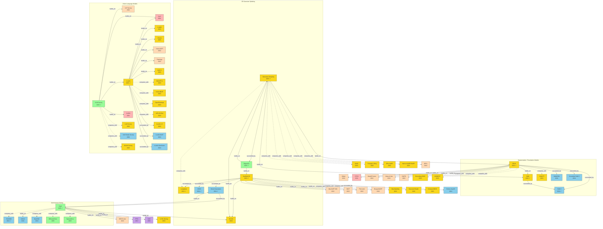

# Paper Reading Knowledge Graph

Auto-generated from the MCP knowledge graph. Last updated: 2026-07-03.

## Relationship Diagram

```mermaid
graph TD
    classDef y2015 fill:#c8a0e8,stroke:#555
    classDef y2017 fill:#c8a0e8,stroke:#555
    classDef y2021 fill:#ffb3b3,stroke:#555
    classDef y2022 fill:#ffd9b3,stroke:#555
    classDef y2023 fill:#f9d71c,stroke:#555
    classDef y2024 fill:#87ceeb,stroke:#555
    classDef y2025 fill:#98fb98,stroke:#555

    %% ── Peripheral reference nodes ───────────────────────────────
    XMem["XMem<br/>2022"]:::y2022
    STCN["STCN<br/>2021"]:::y2021
    M2F["Mask2Former<br/>2022"]:::y2022
    VKNet["Video-K-Net<br/>2022"]:::y2022
    OWTB["OWTB<br/>2022"]:::y2022
    GDino["Grounding DINO<br/>2023"]:::y2023
    UNINEXT["UNINEXT<br/>2023"]:::y2023
    SA3D["SA3D<br/>2023"]:::y2023
    PanopticL["Panoptic Lifting<br/>2023"]:::y2023
    SPInNeRF["SPIn-NeRF<br/>2023"]:::y2023
    IN2N["Instruct-NeRF2NeRF<br/>2023"]:::y2023
    DFFs["DFFs<br/>2022"]:::y2022
    MipNeRF360["Mip-NeRF 360<br/>2022"]:::y2022
    iNGP["iNGP<br/>2022"]:::y2022
    Plenoxels["Plenoxels<br/>2022"]:::y2022
    BungeeNeRF["BungeeNeRF<br/>2022"]:::y2022
    MipSplatting["Mip-Splatting<br/>2023"]:::y2023
    GShader["GaussianShader<br/>2023"]:::y2023
    Compact3DGS["Compact3DGS<br/>2023"]:::y2023
    OctreeGS["Octree-AnyGS<br/>2024"]:::y2024
    BEVFormer["BEVFormer<br/>2022"]:::y2022
    PPO["PPO<br/>2017"]:::y2017
    GAE["GAE<br/>2015"]:::y2015
    ILRLDrive["IL+RL Driving<br/>2023"]:::y2023

    %% ── Subgraph: Segmentation / Foundation Models ───────────────
    subgraph SEG["Segmentation / Foundation Models"]
        SAM["SAM<br/>2023 ✓"]:::y2023
        DEVA["DEVA<br/>2023 ✓"]:::y2023
        SAM2["SAM 2<br/>2024 ✓"]:::y2024
        SAMPT["SAM-PT<br/>2023"]:::y2023
        SAMURAI["SAMURAI<br/>2024"]:::y2024
        GSAM2["Grounded-SAM 2<br/>2024"]:::y2024
    end

    %% ── Subgraph: 3D Gaussian Splatting ──────────────────────────
    subgraph GS3D["3D Gaussian Splatting"]
        ThreeDGS["3D-GS<br/>2023"]:::y2023
        ScaffoldGS["Scaffold-GS<br/>2023 ✓"]:::y2023
        LangSplat["LangSplat<br/>2023 ✓"]:::y2023
        GG["Gaussian Grouping<br/>2023 ✓"]:::y2023
        TwoDGS["2DGS<br/>2024 ✓"]:::y2024
        StreetGS["Street Gaussians<br/>2024 ✓"]:::y2024
        ObjectGS["ObjectGS<br/>2025 ✓"]:::y2025
    end

    %% ── Subgraph: Autonomous Driving ─────────────────────────────
    subgraph AD["Autonomous Driving"]
        HUGSIM["HUGSIM<br/>2024 ✓"]:::y2024
        VADv2["VADv2<br/>2024"]:::y2024
        NeuRAD["NeuRAD<br/>2024"]:::y2024
        RAD["RAD<br/>2025 ✓"]:::y2025
        DiffDrive["DiffusionDrive<br/>2025"]:::y2025
        SparseDrive["SparseDrive<br/>2025"]:::y2025
    end

    %% ── Subgraph: Vision-Language Models ─────────────────────────
    subgraph VLM["Vision-Language Models"]
        CLIP["CLIP<br/>2021"]:::y2021
        ALIGN["ALIGN<br/>2021"]:::y2021
        Flamingo["Flamingo<br/>2022"]:::y2022
        InstructGPT["InstructGPT<br/>2022"]:::y2022
        VLPSurvey["VLP Survey<br/>2022"]:::y2022
        LLaMA["LLaMA<br/>2023"]:::y2023
        Vicuna["Vicuna<br/>2023"]:::y2023
        BLIP2["BLIP-2<br/>2023"]:::y2023
        LLaVA["LLaVA<br/>2023 ✓"]:::y2023
        LLaVA15["LLaVA-1.5<br/>2023"]:::y2023
        LLMSurvey["LLM Survey<br/>2023"]:::y2023
        MLLMSurvey["MLLM Survey<br/>2023"]:::y2023
        MiniGPT4["MiniGPT-4<br/>2023"]:::y2023
        InstructBLIP["InstructBLIP<br/>2023"]:::y2023
        OpenFlamingo["OpenFlamingo<br/>2023"]:::y2023
        mPLUGOwl["mPLUG-Owl<br/>2023"]:::y2023
        VLMTasksSurvey["VLM Tasks Survey<br/>2024"]:::y2024
        LLaVANext["LLaVA-NeXT<br/>2024"]:::y2024
        LLaVAOV["LLaVA-OneVision<br/>2024"]:::y2024
        VLMSurvey["VLM Survey<br/>2025 ✓"]:::y2025
    end

    %% ── Segmentation edges ───────────────────────────────────────
    DEVA -->|builds_on| XMem
    DEVA -->|builds_on| SAM
    DEVA -->|builds_on| M2F
    DEVA -->|builds_on| VKNet
    DEVA -->|builds_on| STCN
    DEVA -.->|competes_with| OWTB
    DEVA -.->|competes_with| SAMPT
    DEVA -.->|competes_with| GDino
    DEVA -.->|competes_with| UNINEXT
    DEVA -->|succeeded_by| SAM2
    DEVA -->|succeeded_by| SAMURAI
    DEVA -->|succeeded_by| GSAM2
    SAM -->|succeeded_by| SAM2

    %% ── 3DGS edges ───────────────────────────────────────────────
    ScaffoldGS -->|builds_on| ThreeDGS
    ScaffoldGS -->|builds_on| MipNeRF360
    ScaffoldGS -->|builds_on| iNGP
    ScaffoldGS -->|builds_on| Plenoxels
    ScaffoldGS -->|builds_on| BungeeNeRF
    ScaffoldGS -.->|competes_with| MipSplatting
    ScaffoldGS -.->|competes_with| GShader
    ScaffoldGS -.->|competes_with| Compact3DGS
    ScaffoldGS -->|succeeded_by| OctreeGS
    ScaffoldGS -->|succeeded_by| TwoDGS
    ScaffoldGS -->|succeeded_by| StreetGS
    ScaffoldGS -->|succeeded_by| LangSplat
    GG -->|builds_on| ThreeDGS
    GG -->|builds_on| SAM
    GG -->|builds_on| DEVA
    GG -.->|competes_with| SA3D
    GG -.->|competes_with| PanopticL
    GG -.->|competes_with| SPInNeRF
    GG -.->|competes_with| IN2N
    GG -.->|competes_with| DFFs
    GG -.->|competes_with| LangSplat
    GG -->|succeeded_by| ObjectGS
    ObjectGS -->|builds_on| ScaffoldGS
    ObjectGS -->|builds_on| GG

    %% ── Autonomous Driving edges ─────────────────────────────────
    StreetGS -->|succeeded_by| RAD
    RAD -->|builds_on| ThreeDGS
    RAD -->|builds_on| StreetGS
    RAD -->|builds_on| VADv2
    RAD -->|builds_on| BEVFormer
    RAD -->|builds_on| PPO
    RAD -->|builds_on| GAE
    RAD -->|builds_on| ILRLDrive
    RAD -.->|competes_with| HUGSIM
    RAD -.->|competes_with| DiffDrive
    RAD -.->|competes_with| SparseDrive
    RAD -.->|competes_with| NeuRAD

    %% ── VLM edges ────────────────────────────────────────────────
    LLaVA -->|builds_on| CLIP
    LLaVA -->|builds_on| LLaMA
    LLaVA -->|builds_on| Vicuna
    LLaVA -->|builds_on| InstructGPT
    LLaVA -->|builds_on| Flamingo
    LLaVA -->|builds_on| BLIP2
    LLaVA -.->|competes_with| MiniGPT4
    LLaVA -.->|competes_with| InstructBLIP
    LLaVA -.->|competes_with| OpenFlamingo
    LLaVA -.->|competes_with| mPLUGOwl
    LLaVA -->|succeeded_by| LLaVA15
    LLaVA -->|succeeded_by| LLaVANext
    LLaVA -->|succeeded_by| LLaVAOV
    VLMSurvey -->|builds_on| VLPSurvey
    VLMSurvey -->|builds_on| CLIP
    VLMSurvey -->|builds_on| LLaVA
    VLMSurvey -->|builds_on| ALIGN
    VLMSurvey -.->|competes_with| LLMSurvey
    VLMSurvey -.->|competes_with| VLMTasksSurvey
    VLMSurvey -.->|competes_with| MLLMSurvey
```

> **Legend:** ✓ = note exists in this repo · Solid arrow = builds\_on / succeeded\_by · Dashed arrow = competes\_with

---

## Paper Index

Papers with notes (✓) in this repository, organised by year.

| Paper | Year | Short Name | Keywords | Topics |
|-------|------|------------|----------|--------|
| [Segment Anything](2023/Segment_Anything/) | 2023 | SAM | image segmentation, foundation model, promptable segmentation | Segmentation / Foundation Models |
| [Tracking Anything with Decoupled Video Segmentation](2023/Tracking_Anything_with_Decoupled_Video_Segmentation/) | 2023 | DEVA | video segmentation, decoupled, temporal propagation, tracking, open-world | Segmentation / Foundation Models |
| [Scaffold-GS: Structured 3D Gaussians for View-Adaptive Rendering](2023/Scaffold-GS-_Structured_3D_Gaussians_for_View-Adaptive_Rendering/) | 2023 | Scaffold-GS | 3DGS, anchor-based, view-adaptive rendering, neural Gaussians | 3D Gaussian Splatting |
| [LangSplat: 3D Language Gaussian Splatting](2023/LangSplat-_3D_Language_Gaussian_Splatting/) | 2023 | LangSplat | 3DGS, language fields, CLIP, SAM | 3D Gaussian Splatting |
| [Gaussian Grouping: Segment and Edit Anything in 3D Scenes](2023/Gaussian_Grouping-_Segment_and_Edit_Anything_in_3D_Scenes/) | 2023 | Gaussian Grouping | 3DGS, instance segmentation, open-world, scene editing, SAM | 3D Gaussian Splatting, Segmentation |
| [Visual Instruction Tuning](2023/Visual_Instruction_Tuning/) | 2023 | LLaVA | visual instruction tuning, multimodal LLM, CLIP, Vicuna, GPT-4 data generation | Vision-Language Models |
| [SAM 2: Segment Anything in Images and Videos](2024/SAM_2-_Segment_Anything_in_Images_and_Videos/) | 2024 | SAM 2 | video segmentation, streaming memory, foundation model | Segmentation / Foundation Models |
| [2D Gaussian Splatting for Geometrically Accurate Radiance Fields](2024/2D_Gaussian_Splatting_for_geometrically_accurate_radiance_fields/) | 2024 | 2DGS | 3DGS, surface reconstruction, geometry-accurate | 3D Gaussian Splatting |
| [Street Gaussians: Modeling Dynamic Urban Scenes with Gaussian Splatting](2024/Street_Gaussians-_Modeling_Dynamic_Urban_Scenes_with_Gaussian_Splatting/) | 2024 | Street Gaussians | 3DGS, dynamic urban scenes, autonomous driving | 3D Gaussian Splatting, Autonomous Driving |
| [HUGSIM: A Real-Time, Photo-Realistic and Closed-Loop Simulator for Autonomous Driving](2024/HUGSIM-_A_Real-Time,_Photo-Realistic_and_Closed-Loop_Simulator_for_Autonomous_Driving/) | 2024 | HUGSIM | 3DGS, autonomous driving, closed-loop simulation | Autonomous Driving, 3D Gaussian Splatting |
| [ObjectGS: Object-aware Scene Reconstruction and Scene Understanding via Gaussian Splatting](2025/ObjectGS-_Object-aware_scene_reconstruction_and_scene_understanding_via_Gaussian_Splatting/) | 2025 | ObjectGS | 3DGS, object-aware reconstruction, panoptic segmentation, open-vocabulary, Scaffold-GS | 3D Gaussian Splatting |
| [RAD: Training an End-to-End Driving Policy via Large-Scale 3DGS-based Reinforcement Learning](2025/RAD-_Training_an_End-to-End_Driving_Policy_via_Large-Scale_3DGS-based_Reinforcement_Learning/) | 2025 | RAD | autonomous driving, reinforcement learning, 3DGS, end-to-end, closed-loop, imitation learning | Autonomous Driving, 3D Gaussian Splatting |
| [Vision Language Models: A Survey of 26K Papers (CVPR, ICLR, NeurIPS 2023–2025)](2025/Vision_Language_Models-_A_Survey_of_26K_Papers_(CVPR,_ICLR,_NeurIPS_2023-2025)/) | 2025 | VLM Survey | vision-language models, bibliometrics, research trends, survey, TF-IDF, multimodal LLMs | Vision-Language Models |

---

## Topic Clusters

### 3D Gaussian Splatting
Core and derived representations using 3D Gaussian primitives for rendering, reconstruction, and scene understanding.

- **Scaffold-GS** (2023 ✓) — Anchor-based structured Gaussians for view-adaptive rendering; predecessor to ObjectGS and LangSplat
- **LangSplat** (2023 ✓) — CLIP language features embedded in Gaussian primitives for open-vocabulary 3D querying
- **Gaussian Grouping** (2023 ✓) — Identity-encoded Gaussians (DEVA-supervised) for instance segmentation and scene editing
- **2DGS** (2024 ✓) — Planar 2D Gaussian disks for geometrically accurate surface reconstruction
- **Street Gaussians** (2024 ✓) — Compositional 4D-SH Gaussians for dynamic urban scene reconstruction; succeeded by RAD
- **ObjectGS** (2025 ✓) — Object-aware anchor-based Gaussians with discrete one-hot semantic encoding; builds on Scaffold-GS + Gaussian Grouping
- **RAD** (2025 ✓) — Uses 3DGS digital twins as photorealistic RL training environments for driving policy
- **HUGSIM** (2024 ✓) — 3DGS-based real-time closed-loop AD simulator (competes with RAD)

### Segmentation / Foundation Models
Promptable segmentation foundations and video-consistent object tracking systems.

- **SAM** (2023 ✓) — Foundation model for promptable image segmentation; used by LangSplat, Gaussian Grouping, ObjectGS
- **DEVA** (2023 ✓) — Decoupled video segmentation propagating any-image-model predictions temporally; succeeded by SAM 2
- **SAM 2** (2024 ✓) — Streaming-memory extension of SAM for real-time video object segmentation
- **SAM-PT** (2023, ref) — SAM with point tracking for zero-shot video segmentation
- **SAMURAI** (2024, ref) — Zero-shot visual object tracking with motion-aware memory
- **Grounded-SAM 2** (2024, ref) — Text-driven segmentation composing Grounding DINO with SAM 2

### Autonomous Driving
Neural rendering and learned planning for closed-loop autonomous driving evaluation and training.

- **Street Gaussians** (2024 ✓) — First 3DGS-based dynamic urban scene representation for AD simulation
- **HUGSIM** (2024 ✓) — Closed-loop 3DGS AD simulator with standardised benchmark protocol
- **RAD** (2025 ✓) — First 3DGS-based closed-loop RL framework for end-to-end driving; 3× lower collision rate vs. IL baselines (NeurIPS 2025)
- **VADv2** (2024, ref) — End-to-end vectorised AD via probabilistic planning; main IL backbone for RAD
- **NeuRAD** (2024, ref) — Neural rendering for AD scene reconstruction
- **DiffusionDrive** (2025, ref) — Truncated diffusion model for end-to-end AD planning
- **SparseDrive** (2025, ref) — Sparse scene representation for end-to-end AD

### Vision-Language Models
Foundational models, surveys, and the instruction-tuning ecosystem for vision-language understanding.

- **LLaVA** (2023 ✓) — First visual instruction tuning paper: GPT-4-generated 158K multimodal data + CLIP encoder + Vicuna LLM + two-stage training; SoTA 92.53% on ScienceQA
- **VLM Survey (Lin 2025)** (2025 ✓) — Bibliometric analysis of 26,104 CVPR/ICLR/NeurIPS papers; VLM share rose 16%→40%; LLaVA identified as fastest-growing model family
- **CLIP** (2021, ref) — Contrastive vision-language pretraining; visual encoder used by LLaVA and LangSplat
- **ALIGN** (2021, ref) — Dual-encoder VLM pretraining on noisy web data; most-cited model family in VLM Survey
- **Flamingo** (2022, ref) — Pioneer multimodal LLM with gated cross-attention; predecessor to LLaVA
- **InstructGPT** (2022, ref) — RLHF-based instruction tuning for LLMs; paradigm extended by LLaVA to vision
- **LLaMA** (2023, ref) — Open-source LLM foundation underlying Vicuna and LLaVA
- **Vicuna** (2023, ref) — Instruction-tuned LLaMA; LLM backbone of LLaVA
- **BLIP-2** (2023, ref) — Q-Former-based multimodal LLM; main contemporary baseline for LLaVA
- **LLaVA-1.5** (2023, ref) — Direct successor: MLP projection + CLIP-336px → dramatically stronger performance
- **LLaVA-NeXT** (2024, ref) — Higher resolution via dynamic tiling; extends to video
- **LLaVA-OneVision** (2024, ref) — Multi-image and video unification of LLaVA
- **MiniGPT-4** (2023, ref) — Near-simultaneous work with same CLIP+LLM+projection recipe
- **InstructBLIP** (2023, ref) — Instruction tuning applied to BLIP-2 Q-Former
- **OpenFlamingo** (2023, ref) — Open-source Flamingo; direct LLaVA baseline in paper
- **mPLUG-Owl** (2023, ref) — Concurrent modular multimodal instruction-tuning model
