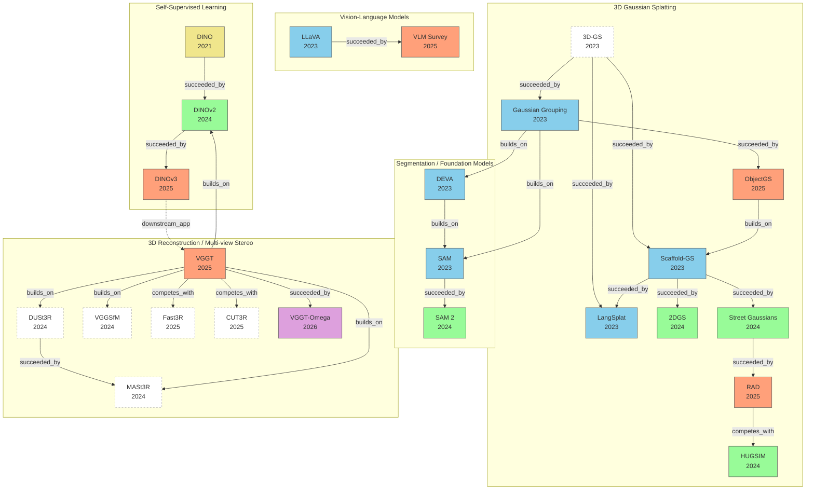

# Knowledge Graph

Auto-generated from paper notes. Last updated: 2026-07-06.

---

## Graph Diagram

```mermaid
graph TD
    classDef y2021 fill:#f0e68c,stroke:#555
    classDef y2022 fill:#f9d71c,stroke:#555
    classDef y2023 fill:#87ceeb,stroke:#555
    classDef y2024 fill:#98fb98,stroke:#555
    classDef y2025 fill:#ffa07a,stroke:#555
    classDef y2026 fill:#dda0dd,stroke:#555
    classDef noNote fill:#fff,stroke:#aaa,stroke-dasharray:4 4

    subgraph Seg["Segmentation / Foundation Models"]
        SAM["SAM\n2023"]:::y2023
        DEVA["DEVA\n2023"]:::y2023
        SAM2["SAM 2\n2024"]:::y2024
    end

    subgraph GS["3D Gaussian Splatting"]
        GS3D["3D-GS\n2023"]:::noNote
        SGS["Scaffold-GS\n2023"]:::y2023
        LS["LangSplat\n2023"]:::y2023
        GG["Gaussian Grouping\n2023"]:::y2023
        GS2D["2DGS\n2024"]:::y2024
        StrGS["Street Gaussians\n2024"]:::y2024
        HUG["HUGSIM\n2024"]:::y2024
        ObjGS["ObjectGS\n2025"]:::y2025
        RAD["RAD\n2025"]:::y2025
    end

    subgraph VLM["Vision-Language Models"]
        LLaVA["LLaVA\n2023"]:::y2023
        VLMSurv["VLM Survey\n2025"]:::y2025
    end

    subgraph SSL["Self-Supervised Learning"]
        DINO["DINO\n2021"]:::y2021
        DINOv2["DINOv2\n2024"]:::y2024
        DINOv3["DINOv3\n2025"]:::y2025
    end

    subgraph Recon["3D Reconstruction / Multi-view Stereo"]
        DUSt3R["DUSt3R\n2024"]:::noNote
        MASt3R["MASt3R\n2024"]:::noNote
        VGGSfM["VGGSfM\n2024"]:::noNote
        Fast3R["Fast3R\n2025"]:::noNote
        CUT3R["CUT3R\n2025"]:::noNote
        VGGT["VGGT\n2025"]:::y2025
        VGGTOmega["VGGT-Omega\n2026"]:::y2026
    end

    SAM -->|succeeded_by| SAM2
    DEVA -->|builds_on| SAM
    GG -->|builds_on| DEVA
    GG -->|builds_on| SAM
    GG -->|succeeded_by| ObjGS

    GS3D -->|succeeded_by| SGS
    GS3D -->|succeeded_by| LS
    GS3D -->|succeeded_by| GG
    SGS -->|succeeded_by| GS2D
    SGS -->|succeeded_by| StrGS
    SGS -->|succeeded_by| LS
    ObjGS -->|builds_on| SGS
    StrGS -->|succeeded_by| RAD
    RAD -->|competes_with| HUG

    DINO -->|succeeded_by| DINOv2
    DINOv2 -->|succeeded_by| DINOv3
    DINOv3 -.->|downstream_app| VGGT

    DUSt3R -->|succeeded_by| MASt3R
    VGGT -->|builds_on| DUSt3R
    VGGT -->|builds_on| MASt3R
    VGGT -->|builds_on| VGGSfM
    VGGT -->|builds_on| DINOv2
    VGGT -->|competes_with| Fast3R
    VGGT -->|competes_with| CUT3R
    VGGT -->|succeeded_by| VGGTOmega

    LLaVA -->|succeeded_by| VLMSurv
```

> Solid arrows = `builds_on` / `succeeded_by` / `competes_with`; dashed = downstream application.  
> White/dashed nodes = referenced but no dedicated note in this repo yet.

---

## Paper Index

| Paper | Short Name | Year | Venue | Keywords | Has Note |
|---|---|---|---|---|---|
| [Tracking Anything with Decoupled Video Segmentation](2023/Tracking_Anything_with_Decoupled_Video_Segmentation/) | DEVA | 2023 | ICCV 2023 | video segmentation, tracking, open-world, SAM | ✅ |
| [Segment Anything](2023/Segment_Anything/) | SAM | 2023 | ICCV 2023 | image segmentation, foundation model, promptable segmentation | ✅ |
| [LangSplat: 3D Language Gaussian Splatting](2023/LangSplat-_3D_Language_Gaussian_Splatting/) | LangSplat | 2023 | CVPR 2024 | 3DGS, language fields, CLIP, SAM | ✅ |
| [Scaffold-GS: Structured 3D Gaussians for View-Adaptive Rendering](2023/Scaffold-GS-_Structured_3D_Gaussians_for_View-Adaptive_Rendering/) | Scaffold-GS | 2023 | CVPR 2024 | 3DGS, anchor-based, view-adaptive rendering | ✅ |
| [Gaussian Grouping: Segment and Edit Anything in 3D Scenes](2023/Gaussian_Grouping-_Segment_and_Edit_Anything_in_3D_Scenes/) | Gaussian Grouping | 2023 | ECCV 2024 | 3DGS, instance segmentation, SAM, scene editing | ✅ |
| [Visual Instruction Tuning](2023/Visual_Instruction_Tuning/) | LLaVA | 2023 | NeurIPS 2023 | visual instruction tuning, multimodal LLM, CLIP, LLaMA | ✅ |
| [SAM 2: Segment Anything in Images and Videos](2024/SAM_2-_Segment_Anything_in_Images_and_Videos/) | SAM 2 | 2024 | arXiv 2024 | image segmentation, video segmentation, streaming memory | ✅ |
| [2D Gaussian Splatting for Geometrically Accurate Radiance Fields](2024/2D_Gaussian_Splatting_for_geometrically_accurate_radiance_fields/) | 2DGS | 2024 | SIGGRAPH 2024 | 3DGS, geometry, surface reconstruction | ✅ |
| [Street Gaussians: Modeling Dynamic Urban Scenes with Gaussian Splatting](2024/Street_Gaussians-_Modeling_Dynamic_Urban_Scenes_with_Gaussian_Splatting/) | Street Gaussians | 2024 | ECCV 2024 | 3DGS, autonomous driving, dynamic scenes | ✅ |
| [HUGSIM: A Real-Time, Photo-Realistic and Closed-Loop Simulator for Autonomous Driving](2024/HUGSIM-_A_Real-Time,_Photo-Realistic_and_Closed-Loop_Simulator_for_Autonomous_Driving/) | HUGSIM | 2024 | arXiv 2024 | 3DGS, autonomous driving, closed-loop simulator | ✅ |
| [GaussianDWM: 3D Gaussian Driving World Model for Unified Scene Understanding and Multi-Modal Generation](2025/GaussianDWM-_3D_Gaussian_Driving_World_Model_for_Unified_Scene_Understanding_and_Multi-Modal_Generation/) | GaussianDWM | 2025 | — | 3DGS, autonomous driving, world model | ✅ |
| [LangSplatV2: High-dimensional 3D Language Gaussian Splatting with 450+ FPS](2025/LangSplatV2-_High-dimensional_3D_language_Gaussian_Splatting_with_450+_FPS/) | LangSplatV2 | 2025 | — | 3DGS, language fields, real-time | ✅ |
| [4D LangSplat: 4D Language Gaussian Splatting via Multimodal Large Language Models](2025/4D_LangSplat-_4D_Language_Gaussian_Splatting_via_Multimodal_Large_Language_Models/) | 4D LangSplat | 2025 | — | 3DGS, language fields, dynamic, 4D | ✅ |
| [ObjectGS: Object-aware Scene Reconstruction and Scene Understanding via Gaussian Splatting](2025/ObjectGS-_Object-aware_scene_reconstruction_and_scene_understanding_via_Gaussian_Splatting/) | ObjectGS | 2025 | ICCV 2025 | 3DGS, object-aware, panoptic segmentation, anchor-based | ✅ |
| [RAD: Training an End-to-End Driving Policy via Large-Scale 3DGS-based Reinforcement Learning](2025/RAD-_Training_an_End-to-End_Driving_Policy_via_Large-Scale_3DGS-based_Reinforcement_Learning/) | RAD | 2025 | NeurIPS 2025 | autonomous driving, RL, 3DGS, end-to-end | ✅ |
| [Vision Language Models: A Survey of 26K Papers (CVPR, ICLR, NeurIPS 2023–2025)](2025/Vision_Language_Models-_A_Survey_of_26K_Papers_(CVPR,_ICLR,_NeurIPS_2023-2025)/) | VLM Survey | 2025 | arXiv 2025 | VLMs, survey, bibliometrics, multimodal LLMs | ✅ |
| [DINOv3](2025/DINOv3/) | DINOv3 | 2025 | arXiv Aug 2025 | SSL, vision foundation model, Gram anchoring, dense features, ViT-7B | ✅ |
| [VGGT: Visual Geometry Grounded Transformer](2025/VGGT-_Visual_Geometry_Grounded_Transformer/) | VGGT | 2025 | CVPR 2025 🏆 | 3D reconstruction, camera pose, depth, point tracking, feed-forward transformer | ✅ |

---

## Topic Clusters

### Segmentation / Foundation Models
**Papers with notes:** DEVA · SAM · SAM 2 · Gaussian Grouping  
**Key chain:** SAM → SAM 2 · SAM → DEVA → Gaussian Grouping → ObjectGS

| Paper | Role |
|---|---|
| SAM | Foundation promptable segmenter; backbone for all downstream |
| DEVA | Decoupled video segmentation using SAM for detection |
| SAM 2 | Unified image+video segmenter; streaming memory successor to SAM |
| Gaussian Grouping | SAM-guided identity encoding for 3D scene segmentation and editing |

---

### 3D Gaussian Splatting
**Papers with notes:** Scaffold-GS · LangSplat · Gaussian Grouping · 2DGS · Street Gaussians · HUGSIM · ObjectGS · RAD  
**Key chain:** 3D-GS → Scaffold-GS → ObjectGS · 3D-GS → LangSplat → LangSplatV2 · Street Gaussians → RAD

| Paper | Role |
|---|---|
| Scaffold-GS | Anchor-based 3DGS for view-adaptive rendering; backbone for ObjectGS |
| LangSplat | First 3D language field via per-Gaussian CLIP features |
| Gaussian Grouping | Open-world 3D segmentation and editing in Gaussian scenes |
| 2DGS | Geometrically accurate surface reconstruction via 2D disk primitives |
| Street Gaussians | Dynamic urban scene rendering for autonomous driving |
| HUGSIM | Closed-loop photorealistic driving simulator based on 3DGS |
| ObjectGS | Object-aware reconstruction extending Scaffold-GS with panoptic understanding |
| RAD | RL-based end-to-end driving policy trained in 3DGS simulation |

---

### Autonomous Driving
**Papers with notes:** Street Gaussians · HUGSIM · RAD

| Paper | Role |
|---|---|
| Street Gaussians | Differentiable urban scene renderer; predecessor to RAD's environment |
| HUGSIM | Closed-loop photorealistic simulator; competes with RAD's training environment |
| RAD | Large-scale RL training in 3DGS digital twins for end-to-end driving |

---

### Vision-Language Models
**Papers with notes:** LLaVA · VLM Survey

| Paper | Role |
|---|---|
| LLaVA | Pioneering visual instruction tuning with GPT-4-generated conversation data |
| VLM Survey | Bibliometric analysis of 26K VLM papers across CVPR/ICLR/NeurIPS 2023–2025 |

---

### Self-Supervised Learning / Vision Foundation Models
**Papers with notes:** DINOv3  
**Key chain:** DINO → DINOv2 → DINOv3 ⟶ (downstream) VGGT

| Paper | Role |
|---|---|
| DINOv3 | 7B-parameter SSL ViT with Gram anchoring; SOTA dense features for segmentation, depth, detection |
| DINOv2 (referenced) | Predecessor; frozen tokeniser used by VGGT; succeeded by DINOv3 |
| DINO (referenced) | Original self-distillation objective; foundational SSL approach |

---

### 3D Reconstruction / Multi-view Stereo
**Papers with notes:** VGGT  
**Key chain:** DUSt3R → MASt3R · DUSt3R → VGGT → VGGT-Omega

| Paper | Role |
|---|---|
| VGGT | CVPR 2025 Best Paper; feed-forward N-view 3D reconstruction (cameras, depth, pointmaps, tracks) in one pass |
| DUSt3R (referenced) | Two-view pointmap pioneer; direct predecessor paradigm |
| MASt3R (referenced) | Extends DUSt3R with matching-aware features |
| VGGSfM (referenced) | Differentiable SfM; contributes camera parametrisation to VGGT |
| CoTracker (referenced) | Point tracking architecture whose backbone VGGT replaces downstream |
| Fast3R (referenced) | Concurrent N-view feed-forward competitor (tensor parallelism) |
| CUT3R (referenced) | Concurrent; persistent recurrent scene state |
| VGGT-Omega (referenced) | 2026 successor addressing dynamic scenes and memory efficiency |

---

## Referenced Papers (no note yet)

| Short Name | Full Title | Year | Referenced By |
|---|---|---|---|
| 3D-GS | 3D Gaussian Splatting for Real-Time Radiance Field Rendering | 2023 | Scaffold-GS, GG, RAD |
| XMem | Long-Term Video Object Segmentation with an Atkinson-Shiffrin Memory Model | 2022 | DEVA |
| DINO | Emerging Properties in Self-Supervised Vision Transformers | 2021 | DINOv3 |
| DINOv2 | DINOv2: Learning Robust Visual Features without Supervision | 2024 | DINOv3, VGGT |
| DUSt3R | DUSt3R: Geometric 3D Vision Made Easy | 2024 | VGGT |
| MASt3R | MASt3R: Grounding Image Matching in 3D | 2024 | VGGT |
| VGGSfM | VGGSfM: Visual Geometry Grounded Deep Structure from Motion | 2024 | VGGT |
| CoTracker | CoTracker: It Is Better to Track Together | 2024 | VGGT |
| DPT | DPT: Vision Transformers for Dense Prediction | 2021 | VGGT |
| Fast3R | Fast3R: Towards 3D Reconstruction of 1000+ Images in One Forward Pass | 2025 | VGGT |
| CUT3R | CUT3R: Continuous 3D Perception with Persistent State | 2025 | VGGT |
| FLARE | FLARE: Feed-Forward Geometry, Appearance and Camera Estimation | 2025 | VGGT |
| MV-DUSt3R+ | MV-DUSt3R+: Single-Stage Scene Reconstruction from Sparse Views | 2024 | VGGT |
| VGGT-Omega | VGGT-Omega | 2026 | VGGT |
| SceneVGGT | SceneVGGT: VGGT-based Online 3D Semantic SLAM | 2026 | VGGT |
| 3D-Mix for VLA | 3D-Mix for VLA: Integrating VGGT-based 3D Information into VLA Models | 2026 | VGGT |
| Quantized VGGT | Quantized Visual Geometry Grounded Transformer | 2025 | VGGT |
| Web-DINO | Web-DINO: Scaling Language-Free Visual Representation Learning | 2025 | DINOv3 |
| AM-RADIO | AM-RADIO v2.5: Improved Baselines for Agglomerative Vision Foundation Models | 2025 | DINOv3 |
| SigLIP 2 | SigLIP 2: Multilingual Vision-Language Encoders with Improved Dense Features | 2025 | DINOv3 |
| Perception Encoder | Perception Encoder: The Best Visual Embeddings Are Not at the Output | 2025 | DINOv3 |
| Register Tokens | Vision Transformers Need Registers | 2024 | DINOv3 |
| LLaMA | LLaMA: Open and Efficient Foundation Language Models | 2023 | LLaVA |
| BLIP-2 | BLIP-2: Bootstrapping Language-Image Pre-Training with Frozen Image Encoders | 2023 | LLaVA |
| LLaVA-1.5 | Improved Baselines with Visual Instruction Tuning | 2023 | LLaVA |
| LLaVA-NeXT | LLaVA-NeXT: Improved Reasoning, OCR, and World Knowledge | 2024 | LLaVA |
