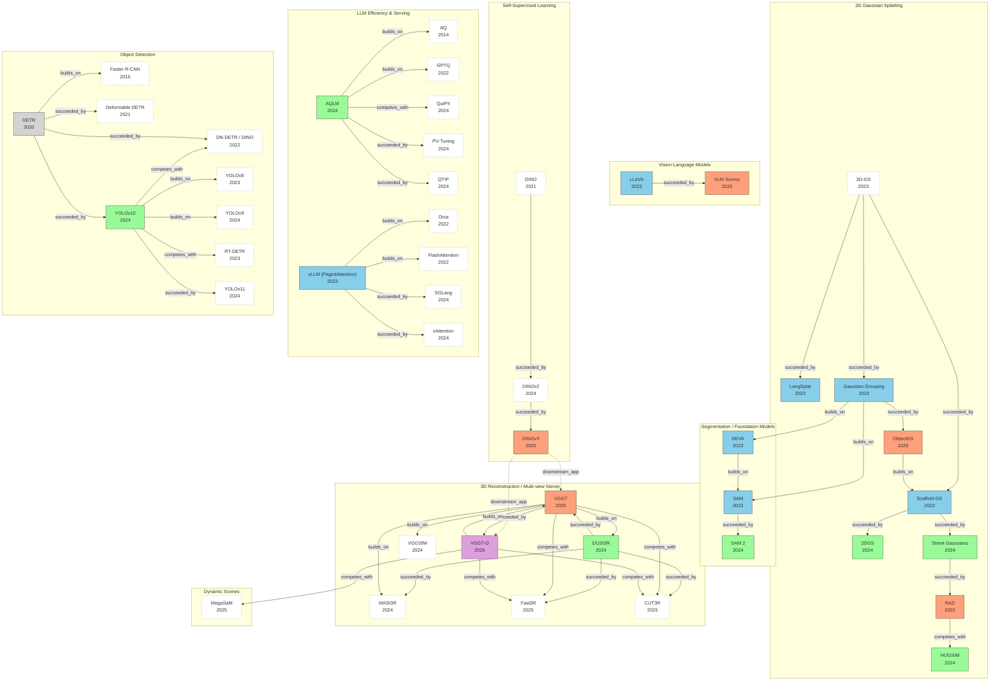

# Knowledge Graph

Auto-generated from paper notes. Last updated: 2026-07-20.

---

## Graph Diagram

```mermaid
graph TD
    classDef y2020 fill:#d3d3d3,stroke:#555
    classDef y2021 fill:#f0e68c,stroke:#555
    classDef y2022 fill:#f9d71c,stroke:#555
    classDef y2023 fill:#87ceeb,stroke:#555
    classDef y2024 fill:#98fb98,stroke:#555
    classDef y2025 fill:#ffa07a,stroke:#555
    classDef y2026 fill:#dda0dd,stroke:#555
    classDef noNote fill:#fff,stroke:#aaa,stroke-dasharray:4 4

    subgraph Seg["Segmentation / Foundation Models"]
        SAM["SAM\n2023"]:::y2023
        DEVA["DEVA\n2023"]:::y2023
        SAM2["SAM 2\n2024"]:::y2024
    end

    subgraph GS["3D Gaussian Splatting"]
        GS3D["3D-GS\n2023"]:::noNote
        SGS["Scaffold-GS\n2023"]:::y2023
        LS["LangSplat\n2023"]:::y2023
        GG["Gaussian Grouping\n2023"]:::y2023
        GS2D["2DGS\n2024"]:::y2024
        StrGS["Street Gaussians\n2024"]:::y2024
        HUG["HUGSIM\n2024"]:::y2024
        ObjGS["ObjectGS\n2025"]:::y2025
        RAD["RAD\n2025"]:::y2025
    end

    subgraph VLM["Vision-Language Models"]
        LLaVA["LLaVA\n2023"]:::y2023
        VLMSurv["VLM Survey\n2025"]:::y2025
    end

    subgraph SSL["Self-Supervised Learning"]
        DINO["DINO\n2021"]:::noNote
        DINOv2["DINOv2\n2024"]:::noNote
        DINOv3["DINOv3\n2025"]:::y2025
    end

    subgraph Recon["3D Reconstruction / Multi-view Stereo"]
        DUSt3R["DUSt3R\n2024"]:::y2024
        MASt3R["MASt3R\n2024"]:::noNote
        VGGSfM["VGGSfM\n2024"]:::noNote
        Fast3R["Fast3R\n2025"]:::noNote
        CUT3R["CUT3R\n2025"]:::noNote
        VGGT["VGGT\n2025"]:::y2025
        VGGTOmega["VGGT-Ω\n2026"]:::y2026
    end

    subgraph Dyn["Dynamic Scenes"]
        MegaSaM["MegaSaM\n2025"]:::noNote
    end

    subgraph LLMSys["LLM Efficiency & Serving"]
        AQ2014["AQ\n2014"]:::noNote
        GPTQ["GPTQ\n2022"]:::noNote
        Orca["Orca\n2022"]:::noNote
        FlashAttn["FlashAttention\n2022"]:::noNote
        vLLM["vLLM (PagedAttention)\n2023"]:::y2023
        QuIPs["QuIP#\n2024"]:::noNote
        AQLM["AQLM\n2024"]:::y2024
        PVTuning["PV-Tuning\n2024"]:::noNote
        QTIP["QTIP\n2024"]:::noNote
        SGLang["SGLang\n2024"]:::noNote
        vAttn["vAttention\n2024"]:::noNote
    end

    subgraph Det["Object Detection"]
        FasterRCNN["Faster R-CNN\n2015"]:::noNote
        DETR["DETR\n2020"]:::y2020
        DeformDETR["Deformable DETR\n2021"]:::noNote
        DINODETR["DN-DETR / DINO\n2022"]:::noNote
        RTDETR["RT-DETR\n2023"]:::noNote
        YOLOv8["YOLOv8\n2023"]:::noNote
        YOLOv9["YOLOv9\n2024"]:::noNote
        YOLOv10["YOLOv10\n2024"]:::y2024
        YOLOv11["YOLOv11\n2024"]:::noNote
    end

    SAM -->|succeeded_by| SAM2
    DEVA -->|builds_on| SAM
    GG -->|builds_on| DEVA
    GG -->|builds_on| SAM
    GG -->|succeeded_by| ObjGS

    GS3D -->|succeeded_by| SGS
    GS3D -->|succeeded_by| LS
    GS3D -->|succeeded_by| GG
    SGS -->|succeeded_by| GS2D
    SGS -->|succeeded_by| StrGS
    ObjGS -->|builds_on| SGS
    StrGS -->|succeeded_by| RAD
    RAD -->|competes_with| HUG

    DINO -->|succeeded_by| DINOv2
    DINOv2 -->|succeeded_by| DINOv3
    DINOv3 -.->|downstream_app| VGGT
    DINOv3 -.->|downstream_app| VGGTOmega

    DUSt3R -->|succeeded_by| MASt3R
    DUSt3R -->|succeeded_by| VGGT
    DUSt3R -->|succeeded_by| Fast3R
    DUSt3R -->|succeeded_by| CUT3R
    VGGT -->|builds_on| DUSt3R
    VGGT -->|builds_on| MASt3R
    VGGT -->|builds_on| VGGSfM
    VGGT -->|competes_with| Fast3R
    VGGT -->|competes_with| CUT3R
    VGGT -->|succeeded_by| VGGTOmega
    VGGTOmega -->|builds_on| VGGT
    VGGTOmega -->|competes_with| Fast3R
    VGGTOmega -->|competes_with| CUT3R
    VGGTOmega -->|competes_with| MegaSaM

    LLaVA -->|succeeded_by| VLMSurv

    AQLM -->|builds_on| AQ2014
    AQLM -->|builds_on| GPTQ
    AQLM -->|competes_with| QuIPs
    AQLM -->|succeeded_by| PVTuning
    AQLM -->|succeeded_by| QTIP
    vLLM -->|builds_on| Orca
    vLLM -->|builds_on| FlashAttn
    vLLM -->|succeeded_by| SGLang
    vLLM -->|succeeded_by| vAttn

    DETR -->|builds_on| FasterRCNN
    DETR -->|succeeded_by| DeformDETR
    DETR -->|succeeded_by| DINODETR
    DETR -->|succeeded_by| YOLOv10
    YOLOv10 -->|builds_on| YOLOv8
    YOLOv10 -->|builds_on| YOLOv9
    YOLOv10 -->|competes_with| RTDETR
    YOLOv10 -->|competes_with| DINODETR
    YOLOv10 -->|succeeded_by| YOLOv11
```

> Solid arrows = `builds_on` / `succeeded_by` / `competes_with`; dashed = downstream application.  
> White/dashed nodes = referenced but no dedicated note in this repo yet.

---

## Paper Index

| Paper | Short Name | Year | Venue | Keywords | Has Note |
|---|---|---|---|---|---|
| [End-to-End Object Detection with Transformers](2020/End-to-End_Object_Detection_with_Transformers/) | DETR | 2020 | ECCV 2020 | object detection, set prediction, transformers, bipartite matching, Hungarian loss, panoptic segmentation | ✅ |
| [Dynamic 3D Gaussians: Tracking by Persistent Dynamic View Synthesis](2023/Dynamic_3D_Gaussians-_Tracking_by_Persistent_Dynamic_View_Synthesis/) | Dynamic 3DGS | 2023 | 3DV 2024 | 3DGS, dynamic scenes, dense tracking, novel-view synthesis | ✅ |
| [Real-Time Radiance Fields for Single-Image Portrait View Synthesis](2023/Real-Time_Radiance_Fields_for_Single-Image_Portrait_View_Synthesis/) | LP3D | 2023 | — | NeRF, portrait, single image | ✅ |
| [Scaffold-GS: Structured 3D Gaussians for View-Adaptive Rendering](2023/Scaffold-GS-_Structured_3D_Gaussians_for_View-Adaptive_Rendering/) | Scaffold-GS | 2023 | CVPR 2024 | 3DGS, anchor-based, view-adaptive rendering | ✅ |
| [Segment Anything](2023/Segment_Anything/) | SAM | 2023 | ICCV 2023 | image segmentation, foundation model, promptable segmentation | ✅ |
| [LangSplat: 3D Language Gaussian Splatting](2023/LangSplat-_3D_Language_Gaussian_Splatting/) | LangSplat | 2023 | CVPR 2024 | 3DGS, language fields, CLIP, SAM | ✅ |
| [Tracking Anything with Decoupled Video Segmentation](2023/Tracking_Anything_with_Decoupled_Video_Segmentation/) | DEVA | 2023 | ICCV 2023 | video segmentation, tracking, open-world, SAM | ✅ |
| [Gaussian Grouping: Segment and Edit Anything in 3D Scenes](2023/Gaussian_Grouping-_Segment_and_Edit_Anything_in_3D_Scenes/) | Gaussian Grouping | 2023 | ECCV 2024 | 3DGS, instance segmentation, SAM, scene editing | ✅ |
| [Visual Instruction Tuning](2023/Visual_Instruction_Tuning/) | LLaVA | 2023 | NeurIPS 2023 | visual instruction tuning, multimodal LLM, CLIP, LLaMA | ✅ |
| [Efficient Memory Management for Large Language Model Serving with PagedAttention](2023/Efficient_Memory_Management_for_Large_Language_Model_Serving_with_PagedAttention/) | vLLM (PagedAttention) | 2023 | SOSP 2023 | LLM serving, KV cache, memory management, virtual memory, paging, continuous batching | ✅ |
| [2D Gaussian Splatting for Geometrically Accurate Radiance Fields](2024/2D_Gaussian_Splatting_for_geometrically_accurate_radiance_fields/) | 2DGS | 2024 | SIGGRAPH 2024 | 3DGS, geometry, surface reconstruction | ✅ |
| [4D Gaussian Splatting for Real-Time Dynamic Scene Rendering](2024/4D_Gaussian_Splatting_for_Real-Time_Dynamic_Scene_Rendering/) | 4DGS | 2024 | CVPR 2024 | 3DGS, dynamic scenes, real-time rendering | ✅ |
| [DUSt3R: Geometric 3D Vision Made Easy](2024/DUSt3R-_Geometric_3D_Vision_Made_Easy/) | DUSt3R | 2024 | CVPR 2024 | 3D reconstruction, pointmap, multi-view stereo, camera pose, ViT, CroCo | ✅ |
| [Gaussian Splatting SLAM](2024/Gaussian_Splatting_SLAM/) | MonoGS | 2024 | CVPR 2024 🏆 | 3DGS, SLAM, monocular, dense reconstruction | ✅ |
| [HUGSIM: A Real-Time, Photo-Realistic and Closed-Loop Simulator for Autonomous Driving](2024/HUGSIM-_A_Real-Time,_Photo-Realistic_and_Closed-Loop_Simulator_for_Autonomous_Driving/) | HUGSIM | 2024 | arXiv 2024 | 3DGS, autonomous driving, closed-loop simulator | ✅ |
| [SAM 2: Segment Anything in Images and Videos](2024/SAM_2-_Segment_Anything_in_Images_and_Videos/) | SAM 2 | 2024 | arXiv 2024 | image segmentation, video segmentation, streaming memory | ✅ |
| [Street Gaussians: Modeling Dynamic Urban Scenes with Gaussian Splatting](2024/Street_Gaussians-_Modeling_Dynamic_Urban_Scenes_with_Gaussian_Splatting/) | Street Gaussians | 2024 | ECCV 2024 | 3DGS, autonomous driving, dynamic scenes | ✅ |
| [YOLOv10: Real-Time End-to-End Object Detection](2024/YOLOv10-_Real-Time_End-to-End_Object_Detection/) | YOLOv10 | 2024 | NeurIPS 2024 | real-time object detection, NMS-free, end-to-end detection, dual label assignment, YOLO, COCO | ✅ |
| [Extreme Compression of Large Language Models via Additive Quantization](2024/Extreme_Compression_of_Large_Language_Models_via_Additive_Quantization/) | AQLM | 2024 | ICML 2024 | LLM compression, post-training quantization, additive quantization, multi-codebook quantization, 2-bit | ✅ |
| [4D LangSplat: 4D Language Gaussian Splatting via Multimodal Large Language Models](2025/4D_LangSplat-_4D_Language_Gaussian_Splatting_via_Multimodal_Large_Language_Models/) | 4D LangSplat | 2025 | — | 3DGS, language fields, dynamic, 4D, MLLM | ✅ |
| [DINOv3](2025/DINOv3/) | DINOv3 | 2025 | arXiv Aug 2025 | SSL, vision foundation model, Gram anchoring, dense features, ViT-7B | ✅ |
| [GaussianDWM: 3D Gaussian Driving World Model for Unified Scene Understanding and Multi-Modal Generation](2025/GaussianDWM-_3D_Gaussian_Driving_World_Model_for_Unified_Scene_Understanding_and_Multi-Modal_Generation/) | GaussianDWM | 2025 | — | 3DGS, autonomous driving, world model | ✅ |
| [LangSplatV2: High-dimensional 3D Language Gaussian Splatting with 450+ FPS](2025/LangSplatV2-_High-dimensional_3D_language_Gaussian_Splatting_with_450+_FPS/) | LangSplatV2 | 2025 | NeurIPS 2025 | 3DGS, language fields, real-time, sparse coding | ✅ |
| [ObjectGS: Object-aware Scene Reconstruction and Scene Understanding via Gaussian Splatting](2025/ObjectGS-_Object-aware_scene_reconstruction_and_scene_understanding_via_Gaussian_Splatting/) | ObjectGS | 2025 | ICCV 2025 | 3DGS, object-aware, panoptic segmentation, anchor-based | ✅ |
| [RAD: Training an End-to-End Driving Policy via Large-Scale 3DGS-based Reinforcement Learning](2025/RAD-_Training_an_End-to-End_Driving_Policy_via_Large-Scale_3DGS-based_Reinforcement_Learning/) | RAD | 2025 | NeurIPS 2025 | autonomous driving, RL, 3DGS, end-to-end | ✅ |
| [VGGT: Visual Geometry Grounded Transformer](2025/VGGT-_Visual_Geometry_Grounded_Transformer/) | VGGT | 2025 | CVPR 2025 🏆 | 3D reconstruction, camera pose, depth, point tracking, feed-forward transformer | ✅ |
| [Vision Language Models: A Survey of 26K Papers (CVPR, ICLR, NeurIPS 2023–2025)](2025/Vision_Language_Models-_A_Survey_of_26K_Papers_(CVPR,_ICLR,_NeurIPS_2023-2025)/) | VLM Survey | 2025 | arXiv 2025 | VLMs, survey, bibliometrics, multimodal LLMs | ✅ |
| [VGGT-Ω](2026/VGGT-Omega/) | VGGT-Ω | 2026 | CVPR 2026 Oral 🏅 | 3D reconstruction, scaling laws, register attention, self-supervised learning, dynamic scenes | ✅ |

---

## Topic Clusters

### Segmentation / Foundation Models
**Papers with notes:** DEVA · SAM · SAM 2 · Gaussian Grouping  
**Key chain:** SAM → SAM 2 · SAM → DEVA → Gaussian Grouping → ObjectGS

| Paper | Role |
|---|---|
| SAM | Foundation promptable segmenter; backbone for all downstream |
| DEVA | Decoupled video segmentation using SAM for detection |
| SAM 2 | Unified image+video segmenter; streaming memory successor to SAM |
| Gaussian Grouping | SAM-guided identity encoding for 3D scene segmentation and editing |

---

### 3D Gaussian Splatting
**Papers with notes:** Scaffold-GS · LangSplat · LangSplatV2 · 4D LangSplat · Gaussian Grouping · 2DGS · 4DGS · Street Gaussians · HUGSIM · ObjectGS · RAD  
**Key chain:** 3D-GS → Scaffold-GS → ObjectGS · 3D-GS → LangSplat → LangSplatV2 · Street Gaussians → RAD

| Paper | Role |
|---|---|
| Scaffold-GS | Anchor-based 3DGS for view-adaptive rendering; backbone for ObjectGS |
| LangSplat | First 3D language field via per-Gaussian CLIP features |
| LangSplatV2 | High-dimensional language features via sparse coding; 450+ FPS |
| 4D LangSplat | Extends LangSplat to dynamic 4D scenes via MLLMs |
| Gaussian Grouping | Open-world 3D segmentation and editing in Gaussian scenes |
| 2DGS | Geometrically accurate surface reconstruction via 2D disk primitives |
| 4DGS | Real-time dynamic scene rendering with 4D Gaussian primitives |
| Street Gaussians | Dynamic urban scene rendering for autonomous driving |
| HUGSIM | Closed-loop photorealistic driving simulator based on 3DGS |
| ObjectGS | Object-aware reconstruction extending Scaffold-GS with panoptic understanding |
| RAD | RL-based end-to-end driving policy trained in 3DGS simulation |

---

### Autonomous Driving
**Papers with notes:** Street Gaussians · HUGSIM · GaussianDWM · RAD

| Paper | Role |
|---|---|
| Street Gaussians | Differentiable urban scene renderer; predecessor to RAD's environment |
| HUGSIM | Closed-loop photorealistic simulator; competes with RAD's training environment |
| GaussianDWM | 3DGS-based driving world model for scene understanding and multi-modal generation |
| RAD | Large-scale RL training in 3DGS digital twins for end-to-end driving |

---

### Vision-Language Models
**Papers with notes:** LLaVA · VLM Survey

| Paper | Role |
|---|---|
| LLaVA | Pioneering visual instruction tuning with GPT-4-generated conversation data |
| VLM Survey | Bibliometric analysis of 26K VLM papers across CVPR/ICLR/NeurIPS 2023–2025 |

---

### Self-Supervised Learning / Vision Foundation Models
**Papers with notes:** DINOv3  
**Key chain:** DINO → DINOv2 → DINOv3 ⟶ (downstream) VGGT → VGGT-Ω

| Paper | Role |
|---|---|
| DINOv3 | 7B-parameter SSL ViT with Gram anchoring; SOTA dense features for segmentation, depth, detection |
| DINOv2 (referenced) | Predecessor; frozen tokeniser used by VGGT; succeeded by DINOv3 |
| DINO (referenced) | Original self-distillation objective; teacher-student EMA protocol adopted by VGGT-Ω |

---

### 3D Reconstruction / Multi-view Stereo
**Papers with notes:** DUSt3R · VGGT · VGGT-Ω  
**Key chain:** DUSt3R → MASt3R → VGGT → VGGT-Ω

| Paper | Role |
|---|---|
| DUSt3R | CVPR 2024; defines the pointmap regression paradigm for uncalibrated pairwise 3D reconstruction |
| VGGT | CVPR 2025 Best Paper; feed-forward N-view 3D reconstruction (cameras, depth, pointmaps, tracks) in one pass |
| VGGT-Ω | CVPR 2026 Oral; scales VGGT via register attention + self-supervised learning; adds dynamic scene support and demonstrates power-law scaling |
| MASt3R (referenced) | Extends DUSt3R with matching-aware features; between DUSt3R and VGGT in the chain |
| VGGSfM (referenced) | Differentiable SfM; contributes camera parametrisation to VGGT and VGGT-Ω |
| Fast3R (referenced) | Concurrent N-view feed-forward competitor (tensor parallelism) |
| CUT3R (referenced) | Concurrent; persistent recurrent scene state; also handles dynamic scenes |
| MegaSaM (referenced) | Dynamic scene reconstruction baseline; VGGT-Ω is 50× faster |
| FlashVGGT (referenced) | Compressed descriptor attention variant; concurrent efficiency approach |
| HD-VGGT (referenced) | 2026 extension adding high-resolution dense prediction |
| VGGT-Edit (referenced) | 2026 extension for native 3D scene editing using VGGT-Ω backbone |
| SceneVGGT (referenced) | 2026 online 3D semantic SLAM built on VGGT-Ω |

---

### Dynamic Scenes
**Papers with notes:** VGGT-Ω  
**Related (referenced):** CUT3R · MegaSaM

| Paper | Role |
|---|---|
| VGGT-Ω | First in this repo to systematically tackle dynamic scene reconstruction in a feed-forward model |
| CUT3R (referenced) | Recurrent persistent state for video-length dynamic perception |
| MegaSaM (referenced) | Optimization-based dynamic scene reconstruction; VGGT-Ω is 50× faster |

---

### Object Detection
**Papers with notes:** DETR · YOLOv10  
**Key chain:** Faster R-CNN → DETR → Deformable DETR / DN-DETR / DINO · DETR → (NMS-free idea) → YOLOv10 → YOLOv11

| Paper | Role |
|---|---|
| DETR | Foundational end-to-end set-prediction detector; removes anchors and NMS via bipartite (Hungarian) matching and learned object queries |
| YOLOv10 | Real-time CNN detector adopting DETR's NMS-free one-to-one matching via consistent dual assignments; efficiency-driven redesign of YOLOv8 |
| Faster R-CNN (referenced) | Anchor/proposal baseline DETR simplifies and is benchmarked against |
| Deformable DETR (referenced) | Multi-scale deformable attention; fixes DETR's slow convergence and small-object gap |
| DN-DETR / DINO (referenced) | Query denoising line; DETR family reaches COCO SOTA; contemporary competitor to YOLOv10 |
| RT-DETR (referenced) | Transformer-based real-time competitor to YOLOv10 |

---

### LLM Efficiency & Serving
**Papers with notes:** vLLM (PagedAttention) · AQLM  
**Key chain:** AQ (2014) → AQLM · GPTQ → AQLM → PV-Tuning / QTIP · Orca → vLLM → SGLang / vAttention

| Paper | Role |
|---|---|
| vLLM (PagedAttention) | SOSP 2023; OS-style paging for the KV cache — block tables, on-demand allocation, copy-on-write sharing; 2–4× serving throughput and the foundation of the vLLM engine |
| AQLM | ICML 2024; multi-codebook additive quantization of LLM weights; first Pareto-optimal scheme below 3 bits/parameter; AQLM checkpoints are servable via vLLM |
| GPTQ (referenced) | Data-aware layer-wise PTQ objective AQLM builds on |
| QuIP# (referenced) | Strongest contemporary 2-bit competitor to AQLM (lattice + rotations) |
| PV-Tuning / QTIP (referenced) | Successors improving AQLM's fine-tuning and quantization cost |
| Orca (referenced) | Iteration-level continuous batching; vLLM's complementary predecessor and main baseline |
| SGLang / vAttention (referenced) | Successors: radix-tree prefix sharing; hardware virtual-memory alternative to software paging |

---

## Referenced Papers (no note yet)

| Short Name | Full Title | Year | Referenced By |
|---|---|---|---|
| 3D-GS | 3D Gaussian Splatting for Real-Time Radiance Field Rendering | 2023 | Scaffold-GS, GG, RAD |
| MASt3R | MASt3R: Grounding Image Matching in 3D | 2024 | VGGT, DUSt3R, VGGT-Ω |
| VGGSfM | VGGSfM: Visual Geometry Grounded Deep Structure from Motion | 2024 | VGGT, VGGT-Ω |
| CoTracker | CoTracker: It Is Better to Track Together | 2024 | VGGT |
| DPT | DPT: Vision Transformers for Dense Prediction | 2021 | VGGT, DUSt3R |
| Fast3R | Fast3R: Towards 3D Reconstruction of 1000+ Images in One Forward Pass | 2025 | VGGT, DUSt3R, VGGT-Ω |
| CUT3R | CUT3R: Continuous 3D Perception with Persistent State | 2025 | VGGT, DUSt3R, VGGT-Ω |
| FLARE | FLARE: Feed-Forward Geometry, Appearance and Camera Estimation | 2025 | VGGT, VGGT-Ω |
| MV-DUSt3R+ | MV-DUSt3R+: Single-Stage Scene Reconstruction from Sparse Views | 2024 | VGGT |
| MegaSaM | MegaSaM | 2025 | VGGT-Ω |
| FlashVGGT | FlashVGGT: Efficient Visual Geometry Transformers with Compressed Descriptor Attention | 2025 | VGGT-Ω |
| SceneVGGT | SceneVGGT: VGGT-based Online 3D Semantic SLAM | 2026 | VGGT, VGGT-Ω |
| 3D-Mix for VLA | 3D-Mix for VLA: Integrating VGGT-based 3D Information into VLA Models | 2026 | VGGT, VGGT-Ω |
| Quantized VGGT | Quantized Visual Geometry Grounded Transformer | 2025 | VGGT, VGGT-Ω |
| HD-VGGT | HD-VGGT: High-Resolution Visual Geometry Transformer | 2026 | VGGT-Ω |
| VGGT-Edit | VGGT-Edit: Feed-Forward Native 3D Scene Editing with Residual Field Prediction | 2026 | VGGT-Ω |
| CroCo | CroCo: Self-Supervised Pre-Training for 3D Vision Tasks by Masking Cross-View Context | 2022 | DUSt3R |
| ViT | An Image is Worth 16x16 Words: Transformers for Image Recognition at Scale | 2021 | DUSt3R |
| COLMAP | Structure-from-Motion Revisited | 2016 | DUSt3R |
| SuperGlue | SuperGlue: Learning Feature Matching with Graph Neural Networks | 2020 | DUSt3R |
| MegaDepth | MegaDepth: Learning Single-View Depth Prediction from Internet Photos | 2018 | DUSt3R |
| PoseDiffusion | PoseDiffusion: Solving Structure-from-Motion via Diffusion | 2023 | DUSt3R |
| PixSfM | PixSfM: Pixel-Perfect Structure-from-Motion with Featuremetric Refinement | 2021 | DUSt3R |
| RelPose | RelPose: Predicting Probabilistic Multi-Object 3D Relationships from a Single Image | 2022 | DUSt3R |
| DINOv2 | DINOv2: Learning Robust Visual Features without Supervision | 2024 | DINOv3, VGGT |
| DINO | Emerging Properties in Self-Supervised Vision Transformers | 2021 | DINOv3, VGGT-Ω |
| DINO (SSL, VGGT-Ω ref) | DINO: Self-Supervised Vision Transformers | 2021 | VGGT-Ω |
| DINOv2/DINOv3 | DINOv2 / DINOv3 | 2023/2025 | VGGT-Ω |
| Web-DINO | Web-DINO: Scaling Language-Free Visual Representation Learning | 2025 | DINOv3 |
| AM-RADIO | AM-RADIO v2.5: Improved Baselines for Agglomerative Vision Foundation Models | 2025 | DINOv3 |
| SigLIP 2 | SigLIP 2: Multilingual Vision-Language Encoders with Improved Dense Features | 2025 | DINOv3 |
| Perception Encoder | Perception Encoder: The Best Visual Embeddings Are Not at the Output | 2025 | DINOv3 |
| Register Tokens | Vision Transformers Need Registers | 2024 | DINOv3 |
| LLaMA | LLaMA: Open and Efficient Foundation Language Models | 2023 | LLaVA |
| BLIP-2 | BLIP-2: Bootstrapping Language-Image Pre-Training with Frozen Image Encoders | 2023 | LLaVA |
| LLaVA-1.5 | Improved Baselines with Visual Instruction Tuning | 2023 | LLaVA |
| LLaVA-NeXT | LLaVA-NeXT: Improved Reasoning, OCR, and World Knowledge | 2024 | LLaVA |
| XMem | Long-Term Video Object Segmentation with an Atkinson-Shiffrin Memory Model | 2022 | DEVA |
| Transformer | Attention Is All You Need | 2017 | DETR |
| ResNet | Deep Residual Learning for Image Recognition | 2016 | DETR |
| Faster R-CNN | Faster R-CNN: Towards Real-Time Object Detection with Region Proposal Networks | 2015 | DETR |
| GIoU | Generalized Intersection over Union | 2019 | DETR |
| Stewart et al. | End-to-end People Detection in Crowded Scenes | 2016 | DETR |
| FCOS | FCOS: Fully Convolutional One-Stage Object Detection | 2019 | DETR |
| CenterNet | CenterNet: Objects as Points | 2019 | DETR |
| UPSNet / Panoptic FPN | UPSNet / Panoptic FPN | 2019 | DETR |
| Deformable DETR | Deformable DETR | 2021 | DETR |
| Conditional DETR | Conditional DETR | 2021 | DETR |
| DAB-DETR | DAB-DETR | 2022 | DETR |
| DN-DETR / DINO | DN-DETR / DINO: DETR with Improved Denoising Anchor Boxes | 2022 | DETR, YOLOv10 |
| YOLOv8 | YOLOv8 (Ultralytics) | 2023 | YOLOv10 |
| YOLOv9 | YOLOv9: Learning What You Want to Learn Using Programmable Gradient Information | 2024 | YOLOv10 |
| YOLOv6 v3.0 | YOLOv6 v3.0: A Full-Scale Reloading | 2023 | YOLOv10 |
| TOOD | TOOD: Task-Aligned One-Stage Object Detection | 2021 | YOLOv10 |
| OneNet | What Makes for End-to-End Object Detection? | 2021 | YOLOv10 |
| MobileNet | MobileNet / MobileNetV2 | 2017/2018 | YOLOv10 |
| RepVGG | RepVGG: Making VGG-style ConvNets Great Again | 2021 | YOLOv10 |
| RT-DETR | RT-DETR: DETRs Beat YOLOs on Real-Time Object Detection | 2023 | YOLOv10 |
| Gold-YOLO | Gold-YOLO: Efficient Object Detector via Gather-and-Distribute Mechanism | 2024 | YOLOv10 |
| YOLO-MS | YOLO-MS: Rethinking Multi-Scale Representation Learning | 2023 | YOLOv10 |
| YOLOv11 | YOLOv11 (Ultralytics) | 2024 | YOLOv10 |
| AQ | Additive Quantization for Extreme Vector Compression | 2014 | AQLM |
| PQ | Product Quantization for Nearest Neighbor Search | 2010 | AQLM |
| LSQ | LSQ: Revisiting Additive Quantization | 2018 | AQLM |
| GPTQ | GPTQ: Accurate Post-Training Quantization for Generative Pre-trained Transformers | 2022 | AQLM |
| k-bit scaling laws | The case for 4-bit precision: k-bit inference scaling laws | 2022 | AQLM |
| QuIP | QuIP: 2-Bit Quantization of Large Language Models with Guarantees | 2023 | AQLM |
| QuIP# | QuIP#: Even Better LLM Quantization with Hadamard Incoherence and Lattice Codebooks | 2024 | AQLM |
| SpQR | SpQR: A Sparse-Quantized Representation for Near-Lossless LLM Weight Compression | 2023 | AQLM |
| SqueezeLLM | SqueezeLLM: Dense-and-Sparse Quantization | 2023 | AQLM |
| AWQ | AWQ: Activation-aware Weight Quantization for LLM Compression and Acceleration | 2023 | AQLM |
| PV-Tuning | PV-Tuning: Beyond Straight-Through Estimation for Extreme LLM Compression | 2024 | AQLM |
| QTIP | QTIP: Quantization with Trellises and Incoherence Processing | 2024 | AQLM |
| VPTQ | VPTQ: Extreme Low-bit Vector Post-Training Quantization for Large Language Models | 2024 | AQLM |
| GPTVQ | GPTVQ: The Blessing of Dimensionality for LLM Quantization | 2024 | AQLM |
| CALDERA | CALDERA: Low-Rank + Low-Precision Decomposition | 2024 | AQLM |
| Orca | Orca: A Distributed Serving System for Transformer-Based Generative Models | 2022 | vLLM |
| FasterTransformer | FasterTransformer (NVIDIA) | 2023 | vLLM |
| One-Level Storage | One-Level Storage System (Kilburn et al.) | 1962 | vLLM |
| Megatron-LM | Megatron-LM: Training Multi-Billion Parameter Language Models Using Model Parallelism | 2019 | vLLM |
| FlashAttention | FlashAttention: Fast and Memory-Efficient Exact Attention with IO-Awareness | 2022 | vLLM |
| FlexGen | FlexGen: High-Throughput Generative Inference of Large Language Models with a Single GPU | 2023 | vLLM |
| TGI | Text Generation Inference (HuggingFace) | 2023 | vLLM |
| DeepSpeed Inference | DeepSpeed Inference: Enabling Efficient Inference of Transformer Models at Unprecedented Scale | 2022 | vLLM |
| Pope et al. | Efficiently Scaling Transformer Inference | 2023 | vLLM |
| AlpaServe | AlpaServe: Statistical Multiplexing with Model Parallelism for Deep Learning Serving | 2023 | vLLM |
| SGLang | SGLang: Efficient Execution of Structured Language Model Programs (RadixAttention) | 2024 | vLLM |
| vAttention | vAttention: Dynamic Memory Management for Serving LLMs without PagedAttention | 2024 | vLLM |
| Sarathi-Serve | Sarathi-Serve: Taming Throughput-Latency Tradeoff in LLM Inference with Chunked Prefills | 2024 | vLLM |
| DistServe | DistServe: Disaggregating Prefill and Decoding for Goodput-optimized LLM Serving | 2024 | vLLM |
| Mooncake | Mooncake: A KVCache-centric Disaggregated Architecture for LLM Serving | 2024 | vLLM |
